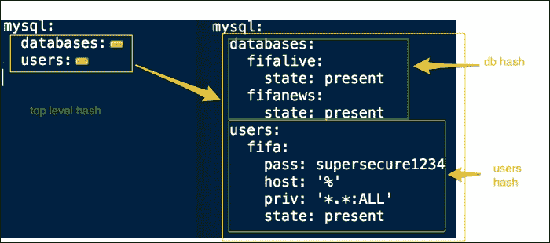

# 六、迭代控制结构——循环

在前一章中，您已经学习了条件控件。我们进入 Ansible 控制结构世界的旅程继续迭代控制。通常，我们需要创建一个目录列表，安装一堆包，或者定义并遍历嵌套的哈希或字典。传统的编程语言使用`for`或`while`循环进行迭代。Ansible 用`with`语句替换它们。

在本章中，我们将了解:

*   如何使用`with`语句使用迭代控制
*   如何循环数组一次创建多个对象
*   如何定义嵌套哈希并遍历它们来创建数据驱动的角色

# 无所不能的同语句

迭代简单的列表，解析字典，循环数字序列，解析路径和选择性地复制文件，或者只是从列表中随机选择一个项目，都可以使用“瑞士刀”实用程序`with`语句来实现。`with`语句采用以下形式:

```
with_xxx
```

这里`xxx`参数是需要循环的数据类型，例如，条目、字典等等。

下表列出了`with`语句可以迭代的数据类型:

<colgroup><col style="text-align: left"> <col style="text-align: left"> <col style="text-align: left"></colgroup> 
| 

建造

 | 

数据类型

 | 

描述

 |
| --- | --- | --- |
| `with_items` | 排列 | 这用于循环数组项。例如，这用于创建一组用户、目录或安装软件包列表。 |
| `with_nested` | 嵌套循环 | 这用于解析多维数组。例如，创建一个 MySQL 用户列表，并授予他们对一组数据库的访问权限。 |
| `with_dict` | 混杂 | 这个用于解析键值对的字典，并创建虚拟主机。 |
| `with_fileglobs` | 模式匹配的文件 | 这用于解析路径，并只复制符合特定模式的文件。 |
| `with_together` | 设置 | 这用于将两个数组连接成一个集合并在其上循环。 |
| `with_subelements` | 哈希子列 | 这用于解析哈希的子元素。例如，浏览 SSH 密钥列表并将其分发给用户。 |
| `with_sequence` | 整数序列 | 这用于循环一系列数字。 |
| `with_random_choice` | 随机选择 | 这用于以随机顺序从数组中拾取项目。 |
| `with_indexed_items` | 带索引的数组 | 这是一个带有索引的数组，在需要项的索引时很有用。 |

# 配置 WordPress 必需品

在[第 4 章](04.html "Chapter 4. Bringing In Your Code – Custom Commands and Scripts")、*中创建角色来安装 WordPress 时，我们创建了下载、提取和复制 WordPress 应用的任务。然而，这还不足以启动 WordPress，它有以下先决条件:*

*   网络服务器
*   网络服务器的 PHP 绑定
*   MySQL 数据库和 MySQL 用户

在我们的案例中已经安装了一个 Nginx 网络服务器和 MySQL 服务。我们仍然需要安装和配置 PHP 以及 MySQL 数据库和我们的 WordPress 应用所需的用户。为了处理 PHP 请求，我们选择实现 PHP5-FPM 处理程序，这是传统 FastCGI 实现的替代。

# PHP5-FPM 角色

在 **PHP5-FPM** 、 **FPM** 代表 **FastCGI 流程经理**。PHP5-FPM 比 **fastcgi** 具有更高级的功能，这对于管理高流量网站非常有用。适合服务我们的 fifanews 网站，预计一天点击数百万。遵循我们创建模块化代码的设计原则，我们将保持 PHP 功能的作用。让我们使用 Ansible-Galaxy 命令初始化 PHP5-FPM 角色，如下所示:

```
$ ansible-galaxy init --init-path roles/ php5-fpm

```

## 定义数组

PHP 安装将涉及多个包的安装，包括`php5-fpm`、`php5-mysql`等几个。到目前为止，我们一直在一次写一个任务。例如，让我们看一下下面的代码片段:

```
  - name: install php5-fpm
    apt: name: "php5-fpm" 
  - name: install php5-mysql
    apt: name: "php5-mysql"
```

但是，当我们想要安装多个包时，这可能会变得重复，还会导致代码冗余。由于致力于编写数据驱动的角色，我们将通过一个变量来驱动包的安装，该变量获取包的列表，然后迭代该列表。让我们开始定义列出包所需的参数，如下所示:

```
---
#filename: roles/php5-fpm/defaults/main.yml
#defaults file for php5-fpm
php5:
  packages:
    - php5-fpm
    - php5-common
    - php5-curl
    - php5-mysql
    - php5-cli
    - php5-gd
    - php5-mcrypt
    - php5-suhosin
    - php5-memcache
  service:
    name: php5-fpm
```

下面是对前面代码的分析:

*   `php5`变量是一个变量字典，它将包含我们传递给`php5-fpm`角色的所有参数。
*   `php5.packages`参数是一组包，在代码的每一行定义一个包。这将被传递给一个任务，该任务将迭代每个项目并安装它。
*   `php5.service`参数定义服务的名称，该名称将从服务任务中引用。

## 循环数组

现在让我们为`php5-fpm`角色创建任务。我们需要从阵列中安装软件包，然后启动服务。我们将把包的功能分成两个独立的任务文件，并从`main.yml`文件中调用它，如下所示:

```
---
#filename: roles/php5-fpm/tasks/main.yml
# tasks file for php5-fpm
- include_vars: "{{ ansible_os_family }}.yml"
  when: ansible_os_family != 'Debian'

- include: install.yml
- include: service.yml

#filename: roles/php5-fpm/tasks/install.yml
  - name: install php5-fpm and family
    apt:
      name: "{{ item }}"
    with_items: php5.packages
    notify:
     - restart php5-fpm service

#filename: roles/php5-fpm/tasks/service.yml
# manage php5-fpm service
- name: start php5-fpm service
  service:
    name: "{{ php5['service']['name'] }}"
    state: started
```

随着任务的进行，处理程序重新启动`php5-fpm`角色可以被编写，如下所示:

```
---
# filename: roles/php5-fpm/handlers/main.yml
# handlers file for php5-fpm
- name: restart php5-fpm service
  service: name="{{ php5['service']['name'] }}" state=restarted
```

让我们分析一下前面的代码:

*   **Main** :对于非 Debian 系统，`main.yml`文件包含基于`ansible_os_family`事实的变量。这对于重写特定于平台的变量非常有用。包含`vars`文件后，主要任务继续包含`install.yml`和`service.yml`文件。
*   **安装**:文件`install.yml`是我们迭代前面定义的包数组的地方。由于文件包含一个数组，我们使用带有`php5.packages`变量的`with.items`构造，并传递`{{ item }}`参数作为要安装的包的名称。我们也可以直接传递数组，如下所示:

    ```
      with_items:
        - php5-fpm
        - php5-mysql
    ```

*   **服务和处理程序**:文件`service.yml`和处理程序`main.yml`管理`php5-fom`服务的启动和重启。它需要一个字典变量`php5['service']['name']`来确定服务名称。

# 创建 MySQL 数据库和用户帐户

WordPress 是一个内容管理系统，需要一个 MySQL DB 来存储数据，比如帖子、用户等等。此外，它还需要一个拥有适当权限的 MySQL 用户从 WordPress 应用连接到数据库。我们在安装 MySQL 时只有一个管理员用户，但是，创建一个额外的用户帐户并在需要时授予用户权限是一个很好的做法。

## 创建哈希

一个**哈希表**，一个哈希表的缩写，是一个键值对的字典。创建多级变量是一种有用的数据结构，然后可以通过编程创建多个对象，每个对象都有自己的值。我们将数据库和用户定义为`group_vars` / `all`文件中的字典项目，如下所示:

```
#filename: group_vars/all
mysql_bind:  "{{ ansible_eth0.ipv4.address }}"
mysql:
  databases:
    fifalive:
      state: present
    fifanews:
      state: present
  users:
    fifa:
      pass: supersecure1234
      host: '%'
      priv: '*.*:ALL'
      state: present
```

下面是对前面代码的分析:

*   我们在`group_vars` / `all`文件中定义了这个变量散列，而不是在角色中。这是因为我们希望保持角色的通用性和可共享性，而不添加特定于我们各自环境的数据。
*   我们将数据库和用户配置定义为多级字典或哈希。

### 嵌套散列

这个多级散列是通过下图解释的:



以下描述了嵌套哈希的结构:

*   MySQL 变量是一个散列，有两个键:数据库和用户。例如:

    ```
    mysql:
        databases: value
         users: value
    ```

*   这两个键的值依次是关于数据库和要创建的用户的哈希值或信息字典。例如:

    ```
    databases:
        fifalive: value
        fifanews: value
    ```

*   每个数据库依次是键和值的字典。例如，对于 MySQL 用户`fifalive`，键值对为“状态:存在”。

## 迭代散列

创建数据库和用户帐户通常需要创建带有模板的自定义脚本，然后使用命令模块调用这些脚本。Ansible 反而自带电池，忠实于这个说法，它为我们提供了现成的模块来执行 MySQL 相关的任务，也就是`mysql_db`和`mysql_user`参数。使用`with_dict`语句，我们将浏览前面定义的数据库和用户字典，如下所示:

```
# filename: roles/mysql/tasks/configure.yml
 - name: create mysql databases
    mysql_db:
      name: "{{ item.key }}"
      state: "{{ item.value.state }}"
    with_dict: "{{ mysql['databases'] }}"

 - name: create mysql users
    mysql_user:
      name: "{{ item.key }}"
      host: "{{ item.value.host }}"
      password: "{{ item.value.pass }}"
      priv: "{{ item.value.priv }}"
      state: "{{ item.value.state }}"
    with_dict: "{{ mysql['users'] }}"
```

下面是对前面代码的分析:

*   `mysql['databases']`和`mysql['users']`参数是使用`with_dict`语句传递给任务的字典
*   每个字典或散列都有一个作为`{{ item.key }}`和`{{ item.value }}`参数传递的键值对
*   `{{ item.value }}`参数是字典。本词典中的每个键被称为`{{ item.value.<key> }}`。例如，`{{ item.value.state }}`参数

下图解释了如何解析这个嵌套散列:


# 创建 Nginx 虚拟主机

安装`php5-fpm`管理器并创建 MySQL 数据库和用户帐户后，剩下的最后一个配置是使用 Nginx 创建一个虚拟主机来服务我们的 WordPress 应用。我们之前安装的 Nginx web 服务器服务于一个简单的 HTML 页面，并不知道 WordPress 应用的存在，也不知道如何为它服务。让我们从添加这些配置开始。

## 定义 PHP 站点信息

除了我们正在建立的`fifanews.com`网站，未来我们可能还会推出一些与足球相关的网站。因此，我们需要有能力以编程方式用同一个 Nginx 服务器添加多个站点。创建一个字典来定义站点信息并将其嵌入到模板中听起来是一个不错的选择。由于站点信息是特定于我们的，我们将变量哈希添加到`group_vars`文件，如下所示:

```
#filename: group_vars/all
nginx:
  phpsites:
    fifanews:
      name: fifanews.com
      port: 8080
      doc_root: /var/www/fifanews
```

我们学会了如何从 Ansible 任务中解析这本词典。让我们添加一个任务，允许我们遍历这个字典，将值传递给模板，并创建虚拟主机配置:

```
#filename: roles/nginx/tasks/configure.yml
- name: create php virtual hosts
    template:
      src: php_vhost.j2
      dest: /etc/nginx/conf.d/{{ item.key }}.conf
    with_dict: "{{ nginx['phpsites'] }}"
    notify:
      - restart nginx service
```

该字典中的每一项都被传递给模板，在这种情况下，传递给`php_vhost.j2`参数。这又会读取散列并创建一个虚拟主机模板，该模板配置一个 PHP 应用，如下所示:

```
#filename: roles/nginx/templates/php_vhost.j2
#{{ ansible_managed }}

server {
    listen {{ item.value.port }};

  location / {
    root {{ item.value.doc_root }};
    index index.php;
  }

  location ~ .php$ {
    fastcgi_split_path_info ^(.+\.php)(.*)$;
    fastcgi_pass   backend;
    fastcgi_index  index.php;
    fastcgi_param  SCRIPT_FILENAME  {{ item.value.doc_root }}$fastcgi_script_name;
    include fastcgi_params;
  }
}
upstream backend {
  server 127.0.0.1:9000;
}
```

下面是对前面代码的分析:

*   `{{ ansible_managed }}`参数是一个特殊的变量，它添加了一个注释，通知服务器该文件由 Ansible 管理，以及 Ansible 存储库中该文件的路径、上次修改时间和修改该文件的用户。
*   模板获取一个字典项并解析其值，因为它是一个嵌套的散列。该模板配置为使用通过`nginx.phpsites`设置的字典值为 Nginx 创建一个 php 虚拟主机。
*   字典提供的配置参数包括 doc 根、端口、要使用的后端，这使得 Nginx 知道如何处理传入的 PHP 请求、要使用哪个后端、监听哪个端口等等。

最后，我们将新角色添加到`www.yaml`文件中，如下所示:

```
# www.yml
roles:
     - { role: nginx, when: ansible_os_family == 'Debian' }
     - php5-fpm
     - wordpress
```

使用以下命令运行行动手册:

```
$ ansible-playbook -i customhosts site.yml

```

运行完成后，是时候测试我们的工作了。让我们在浏览器中加载以下网址:

`http://<web_server_ip>:8080`

恭喜你！！我们已经成功地创建了一个 WordPress PHP 应用，带有 Nginx 网络服务器和 MySQL 后端，配置完整。现在，我们准备建立我们的 fifanews 站点:


# 复习问题

你认为你已经很好地理解了这一章吗？试着回答以下问题来测试你的理解能力:

1.  Ansible 中的哪个语句替代了`for`循环？
2.  `with_____`语句是如何用来迭代字典的？
3.  您将如何向模板添加语句，以打印修改的时间和人员？
4.  如何打印嵌套散列的值？

# 总结

在本章中，您学习了如何迭代创建多个对象。我们从全能`with`语句及其各种形式的概述开始。然后，我们更深入地迭代两个最基本的数据结构，即数组和散列。`php5-fpm`角色获取一个包含包列表的数组，并创建一个任务来循环安装这些包。为了创建 MySQL 数据库和用户，我们定义了变量字典或散列并迭代它们。最后，我们添加了 Nginx 模板配置，通过迭代嵌套字典来创建服务于 PHP 应用的多个虚拟主机。

在下一章中，您将学习如何使用魔法变量发现其他节点的信息。