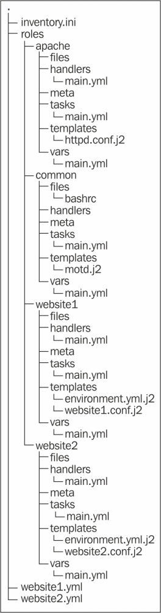

# 第四章：更大的项目

到目前为止，我们一直在一个 playbook 文件中查看单个 play。这种方法适用于简单的基础设施，或者在使用 Ansible 作为简单的部署机制时。然而，如果您有一个庞大而复杂的基础设施，那么您将需要采取措施防止事情失控。本章将包括以下主题：

+   将您的 playbooks 分成不同的文件，并从其他位置包括它们

+   使用角色包括执行类似功能的多个文件

+   增加 Ansible 配置机器速度的方法

# 包括

您将面临的第一个问题之一是，您的 playbooks 将迅速增加。大型 playbooks 可能变得难以阅读和维护。Ansible 允许您通过包括来解决这个问题。

包括允许您将您的 plays 分成多个部分。然后您可以从其他 plays 中包括每个部分。这使您可以为不同的目的构建几个不同的部分，全部包括在一个主要 play 中。

有四种包括，即变量包括，playbook 包括，任务包括和处理程序包括。从外部`vars_file`文件中包括变量已经在第二章中讨论过了，*简单 Playbooks*。以下是每个包括的描述：

+   **变量包括**：它们允许您将变量放在外部的 YAML 文件中

+   **Playbook 包括**：它们用于在单个 play 中包括其他文件中的 plays

+   **任务包括**：它们让您将常见任务放在其他文件中，并在需要时包括它们

+   **处理程序包括**：它们让您将所有处理程序放在一个地方

我们将在下一节中讨论这些包括；然而，从外部`vars_file`文件中包括变量已经在第二章中讨论过了，*简单 Playbooks*，所以我们不会详细讨论它。

## 任务包括

任务包括可用于重复的许多常见任务。例如，您可能有一组任务，它们在配置之前从监视器和负载均衡器中删除一个机器。您可以将这些任务放在一个单独的 YAML 文件中，然后从主任务中包括它们。

任务包括继承自它们所包含的 play 的事实。您还可以提供自己的变量，这些变量被传递到任务中并可供使用。

最后，任务包括可以对它们应用条件。如果这样做，条件将由 Ansible 自动分别添加到每个包含的任务中。任务仍然都包括在内。在大多数情况下，这不是一个重要的区别；然而，在变量可能改变的情况下，这是重要的。

作为任务包括的文件包含了一系列任务。如果您假设任何变量、主机或组的存在，那么您应该在文件顶部的注释中说明它们。这样可以更容易地供希望以后重用文件的人使用。

因此，如果您想创建一堆用户并设置他们的环境与他们的公钥，您将把执行单个用户的任务拆分到一个文件中。这个文件看起来类似于以下代码：

```
---
# Requires a user variable to specify user to setup
- name: Create user account
  user:
    name: "{{ user }}"
    state: present

- name: Make user SSH config dir
  file:
    path: "/home/{{ user }}/.ssh"
    owner: "{{ user }}"
    group: "{{ user }}"
    mode: 0600
    state: directory

- name: Copy in public key
  copy:
    src: "keys/{{ user }}.pub"
    dest: "/home/{{ user }}/.ssh/authorized_keys"
    mode: 0600
    owner: "{{ user }}"
    group: "{{ user }}"
```

我们期望一个名为`user`的变量将被传递给我们，并且他们的公钥将在`keys`目录中。账户被创建，`ssh config`目录被创建，最后我们可以将这个公钥复制进去。使用这个`config`文件的最简单方法是使用您在第三章中学到的`with_items`关键字。这将类似于以下代码：

```
---
- hosts: ansibletest
  user: root
  tasks:
    - include: usersetup.yml user={{ item }}
      with_items:
        - mal
        - dan
        - kate
```

## 处理程序包括

在编写 Ansible playbooks 时，你会不断发现自己多次重复使用相同的处理程序。例如，用于重新启动 MySQL 的处理程序在任何地方看起来都是一样的。为了使这更容易，Ansible 允许你在处理程序部分包含其他文件。处理程序包含看起来与任务包含相同。你应该确保在每个处理程序上包含一个名称；否则，你将无法在任务中轻松地引用它们。处理程序包含文件看起来类似于以下代码：

```
---
- name: config sendmail
  command: make -C /etc/mail
  notify: reload sendmail

- name: config aliases
  command: newaliases
  notify: reload sendmail

- name: reload sendmail
  service:
    name: sendmail
    state: reloaded

- name: restart sendmail
  service:
    name: sendmail
    state: restarted
```

这个文件提供了在配置`sendmail`后你想要处理的几个常见任务。通过在它们自己的文件中包含以下处理程序，你可以在需要更改`sendmail`配置时轻松重用它们。

+   第一个处理程序重新生成`sendmail`数据库的`config`文件，并稍后触发`sendmail`的`reload`文件

+   第二个处理程序初始化`aliases`数据库，并安排`sendmail`的`reload`文件

+   第三个处理程序重新加载`sendmail`；它可以由前两个作业触发，也可以直接从任务触发

+   第四个处理程序在触发时重新启动`sendmail`；如果你将`sendmail`升级到新版本，这将很有用

### 注意

处理程序可以触发其他处理程序，前提是它们只触发稍后指定的处理程序，而不是被触发的处理程序。这意味着你可以设置一系列互相调用的处理程序。这样可以避免在任务的通知部分中有长长的处理程序列表。

使用前面的处理程序文件现在很容易。我们只需要记住，如果我们更改了`sendmail`配置文件，那么我们应该触发`config sendmail`，如果我们更改了`aliases`文件，我们应该触发`config aliases`。以下代码向我们展示了一个例子：

```
---
  hosts: mailers
  tasks:
    - name: update sendmail
      yum:
        name: sendmail
        state: latest
      notify: restart sendmail

    - name: configure sendmail
      template:
        src: templates/sendmail.mc.j2 dest: /etc/mail/sendmail.mc
      notify: config sendmail

  handlers:
    - include: sendmailhandlers.yml
```

这个 playbook 确保`sendmail`已安装。如果它没有安装，或者没有运行最新版本，那么它会安装或更新它。更新后，它会安排重新启动，以便我们可以确信最新版本在 playbook 完成后运行。在下一步中，我们用我们的模板替换`sendmail`配置文件。如果`config`文件被模板更改，那么`sendmail`配置文件将被重新生成，最后`sendmail`将被重新加载。

## Playbook includes

当你想要包含一整套为一组机器指定的任务时，应该使用 Playbook includes。例如，你可能有一个 play，收集几台机器的主机密钥，并构建一个`known_hosts`文件复制到所有机器上。

虽然任务包含允许你包含任务，但 playbook 包含允许你包含整个 plays。这允许你选择你希望运行的主机，并为通知事件提供处理程序。因为你包含整个 playbook 文件，所以你也可以包含多个 plays。

Playbook includes 允许你嵌入完全独立的文件。因此，你应该提供它所需的任何变量。如果它依赖于任何特定的主机或组，这应该在文件顶部的注释中注明。

当你希望同时运行多个不同的操作时，这是很方便的。例如，假设我们有一个名为`drfailover.yml`的 playbook，用于切换到我们的 DR 站点，另一个名为`upgradeapp.yml`用于升级应用程序，另一个名为`drfailback.yml`用于失败回退，最后是`drupgrade.yml`。所有这些 playbooks 可能分别使用有效；然而，在执行站点升级时，你可能希望一次执行它们所有。你可以像下面的代码中所示那样做：

```
---
- include "drfailover.yml"
- include "upgradeapp.yml"
- include "drfailback.yml"

- name: Notify management
  hosts: local
  tasks:
    - mail
        to: "mgmt-team@example.com"
        msg: 'The application has been upgraded and is now live'

- include "drupgrade.yml"
```

正如你所看到的，你可以在包含其他 playbooks 的 playbooks 中放置完整的 plays。

# 角色

如果你的 playbooks 开始扩展超出了包含可以帮助你解决的范围，或者你开始收集大量模板，你可能想要使用角色。Ansible 中的角色允许你以定义的结构将文件组合在一起。它们本质上是包含的扩展，可以自动处理一些事情，这有助于你在存储库中组织它们。

角色允许你将变量、文件、任务、模板和处理程序放在一个文件夹中，然后轻松地包含它们。你还可以在角色内包含其他角色，这实际上创建了一个依赖树。与任务包含类似，它们可以接收传递给它们的变量。使用这些功能，你应该能够构建自包含的角色，方便与他人分享。

角色通常用于管理机器提供的服务，但它们也可以是守护进程、选项或简单的特性。你可能想要在角色中配置的内容如下：

+   Web 服务器，如 Nginx 或 Apache

+   根据机器的安全级别定制的每日消息

+   运行 PostgreSQL 或 MySQL 的数据库服务器

要管理 Ansible 中的角色，请执行以下步骤：

1.  创建一个名为 roles 的文件夹，其中包含你的 playbooks。

1.  在`roles`文件夹中，为每个你想要的角色创建一个文件夹。

1.  在每个角色的文件夹中，创建名为`files`、`handlers`、`meta`、`tasks`、`templates`和最后`vars`的文件夹。如果你不打算使用所有这些，可以省略你不需要的部分。当使用角色时，Ansible 会默默地忽略任何缺少的文件或目录。

1.  在你的 playbooks 中，添加关键字`roles`，后面跟着你想应用到主机的角色列表。

1.  例如，如果你有`common`、`apache`、`website1`和`website2`角色，你的目录结构将类似于以下示例。`site.yml`文件用于重新配置整个站点，`webservers1.yml`和`webservers2.yml`文件用于配置每个 Web 服务器群。

以下文件是`website1.yml`中可能包含的内容。它显示了一个应用`common`、`apache`和`website1`角色到清单中的`website1`组的 playbook。`website1`角色使用了更详细的格式，允许我们向角色传递变量，如下所示：

```
---
- name: Setup servers for website1.example.com
  hosts: website1
  roles:
    - common
    - apache
    - { role: website1, port: 80 }
```

对于名为`common`的角色，Ansible 将尝试加载`roles/common/tasks/main.yml`作为任务包含，`roles/common/handlers/main.yml`作为处理程序包含，`roles/common/vars/main.yml`作为变量文件包含。如果所有这些文件都缺失，Ansible 将抛出错误；但是，如果其中一个文件存在，那么其他缺失的文件将被忽略。默认安装的 Ansible 使用以下目录（其他目录可能由不同的模块使用）：

| 目录 | 描述 |
| --- | --- |
| `tasks` | `tasks`文件夹应包含一个`main.yml`文件，其中应包含此角色的任务列表。这些角色中包含的任何任务都将在此文件夹中查找它们的文件。这使你可以将大量任务拆分成单独的文件，并使用任务包含的其他功能。 |
| `files` | `files`文件夹是角色中由`copy`或`script`模块使用的文件的默认位置。 |
| `templates` | `templates`目录是模板模块自动查找角色中包含的 jinja2 模板的位置。 |
| `handlers` | `handlers`文件夹应包含一个`main.yml`文件，指定角色的处理程序，该文件夹中的任何包含也将在相同位置查找文件。 |
| `vars` | `vars`文件夹应包含一个`main.yml`文件，其中包含此角色的变量。 |
| `meta` | `meta`文件夹应包含一个`main.yml`文件。该文件可以包含角色的设置和其依赖项列表。此功能仅在 Ansible 1.3 及以上版本中可用。 |
| `default` | 如果您希望将变量发送到此角色，并且希望使它们可选，则应使用`default`文件夹。此文件夹中的`main.yml`文件将被读取，以获取可以被从 playbook 调用角色的变量覆盖的变量的初始值。此功能仅在 Ansible 1.3 及以上版本中可用。 |

在使用角色时，复制、模板和脚本模块的行为会略有改变。除了通过查找位于 playbook 文件所在目录中的文件来搜索文件外，Ansible 还将在角色的位置中查找文件。例如，如果您使用名为`common`的角色，这些模块的行为将更改为以下行为：

+   复制模块将在`roles/common/files`中查找文件。

+   模板模块将首先在`roles/common/templates`中查找模板。

+   脚本模块首先会在`roles/common/files`中查找文件。

+   其他模块可能决定在`roles/common/`内的其他文件夹中查找它们的数据。模块的文档可以使用`ansible-doc`检索，就像在第一章的*模块帮助*部分中讨论的那样，*开始使用 Ansible*。

# 角色元数据

使用角色元数据允许我们指定我们的角色依赖于其他角色。例如，如果您部署的应用程序需要发送电子邮件，则您的角色可以依赖于 Postfix 角色。这意味着在设置和安装应用程序之前，将安装和设置 Postfix。

`meta/main.yml`文件将类似于以下代码：

```
---
allow_duplicates: no
dependencies:
  - apache
```

`allow_duplicates`行设置为`no`，这是默认值。如果将其设置为`no`，则 Ansible 不会第二次运行角色，如果使用相同的参数两次。如果将其设置为`yes`，即使之前已经运行过，它也会重复运行角色。您可以将其设置为`off`而不是设置为`no`。

依赖项的格式与角色相同。这意味着您可以在这里传递变量；可以是静态值，也可以是传递给当前角色的变量。

# 角色默认值

与 Ansible 1.3 一起包含的第二个功能是变量默认值。如果在角色的默认目录中放置`main.yml`文件，则这些变量将被读入角色；但是，它们可以被`vars/main.yml`文件中的变量或包含角色时传递的变量覆盖。这允许您将传递给角色的变量设置为可选。这些文件看起来与其他变量文件完全相同。例如，如果在角色中使用名为`port`的变量，并且要将其默认为端口`80`，则`defaults/main.yml`文件将类似于以下代码：

```
---
port: 80
```

# 加快速度

随着您向 Ansible 配置中添加越来越多的机器和服务，您会发现事情变得越来越慢。幸运的是，有几个技巧可以让您在更大的规模上使用 Ansible。

## 配置

Ansible 不仅仅局限于能够配置我们的机器；我们还可以使用它来创建我们将要配置的机器。我们不仅仅局限于制作将要配置的机器，还可以制作网络、负载均衡器、DNS 条目，甚至整个基础架构。您甚至可以在配置机器之前自动执行此操作，方法是使用`group`、`group_by`和`add_host`模块。

在以下示例中，我们使用 Google Compute 创建两台机器，然后在它们上安装并启动 MySQL 服务器：

```
---
- name: Setup MySQL Infrastructure
  hosts: localhost
  connection: local
  tasks:
    - name: Start GCE Nodes
      gce:
        image: centos-6
        name: "mysql-{{ item }}"
        tags: mysql
        zone: us-central1-a
      with_sequence: count=2
      register: nodes
      when: '"mysql-{{ item }}" not in groups.all'

    - name: Wait for the nodes to start
      wait_for:
          host: "{{ item.instance_data[0].public_ip }}"
          port: 22
      with_items: nodes.results
      when: not item|skipped

    - name: Register the hosts in a group
      add_host:
          name: "{{ item.instance_data[0].name }}"
          ansible_ssh_host: "{{ item.instance_data[0].public_ip }}"
          groups: "tag_mysql"
      with_items: nodes.results
      when: not item|skipped

- name: Setup MySQL
  hosts: tag_mysql
  tasks:
    - name: Install MySQL
      yum:
        name: mysql
        state: present

    - name: Start MySQL
      service:
        name: mysqld
        state: started
        enabled: yes
```

## 标签

Ansible 标签是一种功能，允许您选择需要运行的 playbook 的部分，以及应该跳过的部分。虽然 Ansible 模块是幂等的，如果没有更改，它们将自动跳过，但这通常需要连接到远程主机。yum 模块通常在确定模块是否最新时速度相当慢，因为它需要刷新所有存储库。

如果您知道不需要运行某些操作，可以选择仅运行已标记特定标签的任务。这甚至不会尝试运行任务，它只是简单地跳过。即使没有任何操作要执行，这将节省几乎所有模块的时间。

假设您有一台拥有大量 shell 帐户的机器，但也设置了几个服务来运行。现在，想象一下一个用户的 SSH 密钥已经被泄露，需要立即删除。您可以简单地运行现有的 playbooks，带有 SSH 密钥标签，它只会运行必要的步骤来复制新密钥，立即跳过其他任何操作。

如果您有一个包含整个基础架构的 playbook，并且其中包含 playbook 包含，这将特别有用。通过这种设置，您可以尽快部署安全补丁，更改密码，并在整个基础架构中撤销密钥。

标记任务非常简单；只需添加一个名为`tag`的键，并将其值设置为您想要赋予它的标签列表。以下代码向我们展示了如何做到这一点：

```
---
- name: Install and setup our webservers
  hosts: webservers
  tasks:
  - name: install latest software
    yum
      name: "{{ item }}"
      state: latest
    notify: restart apache
    tags:
      - patch
    with_items:
    - httpd
    - webalizer

  - name: Create subdirectories
    file
      dest: "/var/www/html/{{ item }}"
      state: directory
      mode: 755 owner: apache
      group: apache
    tags:
      - deploy
    with_items:
      - pub

  - name: Copy in web files
    copy
      src: "website/{{ item }}"
      dest: "/var/www/html/{{ item }}"
      mode: 0755
      owner: apache
      group: apache
    tags:
      - deploy
    with_items:
      - index.html
      - logo.png
      - style.css
      - app.js
      - pub/index.html

  - name: Copy webserver config
    tags:
      - deploy
      - config
    copy
      src: website/httpd.conf
      dest: /etc/httpd/conf/httpd.conf
      mode: 0644
      owner: root
      group: root
    notify: reload apache

  - name: set apache to start on startup
    service
      name: httpd
      state: started
      enabled: yes

  handlers:
  - name: reload apache
    service: name=httpd state=reloaded

  - name: restart apache
    service: name=httpd state=restarted
```

此 play 定义了`patch`、`deploy`和`config`标签。如果您事先知道要执行的操作，可以使用正确的参数运行 Ansible，仅运行您选择的操作。如果您在命令行上没有提供标签，则默认情况下会运行每个任务。例如，如果您希望 Ansible 仅运行标记为`deploy`的任务，您将运行以下命令：

```
**$ ansible-playbook webservers.yml --tags deploy**

```

除了处理离散任务外，角色也可以使用标签，这使得 Ansible 仅应用于在命令行上提供的标签的角色。您可以类似地应用它们，就像它们应用于任务一样。例如，请参考以下代码：

```
---
- hosts: website1
  roles:
    - common
    - { role: apache, tags: ["patch"] }
    - { role: website2, tags: ["deploy", "patch"] }
```

在上述代码中，`common`角色不会得到任何标签，并且如果应用了任何标签，它将不会运行。如果应用了`patch`标签，则将应用`apache`和`website2`角色，但不会应用`common`。如果应用了`deploy`标签；只有`website2`标签将被运行。这将缩短打补丁服务器或运行部署所需的时间，因为不必要的步骤将被完全跳过。

## Ansible 的拉模式

Ansible 包含了一个拉模式，可以显著提高 playbook 的可扩展性。到目前为止，我们只讨论了使用 Ansible 通过 SSH 配置另一台机器。这与 Ansible 的拉模式形成对比，后者在您希望配置的主机上运行。由于`ansible-pull`在配置它的机器上运行，它不需要与其他机器建立连接，并且运行速度更快。在这种模式下，您可以在 git 存储库中提供配置，Ansible 会下载并用于配置您的机器。

您应该在以下情况下使用 Ansible 的拉模式：

+   在配置节点时，您的节点可能不可用，比如自动扩展服务器群的成员

+   您有大量的机器需要配置，即使使用大量的 forks 值，也需要很长时间来配置它们

+   您希望机器在存储库更改时自动更新其配置

+   您希望在可能没有网络访问权限的机器上运行 Ansible，比如在 kick start 后安装

然而，拉模式确实具有以下缺点，使其不适用于某些情况：

+   要连接到其他机器并收集变量，或者复制文件，您需要在受控节点上拥有凭据

+   您需要协调服务器群上的 playbook 运行；例如，如果一次只能使三台服务器脱机

+   服务器位于严格的防火墙后，不允许来自用于为 Ansible 配置它们的节点的传入 SSH 连接

拉取模式在您的 playbook 中不需要任何特殊设置，但是需要在要配置的节点上进行一些设置。在某些情况下，您可以使用 Ansible 的正常推送模式来执行此操作。以下是在机器上设置拉取模式的小玩法：

```
---
- name: Ansible Pull Mode
  hosts: pullhosts
  tasks:
    - name: Setup EPEL
      command: "rpm -ivh http://download.fedoraproject.org/pub/epel/6/i386/epel-release-6-8.noarch.rpm"
      args: creates=/etc/yum.repos.d/epel.repo

    - name: Install Ansible + Dependencies
      yum:
        name: "{{ item }}"
        state: latest
        enablerepo: epel
      with_items:
      - ansible
      - git-core

    - name: Make directory to put downloaded playbooks in
      file:
        state: directory
        path: /opt/ansiblepull

    - name: Setup cron
      cron:
        name: "ansible-pull"
        user: root
        minute: "*/5"
        state: present
        job: "ansible-pull -U https://git.int.example.com.com/gitrepos/ansiblepull.git -D /opt/ansiblepull {{ inventory_hostname_short }}.yml"
```

在本例中，我们执行了以下步骤：

1.  首先，我们安装并设置了**EPEL**。这是一个为 CentOS 提供额外软件的存储库。Ansible 可在 EPEL 存储库中获得。

1.  接下来，我们安装了 Ansible，并确保启用了 EPEL 存储库。

1.  然后，我们为 Ansible 的拉取模式创建了一个目录，以放置 playbooks。保留这些文件意味着您不需要一直下载整个 git 存储库；只需要更新即可。

1.  最后，我们设置了一个定时任务，每五分钟尝试运行`ansible-pull`模式配置。

### 注意

前面的代码从内部 HTTPS git 服务器下载存储库。如果您想要下载存储库而不是 SSH，则需要添加一步来安装 SSH 密钥，或者生成密钥并将其复制到 git 机器上。

# 存储机密信息

最终，您将需要在您的 Ansible 配方中包含敏感数据。到目前为止，我们讨论过的所有配方都必须以纯文本形式存储在磁盘上；如果您还将其存储在源代码控制中，则第三方甚至可能访问这些数据。这是有风险的，可能违反您的公司政策。

可以使用 Ansible 保险库来避免这种情况。保险库是加密的文件，可以由 Ansible 透明地解密。您可以将它们用于包含、变量文件、角色中的任务列表以及 Ansible 使用的任何其他 YAML 格式文件。您还可以将其与包含在`ansible-playbook`的`-e`命令行参数中的 JSON 和 YAML 文件一起使用。保险库文件由`ansible-vault`命令管理，并且可以像未加密的文件一样使用。

`ansible-vault`命令有几种模式，这些模式作为第一个参数给出。此表描述了这些模式：

| 模式 | 操作 |
| --- | --- |
| `创建` | 这将启动您的默认编辑器以创建一个新的加密文件 |
| `加密` | 这将加密现有文件，将其转换为保险库 |
| `编辑` | 这将编辑一个保险库，允许您更改内容 |
| `重新设置密码` | 这将更改用于加密保险库的密码 |
| `解密` | 这将解密保险库，将其转换回常规文件 |

例如，要为您的暂存环境创建一个新的变量文件，您将运行：

```
**$ ansible-vault create vars/staging.yml**

```

这个命令将提示您输入密码，要求您确认密码，然后打开您的编辑器，以便您添加内容；最后，加密的内容将保存在`vars/staging.yml`中。

在使用保险库文件时，您需要提供密码以便进行解密。有三种方法可以做到这一点。您可以给 Ansible 提供`--ask-vault-pass`参数，这将导致 Ansible 每次启动时提示输入密码。您还可以使用`--vault-password-file`参数，该参数指向包含密码的文件。最后，您可以将`vault_password_file`添加到`ansible.cfg`文件中，以便每次命令都自动使用保险库密码文件。重要的是要注意，每次 Ansible 运行只能提供一个密码，因此您不能包含具有不同密码的几个不同文件。

为了让 Ansible 提示输入密码来运行加密的 playbook，您需要执行以下操作：

```
**$ ansible-playbook --ask-vault-pass encrypted.yml**

```

### 注意

密码文件也可以是可执行文件。要打印到屏幕，请打印到标准错误，要从用户那里读取，您可以像往常一样使用`stdin`，最后脚本需要在退出之前将密码打印到`stdout`。

# 总结

在本章中，我们已经介绍了从简单设置转移到更大规模部署时所需的技术。我们讨论了如何使用包含来将你的 playbook 分成多个部分。然后，我们看了一下如何打包相关的包含，并使用角色自动全部包含它们。最后，我们讨论了拉取模式，它允许你在远程节点上自动化部署 playbook。

在下一章中，我们将介绍如何编写自己的模块。我们首先通过使用 bash 脚本构建一个简单的模块来开始。然后，我们将看看 Ansible 是如何搜索模块的，以及如何让它找到你自己定制的模块。接下来，我们将介绍如何使用 Python 编写更高级的模块，利用 Ansible 提供的功能。最后，我们将编写一个脚本，配置 Ansible 从外部来源获取清单。
