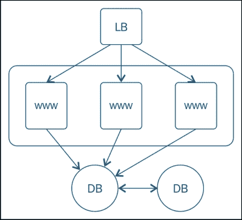
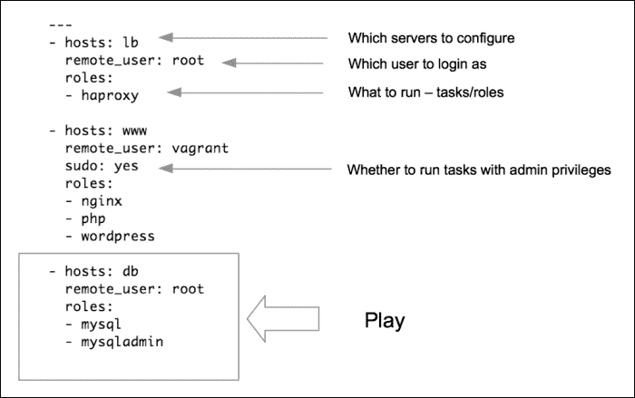
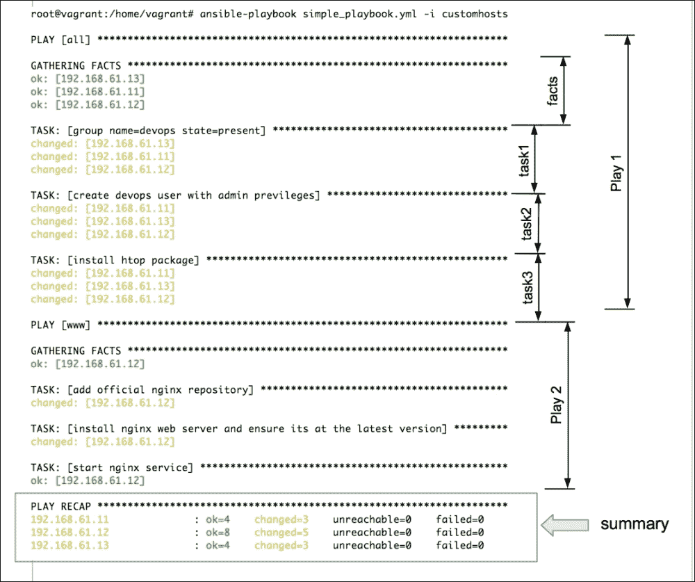

# 第二章：蓝图化您的基础设施

这本书是为那些对 Ansible 有概念性知识并想开始编写 Ansible playbook 自动化常见基础设施任务、编排应用部署和/或管理多个环境配置的人而设计的入门指南。本书采用渐进式方法，从基础知识开始，比如学习 playbook 的解剖学和编写简单角色以创建模块化代码。一旦熟悉了基础知识，您将被介绍如何使用变量和模板添加动态数据，并使用条件和迭代器控制执行流程等基本概念。然后是更高级的主题，比如节点发现、集群化、数据加密和环境管理。最后我们将讨论 Ansible 的编排特性。让我们通过学习 playbooks 来开始成为 Ansible 实践者的旅程吧。

在本章中，我们将学习：

+   Playbook 的解剖学

+   什么是 plays 以及如何编写主机清单和搜索模式

+   Ansible 模块和“电池内置”方法

# 熟悉 Ansible

**Ansible** 是一个简单、灵活且非常强大的工具，它能够帮助您自动化常见的基础设施任务、运行临时命令并部署跨多台机器的多层应用程序。虽然您可以使用 Ansible 同时在多个主机上启动命令，但其真正的力量在于使用 playbooks 管理这些主机。

作为系统工程师，我们通常需要自动化的基础设施包含复杂的多层应用程序。其中每个代表一类服务器，例如负载均衡器、Web 服务器、数据库服务器、缓存应用程序和中间件队列。由于这些应用程序中的许多必须一起工作才能提供服务，所以还涉及拓扑。例如，负载均衡器会连接到 Web 服务器，后者会读写数据库并连接到缓存服务器以获取内存中的对象。大多数情况下，当我们启动这样的应用程序堆栈时，我们需要按照非常具体的顺序配置这些组件。

这里是一个非常常见的三层 Web 应用程序示例，其中包括一个负载均衡器、一个 Web 服务器和一个数据库后端：



Ansible 允许您将此图表转换为蓝图，定义您的基础设施策略。用于指定此类策略的格式就是 playbook。

示例策略及其应用顺序如下步骤所示：

1.  在数据库服务器上安装、配置和启动 MySQL 服务。

1.  安装和配置运行 **Nginx** 和 **PHP** 绑定的 Web 服务器。

1.  在 Web 服务器上部署 Wordpress 应用程序，并向 Nginx 添加相应的配置。

1.  在部署 Wordpress 后在所有 Web 服务器上启动 Nginx 服务。最后，在负载均衡器主机上安装、配置和启动**haproxy**服务。更新 haproxy 配置以包含之前创建的所有 Web 服务器的主机名。

以下是一个示例 Playbook，将基础设施蓝图转换为 Ansible 可执行的策略：



# Plays

一个 Playbook 包含一个或多个 Play，将主机组映射到明确定义的任务。上述示例包含三个 Play，每个 Play 用于配置多层 Web 应用程序中的一个层。Play 也定义了任务配置的顺序。这使我们能够编排多层部署。例如，仅在启动 Web 服务器后配置负载均衡器，或执行两阶段部署，其中第一阶段仅添加这些配置，第二阶段按预期顺序启动服务。

## YAML – Playbook 语言

正如你可能已经注意到的，我们之前编写的 Playbook 更像是一个文本配置，而不是一个代码片段。这是因为 Ansible 的创建者选择使用简单、易读且熟悉的 YAML 格式来蓝图基础设施。这增加了 Ansible 的吸引力，因为这个工具的用户无需学习任何特殊的编程语言即可开始使用。Ansible 代码是自解释且自描述的。对 YAML 的快速入门就足以理解基本语法。以下是您需要了解的有关 YAML 的内容，以便开始您的第一个 Playbook：

+   Playbook 的第一行应以 "--- "（三个连字符）开头，表示 YAML 文档的开始。

+   在 YAML 中，列表以一个连字符和一个空格表示。Playbook 包含一系列 Play；它们用 "- " 表示。每个 Play 都是一个关联数组、字典或映射，具有键值对。

+   缩进很重要。列表的所有成员应位于相同的缩进级别。

+   每个 Play 都可以包含用 ":" 分隔的键值对，以表示主机、变量、角色、任务等。

# 我们的第一个 Playbook

配备了前面解释的基本规则，并假设读者已经对 YAML 基础知识有所了解，我们现在将开始编写我们的第一个 Playbook。我们的问题陈述如下：

1.  在所有主机上创建一个 devops 用户。该用户应该是 `devops` 组的一部分。

1.  安装 "htop" 实用程序。**Htop**是 top 的改进版本——一个交互式系统进程监视器。

1.  将 Nginx 仓库添加到 Web 服务器，并将其作为服务启动。

现在，我们将创建我们的第一个 Playbook 并将其保存为 `simple_playbook.yml`，其中包含以下代码：

```
---
- hosts: all
  remote_user: vagrant
  sudo: yes
  tasks:

  - group:
      name: devops
      state: present
  - name: create devops user with admin privileges

    user:
      name: devops
      comment: "Devops User"
      uid: 2001
      group: devops
  - name: install htop package
    action: apt name=htop state=present update_cache=yes

- hosts: www
  user: vagrant
  sudo: yes
  tasks:
  - name: add official nginx repository
    apt_repository:
      repo: 'deb http://nginx.org/packages/ubuntu/ lucid nginx'
  - name: install nginx web server and ensure its at the latest version
    apt:
      name: nginx
      state: latest
  - name: start nginx service
    service:
      name: nginx
      state: started
```

我们的 Playbook 包含两个 Play。每个 Play 包含以下两个重要部分：

+   **要配置什么**：我们需要配置一个主机或一组主机来运行剧本。此外，我们需要包含有用的连接信息，例如要连接为哪个用户，是否使用`sudo`命令等。

+   **要运行什么**：这包括要运行的任务的规范，包括要修改的系统组件以及它们应该处于的状态，例如，安装、启动或最新状态。这可以用任务来表示，稍后可以通过角色来表示。

现在让我们简要介绍一下每个。

## 创建主机清单

即使在我们开始使用 Ansible 编写剧本之前，我们也需要定义一个所有需要配置的主机的清单，并使其可供 Ansible 使用。稍后，我们将开始对此清单中的一些主机运行剧本。如果您有现有的清单，例如 cobbler、LDAP、CMDB 软件或希望从云提供商（如 ec2）那里拉取清单，则可以使用动态清单的概念从 Ansible 那里拉取。

对于基于文本的本地清单，默认位置是`/etc/ansible/hosts`。然而，对于我们的学习环境，我们将在工作目录中创建一个自定义清单文件`customhosts`，其内容如下所示。您可以自由创建自己的清单文件：

```
#customhosts
#inventory configs for my cluster
[db]
192.168.61.11  ansible_ssh_user=vagrant

[www]
www-01.example.com ansible_ssh_user=ubuntu
www-02 ansible_ssh_user=ubuntu

[lb]
lb0.example.com
```

现在，当我们的剧本将一场戏映射到该组时，`www`（`hosts:` `www`），该组中的主机将被配置。 `all`关键字将匹配清单中的所有主机。

以下是创建清单文件的指南：

+   清单文件遵循 INI 风格的配置，基本上包含以包含在“`[ ]`”中的主机组/类名开头的配置块。这允许选择性地在系统类别上执行操作，例如，`[namenodes]`。

+   单个主机可以是多个组的一部分。在这种情况下，来自两个组的主机变量将被合并，并且优先规则适用。稍后我们将详细讨论变量和优先级。

+   每个组包含主机列表和连接详细信息，例如要连接的 SSH 用户、如果不是默认值的 SSH 端口号、SSH 凭据/密钥、sudo 凭据等。主机名还可以包含通配符、范围等，以便轻松地包含相同类型的多个主机，这些主机遵循一些命名模式。

### 提示

创建主机清单后，最好使用 Ansible 的 ping 模块进行连接性验证（例如，`ansible -m ping all`）。

## 模式

在上一个剧本中，以下行决定了选择哪些主机来运行特定的剧本：

```
- hosts: all
- hosts: www
```

第一行代码将匹配所有主机，而第二行代码将匹配属于`www`组的主机。

模式可以是以下任何一个或它们的组合：

| 模式类型 | 示例 |
| --- | --- |
| 组名 | `namenodes` |
| 匹配全部 | `all`或`*` |
| 范围 | `namenode[0:100]` |
| 主机名/主机名模式 | `*.example.com`，`host01.example.com` |
| 排除 | `namenodes:!secondaynamenodes` |
| 交集 | `namenodes:&zookeeper` |
| 正则表达式 | `~(nn&#124;zk).*\.example\.org` |

## 任务

Plays 将主机映射到任务。任务是针对与播放中指定的模式匹配的一组主机执行的操作序列。每个播放通常包含在匹配模式的每台机器上串行运行的多个任务。例如，看下面的代码片段：

```
- group:
 name:devops
 state: present
- name: create devops user with admin privileges
 user:
 name: devops
 comment: "Devops User"
 uid: 2001
 group: devops

```

在上述示例中，我们有两个任务。第一个是创建一个组，第二个是创建一个用户并将其添加到之前创建的组中。如果你注意到，第二个任务中有一行额外的内容，以 `name:` 开头。在编写任务时，最好提供一个名称，描述这个任务将实现什么。如果没有，将打印动作字符串。

任务列表中的每个操作都可以通过指定以下内容来声明：

+   模块的名称

+   可选地，管理的系统组件的状态

+   可选参数

### 提示

使用更新的 Ansible 版本（从 0.8 开始），现在写入一个动作关键字是可选的。我们可以直接提供模块的名称。因此，这两行将具有相似的动作，即。使用 `apt` 模块安装软件包：

```
action: apt name=htop state=present update_cache=yes
apt: name=nginx state=latest

```

Ansible 以其一体化的方法脱颖而出，与其他配置管理工具不同。这些“电池”即为“模块”。在继续之前了解模块的含义是很重要的。

### 模块

模块是负责在特定平台上管理特定系统组件的封装程序。

考虑以下示例：

+   `apt` 模块用于 Debian，而 `yum` 模块用于 RedHat，有助于管理系统包

+   `user` 模块负责在系统上添加、删除或修改用户

+   `service` 模块将启动/停止系统服务

模块将实际的实现与用户抽象出来。它们公开了一个声明性语法，接受一系列参数和要管理的系统组件的状态。所有这些都可以使用人类可读的 YAML 语法，使用键-值对来声明。

在功能上，对于熟悉 Chef/Puppet 软件的人来说，模块类似于提供程序。与编写创建用户的流程不同，使用 Ansible，我们声明我们的组件应处于哪种状态，即应创建哪个用户，其状态及其特征，如 UID、组、shell 等。实际的过程是通过模块隐含地为 Ansible 所知，并在后台执行。

### 提示

`Command` 和 `Shell` 模块是特殊的模块。它们既不接受键-值对作为参数，也不是幂等的。

Ansible 预先安装了一系列模块库，从管理基本系统资源的模块到发送通知、执行云集成等更复杂的模块。如果您想要在远程 PostgreSQL 服务器上配置 ec2 实例、创建数据库，并在 **IRC** 上接收通知，那么 Ansible 就有一个模块可供使用。这难道不是令人惊讶的吗？

无需担心找外部插件，或者努力与云提供商集成等。要查看可用模块的列表，您可以参考 Ansible 文档中的 [`docs.ansible.com/list_of_all_modules.html`](http://docs.ansible.com/list_of_all_modules.html)。

Ansible 也是可扩展的。如果找不到适合您的模块，编写一个模块很容易，而且不一定要用 Python。模块可以用您选择的语言为 Ansible 编写。这在 [`docs.ansible.com/developing_modules.html`](http://docs.ansible.com/developing_modules.html) 中有详细讨论。

#### 模块和幂等性

幂等性是模块的一个重要特征。它可以多次应用于系统，并返回确定性的结果。它具有内置的智能。例如，我们有一个使用 `apt` 模块安装 Nginx 并确保其为最新版本的任务。如果多次运行它，会发生以下情况：

+   每次运行幂等性时，`apt` 模块都会比较 playbook 中声明的内容与系统上该软件包的当前状态。第一次运行时，Ansible 将确定 Nginx 未安装，并继续安装。

+   对于每次后续运行，它都会跳过安装部分，除非在上游仓库中有新版本的软件包可用。

这允许多次执行相同的任务而不会导致错误状态。大多数 Ansible 模块都是幂等的，除了 command 和 shell 模块。用户需要使这些模块幂等。

## 运行 playbook

Ansible 配备了 `ansible-playbook` 命令来启动 playbook。现在让我们运行我们创建的 plays：

```
$ ansible-playbook simple_playbook.yml -i customhosts

```

运行上述命令时会发生以下情况：

+   `ansible-playbook` 参数是一个命令，它将 playbook 作为参数（`simple_playbook.yml`）并对主机运行 plays。

+   `simple_playbook` 参数包含我们创建的两个 plays：一个用于常规任务，另一个用于安装 Nginx。

+   `customhosts` 参数是我们主机清单，它让 Ansible 知道要针对哪些主机或主机组执行 plays。

启动上述命令将开始调用 plays，在 playbook 中描述的顺序中进行编排。以下是上述命令的输出：



现在让我们分析发生了什么：

+   Ansible 读取指定为`ansible-playbook`命令参数的 playbooks，并开始按顺序执行 play。

+   我们声明的第一个 play 针对"`all`"主机运行。`all`关键字是一种特殊模式，将匹配所有主机（类似于`*`）。因此，第一个 play 中的任务将在我们作为参数传递的清单中的所有主机上执行。

+   在运行任何任务之前，Ansible 将收集有关将要配置的系统的信息。这些信息以事实的形式收集。

+   第一个 play 包括创建`devops`组和用户，并安装 htop 包。由于我们的清单中有三个主机，所以每个主机被打印一行，这表明被管理实体的状态是否发生了变化。如果状态没有更改，将打印“ok”。

+   然后 Ansible 转移到下一个 play。这只在一个主机上执行，因为我们在 play 中指定了"`hosts:www`"，而我们的清单中只包含一个位于组"`www`"中的单个主机。

+   在第二个 play 期间，添加了 Nginx 存储库，安装了该软件包，并启动了该服务。

+   最后，Ansible 会在"`PLAY RECAP`"部分打印播放概要。它指示进行了多少修改，如果其中任何主机无法访问，或者在任何系统上执行失败。

### 小贴士

如果主机无响应或无法运行任务怎么办？Ansible 具有内置智能，将识别此类问题并将失败的主机从轮换中移出。这不会影响其他主机的执行。

# 复习问题

你认为你已经充分理解了这一章吗？试着回答以下问题来测试你的理解：

1.  当涉及到模块时，幂等性是什么？

1.  主机清单是什么，为什么需要它？

1.  Playbooks 将 ___ 映射到 ___（填空）

1.  在选择要对其运行 plays 的主机列表时，可以使用哪些类型的模式？

1.  实际执行特定平台上操作的程序在哪里定义？

1.  为什么说 Ansible 自带电池？

# 总结

在本章中，您了解了 Ansible playbooks 是什么，它们由哪些组件组成，以及如何使用它来为基础设施提供蓝图。我们还对 YAML 进行了简要介绍——用于创建 plays 的语言。您了解了 plays 如何将任务映射到主机，如何创建主机清单，如何使用模式过滤主机以及如何使用模块在我们的系统上执行操作。然后，我们创建了一个简单的 playbook 作为概念验证。

在即将到来的章节中，我们将开始重构我们的代码，创建可重用和模块化的代码块，并称之为角色。
