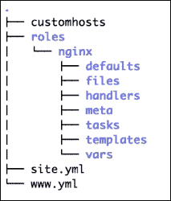
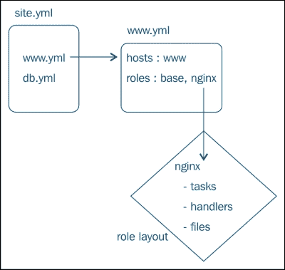
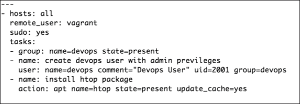
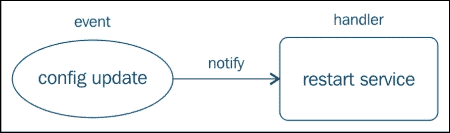
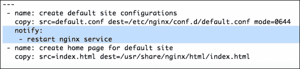
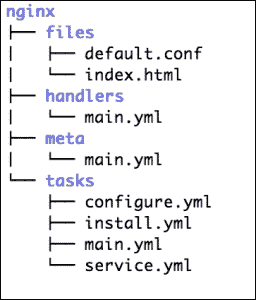
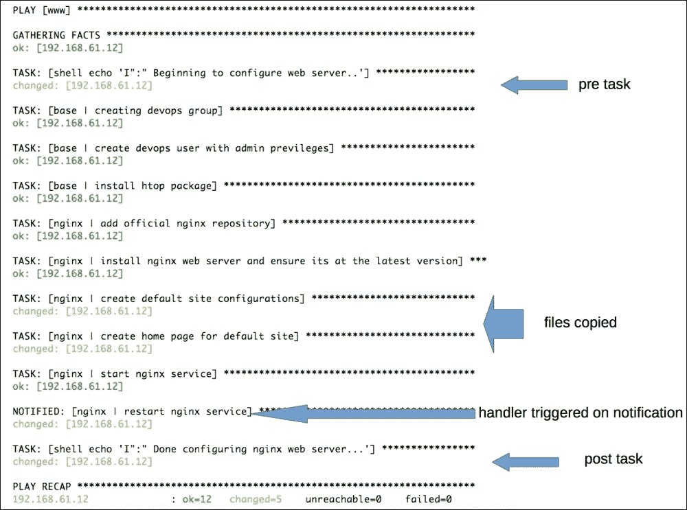

# 第三章：使用 Ansible 角色进行模块化

在上一章中，你学习了使用 Ansible 编写简单 playbook。你还了解了将主机映射到任务的 plays 概念。在单个 playbook 中编写任务对于非常简单的设置可能效果很好。然而，如果我们有多个跨越多个主机的应用程序，这将很快变得难以管理。

在本章中，你将会接触到以下概念：

+   什么是角色，角色用于什么？

+   如何创建角色以提供抽象化？

+   组织内容以提供模块化

+   使用包含语句

+   编写简单任务和处理程序

+   使用 Ansible 模块安装包、管理服务和提供文件

# 理解角色

在现实生活中的场景中，我们大多数时间都会配置 web 服务器、数据库服务器、负载均衡器、中间件队列等等。如果你退一步看一下大局，你会意识到你正在以可重复的方式配置一组相同的服务器。

为了以最有效的方式管理这样的基础设施，我们需要一些抽象化的方法，使我们能够定义每个组中需要配置的内容，并通过名称进行调用。这正是角色所做的。Ansible 角色允许我们同时配置多个节点组，而不需要重复自己。角色还提供了一种创建模块化代码的方法，然后可以共享和重用。

# 命名角色

一个常见的做法是创建映射到你想要配置的基础设施的每个应用程序或组件的角色。例如：

+   Nginx

+   MySQL

+   MongoDB

+   Tomcat

# 角色的目录布局

角色只不过是以特定方式布局的目录。角色遵循预定义的目录布局约定，并期望每个组件都在为其准备的路径中。

以下是一个名为 Nginx 的角色示例：



现在让我们看看游戏规则以及前面图表中的每个组件的作用：

+   每个角色都包含一个以自己命名的目录，例如，`Nginx`，其父目录为`roles/`。每个命名角色目录包含一个或多个可选的子目录。最常见的子目录通常包含 `tasks`、`templates` 和 `handlers`。每个子目录通常包含 `main.yml` 文件，这是一个默认文件。

+   任务包含核心逻辑，例如，它们将具有安装包、启动服务、管理文件等代码规范。如果我们将角色比作电影，那么任务将是主角。

+   任务本身无法完成所有工作。考虑我们与电影的类比，缺少支持角色是不完整的。主角有朋友、车辆、爱人和反派分子，来完成故事。同样，任务消耗数据，调用静态或动态文件，触发动作等。这就是文件、处理程序、模板、默认值和`vars`发挥作用的地方。让我们看看这些是什么。

+   `Vars`和默认值提供了关于您的应用程序/角色的数据，例如，您的服务器应该运行在哪个端口，存储应用程序数据的路径，应该以哪个用户身份运行服务等等。默认变量是在 1.3 版本中引入的，这些可以为我们提供合理的默认值。这些稍后可以被其他地方覆盖，例如，`vars`、`group_vars`和`host_vars`。变量被合并，并且存在优先规则。这给了我们很大的灵活性来有选择性地配置我们的服务器。例如，在除了在暂存环境中应该在端口`8080`上运行之外的所有主机上运行 web 服务器，在端口`80`上。

+   文件和模板子目录提供了管理文件的选项。通常，文件子目录用于将静态文件复制到目的主机，例如，一些应用程序安装程序将静态文本文件存档，等等。除了静态文件，你可能经常需要管理动态生成的文件。例如，具有参数（例如端口、用户和内存）的配置文件，可以使用变量动态提供。生成这些文件需要一种称为模板的特殊类型的原始。

+   任务可以根据状态或条件的更改触发动作。在电影中，主角可以追逐反派，基于挑衅或事件进行报复。一个例子是绑架主角的爱人这个事件。同样地，您可能需要根据之前发生的事情在您的主机上执行一个动作，例如，重新启动一个服务，这可能是由于配置文件状态的更改。可以使用处理程序指定此触发-动作关系。

继续我们的类比，许多热门电影有续集，有时甚至有前传。在这种情况下，应该按照特定的顺序观看，因为续集的故事情节取决于发生在以前的电影中的事情。同样地，一个角色可以依赖于另一个角色。一个非常常见的例子是，在安装 Tomcat 之前，系统上应该存在 Java。这些依赖关系定义在一个角色的 meta 子目录中。

让我们通过为 Nginx 应用程序创建一个角色来动手实践这个。让我们提出一个问题陈述，尝试解决它，并在过程中了解角色。

考虑以下情景。随着足球世界杯的开始，我们需要创建一个 Web 服务器来提供有关体育新闻的页面。

作为敏捷方法的追随者，我们将分阶段进行。在第一阶段，我们将只安装一个 Web 服务器并提供一个主页。现在让我们将此分解为实现此目标所需的步骤：

1.  安装一个 Web 服务器。在这种情况下，我们将使用'Nginx'，因为它是一个轻量级的 Web 服务器。

1.  管理 Nginx Web 服务器的配置。

1.  安装完成后启动 Web 服务器。

1.  复制一个 HTML 文件，它将作为主页提供。

现在我们已经确定了要采取的步骤，我们还需要将它们映射到我们将用于实现每个步骤的相应模块类型：

+   安装 Nginx = 包模块（apt）

+   配置 Nginx = 文件模块（file）

+   启动 Nginx = 系统模块（service）

+   提供网页 = 文件模块（file）

在我们开始编写代码之前，我们将先创建一个布局来组织我们的文件。

# 创建站点范围的播放，嵌套和使用 include 语句

作为最佳实践，我们将创建一个顶级文件，其中将包含我们完整基础设施的蓝图。从技术上讲，我们可以将所有需要配置的内容都包含在一个文件中。但是，这会有两个问题：

+   随着我们开始向这个单一文件添加任务、变量和处理程序，它会很快失控。维护这样的代码将是一场噩梦。

+   这也将难以重用和共享这样的代码。使用 Ansible 等工具的优点之一是它能够将数据与代码分离。数据是组织特定的，而代码是通用的。然后，可以与其他人共享此通用代码。但是，如果您将所有内容都写在一个文件中，这将是不可能的。

为了避免这个问题，我们将以模块化的方式开始组织我们的代码，如下所示：

+   我们将为需要配置的每个应用程序创建角色。在这种情况下，它是 Nginx

+   我们的 Web 服务器可能需要安装除了 Nginx 之外的多个应用程序，例如 PHP 和 OpenSSL。为了封装所有这些内容，我们将创建一个名为`www.yml`的播放。

+   我们创建的前置播放将主机与 Nginx 角色进行映射。我们以后可能会添加更多角色。

+   我们将把这个播放添加到顶层播放，即`site.yml`

以下图表简要描述了前面的步骤：



这是我们的`site.yml`文件：

```
---
# site.yml : This is a sitewide playbook
- include: www.yml
```

前面的 `include` 指令帮助我们模块化代码。我们不是将所有内容都写在一个文件中，而是拆分逻辑并导入所需的内容。在这种情况下，我们将包含另一个播放，称为**嵌套播放**。

以下是一些关于可以包含和如何包含的指南：

+   `include`指令可用于包含任务、处理程序，甚至其他播放

+   如果您在另一个文件中包含一个播放，就像我们在`site.yml`文件中所做的那样，您不能替换变量

+   `include` 关键字可与常规任务/处理程序规格结合使用。

+   可以在 include 语句中传递参数。这被称为**参数化 include**。

### 提示

**Roles 和自动包括**

Roles 具有隐式规则来自动包括文件。只要遵循目录布局约定，您可以确保所有任务、处理程序以及其他文件都会自动包含。因此，创建与 Ansible 指定的完全相同名称的子目录非常重要。

# 创建 www playbook

我们创建了一个网站范围的 playbook，并使用 include 语句来调用另一个名为`www.yml`的 playbook。我们现在将创建这个文件，其中包含一个 play，将我们的 web 服务器主机映射到 Nginx role：

```
---
#www.yml : playbook for web servers
- hosts: www
  remote_user: vagrant
  sudo: yes
  roles:
     - nginx
```

以上代码的工作方式如下：

+   在任何映射到 hosts 文件中指定的`[www]`组的主机上运行此代码。

+   对于`roles/nginx/*`文件内的每个目录，将`roles/nginx/*/main.yml`包含到 play 中。这包括`tasks`、`handlers`、`vars`、`meta`、`default`等等。这就是自动包括规则适用的地方。

## 默认和自定义 role 路径

默认情况下，Ansible 会查找我们为其创建 playbooks 的项目的子目录`roles/`。作为一流的 devops 工程师，我们将遵循最佳实践，建立一个集中的、版本受控的仓库，用于存储您的所有 role。我们可能最终会重用 community 创建的 roles。这样做后，我们可以在多个项目中重用这些 roles。在这种情况下，我们将在一个或多个位置检出代码，例如：

+   `/deploy/ansible/roles`

+   `/deploy/ansible/community/roles`

对于非默认路径，我们需要在 `ansible.cfg` 中添加`roles_path`参数，如下命令所示：

```
roles_path = /deploy/ansible/roles:/deploy/ansible/community/roles

```

## 参数化 roles

有时，我们可能需要在 role 的 vars 或 default 目录中覆盖默认参数，例如，在端口 8080 上运行 web 服务器而不是 80。在这种情况下，我们也可以在前面的 playbook 中传递参数给 roles，如下所示：

```
---
#www.yml : playbook for web servers
- hosts: www
  roles:
- { role: nginx, port: 8080 }
```

# 创建一个基本 role

在上一章中，我们创建了一个简单的 playbook，所有 play 都写在同一个文件中。在发现关于 roles 的新信息后，我们将开始重构我们的代码，使其具有模块化。

## 重构我们的代码 — 创建一个基本 role

我们在`simple_playbook.yml`文件中编写了两个 play。我们打算在所有主机上运行第一个 play。该 play 有任务来创建用户，安装必要的软件包，等等：



将所有这类基本任务组合在一起并创建一个基本 role 是一种良好的实践。您可以将其命名为 base、common、essential 或任何您喜欢的名称，但概念是相同的。我们现在将此代码移至 base role 中：

1.  为基本 role 创建目录布局。由于我们只会指定任务，所以我们只需要在 base 内创建一个子目录：

    ```
    $ mkdir -p roles/base/tasks

    ```

1.  在 `roles/base/tasks` 目录下创建 `main.yml` 文件，以指定基本角色的任务。

1.  编辑 `main.yml` 文件，并添加以下代码：

    ```
    ---
    # essential tasks. should run on all nodes
     - name: creating devops group
       group: name=devops state=present
     - name: create devops user
       user: name=devops comment="Devops User" uid=2001 group=devops
     - name: install htop package
       action: apt name=htop state=present update_cache=yes
    ```

# 创建 Nginx 角色

现在我们将为 Nginx 创建一个单独的角色，并将之前在 `simple_playbook.yml` 文件中编写的代码移动到其中，如下所示：

1.  为 Nginx 角色创建目录布局：

    ```
    $ mkdir roles/nginx
    $ cd roles/nginx
    $ mkdir tasks meta files
    $ cd tasks

    ```

1.  在 `roles/base` 目录下创建 `install.yml` 文件。将与 Nginx 相关的任务移动到其中。它应该如下所示：

    ```
    ---
     - name: add official nginx repository
       apt_repository: repo='deb http://nginx.org/packages/ubuntu/ lucid nginx'
     - name: install nginx web server and ensure its at the latest version
       apt: name=nginx state=latest force=yes
    ```

1.  我们还将创建 `service.yml` 文件来管理 Nginx 守护程序的状态：

    ```
    ---
     - name: start nginx service
       service: name=nginx state=started
    ```

1.  我们之前看过 `include` 指令。我们将使用它来在 `main.yml` 文件中包含 `install.yml` 和 `service.yml` 文件，如下所示：

    ```
    ---
    # This is main tasks file for nginx role
     - include: install.yml
    - include: service.yml
    ```

### 提示

**最佳实践**

为什么我们要创建多个文件来分别保存安装包和管理服务的代码呢？因为精心设计的角色允许您选择性地启用特定的功能。例如，有时您可能想要在多个阶段部署服务。在第一阶段，您可能只想安装和配置应用程序，并在部署的第二阶段才启动服务。在这种情况下，具有模块化任务可以帮助。您始终可以将它们全部包含在 `main.yml` 文件中。

## 添加角色依赖关系

在基本角色中指定了一些重要的任务。我们可以不断添加更多任务，这些任务是后续应用程序的先决条件。在这种情况下，我们希望我们的 Nginx 角色依赖于基本角色。现在让我们在 meta 子目录中指定这个依赖关系。让我们看看以下步骤：

1.  在 `roles/nginx/meta/main.yml` 路径下创建 `main.yml` 文件。

1.  在 `meta` 目录下的 `main.yml` 文件中添加以下代码：

    ```
    ---
    dependencies:
      - {role: base}
    ```

上述规范将确保在任何 Nginx 任务开始运行之前始终应用基本角色。

## 管理 Nginx 的文件

根据我们对情景的解决方案，我们已经有了安装 Nginx 和启动服务的 Ansible 任务。但我们还没有要提供的网页内容，也没有考虑过 Nginx 站点配置。我们难道指望 Nginx 神奇地知道如何以及从哪里提供网页吗？

我们需要执行以下步骤来提供 HTML 页面服务：

1.  创建一个站点配置，让 Nginx 知道监听请求的端口，并在请求到来时执行什么操作。

1.  创建一些 HTML 内容，当收到 HTTP 请求时将提供服务。

1.  在 `tasks/main.yml` 中添加代码以复制这些文件。

你可能已经注意到，步骤 1 和步骤 2 都要求你在托管 Nginx Web 服务器的主机上创建和管理一些文件。你还了解了角色的文件和子目录。你猜对了。我们将使用这个子目录来托管我们的文件，并将它们复制到所有使用 Ansible 的 Nginx 主机上。所以，现在让我们使用以下命令创建这些文件：

```
$ cd roles/nginx/files

```

创建一个`default.configuration`文件来管理默认的 Nginx 站点配置。这个文件应该包含端口、服务器名称和 Web 根配置等参数，如下所示：

```
#filename: roles/nginx/files/default.conf
server {
  listen 80;
  server_name localhost;
  location / {
    root /usr/share/nginx/html;
    index index.html;
  }
}
```

我们还将创建一个`index.html`文件，将其推送到所有的 Web 服务器上：

```
#filename: roles/nginx/files/indx.html
<html>
  <body>
    <h1>Ole Ole Ole </h1>
    <p> Welcome to FIFA World Cup News Portal</p>
  </body>
</html>
```

现在我们已经创建了这些文件，我们将添加任务来将它们复制过去，并放在`roles/nginx/tasks/configure.yml`中，如下所示：

```
---
 - name: create default site configurations
   copy: src=default.conf dest=/etc/nginx/conf.d/default.conf mode=0644
 - name: create home page for default site
   copy: src=index.html dest=/usr/share/nginx/html/index.html
```

我们还将在任务中的`main.yaml`文件中更新，包括新创建的文件，并在`service.yml`文件之前添加：

```
---
# This is the main tasks file for the nginx role
 - include: install.yml
 - include: configure.yml
 - include: service.yml
```

# 使用处理程序自动化事件和操作

假设我们在手动管理 Nginx，并且我们需要将 Nginx 监听的端口从默认站点更改为`8080`。我们需要做什么来实现这一点？当然，我们会编辑`default.conf`文件，将端口从`80`更改为`8080`。但是，这样就足够了吗？这样一编辑文件，Nginx 会立即监听端口`8080`吗？答案是否定的。还需要一步骤。让我们来看一下下面的截图：



当我们更改配置文件时，通常也会重新启动/重新加载服务，以便读取我们的修改并应用这些修改。

到目前为止，一切都好。现在让我们回到我们的 Ansible 代码。我们将以自动化的方式在大量服务器上运行此代码，可能是数百台服务器。考虑到这一点，我们不可能登录到每个系统上，在每次更改后重新启动服务。这会违反自动化过程的目的。那么，当事件发生时，我们如何要求 Ansible 采取行动呢？这就是处理程序能够帮助的地方。

你已经了解到 Ansible 模块是幂等的。只有在存在配置漂移时，它们才会强制改变状态。在使用 Ansible 进行管理时，我们将在`roles/nginx/files`下提交之前的端口更改`default.conf`文件。如果在进行此更改后启动 Ansible 运行，它将在执行过程中比较我们角色中的文件与系统上的文件，检测到配置漂移，并将其复制到更改的文件中。而使用 Ansible，我们将添加一个通知，它将触发一个处理程序运行。在这种情况下，我们将调用处理程序重新启动 Nginx 服务。

现在让我们将这个处理程序添加到`roles/nginx/handlers/main.yml`中：

```
---
- name: restart nginx service
  service: name=nginx state=restarted
```

处理程序与普通任务类似。它们指定了一个模块的名称、实例和状态。为什么我们不将它们与普通任务一起添加呢？好吧，我们只需要在发生事件时执行处理程序，而不是每次运行 Ansible 时都执行。这就是为什么我们为它创建一个单独的部分的确切原因。

现在我们已经写了处理程序，我们还需要为它添加一个触发器。我们将通过在 `roles/tasks/nginx/configure.yml` 中添加`notify`指令来实现，如下所示：



### 小贴士

即使多个任务通知处理程序，处理程序也只会在最后调用一次。这将避免不必要地多次重新启动同一服务。

到目前为止，我们的 Nginx 角色布局看起来更完整，并且具有文件、处理程序、任务和具有管理 Nginx 设置每个阶段的单独任务的目录。角色布局如下：



# 向 playbook 中添加预先任务和后置任务

我们希望在开始应用 Nginx 之前和之后打印状态消息。让我们使用`www.yml` playbook，并添加`pre_tasks`和`post_tasks`参数：

```
---
- hosts: www
 remote_user: vagrant
 sudo: yes
 pre_tasks:
 - shell: echo 'I":" Beginning to configure web server..'
 roles:
 - nginx
 post_tasks:
 - shell: echo 'I":" Done configuring nginx web server...'

```

在前面的示例中，我们仅使用`echo`命令打印了一些消息。但是，我们可以使用 Ansible 提供的任何模块创建任务，这些任务可以在应用角色之前或之后运行。

# 使用角色运行 playbook

现在让我们将重构后的代码应用到我们的主机上。我们将仅启动站点范围的 playbook，即`site.yml`文件，然后依赖于包含语句和角色来完成工作：

```
$ ansible-playbook -i customhosts site.yml

```

让我们来看看以下的屏幕截图：



除了上次看到的输出之外，这次还有一些新的消息。让我们来分析一下：

+   在应用角色之前和之后，将触发预先任务和后置任务；这将使用 shell 模块打印消息。

+   现在我们有了复制到我们的 Nginx Web 服务器的`config`和`.html`文件的代码。

+   我们还看到处理程序触发了 Nginx 服务的重新启动。这是由于`configuration`文件状态的改变，触发了处理程序。

### 提示

你注意到了吗？即使我们没有在`www` playbook 中提及基础角色，基础角色中的任务也会被触发。这就是元信息的作用。记得我们在 Nginx 的`meta/main.yml`中为基础角色指定了一个依赖关系吗？那就是起作用的地方。

依赖关系：

```
           - { role: base}
```

# 复习问题

你认为你是否足够理解了本章？试着回答以下问题来测试你的理解：

1.  角色包含 ___ 和 ___ 子目录以指定变量/参数。

1.  如何指定对另一个角色的依赖关系？

1.  当我们向 play 中添加角色时，为什么不需要使用`include`指令？任务、处理程序等是如何自动添加到 play 中的？

1.  如果处理程序与常规任务相似，为什么我们需要一个单独的部分来处理处理程序？

1.  哪个模块可以用于将静态文件复制到目标主机？

1.  如何在 playbook 中指定在应用角色之前运行的任务？

# 摘要

在这一章中，你学会了如何使用角色提供抽象并帮助模块化代码以供重用。这正是社区正在做的事情。创建角色，并与你分享。你还学习了关于`include`指令、角色的目录布局以及添加角色依赖项。然后我们进行了代码重构，并创建了一个基本角色，即 Nginx 角色。我们还了解了如何管理事件并使用处理程序采取行动。

在下一章中，我们将扩展角色的概念，并开始使用变量和模板添加动态数据。
