# 第三章。代码和数据的分离 - 变量、事实和模板

在上一章中，我们看过如何编写一个角色以提供模块化和抽象化。在这样做的同时，我们创建了配置文件，并使用 Ansible 的复制模块将文件复制到目标主机上。

在本章中，我们将涵盖以下概念：

+   如何将数据与代码分开？

+   什么是 Jinja2 模板？它们是如何创建的？

+   什么是变量？它们是如何以及在哪里使用的？

+   什么是系统事实？它们是如何被发现的？

+   不同类型的变量是什么？

+   什么是变量合并顺序？它的优先规则是什么？

# 静态内容爆炸

让我们想象我们正在管理跨越多个数据中心的数百个 Web 服务器的集群。由于我们在配置文件中硬编码了`server_name`参数，因此我们将不得不为每台服务器创建一个文件。这也意味着我们将管理数百个静态文件，这将很快失控。我们的基础架构是动态的，管理变更是 DevOps 工程师日常任务中最常见的方面之一。如果明天，我们公司的政策规定应该在生产环境中运行 Web 服务器的端口为 8080 而不是端口 80，想象一下你要单独更改所有这些文件会有多么头痛。有一个接受动态输入的单个文件，这个输入是特定于它正在运行的主机的，这不是更好吗？这正是模板的作用所在，正如下图所示，一个模板可以替代多个静态文件：


在我们定义模板是什么之前，让我们首先了解如何将代码与数据分开，以及这如何帮助我们解决静态内容爆炸的问题。

# 分离代码和数据

基础架构即代码工具（例如 Ansible）的真正魔力在于它分离数据和代码的能力。在我们的示例中，`default.conf` 文件是一个特定于 Nginx Web 服务器的配置文件。配置参数，例如端口、用户、路径等，在任何时候都保持通用和恒定，无论是谁安装和配置它们。不恒定的是这些参数的值。这是我们组织特有的。因此，对于这一点，我们将决定以下事项：

+   Nginx 应该在哪个端口运行？

+   哪个用户应该拥有 Web 服务器进程？

+   日志文件应该放在哪里？

+   应该运行多少个工作进程？

我们组织特定的策略也可能要求我们根据主机所在的环境或地理位置传递不同的值给这些参数。

Ansible 将这些分成两部分：

+   泛型代码

+   对组织特定的数据

这有两个优点；一个优点是解决了我们的静态数据爆炸问题。现在我们已经将代码和数据分开，我们可以灵活和动态地创建`config`文件。第二个优点，你可能会意识到，现在代码和数据被分开了，代码中没有任何特定于特定组织的内容。这使得与任何发现它有用的人分享网站变得容易。这正是您在 Ansible-Galaxy 或者甚至在 GitHub 上找到的东西，推动了像 Ansible 这样的工具的增长。与其重新发明轮子，您可以下载别人编写的代码，自定义它，填写与代码相关的数据，然后完成工作。

现在，这段代码与数据如何分离呢？答案是 Ansible 有两种原始：

+   Jinja 模板（代码）

+   变量（数据）

以下图解释了如何从模板和变量生成结果文件：

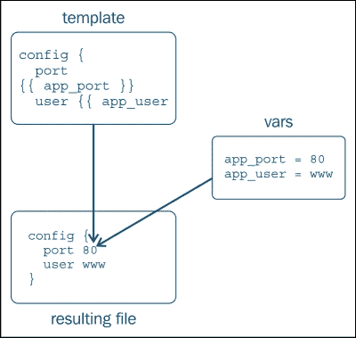

模板提供参数值的占位符，这些占位符然后由变量定义。变量可以来自各种地方，包括角色、剧本、清单，甚至是在启动 Ansible 时从命令行输入。现在让我们详细了解模板和变量。

# Jinja2 模板

Jinja 是什么？ **Jinja2** 是一个非常流行和强大的基于 Python 的模板引擎。由于 Ansible 是用 Python 编写的，所以它成为大多数用户的默认选择，就像其他基于 Python 的配置管理系统，例如 **Fabric** 和 **SaltStack** 一样。Jinja 的名称源自日语单词“寺庙”，与“模板”的音标相似。

Jinja2 的一些重要特性包括：

+   它快速并且使用 Python 字节码即时编译

+   它有一个可选的沙盒环境

+   它易于调试

+   它支持模板继承

## 模板的形成

模板看起来非常类似于普通的基于文本的文件，除了偶尔出现的变量或者围绕特殊标签的代码。这些会在运行时被评估，大多数情况下被值替换，从而创建一个文本文件，然后被复制到目标主机。以下是 Jinja2 模板接受的两种类型的标签：

+   `{{ }}` 将变量嵌入到模板中并在生成的文件中打印其值。这是模板的最常见用法。

    例如：

    ```
        {{ nginx_port }}
    ```

+   `` 将代码语句嵌入到模板中，例如，用于循环的 if-else 语句，这些语句在运行时被评估但不会被打印。

# 事实和变量

现在我们已经看过了 Jinja2 模板提供的代码，让我们来理解数据来自何处，然后在运行时嵌入到模板中。数据可以来自事实或变量。当涉及到 Jinja2 模板时，相同的规则适用于事实和变量的使用。事实是一种变量；这里的区别因素是两者的来源。事实在运行时自动可用并发现，而变量是用户定义的。

## 自动变量 - 事实

我们系统中的许多数据是在握手过程中由托管主机自动发现和提供给 Ansible 的。这些数据非常有用，告诉我们关于该系统的一切，例如：

+   主机名、网络接口和 IP 地址

+   系统架构

+   操作系统

+   磁盘驱动器

+   使用的处理器和内存量

+   是否是虚拟机；如果是，是虚拟化/云提供商吗？

### 提示

事实是在 Ansible 运行的最开始收集的。记住输出中的那行说 **GATHERING FACTS ********* 吗？这正是发生这种情况的时候。

您可以通过运行以下命令然后跟一个简短的输出来查找有关任何系统的事实：

```
$ ansible -i customhosts www -m setup | less
192.168.61.12 | success >> {
  "ansible_facts": {
    "ansible_all_ipv4_addresses": [
      "10.0.2.15",
      "192.168.61.12"
    ],
    "ansible_architecture": "i386",
    "ansible_bios_date": "12/01/2006",
    "ansible_cmdline": {
      "BOOT_IMAGE": "/vmlinuz-3.5.0-23-generic",
      "quiet": true,
      "ro": true,
      "root": "/dev/mapper/vagrant-root"
    },
    "ansible_distribution": "Ubuntu",
    "ansible_distribution_major_version": "12",
    "ansible_distribution_version": "12.04",
    "ansible_domain": "vm",
    "ansible_fqdn": "vagrant.vm",
    "ansible_hostname": "vagrant",
    "ansible_nodename": "vagrant",
    "ansible_os_family": "Debian",
    "ansible_pkg_mgr": "apt",
    "ansible_processor": [
      "GenuineIntel",
      "Intel(R) Core(TM) i5-3210M CPU @ 2.50GHz"
    ],
    "ansible_processor_cores": 1,
    "ansible_processor_count": 2,
    "ansible_processor_threads_per_core": 1,
    "ansible_processor_vcpus": 2,
    "ansible_product_name": "VirtualBox",
  }
}
```

上述输出是以 Ansible 自己的格式并使用其核心设置模块。类似于设置模块，还有另一个名为 `facter` 的模块，它发现并显示与 Puppet 发现的格式相同的事实，另一个配置管理系统。以下是如何使用 `facter` 模块为同一主机发现事实的示例：

```
$ ansible -i customhosts www -m facter | less

```

在使用 `facter` 模块时，您需要注意的一点是，该模块不是核心模块，而是作为额外模块的一部分提供的。额外模块是 Ansible 模块的一个子集，它的使用频率较低，与核心模块相比较不流行。此外，要使用 `facter` 模块，您需要在目标主机上预安装 "`facter`" 和 "`ruby-json`" 包。

## 用户定义的变量

我们看了自动可用的事实，并且发现的数据量是压倒性的。然而，它并不能为我们提供我们需要的基础设施的每个属性。例如，Ansible 无法发现：

+   我们想让我们的 Web 服务器监听哪个端口

+   哪个用户应该拥有一个进程

+   用户需要创建的系统，以及授权规则

所有这些数据都是外部的系统概要，并由我们，用户，提供。这肯定是用户定义的，但我们应该如何在哪里定义它？这就是我们接下来要看的。

### 在哪里定义一个变量

变量可以从哪里定义是一个复杂的现象，因为 Ansible 在这方面提供了丰富的选择。这也为用户配置其基础设施的部分提供了很大的灵活性。例如，生产环境中的所有 Linux 主机应该使用本地软件包存储库或分段中的 Web 服务器，并且应该运行在端口`8080`上。所有这些都不需要更改代码，仅通过数据驱动完成，由变量完成。

以下是 Ansible 接受变量的地方：

+   角色内的`default`目录

+   库存变量

    +   分别在不同目录中定义的`host_vars`和`group_vars`参数

    +   在清单文件中定义的`host/group vars`参数

+   剧本和角色参数中的变量

+   角色内的`vars`目录和在一个播放中定义的变量

+   在运行时使用`-e`选项提供的额外变量

### 如何定义变量

看完变量定义的位置后，我们将开始看如何在各种地方定义它。

以下是您可以使用的一些简单规则来形成有效的 Ansible 变量：

+   变量应始终以字母开头

+   它可以包含：

    +   字母

    +   数字

    +   下划线

让我们看一下下面的表格：

| 有效变量 | 无效变量 |
| --- | --- |
| `app_port` | `app-port` |
| `userid_5` | `5userid` |
| `logdir` | `log.dir` |

我们已经看过了优先规则，现在我们知道有多个地方可以定义变量。不考虑优先级水平，所有使用相同的语法来定义变量。

要以键值对格式定义简单变量，请使用`var: value`，例如：

```
      nginx_port: 80
```

字典或哈希可以被定义为 Nginx：

```
       port: 80
       user: www-data
```

数组可以被定义为：

```
    nginx_listners:
      - '127.0.0.1:80'
      - '192.168.4.5:80'
```

# 对 Nginx 配置进行模板化

你已经学到了很多关于事实、变量和模板的知识。现在，让我们将我们的 Nginx 角色转换为数据驱动的。我们将开始为我们之前创建的 Nginx 的`default.conf`文件进行模板化。将文件转换为模板的方法如下：

1.  创建所需目录以保存角色内的模板和默认变量：

    ```
    $ mkdir roles/nginx/templates
    $ mkdir roles/nginx/defaults

    ```

1.  总是从实际的配置文件开始，即此过程的最终结果，以了解它所需的所有参数。然后，往回工作。例如，我们系统上的`default.conf`文件的配置如下：

    ```
            server {
                     listen       80;
                     server_name  localhost; 
                     location / {
                        root   /usr/share/nginx/html;
                        index  index.html;
                   }
             }
    ```

1.  确定您想要动态生成的配置参数，删除这些参数的值，单独记录下来，并用模板变量替换它们：

    ```
        Template Snippets:
          listen {{ nginx_port }} ;
          root   {{ nginx_root }};
          index  {{ nginx_index }};

        Variables:
          nginx_port: 80
          nginx_root: /usr/share/nginx/html
          nginx_index: index.html
    ```

1.  如果任何配置参数的值应该从事实中获取，通常是系统参数或拓扑信息，比如主机名、IP 地址等，则可以使用以下命令找到相关的事实：

    例如：

    ```
    $ ansible -i customhosts www -m setup | less

    ```

    要找出系统的主机名：

    ```
    $ ansible -i customhosts www -m setup | grep -i hostname

      "ansible_hostname": "vagrant",
      "ohai_hostname": "vagrant",
    ```

1.  在模板中使用发现的事实，而不是用户定义的变量。例如：

    ```
      server_name  {{ ansible_hostname }},
    ```

1.  将结果文件保存在模板目录中，最好使用`.j2`扩展名。例如，对于`roles/nginx/templates/default.conf.j2`，结果文件如下所示：

    ```
    #roles/nginx/templates/default.conf.j2
    server {
        listen       {{ nginx_port }};
        server_name  {{ ansible_hostname }};

        location / {
            root   {{ nginx_root }};
            index  {{ nginx_index }};
        }
    }
    ```

1.  创建`roles/nginx/defaults/main.yml`并将默认值存储如下：

    ```
    ---
    #file: roles/nginx/defaults/main.yml
    nginx_port: 80
    nginx_root: /usr/share/nginx/html
    nginx_index: index.html
    ```

1.  一旦模板创建完成，将`configure.yml`文件中的任务更改为使用模板而不是复制模块: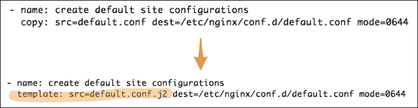

1.  最后，到了删除我们之前使用复制模块的静态文件的时候：

    ```
    $ rm roles/nginx/files/default.conf

    ```

    然后是运行 Ansible playbook 的时间：

    ```
    $ ansible-playbook -i customhosts site.yml

    ```

让我们来看一下以下的屏幕截图：

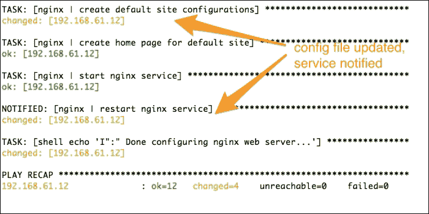

让我们分析此次运行中发生的情况：

+   我们将配置任务更改为使用模板而不是复制模块，这在任务显示其更改状态时在屏幕截图中反映出来。

+   由于任务已更新，会触发通知，该通知调用处理程序以重新启动服务。

我们的 Nginx 角色的代码树在进行此更改后如下所示：

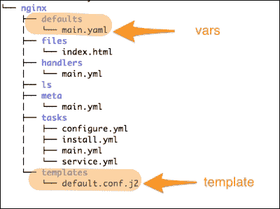

# 添加另一个层——MySQL 角色。

到目前为止，我们一直关注基础架构的单个层，即 web 服务器层。仅为一个层编写代码并不有趣。作为一个酷炫的 DevOps 团队，我们将创建一个具有数据库、web 服务器和负载均衡器的多层基础架构。接下来，我们将开始创建 MySQL 角色，应用到目前为止学到的所有知识，并扩展这些知识以涵盖一些新概念。

这是我们的 MySQL 角色规范：

+   它应该安装 MySQL 服务器包。

+   它应该配置 '`my.cnf`'，这是 MySQL 服务器的主配置。

+   它应该启动 MySQL 服务器守护进程。

+   它应该支持 Ubuntu 12.04 以及 CentOS/RedHat Enterprise 6.x。

## 使用 Ansible-Galaxy 创建角色的脚手架。

到目前为止，我们一直在努力理解和创建角色所需的目录结构。然而，为了让我们的工作更轻松，Ansible 提供了一个叫做**Ansible-Galaxy**的工具，它可以帮助我们自动创建脚手架并遵循最佳实践。实际上，Ansible-Galaxy 的功能不仅仅是如此。它还是一个连接到[`galaxy.ansible.com`](http://galaxy.ansible.com)上免费可用的 Ansible 角色仓库的实用工具。这类似于我们使用**CPAN**或**RubyGems**的方式。

让我们首先使用以下命令使用 Ansible-Galaxy 对 MySQL 角色进行初始化：

```
$ ansible-galaxy init --init-path roles/ mysql

```

在这里，以下是对前面命令的分析：

+   `init`：这是传递给 Ansible-Galaxy 的子命令，用于创建脚手架。

+   `--init-path`或`-p`：这些提供了角色目录路径，在该路径下创建目录结构。

+   `mysql`：这是角色的名称。

让我们来看一下以下的屏幕截图：

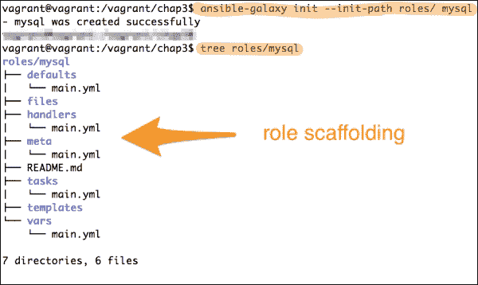

在使用 Ansible-Galaxy 初始化角色后创建的目录布局如上图所示，它创建了一个空角色，具有适用于 Galaxy 上传的结构。它还初始化了必要的组件，包括任务、处理程序、变量和带有占位符的元文件。

## 向角色添加元数据

我们之前使用`meta`文件指定了对另一个角色的依赖关系。除了指定依赖关系外，元文件还可以为角色指定更多数据，例如：

+   作者和公司信息

+   支持的操作系统和平台

+   角色功能的简要描述

+   支持的 Ansible 版本

+   这个角色试图自动化的软件类别

+   许可信息

让我们通过编辑`roles/meta/main.yml`来更新所有这些数据：

```
---
galaxy_info:
  author: Gourav Shah
  description: MySQL Database Role
  company: PACKT
  min_ansible_version: 1.4
  platforms:
  - name: EL
    versions:
      - all
  - name: Ubuntu
    versions:
      - all
  categories:
  - database:sql
```

在上面的片段中，我们向角色添加了元数据，如作者和公司详细信息，角色功能的简要描述，与 Ansible 版本的兼容性，支持的平台，角色所属的类别等等。

## 在任务和处理程序中使用变量

你已经学会了如何在模板中使用变量。那不是用来定义变量的全部代码。除了模板之外，我们还可以在任务、剧本等中使用变量。这一次，我们还承诺提供一个支持多平台的角色，支持 Ubuntu 和 RedHat。与**Chef**和**Puppet**不同，Ansible 使用特定于操作系统的模块（例如，`apt`和`yum`），而不是平台无关的资源（软件包）。我们将不得不创建特定于操作系统的任务文件，并根据它们将它们选择性地调用。我们是这样做的：

+   我们将找到一个事实，确定操作系统平台/系列。这里我们有几个选项：

    +   `ansible_distribution`

    +   `ansible_os_family`

+   RedHat、CentOS 和 Amazon Linux 都基于`rpm`，行为类似。Ubuntu 和 Debian 操作系统也是同一平台系列的一部分。因此，我们选择使用`ansible_os_family`事实，这将为我们提供更广泛的支持。

+   我们将在角色中的两个地方定义变量：

    +   从适用于 Debian 的默认`vars`文件中获取合理的默认值。

    +   如果不是 Debian 的特定于`os_family`的变量。

+   我们还将创建特定于操作系统的任务文件，因为我们可能需要调用不同的模块（`apt`与`yum`）和特定于该操作系统的额外任务。

+   对于处理程序和任务，我们将使用变量提供特定于操作系统的名称（例如，MySQL 与 mysqld，用于服务）。

+   最后，我们将创建`main.yml`文件，通过检查这个事实的值来选择性地包含特定于主机的变量以及任务文件。

### 创建变量

我们将从创建变量开始。让我们在`/mysql/defaults/main.yml`文件中为 Debian/Ubuntu 设置合理的默认值：

```
---
#roles/mysql/defaults/main.yml
mysql_user: mysql
mysql_port: 3306
mysql_datadir: /var/lib/mysql
mysql_bind: 127.0.0.1
mysql_pkg: mysql-server
mysql_pid: /var/run/mysqld/mysqld.pid
mysql_socket: /var/run/mysqld/mysqld.sock
mysql_cnfpath: /etc/mysql/my.cnf
mysql_service: mysql
```

然后它将在 RedHat/CentOS 机器上运行，但是我们需要覆盖一些变量，以配置特定于 RedHat 的参数。

### 注意事项

请注意，文件名应与 `ansible_os_family` fact 返回的确切名称（即 RedHat）完全匹配，并正确使用大小写。

我们将创建并编辑 `roles/mysql/vars/RedHat.yml` 文件，如下所示：

```
---
# RedHat Specific Configs.
# roles/mysql/vars/RedHat.yml
mysql_socket: /var/lib/mysql/mysql.sock
mysql_cnfpath: /etc/my.cnf
mysql_service: mysqld
mysql_bind: 0.0.0.0
```

最后，我们将创建 `group_vars` fact 并提供一个变量来覆盖默认设置。您已经学到了可以在 `inventory` 文件、`group_vars` 和 `host_vars` facts 中指定变量。我们现在将开始使用 `group_vars` fact。您可以在库存文件中创建这些，也可以创建一个名为 `group_vars` 的单独目录。我们将采用第二种方法，这是推荐的方法：

```
# From our top level dir, which also holds site.yml
$ mkdir group_vars
$ touch group_vars/all

```

编辑 `group_vars`/`all` 文件并添加以下行：

```
mysql_bind: "{{ ansible_eth0.ipv4.address }}"
```

### 创建任务

现在是创建任务的时候了。遵循最佳实践，我们将任务分解成多个文件，并使用包括语句，就像我们为 Nginx 所做的那样。现在我们将在 `roles/mysql/tasks` 内创建默认的 `main.yml` 文件，如下所示：

```
---
# This is main tasks file for mysql role
# filename: roles/mysql/tasks/main.yml
# Load vars specific to OS Family. 
- include_vars: "{{ ansible_os_family }}.yml"
  when: ansible_os_family != 'Debian'

- include: install_RedHat.yml
  when: ansible_os_family == 'RedHat'

- include: install_Debian.yml
  when: ansible_os_family == 'Debian'

- include: configure.yml
- include: service.yml
```

我们早先已经看到了 `include` 语句。这里新增的内容是使用了 `include_vars` fact 并使用了 `ansible_os_family` fact。如果您注意到：

+   我们使用了 `ansible_os_family` fact 和 `include_vars` fact，在不是 Debian 系统的情况下来确定是否包含特定于操作系统的变量。为什么不适用于 Debian 系统？因为我们已在 `default` 文件中指定了特定于 Debian 的配置。`include_vars` fact 与前面的条件语句配合得很好。

+   我们还使用 `when` 条件调用特定于操作系统的安装脚本。我们目前已包含支持 Debian 和 RedHat 家族的两个脚本。但是，稍后我们可以通过添加更多 `install_<os_family>.yml` 脚本来扩展脚本，以支持其他平台。

现在，让我们创建适用于 Debian 和 RedHat 的安装任务：

```
$ vim roles/mysql/tasks/install_Debian.yml

```

然后如下编辑文件：

```
---
# filename: roles/mysql/tasks/install_Debian.yml
  - name: install mysql server
    apt:
      name:"{{ mysql_pkg }}"
      update_cache:yes

$ vim roles/mysql/tasks/install_Redhat.yml

```

运行前面的命令后，将文件编辑如下所示：

```
---
# filename: roles/mysql/tasks/install_RedHat.yml
- name: install mysql server
   yum:
     name:"{{ mysql_pkg }}"
     update_cache:yes
```

在上一示例中，我们在基于 Debian 和 RedHat 的系统分别使用了 `apt` 和 `yum` 模块。遵循最佳实践，我们将编写数据驱动的角色，使用变量 `mysql_pkg` 提供软件包名称。该变量根据其运行的平台设置。我们来看看以下步骤：

1.  下一步是创建用于配置 MySQL 的任务。由于我们知道每个配置文件应该是一个模板，我们将为 `my.cnf` 文件创建一个模板，即 MySQL 服务器的默认配置文件：

    ```
    $ touch roles/mysql/templates/my.cnf.j2

    ```

    然后如下编辑文件：

    ```
    # Notice:This file is being managed by Ansible
    # Any manual updates will be overwritten
    # filename: roles/mysql/templates/my.cnf.j2
    [mysqld]
    user = {{ mysql_user | default("mysql") }}
    pid-file	 = {{ mysql_pid }}
    socket = {{ mysql_socket }}
    port = {{ mysql_port }}
    datadir = {{ mysql_datadir }}
    bind-address = {{ mysql_bind }}
    ```

1.  我们创建了一个模板，使用了 `.j2` 扩展名，因为它是 Jinja2 模板。这不是必须的，但建议这样做。

1.  所有配置参数都来自 `{{var}}` 格式的变量。这是管理配置文件的推荐做法。我们可以让属性的优先级决定值来自哪里。

### 提示

为每个由 Ansible 管理的文件添加注意事项是个好习惯。这样可以避免可能的手动更新或临时更改。

我们将编写一个任务来管理这个模板，并将生成的文件复制到主机上的目标路径：

```
---
# filename: roles/mysql/tasks/configure.yml
 - name: create mysql config
   template: src="img/my.cnf" dest="{{ mysql_cnfpath }}" mode=0644
   notify:
    - restart mysql service
```

我们有一个通用的配置文件模板；然而，复制这个模板的路径因平台而异，也根据您计划使用的 MySQL 版本不同。在这里，我们使用的是默认情况下包含在 Ubuntu 和 CentOS 仓库中的 MySQL 发行版，并且我们将从角色变量中设置 `mysql_cnfpath` 路径，如下所示：

+   在 Ubuntu/Debian 上，使用命令：`mysql_cnfpath = /etc/mysql/my.cnf`

+   在 RedHat/CentOS 上，使用命令：`mysql_cnfpath = /etc/my.cnf`

同时，我们将通知发送给 MySQL 服务重启处理程序。这将确保如果配置文件发生任何更改，服务将自动重新启动。

要管理一个服务，我们将创建一个服务任务和处理程序：

任务：

```
$ touch roles/mysql/tasks/service.yml

```

然后按如下所示编辑文件：

```
---
# filename: roles/mysql/tasks/service.yml
 - name: start mysql server
   service: name="{{ mysql_service }}" state=started
```

处理程序：

```
$ touch roles/mysql/handlers/main.yml

```

运行上述命令后，按如下所示编辑文件：

```
---
# handlers file for mysql
# filename: roles/mysql/handlers/main.yml
- name: restart mysql service
  service: name="{{ mysql_service }}" state=restarted
```

在这里，任务和处理程序与 Nginx 服务类似，所以不需要太多描述。唯一的变化是我们使用 `mysql_service` 变量来决定要启动或重新启动服务的服务名称。

## 在剧本中使用变量

变量也可以在剧本中指定。这样做的首选方法是将它们作为角色参数传递，示例如下。当角色中有默认值，并且您想要覆盖一些特定于您设置的配置参数时，这通常是有用的。这样，角色仍然是通用的和可共享的，不包含组织特定的数据。

我们将创建一个用于管理数据库的剧本，然后将其包含在全局剧本中，如下所示：

```
$ touch db.yml

```

然后按如下所示编辑文件：

```
---
# Playbook for Database Servers
# filename: db.yml
- hosts: db
  remote_user: vagrant
  sudo: yes
  roles:
    - { role: mysql, mysql_bind: "{{ ansible_eth1.ipv4.address }}" }
```

在这里，我们假设主机清单包含一个名为 `db` 的主机组。在我们的示例中，我们有两个运行在 Ubuntu 和 CentOS 上的 `db` 服务器。这被添加为：

```
[db]
192.168.61.11 ansible_ssh_user=vagrant ansible_ssh_private_key_file=/vagrant/insecure_private_key
192.168.61.14 ansible_ssh_user=vagrant ansible_ssh_private_key_file=/vagrant/insecure_private_key
```

在上面的剧本中，我们使用了一个参数化角色，它覆盖了一个变量，即 `mysql_bind`。该值是从一个多级事实中设置的。

让我们来看一下以下的截图：

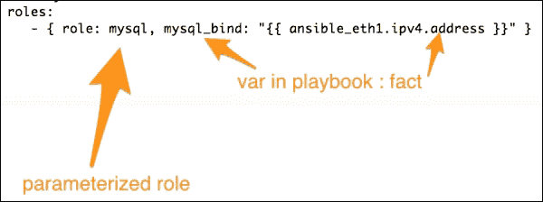

一个多级事实也可以被指定为 `ansible_eth1["ipv4"]["address"]`，两种格式都是有效的。当我们想要创建多个角色实例时，例如运行在不同端口上的虚拟主机和 WordPress 实例，参数化角色也非常有用。

现在让我们使用 `include` 语句将这个剧本包含在顶级的 `site.yml` 文件中：

如下编辑 `site.yml` 文件：

```
---
# This is a sitewide playbook
# filename: site.yml
- include: www.yml 
- include: db.yml
```

## 将 MySQL 角色应用于数据库服务器

我们已准备好配置我们的数据库服务器。让我们继续将新创建的角色应用于我们库存中的所有 `db` 服务器：

```
$ ansible-playbook -i customhosts site.yml

```

以下图像包含仅与数据库 Play 相关的输出片段：

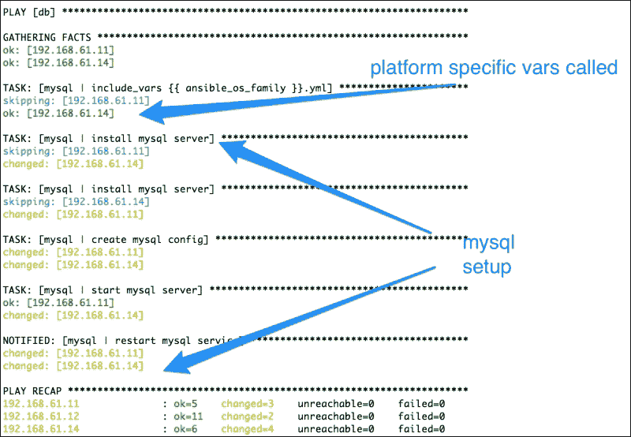

我们在前几章已经解释了 Ansible 的运行，当我们创建第一个 Playbook 以及应用 Nginx 角色时。这里唯一的新概念是 `include_var` 部分。Ansible 将根据 `ansible_os_family` 事实检查我们的条件，并调用特定于操作系统的变量。在我们的情况下，我们每个有一个 Ubuntu 和 CentOS 主机，并且在仅在 CentOS 主机上运行时都调用 `RedHat.yml` 文件。

这里真正有趣的是要找出在每个平台上我们的配置文件发生了什么以及哪些变量具有优先权。

# 变量优先级

我们指定了变量默认值，并在库存文件中使用它们，并从不同位置定义了相同的变量（例如，默认值、vars 和库存）。现在让我们分析模板的输出，以了解所有这些变量发生了什么。 

以下是显示 Ubuntu 上 `my.cnf` 文件的图表：

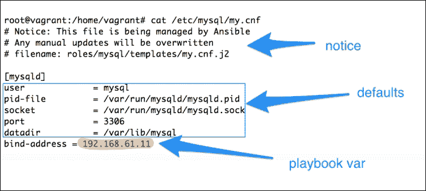

以下是对截图的分析：

+   文件在注释部分有一条通知。这可以阻止管理员对文件进行手动更改。

+   大多数变量来自角色中的默认值。这是因为 Debian 是我们默认的操作系统系列，我们已经为其设置了合理的默认值。类似地，对于其他操作系统平台，我们正在从角色的 `vars` 目录中设置变量默认值。

+   尽管 `bind_address` 参数在默认设置和 `group_vars` 中指定，但它从 Playbook 的角色参数中取值，后者优先于其他两个级别。

以下图表解释了在各个级别定义变量时会发生什么情况。它们都在运行时合并。如果相同的变量在多个位置定义，则会应用优先规则：

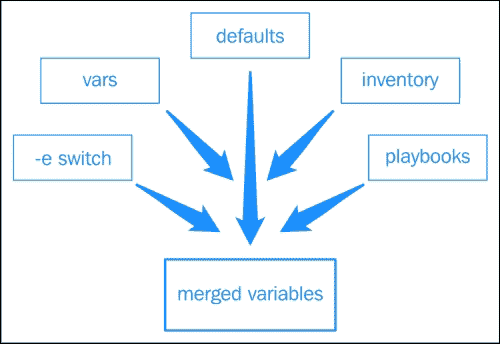

要理解优先规则，让我们看看我们的 CentOS 主机上发生了什么。以下是在 CentOS 上创建的 `my.cnf` 文件：

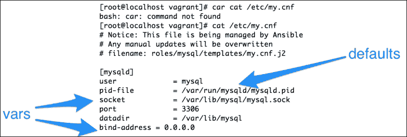

如前图所示，在 CentOS 的情况下，我们看到一些有趣的结果：

+   **user**、**pid**、**datadir** 和 **port** 的值来自默认设置。我们已经查看了合并顺序。如果变量不相同，则合并它们以创建最终配置。

+   套接字的值来自 vars，因为那是它唯一被定义的地方。尽管如此，我们希望这个套接字对于基于 RedHat 的系统是恒定的，因此，我们在角色的 vars 目录中指定了它。

+   `bind_address`参数再次来自 vars 目录。这很有趣，因为我们在以下位置定义了`mysql_bind`变量：

    +   角色中的`默认`值

    +   `group_vars`

    +   `playbook`

    +   角色中的`vars`

以下图展示了当我们多次定义相同变量时的优先级规则：


由于我们的角色在`vars`目录中定义了`bind_address`参数，它优先于其他。

有一种方法可以使用额外的变量或在运行 Ansible 时使用`-e`开关来重写角色参数。这是 Ansible 管理的变量的最高优先级。

例如：

```
ansible-playbook -i customhosts db.yml  -e mysql_bind=127.0.0.1

```

在前面的启动命令中，我们使用了`-e`开关，它将覆盖所有其他变量级别，并确保 MySQL 服务器绑定到`127.0.0.1`。

# 变量使用的最佳实践

觉得压力大了？别担心。我们将为您提供使用变量时的最佳实践建议：

+   从一个角色中开始使用默认值。这是所有优先级中最低的。这也是提供应用程序的合理默认值的好地方，稍后可以从各种地方覆盖。

+   组变量非常有用。很多时候，我们会进行特定于区域或环境的配置。我们还会为一组特定服务器应用特定的角色，例如，对于所有亚洲的 web 服务器，我们应用 Nginx 角色。还有一个名为"`all`"的默认组，其中包含所有组的所有主机。将对所有组通用的变量放在"`all`"（`group_vars/all`）中是一个好习惯，然后可以被更具体的组覆盖。

+   如果有主机特定的异常情况，请使用`hosts_vars`，例如，`host_vars/specialhost.example.org`。

+   如果你想要将变量分开存储在不同的文件中，创建以主机名命名的目录，然后将变量文件放在其中。在这些目录中的所有文件都将被评估：

    +   `group_vars/asia/web`

    +   `host_vars/specialhost/nginx`

    +   `host_vars/specialhost/mysql`

+   如果你想要保持你的角色通用且可共享，在角色中使用默认值，然后从 playbooks 中指定特定于组织的变量。这些可以被指定为角色参数。

+   如果希望角色变量始终优先于清单变量和 playbooks，请在角色内的`vars`目录中指定它们。这对于为特定平台提供角色常量非常有用。

+   最后，如果你想要覆盖之前的任何变量并在运行时提供一些数据，请使用 Ansible 命令使用`-e`选项提供额外的变量。

到目前为止，我们的 MySQL 角色和 DB playbook 的树应该如下图所示：

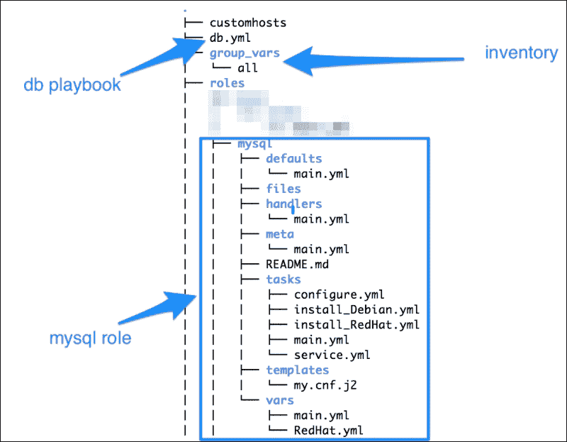

# 复习问题

你觉得自己对本章有足够的理解吗？尝试回答以下问题来测试你的理解：

1.  什么是 Jinja2 模板与静态文件的区别？

1.  什么是事实？它们是如何被发现的？

1.  在 Jinja2 模板的上下文中 `{{ }}` 和 `` 有什么区别？

1.  除了模板之外，您可以在任何地方使用变量吗？如果可以，在哪里？

1.  如果在角色的 `vars` 目录中定义了变量 `foo`，并且在 `hosts_var` 文件中也定义了相同的变量，那么这两者中哪个优先级更高？

1.  如何编写支持多个平台的 Ansible 角色？

1.  您可以在角色中的哪里指定作者和许可信息？

1.  在启动 Ansible-playbook 命令时如何提供变量？

1.  你会使用哪个命令来自动创建角色所需的目录结构？

1.  如何覆盖角色的 `vars` 目录中指定的变量？

# 摘要

我们从学习使用 Ansible 变量、事实和 Jinja2 模板将数据与代码分离的原因和方法开始了这一章节。您学会了如何通过在模板、任务、处理程序和 Playbooks 中提供变量和事实来创建数据驱动的角色。此外，我们为数据库层创建了一个新角色，支持 Debian 和 RedHat 系列操作系统。您学会了系统事实是什么以及如何发现和使用它们。您学会了如何从多个位置指定变量、它们是如何合并的以及优先级规则。最后，您学会了使用变量的最佳实践。

在下一章中，我们将使用自定义命令和脚本，了解注册变量是什么，并使用所有这些信息部署一个示例 WordPress 应用程序。
