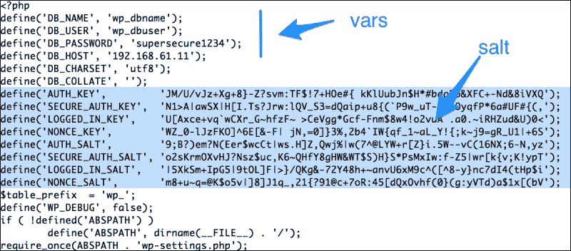

# 第五章：引入您的代码 - 自定义命令和脚本

Ansible 附带了各种内置模块，允许我们管理各种系统组件，例如用户、软件包、网络、文件和服务。Ansible 的一揽子方法还提供了将这些组件与云平台、数据库和应用程序（如**Jira**、**Apache**、**IRC**和**Nagios**等）集成的能力。然而，有时我们会发现自己处于无法找到完全符合要求的模块的位置。例如，从源代码安装软件包涉及下载、提取源码 tarball，然后是 make 命令，最后是"make install"。没有一个单一的模块来完成这个任务。还会有一些时候，我们希望引入我们已经花费了夜晚时间创建的现有脚本，并让它们与 Ansible 一起被调用或定时执行，例如夜间备份脚本。Ansible 的命令模块将在这种情况下拯救我们。

在本章中，我们将向您介绍：

+   如何运行自定义命令和脚本

+   Ansible 命令模块：原始、命令、shell 和脚本

+   如何控制命令模块的幂等性

+   已注册的变量

+   如何创建 WordPress 应用程序

# 命令模块

Ansible 拥有四个属于这一类别的模块，并在运行系统命令或脚本时为我们提供选择。这四个模块是：

+   原始

+   命令

+   Shell

+   脚本

我们将逐个学习这些知识点。

## 使用原始模块

大多数 Ansible 模块要求目标节点上存在 Python。然而，顾名思义，原始模块提供了一种通过 SSH 与主机通信以执行原始命令而不涉及 Python 的方式。使用这个模块将完全绕过 Ansible 的模块子系统。这在某些特殊情况或情况下会非常有用。例如：

+   对于运行的 Python 版本早于 2.6 的传统系统，在运行 playbooks 之前，需要安装`Python-simplejson`包。可以使用原始模块连接到目标主机并安装先决条件软件包，然后再执行任何 Ansible 代码。

+   在网络设备（如路由器、交换机和其他嵌入式系统）的情况下，Python 可能根本不存在。这些设备仍然可以使用原始模块简单地通过 Ansible 进行管理。

除了这些例外情况之外，在所有其他情况下，建议您使用命令模块或 shell 模块，因为它们提供了控制命令何时、从何处以及如何运行的方法。

让我们看看以下给定的示例：

```
$ ansible -i customhosts all  -m raw -a "uptime"
[Output]
192.168.61.13 | success | rc=0 >>
 04:21:10 up 1 min,  1 user,  load average: 0.27, 0.10, 0.04
192.168.61.11 | success | rc=0 >>
 04:21:10 up 5 min,  1 user,  load average: 0.01, 0.07, 0.05
192.168.61.12 | success | rc=0 >>
 04:21:12 up  9:04,  1 user,  load average: 0.00, 0.01, 0.05

```

上述命令连接到使用 SSH 提供的`customhosts`清单中的所有主机，运行一个原始命令 uptime，并返回结果。即使目标主机没有安装 Python，这也能起作用。这类似于在一组主机上编写一个`for`循环以进行即席 shell 命令。

同样的命令可以转换为一个任务：

```
   - name: running a raw command 
     raw: uptime
```

## 使用命令模块

这是在目标节点上执行命令的最佳模块。该模块接受自由形式的命令序列，并允许您运行任何可以从命令行界面启动的命令。除了命令之外，我们还可以选择指定：

+   要从哪个目录运行命令

+   用于执行的 shell

+   何时不运行命令

让我们看看以下例子：

```
   - name: run a command on target node
     command: ls -ltr
     args:
       chdir: /etc
```

在这里，调用命令模块来在目标主机上运行`ls -ltr`，并使用一个参数来改变目录为`/etc`，然后再运行命令。

除了将其写为任务之外，命令模块还可以直接调用为：

```
$ ansible -i customhosts all  -m command -a "ls -ltr"

```

## 使用 shell 模块

这个模块与我们刚刚学到的命令模块非常相似。它接受一个自由形式的命令和可选参数，并在目标节点上执行它们。但是，shell 模块和命令模块之间存在一些微妙的差异，如下所列：

+   Shell 在目标主机上通过'/`bin/sh`' shell 运行命令，这也意味着任何通过此模块执行的命令都可以访问该系统上的所有 shell 变量

+   与命令模块不同，shell 也允许使用操作符，比如重定向（`<, <<, >> , >`）、管道（`|`）、`&&`和`||`

+   Shell 比命令模块不够安全，因为它可能受到远程主机上的 shell 环境的影响

让我们看看以下例子：

```
   - name: run a shell command on target node
     shell: ls -ltr | grep host >> /tmp/hostconfigs
     args:
       chdir: /etc
```

与使用命令模块类似，前面的任务使用 shell 模块运行命令序列。但是，在这种情况下，它接受操作符，如`|`和`>>`，使用`grep`进行过滤，并将结果重定向到文件。

不要将此任务指定为 Playbook 的一部分，它可以作为一个临时命令与 Ansible 一起运行，如下所示：

```
ansible -i customhosts all --sudo -m shell \
 -a "ls -ltr | grep host >> /tmp/hostconfigs2 \
chdir=/etc"
```

在这里，您需要明确指定`--sudo`选项，以及模块选项作为参数，比如`chdir=/etc`和实际命令序列。

## 使用脚本模块

到目前为止我们学到的命令模块只允许在远程主机上执行一些系统命令。在某些情况下，我们会有一个现有的脚本需要复制到远程主机上，然后在那里执行。使用 shell 或命令模块，可以通过以下两个步骤实现这一目标：

1.  使用复制模块将脚本文件传输到远程主机。

1.  然后，使用命令或 shell 模块来执行之前传输的脚本。

Ansible 有一个专门定制的模块来更高效地解决这个问题。使用脚本模块而不是命令或 shell，我们可以一步完成复制和执行脚本。

例如，请考虑以下代码片段：

```
   - name: run script sourced from inside a role
     script:  backup.sh
   - name: run script sourced from a system path on target host
     script: /usr/local/bin/backup.sh
```

如前面的代码片段所示，脚本可以从以下两者之一中源：

+   在调用这个模块时，从角色内部的任务中显示的角色的内部文件目录，如第一个示例所示

+   控制主机上的绝对系统路径（这是运行 Ansible 命令的主机）

就像所有其他模块一样，脚本也可以作为临时命令调用，如下所示：

```
$ ansible -i customhosts www --sudo -m script \

  -a "/usr/local/backup.sh"
```

这里，`script` 模块仅在清单中属于 `www` 组的主机上调用。此命令将从控制主机复制一个位于 `/usr/local/backup.sh` 的脚本，并在目标节点上运行它；在本例中，所有属于 `www` 组的主机。

# 部署 WordPress 应用程序 - 一种实践方法

在我们的第一个迭代中，我们已经配置了一个 Nginx Web 服务器和一个 MySQL 数据库来托管一个简单的网页。我们现在将配置一个 WordPress 应用程序在 Web 服务器上托管新闻和博客。

### 注意

**情景：**

在第一次迭代中，我们已经配置了一个 Nginx Web 服务器和一个 MySQL 数据库来托管一个简单的网页。现在，我们将在 Web 服务器上配置一个 WordPress 应用程序来托管新闻和博客。

WordPress 是一个流行的基于 LAMP 平台的开源 Web 发布框架，它是 Linux、Apache、MySQL 和 PHP。WordPress 是一个简单而灵活的开源应用程序，用于支持许多博客和动态网站。运行 WordPress 需要一个 Web 服务器、PHP 和 MySQL 数据库。我们已经配置了一个 Nginx Web 服务器和 MySQL 数据库。我们将通过创建一个角色来安装和配置 WordPress，然后稍后配置 PHP。

要创建角色，我们将使用前一章节中学到的 Ansible-Galaxy 工具：

```
$ ansible-galaxy init --init-path roles/ wordpress

```

这将创建 WordPress 角色所需的脚手架。到目前为止，我们知道核心逻辑放在任务中，并由文件、模板、处理程序等支持。我们将首先编写任务以安装和配置 WordPress。首先，我们将创建主任务文件，如下所示：

```
---
# tasks file for wordpress
# filename: roles/wordpress/tasks/main.yml
 - include: install.yml 
 - include: configure.yml
```

### 注意

我们遵循最佳实践，并进一步模块化任务。我们将创建一个 `install.yml` 文件和一个 `configure.yml` 文件，并从主文件中包含它们，而不是将所有内容放在 `main.yml` 文件中。

## 安装 WordPress

WordPress 的安装过程将从任务目录中的 `install.yml` 文件中处理。安装 WordPress 的过程通常涉及：

1.  从 [`wordpress.org`](https://wordpress.org) 下载 WordPress 安装包。

1.  解压安装包。

1.  将提取的目录移动到 Web 服务器的文档“根”目录中。

我们将开始为上述提到的每个步骤编写代码，如下所示：

```
---
# filename: roles/wordpress/tasks/install.yml
  - name: download wordpress
    command: /usr/bin/wget -c https://wordpress.org/latest.tar.gz
    args: 
      chdir: "{{ wp_srcdir }}"
      creates: "{{ wp_srcdir }}/latest.tar.gz"
    register: wp_download
```

我们在前面的步骤中看到了一些新功能。让我们分析一下这段代码：

+   我们正在使用新的样式编写任务。除了为任务使用键值对外，我们还可以将参数分开，并将它们以键值格式的每一行写入。

+   要下载 WordPress 安装程序，我们使用了带有 `wget` 命令的命令模块。该命令采用具有附加参数的可执行序列，这些参数是 `chdir` 和 `creates`。

+   `Creates` 在这里是一个特殊选项。通过此选项，我们指定了 WordPress 安装程序正在下载的文件路径。我们将看看这对我们有什么用处。

+   我们还将此模块的结果注册到名为 `wp_download` 的变量中，我们将在后续任务中使用它。

### 提示

建议您使用 Ansible 内置的 `get_url` 模块通过 HTTP/FTP 协议下载文件。由于我们想要演示命令模块的使用方法，我们选择使用它而不是使用 `get_url` 模块。

现在让我们来看一下我们之前介绍的新概念。

### 控制命令模块的幂等

Ansible 自带了许多内置模块。正如我们在第一章中所学到的 *Blueprinting Your Infrastructure* 中提到的那样，大多数这些模块都是幂等的，并且确定配置漂移的逻辑已内置到模块代码中。

但是，命令模块允许我们运行本质上不是幂等的 shell 命令。由于命令模块无法确定任务的结果，因此预期这些模块默认情况下不是幂等的。Ansible 为我们提供了一些选项，使这些模块可以有条件地运行，并使它们成为幂等的。

以下是确定命令是否运行的两个参数：

+   `Creates`

+   `Removes`

两者都接受文件名作为参数值。在 `creates` 的情况下，如果文件存在，则不会运行命令。`removes` 命令则相反。

"creates" 和 "removes" 选项适用于除了原始模块之外的所有命令模块。

以下是如何使用 `creates` 和 `removes` 标志的一些指导原则：

+   如果您执行的命令序列或脚本创建文件，请将该文件名作为参数值提供

+   如果命令序列不创建标志，请确保在命令序列或脚本中加入创建标志文件的逻辑

### 注册变量

我们之前已经看过变量。但是，我们以前从未注册过变量。在我们编写用于下载 WordPress 的任务中，我们使用了以下选项：

```
           register: wp_download
```

此选项将任务的结果存储在名为 `wp_download` 的变量中。然后可以稍后访问此注册结果。以下是注册变量的一些重要组成部分：

+   `changed`：这显示了状态是否已更改

+   `cmd`：通过此，启动命令序列

+   `rc`：这是返回代码

+   `stdout`：这是命令的输出

+   `stdout_lines`：这是逐行输出

+   `stderr`：这些说明了错误，如果有的话

然后，这些可以作为 `wp_download.rc`、`wp_download.stdout` 访问，并且可以在模板中、动作行中或更常见的是在 `when` 语句中使用。在这种情况下，我们将使用 `wp_download` 的返回代码来决定是否提取包。这是有道理的，因为提取甚至不存在的文件是没有意义的。

### 使用 shell 模块提取 WordPress

现在让我们编写一个任务，提取 WordPress 安装程序并将其移动到所需位置。在此之前，我们还需要确保在运行此代码之前已创建文档 `root` 目录：

```
  # filename: roles/wordpress/tasks/install.yml
  - name: create nginx docroot
    file:
      path: "{{ wp_docroot }}"
      state: directory
      owner: "{{ wp_user }}"
      group: "{{ wp_group }}"

  - name: extract wordpress
    shell: "tar xzf latest.tar.gz && mv wordpress {{ wp_docroot }}/{{ wp_sitedir }}"
    args: 
      chdir: "{{ wp_srcdir }}"
      creates: "{{ wp_docroot }}/{{ wp_sitedir }}"
    when: wp_download.rc == 0
```

现在让我们分析一下刚才所写的内容：

+   我们使用 `file` 模块为 web 服务器创建文档根目录。路径、用户和组等参数都来自变量。

+   为了提取 WordPress，我们使用 `shell` 模块而不是命令。这是因为我们在这里使用 `&&` 运算符将两个命令组合在一起，而命令模块不支持这一点。

+   我们使用 `when` 语句来决定是否运行提取命令。要检查条件，我们使用之前存储在注册变量 `wp_download` 中的下载命令的返回代码。

## 配置 WordPress

下载和提取 WordPress 后，下一步是配置它。WordPress 的主要配置位于我们提取的 `wordpress` 目录下的 `wp-config.php` 中。作为良好的实践，我们将使用模板管理此配置文件。以下是配置 WordPress 的代码：

```
---
# filename: roles/wordpress/tasks/configure.yml
  - name: change permissions for wordpress site
    file:
      path: "{{ wp_docroot }}/{{ wp_sitedir }}"
      state: directory
      owner: "{{ wp_user }}"
      group: "{{ wp_group }}"
      recurse: true

  - name: get unique salt for wordpress
    local_action: command curl https://api.wordpress.org/secret-key/1.1/salt
    register: wp_salt

  - name: copy wordpress template
    template:
      src: wp-config.php.j2
      dest: "{{ wp_docroot }}/{{ wp_sitedir }}/wp-config.php"
      mode: 0644
```

让我们分析一下这段代码：

+   第一个任务递归地为所有 WordPress 文件设置权限。

+   第二个任务在本地运行命令并将结果注册到 `wp_salt` 变量中。这是为了为 WordPress 提供额外的安全密钥。这次将使用模板内的此变量。

+   最后一个任务是生成一个 Jinja2 模板并将其复制到目标主机上作为 `wp-config.php` 文件。

让我们也看一下 Jinja2 模板：

```
# filename: roles/wordpress/templates/wp-config.php.j2
<?php
define('DB_NAME', 'wp_dbname');
define('DB_USER', 'wp_dbuser');
define('DB_PASSWORD', '{{ wp_dbpass }}');
define('DB_HOST', '{{ wp_dbhost }}');
define('DB_CHARSET', 'utf8');
define('DB_COLLATE', '');
{{ wp_salt.stdout }}
$table_prefix  = 'wp_';
define('WP_DEBUG', false);
if ( !defined('ABSPATH') )
  define('ABSPATH', dirname(__FILE__) . '/');
require_once(ABSPATH . 'wp-settings.php');
```

在这里，我们将配置参数的值填充到变量中。另一个有趣的地方是，我们嵌入了使用 `stdout` 变量的 salt 下载的输出：

```
            {{ wp_salt.stdout }}
```

从填充变量和从注册变量的 `stdut` 获取的模板创建的结果文件将如下所示：



现在我们将这个新角色添加到 `www.yml` playbook 中，以便它在所有我们的 web 服务器上执行：

```
#filename: www.yml
  roles:
     - nginx
     - wordpress
```

然后，我们将仅针对 web 服务器运行 Ansible playbook：

```
$ ansible-playbook www.yml  -i customhosts

```

这将在所有 web 服务器主机上下载、提取和配置 WordPress。我们还没有安装 PHP 并配置 Nginx 来提供 WordPress 页面，所以我们的更改还没有反映出来。

# 回顾问题

你觉得你对本章的理解足够吗？试着回答以下问题来测试你的理解：

1.  当 Ansible 采用一揽子方法时，为什么我们还需要命令模块？

1.  何时以及为什么要使用 raw 模块？

1.  如何在命令执行时，当执行的命令不创建文件时，使用 `creates` 参数？

1.  `command` 和 `shell` 模块有何不同？什么时候会使用 shell？

1.  如果 `var3` 是一个注册变量，你将如何在模板中打印它的输出？

# 总结

在本章中，你学习了如何使用 Ansible 的命令模块运行自定义命令和脚本，即 raw、command、shell 和 script。你还学会了如何使用 `creates` 和 `removes` 标志控制命令模块的幂等性。我们开始使用注册变量来存储任务的结果，然后可以在以后有条件地运行其他任务或将输出嵌入模板中。最后，我们创建了一个角色来安装和配置 WordPress 应用程序。

在下一章中，我们将开始学习如何使用条件语句控制执行流程，如何有选择性地应用角色，以及如何在模板中使用条件控制结构。
