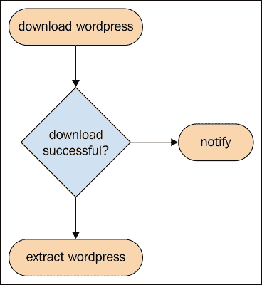
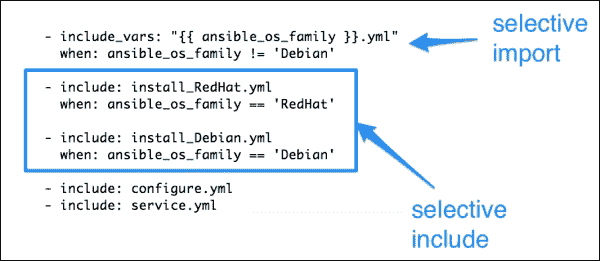
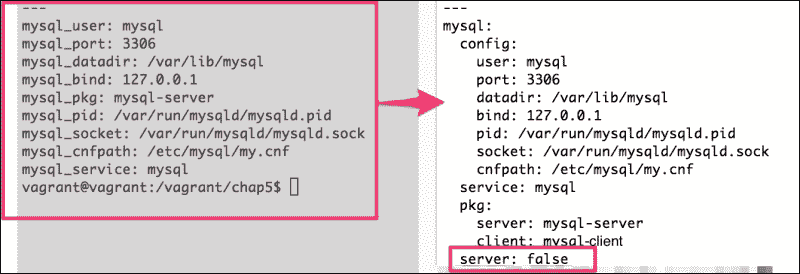
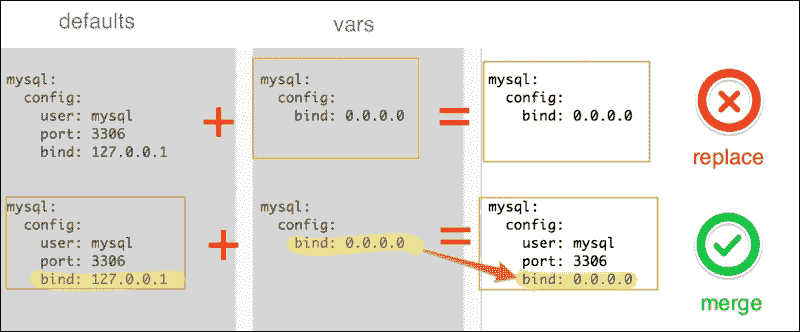
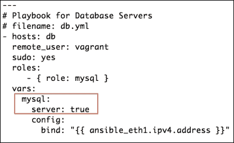

# 第 5 章。控制执行流程 - 条件

控制结构指的是对程序执行流程产生影响的任何事物。控制结构主要有以下两种类型：

+   条件

+   迭代

有时，我们需要根据变量的值、平台类型或甚至其他某些命令的结果有条件地执行代码。有时我们还需要迭代多个对象，例如列表哈希或多级变量。

大多数编程语言和工具使用强大但机器友好的构造，例如`if else`、`for`、`unless`、`do while`等等。然而，Ansible 忠实于其设计原则，成为一种人类友好的自动化语言，并且通过万能的`when`和`with_*`构造实现了相同的功能，这些构造更接近英语。让我们开始探索它是如何做到这一点的。

在本章中，我们将涵盖以下主题：

+   使用`when`语句进行条件控制

+   使用变量和事实跳过子例程

+   有选择地应用角色

+   Jinja2 模板中的条件控制结构

# 条件控制结构

条件控制结构允许 Ansible 根据某些条件选择替代路径、跳过任务或选择要导入的特定文件。在通用编程语言中，使用`if-then`、`else if`、`else`、`case`语句来完成此操作。Ansible 使用"`when`"语句。一些示例条件包括：

+   是否定义了某个变量

+   较早的命令序列是否成功

+   任务是否已经运行过

+   目标节点上的平台是否与支持的平台匹配

+   某个文件是否存在

## when 语句

我们已经使用了`when`语句来根据另一个命令的结果提取 WordPress 存档，即：

```
- name: download wordpress
    register: wp_download
- name: extract wordpress
    when: wp_download.rc == 0
```

这与编写 shell 片段大致相当，如下所示：

```
DOWNLOAD_WORDPRESS
var=`echo $?
if [$var -eq 0]
then
    EXTRACT_WORDPRESS()
fi
```

除了检查前面的代码，我们还可以根据任务本身的结果简单地编写条件，如下所示：

```
- name: extract wordpress
    when: wp_download|success
- name: notify devops engineers
    when: wp_download|failed
```

为了使失败的语句起作用，我们需要在注册变量的早期任务中添加`ignore_errors: True`语句。以下流程图描述了相同的逻辑：



### 基于事实的选择

事实是检测平台特定信息并基于此进行选择的良好信息来源，尤其是在存在混合环境时。基于这个选择，我们可以：

+   决定是否执行任务

+   决定是否包含任务文件

+   决定是否导入文件

+   决定是否在目标节点上应用角色

在编写 MySQL 时，我们已经使用了基于事实的选择，其中我们使用了事实`ansible_os_family`来：

1.  为非 Debian 系统导入`vars`文件。

1.  为包安装包含特定于平台的任务。

下面的代码片段显示了两个用例：



# 重构 MySQL 角色

我们现有的 MySQL 角色只安装和配置服务器。往往我们只需要安装 MySQL 客户端包而不是服务器。我们没有能力有选择地这样做。

### 注意

**情景：**

我们被要求重构 MySQL 角色，并根据变量值有条件地安装 MySQL 服务器。默认情况下，它应该只安装 MySQL 客户端包。

布尔变量可以用来设置一个开关，我们将添加一个变量，并将其默认值设为`false`。这一次，我们将创建一个多级变量或嵌套哈希。

## 多级变量字典

到目前为止，我们一直将变量命名为`mysql_bind`、`mysql_port`等，并使用下划线对它们进行分类。如果您使用多级字典定义它们，那么变量可以更好地分类和组织，例如：

```
mysql:
  config:
    bind: 127.0.0.1
    port: 3306
```

然后可以在代码中以`mysql['config]['bind']`或`mysql['config]['port']`的方式访问多级变量。现在让我们更新`roles/mysql/defaults/main.yml`文件以使用多级变量，并创建一个名为`mysql.server`的新布尔变量，它充当标志：



另外，我们还需要更新`mysql`角色中`vars`目录中的文件，以使用新风格定义变量，以及更新所有任务、处理程序和模板以适当地引用它们。这一过程作为文本的一部分添加，以避免冗余。

### 合并哈希

多级变量或本质上来说，从不同位置定义的字典可能需要被合并。例如，如果我们在角色`default`中定义默认配置参数，然后在角色的`vars`目录中覆盖了一些参数，那么结果变量`hash`应包含**defaults**中的项以及**vars**中覆盖的值。

让我们来看下面的屏幕截图：



但是，默认情况下，Ansible 将替换字典，在上面的示例中，我们不会得到一个合并的字典，而是会失去用户和端口`vars`，因为角色中的`vars`具有更高的优先级。这可以通过将`hash_behavior`参数设置为`merge`而不是`replace`来避免，如下所示：

```
# /etc/ansible/ansible.cfg
    hash_behaviour=merge
```

这应该在 Ansible 控制主机上设置，不需要我们重新启动任何服务。

## 有选择性地配置 MySQL 服务器

在重构代码并添加由变量控制的标志之后，我们已经准备好选择性地配置 MySQL 服务器了。我们有一个名为`mysql.server`的变量，它采用`True`/`False`的布尔值。此变量可用于决定是否跳过服务器配置，如下所示：

```
#file: roles/mysql/tasks/main.yml
- include: configure.yml
  when: mysql.server

- include: service.yml
  when: mysql.server
```

让我们还添加任务来安装 MySQL 客户端包以及 Ansible 的 MySQL 模块所需的 Python 绑定：

```
---
# filename: roles/mysql/tasks/install_Debian.yml
  - name: install mysql client
    apt:
      name: "{{ mysql['pkg']['client'] }}"
      update_cache: yes

  - name: install mysql server
    apt:
      name: "{{ mysql['pkg']['server'] }}"
      update_cache: yes
    when: mysql.server

  - name: install mysql python binding
    apt:
      name: "{{ mysql['pkg']['python'] }}"
```

在这里，包名称来自以下变量`hash`：

```
mysql:
pkg:
    server: mysql-server
    client: mysql-client
    python: python-mysqldb
```

默认情况下，`mysql.server`参数已设置为`False`。我们如何仅为数据库服务器启用此选项？我们可以有很多种方法来实现这一点。这次我们会选择剧本变量，因为我们有一个专门用于 DB 服务器的变量。

让我们看一下以下截图：



# Jinja2 模板中的条件控制结构

Ansible 使用 Jinja2 作为模板引擎。因此，除了 Ansible 任务支持的控制结构外，了解 Jinja2 控制结构也对我们很有用。Jinja2 的语法将控制结构封装在``块内。对于条件控制，Jinja2 使用熟悉的`if`语句，其语法如下：

```

    do_some_thing

    do_another_thing

    do_something_else

```

## 更新 MySQL 模板

我们之前创建的用于生成`my.cnf`文件的模板假定其中引用的所有变量都在某处定义了。有可能情况并非总是如此，这可能导致在运行 Ansible 时出现错误。我们能够有选择地将配置参数包含在`my.cnf`文件中吗？答案是肯定的。我们可以检查变量是否被定义，只有在这种情况下，我们才将其添加到文件中，如下所示：

```
#filename: roles/mysql/template/my.cnf.j2
[mysqld]
user = {{ mysql['config']['user'] | default("mysql") }}

pid-file = {{ mysql['config']['pid'] }}


socket = {{ mysql['config']['socket'] }}


port = {{ mysql['config']['port'] }}


datadir = {{ mysql['config']['datadir'] }}


bind-address = {{ mysql['config']['bind'] }}

```

让我们分析上述代码：

+   由于我们正在为`mysql['config']['user']`参数设置默认值，因此无需检查它是否已定义。它已经被优雅地处理了。

+   对于所有其他参数，我们使用条件检查变量是否已定义，例如`if mysql.config.pid is defined`。如果未定义该参数，则会跳过该参数，而不会引发错误。

# 仅运行一次任务

有时，在播放书执行期间，角色中的特定任务可能需要仅执行一次，即使该角色应用于多个主机。这可以通过`run_once`条件来实现：

```
name: initialize wordpress database
script: initialize_wp_database.sh 
run_once: true
```

由于我们正在使用`run_once`选项，上述任务将在应用角色的清单中的第一个主机上运行。所有后续主机都将跳过此任务。

# 有条件地执行角色

我们之前创建的用于设置 Web 服务器的 Nginx 角色仅支持基于 Debian 的系统。在其他系统上运行此逻辑可能会导致失败。例如，Nginx 角色使用`apt`模块安装软件包，在依赖于`yum`软件包管理器的基于 RedHat 的系统上不起作用。可以通过添加`when`语句与事实来选择性地基于操作系统系列执行。以下是`www.yml`剧本中的片段：

```
#filename: www.yml (snippet)
- hosts: www
  roles:
    - { role: nginx, when: ansible_os_family == 'Debian' }
```

# 复习问题

您认为您是否已经充分理解了本章内容？尝试回答以下问题来测试您的理解：

1.  Ansible 中`if else`语句的替代方案是什么？

1.  如何有选择地导入特定于平台的变量？

1.  为什么 Jinja2 模板使用`__`和`__`来界定控制结构？

1.  如何跳过在不兼容平台上运行的角色？

# 总结

在本章中，你学习了如何使用`when`语句、条件导入、选择性包含等来控制执行流程。你还学会了如何使用变量和事实来有选择地跳过例程并执行特定于平台的子例程。我们对 MySQL 角色进行了重构，开始使用变量字典有条件地配置 MySQL 服务器，并使用更智能的模板来预检已定义的变量。

在下一章中，我们将开始探索第二种控制结构，即迭代控制结构，我们将开始循环数组和哈希。
