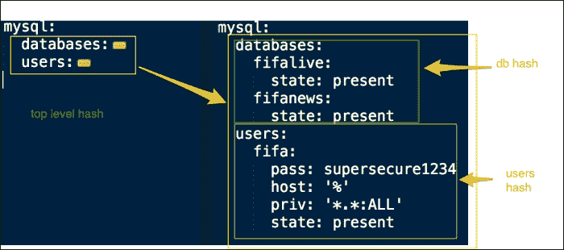
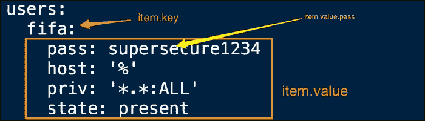
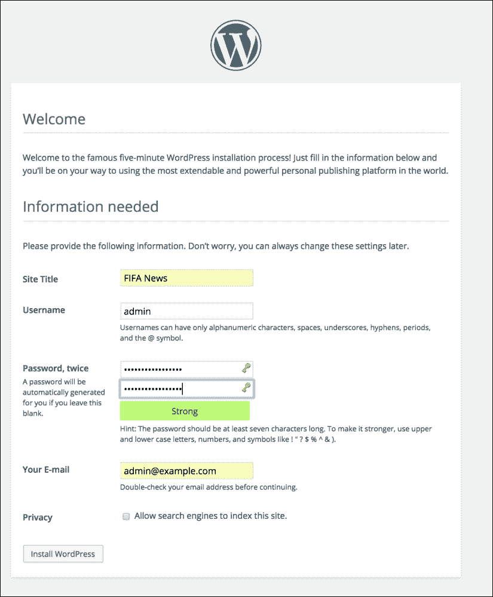

# 第七章：迭代控制结构 - 循环

在前一章节中您了解了条件控制。我们对 Ansible 的控制结构的世界进行的旅程将继续学习迭代控制。我们经常需要创建一系列目录、安装一堆软件包、定义和遍历嵌套哈希或字典。传统的编程语言使用`for`或`while`循环进行迭代。Ansible 将它们替换为`with`语句。

在本章中，我们将学习：

+   如何使用`with`语句进行迭代控制

+   如何循环数组以一次创建多个对象

+   如何定义嵌套哈希并遍历它们以创建数据驱动的角色

# 万能的 with 语句

使用“瑞士军刀”实用工具`with`语句可以实现循环纯列表、解析字典、循环一系列数字、解析路径并有选择地复制文件，或者只是从列表中挑选一个随机项。`with`语句采用以下形式：

```
with_xxx
```

这里，`xxx`参数是需要循环的数据类型，例如，项、字典等。

以下表列出了`with`语句可以迭代的数据类型：

| 构造 | 数据类型 | 描述 |
| --- | --- | --- |
| `with_items` | 数组 | 用于循环数组项。例如，用于创建一组用户、目录，或者安装一系列软件包。 |
| `with_nested` | 嵌套循环 | 用于解析多维数组。例如，创建一个 MySQL 用户列表并为他们授予一组数据库的访问权限。 |
| `with_dict` | 哈希 | 用于解析键值对字典并创建虚拟主机。 |
| `with_fileglobs` | 文件模式匹配 | 用于解析路径并仅复制与特定模式匹配的文件。 |
| `with_together` | 集合 | 用于将两个数组合并为一个集合并循环遍历它。 |
| `with_subelements` | 哈希子元素 | 用于解析哈希的子元素。例如，遍历 SSH 密钥列表并将其分发给用户。 |
| `with_sequence` | 整数序列 | 用于循环一系列数字。 |
| `with_random_choice` | 随机选择 | 用于以随机顺序从数组中选择项目。 |
| `with_indexed_items` | 带索引的数组 | 这是一个带有索引的数组，当需要项目索引时很有用。 |

# 配置 WordPress 必备条件

在第四章安装 WordPress 的角色创建时，*引入您的代码 - 自定义命令和脚本*，我们创建了下载、提取和复制 WordPress 应用的任务。然而，这还不足以启动 WordPress，它有以下先决条件：

+   一个网络服务器

+   网络服务器的 PHP 绑定

+   MySQL 数据库和 MySQL 用户

一个 Nginx web 服务器和 MySQL 服务已经在我们的案例中安装。我们仍然需要安装并配置 PHP，以及为我们的 WordPress 应用程序所需的 MySQL 数据库和用户。为了处理 PHP 请求，我们选择实现 PHP5-FPM 处理程序，这是传统 FastCGI 实现的替代品。

# PHP5-FPM 角色

在 **PHP5-FPM** 中，**FPM** 代表 **FastCGI Process Manager**。PHP5-FPM 提供了比 **fastcgi** 更高级的功能，对于管理高流量站点非常有用。它适用于提供我们的 fifanews 站点，该站点每天预计会有数百万次点击。根据我们创建模块化代码的设计原则，我们将保持 PHP 功能在其自己的角色中。让我们使用 Ansible-Galaxy 命令初始化 PHP5-FPM 角色，如下所示：

```
$ ansible-galaxy init --init-path roles/ php5-fpm

```

## 定义一个数组

PHP 安装将涉及安装多个软件包，包括 `php5-fpm`、`php5-mysql` 和其他一些软件包。到目前为止，我们一直是一次编写一个任务。例如，让我们来看看以下代码片段：

```
  - name: install php5-fpm
    apt: name: "php5-fpm" 
  - name: install php5-mysql
    apt: name: "php5-mysql"
```

但是，当我们想要安装多个软件包时，这可能会变得重复，并导致冗余代码。为了致力于编写数据驱动的角色，我们将通过一个变量来推动软件包的安装，该变量获取一个软件包列表，然后对该列表进行迭代。让我们开始定义需要列出软件包的参数，如下所示：

```
---
#filename: roles/php5-fpm/defaults/main.yml
#defaults file for php5-fpm
php5:
  packages:
    - php5-fpm
    - php5-common
    - php5-curl
    - php5-mysql
    - php5-cli
    - php5-gd
    - php5-mcrypt
    - php5-suhosin
    - php5-memcache
  service:
    name: php5-fpm
```

这是前面代码的分析：

+   `php5` 变量是一个变量字典，其中包含我们传递给 `php5-fpm` 角色的所有参数。

+   `php5.packages` 参数是一个包的数组，在代码的每一行定义一个包。这将被传递给一个任务，该任务将迭代每个项目并安装它。

+   `php5.service` 参数定义了服务的名称，该名称将在服务任务中引用。

## 循环一个数组

现在让我们为 `php5-fpm` 角色创建任务。我们需要从数组中安装软件包，然后启动服务。我们将包的功能拆分为两个独立的任务文件，并从 `main.yml` 文件中调用它，如下所示：

```
---
#filename: roles/php5-fpm/tasks/main.yml
# tasks file for php5-fpm
- include_vars: "{{ ansible_os_family }}.yml"
  when: ansible_os_family != 'Debian'

- include: install.yml
- include: service.yml

#filename: roles/php5-fpm/tasks/install.yml
  - name: install php5-fpm and family
    apt:
      name: "{{ item }}"
    with_items: php5.packages
    notify:
     - restart php5-fpm service

#filename: roles/php5-fpm/tasks/service.yml
# manage php5-fpm service
- name: start php5-fpm service
  service:
    name: "{{ php5['service']['name'] }}"
    state: started
```

除了任务，还可以编写重新启动 `php5-fpm` 角色的处理程序，如下所示：

```
---
# filename: roles/php5-fpm/handlers/main.yml
# handlers file for php5-fpm
- name: restart php5-fpm service
  service: name="{{ php5['service']['name'] }}" state=restarted
```

让我们分析前面的代码：

+   **主:** `main.yml` 文件根据非 Debian 系统的 `ansible_os_family` 事实包含变量。这对于覆盖特定于平台的变量非常有用。在包含 `vars` 文件之后，主任务继续包含 `install.yml` 和 `service.yml` 文件。

+   **安装**：`install.yml` 文件是我们迭代先前定义的一个包数组的地方。由于该文件包含一个数组，我们使用 `with.items` 构造与 `php5.packages` 变量一起使用，并将 `{{ item }}` 参数传递为要安装的软件包的名称。我们也可以直接传递数组，如下所示：

    ```
      with_items:
        - php5-fpm
        - php5-mysql
    ```

+   **服务和处理器**：`service.yml` 文件和处理器 `main.yml` 文件管理 `php5-fom` 服务的启动和重新启动。它使用字典变量 `php5['service']['name']` 来确定服务名称。

# 创建 MySQL 数据库和用户账户

WordPress 是一个内容管理系统，需要一个可用的 MySQL DB 来存储数据，例如帖子、用户等。此外，它还需要一个具有适当权限的 MySQL 用户来从 WordPress 应用程序连接到数据库。在安装 MySQL 时会获得一个管理员用户，但是，根据需要创建额外的用户帐户并授予用户权限是一个好习惯。

## 创建哈希

**哈希**，哈希表的缩写，是键值对字典。它是一个有用的数据结构，用于创建多级变量，然后可以通过编程方式创建具有自己值的多个对象。我们将在 `group_vars`/`all` 文件中定义数据库和用户为字典项，如下所示：

```
#filename: group_vars/all
mysql_bind:  "{{ ansible_eth0.ipv4.address }}"
mysql:
  databases:
    fifalive:
      state: present
    fifanews:
      state: present
  users:
    fifa:
      pass: supersecure1234
      host: '%'
      priv: '*.*:ALL'
      state: present
```

这是上述代码的分析：

+   我们在 `group_vars`/`all` 文件中定义了此变量哈希，而不是在角色中。这是因为我们希望保持角色的通用性和共享性，而不添加特定于我们各自环境的数据。

+   我们将数据库和用户配置定义为多级字典或哈希。

### 嵌套哈希

通过以下图解释这个多级哈希：



以下是这个嵌套哈希结构的描述：

+   MySQL 变量是一个具有两个键的哈希：数据库和用户。例如：

    ```
    mysql:
        databases: value
         users: value
    ```

+   这两个键的每个值都是哈希，或关于要创建的数据库和用户的信息字典。例如：

    ```
    databases:
        fifalive: value
        fifanews: value
    ```

+   每个数据库本身都是键值对字典。例如，对于 MySQL 用户 `fifalive`，键值对是 "state:present"。

## 遍历哈希

创建数据库和用户账户通常需要创建具有模板的自定义脚本，然后使用命令模块调用。相反，Ansible 提供了一些现成的模块来执行与 MySQL 相关的任务，即 `mysql_db` 和 `mysql_user` 参数。使用 `with_dict` 语句，我们将遍历我们之前定义的数据库和用户字典，如下所示：

```
# filename: roles/mysql/tasks/configure.yml
 - name: create mysql databases
    mysql_db:
      name: "{{ item.key }}"
      state: "{{ item.value.state }}"
    with_dict: "{{ mysql['databases'] }}"

 - name: create mysql users
    mysql_user:
      name: "{{ item.key }}"
      host: "{{ item.value.host }}"
      password: "{{ item.value.pass }}"
      priv: "{{ item.value.priv }}"
      state: "{{ item.value.state }}"
    with_dict: "{{ mysql['users'] }}"
```

这是上述代码的分析：

+   `mysql['databases']` 和 `mysql['users']` 参数是使用 `with_dict` 语句传递给任务的字典

+   每个字典或哈希都有一个键值对，作为 `{{ item.key }}` 和 `{{ item.value }}` 参数传递

+   `{{ item.value }}` 参数是一个字典。此字典中的每个键然后称为 `{{ item.value.<key> }}`。例如，`{{ item.value.state }}` 参数

以下图解释了这个嵌套哈希是如何解析的：



# 创建 Nginx 虚拟主机

安装完`php5-fpm`管理器并创建了 MySQL 数据库和用户账户后，剩下的配置是在 Nginx 中创建一个虚拟主机以服务我们的 WordPress 应用程序。之前安装的 Nginx Web 服务器只服务于一个简单的 HTML 页面，并不知道 WordPress 应用程序的存在或如何服务它。让我们从添加这些配置开始。

## 定义 PHP 站点信息

除了我们正在设置的`fifanews.com`站点外，我们可能还会在将来启动一些与足球相关的站点。因此，我们需要有能力以编程方式添加多个站点到同一个 Nginx 服务器上。创建一个定义站点信息的字典并将其嵌入到模板中听起来是一个不错的选择。由于站点信息是特定于我们的，我们将将变量哈希添加到`group_vars`文件中，如下所示：

```
#filename: group_vars/all
nginx:
  phpsites:
    fifanews:
      name: fifanews.com
      port: 8080
      doc_root: /var/www/fifanews
```

我们学习了如何从 Ansible 任务中解析这个字典。让我们添加一个任务，允许我们遍历这个字典，将值传递给模板，并创建虚拟主机配置：

```
#filename: roles/nginx/tasks/configure.yml
- name: create php virtual hosts
    template:
      src: php_vhost.j2
      dest: /etc/nginx/conf.d/{{ item.key }}.conf
    with_dict: "{{ nginx['phpsites'] }}"
    notify:
      - restart nginx service
```

字典中的每个项目都会传递给模板，这种情况下是传递给`php_vhost.j2`参数。然后，模板会读取哈希并创建一个虚拟主机模板，配置一个 PHP 应用程序，如下所示：

```
#filename: roles/nginx/templates/php_vhost.j2
#{{ ansible_managed }}

server {
    listen {{ item.value.port }};

  location / {
    root {{ item.value.doc_root }};
    index index.php;
  }

  location ~ .php$ {
    fastcgi_split_path_info ^(.+\.php)(.*)$;
    fastcgi_pass   backend;
    fastcgi_index  index.php;
    fastcgi_param  SCRIPT_FILENAME  {{ item.value.doc_root }}$fastcgi_script_name;
    include fastcgi_params;
  }
}
upstream backend {
  server 127.0.0.1:9000;
}
```

这是前述代码的分析：

+   `{{ ansible_managed }}`参数是一个特殊变量，它添加了一条注释，通知服务器该文件正在被 Ansible 管理，包括该文件在 Ansible 存储库中的路径、最后修改时间以及修改它的用户。

+   该模板获取字典项并解析其值，因为它是一个嵌套的哈希。该模板配置了使用`nginx.phpsites`设置的字典值创建 Nginx 的 php 虚拟主机的配置。

+   提供的字典中的配置参数包括文档根目录、端口、后端使用的内容，这使得 Nginx 知道如何处理传入的 PHP 请求，使用哪个后端，监听哪个端口等等。

最后，我们将新角色添加到`www.yaml`文件中，如下所示：

```
# www.yml
roles:
     - { role: nginx, when: ansible_os_family == 'Debian' }
     - php5-fpm
     - wordpress
```

使用以下命令运行 Playbook：

```
$ ansible-playbook -i customhosts site.yml

```

运行完成后，是时候测试我们的工作了。让我们在浏览器中加载以下 URL：

`http://<web_server_ip>:8080`

恭喜！我们已成功创建了一个带有 Nginx Web 服务器和 MySQL 后端的 WordPress PHP 应用程序，完全配置完毕。现在，我们准备设置我们的 fifanews 网站：



# 复习问题

您认为自己已经足够理解了本章内容吗？尝试回答以下问题来测试您的理解：

1.  在 Ansible 中，哪个语句替代了`for`循环？

1.  如何使用`with_____`语句迭代字典？

1.  如何向模板中添加一个语句，以打印修改时间和修改人？

1.  如何打印嵌套哈希的值？

# 概要

在本章中，您学习了如何迭代创建多个对象。我们从全能的`with`语句及其各种形式的概述开始。然后，我们更深入地探讨了迭代两种最基本的数据结构，即数组和哈希。`php5-fpm`角色接受一个包含软件包列表的数组，并创建一个循环安装这些软件包的任务。为了创建 MySQL 数据库和用户，我们定义了变量字典或哈希并对它们进行了迭代。最后，我们通过迭代嵌套字典添加了 Nginx 模板配置，以创建多个虚拟主机来提供 PHP 应用程序。

在下一章中，您将学习如何使用魔术变量发现有关其他节点的信息。
