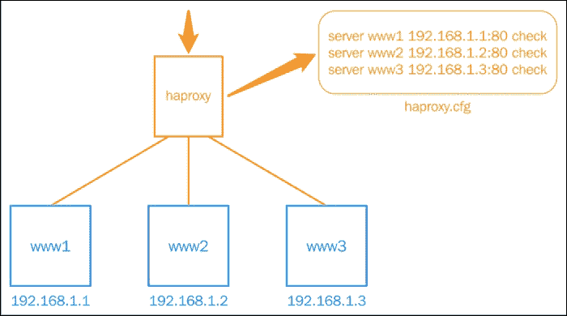
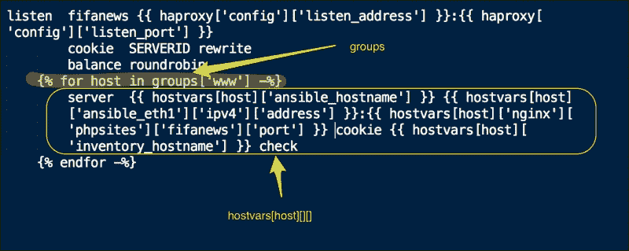
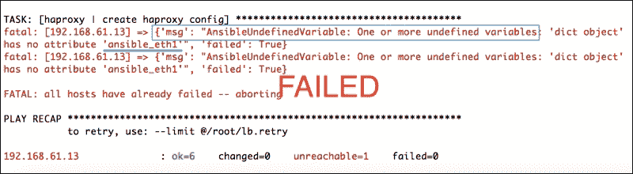
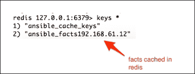

# 第八章：节点发现和集群化

对于大多数现实场景，我们需要创建一个计算节点集群，其上运行着相互连接的应用程序。例如，我们正在构建的 WordPress 网站需要将 Web 服务器和数据库连接在一起。

集群基础设施具有拓扑结构，其中一类节点应该能够发现关于不同或相同类别服务器的信息。例如，WordPress 应用服务器需要发现关于数据库服务器的信息，而负载均衡器需要了解每个 Web 服务器的 IP 地址/主机名，以便将流量发送到这些服务器。本章重点介绍 Ansible 提供的用于将节点分组并发现相互连接的节点属性的原语。

在本章中，我们将学习以下内容：

+   发现集群中其他节点的信息

+   使用发现的魔术变量动态生成配置

+   为什么以及如何启用事实缓存

# 使用魔术变量进行节点发现

我们已经看到了用户定义的变量以及系统数据，即事实。除了这些之外，还有一些变量用于定义关于节点、清单和播放的元信息，例如节点属于哪些组、哪些组包含在清单中、哪些节点属于哪些组等。这些隐式设置的变量称为**魔术**变量，对于发现节点和拓扑信息非常有用。下表列出了最有用的魔术变量及其描述：

| 魔术变量 | 描述 |
| --- | --- |
| `hostvars` | 这些是设置在另一台主机上的查找变量或事实。 |
| `groups` | 这是清单中组的列表。可以使用它来遍历一组节点以发现其拓扑信息。 |
| `group_names` | 这是节点所属的组列表。 |
| `inventory_hostname` | 这是清单文件中设置的主机名。它可能与`ansible_hostname`事实不同。 |
| `play_hosts` | 这是属于当前播放的所有主机的列表。 |

除了上表之外，还有一些额外的魔术变量，例如`delegate_to`、`inventory_dir`和`inventory_file`参数，但这些与节点发现无关，使用频率较低。

现在我们将创建一个新角色作为负载均衡器，该角色依赖于魔术变量提供的节点发现功能。

# 创建负载均衡器角色

我们创建了 Nginx 和 MySQL 角色来服务 WordPress 网站。但是，如果我们必须构建可扩展的网站，我们还需要添加一个负载均衡器。这个负载均衡器将作为传入请求的入口点，然后将流量分散到可用的 Web 服务器上。让我们考虑以下情况，我们的 fifanews 站点已经成为一瞬间的热门。流量呈指数增长，我们一直在使用的单个 Web 服务器方法正在出现问题。我们需要水平扩展并添加更多的 Web 服务器。一旦我们开始创建更多的 Web 服务器，我们还需要一些机制来平衡这些流量。我们被委托创建一个 `haproxy` 角色，它将自动发现我们集群中的所有 Web 服务器并将其添加到其配置中。

下图解释了使用 HAProxy 作为前端，在后端平衡 Web 服务器负载的情况。HAProxy 是一个广泛使用的开源 TCP/HTTP 负载均衡器。让我们看看下面的图表：



在接下来的步骤中，我们不仅将创建一个 `haproxy` 模块，还将使用魔术变量自动配置其 IP 地址为所有 Web 服务器节点：

1.  让我们从使用以下命令创建编写此角色所需的框架开始：

    ```
    $ ansible-galaxy init --init-path roles/ mysql

    ```

    输出如下所示：

    ```
     haproxy was created successfully

    ```

1.  现在我们将向变量默认添加与 `haproxy` 角色相关的一些变量：

    ```
    ---
    # filename: roles/haproxy/defaults/main.yml
    haproxy:
      config:
        cnfpath: /etc/haproxy/haproxy.cfg
        enabled: 1
        listen_address: 0.0.0.0
        listen_port: 8080
      service: haproxy
      pkg: haproxy
    ```

    ### 提示

    尽管为 haproxy 支持的每个配置添加参数是一个好的做法，但在编写这个角色时，我们将坚持使用一部分参数；这对于节点发现特别有用。

1.  现在，让我们创建一些任务和处理程序，在 Ubuntu 主机上安装、配置和管理 haproxy 服务：

    ```
    ---
    # filename: roles/haproxy/tasks/main.yml
    - include: install.yml
    - include: configure.yml
    - include: service.yml

    ---
    # filename: roles/haproxy/tasks/install.yml
      - name: install haproxy
        apt:
          name: "{{ haproxy['pkg'] }}"

    ---
    # filename: roles/haproxy/tasks/configure.yml
     - name: create haproxy config
       template: src="img/haproxy.cfg.j2" dest="{{ haproxy['config']['cnfpath'] }}" mode=0644
       notify:
        - restart haproxy service

     - name: enable haproxy
       template: src="img/haproxy.default.j2" dest=/etc/default/haproxy mode=0644
       notify:
        - restart haproxy service

    ---
    # filename: roles/haproxy/tasks/service.yml
     - name: start haproxy server
       service:
         name: "{{ haproxy['service'] }}" 
         state: started

    ---
    # filename: roles/haproxy/handlers/main.yml
    - name: restart haproxy service
      service: name="{{ haproxy['service'] }}" state=restarted
    ```

以下是前述代码的分析：

+   根据最佳实践，我们为每个阶段创建了单独的任务文件：install、configure 和 service。然后我们从主任务文件，即 `tasks/main.yml` 文件中调用这些文件。

+   HAProxy 的配置文件将使用 Jinja2 模板创建在 `/etc/haproxy/haproxy.cfg` 中。除了创建配置外，我们还需要在 `/etc/defaults/haproxy` 文件中启用 `haproxy` 服务。

+   安装、服务和处理程序与我们之前创建的角色类似，因此我们将跳过描述。

我们在 `configure.yml` 文件中定义了模板的使用。现在让我们创建模板：

```
#filename: roles/haproxy/templates/haproxy.default
ENABLED="{{ haproxy['config']['enabled'] }}"

#filename: roles/haproxy/templates/haproxy.cfg.j2
global
        log 127.0.0.1 local0
        log 127.0.0.1 local1 notice
        maxconn 4096
        user haproxy
        group haproxy
        daemon

defaults
        log global
        mode http
        option httplog
        option dontlognull
        retries 3
        option redispatch
        maxconn 2000
        contimeout 5000
        clitimeout 50000
        srvtimeout 50000

listen fifanews {{ haproxy['config']['listen_address'] }}:{{ haproxy['config']['listen_port'] }}
        cookie  SERVERID rewrite
        balance roundrobin
    
        server {{ hostvars[host]['ansible_hostname'] }} {{ hostvars[host]['ansible_eth1']['ipv4']['address'] }}:{{ hostvars[host]['nginx']['phpsites']['fifanews']['port'] }} cookie {{ hostvars[host]['inventory_hostname'] }} check
    
```

我们在 `roles/haproxy/templates/haproxy.cfg.j2` 创建的第二个模板对于我们来说尤为重要，与节点发现相关。下图显示了标记了魔术变量的相关部分：



让我们分析这个模板片段：

+   我们正在使用魔术变量 `groups` 来查找清单中属于 `www` 组的所有主机，如下所示：

    

+   对于每个发现的主机，我们使用 `hostvars` 参数获取事实以及用户定义的变量，这是另一个魔术变量。我们正在查找事实和用户定义的变量，以及另一个魔术变量 `inventory_hostname`，如下所示：

    {{ hostvars[host]['ansible_eth1']['ipv4']['address'] }}

    ```
    {{ hostvars[host]['inventory_hostname'] }}
    {{ hostvars[host]['nginx']['phpsites']['fifanews']['port'] }}
    ```

要将此角色应用于清单中定义的负载均衡器主机，我们需要创建一个 play，这应该是 `site.yml` 文件的一部分，这是我们的主 playbook：

```
---
#filename: lb.yml
- hosts: lb
  remote_user: vagrant
  sudo: yes
  roles:
     - { role: haproxy, when: ansible_os_family == 'Debian' }

---
# This is a site wide playbook 
# filename: site.yml
- include: db.yml
- include: www.yml
- include: lb.yml
```

现在，使用以下命令运行 playbook：

```
$ ansible-playbook -i customhosts site.yml

```

上述运行将安装 `haproxy` 并在后端部分的 `haproxy.cfg` 文件中添加所有 web 服务器的配置。`haproxy.cfg` 文件的示例如下所示：

```
listen fifanews 0.0.0.0:8080
     cookie  SERVERID rewrite
     balance roundrobin
     server  vagrant 192.168.61.12:8080 cookie 192.168.61.12 check
```

# 访问非 playbook 主机的事实

在早期的练习中，我们启动了主 playbook，该 playbook 调用所有其他 playbook 来配置整个基础架构。有时，我们可能只想配置基础架构的一部分，在这种情况下，我们可以只调用个别的 playbook，例如 `lb.yml`、`www.yml` 或 `db.yml`。让我们尝试仅为负载均衡器运行 Ansible playbook：

```
$ ansible-playbook -i customhosts lb.yml

```

哎呀！失败了！这是输出片段的快照：



Ansible 因为无法从主机中找到不再属于 playbook 的变量而退出出错。下面是当涉及到魔术变量时 Ansible 的行为方式：

+   当 Ansible 在主机上运行代码时，它开始收集事实。然后将这些事实存储在内存中，以供 playbook 运行期间使用。这是默认行为，可以关闭。

+   要使主机 B 从主机 A 发现变量，Ansible 应该在 playbook 的早期与主机 A 进行通信。

Ansible 的这种行为可能导致不良结果，并且可能限制主机发现关于仅属于其自己 play 的节点的信息。

## 使用 Redis 进行事实缓存

可以通过缓存事实来避免从非 playbook 主机中发现事实的失败。此功能已在 Ansible 1.8 版本中添加，并支持在 **Redis** 中缓存事实，在内存数据存储中的键值。这需要两个更改：

+   在 Ansible 控制节点上安装并启动 Redis 服务

+   配置 Ansible 将事实发送到 Redis 实例

现在让我们使用以下命令安装并启动 Redis 服务器：

```
$ sudo apt-get install redis-server
$ sudo service redis-server start
$ apt-get install python-pip
$ pip install redis

```

这将在 Ubuntu 主机上安装 Redis 并启动服务。如果您有基于 `rpm` 包的系统，可以按照以下方式安装：

```
$ sudo yum install redis
$ sudo yum install python-pip
$ sudo service start redis
$ sudo pip install redis

```

### 提示

在启用事实缓存之前，首先检查您是否正在运行与 1.8 版本相等或更高版本的 Ansible。您可以通过运行命令 `$ ansible –version` 来执行此操作。

现在我们已经启动了 Redis，是时候配置 Ansible 了。让我们按照以下步骤编辑 `ansible.cfg` 文件：

```
# filename: /etc/ansible/ansible.cfg
# Comment  following lines 
# gathering = smart
# fact_caching = memory
# Add  following lines 
gathering = smart
fact_caching = redis
fact_caching_timeout = 86400
fact_caching_connection = localhost:6379:0
```

现在让我们通过运行配置 web 服务器的 playbook 来验证这个设置：

```
$ ansible-playbook -i customhosts www.yml
$ redis-cli 
$ keys *

```

让我们来看下面的截图：



现在我们将尝试再次运行负载均衡器 playbook，使用以下命令：

```
$ ansible-playbook -i customhosts lb.yml

```

这一次成功通过。它能够发现不属于 play 的 Web 服务器的事实。

## 在文件中缓存事实

尽管使用 Redis 是推荐的方法，但也可以将事实缓存到平面文件中。Ansible 可以使用 JSON 格式将事实写入文件。要将 JSON 文件作为格式启用，我们只需编辑`ansible.cfg`文件如下：

```
   # filename: /etc/ansible/ansible.cfg 
   fact_caching = jsonfile
fact_caching_connection = /tmp/cache
```

确保指定的目录存在且具有正确的权限：

```
$ mkdir /tmp/cache
$ chmod 777 /tmp/cache

```

完成这些更改后，我们所要做的就是运行 playbook，Ansible 将开始将事实写入以此目录下创建的主机的 JSON 文件中。

# 回顾问题

你认为你已经足够理解本章了吗？试着回答以下问题来测试你的理解：

1.  神奇变量与事实变量有何不同？它们用于什么？

1.  哪个神奇变量能让我们遍历一个 Web 服务器列表，并为每个枚举一个 IP 地址？

1.  为什么需要事实缓存？缓存事实的不同模式是什么？

1.  `inventory_hostname`事实变量是否总是与`ansible_hostname`事实变量相同？

# 摘要

在本章中，您学习了如何发现群集中其他节点的信息以将它们连接在一起。我们从介绍神奇变量开始，然后看了看最常用的变量。然后，我们开始为 haproxy 创建角色，它会自动发现 Web 服务器并动态创建配置。最后，我们看了一下如何访问不在 playbook 中的主机的信息的问题，并且您学会了如何通过启用事实缓存来解决它。神奇变量非常强大，特别是在使用 Ansible 编排基础架构时，自动发现拓扑信息非常有用。

在下一章中，您将学习如何使用 vault 安全地传递数据，这是一个加密的数据存储。
