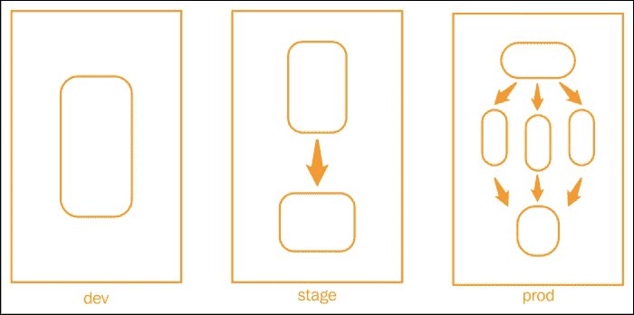
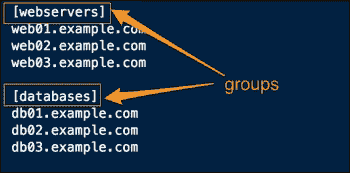
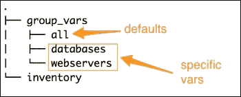
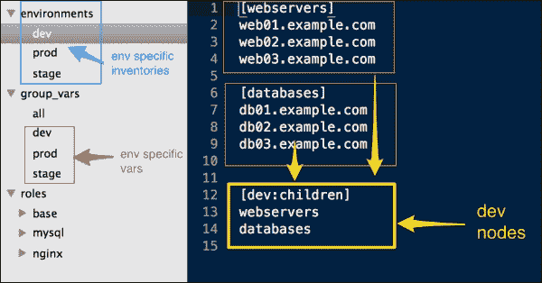
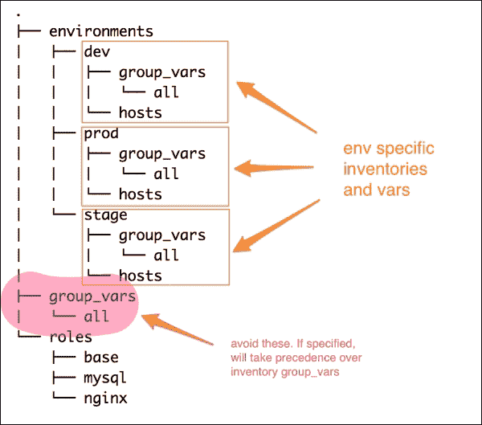
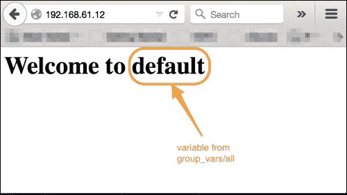
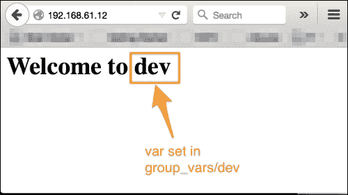

# 第十章：管理环境

大多数组织在构建其基础架构时从单个环境开始。然而，随着复杂性的增长，我们必须有一个工作流程，涉及在开发环境中编写代码并对其进行测试，然后在预备或预生产环境中进行密集的 QA 循环，以确保代码在生产环境中的稳定性得到测试，然后我们最终发布它。为了模拟真实世界的行为，这些环境必须运行相同的应用程序堆栈，但很可能在不同的规模下运行。例如，预备环境将是生产的小规模副本，服务器较少，最常见的情况是，开发环境将在虚拟化环境中的个人工作站上运行。尽管所有这些环境都运行相同的应用程序堆栈，但它们必须彼此隔离，并且必须具有特定于环境的配置，如下所述：

+   `dev` 组中的应用程序不应指向预备中的数据库，反之亦然

+   生产环境可能有自己的软件包存储库

+   测试环境可能在端口 `8080` 上运行 Web 服务器，而其他所有环境都在端口 `80` 上运行

通过角色，我们可以创建一个模块化的代码来为所有环境配置相同的环境。 Ansible 的另一个重要特性是将代码与数据分开的能力。结合使用这两者，我们可以将基础架构建模成这样一种方式，我们可以创建特定于环境的配置，而无需修改角色。我们只需提供来自不同位置的变量即可创建它们。让我们来看一下下面的截图：



前面的图示了同一组织内的三个不同环境，即开发、预备和生产环境。这三个环境都运行相同的应用程序堆栈，其中包括负载均衡器、Web 服务器和数据库服务器。但需要注意的两点是：

+   每个环境根据其规模不同，可以配置运行一个或多个角色（例如，`db` 加 `www`）的主机。

+   每个环境都与其他环境隔离开来。生产环境中的 Web 服务器不会连接到预备环境中的数据库，反之亦然。

在本章中，我们将介绍以下主题：

+   使用 Ansible 管理多个环境

+   分隔不同环境的库存文件

+   使用 `group_vars` 和 `host_vars` 组指定特定于环境的配置

# 管理环境的方法

您已经了解到需要创建具有相同角色但具有不同数据的不同环境。在撰写本文时，使用 Ansible 管理此类多个环境场景的方法不止一种。我们将在这里讨论两种方法，并且您可以根据自己的判断选择其中之一或创建您自己的方法。没有明确的创建环境的方式，但是以下是 Ansible 的内置功能，可能会派上用场：

+   使用清单将属于一个环境的主机分组并将它们与其他环境中的主机隔离开来

+   使用清单变量，如`group_vars`和`host_vars`组，提供特定于环境的变量

在我们继续之前，回顾一下适用于清单组、变量和优先规则的清单组将会很有用。

## 清单组和变量

您已经学习了 Ansible 清单遵循 INI 样式配置的需求，其中主机与方括号括起来的组标签一起组合，如下图所示：



然后可以指定清单变量，以使其与这些组名称匹配，使用`group_vars`或在`host_vars`文件中匹配特定主机。除了这些组名称之外，还可以使用一个名为"`all`"的文件为`group_vars`和`host_vars`文件指定默认变量，从而产生以下结构：



在这种情况下，如果你在`all`和`webserver`文件中指定了相同的变量，那么更具体的变量将优先。这意味着，如果你在`group_vars`下的`webserver`组中重新定义了一个变量，而在`all`中也定义了它，那么参数的值将被设置为在`webserver`中定义的更具体的值。这是我们在下面的方法中利用的行为。

## 方法 1 – 使用清单中的嵌套组

除了能够使用 INI 样式创建组外，Ansible 还支持嵌套组，其中一个完整的组可以是另一个父组的一部分。第一种方法就是基于这个特性的，并且将逐步讨论，如下所示：

1.  创建一个环境目录，用于存储特定环境的清单文件。最好以环境命名它们。添加属于该环境的主机并对它们进行分组。一个组可以根据任何标准进行分组，比如角色、位置、服务器机架等等。例如，创建一个名为"`webservers`"的组来添加所有的 Apache web 服务器，或者一个名为"`in`"的组来添加所有属于该位置的主机。

1.  添加一个以环境名称命名的父组，例如，production、development、staging 等，并将属于该环境的所有其他组包括为子组。每个这样的组又包括一组主机，例如：

    ```
    [dev:children]
      webservers
      databases
    ```

1.  现在，在`group_vars/all`文件中创建通用/默认组变量。然后，可以从特定于环境的文件中覆盖这些变量。

1.  要指定环境特定的变量，请创建`group_vars/{{env}}`文件，如下所示：

    ```
    group_vars
      |_ all
      |_ dev
      |_ stage
    ```

这也将覆盖`all`组中的变量。以下图示了使用此方法创建的文件结构： 



创建完毕后，只需运行`ansible-playbook`命令即可调用特定于环境的清单。

例如，让我们看一下以下命令：

```
$ ansible-playbook -i environments/dev site.yml

```

## 方法 2 – 使用环境特定的清单变量

第二种方法不需要嵌套组，并依赖于 Ansible 的以下两个特性：

+   Ansible-playbook 的 `-i` 选项还接受一个目录，该目录可以包含一个或多个清单文件

+   主机和组变量可以相对于清单文件，并且还可以相对于 Ansible 仓库根目录中的`group_vars`和`host_vars`组

这种方法将为每个环境创建完全隔离的变量文件。我们创建的文件结构如下图所示：



以下是用于此方法的逐步方法：

1.  在 Ansible 仓库的根目录下创建一个名为环境的目录。在此目录下，为每个环境创建一个目录。

1.  每个环境目录包含两个内容：

    +   主机清单。

    +   清单变量，例如，`group_vars`和`host_vars`。为了进行环境特定的更改，我们关注`group_vars`。

1.  每个环境都包含自己的`group_vars`目录，该目录又可以包含一个或多个文件，包括默认的`all`文件。没有两个环境共享这些变量。

### 提示

**注意**: 除了特定于环境的`group_vars`组外，还可以使用位于 Ansible-playbook 仓库顶部的`group_vars`文件。但是，建议不要在此方法中使用它，因为如果值相同，环境特定更改将被 playbook 的`group_vars`中的值覆盖。

使用此方法，可以针对特定环境启动 playbook，如下所示：

```
$ ansible-playbook -i environments/dev site.py

```

在这里，`environments/dev`是一个目录。

# 创建一个开发环境

在了解了如何管理环境之后，让我们尝试通过重构现有代码并创建一个 dev 环境来实践一下。为了测试它，让我们创建一个名为"`env_name`"的变量，并将 Nginx 的默认页面动态使用该变量并打印环境名称。然后，我们将尝试从环境中覆盖此变量。让我们看看以下步骤：

1.  让我们从设置默认变量开始：

    ```
    #group_vars/all
    env_name: default
    ```

1.  然后，在`roles/nginx/tasks/configure.yml`文件中，将 Nginx 任务更改为使用模板而不是静态文件，因此进行以下修改：

    ```
     - name: create home page for default site
        copy: src=index.html dest=/usr/share/nginx/html/index.html
    ```

    将其修改为以下代码：

    ```
     - name: create home page for default site
       template:
         src: index.html.j2
         dest: /usr/share/nginx/html/index.html
    ```

1.  现在，让我们尝试运行 playbook 而不创建环境：

    ```
    $ ansible-playbook -i customhosts www.yml

    ```

1.  运行完成后，让我们检查默认网页：

1.  它打印了我们从`group_vars/all`文件中设置的变量的值，默认值。

1.  现在，让我们创建一个文件，以便我们可以管理`dev`环境。由于我们将使用相同的一组主机，因此我们可以将现有的清单转换为 dev，并在环境名称后添加一个父组：

    ```
    $ mkdir environments/
    $ mv customhosts environments/dev 
     [ edit  environments/dev ]

    ```

1.  将所有组添加到`dev`环境中，如下所示：

    ```
    [dev:children]
    db
    www
    lb
    ```

    清单文件如下所示，我们必须进行以下更改：

    1.  现在，让我们为`dev`环境创建一个`group_vars`文件，并覆盖环境名称：

        ```
          #file: environments/dev
        env_name: dev
        ```

    1.  这一次，我们将以以下方式运行 playbook：

        ```
        $ ansible-playbook -i environments/dev www.yml

        ```

    我们将看到以下截图作为输出：

    

# 复习问题

您是否认为自己已经足够了解本章了？尝试回答以下问题来测试您的理解：

1.  如何为同一环境指定多个主机清单？

1.  如果您在`environments/dev/group_vars/all`文件中定义了一个变量，同时在`group_vars/all`文件中也定义了相同的变量，哪个会优先？

1.  如何在主机清单文件中创建一组组？

# 概要

在本章中，您学习了如何创建与软件开发工作流程或阶段相对应的多个环境。我们从清单组和清单变量的简要概述开始，特别是`group_vars`文件。接着是用于管理环境的两种方法。最后，我们重构了我们的代码，继续创建了`dev`环境，并通过覆盖环境中的一个变量进行了测试。在下一章中，您将学习有关基础设施编排以及 Ansible 在编排复杂基础设施工作流程、零停机部署等方面的优势。
