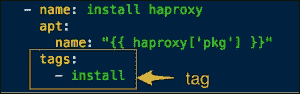
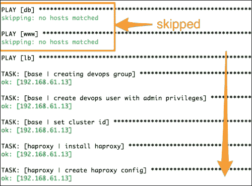

# 第十一章：使用 Ansible 编排基础架构

在不同的情况下使用编排可能意味着不同的事情。以下是一些编排场景的描述：

+   在一组主机上并行运行临时命令，例如，使用 `for` 循环遍历一组 Web 服务器以重新启动 Apache 服务。这是最原始的编排形式。

+   调用编排引擎启动另一个配置管理工具以确保正确的顺序。

+   以特定顺序配置多层应用程序基础设施，并能够对每个步骤进行精细控制，并且在配置多个组件时具有来回移动的灵活性。例如，安装数据库，设置 Web 服务器，返回数据库，创建模式，转到 Web 服务器以启动服务等。

大多数实际场景与最后一个场景相似，涉及多层应用堆栈和多个环境，重要的是按照一定顺序和协调的方式启动和更新节点。在继续下一步之前测试应用程序是否正常运行也很有用。首次设置堆栈与推送更新的工作流可能不同。有时您可能不希望立即更新所有服务器，而是分批处理以避免停机时间。

在本章中，我们将介绍以下主题：

+   编排场景

+   将 Ansible 用作基础架构编排引擎

+   实施滚动更新

+   使用标签、限制和模式

+   将测试构建到剧本中

# Ansible 作为编排器

在任何编排情景下，Ansible 都比其他工具更加出色。当然，正如 Ansible 的创建者所说，它不仅是一个配置管理工具，这是真的。 Ansible 可以在前面讨论的任何编排场景中找到自己的位置。它旨在管理复杂的多层部署。即使您的基础架构已经使用其他配置管理工具自动化了，您也可以考虑使用 Ansible 来编排这些工具。

让我们讨论 Ansible 提供的具体功能，这些功能对编排非常有用。

## 多个剧本和顺序

与大多数其他配置管理系统不同，Ansible 支持在不同时间运行不同的剧本来配置或管理相同的基础架构。您可以创建一个剧本来首次设置应用程序堆栈，另一个剧本按照一定的方式推送更新。剧本的另一个属性是它可以包含多个播放，这允许将应用程序堆栈中每个层的主机分组，并同时对其进行配置。

## 预任务和后任务

我们之前使用过前置任务和后置任务，在编排过程中非常相关，因为这些任务允许我们在运行播放之前和之后执行任务或运行验证。让我们以更新注册在负载均衡器上的 Web 服务器为例。使用前置任务，可以将 Web 服务器从负载均衡器中移除，然后将角色应用于 Web 服务器以推送更新，随后是后置任务，将 Web 服务器重新注册到负载均衡器中。此外，如果这些服务器由 **Nagios** 监控，可以在更新过程中禁用警报，然后使用前置任务和后置任务自动重新启用。这可以避免监控工具可能以警报的形式产生的噪音。

## 委托

如果你希望任务选择性地在某一类主机上运行，特别是当前播放范围之外的主机，Ansible 的委托功能会很方便。这与之前讨论的场景相关，并且通常与前置任务和后置任务一起使用。例如，在更新 Web 服务器之前，需要将其从负载均衡器中注销。现在，这个任务应该在播放范围之外的负载均衡器上运行。可以通过使用委托功能来解决这个问题。使用前置任务时，可以使用 `delegate_to` 关键字在负载均衡器上启动脚本，执行注销操作，如下所示：

```
- name: deregister web server from lb
  shell: < script to run on lb host >
  delegate_to: lbIf there areis more than one load balancers, anan inventory group can be iterated over as, follows: 
- name: deregister web server from lb
  shell: < script to run on lb host >
  delegate_to: "{{ item }}"
  with_items: groups.lb
```

## 滚动更新

这也被称为批量更新或零停机更新。假设我们有 100 个需要更新的 Web 服务器。如果我们在清单中定义它们并针对它们启动 playbook，Ansible 将同时开始更新所有主机。这也可能导致停机时间。为了避免完全停机并实现无缝更新，有意义的做法是分批更新，例如，每次更新 20 个。在运行 playbook 时，可以使用 `serial` 关键字指定批处理大小。让我们看一下以下代码片段：

```
- hosts: www
  remote_user: vagrant
  sudo: yes
  serial: 20 
```

## 测试

在编排过程中，不仅要按顺序配置应用程序，还要确保它们实际启动并按预期工作。Ansible 模块，如 `wait_for` 和 `uri`，可以帮助您将这些测试构建到 playbooks 中，例如：

```
- name: wait for mysql to be up
  wait_for: host=db.example.org port=3106 state=started
- name: check if a uri returns content
  uri: url=http://{{ inventory_hostname }}/api
  register: apicheck
```

`wait_for` 模块可以额外用于测试文件的存在。当你希望在继续之前等待服务可用时，它也非常有用。

## 标签

Ansible play 将角色映射到特定的主机。在运行 play 时，会执行从主要任务调用的整个逻辑。在编排时，我们可能只需要根据我们想要将基础架构带入的阶段来运行部分任务。一个例子是 zookeeper 集群，重要的是同时启动集群中的所有节点，或者在几秒钟的间隔内。Ansible 可以通过两阶段执行来轻松地实现这一点。在第一阶段，您可以在所有节点上安装和配置应用程序，但不启动它。第二阶段涉及几乎同时在所有节点上启动应用程序。这可以通过给个别任务打标签来实现，例如，configure、install、service 等。

举个例子，让我们来看下面的屏幕截图：



在运行 playbook 时，所有具有特定标签的任务可以使用`--tags`来调用，如下所示：

```
$ Ansible-playbook -i customhosts site.yml –-tags install

```

标签不仅可以应用于任务，还可以应用于角色，如下所示：

```
{ role: nginx, when: Ansible_os_family == 'Debian', tags: 'www' }
```

如果一个特定的任务需要始终执行，即使通过标签进行过滤，使用一个名为`always`的特殊标签。这将使任务执行，除非使用了覆盖选项，比如`--skip-tags always`。

## 模式和限制

限制可以用来在主机的一个子集上运行任务，这些主机是通过模式进行筛选的。例如，以下代码将仅在属于`db`组的主机上运行任务：

```
$ Ansible-playbook -i customhosts site.yml --limit db

```

模式通常包含一组要包括或排除的主机。可以指定一个以上的模式组合，如下所示：

```
$ Ansible-playbook -i customhosts site.yml --limit db,lb

```

使用冒号作为分隔符可以进一步过滤主机。以下命令将在除了属于`www`和`db`组的主机之外的所有主机上运行任务：

```
$ Ansible-playbook -i customhosts site.yml --limit 'all:!www:!db'

```

请注意，通常这需要用引号括起来。在这个模式中，我们使用了`all`组，该组匹配清单中的所有主机，并且可以用`*`替代。接着是`!`来排除`db`组中的主机。这个命令的输出如下，显示了由于先前使用的过滤器，名称为`db`和`www`的 play 被跳过了，因为没有主机匹配：



现在让我们看看这些编排特性是如何运作的。我们将首先给角色打上标签，进而进行多阶段执行，然后编写一个新的 playbook 来管理对 WordPress 应用程序的更新。

# 给角色打标签

现在让我们开始给之前创建的角色打上标签。我们将创建以下标签，这些标签对应着应用程序管理中的阶段：

+   安装

+   配置

+   开始

这是给`haproxy`角色添加标签的例子。为了避免冗余，将其他角色加上标签的操作从文本中排除掉。我们可以给角色内的任务添加标签，或者在 playbook 中给整个角色加上标签。让我们从给任务加标签开始：

```
---
# filename: roles/haproxy/tasks/install.yml
  - name: install haproxy
    apt:
      name: "{{ haproxy['pkg'] }}"
    tags:
     - install

---
# filename: roles/haproxy/tasks/configure.yml
 - name: create haproxy config
    template: src="img/haproxy.cfg.j2" dest="{{ haproxy['config']['cnfpath'] }}" mode=0644
   notify:
    - restart haproxy service
   tags:
    - configure

 - name: enable haproxy
    template: src="img/haproxy.default.j2" dest=/and more/default/haproxy mode=0644
    notify:
    - restart haproxy service
    tags:
    - configure

---
# filename: roles/haproxy/tasks/service.yml
 - name: start haproxy server
    service:
      name: "{{ haproxy['service'] }}" 
      state: started
    tags:
    - start
```

在角色中打上标签后，我们还会在 playbooks 中打上角色的标签，如下所示：

```
# filename: db.yml
  roles:
- { role: mysql, tags: 'mysql' }

#filename: www.yml
  roles:
     - { role: nginx, when: Ansible_os_family == 'Debian', tags: [ 'www', 'nginx' ] }
     - { role: php5-fpm, tags: [ 'www', 'php5-fpm' ] }
     - { role: wordpress, tags: [ 'www', 'wordpress' ] }

#filename: lb.yml
  roles:
- { role: haproxy, when: Ansible_os_family == 'Debian', tags: 'haproxy' }
```

应用后，我们主要 playbook 的标签可以列举如下：

```
$ Ansible-playbook -i customhosts site.yml --list-tags

#Output:
playbook: site.yml

 play #1 (db): TAGS: []
 TASK TAGS: [configure, install, mysql, start]

 play #2 (www): TAGS: []
 TASK TAGS: [configure, install, nginx, php5-fpm, ssl, start, wordpress, www]

 play #3 (lb): TAGS: []
 TASK TAGS: [configure, haproxy, install, start]

```

使用标签和限制的组合使我们能够在 playbook 运行中精细控制执行的内容，例如：

```
# Run install tasks for haproxy, 
$ Ansible-playbook -i customhosts site.yml --tags=install --limit lb

# Install and configure all but web servers
$ Ansible-playbook -i customhosts site.yml --tags=install,configure --limit 'all:!www'

# Run all tasks with tag nginx
$ Ansible-playbook -i customhosts site.yml --tags=nginx

```

# 为 WordPress 创建一个编排 playbook

我们有一个站点范围的 playbook，即`site.yml`文件，该文件用于安装和配置完整的 WordPress 堆栈。然而，要实现无停机更新应用程序以及部署新版本，`site.yml`文件并不是理想的 playbook。我们希望遵循一个涉及以下步骤的工作流程：

1.  逐个更新 Web 服务器。这将避免任何停机时间。

1.  在更新之前，从 haproxy 负载均衡器中注销 Web 服务器。这将停止流量流向 Web 服务器，以避免停机时间。

1.  运行与 WordPress 应用程序相关的角色，即 Nginx、php5-fpm 和 WordPress。

1.  确保 Web 服务器正在运行并监听端口 80。

1.  将服务器重新注册到 haproxy 并重新开始发送流量。

让我们创建一个名为`update.yml`的 playbook，它正如之前解释的一样进行编排，并且使用了本章前面讨论的大部分功能。以下是这个 playbook：

```
 ---
# Playbook for updating web server in batches
# filename: update_www.yml
- hosts: www
  remote_user: vagrant
  sudo: yes
  serial: 1
  pre_tasks:
    - name: deregister web server from  load balancer
    shell: echo "disable server fifanews/{{ Ansible_hostname }}" | socat stdio /var/lib/haproxystats
    delegate_to: "{{ item }}"
    with_items: groups.lb
  roles:
    - { role: nginx, when: Ansible_os_family == 'Debian' }
    - php5-fpm
    - wordpress
  post_tasks:
    - name: wait for web server to come up 
    wait_for: host={{ inventory_hostname }} port=80 state=started
    - name: register webserver from  load balancer
    shell: echo "enable server fifanews/{{ Ansible_hostname }}" | socat stdio /var/lib/haproxystats
    delegate_to: "{{ item }}"
    with_items: groups.lb
```

让我们分析这段代码：

+   playbook 只包含一个 play，该 play 在属于`www 组`的主机上运行。

+   serial 关键字指定批大小，并允许无停机滚动更新。在我们的情况下，由于主机较少，我们选择逐个更新一个 Web 服务器。

+   在应用该角色之前，使用预任务部分从负载平衡器中注销主机，该部分运行一个带有**socat**的 shell 命令。这在所有负载平衡器上使用`delegate`关键字运行。Socat 是类似于并且功能更为丰富的 Unix 实用程序（nc）。

+   在注销主机后，应用角色；这将更新 Web 服务器的配置或部署新代码。

+   更新后，执行后任务，首先等待 Web 服务器启动并监听端口 80，只有在 Web 服务器准备就绪时，才将其重新注册到负载平衡器。

# 复习问题

你认为你已经足够了解本章了吗？尝试回答以下问题来测试你的理解：

1.  是否可能使用 Ansible 来编排另一个配置管理工具？

1.  如何使用 Ansible 实现无停机部署应用程序？

1.  `--limit`命令对 Ansible playbook 有什么作用？

1.  如何在 playbook 中针对给定角色运行任务的子集？

1.  使用预任务和后任务的目的是什么？

1.  可以使用哪些模块来从 playbook 运行测试？

1.  `always`标签为何如此特殊？

# 总结

我们在本章开始时讨论了编排是什么，不同的编排场景是什么，以及 Ansible 如何适应其中。您了解了 Ansible 在编排背景下的一系列丰富功能。这包括多 playbook 支持、预任务和后任务、标签和限制、运行测试等等。我们继续为之前创建的角色打标签，并学习如何使用标签、模式和限制的组合控制代码在哪些机器上运行的部分。最后，我们创建了一个新的 playbook 来编排工作流，更新 Web 服务器，其中包括零停机部署、委托、预任务和后任务以及测试。您还了解到 Ansible 可以适用于任何编排场景中。

这就是本书的结尾。在结束之前，我代表审阅者、编辑、贡献者和出版团队的其他成员，感谢您将本书视为您成为 Ansible 实践者的伴侣之一。

我们希望您现在已经熟悉了 Ansible 提供的各种原语，用于自动化常见基础设施任务、创建动态角色、管理多层应用程序配置、零停机部署、编排复杂基础设施等。我们希望您能够应用本书中所学知识创建有效的 Ansible playbook。
