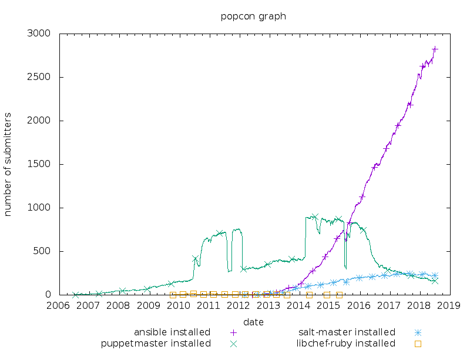
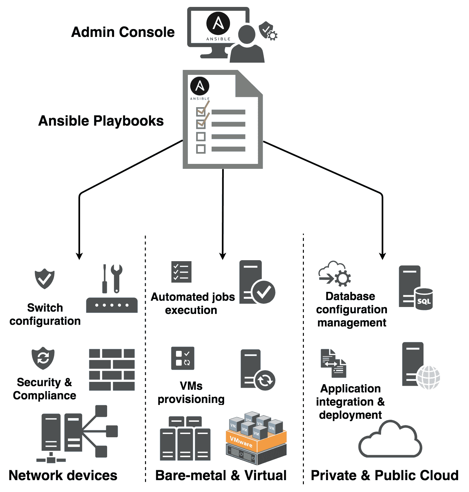
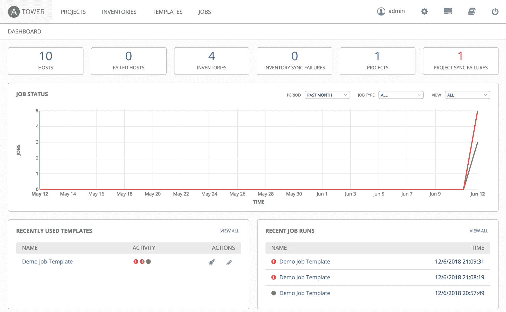
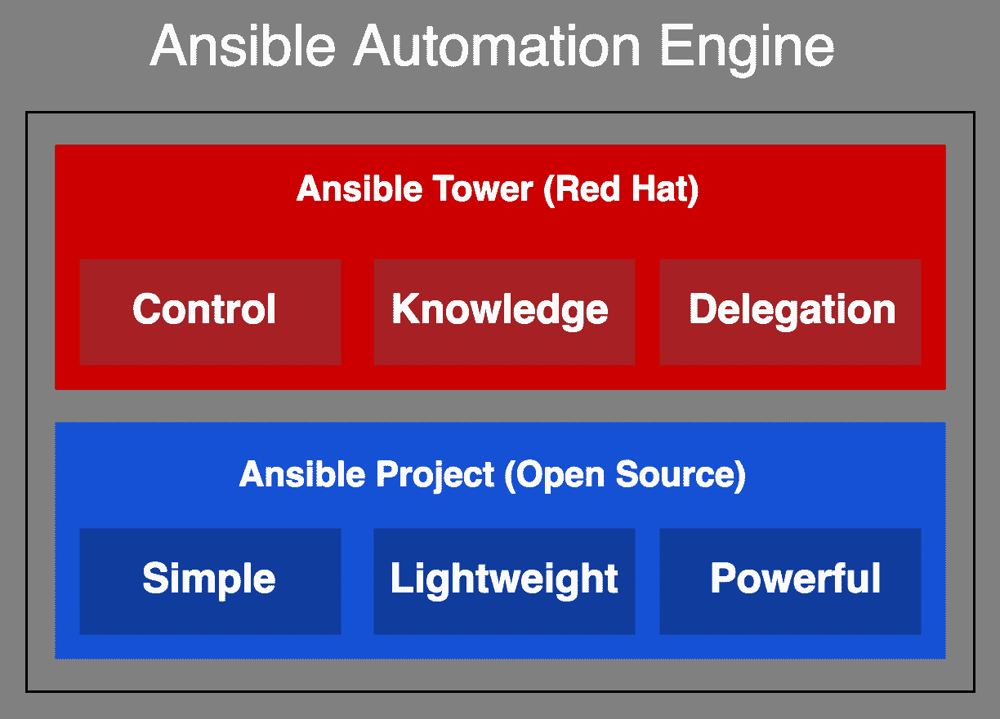

# 什么是 Ansible？

工业革命之后，引入了自动化，使已经高效的机械更加高效。这导致了工业建筑、车辆转向和稳定以及室内环境控制等许多其他发展。之后，信息革命开始，启动了一个新的优化过程。这一阶段旨在减少技术过程中的人为干预，并提高生产率。

如今，自动化已经成为各个领域的常态。它始于简单的管理员脚本，旨在简化和加快日常任务，并迅速发展成为完整的配置管理工具。这种快速发展背后的原因是市场需求的增加、基础架构和应用程序的扩展，以及新技术的出现，如持续集成、持续开发和机器配置，这些都需要更复杂的设置和配置。

按照本质，系统和网络管理员倾向于减少重复任务，简化复杂任务，并尽快转移到下一个任务。起初，有一些简单的脚本，如 Bash 或 PowerShell，能够优化标准环境中的任务。之后，出现了更长、更复杂的脚本，涉及 Python 或 Ruby 等高级编程语言。这些旨在解决跨多个平台或复杂环境中的任务，并使用自动化和编排工具来管理基础架构，使企业能够在一夜之间大幅增长，提供更多要求更高和更复杂的服务。管理员的角色是管理这种增长，并相应地采取行动，以确保无缝的用户体验。

本章将概述 Ansible。我们将演示 Ansible 现在是管理中大型基础架构的必备平台，而不是拥有物理、部分虚拟或混合的私有和公共云。其他自动化工具在安装、使用、速度和灵活性方面提供不同的优势，因此对于初次使用者来说，选择最合适的自动化工具可能会有些棘手。Ansible、Chef、Puppet 和 SaltStack 是市场上可用的主要配置管理工具。每个工具都遵循不同的部署、配置和管理机器的方法，以降低复杂性，提高速度、可靠性和合规性。本章将涵盖以下主题：

+   自动化工具的市场研究

+   介绍 Ansible 作为配置管理和任务编排工具

+   探索 Ansible 在操作系统、架构和云平台上的功能

+   Ansible 项目和 Tower 概述

# IT 配置管理市场

目前市场上主要使用的配置管理工具是 Ansible、Chef、Puppet 和 SaltStack。每个工具都有其优缺点，因此根据所重视的功能或首选的编程语言，找到合适的工具可能会有些挑战。在本节中，我们将简要介绍每个工具，并解释为什么我们在本书中选择了 Ansible。

Chef 是一个开源的客户端-服务器配置管理工具。它使用 Ruby 和**特定领域语言**（**DSL**）提供灵活的基础设施自动化框架，用于管理主机。这涵盖了所有类型的主机，包括裸机、虚拟机或云上的主机。由于其在大型云部署中的灵活性、稳定性和可靠性，Chef 在代码开发人员中非常常见。然而，设置和学习其功能可能会有一定挑战，因此新用户可能需要一些时间才能完全掌握它。

Puppet 是一个基于 Ruby 的配置管理和编排工具。它遵循主代理架构，需要被控制的主机需要安装 Puppet 代理来进行管理。Puppet 具有强大的自动化和报告功能，通过其用户界面，可以进行任务提交和主机实时报告。与 Chef 一样，Puppet 对于新用户来说设置和配置可能具有挑战性。执行个性化和复杂任务需要对 Ruby 和 DSL 有所了解。

Puppet 和 Chef 是两个最古老的配置管理平台。它们都使用 Ruby 和 DSL 来控制其代理。

SaltStack 是一个用 Python 编写的平台，旨在实现高速主代理通信。它的配置管理任务是用**另一种标记语言**（**YAML**）编码的。主服务器（或多个主服务器）使用 SSH 协议来控制代理/从属服务器。SaltStack 非常可扩展，意味着它可以很好地响应环境变化，易于使用，并且拥有强大的社区。另一方面，它的安装对于新用户来说可能很困难，其用户界面开发不够完善，它专注于 Linux，对其他操作系统的覆盖率一般，并且其文档缺乏良好的管理。

SaltStack 与 Ansible 非常相似。它们都使用易于使用的编程语言，即 Python 和 YAML。此外，SaltStack 和 Ansible 都能够快速执行任务，因为它们依赖 SSH 向主机发送命令。

与其他工具相比，Ansible 是一个相对较新的工具。它旨在简化任务自动化和编排的复杂性。它基于 Python 构建，并使用 YAML 来编写其作业，这是一种非常简单且接近英语的语言。这使得新用户可以轻松理解并自己编写。Ansible 不需要在主机上安装代理。它支持推送和拉取模型，通过 SSH 协议向其 Linux 节点发送命令，以及通过 WinRM 协议向其 Windows 节点发送命令。它可以无缝地部署和配置 VM、应用程序和容器，并且可以轻松扩展以适应环境的增长。它安装和配置简单，学习如何使用和编写其脚本也相对容易。Ansible 不需要安装代理，这提高了其通信速度。它在配置管理任务方面非常先进，但也可以作为基础设施编排工具。然而，它需要主节点的额外权限。用户很容易因多个任务而最终产生多个脚本，这可能会令人困惑，并且与较老的工具相比，它缺乏良好的 GUI 和成熟的平台。

这些工具每个都是为特定受众构建的。它们具有许多成熟的功能，以满足用户的独特需求，无论是简化其日常任务、提高生产率、加快主机配置，还是填补混合环境中的差距。

我们选择在本书中涵盖 Ansible，以使其具有未来的可持续性。我们都可以同意，Ansible 是一个新平台，因此它的设计和可定制性不如许多其他工具，但很容易看出 Ansible 的崛起速度。我们不仅谈论它支持的新技术数量，它正在引入和增强的模块数量，Ansible Galaxy 论坛上存在的社区支持，或 GitHub 项目的分支和收藏库。我们还在关注它在市场上的受欢迎程度和需求。

Red Hat 在 2015 年 10 月收购了 Ansible，并坚信 Ansible 是 IT 自动化和 DevOps 交付的领导者，具有简化混合云、OpenStack 环境和基于容器的服务管理的能力。“Ansible 在 IT 自动化和 DevOps 方面是明显的领导者，并帮助 Red Hat 在我们创建无摩擦 IT 的目标中迈出了重要的一步。”- Joe Fitzgerald，Red Hat 管理副总裁

如下图所示，Ansible 的使用频率比以往任何时候都要高，该图显示了每年从 Debian 存储库下载每个工具的主要软件包的数量：

上图是 Debian 存储库上 Ansible、Puppet、Chef 和 SaltStack 受欢迎程度统计数据。它是使用以下链接生成的：[`qa.debian.org/popcon-graph.php?packages=ansible%2C+puppetmaster%2C+salt-master%2C+libchef-ruby&show_installed=on&want_legend=on&want_ticks=on&from_date=2010&to_date=2018&hlght_date=&date_fmt=%25Y-%25m&beenhere=1.`](https://qa.debian.org/popcon-graph.php?packages=ansible%2C+puppetmaster%2C+salt-master%2C+libchef-ruby&show_installed=on&want_legend=on&want_ticks=on&from_date=2010&to_date=2018&hlght_date=&date_fmt=%25Y-%25m&beenhere=1) 此链接可用于生成关于其他 Debian 软件包的时间图。

# Ansible：简单、轻量、强大

Ansible 是一种领先的编排平台，可以实现自动化、主机配置管理和应用程序和虚拟机的部署。Ansible 可以自动化一系列 IT 基础设施功能，从简单的、日常的、重复的任务到机器配置或 DevOps 应用程序的持续集成和部署。它非常灵活，可以覆盖裸机、虚拟机和平台，以及公共或私有云环境。Ansible 还可以管理交换机、路由器和防火墙等网络设备。它还可以覆盖应用程序的设置、数据库管理系统的配置和行为、软件包管理器和简单的用户应用程序：

Ansible 标志如果这是你第一本关于配置管理的书，你正在寻找一种简单易行的方法，那么你来对地方了。

在 Linux 上使用系统的软件包管理器从发行存储库安装 Ansible 只需一条命令就足够了。另一种方法是使用 Python 的 PyPI 软件包管理器进行更快、更简单的安装。之后，它可以简单地用类似的方式执行任何命令。我们建议在更复杂或更大的环境中采取额外的步骤，编辑 Ansible 配置文件，使其读取`/etc/ansible/ansible.conf`，填写清单，并添加一些组变量。Ansible 不需要在客户端安装代理，但通过一些额外的步骤，可以使连接更加安全。Ansible 使用 YAML，这是一种简单的配置管理语言，用于 Ansible playbooks，它是一种人类可读的编码语言，因此可以轻松编写脚本。在发送特定任务的命令时，Ansible 服务器将 YAML 代码转换为实际的配置代码，以便立即在客户端上执行。

在本书的大多数教程中，服务器和 Linux 客户端将使用基于 Debian 的系统。配置文件的位置和包名称可能会因发行版而异。

Ansible 主机服务器是唯一的机器，必须满足推荐的计算资源，以便正确运行引擎。由于它是无代理的，客户端只接收以命令形式在系统上直接执行的任务。一些 Ansible 模块可能会通过从一台机器向另一台机器发送数据来消耗相当多的网络流量。这是执行任务所需的最低流量量，因为 Ansible 只使用了一小部分流量来将命令提交给主机。

Ansible 的快速增长使其成为一个非常强大的工具。它现在被认为是市场上领先的自动化引擎。通过其庞大的社区支持（Ansible Galaxy 和 GitHub 项目）和红帽公司的专有管理附加组件（Ansible Tower），用户可以选择各种角色、模块和附加组件，可以自动化每一个可以想象的 IT 任务。

Ansible 为其用户提供以下功能：

+   系统配置管理

+   遵循最佳 DevOps 实践的敏捷应用部署

+   简化的编排和自动化

+   零停机，持续部署

+   云原生应用的支持

+   简单且优化的容器采用

+   在自动化任务中嵌入安全性和合规性策略

+   简化的主机配置

+   支持多层部署

+   支持异构 IT 基础设施

+   支持多层计算机架构

+   支持基础设施即服务（IaaS）部署

+   支持平台即服务（PaaS）部署

+   支持快速增长环境的可扩展性

+   支持推送和拉取模型进行任务执行

+   服务器之间快速共享主机事实，以实现更好的冗余和性能

+   配置各种网络设备

+   存储设备的管理和监控

+   数据库管理系统的控制

每个新版本都附带的 Ansible 模块更新是对官方支持的技术和功能的很好指示。这些模块允许用户编写更简单的 playbook 来执行更复杂的任务。

# Ansible 编排和自动化

随着 IT 基础设施的快速增长和应用部署方式的转变，IT 管理员的任务在规模和复杂性上都有所增加。Ansible 无缝地将编排和配置管理合并在一个非常方便的平台中，使 IT 管理员能够定义一组选定的节点、应用程序和网络设备，以期望的状态进行配置，明确指出应采取哪些行动以消除重复和减少复杂性。Ansible 可以以多种方式使用，我们将在下一节中介绍。

# 编排

除了配置管理外，Ansible 还提供高端编排。这使得多个配置任务之间的交互的组织和管理变得有条不紊。它简化和整理了复杂和混乱的配置管理和管理任务。根据基础设施的状态和用户的需求，应用程序和数据版本化的行为，Ansible 编排通常会通过将适当的服务和策略配置到失败的组件中，使其正常工作，将基础设施恢复到期望的状态。

在处理 DevOps 类任务时，如应用程序的持续集成和部署（CI/CD）或基础设施即代码（IaC），IT 编排可能变得非常复杂。Ansible 能够将这些任务转换为自动化工作流程，运行一系列以明确定义结构的 playbook，包括各种 Ansible 预定义模块、插件和 API，以与任意数量的主机、设备和服务通信、执行命令和报告事实。

# 自动化一切

Ansible 是更好的基础设施自动化、应用部署和配置的途径。这是自动化和现代化 IT 环境的开源方法。Ansible 是使 IT 管理员能够自动化其日常任务的关键，从而释放他们的时间，使他们能够专注于提供优质服务。这不仅影响 IT 部门，还影响整个业务。以下图表显示了 Ansible 多功能的影响范围：

# 配置

使用 Ansible 进行实例配置涵盖了裸金属机器和服务器的配置和设置。它依赖于其预定义的 API 来创建和配置本地虚拟化基础设施。它还可以管理混合、私有和公共云实例、资源和应用程序。Ansible 可以自动安装和配置应用程序及其库。它使用 OS 引导程序和 kickstart 脚本来启动裸金属机器配置，使用非常简单的 playbooks 和内置模块。使用相同的简单 playbooks 和不同的模块，Ansible 也可以非常轻松地在公共、私有或混合云中配置实例、网络和虚拟机。

# 配置管理

利用 playbooks 和清单的功能，IT 管理员可以使用 Ansible 在多个主机、网络设备和应用程序上执行更新、补丁或配置修改。Playbooks 以简单的、人类可读的术语描述基础设施，供其他人使用，并且可以在运行 Ansible 的任何机器上使用的可机器解析的代码。Ansible 配置的执行是状态驱动的，这意味着它不需要检查系统或服务状态来知道如何调整以增加任务的可靠性。

# 应用部署

当我们谈论由 Ansible 管理的应用程序时，我们谈论的是完整的生命周期控制。任何有权访问 Ansible 服务器节点的用户，从 IT 管理员到应用程序开发人员和项目经理，都可以管理应用程序的所有方面。Ansible 接收应用程序包，将其部署到所有生产服务器上，设置并配置并启动它。它甚至可以测试该包并报告其状态。这个功能涵盖了多层应用程序，允许无停机滚动以实现无缝的应用程序更新。

# 持续交付和持续集成

Ansible 确保开发人员和 IT 管理员都能获得稳定的环境，以实现应用程序的持续交付和集成。尽可能自动化应用程序的周转意味着对应用程序用户来说，这是快速且不易察觉的。Ansible 的自动化和编排是多层和多步骤的，这允许对操作和主机进行更精细的控制。我们可以编写 Playbooks 来管理应用程序的持续集成和交付，同时确保各种组件的期望状态，例如负载均衡器和多个服务器节点。

# Ansible 项目和 Ansible Tower

在被 Red Hat 收购后，Ansible 继续提供一个名为 Ansible 项目的免费开源平台。Red Hat 创建了专有的管理附加组件，提供对基础设施的高级控制和集中管理，称为 Ansible Tower。Red Hat 运行着由 Ansible Engine 和 Ansible Tower 组成的 Ansible 自动化平台。这个产品是 Red Hat 的主要项目之一，得到了完全的支持。

# Ansible 项目

Ansible 项目是来自原始公司 AnsibleWorks 的功能的积累。它是一个由社区构建的自动化引擎。它是免费的、开源的，任何人都可以在任何 Linux 操作系统上下载或安装，使用软件包管理器、源代码编译或 Python PyPI。它非常简单、强大且无需代理。

使用 Ansible 自动化引擎，用户不需要任何第三方应用程序或接口。他们可以简单地发送命令或编写 playbook 并直接执行到引擎。这允许用户访问各种预定义的模块、插件和 API，作为管理各种 IT 任务和网络对象的构建块。由于它是无代理的，Ansible 依赖于 SSH 来管理 Linux 主机，以及 WinRM 来管理 Windows 主机。SSH 协议也用于控制一些网络设备。一些更不寻常的设备或云和虚拟化服务需要使用 Ansible 预定义的 API 来帮助管理或访问它们。

节点可以根据其 IP 地址或主机名进行定义；对于后者，我们将不得不依赖 DNS 服务器或本地 DNS 文件。API 用于与公共或私有云等第三方服务进行通信。模块构成了 Ansible 最大的预定义功能库，允许用户将长而复杂的任务简化为 playbook 中的几行。它们涵盖了大量的任务、系统、软件包、文件、数据存储、API 调用、网络设备配置等。最后，Ansible 插件用于改进 Ansible 的核心功能，例如快速主机缓存，以避免在网络上收集事实。

# Ansible Tower

Ansible Tower 是坐落在 Ansible 项目引擎之上的 Red Hat 专有层。它由许多附加组件和模块组成，由 REST API 和 Web 服务组成，它们共同创建一个友好的 Web 界面，作为一个自动化中心，IT 管理员可以从中选择要在多台机器上执行的一些任务或 playbook。它仍然依赖于 Ansible 引擎发送命令和收集报告。Ansible Tower 巧妙地收集任务的状态和来自主机的报告。所有这些数据都显示在 Ansible 仪表板上，显示主机、清单的状态以及最近的作业、活动和快照：

Ansible Tower 只能安装在 Red Hat 7、CentOS 7 和 Ubuntu 14.04/16.04 LTS 上。

随着环境的增长，Ansible Tower 可以扩展，并根据情况实时显示主机、任务和 playbook 的所有状态。它突出显示了成功的 playbook 作业，以及未能运行的作业，以便排除任何问题。在其多 playbook 工作流中，用户可以创建 playbook 的流水线，按顺序在任何类型的清单上使用一个或多个用户凭据，并在个性化的时间表上执行。启用流水线，IT 管理员可以通过将复杂操作（应用程序提供、使用容器进行持续部署、运行测试工作流）分解为更小的任务，使用流水线，并根据输出（成功或失败）运行特定的 play，从而自动化复杂操作。

Ansible Tower 提供了一个智能清单平台，可以从任何来源获取主机清单，包括公共或私有云，或本地 CMDB。智能清单构建主机缓存，允许用户根据主机的事实运行 playbook，这些事实是与主机相关的信息和属性，由 Ansible 收集。它还允许您设置内置通知，通过电子邮件、短信和第三方平台（如 Slack 或 Hipchat）上的推送通知，关于任务、工作流和 playbook 的状态。Ansible Tower 还允许对例行更新、设备打补丁和自定义备份计划选项进行任务调度。下图显示了由 Red Hat 提供的完整 Ansible 引擎的层次结构：

目前，Red Hat Ansible Tower 提供了一个为期 30 天的试用许可证，供用户进行实践探索和测试其功能。任何用户都可以使用它来决定他们的环境是否会从中受益。

在本书中，我们将主要关注开源的 Ansible Engine，因为它是免费的并且对每个人都是可访问的。我们认为学习 Ansible 必须从基本的无界面版本开始，以更好地理解工具的内部机制。读者可以轻松地通过已经掌握的引擎技能迁移到 Ansible Tower。

有许多开源解决方案提供了一些 Ansible Tower 的功能。其中最常见的是 Ansible Semaphore，可以在 [`github.com/ansible-semaphore/semaphore`](https://github.com/ansible-semaphore/semaphore) 上找到。

# 总结

在本章中，我们介绍了 Ansible 并列出了其主要特性以及在正确使用时可以为用户提供的优势。我们还讨论了由 RedHat 开发和支持的 Ansible Tower 企业版。在第二章 *Ansible 设置和配置* 中，我们将开始真正的学习。我们将从设置 Ansible 开始，并展示配置它的最佳方法，以便进行测试。

# 参考资料

本章的参考资料如下：

+   Ansible 网站：[`www.ansible.com/`](https://www.ansible.com/)

+   Red Hat 网站：[`www.redhat.com/en/technologies/management/ansible`](https://www.redhat.com/en/technologies/management/ansible)

+   Puppet 网站：[`puppet.com/`](https://puppet.com/)

+   Chef 网站：[`www.chef.io/chef/`](https://www.chef.io/chef/)

+   SaltStack 网站：[`saltstack.com/`](https://saltstack.com/)
