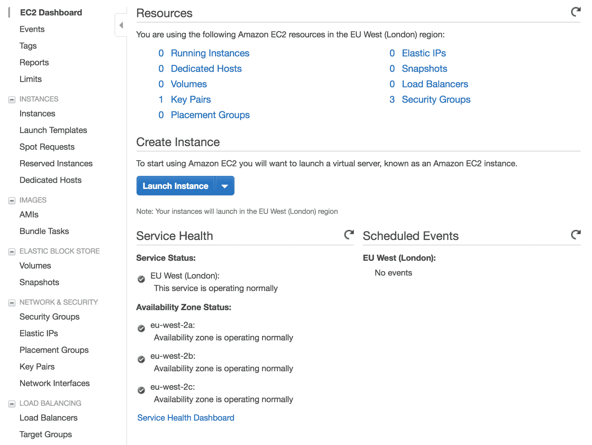
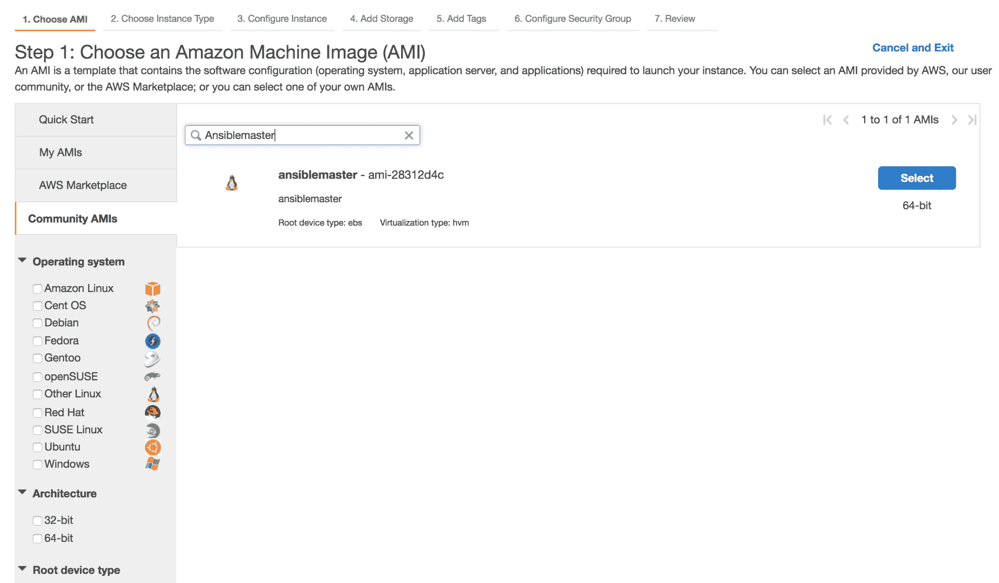
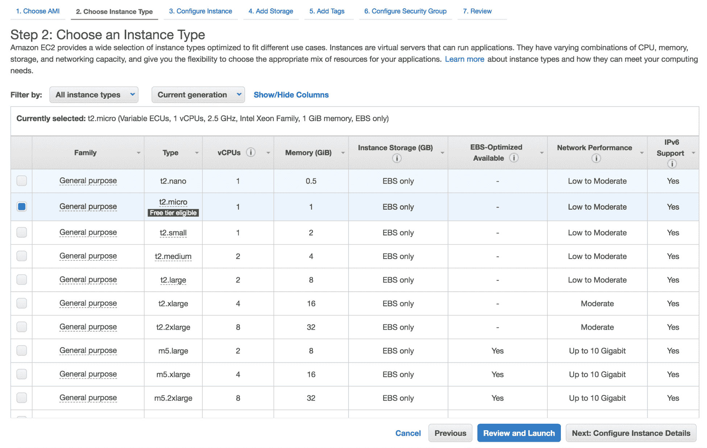
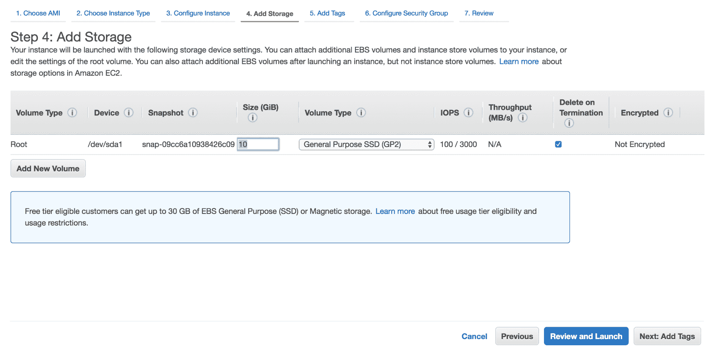
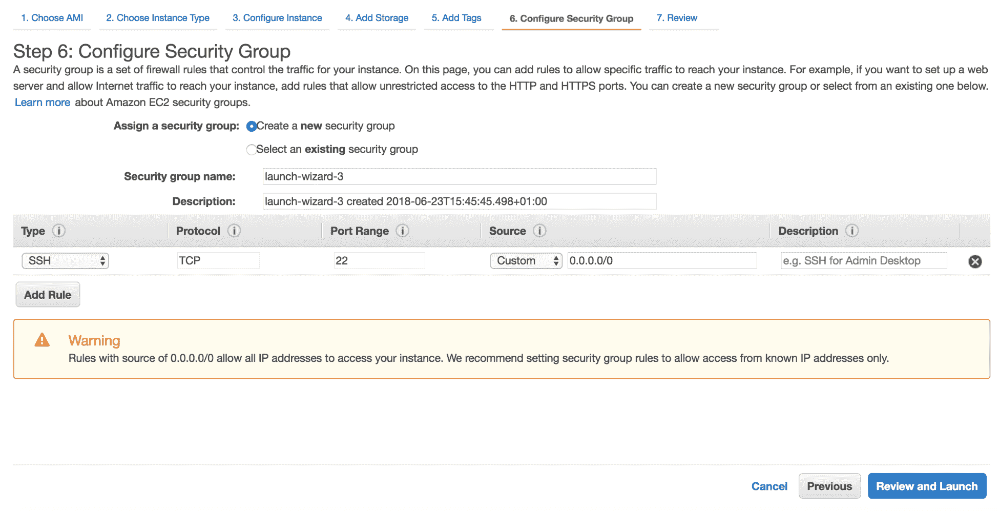
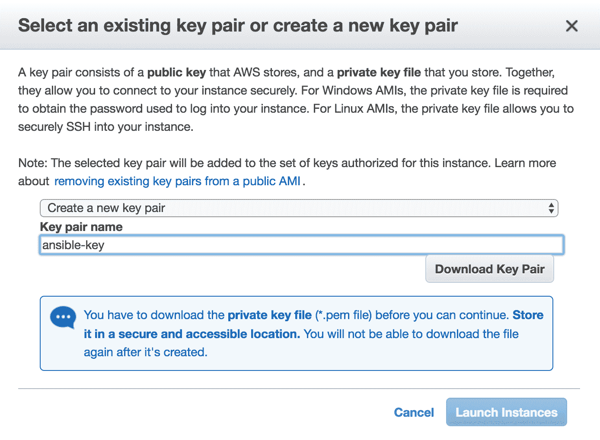
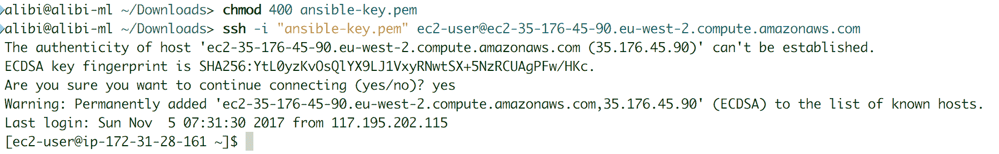
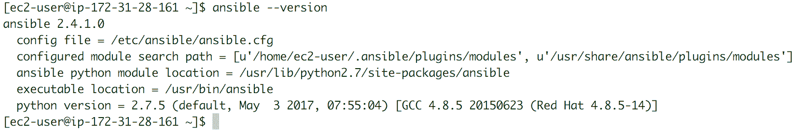
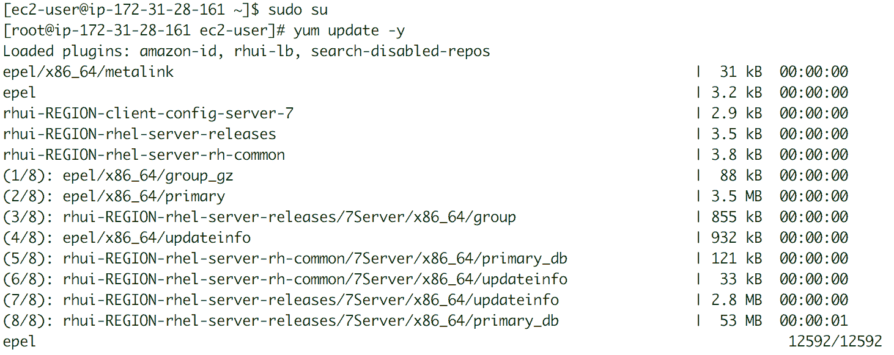
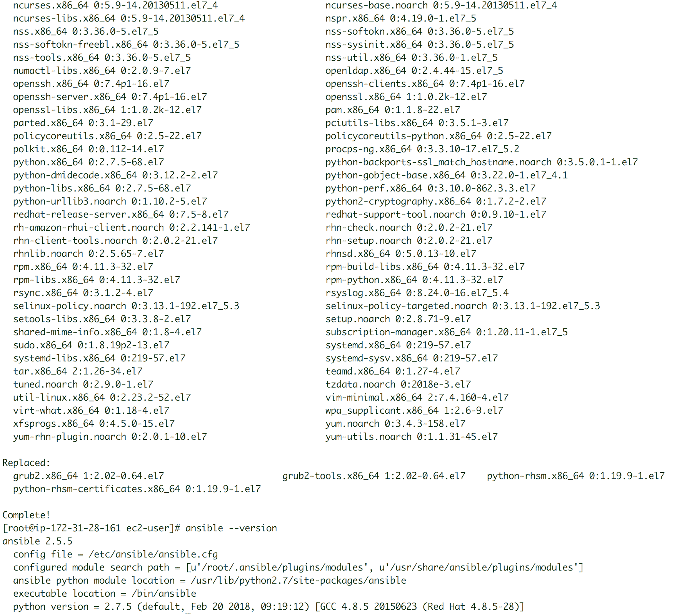

# Ansible 设置和配置

由于 Ansible 是无代理的，与其他配置管理平台不同，它只需要在主节点上安装。由于它没有守护程序、数据库依赖和持续运行的服务，Ansible 也特别轻量。

在介绍了 Ansible 之后，我们现在将看看在您的环境中安装 Ansible 的不同方法，比如裸机、云和使用 Docker 容器。我们还将看看如何在多个 Linux 操作系统上安装 Ansible，包括从软件包管理器和源码安装。最后，我们将看看如何准备和配置主机，使其可以被 Ansible 控制。本章将涵盖以下内容：

+   Ansible 主节点和基本 Linux 安装

+   Ansible 容器设置

+   Ansible 源码安装

+   Ansible AWS 实例设置

+   Ansible 配置

+   Linux 和 Windows 客户端上的 Ansible 配置

# Ansible 主节点安装

Ansible 使用**安全外壳**（**SSH**）和 WinRM 来管理其主机客户端。所有安装都发生在管理节点或主节点上，或者在需要冗余时可能在多个节点上。我们将继续从源码安装 Ansible，就像在两个主要的 Linux 系列上使用 Python PyPI 一样：Debian（包括 Debian、Linux Mint、Kali Linux、Ubuntu 和 Ubuntu Mate）和 Red Hat（包括 Red Hat、Fedora、CentOS 和 Scientific Linux）。我们还将看看 Mac OS X 的 Ansible 安装过程，Python PyPI 以及如何从源码安装。我们将涵盖云使用和容器化的 Ansible。

如果可以选择，我们建议在 Red Hat、CentOS、Debian、Ubuntu 和 Mac OS X 上使用默认的软件包管理器。使用软件包管理器可以安装最新稳定版本的 Ansible。Python PyPI 也可以依赖于其提供最新稳定版本的 Ansible，特别是在使用旧的 LTS 或稳定的 Linux 版本时。

在云环境中使用，有许多社区实例可供选择。我们建议使用最受欢迎的实例以及相应的版本。

# 先决条件

在这方面，Ansible 非常棒。对于 Linux 软件包安装，你只需要 Python 2（版本 2.6 或更高）或 Python 3（版本 3.5 或更高）。对于源码安装，我们可能需要开发套件，比如 Debian 系列的`build-essential`软件包，或者 Red Hat 系列的`Development Tools`组软件包。

大多数 Linux 操作系统的软件包管理器在安装 Ansible 时会自动下载适当的 Python 版本及其依赖项。

对于 Mac OS X，安装 Homebrew 和 Xcode 应该就可以了。请记住，这些是安装 Ansible 软件包所需的要求。

在使用 Mac OS X 上的 Ansible 之前，您需要以 root 用户身份运行一个命令，以允许自己控制超过 15 个主机。这与同时处理文件的限制有关。命令是`sudo launchctl limit maxfiles unlimited`。

关于 Ansible 容器安装，我们需要一个容器引擎。在我们的情况下，我们将使用 Docker，或者任何等效平台，比如 Singularity 或 Shifter。对于云安装，我们只需要一个 SSH 客户端来连接到 AWS 实例。其他云提供商，如 Google Cloud Platform 或 Microsoft Azure，也支持 Ansible 实例。

你可以在任何平台上创建自己定制的云实例。我们的建议适用于绝大多数使用情况，我们相信 AWS 支持和社区实例经过了许多用户的测试，它们是尽可能稳定和可靠的。其他要求没有在这里提到，因为它们对于 Ansible 的主要功能和模块并不是严格必要的，而是针对非常特定的插件和模块。当我们讨论这些模块和插件时，我们会涵盖它们。

# Red Hat、CentOS 和 Fedora 软件包安装

如果您使用 Yellowdog Updater, Modified (Yum)，则需要额外的步骤，因为 Ansible 不位于默认的 RHEL 存储库中。正如您在过去安装工具时可能遇到的那样，通常需要在使用软件包管理器安装工具之前安装**企业 Linux 的额外软件包**（**EPEL**）。这是一个非常简单的步骤。我们首先需要从 Fedora Project 网站下载`epel-release` `rpm`文件：[`fedoraproject.org/wiki/EPE`](http://fedoraproject.org/wiki/EPEL)[L](http://fedoraproject.org/wiki/EPEL)。然后，我们需要使用`rpm`进行安装，如下所示：

```
sudo rpm -i epel-release-latest-7.noarch.rpm
```

从 EPEL 下载的工具实际上并未经过 Red Hat 质量工程师的测试，因此在生产服务器上下载时需要额外小心，因为可能会影响支持。

Ansible 引擎存储库（可在[`access.redhat.com/articles/3174981`](https://access.redhat.com/articles/3174981)找到）是另一个有效的存储库，可用于下载 Ansible 的最新版本。要仅使用 Red Hat Linux 访问其软件包，我们首先需要启用它，如下所示：

```
sudo subsription-manager repos --enable rhel-7-server-ansible-2.5-rpms
```

之后，软件包管理器将需要更新其缓存，即软件包列表。我们使用 Yum 来执行此操作，如下所示：

```
sudo yum update
```

与使用 Yum 安装任何其他软件包一样，我们需要将`ansible`指定为`install`选项的输入：

```
sudo yum install ansible
```

大多数 Red Hat 系列操作系统应该接受这些命令来设置 Ansible。 Fedora 18 及更高版本具有下一代软件包管理器**Dandified Yum**（**DNF**）。这是从 Fedora 22 开始的默认软件包管理器。使用 RPM 安装 EPEL 软件包后，我们需要运行以下命令来更新 DNF 软件包列表：

```
sudo dnf -y update
```

然后，我们使用以下命令安装 Ansible：

```
sudo dnf -y install ansible
```

使用 Red Hat 系列操作系统，可以通过获取适当的 RPM 文件并使用 RPM 进行安装来安装 Ansible。首先，我们需要从 Ansible 发布链接下载适当的 RPM 文件：[`releases.ansible.com/ansible/rpm/`](https://releases.ansible.com/ansible/rpm/)。下载所需的 Ansible 版本的 RPM 文件，并按以下方式安装：

```
sudo rpm -Uvh ansible-2.5.5-1.el7.ans.noarch.rpm
```

如果需要，RPM 文件也可以轻松地从源代码构建并安装。我们建议使用官方 GitHub Ansible 存储库。首先，我们需要使用 Git 获取项目文件夹。我们可能需要已经安装了 Git 才能轻松下载它：

```
git clone https://github.com/ansible/ansible.git
cd ansible
```

然后，我们需要构建 Ansible 的`rpm`文件，并使用相同的命令进行安装：

```
make rpm
sudo rpm -Uvh rpm-build/ansible-*.noarch.rpm
```

# Debian 软件包安装

对于 Debian 用户，您可能已经知道，如果要使用工具的最新版本，需要运行最新的稳定或测试版本的 Debian 操作系统。不建议使用测试版本，但有些人使用。由于 Debian 非常可靠，操作系统管理员倾向于设置 Debian 服务器，然后多年多年地忘记它，因为它继续按照预期的方式运行，没有任何问题。通常，管理员倾向于运行许多旧的、稳定的 Debian 版本。如果您想要使用最新的 Ansible 版本及其所有优点、模块和插件，我们不建议使用这些旧版本，除非您进行替代安装（使用 PyPI、源安装或通过容器）。

我们将使用 Debian 9（Stretch），因为它是最新的 Debian 稳定版本。Debian 9 允许您使用许多 Ubuntu 软件包源来安装 Ansible。我们可以将 DEB 行添加到`source.list`文件中，也可以将**个人软件包存档**（**PPA**）添加到列表中。首先，我们需要安装软件属性包：

```
sudo apt-get install -y software-properties-common
```

然后，我们使用文本编辑器并将以下 DEB 添加到`/etc/apt/source.list`中：

```
deb http://ppa.launchpad.net/ansible/ansible/ubuntu trusty main
```

在源文件的末尾添加 DEB 行的更快方法如下：`echo "deb http://ppa.launchpad.net/ansible/ansible/ubuntu trusty main" >> /etc/apt/source.list`

然后通过将其密钥添加到`apt`来验证链接：

```
sudo apt-key adv --keyserver keyserver.ubuntu.com --recv-keys 93C4A3FD7BB9C367
```

对于最新的 Debian 版本，也可以直接使用 PPA 存储库，方法是将链接添加到 APT 存储库：`sudo apt-add-repository ppa:ansible/ansible`

通常，添加存储库需要您更新软件包管理器缓存：

```
sudo apt update
```

然后我们可以安装 Ansible：

```
sudo apt install -y ansible
```

在后续章节中，大多数教程都是在已安装并使用 Python PyPI 更新的 Debian 8（Jessie）上进行的。这与在操作系统的最新版本上安装 Ansible 的任何其他标准方式一样稳定，最新且可靠。

# Ubuntu 软件包安装

在最新版本上安装 Ansible 的最佳方法是为 Ubuntu 添加 Ansible PPA `ppa:ansible/ansible`（`launchpad.net/~ansible/+archive/ubuntu/ansible`）。这应该使用以下命令添加：

```
sudo apt-add-repository ppa:ansible/ansible
```

添加 PPA 存储库需要您确认密钥服务器设置。通过按*Enter*键来接受。

然后我们需要更新软件包管理器缓存，也称为系统软件包索引，如下所示：

```
sudo apt update
```

最后，我们可以安装 Ansible：

```
sudo apt install ansible
```

# macOS X 软件包安装

在 MAC OS X 系统上安装 Ansible 可以使用两种工具之一来实现。第一种使用 Python PyPI，将在以下部分中描述。第二种使用 Mac OS X 开源软件包管理系统 Homebrew（brew.sh）。在本节中，我们将描述如何使用 Homebrew 安装 Ansible。

要能够使用 Homebrew，我们首先需要确保它已安装，因为它不是默认的系统应用程序。您需要使用 Ruby 编译器将其构建到系统中。为此，您还需要安装 Xcode（在此处找到：[developer.apple.com/xcode/](http://developer.apple.com/xcode/)），并接受其用户许可协议。然后在其终端上运行以下命令：

```
/usr/bin/ruby -e "$(curl -fsSL https://raw.githubusercontent.com/Homebrew/install/master/install)"
```

这个命令可能需要一些时间，具体取决于您的互联网访问和计算机速度。

然后我们可以使用 Homebrew 来安装 Ansible：

```
brew install ansible
```

# Python PyPI 安装

要能够使用 PyPI 安装 Ansible，我们首先需要安装 PyPI。它可以使用大多数软件包管理器轻松安装，其中一些在以下部分中概述。

Red Hat Yum 安装如下实现：

```
sudo yum install -y python-pip
```

Debian APT 安装使用以下命令：

```
sudo apt install -y python-pip
```

对于其他 Linux 系统，使用 Python：

```
sudo easy_install pip
```

Mac OS X Homebrew 安装如下：

```
brew install python-pip
```

从 PyPI 存储库中，通过安装 PyPI：

```
sudo pip install ansible
```

我们也可以使用 GitHub 源获取最新的开发版本：

```
sudo pip install git+https://github.com/ansible/ansible.git@devel
```

要使用 PyPI 选择特定版本的 Ansible，我们可以使用以下命令：`sudo pip install ansible==2.4.0`。要升级到最新版本，我们可以添加`--upgrade`选项，使命令如下：`sudo pip install ansible --upgrade`。

# 源 GitHub 或 tarball 安装

能够从源代码构建 Ansible 对于在不常见的环境中使用的用户或者对于那些有一些特殊要求的用户是有帮助的，比如在不需要软件包管理器或者受限于 Ansible 的最新稳定版本的情况下设置 Ansible。使用 Ansible 的开发版本（或 beta 版）总是会使用户面临不稳定的模块和插件的风险，但也允许提前访问未来的模块。

要获取 Ansible 的源包，我们可以使用两种不同的方法：下载`.tar`文件，或者克隆项目的 GitHub 存储库。Ansible 项目源文件位于其发布页面（`releases.ansible.com/ansible/`）中，GitHub 源可以从官方 GitHub 项目（`github.com/ansible/ansible`）中克隆。

要下载 tarball 文件，请使用您喜欢的文件获取工具（如 curl、wget 或 axel）：

```
wget -c https://releases.ansible.com/ansible/ansible-2.6.0rc3.tar.gz
```

然后我们需要解压 tarball：

```
tar -xzvf  ./ansible-2.6.0rc3.tar.gz
```

或者，我们可以使用 Git 在本地克隆 GitHub 项目。我们需要确保系统上已安装 Git，然后我们可以开始克隆。此过程在以下片段中显示了一些系统。

以下命令行显示了如何在红帽系列的 Linux 上安装`git`：

```
sudo yum install -y git
```

以下命令行显示了如何在 Debian 系列的 Linux 上安装`git`：

```
sudo apt install -y git
```

以下命令行显示了如何在 Mac OS X 上安装`git`：

```
brew install git
```

在所有系统上，要克隆 Ansible GitHub 项目：

```
git clone https://github.com/ansible/ansible.git --recursive
```

然后我们需要开始构建 Ansible，可以通过获取 tarball 或从 GitHub 获取源代码：

```
cd ./ansible*
```

为了确保轻松满足构建 Ansible 的所有要求，我们将使用 Python PyPI。在前面的部分中涵盖了多个系统上的 PyPI 安装。对于本节，我们将使用`easy_install`，它只需要您在系统上安装一个版本的 Python：

```
sudo easy_install pip
```

现在我们安装 Python 要求：

```
sudo pip install -r ./requirements.txt
```

我们需要按照以下方式设置环境才能使用 Ansible：

```
source ./hacking/env-setup
```

在使用 GitHub 项目时更新 Ansible 可能会更加棘手。我们需要按以下方式拉取项目及其子模块：

```
git pull --rebase
git submodule update --init --recursive
```

每次执行这些命令时，我们需要确保环境已正确设置：

```
echo "export ANSIBLE_HOSTS=/etc/ansible/hosts" >> ~/.bashrc
echo "source ~/ansible/hacking/env-setup" >> ~/.bashrc
```

当 Ansible 源位于的位置时，环境源的位置可能会发生变化。Ansible 清单（通常位于`/etc/ansible/hosts`）及其配置文件（通常位于`/etc/ansible/ansible.cfg`）也可以更改以适应权限限制或为 Ansible 用户提供更容易访问以启用修改或限制它们。这将在本章后面更详细地介绍。

# Ansible Docker 容器安装

在容器上使用 Ansible 需要运行容器引擎。有多种选择可用的容器，最著名的是 Docker、Kubernetes 和 Red Hat OpenShift。在本书中，我们只会涵盖 Docker。我们需要在托管 Ansible 容器的机器上运行 Docker 引擎。Docker 安装信息可以在其官方文档中找到：[`docs.docker.com/install/`](https://docs.docker.com/install/)。这涵盖了大量操作系统。

在这里，我们假设 Docker 引擎已安装，并且当前用户已添加到 Docker 组，以便他们可以在机器上管理本地 Docker 容器。您还可以选择通过选择您熟悉的任何系统来构建自己的容器作为源镜像。确保您已安装所有要求。以下是 Linux Alpine 上的基本 Dockerfile 示例，这是容器中使用的最轻的系统之一：

```
FROM alpine:3.7

RUN echo "#### Setting up the environment for the build dependencies ####" && \
set -x && apk --update add --virtual build-dependencies \
    gcc musl-dev libffi-dev openssl-dev python-dev

RUN echo "#### Update the OS package index and tools ####" && \
    apk update && apk upgrade

RUN echo "#### Setting up the build dependecies ####" && \
   apk add --no-cache bash curl tar openssh-client \
    sshpass git python py-boto py-dateutil py-httplib2 \
    py-jinja2 py-paramiko py-pip py-yaml ca-certificates 

RUN echo "#### Installing Python PyPI ####" && \
    pip install pip==9.0.3 && \
    pip install python-keyczar docker-py

RUN echo "#### Installing Ansible latest release and cleaning up ####" && \
    pip install ansible –upgrade \
    apk del build-dependencies && \
    rm -rf /var/cache/apk/*

RUN echo "#### Initializing Ansible inventory with the localhost ####" && \
    mkdir -p /etc/ansible/library /etc/ansible/roles /etc/ansible/lib /etc/ansible/ && \
    echo "localhost" >> /etc/ansible/hosts

ENV HOME                      /home/ansible
ENV PATH                      /etc/ansible/bin:$PATH
ENV PYTHONPATH                /etc/ansible/lib
ENV ANSIBLE_ROLES_PATH        /etc/ansible/roles
ENV ANSIBLE_LIBRARY           /etc/ansible/library
ENV ANSIBLE_SSH_PIPELINING                True
ENV ANSIBLE_GATHERING                     smart
ENV ANSIBLE_HOST_KEY_CHECKING             false
ENV ANSIBLE_RETRY_FILES_ENABLED           false 

RUN adduser -h $HOME ansible -D \
   && chown -R ansible:ansible $HOME

RUN echo "ansible ALL=(ALL) NOPASSWD: ALL" >> /etc/sudoers \
    && chmod 0440 /etc/sudoers

WORKDIR $HOME
USER ansible

ENTRYPOINT ["ansible"]       
```

然后使用 Docker 上的`build`函数构建容器：

```
docker build -t dockerhub-user/ansible .
```

构建可能需要一些时间来完成。然后我们可以尝试以几种不同的方式运行我们的 Ansible 容器，这取决于我们将如何使用它。例如，我们可以验证容器上的 Ansible 版本：

```
docker run --rm -it -v ~:/home/ansible dockerhub-user/ansible --version
```

我们还可以运行一个 ping 任务：

```
docker run --rm -it -v ~:/home/ansible \
 -v ~/.ssh/id_rsa:/ansible/.ssh/id_rsa \
 -v ~/.ssh/id_rsa.pub:/ansible/.ssh/id_rsa.pub \
 dockerhub-user/ansible -m ping 192.168.1.10
```

通过将我们的 Dockerfile 代码的`ENTRYPOINT`从`[ansible]`更改为`[ansible-playbook]`，我们可以创建一个脚本，可以使用我们的容器来工作，就好像安装了`docker-playbook`一样。这将在第三章中进一步解释，*Ansible 清单和 Playbook*。创建一个名为`ansible-playbook`的脚本，并使用以下代码将其添加到`PATH`环境变量中：

```
#!/bin/bash
 -v ~/.ssh/id_rsa:/ansible/.ssh/id_rsa \
 -v ~/.ssh/id_rsa.pub:/ansible/.ssh/id_rsa.pub \
 -v /var/log/ansible/ansible.log \
 dockerhub-user/ansible "$@"
```

确保脚本具有执行权限，可以使用`chmod +x`命令行。它可以被复制或符号链接到`/usr/local/bin/`，以自动将其添加到`PATH`。

可以使用以下脚本在`inventory`文件夹中的特定主机上执行 playbook：

```
Ansibleplaybook play tasks.yml -i inventory/hosts
```

# AWS 上的 Ansible 实例

有多个公共云提供商，例如 Google Cloud Platform 或 Microsoft Azure，提供与**Amazon Web Services**（**AWS**）相同的服务。在本节中，我们不会涵盖安装过程的大部分，因为实例已经预安装和配置。

相反，本节将是一个简短的逐步指南，介绍如何在 AWS 上设置已经存在的 Ansible 实例。首先，我们需要访问 AWS 帐户的 EC2 仪表板：



然后，我们选择启动一个新实例并寻找`Ansiblemaster`实例。注意不要选择 Ansible Tower 实例之一：



然后，我们选择要分配给我们的实例的计算资源数量：



然后，我们添加要由实例使用的磁盘空间，如下所示：



然后确认并启动实例：



我们可以创建一个新的 SSH 访问密钥，也可以使用旧的密钥：



在我们的本地终端上，我们设置密钥文件的权限并使用 SSH 访问该实例：



我们可以检查 Ansible 的版本和配置。我们可以随时将其更新到必要或最新的稳定版本。以下打印屏幕显示了如何使用实例 OS 包管理器从一个 Ansible 版本切换到另一个版本。首先，我们确定当前安装的版本：



然后，我们运行完整的系统软件更新：



最后，完成更新过程后，我们重新确认 Ansible 版本：



最后，我们可以使用新安装的 Ansible 在我们的 AWS 环境中协调任务。

# 主节点基本配置

Ansible 配置主要存储在`ansible.cfg`配置文件中，通常位于大多数系统包管理器和 Python PyPI 安装中的`/etc/ansible/ansible.cfg`。它也可以位于安装 Ansible 的用户的主目录中，或者`ANSIBLE_CONFIG`环境变量指向的任何位置。在本节中，我们将介绍可以使用 Ansible 修改的最有用的配置，以使您的生活更轻松。

使用您喜欢的文本编辑器打开您的`ansible.cfg`文件，可以是 CLI 模式（使用 vi 或 nano）或 GUI 模式（使用 Gedit 或 Atom）：

```
sudo nano /etc/ansible/ansible.cfg
```

不用担心使用哪种文本编辑器，总会有人不同意。使用您最舒适的那个。

许多人会同意，Ansible 的默认配置对于正常使用是可以的。安装后可以立即使用 Ansible。

从 Ansible 2.4 版本开始，有一个命令行`ansible-config`，允许用户列出已启用的选项及其值，以更快地检查其配置。禁用的配置选项通过使用井号`#`或分号`;`来实现。分号`;`通常用于引入已启用的选项。

您可以随时访问 Ansible 示例配置文件，查看选项的使用方式。示例可以在以下链接找到：[raw.githubusercontent.com/ansible/ansible/devel/examples/ansible.cfg](http://raw.githubusercontent.com/ansible/ansible/devel/examples/ansible.cfg)。

Ansible 的配置文件分为几个部分。我们将集中在`[defaults]`一般部分。我们将从介绍此部分中的基本参数开始。

+   清单：这是指示 Ansible 托管清单的文件的参数。在大多数系统上，它指向`/etc/ansible/hosts`，如下所示：

```
inventory = /etc/ansible/hosts
```

+   `roles_path`：这是一个参数，用于指示 Ansible playbook 应该在系统默认位置之外查找附加角色：

```
roles_path = /etc/ansible/roles
```

+   `log_path`：这是一个参数，用于指示 Ansible 应该存储其日志的位置。确保运行 Ansible 的用户有权限在指定的位置上写入。示例如下：

```
log_path = /var/log/ansible.log
```

+   `retry_files_enabled`：这是一个参数，用于启用重试功能，允许 Ansible 在播放书失败时创建一个`.retry`文件。最好保持此参数禁用，除非您确实需要它。这是因为它会创建多个文件，并且会在 Ansible 日志和仪表板的播放书执行状态部分中记录已经记录的旧失败任务。以下是禁用该参数的示例：

```
retry_files_enabled = False
```

+   `host_keychecking`：这是一个参数，其推荐值取决于环境。通常，它用于不断变化的环境，旧机器被删除，新机器取代它们的位置。它更频繁地用于云或虚拟化环境，其中虚拟机和部署实例取代了旧机器的 IP 地址。Ansible 为这些机器保存了一个密钥以防止安全问题。禁用此参数将使 Ansible 忽略与`known_hosts`密钥相关的错误消息：

```
host_key_checking = False
```

+   `forks`：这是一个参数，用于定义对客户端主机执行的并行任务数量。默认数量为五，以节省资源和网络带宽。如果有足够的资源和大带宽来为许多主机提供服务，可以将其提高到最大主机数量，如下所示：

```
forks = 10
```

+   `sudo_user`和`ask_sudo_pass`：这两个是遗留参数。在当前版本的 Ansible 中仍然可以使用它们，但它们不太可靠。建议在创建 Ansible 清单中的组时设置这些参数——这将在下一章节中详细解释，但示例如下：

```
sudo_user = install
ask_sudo_pass = True
```

+   `remote_port`：这是一个参数，用于指示客户端主机上 SSH 要使用的端口。这也是一个最好在清单组中设置的参数：

```
remote_port = 22
```

+   `nocolor`：这是一个可选参数。它允许您为 Ansible 任务和播放书显示不同的颜色，以指示错误和成功：

```
nocolor = 0
```

以下参数涉及与主机`[ssh_connection]`的 SSH 连接。

`pipelining`：此参数启用了减少执行模块所需的 SSH 操作次数的功能。这是通过执行 Ansible 模块而无需实际文件传输来实现的，可以极大地提高 Ansible 的性能。它要求在所有受管主机的`/etc/sudoers`中禁用 requiretty。其使用示例如下：

```
pipelining = True  
```

`scp_if_ssh`和`transfer_method`参数：这两个参数负责主节点和客户端主机之间的文件传输。选择`smart`值允许 Ansible 在传输文件时选择最合适的协议，从而在 SFTP 和 SCP 之间进行选择：

```
scp_if_ssh = smart
transfer_method = smart
```

以下两个示例涉及到 SSH 连接的持久性，`[persistent_connection]`。我们只涵盖了连接的超时和失败重试。SSH 超时可以通过编辑这两个参数的值来设置，首先是：

```
connect_timeout = 30
```

其次：

```
connect_retry_timeout = 15
```

最后，让我们来看一下`[colors]`颜色选择。在`[default]`部分启用颜色功能时，此部分将被激活。它允许您为各种输出状态选择不同的颜色。在使用特殊显示或帮助解决色盲问题时可能会有所帮助：

```
warn = bright purple
error = red
debug = dark gray
ok = green
changed = yellow
skip = cyan
```

另外，我们不应忘记 Ansible 依赖 SSH 与其客户端进行通信。在主节点上应进行配置，以创建一个 SSH 密钥，然后将其复制到所有客户端主机上，以实现无密码远程访问。这有助于消除明文保存的密码，并实现任务的完全自动化。创建 SSH 密钥可以是简单的，也可以是更复杂和更安全的。我们将选择简单的选项：

```
ssh-keygen -t rsa
```

在接受密钥并将密码留空时，继续按回车键：

```
ssh-copyid user@host1
```

这个任务可能有点乏味和非常手动。在尝试解决 SSH 密钥和身份验证问题时，使用`expect`命令进行脚本编写可能非常方便。首先，我们需要确保`expect`已安装，因为它通常不是默认安装的。以下示例展示了各种操作系统的此过程。

这个命令行显示了如何在红帽 Linux 系统上安装 Expect 工具：

```
sudo yum install -y expect-devel
```

这个命令行显示了如何在 Debian 家族的 Linux 上安装 Expect 工具：

```
sudo apt install -y expect
```

这个命令行显示了如何在 MAC OS X 上安装 Expect 工具：

```
brew install expect
```

然后，我们可以创建一个包含以下内容的脚本文件：

```
#!/usr/bin/expect -f
set login "install"
set addr [lindex $argv 0]
set pw [lindex $argv 1]
spawn ssh-copy-id $login@$addr
expect "*yes/no*" {
 send "yes\r"
 expect "*?assword*" { send "$pw\r" }
 } "*?asswor*" { send "$pw\r" }
interact
```

这个脚本应该有执行权限才能执行。然后可以与另一个循环脚本一起使用，以在已知 IP 地址范围或主机名的多台机器上执行。

```
#!/bin/bash
password=`cat /root/installpassword.txt`
for j in 10 11 12 13 14 15 16 17 18 19 20
do
 ./expectscript 192.168.1.$j $password
done
```

或者，我们可以使用编排工具来执行相同的任务。让我们使用 Ansible 通过简单的`copy`和`shell`模块来帮助客户端配置：

```
ansible all -m copy -a "src=~ /.ssh/id_rsa.pub dest=/tmp/id_rsa.pub" --ask-pass -c install
ansible all -m shell -a "cat /tmp/id_rsa.pub >> /home/install/.ssh/authorized_keys" --ask-pass -c install
```

`install`用户可以是在所有客户端主机上创建的特殊用户，以允许使用 Ansible 进行简单的 SSH 远程访问。有关如何设置此用户的更多详细信息，请参见以下标题。

# Linux 客户端节点配置

客户机上唯一重要的工具是 OpenSSH 服务器。所有新版本的 Linux 默认使用 SSH 作为主要的远程访问方法。

为了确保一切就绪，SSH 服务应始终运行，并且系统防火墙应允许 SSH 服务的端口通过。默认情况下，这是端口 22。但是，这可以更改，而且这个更改也应该在主机 Ansible 清单中记录下来。

对于 Linux 客户端，Ansible 管理的任何额外配置更多地是遵循最佳实践准则，而不是严格必要的。额外的配置可以确保由 Ansible 管理的远程客户端是完全自动化的、安全可访问的，并且在运行自动化任务时不需要管理员干预。

以下配置是可选的 - 您可以选择适合您的配置。添加您认为有用的配置，忽略其他配置。

当手头有凭据时，Ansible 可以远程管理系统使用任何特权用户。然而，混合普通用户、具有远程访问权限的用户和管理用户可能会很混乱。如果用户在 Ansible 发送任务的同时执行任务，回溯可能会很棘手。我们建议添加一个新的系统用户，其唯一目的是被 Ansible 用来控制主机。我们赋予这个用户超级用户权限，并使其访问无密码，以进一步增强自动化。这个用户可以在特定清单组的所有主机上是相同的，以在清单组级别进行配置。

您还可以通过 NFS 和 SMB 在主机和 Ansible 服务器之间创建共享文件夹，以减少向主机传输数据时的负载。这个任务使得主机负责从挂载的共享文件夹中复制数据，而 Ansible 负责其他任务，特别是当 forks 的值设置为一个较高的数字时。

# Windows 客户端节点配置

除了 Linux 主机，Ansible 还能够远程管理 Microsoft Windows 主机。这包括 Windows Desktop 7、8 和 10，以及 Windows Server 2008、2008 R2、2012、2012 R2 和 2016。

Windows 客户端需要您安装以下应用程序的特定版本：

+   PowerShell 3.0 或更高版本

+   .NET 4.0

这两个要求在大多数 Windows 版本上都得到满足，除了 Windows 7 和 Windows Server 2008。

有一个由 Ansible 制作的 PowerShell 脚本，可以自动安装缺少的要求，可在以下链接找到：[`github.com/PacktPublishing/Ansible-QuickStart-Guide/blob/master/Chapter2/Upgrade_Powershell.ps1`](https://github.com/PacktPublishing/Ansible-QuickStart-Guide/blob/master/Chapter2/Upgrade_Powershell.ps1)。

为了能够执行此脚本，或任何其他第三方脚本，我们需要将执行策略从受限制改为无限制，运行我们的脚本，然后将策略改回受限制。使用 Windows PowerShell，使用本地或域管理员凭据运行以下命令：

```
$link = "https://raw.githubusercontent.com/jborean93/ansible-windows/master/scripts/Upgrade-PowerShell.ps1"
$script = "$env:temp\Upgrade-PowerShell.ps1"
$username = "Admin"
$password = "secure_password"

(New-Object -TypeName System.Net.WebClient).DownloadFile($link, $script)
Set-ExecutionPolicy -ExecutionPolicy Unrestricted -Force

&$script -Version 5.1 -Username $username -Password $password -Verbose

Set-ExecutionPolicy -ExecutionPolicy Restricted -Force

$reg_winlogon_path = "HKLM:\Software\Microsoft\Windows NT\CurrentVersion\Winlogon"
Set-ItemProperty -Path $reg_winlogon_path -Name AutoAdminLogon -Value 0
Remove-ItemProperty -Path $reg_winlogon_path -Name DefaultUserName -ErrorAction SilentlyContinue
Remove-ItemProperty -Path $reg_winlogon_path -Name DefaultPassword -ErrorAction SilentlyContinue
```

然后，在所有 Windows 系统上，第二个脚本是必不可少的，用于配置 WinRM 以激活并监听 Ansible 命令。此脚本可从以下链接下载：[`github.com/PacktPublishing/Ansible-QuickStart-Guide/blob/master/Chapter2/ConfigureRemotingForAnsible.ps1`](https://github.com/PacktPublishing/Ansible-QuickStart-Guide/blob/master/Chapter2/ConfigureRemotingForAnsible.ps1)。

同样，此脚本也需要特权访问，并且执行策略应该是无限制的。运行以下代码：

```
$link = "https://raw.githubusercontent.com/ansible/ansible/devel/examples/scripts/ConfigureRemotingForAnsible.ps1"
$script = "$env:temp\ConfigureRemotingForAnsible.ps1"

(New-Object -TypeName System.Net.WebClient).DownloadFile($link, $script)

powershell.exe -ExecutionPolicy ByPass -File $script
```

如果没有出现错误，Ansible 现在应该能够管理这些机器了。

对于 Windows 主机也是一样的。我们可能需要创建一个仅由 Ansible 使用的本地或域管理员来自由执行命令。其凭据也可以在主机清单组中配置。这可以使用 Ansible Vault 进行安全保护，以防止密码以明文形式写入。

# 总结

在本章中，我们看了如何为多个系统准备环境，以便能够安装 Ansible。我们还考虑了在 Linux 或 Windows 中哪些配置选项最有用。现在我们已经学会了如何设置和配置 Ansible，我们准备开始学习其功能特性。在下一章中，我们将介绍 Ansible playbook 和清单，以更好地理解编排是如何工作的。

# 参考资料

+   Ansible 文档：[`docs.ansible.com/`](https://docs.ansible.com/)
