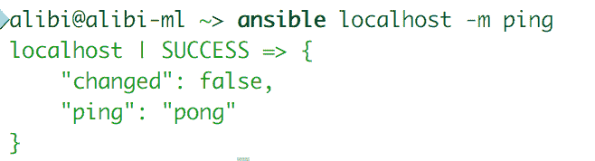
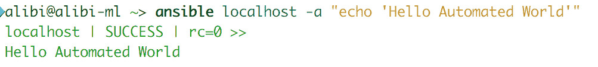
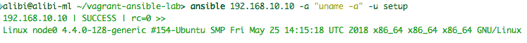
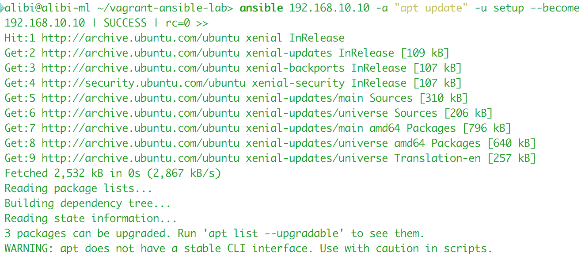
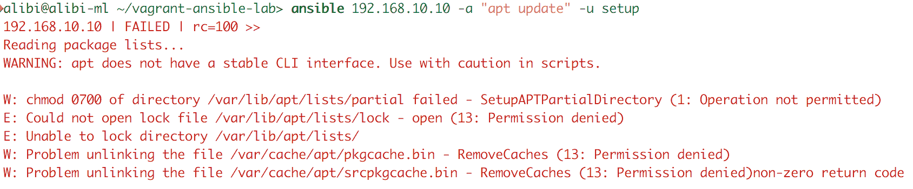
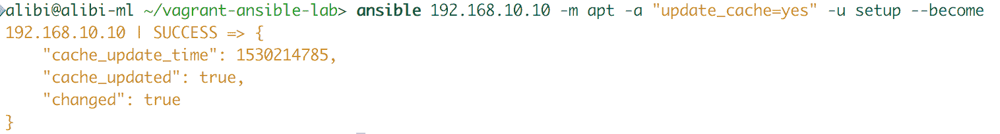
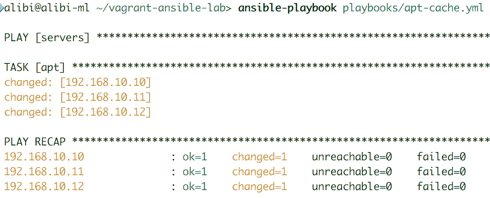
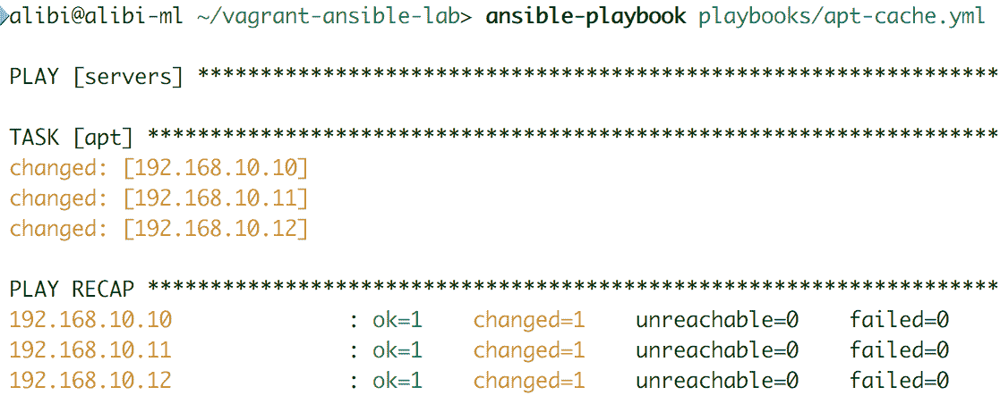
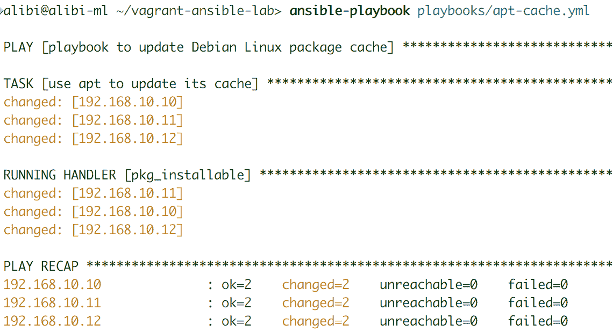

# Ansible 清单和 playbook

现在我们已经安装了 Ansible，可以继续进行下一个里程碑。我们现在将探索两个主要功能：Ansible 清单，用于客户端主机组织，以及 Ansible playbooks，演示如何编写 Ansible play 脚本。这两个功能的结合是 Ansible 自动化和编排的基础。本章将介绍如何使用 Ansible 进行快速命令或模块。我们还将看看如何使用其清单来识别和配置主机的访问权限，并将它们静态或动态地分组。最后，我们将介绍 Ansible playbook，并查看其操作、处理程序和变量。我们将涵盖以下主题：

+   使用手动设置主机的简单 Ansible 命令

+   设置我们的第一个 Ansible 静态清单

+   设置和配置组清单

+   设置和配置动态清单

+   Ansible playbook 概述和用法

+   Ansible playbook 最佳实践

+   高级 Ansible playbook 功能

# Ansible 上的基本临时命令

在自动化或编排任务时，Ansible 主要与 playbooks 一起使用，以允许子任务被脚本化并组织在一个方便的管道中。然而，Ansible 也有各种临时命令。这些允许在主机上执行模块，无论它们如何被识别。

安装了 Ansible 之后，可以直接使用临时命令行。可以通过使用原始模块或一些简单的模块（如`ping`或`shell`）来轻松测试它。举个快速的例子，每个 Ansible 实例都可以使用以下命令对自己进行 ping 测试：

```
ansible localhost -m ping
```

我们应该看到以下输出：

`-m`选项表示任务运行时将使用的模块名称。

有些人可能会质疑 Ansible 临时命令的用处。实际上，它们是测试任务深度的一种很好的方式，从而更容易逐步调试更大任务的较小部分，并捕获错误位置或排除慢请求。对于初学者来说，运行简单的命令可能有助于通过解决简单的任务来掌握工具的基本操作，并逐步提升到更复杂的任务——在开始奔跑之前最好先学会走路。

Ansible 临时命令最常见的用途是运行原始命令。原始命令基本上是要发送到主机或主机的任何 Bash 或 PowerShell 代码：

```
ansible localhost -a "echo 'Hello automated World'"
```

执行命令后，将出现类似以下输出：



让我们尝试在不同的主机上运行一个命令。为此，我们需要主机的 IP 地址或完全合格的主机名，以及一个可以复制 SSH 密钥的用户。这可以通过物理复制密钥到用户的`~/.ssh`文件夹来完成，也可以使用第二章中提到的`ssh-copyid`命令来完成，*Ansible 设置和配置*。之后，我们运行以下原始命令来获取有关主机的信息：

```
ansible 192.168.10.10 -a "uname -a" -u setup
```

这个临时命令将产生以下输出：



或者，我们可以尝试让主机执行需要超级用户权限的提升任务：

```
ansible 192.168.10.10 -a "apt update" -u setup --become
```

执行上述命令时，输出应该如下所示：



如果我们在不使用`--become`选项的情况下使用这个命令，它将失败，并显示`permission denied`错误消息：



可以使用 Ansible 模块执行相同的任务。为此，我们使用`-m`选项，后面跟着模块的名称和`-a`选项后的参数，如下例所示：

```
ansible 192.168.10.10 -m apt -a "update_cache=yes" -u setup --become
```

Ansible 还允许您使用`--become`选项以另一个用户身份运行任务，将当前用户提升为超级用户，然后选择要用于运行命令的用户。也可以使用`-e`选项并在其输入中定义变量来完成。两个命令如下：

```
ansible 192.168.10.10 -a "whoami" -u setup --become --become-user user1
ansible 192.168.10.10 -a "whoami" -u setup -e "ansible_user=user1 become=true"
```

执行上述 playbook 时，输出应如下所示：



临时命令也可以用于快速向多台机器传输文件。我们可以使用原始命令，依赖于`scp`或`rsync`，也可以使用 Ansible 的`copy`模块。为了能够在多个主机上执行任务，我们建议使用快速静态清单。可以通过向`/etc/ansible/hosts`文件或 Ansible 配置文件指向的任何其他位置添加几行来完成。文件应如下所示：

```
[servers]
192.168.10.10
192.168.10.11
192.168.10.12
```

将三个主机分组到`servers`名称下，允许我们通过调用它们的组名来在所有三个主机上运行任务。这在以下示例中显示：

```
ansible servers -m copy -a "src=/home/user/file.txt dest=/home/setup/file.txt" -u setup
```

有些任务非常简单，编写 playbook 来完成它们是巨大的时间浪费。此外，任何 Ansible 临时命令都可以转换为 playbook——Ansible 用户可以在将其添加到 playbook 管道或工作流之前尝试一些命令并验证其参数。这是故障排除和在运行时应用快速更新或修复的好方法。以下示例显示了如何通过将 forks 的数量设置为一（使用`-f`选项）逐个重新启动 Web 服务器的副本。这逐个应用重启命令：

```
ansible servers -m service -a "name=httpd state=restarted" -u setup –become -f 1
```

# Ansible 清单

远比所有其他配置管理和编排工具简单。基本上是一个包含主机客户端的 IP 地址、完全合格的主机名或短主机名列表的简单`.ini`文件。有时还包含定义主机某些方面的额外变量。通常，主机以组名放在两个方括号之间组织，例如`[Group1]`。

添加新主机与添加新行到主机文件一样简单，确保它在正确的组中，并且具有管理所需的正确变量。

在默认的 Ansible 配置文件中，清单文件位于`/etc/ansible/hosts`。它是一个`.ini`文件，包含简单的文本和基本结构，由部分、属性和值组成。然而，作为默认位置并不意味着它是最佳位置。在许多情况下，无法编辑位于家目录之外的文件的非根用户可以使用 Ansible。我们建议在用户的家目录内的文件夹中放置所有 Ansible 配置文件。这意味着这些用户可以更改其配置以适应其需求。除了更改 Ansible 配置文件以指向不同的清单位置，我们还可以通过添加`-i`选项，后跟清单文件的位置，来在执行 Ansible 临时命令或 playbook 时选择清单文件：

```
sudo nano /etc/ansible/ansible.cfg
inventory = /home/user1/ansible/hosts
```

或者，我们可以使用以下

```
ansible -m ping -i ~/ansible/hosts
```

Ansible 清单不仅用于安排类似的主机；在编排任务时也更加有用。将提供相同类型服务的多个主机（如 Web 服务器、数据库控制器或 Web API）分组到一个组中，可以实现更智能和高效的组控制。良好的主机分类意味着在对特定服务应用修复或优化时可以更精确。主机可以属于多个组，以便它们可以响应发送到它们拥有的每个特定方面的每个任务：

```
[webserver]
192.168.10.10
192.168.10.12

[mysqldb]
192.168.10.10
192.168.10.20

[fileserver]
192.168.10.11
192.168.10.20
```

Ansible 有两种清单：静态和动态。在小到中等规模的环境或基础设施中，静态清单应该足够了。然而，当主机数量非常多时，任务可能变得复杂，错误可能开始出现。动态清单依赖于第三方服务，比如 AWS EC2、Rackspace 和 OpenStack，来提供清单。总是有可能通过脚本填充 Ansible 静态主机清单文件，如果你知道你在做什么，这可能会很方便。

当向 Ansible 清单文件添加具有相似模式的主机时，我们可以通过将不同模式更改为计数块来简化其语法，如下面的示例所示。

这是原始清单：

```
[servers]
node0.lab.edu
node1.lab.edu
node2.lab.edu
node3.lab.edu
node4.lab.edu
```

这是简化的清单：

```
[servers]
Node[0:4].lab.edu
```

这种清单语法不仅限于特定格式的数字。它也可以用于字母枚举，即`[a:z]`或`[A:Z]`，或具有特定数字的数字，如`[001:250]`。它可以放置在主机名的任何位置。

首先让我们谈谈 Ansible 静态清单。顾名思义，它是一个文本文件中的静态主机组织。默认情况下，它是一个非常简单的`.ini`文件，结构化为带有值的行：

```
node0.lab.edu

[lab1servers]
node1.lab.edu
node2.lab.edu

[lab2servers]
node3.lab.edu
```

或者，它可以是一个 YAML 文件，结构化为 Python 脚本结构：

```
all:
   hosts:
        node0.lab.edu
   children:
        lab1servers:
            hosts:
                 node1.lab.edu
                 node2.lab.edu
        lab2server:
            hosts:
                 node3.lab.edu
```

我们的大多数清单示例将以`.ini`文件格式编写。虽然 YAML 格式看起来更漂亮、更整洁，但在`.ini`格式中编写起来更容易、更快。

主机清单应该对各种类型和形状的主机都具有容忍性。Ansible 清单可以通过引入主机和组变量来容纳这些差异。这基本上是一种定义每个主机或组的特定方面以帮助 Ansible 进行管理的方式。主机变量非常特定于主机，只能影响该主机。最常定义的主机变量如下：

+   `ansible_user`：这个值定义了 Ansible 将使用哪个用户来管理主机。它的功能与`-u`选项相同，该选项用于临时命令。

+   `ansible_host`：有些主机可能不在 DNS 服务器中，或者我们可能想要给它们不同的名称。这个变量允许我们指向主机的 IP 地址，而不用检查我们选择在清单中如何命名它。

+   `ansible_port`：这也被称为`host1:port`。当主机通过某个端口而不是默认端口可访问时使用。

+   `ansible_connection`：这在`ssh`之间变化，是默认连接；`local`，用于与本地机器通信；和`docker`，用于在依赖于本地机器的 Docker 客户端的 Docker 容器中直接运行命令。我们将在第八章中更详细地介绍 Ansible Docker 的用法，*Ansible 高级特性*。

+   `ansible_become`：当存在时，此选项会强制主机以提升的特权（`sudo`）执行所有命令。

+   `ansible_become_user`：这允许 Ansible 以特定用户而不是远程访问用户的身份运行命令。

+   `ansible_ssh_pass`：这指定要用于访问主机的密码。这是不推荐的，因为用户的密码将以明文形式写入。下一个选项更好。

+   `ansible_ssh_private_key_file`：此选项指定要用于访问此 VM 的私有 SSH 密钥的位置。这比以明文形式写入密码更安全。

这是一个示例配置：

```
ansibleserv ansible_connection: local fileserver
ansible_host: 192.168.10.10 ansible_port:22
node1.lab.edu ansible user: setup 
ansible_ssh_private_key:/home/user/node1.key
node2.lab.edu ansible_become: yes
ansible_become_user: user1
```

一些主机变量可以在组标志下定义，特别是当主机共享相同的管理员用户名或 SSH 密钥时。组特定的变量以与主机变量相同的方式定义，以非常简单的文本格式。然而，组变量有一个额外的特性：它们可以以两种方式定义，要么在清单文件中，要么在单独的文件中。默认情况下，Ansible 会在`/etc/ansible/group_vars/`文件夹中查找它们。

在清单文件中定义组变量应该如下所示：

```
[labserver]
node0.lab.edu
node1.lab.edu

[labserver:vars]
ansible_connection=ssh
ansible_port=22
```

在单个主机上运行任务，或者在已定义其变量的组的一部分上运行任务时，这些变量将被应用到主机上，就好像它们是主机变量一样。

主机组也可以在`.ini`文件中使用`:children`后缀和 YAML 文件中的`children:`条目进行组织。这是在 INI 格式中的样子：

```
[webservers]
node0.lab.edu
node1.lab.edu

[fileserver]
node2.lab.edu
node3.lab.edu

[server:children]
webservers
fileserver
```

应用于父组的任何变量都会被展开到每个子组或子组的主机上。但是，子组的变量会覆盖父变量：

```
[servers:vars]
ansible_user=setup
ansible_private_ssh_key=/home/user/ansible.key
```

Ansible 推荐的方法是通过将组变量存储在远离清单文件的`group_vars`文件夹中的单独的 YAML 或 JSON 文件中进行定义。我们主要将使用 YAML 格式的组变量文件，如下所示：

```
/etc/ansible/group_vars/webserver
/etc/ansible/group_vars/fileserver
```

每个文件看起来如下：

```
---
ansible_user=setup
ansible_private_ssh_key=/home/user/ansible.key
```

主机也可以在 YAML 文件中存储它们的变量。默认情况下，这些文件位于`/etc/ansible/host_vars/`文件夹中。它们与组变量文件具有相同的结构。

在 playbook 目录中定义的变量会覆盖清单目录中的变量。我们将在下一节仔细研究 playbook 目录。

Ansible 还支持从其他第三方框架（如云提供商、LDAP 服务器或 Cobbler）导入清单。对于这些情况，需要在选择清单后使用 Ansible 执行特定的导入脚本。这开始了 Ansible 与第三方 API 之间的通信，返回清单列表。在填写了适当的第三方服务器或 API 的`.ini`文件参数后，执行应该发生。

# Ansible playbook

现在事情开始变得有趣起来了。使用 Ansible playbooks，我们将能够实现配置管理、编排、提供和部署。Playbook 脚本使用 Ansible 临时命令以更有组织的方式，类似于 shell 脚本安排 shell 命令来执行系统上的任务，但比那更高级。Ansible playbooks 可以在裸机、虚拟环境或云上设置和配置复杂的环境。它可以对多层机器进行部署；应用系统、设备和应用程序补丁和修复；从主机或监控服务收集数据；并相应地发送立即操作到服务器、网络设备和负载均衡器。所有这些任务可以委托给其他服务器。

Playbooks 以 YAML 数据序列化格式编码。这是一种人类可读的格式，允许开发人员更轻松地共享他们的代码，并作为团队项目的一部分更好地组织。与传统的编码/脚本语言相比，YAML 是一种非常简单的语言。

没有 Ansible 模块的支持，playbooks 不能做太多事情，你可以从 Ansible Galaxy 获取模块，也可以自己构建。模块将在下一章节中详细解释。Playbook 脚本运行多个*plays*。每个 play 执行多个*tasks*，这些 tasks 由 Ansible 清单中的选定主机上的多个模块组成，或者来自外部清单，如果选择了这个选项。这些模块应用特定的配置更改、更新或修复到选定的主机，取决于模块的性质。一个简单的 playbook 运行一个 play，其中包含一个模块来更新软件包管理器缓存，如下所示：

```
nano ./playbook/apt_cache.yml
```

然后，我们用以下代码填充它：

```
---
- name: playbook to update Debian Linux package cache
  hosts: servers
  tasks:
  - name: use apt to update its cache
    become: yes
    apt:
       update_cache: yes
```

在编写文件时，YAML 要求非常严格的文件结构。对于 playbook 文件的成功，对齐良好的操作参数非常重要。

我们保存文件，然后运行`ansible-playbook`命令如下：

```
ansible-playbook playbooks/apt-cache.yml
```

playbook 执行的以下输出显示了 playbook 是否对主机进行了更改：



如您所见，我们的简单剧本中执行了一个名为收集事实的任务。这是运行模块设置的任务，它收集有关所讨论的主机或主机的所有有用信息。

当不需要时，禁用*gathering facts*任务可以提高剧本的性能。在定义播放时，可以通过添加`gather_facts: False`来实现这一点。

让我们试着分解剧本脚本的结构。首先，让我们解释`name`选项。这是一个可选参数，但强烈建议使用。当将一个简单而有意义的句子写入`name`选项时，它有助于提供有用的剧本描述，以改进用户沟通。在运行剧本时，它也很有帮助，以便查看哪些剧本已经完成，哪些还在处理中。没有使用`name`选项的剧本输出如下所示：

```
---
- hosts: servers
  gather_facts: False
  tasks:
  - apt:
        update_cache: yes
    become: yes
```

执行上述剧本时，输出应如下所示：

然后是`hosts`参数或行。这用于指向应在其上运行剧本的清单，可以指定特定的组或主机，或者两者兼而有之。在剧本的同一级别内，我们可以在其下填写其他参数。这些参数可以是主机或组变量，用于强制执行其清单文件中配置的参数。当我们在行主机下定义它们时，这些变量可以是特定于播放的：

```
---
- name: playbook to update Debian Linux package cache
  hosts: servers
  remote_user: setup
  become: yes
  tasks:
```

当我们在任务内部定义它们时，它们也可以是特定于任务的：

```
---
- name: playbook to update Debian Linux package cache
  hosts: servers
  tasks:
  - name: use apt to update its cache
    apt:
       update_cache: yes
    become: yes
    become_user: setup
```

然后我们转到任务列表，这基本上是要按顺序执行的列表模块。与剧本类似，可以使用`name:`参数为每个任务命名。这对于文档编写和跟踪任务状态都是强烈推荐的：

```
tasks:
   - name: use apt to update its cache
      apt: update_cache=yes
```

如果任务失败，剧本执行将因失败而停止。在运行非关键任务时，我们可以始终添加`ignore_errors: True`参数来绕过这一点：

```
tasks:
   - name: use apt to update its cache
      apt:
         update_cache: yes
     ignore_errors: True
```

从前面两个示例中可以看出，每个任务的动作行可以以两种不同的方式使用：要么分解，要么一行。您可以根据自己的需求选择使用哪种方式。

最后，处理程序是使剧本独立和自动化的主要因素，用户的交互更少。它们有能力识别变化并相应地采取行动。它们是控制系统行为并运行响应这些行为需求的一种方式：

```
  tasks:
  - name: use apt to update its cache
    apt:
        update_cache: yes
    become: yes
    notify: pkg_installable

 handlers:
  - name: pkg_installable
    apt:
        name: htop
        state: latest
    become: yes
```

执行上述剧本时，输出应如下所示：

处理程序也可以放置在监听模式中的任务之前，以便在多个任务触发时启用动作执行。

高级的 Ansible 剧本脚本包括条件和循环语句，为开发人员提供了各种逻辑和模式，可以在他们的剧本中使用。

例如，`when`参数是使用条件实现任务控制的一种方式。考虑以下示例，仅当在正确的 Linux 系列上运行时才运行应用程序更新：

```
  tasks:
  - name: use apt to update all apps for Debian family
    apt:
        name: "*"
        state: latest
        update_cache: yes
    become: yes
    when: ansible_os_family == "Debian"

  - name: use yum to update all apps for Red Hat family
    yum:
        name: '*'
        state: latest
    become: yes
    when: ansible_os_family == "Red Hat"
```

`when`参数条件不仅限于从主机系统收集的值，还可以从任务的执行状态中收集，可以是以下之一：

+   结果失败

+   结果成功

+   结果已被跳过

还有其他各种使用剧本条件的方法。我们将在后面的章节中讨论这些。

循环语句也可以使用。为此，我们将使用`loop`参数。在某些情况下，当我们想对多个条目应用操作时，我们使用`vars:`参数，如下例所示：

```
  tasks:
  - name: use apt to install multiple apps
    apt:
        name: '{{ app }}'
        state: latest
        update_cache: yes
    vars:
        app:
        - htop
        - mc
        - nload
    become: yes
```

这也可以使用`loop`参数完成：

```
  tasks:
  - name: use apt to install multiple apps
    apt:
        name: '{{ item }}'
        state: latest
        update_cache: yes
    loop:
        - htop
        - mc
        - nload
    become: yes
```

在这一章中，我们只是涉及了 Ansible playbook 冰山一角。还有许多更高级的自定义和参数，我们无法在本书中涵盖。Ansible 以其整洁和良好维护的文档而闻名，因此我们建议您查阅更多信息。

# 总结

在本章中，我们看到了如何使用 Ansible 运行快速和简单的命令。然后我们看了一下 Ansible 是如何管理其主机清单的，这有助于我们理解其 playbook 脚本。我们发现了 playbook 的结构以及它们如何用于编排任务。在下一章中，我们将了解 Ansible 模块，并学习它们在 playbook 中执行的所有任务中的重要性。我们将研究 Linux 和 Windows 系统模块，一些网络设备，以及各种可视化和云管理器。

# 参考资料

+   Ansible 博客：[`www.ansible.com/blog`](https://www.ansible.com/blog)

+   Ansible 文档：[`docs.ansible.com/ansible/latest`](https://docs.ansible.com/ansible/latest)

+   Vagrant 和 Ansible 实验室 GitHub 仓库：[`github.com/xanmanning/vagrant-ansible-lab`](https://github.com/xanmanning/vagrant-ansible-lab)
