# 第四章：Ansible 模块

为了掌握 Ansible playbook，我们需要了解模块以及它们的用途。Ansible 模块是定义每个 playbook 执行的操作的基本组件。每个模块都被设置为执行一个任务。它们被设计为能够平稳运行，因为它们的所有依赖和要求都被覆盖了。Ansible 模块使用户能够管理多个操作系统、服务、应用程序、数据库、软件包管理器、虚拟化基础设施数据存储和云环境。在本章中，我们将涵盖以下内容：

+   Ansible 模块的使用概述

+   Ansible Linux 模块及其变种

+   实施 Ansible Windows 模块

+   一个常见的构造器：Ansible 网络模块

+   三大云服务提供商的 Ansible 云模块

# Ansible 模块概述

在安装 Ansible 时，用户还将收到一组非常方便的模块。这个集合被称为模块库。这是一个预定义的函数和操作列表，当使用 Ansible 时可以调用，无论是通过临时命令还是运行 playbook。Ansible 用户不仅限于预定义的 Ansible 模块；他们可以很容易地使用 Python 和 JSON 脚本编写自己的模块。与 Ansible 安装一起提供的模块可能被称为任务插件或库插件，但不要将它们误认为实际的 Ansible 插件，这些是允许 Ansible 与其他系统交互的脚本，这是另一章的主题。

Ansible 模块库附带了自己的机器库。使用`ansible-doc`命令，后跟模块的名称，以了解有关其如何使用以及其输出变量的更多信息：

```
ansible-doc apt
```

要列出所有可用的模块，请使用`-l`选项：

```
ansible-doc -l
```

使用模块非常简单。您需要识别模块的名称，然后根据需要输入其参数。并非所有模块都需要参数输入（例如，ping 模块不需要），但大多数模块都需要。对于其他模块，输入参数是可选的，可能允许您个性化操作，比如 Windows 重启模块的情况。例如，让我们看看如何在临时命令和 playbook 模式下执行模块。

# 临时命令与 playbook：ping 模块

如前所述，Ansible 临时命令可用于快速检查，例如运行`ping`命令以检查主机是否正常运行。命令应如下所示：

```
ansible servers -m ping
```

命令的输出将类似于以下内容：

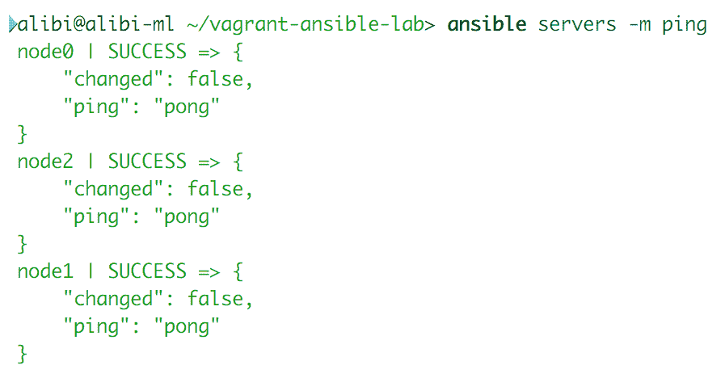

`ping`模块也可以作为更大脚本的一部分在 playbook 中使用，其中`ping`的结果可以被传递为另一个动作的条件。playbook 代码如下：

```
---
- name: Ping module playbook usage
  hosts: servers
  gather_facts: false
  tasks:
    - name: ping the local servers
      ping:
```

这段代码的输出将如下所示：

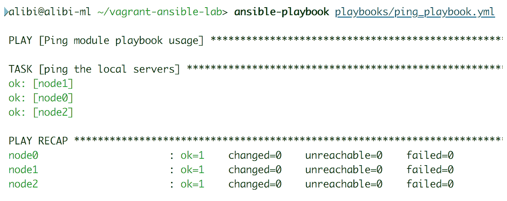

# 临时命令与 playbook：win_reboot 模块

临时命令可以简单地执行，如下面的两个例子所示：

```
ansible winservers -m win_reboot

ansible win servers -m win_reboot –args="msg='Reboot initiated by remote admin' pre_reboot_delay=5"
```

任一命令的结果输出如下：

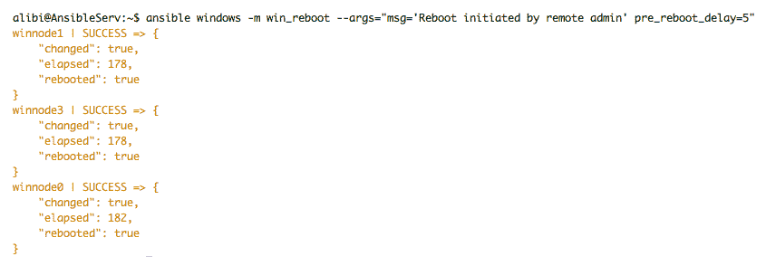

这个 playbook 文件包含了使用相同模块重新启动主机的两种方式：

```
---
- name: Reboot Windows hosts
  hosts: winservers
  fast_gathering: false
  tasks:
    - name: restart Windows hosts with default settings
      win_reboot

    - name: restart Windows hosts with personalized 
      settings
      win_reboot:
        msg: "Reboot initiated by remote admin"
        pre_reboot_delay: 5
```

生成的 playbook 输出如下：

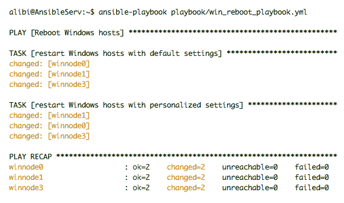

# 临时命令与 playbook：copy 模块

Ansible `copy`模块可以在临时模式下用于快速运行复制作业：

```
ansible servers -m copy --args="src=./file1.txt dest=~/file1.txt"
```

这个命令的输出应该如下所示：

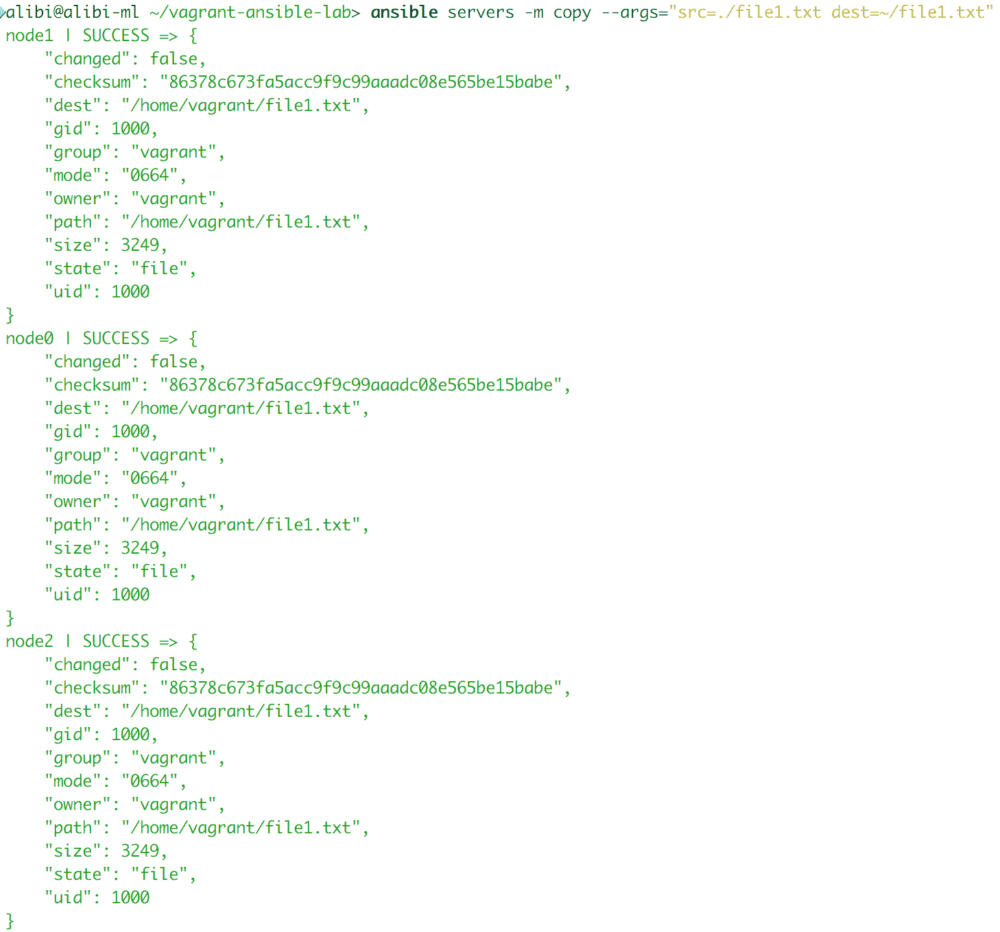

或者，这可以在包含各种选项以获得个性化结果的 playbook 中使用：

```
---
- name: copy a file to hosts
  hosts: servers
  become: true
  fast_gathering: false
  tasks:
    - name: copy a file to the home directory of a user
      copy:
         src: ./file1.txt
         dest: ~/file1.txt
         owner: setup
         mode: 0766
```

# Ansible 模块返回值

返回值是监视和管理任务执行的关键特性。管理员可以确定每个操作的状态，并相应地运行其他任务，无论是修复、改进还是跟进更大的工作。Ansible 模块配备了各种返回值。每个模块都会有通用值和一些额外的特定于模块执行的特定值。这些额外的返回值可以用于许多功能。在 Ansible 中，大多数返回值用作 playbook 条件和循环的输入。这种脚本允许对操作和任务进行流水线处理，以实现自动化配置管理。Ansible 基本上收集了模块执行的有关操作的所有有用输出数据，并将其整理成作为返回值呈现的变量。

没有必要学习这些模块的所有返回值；您可以使用`ansible-doc`命令轻松获取有关每个模块的非常好的文档。或者，使用`module index`查阅官方 Ansible 文档。

至于最常见的返回值，我们可以确定以下内容：

+   `stdout 或 stdout_lines`：这是一个变量，包含使用执行模块（如`raw`、`command`、`shell`或`win_shell`）执行的命令的标准输出。`stdout_lines`具有与`stdout`相同的值和字符串，但它们具有更有组织的输出——一个人类可读的文本分成行。

+   `stderr`或`stderr_lines`：这与`stdout`具有相同的输出源，但这是错误消息输出。如果执行的命令返回错误消息，它将存储在这个变量中。`stderr_lines`也具有与`stderr`相同的输出字符串，但更有组织成行。

+   `changed`：这是返回值，指示任务或操作的状态是否对目标主机进行了更改。它将包含一个`True`或`False`的布尔值。

+   `failed`：这是另一个状态更新返回值，指示任务或操作是否失败。它也是一个布尔值，可以是`True`或`False`。

+   `skipped`：这是另一个状态返回值，指示任务是否已被跳过。当任务由 playbook 条件触发并且条件未满足时会发生这种情况。与其他状态返回值一样，它是一个布尔变量。

+   `rc`：这代表**返回码**。它包含由命令执行模块执行的命令生成的返回码。

+   `results`：这是一个值，在没有循环的任务中不存在。它应该包含用于循环的每个项目的正常模块`result`列表。

+   `invocation`：这是一个包含详细说明模块如何被调用的值。

+   `backup_file`：这是一个值，当模块具有特定的`backup=no|yes`选项时会填充。它指出备份文件创建的位置。

+   `msg`：这是一个包含模块生成的消息的值，发送给 Ansible 用户。

在执行任务时，通用值使用寄存器进行收集，然后通过 playbook 条件函数调用或使用调试器打印：

```
---
- name: Restart Linux hosts if reboot is required after updates
  hosts: servers
  gather_facts: false
  tasks:
    - name: check for updates
      become: yes
      become_method: sudo
      apt: update_cache=yes

    - name: apply updates
      become: yes
      become_method: sudo
      apt: upgrade=yes 

    - name: check if reboot is required
      become: yes
      become_method: sudo
      shell: "[ -f /var/run/reboot-required ]"
      failed_when: False
      register: reboot_required
      changed_when: reboot_required.rc == 0
      notify: reboot

  handlers:
    - name: reboot
      command: shutdown -r now "Ansible triggered reboot after system updated"
      async: 0
      poll: 0
      ignore_errors: true
```

这个 playbook 将有以下输出：

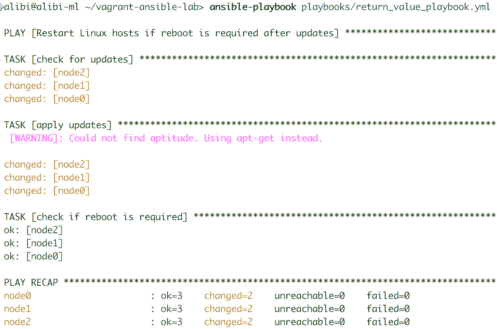

使用调试器，我们可以轻松地指定我们希望打印一个或所有返回值。Playbook 任务应该如下所示：

```
    - name: apply updates
      become: yes
      become_method: sudo
      apt: upgrade=yes
      register: output

    - name: print system update status return value
      debug:
           var: output.changed
```

Ansible 还收集一些额外的值，用于内部 Ansible 功能。这些值是`ansible_facts`、`exception`、`warning`和`deprecations`。它们可以由一些模块添加，以后从寄存器变量中删除并由 Ansible 收集。

# Ansible Linux 模块

我们将从探索 Linux 模块开始。这些是用于管理运行在 Linux 环境上的操作系统、软件包、应用程序和服务的最常用模块的选择。我们将涵盖两个大的 Linux 家族，Debian 和 Red Hat。在本节中，我们将简要概述模块及其有用的功能和特性。我们还将查看此模块的一个有趣用途的 playbook 示例。

我们不会涵盖 Ansible 版本中支持的所有可用模块。您可以通过运行 ansible-doc 命令或在模块索引部分的官方 Ansible 文档中找到这些模块的完整文档。在本书中，我们将尝试涵盖一些执行某些任务所需的社区和 galaxy 模块。

一些模块需要在远程主机上安装一些特定的技术。这些要求中的大多数通常作为基本系统实用程序预安装，而您可以通过使用另一个可以执行类似工作的工具来解决其他问题。例如，当您使用`apt`模块时，要求主机上安装了`aptitude`。Ansible 将使用`apt-get`来执行作业，并向用户发出警告消息，指出 aptitude 不可用。如果未满足要求，Ansible 将确保通知用户。

在使用新模块之前，请务必仔细阅读其文档，并检查是否满足了所有的要求，以确保安全。

# Linux 系统模块

以下是管理 Linux 系统最有用的 Ansible 模块列表。

# 用户管理模块

如其名称所示，此模块用于 Linux 系统上的用户管理。例如，我们将创建一个名为`install`的系统用户的 playbook，以便稍后用于管理远程机器。playbook 脚本如下：

```
---
- name: Linux Module running
  hosts: servers
  become: yes
  gather_facts: false
  tasks:
    - name: create a system user to be used by Ansible
      user:
        name: install
        state: present
        shell: /bin/bash
        group: sudo
        system: yes
        hidden: yes
        ssh_key_file: .ssh/id_rsa
        expires: -1
```

在运行 playbook 时，如果需要额外的输出，可以始终添加`-v`或`-vvv`。以下截图显示了正常运行和使用`-v`选项的输出：

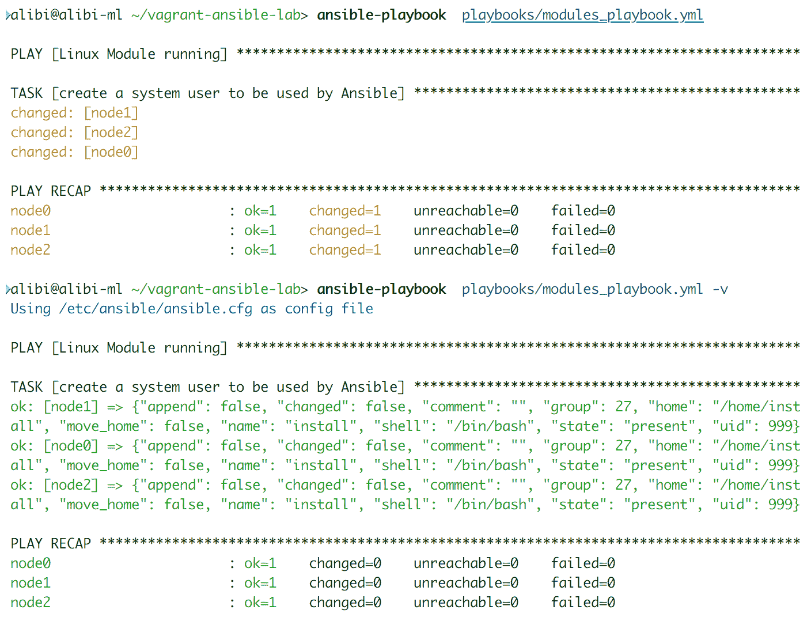

相同的模块也可以用来删除用户，可以通过将他们的状态更改为 absent 或者通过将他们的 shell 更改为`/bin/nologin`来禁用他们。对于一些集群环境，系统共享的一些用户必须具有相同的 UID 才能通过作业处理程序运行任务。`uid`选项可以允许特定用户在创建主机时具有一组特定的 UID，尽管这并不推荐。

模块有许多特殊的返回值，可以与其他模块进行流水线处理。最有用的模块如下：

+   `home`：显示用户的主目录

+   `ssh_public_key`：允许将密钥打印到文件中以供多种用途使用

+   `uid`：显示新创建用户的 UID

# 组管理模块

组模块具有与用户模块相同的输入类型，但影响主机组。这是一个基本模块，用于创建、修改和删除组。它需要三个基本命令来管理组：`groupdadd`、`groupdell`和`groupmod`。

使用非常简单。playbook 脚本应该如下所示：

```
    - name: create a new group
      group:
        name: clustergroup
        state: present
        gid: 1040
```

# 主机名模块

这是另一个简单的模块，它的工作是更改主机名。为了使这个模块更加有趣，我们将使用一些 playbook 功能。此模块需要一个输入，即新的主机名，并更改远程主机的主机名。我们可以使用 playbook 预定义变量`{{ inventory_hostname }}`。此变量调用 Ansible 清单的主机名，并将其与 playbook 一起使用。

首先，我们需要更改清单文件如下所示：

```
[servers]
server0  ansible_host=192.168.10.10     
server1  ansible_host=192.168.10.11    
server2  ansible_host=192.168.10.12
```

然后，我们使用以下的 playbook：

```
    - name: change hostname
      hostname:
        name: "{{ inventory_hostname }}"
```

执行 playbook 后，您可以使用 adhoc Ansible 命令进行简单测试：

```
ansible -m shell -a hostname servers
```

结果应该如下所示：

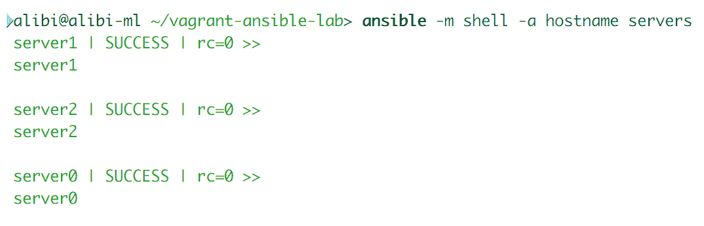

# sysctl 控制模块

这是一个管理`sysctl`属性的模块。由于这个模块可以改变一些内核行为，让我们确保它安全。我们将进行一个配置，使 Linux 服务器充当网关。在本节中，我们不会深入讨论“IPtables”规则。我们将使用一个通用的示例配置，并尝试通过`sysctl`模块应用它。

运行该模块的 playbook 应包含以下内容：

```
    - name: enable IP forwarding on IP version 4
      sysctl:
         name: net.ipv4.ip_forward
         value: 1
        sysctrl_set: yes
        state: present
       reload: yes 
```

当需要在更改后运行`sysctl -p`时，需要一个重新加载选项。通过设置正确的防火墙规则，这个任务将使主机能够从一个网络接口路由数据包到另一个网络接口。

# 服务管理模块

这使得 Linux 系统服务管理：启动、停止、重新加载、重新启动，并启用其系统引导启动。例如，我们将确保所有主机都运行并启用`ntp`（即**网络时间服务**）：

```
    - name: start and enable ntp service
      service:
          name: ntp
          state: started
          enabled: yes
```

# systemd 模块

对于更高级的服务管理，我们可以使用`systemd`作为服务的替代方案。`systemd`模块应该能够在所有 Linux 操作系统上管理服务，因为它具有包含许多有用服务数据的状态特殊返回值的优势。这里展示了一个使用它的示例 playbook：

```
    - name: start and enable ntp service using systemd
      systemd:
        name: ntp
        state: started
        enabled: yes
        masked: no
        daemon_reload: yes
      register: systemd

    - debug:
        var: systemd.status.Description
```

playbook 输出应如下所示：

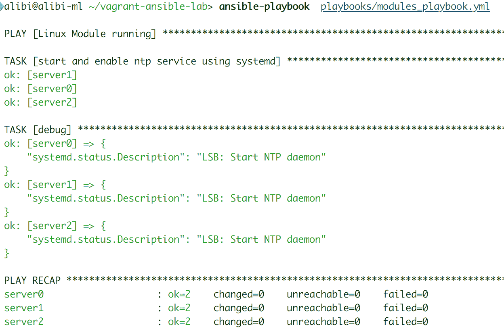

# 内核黑名单管理模块

这个模块允许您管理内核模块和驱动程序的黑名单，这些驱动程序和库将在系统启动时从内核设备驱动程序初始化中排除。对于我们的示例 playbook，当使用 Nvidia GPU 时，我们将执行最常见的黑名单操作之一——黑名单`nouveau`驱动程序：

```
    - name: addling nouveau nvidia driver to the kernel    
      blaklist
      kernel_blacklist:
         name: nouveau
         state: present
```

# cron job 编辑模块

`cron`模块类似于`at`命令，但它为任务的执行提供了更多的时间选项，因为`cron`模块允许您管理`cron.d`和`crontab`。该模块允许创建和删除 crontab 条目以及创建环境变量。至于 playbook 示例，我们将创建一个`cron job`，确保共享文件夹内容具有正确的权限：

```
    - name: setup a cron job
      cron:
         name: "shared folder permission enforcer"
         hour: 0
         minute: 0
         day: *
         job: "chmod -R 777 /media/shared"
         state: present
```

当处理环境变量（如`PATH`或`HOME`）时，这个模块也很方便，用于 crontab 条目：

```
- name: link the cron PATH variable with a new binaries location
  cron:
    name: PATH
    env: yes
    value: /usr/local/app/bin
```

# SSH 授权密钥管理模块

这个模块管理 Linux 主机中特定用户帐户的 SSH 授权密钥。使用 playbook，我们将设置一个新的授权密钥：

```
    - name: add a new authorise SSH key to the user 
     install
      authorized_key:
          user: install
          state: present
          key: "{{ lookup('file', '/home/install
          /.ssh/id_rsa.pub') }}"
```

这个模块支持许多特殊的返回值。它们可以像其他返回值一样用于收集有关主机的关键数据。

# Git 使用模块

这个模块帮助从 Git 存储库部署工具或配置文件。该模块要求远程主机上安装了`git`工具才能正常工作。作为 playbook，我们将克隆 GitHub 上可用的最新版本的 Ansible：

```
    - name: clone Ansible from github
      git:
        repo: https://github.com/ansible/ansible.git
        dest: /usr/local/ansible
        clone: yes
        update: yes 
```

执行该 playbook 应如下所示：

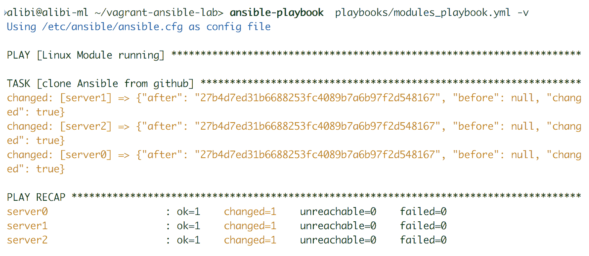

`git`模块支持一些特殊的返回值，帮助您监视项目的状态。

# SELinux 控制模块

在 Red Hat 环境中，管理 SELinux 甚至在一台机器上都可能是一件麻烦事，更不用说在一系列主机上了。这个 Ansible 模块帮助用户配置 SELinux 模式和策略。

这个模块以及其他一些模块在执行任务后可能需要重新启动。Ansible 将始终让用户知道是否需要重新启动。一些高级模块可能具有集成选项，如果主机需要重新启动，它将自动启动重新启动。

作为一个快速的 playbook 示例，我们将要求 Ansible 使 SELinux 处于宽松模式：

```
    - name: change SELinux to permissive
      selinux:
        policy: targeted
        state: permissive
```

该模块需要在远程主机上安装`libselinux-python`库才能正常工作。该模块还具有自己的特殊返回值，可用作处理程序或其他相关模块的输入。

# Linux 命令模块

在本节中，我们将解决特别复杂的 Linux 命令或者不想搜索模块的任务，或者想使用自己的技术的情况。Ansible 提供了一系列命令执行模块，帮助您向远程主机发送命令。您想要管理环境的方式取决于您；Ansible 只是一个工具，可以使您的工作更加高效。

# 运行原始命令模块

与其他命令模块相比，这个模块在命令行交付方面是最简单的。它基本上通过 SSH 将命令原样发送到远程主机，没有标题或选项。它不支持管道或处理程序，但在将 PowerShell 命令发送到配置为由 Ansible 管理的 Windows 主机时可以使用。

在使用`raw`模块引导 Python 到机器上时，应禁用事实收集。在 playbook 语法中，`become`选项，选择哪个用户将运行任务，与`raw`模块不兼容，因此当命令需要 root 权限时，我们可能需要在命令前添加`sudo`。

使用此模块的简单 playbook 可能如下所示：

```
    - name: run a simple command
      raw: echo "this was written by a raw Ansible 
      module!!" >> ~/raw.txt
```

# 命令执行模块

该模块具有与原始命令模块相同的功能，但更为优化。它允许多个选项，并且可以使用其返回值进行其他任务。作为 playbook 的示例，我们将运行一个命令，然后收集其输出以供以后使用：

```
    - name: run a simple command
      command: cat ~/raw.txt
      register: rawtxt

    - debug: var=rawtxt.stdout
```

playbook 的输出如下：

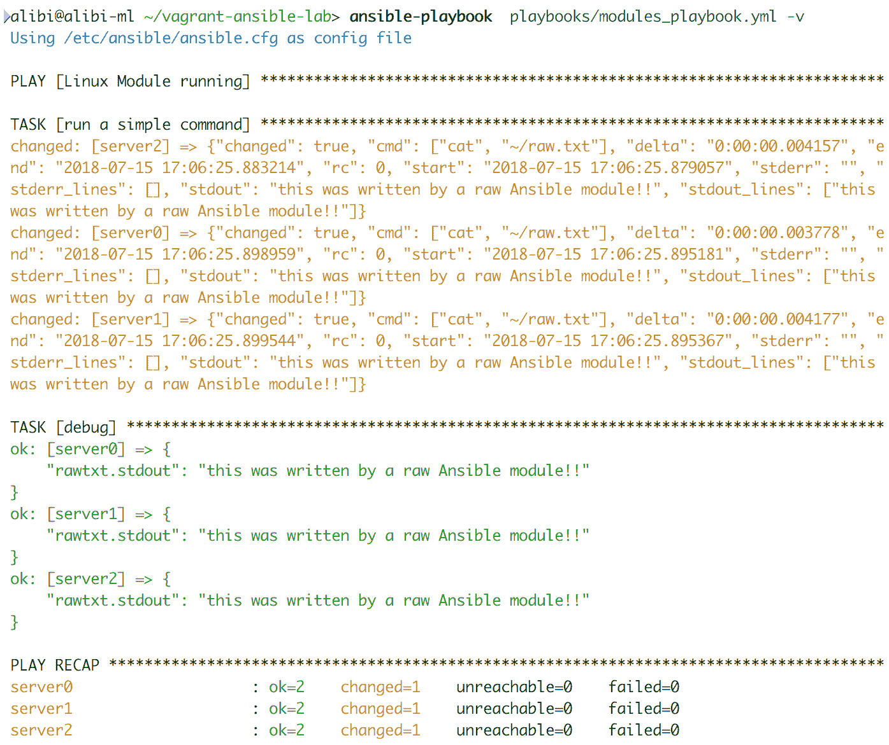

该模块缺乏理解特殊环境变量（如`$PATH`）、Linux 管道和重定向特殊字符的能力。如果这对于您的特定用例是必要的，请使用列表中的下一个模块`shell`。

# shell 命令模块

这个模块是最方便的命令模块之一。它不仅允许您运行命令，还可以运行 shell 脚本，并允许您指定工作目录和要执行命令行的 bash 的位置。默认情况下，该模块在`/bin/sh` shell 上运行所有远程命令。以下 playbook 提供了一个很好的例子：

```
    - name: run a simple shell script
      shell: ./shell_script.sh >> ~/shell.txt
      args:
          chdir: /usr/local/
          creates: ~/shell.txt
          executable: /bin/csh
```

Shell 还有一些非常有用的返回值。

# 脚本执行模块

这是另一个在远程节点上运行 shell 脚本的模块。然而，它首先将位于 Ansible 主机上的脚本传输到远程主机，然后再执行它们。该模块在远程主机的 shell 环境中运行脚本，就好像是由主机上的本地用户运行的一样。

该模块支持运行其他类型的脚本，例如 Python、Perl 或 Ruby。看一下以下示例 playbook，展示如何使用它：

```
    - name: execute a script on a remote host
      script: ./shell_script.py –some-argumets "42"
      args:
          creates: ~/shell.txt
          executable: python
```

该模块的功能类似于原始命令模块。它也支持 Windows 远程主机。

# expect 脚本模块

如果您熟悉 expect 脚本编写，这是一个类似的模块，但更简单，规模更大。这是一种处理交互式命令的方式，例如更改密码和 SSH 问题。更改用户密码的 playbook 示例如下：

```
    - name: change user1 password
      expect:
        command: passwd user1
        responses:
          (?i)password: "Ju5tAn07herP@55w0rd":
```

该模块需要在远程主机上安装`pexpect`和`python`。

# Linux 软件包模块

在本节中，我们将展示两种类型的软件包管理器：用于操作系统和编程语言。

# Apt 软件包管理器模块

该模块管理 Debian 家族的软件包，包括 Debian、Ubuntu、LinuxMint、KaliLinux 等。它要求您在远程主机上安装`aptitude`、`python-apt`和`python3-apt`才能正常工作。它具有多个选项和功能，可个性化软件包的安装、删除、升级和索引更新。以下 playbook 仅显示了其中一些功能：

```
    - name: install some packages on a Debian OS
      apt:
          name: "{{ pkg }}"
          state: latest
          update_cache: yes
      vars:
          pkg:
          - aha
          - htop
```

该模块有一些额外的辅助模块，用于帮助额外的存储库和用于受信任证书的密钥。它还具有一些特殊的返回值。

# DNF 软件包管理器模块

该模块控制 Red Hat 家族的新软件包管理器，包括 Red Hat、Fedora、CentOS 和 Scientific Linux。它帮助在本地索引中安装、升级、删除和搜索软件包。以下 playbook 显示了如何使用它：

```
    - name: install a package using dnf
      dnf:
          name: htop
          state: latest
```

该模块要求您在机器上安装`python`、`python-dnf`和`dnf`本身才能正常工作。

# Yum 软件包管理器模块

Yum 是原始的 Red Hat 软件包管理器，今天仍在使用。它还有自己的模块来管理它。与`dnf`一样，它有助于管理软件包和软件包组。以下 playbook 显示了如何启用存储库，然后使用此模块从中安装工具：

```
    - name: add epel repo using yum
      yum:
           name: https://dl.fedoraproject.org/pub/epel
           /epel-release-latest-7.noarch.rpm
          state: present  
        - name: install ansible using yum
          yum:
           name: ansible
           state: present
```

# Homebrew 软件包管理器

Homebrew 是 macOS X 最著名的开源软件包管理器。该模块是为了帮助远程管理 Homebrew 软件包而制作的。可以使用一个简单的 playbook 在 macOS X 上删除软件包：

```
    - name: remove a package using homebrew
      homebrew:
         name: htop
         state: absent
         update_homebrew: yes
```

# PyPI Python 软件包管理器模块

这是我们的第一个语言软件包管理器，可能是最著名的。它管理 Python 软件包和库。它具有各种选项，以满足与 Python 库相关的各种不同要求。要运行此模块，我们需要确保 PyPI 已安装在远程主机上。以下示例 playbook 将显示其中一些：

```
    - name: install a python library from the default 
   repo
      pip:
         name: numpy
         version: 0.3
    - name: install a python library from a github
      pip:
         name: https://github.com/jakubroztocil/httpie
         /archive/master.tar.gz 
```

# Cpanm Perl 软件包管理器模块

与`pip`模块一样，此模块管理 Perl 软件包管理器**Comprehensive Perl Archive Network**（**CPAN**）。它的使用方式相同；您可以从默认存储库或 Web 或本地存档文件安装库或软件包。要运行此模块，我们需要确保远程主机上安装了`cpanminus`。如下示例 playbook 中所示：

```
    - name: install a Perl library on a Linux host
      cpanm:
         name: IO
```

# Linux 文件模块

Linux 文件管理模块具有一些共享特性，可以在多个模块中找到。您可以使用一个模块执行由三个不同操作组成的任务。在本节中，我们将只讨论主要模块，并简要介绍可以执行类似功能的模块。

# 文件和文件夹管理模块

文件模块基本上是管理一切与文件和文件夹组织有关的工具，包括创建、删除、符号链接创建、权限和所有权。

我们已将文件模块链接到**访问控制列表**（**ACL**）模块，这是一个仅在 Linux 环境中的文件和文件夹的权限和所有权上工作的模块，以显示一些任务可以合并。这在以下 playbook 中显示：

```
    - name: create a file with some specific acl
      file:
         path: /usr/local/script.py
         state: touch
         owner: user1
         group: developers
         mode: 0755

    - name: change acl of a file
      acl:
         path: /usr/local/script.py
         entity: user2
         permission: w
         state: present
```

# 数据分发模块（copy、unarchive 和 get_url）

`copy`模块用于将文件从 Ansible 主机传输到远程主机或在远程主机内部进行本地传输。然后是`unarchive`，这是一个存档提取器，然后将文件传输到选定的主机。`get_url`模块基本上是从 Web 位置下载文件作为 HTTP、HTTPS 或 FTP 文件。以下 playbook 显示了如何使用每个模块来实现目标：

```
    - name: copy file from within a remote host
      copy:
         src: /usr/local/script.py
         dest: /home/user1/script.py
         remote_src: yes
         owner: user1
         group: developers
         mode: 0755

    - name: extract an archive into remote hosts
      unarchive:
         src: ~/archive.tar.gz
         dest: /usr/local/
         owner: user1
         group: developers
         mode: 0755

    - name: download an ansible archive to remote hosts
      get_url:
         url: https://github.com/ansible/ansible/archive
         /v2.6.1.tar.gz
         dest: /usr/local/ansible_v2.6.1.tar.gz
         mode: 0777
```

`copy`模块支持备份选项，这在复制配置文件时非常有用；如果出现错误，用户可以随时恢复到原始状态。但是，unarchive 需要在主机上安装`gtar`和`unzip`。所有这些模块都具有特殊的返回值，显示有关任务状态的信息。

# 数据收集模块（fetch）

这是一个颠倒了之前模块功能的模块。此模块有助于从远程主机收集文件并将它们存储在 Ansible 主机中。在收集应用程序和服务日志、用户配置或系统相关文件时非常方便。例如，我们将尝试从每个主机收集一些文件，并将它们组织在主 Ansible 主机中：

```
    - name: Collect user files from remote hosts
      fetch:
         src: /home/user1/.profile
         dest: /home/alibi/user1-profile-{{ 
          inventory_hostname }}
         flat: yes 
```

在管理远程 Windows 主机时，此模块也受支持。它具有可以在您自己的风险下停用以加快传输速度的校验和验证过程。

# 文件编辑模块（lineinfile、replace 和 blockinfile）

这些是您需要执行由工具（如`awk`或`sed`）具有的出色配置文件管理技能的唯一三个模块。`lineinfile`模块查找文件中的特定行并用预定义的正则表达式替换它。`replace`模块替换文件中特定模式的所有实例，`blockinfile`在文件中两个标记行之间插入、修改或删除一个或多个文本行。我们将这三个模块合并在一起，因为它们具有类似的基本功能，但每个模块在执行任务时都有专门的功能。以下 playbook 示例将展示如何使用每个模块来执行特定任务：

```
     - name: change a sudo user to no longer need 
       password with config testing
      lineinfile:
         path: /etc/sudoers
         regexp: '^%sudo\s'
         line: '%sudo ALL=(ALL) NOPASSWD: ALL'
         state: present
         validate: '/usr/sbin/visudo -cf %s'

     - name: change all static ethernet config to use a 
       higher mtu
      replace:
         path: /etc/network/interfaces
         regexp: '^mtu 1400$'
         line: 'mtu 9000'
         backup: yes
         validate: 'systemd reload networking'

     - name: change a static ethernet configuration
      replace:
         path: /etc/network/interfaces
         block: |
             iface eth1 inet dhcp
                   dns-nameserver 8.8.8.8
                   dns-nameserver 8.8.4.4
                   mtu 9000
         backup: yes
         validate: 'systemd reload networking'
```

# Linux 网络模块

在这一部分，我们将发现一些 Linux 系统网络管理模块。

# 网络接口管理模块

此模块是管理 Linux 主机中的`/etc/network/interfaces`文件的一种方式。基本上，它允许您创建、修改和删除网络接口配置。此配置特定于每个标识的网络接口；它不会更改未指定的接口。以下 playbook 向您展示如何对特定接口进行更改：

```
    - name: Change mtu to 1500 for eth1 interface
      Interfaces_file:
         dest: /etc/network/interfaces
         iface: eth1
         option: mtu
         value: 1500
         backup: yes
         state: present
```

如果此任务返回其返回值，用户可以轻松地识别有关接口更改配置的所有信息。

对于更高级的网络管理，请查看`nmcli`模块。它可以管理各种连接和设备类型：以太网、团队、债券和 VLAN。

# 防火墙 UFW 管理模块

这是一个用于 Linux 防火墙 UFW 的 Ansible 管理模块。它基本上管理端口、协议和 IPS 防火墙权限。一个启用特定协议端口的示例 playbook 可以编写如下：

```
    - name: add port 5000 for iperf testing on all hosts
      ufw:
         rule: allow
         port: 5000
         proto: tcp
```

此模块需要在远程主机上安装`ufw`命令行工具。

# HAProxy 控制模块

这是一个管理 HAProxy 服务器的模块，通过套接字命令命令它们启用、禁用、排空和设置后端服务器的权重。禁用一些 HAProxy 服务器的命令示例如下：

```
    - name: disable a haproxy backend host
      haproxy:
         state: disabled
         host: '{{ inventory_hostname }}'
         socket: /usr/loca/haproxy/haproxy.sock
         backend: www
         wait: yes
```

# 唤醒 LAN 触发模块

这是一个打开当前关闭的主机的模块。此功能要求 Ansible 已经收集了有关主机的事实并存储了它们的 MAC 地址信息。以下是一个展示如何使用此模块的 playbook 代码：

```
 - name: start powered off hosts
 wakeonlan:
 mac: "{{ hostvars[inventory_hostname].ansible_default_ipv4.macaddress }}"
 port: 8
 delegate_to: localhost
```

# Linux 存储模块

Ansible 确实提供了一些特定于 Linux 的存储设备和卷管理。

# 文件系统管理模块

此模块在处理虚拟化基础设施时非常方便，但也可以用于裸金属设置。在远程主机上必须已经存在一个磁盘，然后才能使用此模块进行管理。在虚拟环境中，Ansible 或其他管理工具允许您自动将磁盘添加到主机，然后使用此模块进行管理。以下是使用此模块格式化磁盘的 playbook 示例：

```
    - name: create a filesystem from a newly added disk
      filesystem:
         fstype: ext4
         dev: /dev/sdc1
```

查看`lvg`和`lvol`模块，用于 LVM 卷和组管理。在使用虚拟化环境时，LVM 可以简化磁盘管理，特别是处理需要收缩和扩展磁盘空间的系统。

# 设备挂载模块

这可以作为文件系统的补充模块。它对于管理特定主机系统上的卷挂载也非常有用。这个模块管理`/etc/fstab`：

```
    - name: mount the recently added volume to the system
      mount:
         path: /media/disk1
         fstype: ext4
         boot: yes
         state: mounted
         src: /dev/sdc1
```

这个模块还可以处理挂载网络驱动器。这可能需要您安装额外的工具，如 NFS 和 SMB 客户端。

# 磁盘分区模块

这是一个控制分区工具的模块，用于帮助设备分区、收集它们的信息或将它们保存为返回值。以下示例 playbook 显示了如何删除一个分区：

```
    - name: remove a no longer needed partition
      mount:
         device: /dev/sdc
         number: 1
         state: absent
```

# GlusterFS 控制模块

这是一个 Ansible 模块，用于管理跨主机集群的 GlusterFS 卷。它使用户能够根据需要添加、删除、启动、停止和调整卷。以下示例 playbook 显示了如何创建一个新卷：

```
    - name: create a new GlusterFS volume
      gluster_volume:
         status: present
         name: gluster1
         bricks: /bridkes/brik1/g1
         rebalance: yes
         cluster:
            - 192.168.10.10
            - 192.168.10.11
            - 192.168.10.12
         run_once: true
```

# Ansible Windows 模块

从 Linux 模块转移到现在探索的模块，这些模块是 Ansible 用来管理 Windows 桌面和服务器的。确保已经按照准备步骤确保 Windows 主机已准备好被 Ansible 控制。

# Windows 系统模块

让我们从控制 Windows 系统并允许用户管理其不同方面的模块开始。

# Windows 用户和组管理模块

这两个模块用于管理 Windows 主机本地机器的用户和组。以下 playbook 示例显示了如何将每个模式添加到 Windows 主机：

```
---
- name: Windows Module running
  hosts: winservers
  gather_facts: false
  tasks:
    - name: create a new group dev
      win_group:
         name: developers
         description: Development department group
         state: present

    - name: create a new user in the dev group
      win_user:
         name: winuser1
         password: Ju5t@n0th3rP@55w0rd
         state: present
         groups:
             - developers
```

# Windows 注册表编辑模块

Ansible 通过`win_regedit`模块提供对 Windows 主机注册表的远程管理。这允许您创建、编辑和删除注册表键及其值。以下 playbook 显示了如何通过注册表禁用 Windows 自动更新：

```
    - name: disable Windows auto-update
      win_regedit:
         path: HKLM:SOFTWARE\Policies\Microsoft\Windows
         \WindowsUpdate\AU
         name: NoAutoUpdate
         data: 1
         type: binary
```

# Windows 服务管理模块

这个模块允许 Ansible 用户管理和查询 Windows 主机服务。以下是一个 Ansible playbook，展示了如何禁用 Windows 更新服务（不建议，但很方便知道）：

```
    - name: disable Windows update service
      win_service:
         name: wuauserv
         state: stopped
         start_mode: disabled
```

这个模块有返回值，提供有关服务状态的信息。

# Windows 更新和功能管理模块（win_updates、win_hotfix 和 win_feature）

Ansible 使用三个互补模块`win_updates`、`win_hotfix`和`win_feature`来管理 Windows 更新、热修复和功能。这些模块使用系统默认服务和工具，通过命令它们在 playbook 上应用一组任务。以下示例 playbook 有三个示例，演示了如何使用每个模块来安装或启用 Microsoft 工具、修复或功能：

```
    - name: install updates for Windows related    
    applications and tools
      win_updates:
         category_names: 
             - Applications
             - Tools
         state: installed
         reboot: no
      become: yes
      become_user: SYSTEM

    - name: install a specific Windows Hotfix
      win_hotfix:
         hotfix_kb: KB4088786 
         source: C:\hotfixes\windows10.0-kb4088786-
       x64_7e3897394a48d5a915b7fbf59ed451be4b07077c.msu
         state: present

    - name: enable Hyper-V and Write Filter features
      win_feature:
         name: 
             - Hyper-V
             - Unified-Write-Filter
         state: present
```

这些模块的执行会生成特殊的返回值。这些是自动化维护 Windows 主机的关键特性。

这三个模块需要以域或本地管理员组的用户凭据运行。

# Windows Wake-on-LAN 触发模块

就像 Linux 主机的 Wake-on-LAN 模块一样，这个模块将使用它们的 MAC 地址来关闭 Windows 主机。一个示例 Playbook 如下：

```
    - name: start powered off Windows hosts
      win_wakeonlan:
         mac: "{{  
hostvars[inventory_hostname].ansible_default_ipv4.macaddress }}"
         port: 8
      delegate_to: remote_system
```

这个模块将向特定 MAC 地址发送 Wake-on-LAN 魔术数据包。只有配置为接受数据包的主机才会响应。需要 BIOS 或操作系统配置来启用 Wake-on-LAN。

# Windows 防火墙管理模块

这个模块与 Windows 主机的本地防火墙交互，以配置其规则。以下 playbook 显示了如何启用 VNC 协议：

```
    - name: enable the VNC port on the host local 
      firewall
      win_firewall_rule:
         name: VNC
         localport: 5900
         protocol: udp
         direction: in
         action: allow
         state: present
         enabled: yes
```

这个模块也需要由本地或域管理员执行。

# Windows 软件包模块

与 Linux 和统一应用程序安装的所有软件包管理器相比，Windows 主机应用程序管理可能会变得复杂。Ansible 使用其模块来规避这些挑战。

# Chocolatey 控制模块

Chocolatey 是 Windows 系统的第三方软件包管理器。它允许用户使用标准命令安装、删除和更新大量的 Windows 应用程序。Ansible 提供了一个模块，确保 Chocolatey 已安装在系统上，然后开始使用它从其软件包库（[`chocolatey.org/packages`](https://chocolatey.org/packages)）安装所选工具。以下是一个展示`win_chocolatey`模块多种用法的示例 playbook：

```
    - name: setup the latest version of firefox
      win_chocolatey:
         name: firefox
         state: latest

    - name: update all chocolatey installed tools
      win_chocolatey:
         name: all
         state: latest

    - name: remove 7zip
      win_chocolatey:
         name: 7zip
         state: absent
```

# Windows 软件包管理器

这是一个用于安装和删除 MSI 或 EXE 文件的软件包的 Ansible 模块。它允许您使用不同的来源安装软件包，可以是本地计算机、网络共享驱动器或网络。以下示例 playbook 显示了如何安装 Atom：

```
    - name: install atom editor on Windows hosts
      win_package:
         path: C:\app\atom.msi
         arguments: /install /norestart
         state: present
```

该模块替换了旧的、不稳定的模块，如`win_msi`。

# Windows 命令模块

就像 Linux 一样，当需要输入自己的命令并且没有模块可以简化任务时，命令模块可以使任务更加简单。Ansible 提供了以下模块，允许您向远程 Windows 主机发送特定命令。

# Windows 命令模块（win_shell 和 win_command）

这两个 Ansible 模块是向 Windows 主机发送任何 PowerShell 或 bash 命令的最佳方式。`win_shell`模块更适用于运行脚本和长或多行命令，而`command`更适用于运行可能需要额外参数的常规命令。以下 playbook 显示了一个示例代码：

```
    - name: run a PowerShell script on a working 
     directory
      win_shell: C:\scripts\PSscript.ps1
         args:
            chdir: C:\Users\winuser1\Workspace

    - name: execute a PowerShell command on remote 
      Windows hosts
      win_command: (get-service wuauserv | select status 
       | Format-Wide | Out-String).trim()
      register: output

    - debug: var=output.stdout
```

# Windows 任务调度模块

Windows 主机可以通过调度未来任务来进行时间管理。这是一种创建、编辑和删除 Windows 计划任务的方法。以下是 playbook 上的任务调度示例：

```
    - name: schedule running a PowerShell script a 
     specific time
      win_scheduled_task: 
         name: PowerShellscript
         description: Run a script at a specific time
         actions:
         - path: C:\Windows\System32\WindowsPowerShell
           \v1.0\powershell.exe
           arguments: -ExecutionPolicy Unrestricted 
        -NonInteractive -File
         triggers:
         - type: logon
        state: present
        enabled: yes
```

# Windows 文件模块

使用 Ansible 管理 Windows 主机的文件和文件夹与在 Linux 系统上一样简单。它提供了一组模块，满足所有管理需求。

# Windows 文件和文件夹管理模块

这是一个在远程 Windows 主机上创建、更新和删除文件和文件夹的模块。这个示例 playbook 展示了如何管理 Windows 系统上的文件和文件夹：

```
    - name: add a new file
      win_file: 
          path: C:\scripts\PSscript2.ps1
          state: touch
    - name: remove a folder
      win_file: 
          path: C:\scripts\TestScripts
          state: absent
```

该模块不会更改文件权限。要做到这一点，您需要使用`win_share`模块。

# Windows 数据共享模块

这是`win_file`的补充模块。该模块设置、修改和删除 Windows 文件和文件夹的共享权限。这是一个展示远程 Windows 主机上特定文件夹的示例配置的 playbook：

```
 - name: add a new file
 win_share:
 name: devscript
 description: Developers scripts shared folder 
 path: C:\scripts
 list: yes
 full: developers
 read: devops
 deny: marketing
```

该模块仅支持 Windows 8 和 Windows 2012 及更高版本。

# Windows 文件编辑模块

这是 Ansible 模块`lineinfile`的 Windows 版本。它基本上执行相同的任务，根据正则表达式更改文件的特定行，但它专门用于 Windows 主机。以下是一个示例 playbook：

```
    - name: remove a folder
      win_lineinfile: 
          path: C:\scripts\PSscript.ps1
          regexp: '^service='
          line: 'service=wuauserv'
```

# Windows 数据发送模块（win_copy、win_robocopy 和 win_get_url）

这些模块负责将文件传输到 Windows 远程主机。每个模块都有自己的方法将文件传输到目的地。`win_copy`模块将文件从本地计算机或远程主机复制到远程主机的特定位置。`win_robocopy`模块类似于`rsync`，用于同步远程主机内两个文件夹的内容。它可以作为备份解决方案非常方便。`win_get_url`模块将 URL 作为输入，将文件下载到指定位置。

以下 playbook 显示了一些示例案例：

```
    - name: copy a file from one location to other within 
      the Windows hosts
      win_copy: 
          src: C:\scripts\PSscript.ps1
          dest: C:\applications\PSscript.ps1
          remote_src: yes

    - name: backup scripts folder 
      win_copy: 
          src: C:\scripts\
          dest: D:\backup\scripts
          recurse: yes

    - name: backup scripts folder 
      win_get_url: 
          url: https://www.github.com/scripts
          /winscript2.ps1
          dest: C:\scripts\ winscript2.ps1
```

# Ansible 网络模块

使用 Ansible 管理网络设备从未如此简单。拥有一个 playbook，所有模块的统一语言使得专有网络设备的管理非常简单，不需要您学习特定供应商的工具和编程语言。网络管理现在是自动化配置管理策略的一部分。

这是目前由 Ansible 支持的网络专有设备列表：Arista、Avi Networks、Cisco、Citrix NetScaler、Cumulus、Dell EMC、F5、华为、Infoblox、Juniper、Nokia、Mellanox、Lenovo、Palo Alto Networks 和 Pluribus。我们将无法涵盖所有控制这些设备的模块，这可能需要一本专门的书！

作为无代理，Ansible 使用 SSH 和 HTTPS 与设备通信。

对于这一部分，我们只涵盖了 Cisco 标准设备。我们需要为它们创建一个特殊的清单：

```
[ciscosw]
switch0            ansible_hosts=192.168.10.250
switch1            ansible_hosts=192.168.10.251
switch2            ansible_hosts=192.168.10.252

[ciscosw:vars]
ansible_connection=network_cli
ansible_user=admin
ansible_become=yes
ansible_become_method=enable
ansible_network_os=ios
ansible_user=user1
ansible_ssh_pass= "ju5t@n0th3rp@55"
```

还有其他方法可以隐藏 YAML 文件中的明文密码；我们将在接下来的章节中看看它们，关于 Ansible Vault。

# 网络数据传输模块（net_get 和 network_put）

这两个模块允许在控制主机和多个网络设备之间更轻松地传输配置文件。它们可以用于备份或集中配置。这些模块依赖于`scp`命令的功能来进行传输。以下 playbook 中有一个示例：

```
---
- name: Network Module running
  hosts: ciscosw
  tasks:
    - name: backup a running configuration for a cisco 
     switch
      net_get:
          src: running_cfg_{{ inventory_hostname }}.txt
```

# Cisco IOS 命令模块

这个模块帮助用户向运行 IOS 的 Cisco 设备发送命令，可以是路由器、交换机、接入点或防火墙。这个模块还有一个选项，可以在返回超时之前等待条件。以下是一个在 Cisco 设备上执行命令的 playbook 示例：

```
- name: check on the switch network interfaces status
  ios_command:
      commands: show interfaces brief
      wait_for: result[0] contains Loopback0
```

# Cisco ISO 系统配置模块

这个模块允许用户修改 Cisco 设备的 IOS 运行配置。以下示例 playbook 将展示我们如何修改 Cisco 交换机的一些配置：

```
- name: change switch hostname to match the one set in the inventory
  ios_config:
      ines: hostname {{ inventory_hostname }}

- name: change IP helper config for DHCP requests sent into the device
  ios_config:
      lines: ip helper-address 192.168.10.1
```

# Cisco IOS 接口管理模块

这个模块管理 Cisco 网络交换机的接口配置。在以下简单的 playbook 中，我们将配置一个接口并启用它：

```
- name: configure a gigabit interface and make ready to use
  ios_interface:
      name: GigabitEthernet0/1
      description: lab-network-link
      duplex: full
      speed: 1000
      mtu: 9000
      enabled: True
      state: up        
```

# Cisco IOS 静态路由控制模块

正如其名称所示，这个模块管理 Cisco 网络设备上的静态路由配置。我们将在以下示例 playbook 中设置一个静态路由开关：

```
- name: setup a static route on CISCO switches
  ios_static_route:
      prefix: 192.168.11.0
      mask: 255.255.255.0
      next_hop: 192.168.10.1
      state: present
```

# Cisco IOS VLAN 管理模块

这个模块允许在 Cisco 交换机上配置 VLAN。这个示例 playbook 展示了如何将一些网络接口添加到一个 VLAN 中：

```
- name: Add new lab VLAN
  ios_vlan:
      vlan_id: 45
      name: lab-vlan
      state: present

- name: Add network interface to the lab VLAN
  ios_vlan:
      vlan_id: 45
      nterfaces:
         - GigabitEthernet0/1
         - GigabitEthernet0/2
```

# Ansible 云模块

Ansible 已经使得管理虚拟化和云基础设施变得非常容易。它有超过 300 个模块，运行多个 API，旨在涵盖各种云提供商，如亚马逊网络服务、谷歌云平台、OpenStack、微软 Azure、Digital Ocean 和 Linode。这些模块管理环境的多个方面，包括主机的操作系统、网络连接、计算资源和主机配置。

在使用 Ansible 模块与云或虚拟环境时，建议使用动态清单进行更好的管理。

# VMware 模块

Ansible 提供了一系列模块来实现 VMware 基础设施的自动化管理。

我们需要安装`pyVmomi` Python SDK：

```
pip install pyvmomi
```

这些模块用于管理 VMware ESX、ESXi 和 vCenter 服务器。在本节中，我们将描述一些参与管理 VMware 基础设施的最有用的模块。

需要一个清单文件来托管一些数据中心信息：

```
---
[vms:vars]
datacenter: "vcenter.lab.edu"
vcenter_hostname: "vcenter.lab.edu"
vcenter_username: "admin"
vcenter_password: "@dm1np@55w0rd"

[vms]
vm0
vm1
vm2

[esxi_hostname]
esxihost1         esxihost1.lab.edu
esxihost2         esxihost2.lab.edu
```

# VMware 虚拟机管理模块（vmware_guest 和 vsphere_guest）

这个模块允许创建、修改和删除虚拟机。它们还允许对指定的虚拟机进行状态和资源控制，包括电源状态修改和自定义。以下 playbook 示例展示了如何基于模板创建虚拟机：

```
---
- name: VMware Module running
  hosts: vms
  tasks:
    - name: create a new virtual machine from a template
      vmware_guest:
          hostname: "{{ vcenter_hostname }}"
          username: "{{ vcenter_username }}"
          password: "{{ vcenter_password }}"
          validate_certs: False
          folder: /lab-folder
         name: "{{ inventory_hostname }}"
         state: poweredon
         template: debian8_temp
         disk:
         - size_gb: 15
           type: thin
           datastore: labdatastore1
         hardware:
            memory_mb: 1024
            num_cpus: 2
            num_cpu_cores_per_socket: 2
            scsi: paravirtual
            max_connections: 5
            hotadd_cpu: True
            hotremove_cpu: True
            hotadd_memory: True
            hotremove_memory: True
            version: 11
         cdrom:
             type: iso
            iso_path: "[ labdatastore1] /iso_folder/debian8.iso"
         networks:
         - name: Lab Network
         wait_for_ip_address: yes
     delegate_to: localhost
```

`vsphere_guest`模块与`vmware_guest`执行相同的任务，但它是一个不太稳定的传统模块，不支持`vmare_guest`那么多的功能。

# VMware 虚拟机快照管理模块

这个 Ansible 模块实现了虚拟机的自动快照管理。以下 playbook 示例展示了如何在虚拟机上拍摄快照：

```
    - name: create a virtual machine snapshot
      vmware_guest_snapshot:
          hostname: "{{ vcenter_hostname }}"
          username: "{{ vcenter_username }}"
          password: "{{ vcenter_password }}"
          datacentre: vcenter.lab.edu
          validate_certs: False
          folder: /lab-folder
          name: "{{ inventory_hostname }}"
          state: present
          snapshot_name: Post_Fixes
          description: Fixes_done_on_vm
      delegate_to: localhost
```

在处理 VMware 模块时，大小写敏感度非常重要，特别是在处理虚拟机快照时。在稍后调用快照时，请确保其名称完全相同。

# VMware 虚拟机 shell 执行模块

以下模块允许用户通过使用 VMware 工具在虚拟机操作系统上运行命令：

```
    - name: run a command on a running virtual machine
      vmware_guest_snapshot:
          hostname: "{{ vcenter_hostname }}"
          username: "{{ vcenter_username }}"
          password: "{{ vcenter_password }}"
          datacentre: vcenter.lab.edu
          validate_certs: False
          folder: /lab-folder
          vm_id: "{{ inventory_hostname }}"
          vm_username: setup
          vm_password: "@P@55w0rd"
          vm_shell: /bin/service
          vm_shell_args: networking restart
      delegate_to: localhost
```

# VMware 主机电源状态控制模块

该模块管理 VMware 基础设备。ESX/ESXi 主机是计算资源存储的地方。该模块管理主机的电源状态。在维护、更新或修复后安排重启时，这可能非常方便。以下示例 playbook 显示了如何使用该模块：

```
    - name: restart ESXi host
      vmware_guest_snapshot:
          hostname: "{{ vcenter_hostname }}"
          username: "{{ vcenter_username }}"
          password: "{{ vcenter_password }}"
          validate_certs: no
          esxi_hostname: esxihost1.lab.edu
          state: reboot-host
      delegate_to: localhost
```

# Docker 模块

最近的 Ansible 版本引入了几个专门用于 Docker 容器管理的模块。要使用 Docker 的 Ansible 模块，管理主机应安装以下 Python 软件包：

```
pip install 'docker-py>=1.7.0'

pip install 'docker-compose>=1.7.0'
```

在处理 Docker 容器时，最好使用动态清单。

Ansible 最近引入了一个新功能，可以在不使用 Dockerfile 的情况下构建容器。`ansible-container`模块构建容器并通过 playbook 进行部署。

# Docker 容器管理模块

该模块管理在本地计算机或其他主机上运行的 Docker 容器的生命周期。以下 playbook 显示了该模块的工作原理：

```
---
- name: Docker Module running
  hosts: local
  tasks:
    - name: create a container
      docker_container:
          name: debianlinux
          image: debian:9
          pull: yes
          state: present

    - name: start a container
      docker_container:
          name: debianlinux
          state: started
          devices:
            - "/dev/sda:/dev/xvda:rwm"

    - name: stop a container
       docker_container:
          name: debianlinux
          state: stopped
```

# Docker 镜像管理模块

该模块对容器开发者非常有用。它有助于构建、加载、拉取和推送容器镜像到仓库或将容器存档为 tar 文件。以下 playbook 示例显示了可以使用该模块执行的一些可能任务：

```
     - name: pull a container image
       docker_image:
          name: ubuntu:18.04
          pull: yes

     - name: push a container image to docker hub
       docker_image:
          name: labimages/ubuntu
          repository: labimages/ubuntu
          tag: lab18
          push: yes

     - name: remove a container image
       docker_image:
          name: labimages/ubuntu
          state: absent
          tag: lab16
```

# Docker 登录模块

该模块允许用户登录到 DockerHub 或私有仓库。以下 playbook 显示了如何实现这一点：

```
     - name: login to DockerHub
       docker_login:
          username: labuser1
          password: "L@bp@55w0rd"
          email: user1@lab.edu
```

# Amazon AWS 模块

Ansible 允许自动化您的 AWS 云环境，通过大量专门用于 AWS 服务的模块实现实例的动态配置和智能扩展。在本节中，我们将只关注 Amazon AWS EC2。有大量的模块库来管理其他 AWS 服务和其他云提供商的服务，可以在 Ansible 模块索引中找到。

作为先决条件，强烈建议您拥有动态清单。还建议您将访问和秘密密钥存储在`vars_file`中，并可能使用 Ansible Vault 进行保护：

```
---
ec2_access_key: "a_key"
ec2_secret_key: "another_key"
```

您还需要在控制机上安装`boto` Python 库，以与 AWS 服务进行交互：

```
pip install boto
```

# AWS EC2 实例管理模块

该模块允许创建和终止 AWS EC2 实例。以下 playbook 显示了如何创建新的 AWS EC2 实例：

```
---
- name: AWS Module running
  hosts: localhost
  gather_facts: False
  tasks:
    - name: create a new AWS EC2 instance
      ec2:
          key_name: ansible_key
          instance_type: t2.micro
          image: ami-6b3fd60c
          wait: yes
          group: labservers
          count: 2
          vpc_subnet_id: subnet-3ba41052
          assign_public_ip: yes
```

# AWS WC2 AMI 管理模块

该模块有助于注册新的 EC2 AMI 镜像，以便稍后用于实例创建。它还允许在不再需要时注销旧镜像。以下示例 playbook 显示了如何注册 EC2 AMI 镜像：

```
    - name: register an AWS AMI image
      ec2_ami:
          instance_id: i-6b3fd61c
          wait: yes
          name: labami
          tags:
             Name: LabortoryImage
             Service: LabScripts
```

# AWS EC2 密钥管理模块

该模块有助于管理 EC2 密钥对。它有助于创建和删除密钥。以下示例 playbook 向您展示了如何创建密钥：

```
    - name: create an EC@ key pair
      ec2_key:
          name: ansible2-key
          key_material: "{{ lookup('file', '/home/admin
          /.ssh/id_rsa') }}"
          state: present
```

# 总结

在本章中，我们尽量展示了尽可能多的有用模块，并提供了日常活动的示例，以及基于我们的经验的个人评论。更多模块和更高级的功能可以在官方 Ansible 文档中找到。在这里，我们只讨论了官方支持和维护的模块；不可能涵盖社区中所有可用的模块，Ansible Galaxy 平台上的模块，或者 GitHub 项目的全部范围。如果你能想到本章未讨论的任务，可以放心，肯定会有人在其他地方有解决方法。Ansible 拥有开源世界中最大的社区之一；请随意使用。

在下一章中，我们将使用一些工具来进行一些真正的自动化。我们将混合和匹配各种模块在 playbooks 中执行一个复杂的 playbook 来执行通常的日常任务。

# 参考资料

+   Ansible 官方文档网站：[`docs.ansible.com/`](https://docs.ansible.com/)

+   Ansible 模块索引：[`docs.ansible.com/ansible/latest/modules/list_of_all_modules.html`](https://docs.ansible.com/ansible/latest/modules/list_of_all_modules.html)

+   Chocolatey 软件包库：[`chocolatey.org/packages`](https://chocolatey.org/packages)
