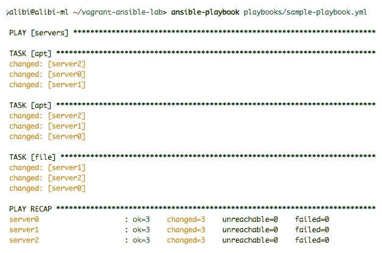
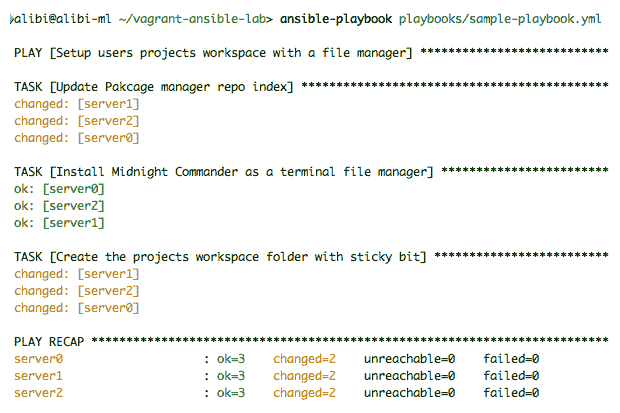

# Ansible 配置管理的编码

学习 Ansible 编码的主要方法是编写自己的 Ansible playbook，无论是为了乐趣还是解决自己的基础设施挑战。然而，在某个时候，事情可能开始变得复杂。您的代码可能有效，但是如何知道它是否真的以正确的方式执行任务？它是否有效？它将有多可扩展？使用有意义的名称使您更容易理解您的代码。还可能出现与脚本组织有关的问题：即使它们彼此无关，也很容易出现一个文件夹中充满了几个脚本的情况。

在本章中，我们将讨论编写 Ansible playbook 的标准和最佳实践。我们的目标是通过加快任务、提高安全性、为内置基础设施冗余系统提供住宿、优化任务以及减少代码重复来改进我们的 playbook，以生成具有相同功能的更小的 playbook。最后，我们将介绍 Ansible 角色，这是 Ansible 中的终极任务优化工具。

本章将涵盖以下主题：

+   编写 Ansible playbook 的标准

+   编写 YAML playbook 的最佳实践

+   优化 Ansible 任务和 playbook

+   Ansible 角色

+   使用 Ansible 角色的示例

# Ansible 配置管理编码标准

在本节中，我们将列出几条规则和方法，以帮助编写符合 Ansible 规范的漂亮和干净的 playbook。这不是严格的指令，而是 Ansible 开发人员和维护人员认为应该使用的表示。遵循这些规范不仅可以更轻松地使用 playbook，还可以帮助使其标准化，并且可以被社区成员理解，从而实现更好的团队协作。

这些标准基于 Ansible 用户和维护者的经验。任何个人用户可能以需要不同的规则使用 Ansible。

# Playbook 和任务命名

制作 playbook 时，使用`name:`字段是可选的。如果您编写一个没有名称的 playbook，它将完全正常工作。以下是一个没有名称的 playbook 的示例：

```
---
- hosts: servers
  become: yes
  gather_facts: false
  tasks:
    - apt: update_cache=yes
    - apt:
       name: mc
    - file:
       path: /usr/local/projects
       mode: 1777
       state: directory
```

这个 playbook 可能有以下输出：



playbook 已经按我们的要求执行了，但是如果我们在一个 playbook 中有很多任务，它没有名称可能会带来问题，因为我们将无法轻松监视每个作业的状态。遵循 Ansible 的标准，编写一个对其每个任务有更好描述的 playbook 可以帮助很多。具有清晰任务描述的好处有助于个人或团队任务监控，为同事和社区用户提供更好的管道解释。一个更具描述性的 playbook 示例可能如下所示：

```
---
- name: Setup users projects workspace with a file manager
  hosts: servers
  become: yes
  gather_facts: false
  tasks:
    - name: Update Package manager repo index
      apt: update_cache=yes
    - name: Install Midnight commander as a terminal file manager
      apt:
       name: mc
    - name: Create the projects workspace folder with sticky bit
      file:
       path: /usr/local/projects
       mode: 1777
       state: directory
```

这样，我们可以得到更具描述性的输出：



由您决定要编写什么以及任务的哪些方面被描述，只要对用户（包括您自己、您的团队或社区）有意义。我们建议使用简单的措辞来简要解释任务。

# 用于 playbook 的 YAML 语法使用

由于 playbook 是用 YAML 编写的，因此在引入任务参数时，您对代码的外观有一些余地。同样，尽管 Ansible 将接受代码并执行任务，但很容易出现代码行过长的情况，即使是一个平均复杂的任务。这是一个单行 Ansible 任务的样子：

```
- name: Copy user configuration
copy: src=/home/admin/setup.conf dest=/usr/local/projects/ owner=setup group=dev mode=0677 backup=yes
```

与此相反，我们可以遵循一个整洁和更有组织的 YAML 结构，通过在每个任务参数前添加空格。Playbook 应该如下所示：

```
 - name: Copy user configuration
copy: 
src: /home/admin/setup.conf
dest: /usr/local/projects/
owner: setup
group: dev
mode: 0677
backup: yes
```

然而，一些任务或命令可能有很长的字符串，无论是文件的绝对路径还是用于任务的长文本。Ansible 确实提供了一种使用`>`字符来组织具有长字符串的任务的方法，以便将单行字符串写成多行而不带回车。

```
   - name: Fill in sample text file
     lineinfile:
       path: /usr/local/projects/setup.conf
       line: >
            This is the configuration file for the user
            Setup. Please do not edit make any change 
            to it if you are not and administrator.
```

Ansible 提供了一个选项来检查 playbook 的语法，以查看它是否符合 YAML 语法。要使用这个选项，将`--syntax-check`选项添加到 Ansible 命令中。

# become 功能

许多任务需要由特定用户执行，无论是访问受限资源还是启用特定用户服务。虽然有一些 Shell 或 Powershell 命令可以实现这一点，但它们可能会产生非常长和复杂的命令。Ansible 的`become`或`become_user`功能允许更容易为每个特定用户定制的任务。这个功能被认为是 Ansible 配置管理编码的标准，因为它提供了简化复杂命令的任务优化水平，使这个功能不仅仅是 playbook 个性化，还是任务特定的。以下是使用此功能的 playbook 示例：

```
---
- name: Organize users projects folders
  hosts: servers
  become: yes
  remote_user: setup
  gather_facts: false
  tasks:
    - name: create folder for user1
      command: mkdir /usr/local/projects/user1
       become_user: user1

   - name: Create test space for setup
      file:
       path: /usr/local/projects/setup/test
       mode: 1777
       state: directory
---
```

# 组织

主机组织使得可以根据角色、地理位置或数据中心位置将主机组织成组。在父子结构中，可以设置父组变量并使子组继承它们。要覆盖父组变量，个别主机或子组可以有自己的独特自定义变量。这种做法更多的是 Ansible 库存管理功能，而不是 playbook 编码，但对于多架构配置管理非常重要。

如前几章所述，主机变量可以在库存文件或 playbook 本身中定义。但是，当组织在库存文件中作为`group_vars`和`hosts_vars`时，更容易管理。

以下是一个库存文件的示例，展示了如何定义父组和子组变量：

```
/etc/ansible/hosts:
[linuxservers:children]
webservers
loadbalancers

[linuxservers:vars]
remote_user: setup
ntpserver: 0.uk.pool.ntp.org
become: yes

[webservers]
node0
node1
node2

[webservers:vars]
remote_user: devadmin
ansible_connection: ssh

[loadbalancers]
node3
node4

[loadbalancers:vars]
ntpserver: 0.us.pool.ntp.org
ansible_connection: docker
```

这不是唯一可以用来定义组的结构。库存文件只能保存组的结构，然后每个组可以有自己的库存文件来保存它们的变量。相同的规则适用于子变量覆盖父变量。

# 使用处理程序

Ansible 建议使用处理程序进行任务流水线处理，因为处理程序是在被通知时执行的编程任务。处理程序将为报告更改状态的任务触发。它们通常用于在配置更改后进行服务管理。这确保了流畅的配置管理，因为每当主机发生变化时，涉及的服务都应该重新启动以应用更改。

Ansible 还具有一项功能，可以在 playbook 中启用处理程序的大规模刷新。这个功能允许您通过控制任务中所有处理程序的执行来控制何时可以应用更改。使用`meta`，任务处理程序可以从 playbook 中的任何位置刷新：

```
---
- name: Change service settings and apply it
  hosts: servers
  become: yes
  remote_user: setup
  gather_facts: false
  tasks:
    - name: Flush the playbook handlers
      meta: flush_handlers

    - name: Change ntp service config
      lineinfile:
       path: /etc/ntp.conf
       line: "server 0.us.pool.ntp.org"

    - name: Flush the playbook handlers
      meta: flush_handlers

  handlers:
    - name: restart ntp service
      service:
       name: ntp
       state: restarted
```

# playbook 中的密码使用

许多任务需要您输入密码来访问数据库或使用 CLI 或访问第三方终端。在 playbook 上公开写入密码或其他敏感信息是不可取的。有多种方法可以保护这些信息。最常见的两个例子是将它们存储在另一个受保护的 playbook 中，或者使用 Ansible Vault。

在本节中，我们将主要介绍将密码和敏感变量存储在其他更受保护的文件中。Ansible Vault 将在后面的章节中进行全面介绍。

这个想法是创建一个包含多个敏感变量的 playbook，并将其存储在受限制的权限下的安全位置。然后，playbook 在 play 级别（任务所在的位置）使用`include`选项调用其变量：

```
---
- name: usage of sensative variable
  hosts: servers
  include: passwords_playbook.yml
  tasks:
    - name: add a MySQL user
      mysql_user:
        name: user1
        password: {{ mysql_user1_password }}
        priv: '*.*:ALL'
        state: present 
```

```

This method is very easy to use and manage, but it is not the best in terms of security. Ansible Vault will provide better protection for sensitive information in playbooks.

Ansible Vault is not the only tool that allows you to secure variables in Ansible. There are other third-party tools that allow you to secure passwords and critical information by preventing them from being typed as clear text.

# Playbook version control

It is highly recommended to use a version control service, such as GitHub, SubVersion, or Mercurial, to manage your Ansible playbooks. Besides the countless benefits of using version control for any coding, Ansible playbooks can use GitHub projects as an input to enable frameworks that allow continuous deployment and integration. By updating your code in the repository, it gets updated on all the systems it is used in.

# Making Ansible roles where possible

The best way to optimize a task is to make it an Ansible role, or preferably multiple roles if it has multiple goals. A task that has been transformed into a role is ready to be used with multiple situations, and it can be shared to be used by other users. Roles can be included in multiple playbooks to avoid writing the same lines of code twice or more. Ansible has a role-sharing platform called Galaxy, where the community shares their roles with other users. We will cover this in more detail in the next chapter.

# Ansible coding best practices

After exploring the standards that should be followed by Ansible developers, let's now have a look at what Ansible daily users recommend as best practice for good configuration management using Ansible.

These methods may suit some setups more than others. Not every method is a good option for your environment; they may cause more trouble than benefits if they are applied inappropriately. We have collected the methods that we believe are common and useful most of the time.

# Using comments in playbooks

Earlier in this chapter, we discussed naming plays or tasks in the playbook to provide a better description for the reader. However, when performing unusual tasks or running commands that form part of a bigger picture, having a descriptive name is not always enough information.

You can use comments either at the start of each playbook, explaining its overall role, or in the pipelines included within the playbook. You can also offer some information about the author, including contact details when the playbook gets shared within the community. Having comments in the code you write is a good idea for any coding you do, especially if you are planning to share it. It makes any script user-friendly. Even though YAML is an easy coding language, it is not always obvious when reading the work of others. This example playbook shows a way to get more detailed information about a playbook:

```

---

####################################

#

# 这个 playbook 的目标是在管道中实现多个任务

# 配置多个 Linux 主机进行协作项目。它首先

# 设置所需的工具和服务，然后将它们配置为

# 标准，然后准备共享空间，并分配用户和组。

#

# 作者: ***** ***** 电子邮件: *********@****

#

####################################

- 名称: 主机配置 playbook

主机: linuxservers

成为: 是的

remote_user: setup

gather_facts: false

任务:

- 名称: 安装午夜指挥官

# 这是一个基于终端的文件管理器，不需要 GUI 界面

apt:

名称: mc

…

```

# Playbook files and folder naming

This is a best practice that should be followed in life, not just for scripting and playbooks! Whenever you create a file in your computer, on the cloud, or within an application, always make sure to give it a name that reveals what it is. You can also organize your files into subfolders with descriptive names. Although it might take longer for a user to navigate through the folders to get to the playbook, everything will be well explained and clear.

# Avoiding the use of command modules

Ansible offers a few modules that allow you to run commands to be executed as they are in the remote hosts. This is handy when the Ansible modules do not cover the task that is intended to be performed, which is especially the case when there are complex tasks.

The issue with command modules is that they do not know whether the task has been properly executed since they can execute any command running any tool, service, and system. The return values for a command can easily be misunderstood and sometimes do not reflect what really happened after the command execution. It is recommended that you use the `changed_when` option in the task in the playbook, so it looks as follows:

```

- 名称: 执行 Windows 写过滤器启用命令并确定是否进行了更改

win_shell: ewfm.exe -conf enable

register: output

changed_when: "output.stdout == '等待下次启动应用更改。'"

```

There are multiple methods for collecting command changes; this is one of the ones that was most recommended in the community. File and service status modules can be used to check changes in the data via tasks or handlers, but these may cause extra tasks to be sent to the remote hosts.

# Avoiding ignoring module errors

Ansible offers the option of ignoring some task errors when they are reported. This is because Ansible by default halts a playbook if one of its tasks has failed. Sometimes, if a task is used to execute an optional job or to test a particular aspect of the system, the task isn't important enough to cause the entire playbook to halt. We tend to add the `ignore_errors: yes` option at the end of these tasks, but this is a very bad habit that may cause damage to your hosts, especially in pipelined tasks.

The best way to deal with optional tasks or those that return an error even when they have executed what is needed is to use the `failed_when` and `changed_when` options to define when a task has failed or performed its job.

# Using Ansible conditions

We can use the information collected by Ansible about the hosts it manages to personalize tasks to a specific system using Ansible conditions. Not all modules work with every OS. To make a playbook universal, we can add in some settings where some tasks test the facts of the remote host before executing the task. This also helps with reducing the number of playbook scripts by creating scripts that adapt themselves to the system that they are being executed on. As an example, let's try to install the same package with two different names in Debian and Red Hat Linux OS:

```

---- 名称: 在 Linux 主机上安装 python 开发包

主机: linuxservers

成为: 是的

remote_user: setup

gather_facts: true

任务:

- 名称: 在 Debian 系统上安装 python 开发

apt:

名称: python-dev

当: ansible_os_family == "Debian"

- 名称: 在 Red Hat 系统上安装 python 开发

yum:

名称: python-devel

当: ansible_os_family == "RedHat"

```

# Using Ansible loops

Ansible loops offer several possibilities. One of the most common uses is to reduce the amount of code when running the same module multiple times on different inputs. The idea is to define a variable or an object variable that has its own variables, then populate the list with the different entries.

The following playbook shows a good use of Ansible loops to copy several configuration files with different sources, destinations, and ACL settings:

```

---

- 名称: 将用户配置文件复制到其项目目录

主机: linuxservers

成为: 是的

remote_user: setup

gather_facts: true

任务:

- 名称: 复制用户配置文件

复制:

src: '{{ item.src }}'

dest: '{{ item.dest }}'

模式: '{{ item.mode | default("0744") }}'

owner: '{{ item.owner | default("nobody") }}'

when_items:

- { src: "/media/share/config/user1.conf",

dest: "/usr/local/projetsfolder/user1",

模式: "0774", owner: "user1" }}

- { src: "/media/share/config/user2.conf",

dest: "/usr/local/projetsfolder/user2",

模式: "0700", owner: "user2" }}

- { src: "/media/share/samples/users.conf",

dest: "/usr/local/projetsfolder/", mode: "0777" }}

```

The default option takes cares of empty entries by replacing them with what has been entered as the default value.

# Using template files

It is recommended that you use modules that edit configuration files, such as `lineinfile` or `blockinfile`. These can help significantly with setting up standard configurations or updating old settings. However, when these files are automated, they cannot handle the small changes that can be identified easily when modifying manually, leading to unpredictable changes. There is no simple way of telling whether a configuration change will go as expected, especially for a large infrastructure. For this reason, it is recommended to use template files to act as base configuration files, scripts, or web pages. Still, we can use `lineinfile` or `blockinfile` as a backup plan. In these, the user knows exactly what to set up, what to edit, and what to leave for each host. This method helps to control the unpredictability of tasks.

Using the `template` module, we can generate configuration files that are specific to the hosts from a `Jinja` file. The example `.j2` template file gets filled in with predefined variables, as follows:

```

db.conf.j2:

mysql_db_hosts = '{{ db_serv_hostname }}'

mysql_db_name = '{{ db_name }}'

mysql_db_user = '{{ db_username }}'

mysql_db_pass = '{{ db_password }}'

```

These variables can then be defined in the same playbook or another YAML file, included at the play level:

```

---

- 名称: 复制数据库配置文件

主机: linux    servers

成为: 是的

remote_user: setup

gather_facts: true

任务:

- 名称: 从另一个 YAML 导入变量

include_vars: /home/admin/variables/database2.yml

- 名称: 复制 db 配置文件

模板:

src: /home/admin/template/db.conf.j2

dest: /etc/mysql/db.conf

owner: bin

组: wheel

模式: 0600

```

The `Jinja2` files offer a level of control over the variable structure. You can introduce loops and conditional statements with some predefined functions to alter the input to match the structure of the configuration file input.

# Stating task status

When creating files, setting up configuration, or managing services, an Ansible user should always state the status of the object of the task, even when the change is aimed at its default value. Even though this will add an extra line to most of your tasks, it is a good habit to have. It is one of those practices that some people think is useless, but for debugging purposes, or for anyone reading your script, seeing the status of each task provides a better view of what each task has done. Naming the task indicates what you want it to do, but it does not necessarily mean that the task has done that action. Using the `state` option, however, gives a much clearer indication in this respect:

```

任务:

- 名称: 创建一个新文件

文件:

路径: /usr/local/projects/vars.txt

状态: 现有

- 名称: 从文件中删除行

lineinfile:

路径: /usr/local/projects/conf.txt

行: "adminuser = user0"

状态: 不存在

```

# Shared storage space for data tasks

The Ansible management server is doing a lot more in the background than simply sending tasks and managing remote machines. Adding the extra task of managing file transfers and running them on its interface may cause a considerable performance degradation. We always recommend using shared storage space either on an FTP server, an NFS or Samba filesystem, or on a web server to be downloaded by the remote hosts. This practice ensures that the remote hosts carry out the transfer with another dedicated and optimized server.

It is always a good practice to have all tools archived and their sample configuration files stored in a network file system. Remote hosts can easily access the drives either temporarily for a data transfer or permanently if they are in constant need.

The following playbook task shows an example of the code for this use:

```

任务:

- 名称: 将工具存档复制到远程主机

复制:

src: /media/nfshsare/Tools/tool1.tar.gz

dest: /usr/local/tools/

模式: 0755

```

# Ansible roles

This is the section in which we discover Ansible roles and what we can do with them to optimize our automation scripting.

# What are Ansible roles?

The ultimate configuration management scripts optimization is to convert simple playbooks into Ansible roles. This gives you the ability to make a set of configuration management tasks modular and reusable, with multiple configurations. It also means that they can be easily shared when required. Ansible roles allow several related tasks, with their variables and dependencies, to be contained in a portable framework. This framework represents the breakdown of a complex playbook into multiple simple files.

An Ansible role is composed of multiple folders, each of which contain several YAML files. By default, they have a `main.yml` file, but they can have more than one when needed. This is a standardized structure for all Ansible roles, which allows Ansible playbooks to automatically load predefined variables, tasks, handlers, templates, and default values located in separate YAML files. Each Ansible role should contain at least one of the following directories, if not all of them.

# The tasks folder

This is the controller folder. It contains the main YAML files. The code within those files executes the main role tasks by calling all the other defined elements of the role. Usually, it has the `main.yml` file with some YAML files that are OS-specific that ensure certain tasks are executed when the role is run on specific systems. It may also contain other tasks to set up, configure, or ensure the existence of certain tools, services, configuration folders, or packages that failed a test run by the main script and triggered the execution of a task to fix them. The following is a sample task code written on the `main.yml` file in the `tasks` folder:

```

任务/main.yml:

---

- 名称: 检查 NTP 是否已安装

stat:

路径: /etc/init.d/ntpd

register: tool_status

- 包括任务: debian.yml

当: tool_status.stat.exists

- 名称: 将 NTP 配置复制到远程主机

模板:

src: /template/ntp.conf.j2

dest: /etc/ntpd/ntpd.conf

模式: 0400

通知:

- 重新启动 ntp

tasks/debian.yml:

---

- 名称: 将 NTP 配置复制到远程主机

apt:

名称: ntp

状态: 最新

```

# The handlers folder

This folder usually contains the main file with multiple handler tasks that are waiting to be triggered by other tasks, either with the role or from other playbooks or roles. It is mainly used for service management to apply a configuration change performed by another task. Here is an example of a handler script:

```

handlers/main.yml:

---

- 名称: 重新启动 ntp

服务:

名称: ntp

状态: 重新启动

```

# The vars folder

This is where the role variables get stored. Usually, it is used for a permanent variable that does not require any changes between environments. Here is an example of a variables file:

```

vars/main.yml:

---

ntpserv1: 0.uk.pool.ntp.org

ntpserv2: 1.uk.pool.ntp.org

```

# The templates folder

This folder contains the template files used by the role to create the actual configuration files. These are then deployed by the role to the remote hosts. They are `Jinja2` template engine scripts that enable loops and other features. Here is an example of a template file:

```

template/ntp.conf.j2:

driftfile /var/lib/ntp/ntp.drift

filegen loopstats file loopstats type day enable

filegen peerstats file peerstats type day enable

filegen clockstats file clockstats type day enable

循环{{ ntpserv1 }}

循环{{ ntpserv2 }}

池 ntp.ubuntu.com

限制-4 默认 kod notrap nomodify nopeer noquery limited

限制-6 默认 kod notrap nomodify nopeer noquery limited

限制 127.0.0.1

限制::1

限制源 notrap nomodify noquery

```

# The defaults folder

This folder contains the default values for the non-defined variables in the role when they are used. It is a way of organizing variable inputs in the role and is one of the highly recommended options when writing a playbook. It allows for a centralized management of the default values of the variable of the role. Default values are always vulnerable because they change a lot depending on the needs and policies of the user. Having this solution allows one file to change all the values. Here is an example of a `defaults` folder:

```

```
defaults/main.yml:
---
timout: 2000
ID_key: "None"
```

```

# The files folder

This folder holds all extra files that are required to achieve the role task. These files usually get dispatched to remote hosts as part of certain tasks. They are usually static, and they do not contain any variables to change, be copied, extracted, or compressed to the remote host.

# The meta folder

This folder contains machine-readable information about the role. These folders contain the role metadata, which includes information about authors, licenses, compatibilities, and dependencies. The main use for this option is to declare dependencies, more specifically, roles. If the current role relies on another role, that gets declared in a `meta` folder. The following example shows how `meta` folders are used:

```

```
meta/main.yml:
---
galaxy_info:
  author: medalibi
  description: NTP client installn
  company: Packt
  license: license (GPLv3, BSD)
  min_ansible_version: 2.4
  platforms:
    - name: Ubuntu
      version:
        - 16.04
        - 18.04
  galaxy_tags:
    - networking
    - system

dependencies: []
```

```

# The test folder

This folder contains a test environment with an inventory file and a playbook script to test the role. It is usually used by the developers to test any new changes that have happened to the role. It also serves as a sample configuration for new users to follow the running of the role. The playbook script within the `test` folder looks as follows:

```

```
tests/test.yml:
---
- hosts: servers
  remote_user: setup
  become: yes
  roles:
    - ntpclient.lab.edu
```

```

# The README folder/file

This is a folder that can be replaced by a simple markdown `README.md` file. It is an optional feature but it is highly recommended when you are planning to share your roles. It acts as a documentation for the role: it can contain anything that might be useful for first-time users of the role from a simple description of the task delivered by the role, to instructions and requirements to set up this role on their environment. It might also contain some best practices and information about the author and contributors if it is built by a team.

Ansible roles are used for replacing the same function that the option `include` carry out when adding extra parameters and functions to a playbook. Roles are much more organized and allow easier sharing, either on a personal GitHub project or on the Ansible Galaxy. This will be our subject for the next chapter.Make sure to use descriptive names for your roles. Like playbooks, this helps the users of your role to have an idea of what your role should do. Your description should be brief, usually just one or two words. You can always add more detail and description in the `README` file.

Roles tend to be very specific: they do one job and one job only. It is not advisable to have tasks within a role that have nothing to do with the job. Let's create some example Ansible roles that deliver a few jobs to use as template roles that follow all best practices.

# Creating Ansible roles

Let's now create an Ansible role from scratch. This role is a Samba file server setup on either of the big families of Linux. It serves a folder that is accessible via a shared user.

First, let's create our role folder using the `ansible-galaxy` command line. Before running the command, we need to change the Terminal workspace to the location in which we would like to store our Ansible roles:

```

cd ~/Roles/

ansible-galaxy init samba.lab.edu

```

We should see the following output:

```

- 成功创建 samba.lab.edu

```

We then create a folder with the name of the role, with the following structure of subfolders and files:

```

samba.lab.edu

└── README.md

├── 默认值

│ └── main.yml

├── 文件

│

├── 处理程序

│ └── main.yml

├── 元

│ └── main.yml

├── 任务

│ └── main.yml

├── 模板

│

├── 测试

│ ├── 库存

│ └── test.yml

└── 变量

└── main.yml

```

Let's now populate our folder and files with the appropriate code for the role. First, we are going to populate the dependencies and requirements for the role to work. For this, we will be working on the `meta`, `template`, `files`, `vars`, and `defaults` folders, and the OS-specific scripts in the `tasks` folder.

We will start by populating the `template` folder with a `Jinga2` template file for the configuration of the SMB service:

```

template/smb.conf.j2:

#========= 全局设置 =========

# Samba 服务器配置:

[全局]

工作组 = {{ wrk_grp | upper }} ## upper convert any input to uppercase.

服务器字符串 = Samba 服务器%v

netbios 名称 = {{ os_name }}

安全 = 用户

映射到访客=坏用户

dns 代理 = 否

#=========共享定义=========

# Samba 共享文件夹:

[{{ smb_share_name }}]

路径 = {{ smb_share_path }}

有效用户 = @{{ smb_grp }}

访客 ok = 否

只读 = 否

可浏览 = 是

可写 = 是

强制用户 = 无

创建掩码 = {{ add_mod }}

目录掩码 = {{ dir_mod }}

```

We are then going to put a text file in the `files` folder that contains the rules and policies of using the shared folder:

```

文件/Fileserver_rules.txt:

此共享驱动器供指定团队使用。

任何分散的使用都将导致事件的后续跟进。

请不要更改任何团队成员的文件夹或删除任何未分配给您管理的内容。

如有任何疑问，请联系 admin@edu.lab

```

After that, we edit the main file in the `meta` folder with some role information: author, description, support, and tags. This will look as follows:

```

meta/main.yml

---

依赖关系: []

galaxy_info:

作者: medalibi

描述: "Linux OS（Debian/Red Hat）上的 Samba 服务器设置和配置"

许可证: "许可证（GPLv3，BSD）"

min_ansible_version: 2.5

平台:

- 名称: Debian

版本:

- 8

- 9

- 名称: Ubuntu

版本:

- 14.04

- 16.04

- 18.04

- 名称: EL

版本:

- 6

- 7

galaxy_tags:

- 系统

- 网络

- 文件服务器

- 窗户

```

Once this is done, we move on to defining the role variables. For this role, we are going to have all the variables stored in one file, including the OS-specific variable:

```

vars/main.yml

---

debian_smb_pkgs:

- samba

- samba-client

- samba-common

- python-glade2

- system-config-samba

redhat_smb_pkgs:

- 桑巴

- samba-client

- samba-common

- cifs-utils

smb_selinux_pkg:

- libsemanage-python

smb_selinux_bln:

- samba_enable_home_dirs

- samba_export_all_rw

samba_config_path: /etc/samba/smb.conf

debian_smb_services:

- smbd

- nmbd

redhat_smb_services:

- smb

- nmb

```

To set our default values, we fill in the `defaults` main folder with the following file:

```

defaults/main.yml:

---

wrk_grp: 工作组

os_name: debian

smb_share_name: 共享工作空间

smb_share_path: /usr/local/share

add_mod: 0700

dir_mod: 0700

smb_grp: smbgrp

smb_user: 'shareduser1'

smb_pass: '5h@redP@55w0rd'

```

We now create the OS-specific tasks for setting up the service:

```

tasks/Debian_OS.yml:

---

- 名称: 在 Debian 家族 Linux 上安装 Samba 软件包

apt:

名称: "{{ item }}"

状态: 最新

update_cache: 是

with_items: "{{ debian_smb_pkgs }}"

tasks/RedHat_OS.yml:

---

- 名称: 在 Red Hat 家族 Linux 上安装 Samba 软件包

yum:

名称: "{{ item }}"

状态: 最新

update_cache: 是

with_items: "{{ redhat_smb_pkgs }}"

- 名称: 为 Red Hat 安装 SELinux 软件包

yum:

名称: "{{ item }}"

状态: 现有

with_items: "{{ smb_selinux_pkg }}"

- 名称: 配置 Red Hat SELinux 布尔值

seboolean:

名称: "{{ item }}"

状态: 真

persistent: true

with_items: "{{ smb_selinux_bln }}"

```

Let's now finish by adding the main task and the handlers for it:

```

tasks/main.yml:

---

- 名称: 根据主机操作系统设置 Samba

include_tasks: "{{ ansible_os_family }}_OS.yml"

- 名称: 创建 Samba 共享访问组

组:

名称: "{{ smb_grp }}"

状态: 现有

- 名称: 创建 Samba 访问用户

用户:

名称: "{{ smb_user }}"

组: "{{ smb_grp }}"

追加: 是

- 名称: 在 Samba 中定义用户密码

shell: "(echo {{ smb_pass }}; echo {{ smb_pass }}) |

smbpasswd -s -a {{ smb_user }}"

- 名称: 检查共享目录是否存在

stat:

路径: "{{ smb_share_path }}"

register: share_dir

- 名称: 确保共享目录存在

文件:

状态: 目录

路径: "{{ smb_share_path }}"

所有者: "{{ smb_user }}"

组: "{{ smb_grp }}"

模式: '0777'

递归: 是

当: share_dir.stat.exists == False

- 名称: 部署 Samba 配置文件

模板:

dest: "{{ samba_config_path }}"

src: smb.conf.j2

validate: 'testparm -s %s'

备份: 是

通知:

- 重新启动 Samba

- 名称: 在 Debian 家族上启用和启动 Samba 服务

服务:

名称: "{{ item }}"

状态: 已启动

已启用: 是

with_items: "{{ debian_smb_services }}"

当: ansible_os_family == 'Debian'

- 名称: 在 RedHat 家族上启用和启动 Samba 服务

服务:

名称: "{{ item }}"

状态: 已启动

已启用: 是

with_items: "{{ redhat_smb_services }}"

when: ansible_os_family == 'RedHat'

```

We finish by defining the handlers for service management:

```

/handlers/main.yml:

---

- 名称: 重新启动 Samba

服务:

名称: "{{ item }}"

状态: 重新启动

with_items: "{{ debian_smb_services }}"

当: ansible_os_family == 'Debian'

- 重新启动 Samba

服务:

名称: "{{ item }}"

状态: 重新启动

with_items: "{{ redhat_smb_services }}"  when: ansible_os_family == 'RedHat'

```

# Using Ansible roles

For this section, we are going to use the `test` folder to test the new role. First, we need to set up the inventory to match our test environment:

```

tests/inventory：

[linuxserver]

节点 0

节点 1

节点 2

```

Then, we edit the `test.yml` file for the test:

```

tests/test,yml：

- 主机：linuxserver

远程用户：设置

变得：是

角色:

- samba.lab.edu

```

When executing the `test.yml` playbook, we need to add to the `ansible-playbook` command line the `-i` option and specify the `tests/inventory` inventory file we filled earlier. The command line should look like the following:

```

ansible-playbook tests/test.yml -i tests/inventory

```

`README.md`文件可以包含有关角色变量的一些信息，以帮助用户将其个性化到自己的设置中。在构建大量角色时，测试它们的最佳方法是使用具有不同基本系统的容器。

# 摘要

在本章中，我们列出了在使用 Ansible 和其他自动化工具时优化配置管理编码的几种方便的技术。我们介绍了 Ansible 角色，包括如何制作它们以及如何使用它们。在第七章 *Ansible Galaxy 和社区角色*中，我们将探讨 Ansible Galaxy 上的社区角色。我们将下载并使用评分最高的角色，并展示如何在 Ansible Galaxy 上添加一个角色。

# 参考资料

Ansible 文档：[`docs.ansible.com/ansible/latest`](https://docs.ansible.com/ansible/latest)
