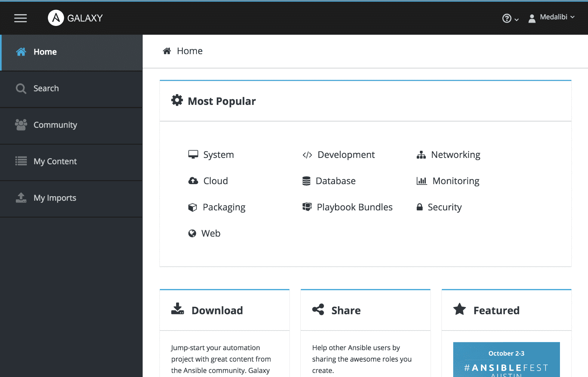
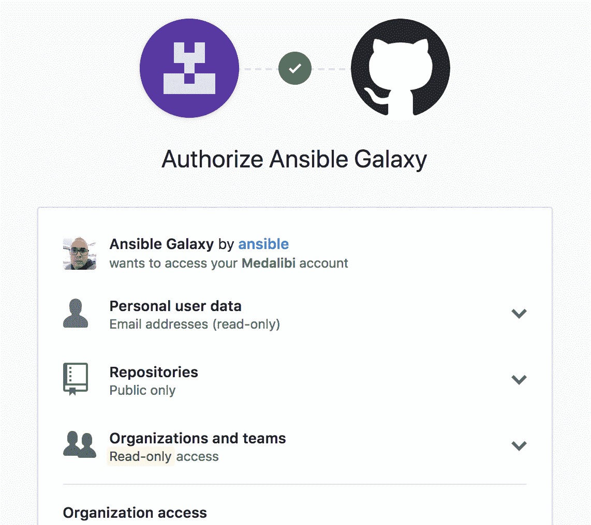
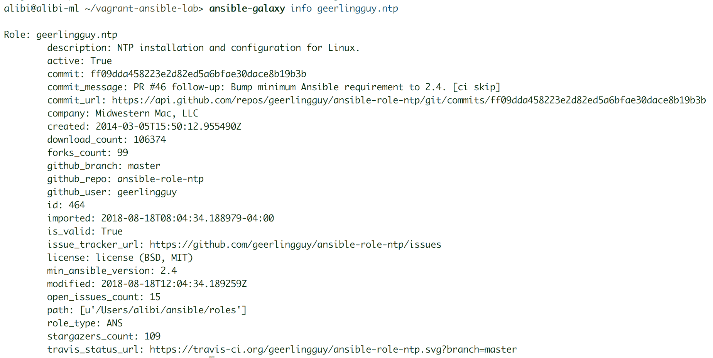
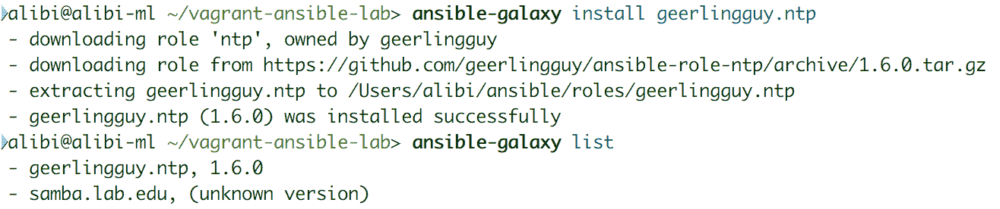
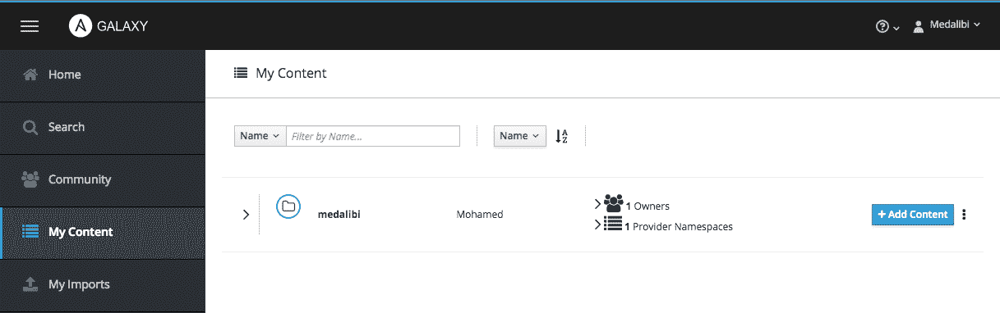
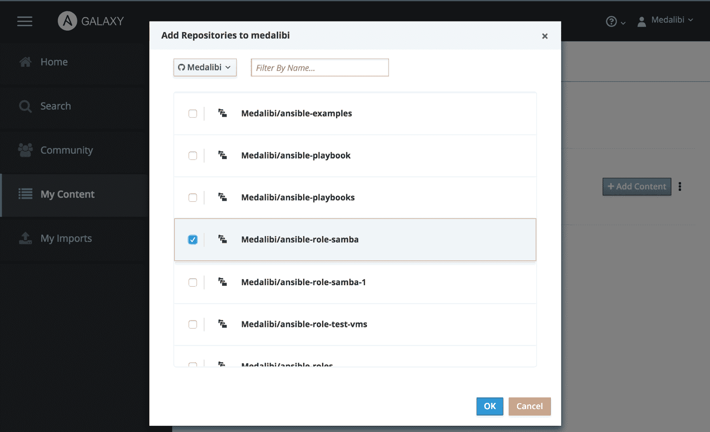
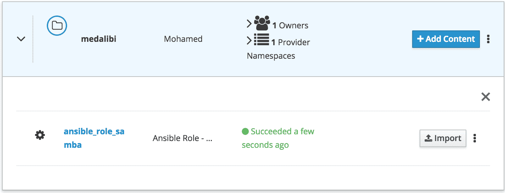

# 第七章：Ansible Galaxy 和社区角色

在上一章中，我们向您展示了如何根据 Ansible 规范和最佳实践创建自己的角色。无需重复造轮子；相反，我们可以寻找已经创建的内容并使用它或修改它以满足我们的需求。本章将简要介绍 Ansible Galaxy 的命令和存储库。我们将学习如何将我们创建的角色上传到存储库，搜索流行的社区角色进行下载、设置和使用，并进行故障排除。

本章涵盖以下主题：

+   Ansible Galaxy 介绍

+   将角色上传到 Ansible Galaxy

+   搜索社区角色的最佳实践

+   设置和使用社区角色

+   故障排除角色

# Ansible Galaxy

Ansible Galaxy 是 Ansible 为其社区创建的平台。它允许其成员创建和提交自己的角色供其他成员使用、修改、升级、增强和优化。

Ansible Galaxy 旨在让开发人员更轻松地提交角色，并让用户更轻松地导入角色。在控制主机上安装 Ansible 时，添加`ansible-galaxy`命令行。此命令允许通过终端与 Ansible Galaxy 存储库进行交互。

Ansible Galaxy 为 Ansible 带来了巨大的优势，并使其比任何其他自动化工具都增长更快。有经验的用户编写的代码供不太有经验的用户轻松访问和学习，这是无价的。这些资源由基于 Ansible 的项目和工作流组成。

# Ansible Galaxy hub

Ansible Galaxy hub 是一个托管大量社区角色的 Web 门户。它被分类为几个组，以便更轻松地搜索角色，并提供由 Ansible 用户开发和维护的各种角色。一些角色的编码和维护比其他角色更好。Ansible Galaxy hub 还提供有关如何导入和使用每个角色的有用信息，其中大部分由作者填写。每个角色还应包含指向其 GitHub 项目的源代码链接。此外，信息还应包括每个角色的下载次数、星标、观察者和分支数。界面还提供了所有注册到 hub 的作者列表。

其 Web 界面如下所示：



Ansible Galaxy 使用 GitHub 访问 API，需要您登录其作者或贡献者服务。通过登录，界面会添加一些额外的贡献选项。登录界面如下所示：



Ansible 不需要身份验证即可访问其角色并使用它们。登录仅用于作者和贡献者能够将其代码提交为社区贡献。

Ansible Galaxy 存储库按标签组织，指示每个角色的类别和服务。标签不仅限于主页上的标签。它们可以根据角色进行个性化设置。但是，在角色中包含主页标签之一可以更容易地找到它。

# Ansible Galaxy 命令行

Ansible Galaxy 命令行`ansible-galaxy`是用于在本地初始化角色的工具。

在上一章中，我们使用`init`选项初始化了一个角色，如下所示：

```
ansible-galaxy init lab-edu.samba
```

此命令将创建一个以角色名称命名的文件夹，其中包含必要的基本文件夹和文件。然后需要编辑并填写适当的代码和文件，使角色正常运行。

Ansible Galaxy 命令行管理 Ansible 控制主机中的所有角色。它还允许您在 hub 中浏览角色。此命令行最常用的选项如下。

Ansible Galaxy 命令行允许使用以下命令从本地 Ansible 安装中删除不再需要的一个或多个角色：

```
ansible-galaxy remove lab-edu.ntp
```

它还允许您通过关键字或标签搜索角色，并查看有关它们的有用信息，以便在不使用 Web 界面的情况下，要么再次检查其评级，要么了解更多信息。可以使用以下命令完成：

```
ansible-galaxy search geerlingguy.ntp
ansible-galaxy search --galaxy-tags system
ansible-galaxy info geerlingguy.ntp
```

以下截图显示了角色信息的示例输出：



如果找到所需的角色，可以使用`install`选项进行安装。您可以始终使用`list`选项查看已安装角色的列表。以下命令显示了如何完成此操作：

```
ansible-galaxy install geerlingguy.ntp
ansible-galaxy list
```

以下截图显示了上述命令的示例输出：



我们将在后面的部分讨论此命令的更多功能和选项。

要能够在您的 Ansible 安装中使用尚未上传到 Galaxy hub 的本地创建的角色，只需将其文件夹复制到 Ansible 配置中的指定角色文件夹中。Ansible 目前正在开发一个名为`mazer`的新命令行工具。这是一个用于管理 Ansible 内容的开源项目。它目前是一个实验性工具，不应替代`ansible-galaxy`命令行工具。 

# Galaxy 贡献-角色导入

就 Ansible Galaxy hub 上免费提供给公众的角色数量和质量而言，Ansible 社区的影响力非常明显。来自世界各地的用户为他人的利益贡献他们的代码。这是开源精神，它已经帮助构建了伟大的工具。在前人的步伐中，重要的是贡献我们认为不可用且可能帮助某人应对挑战的每一点代码。

# 提交角色之前要做的事情

要能够上传和贡献到 Ansible Galaxy，您需要拥有一个 GitHub 账户。这是出于两个原因：登录到 Galaxy hub 门户和将角色代码作为项目上传到 Galaxy hub。

首次登录到 Ansible Galaxy hub 时，我们将看到各种项目访问权限配置。这将允许 Galaxy 将项目链接到您的组织。

访问权限配置始终可以从 GitHub 帐户选项界面中稍后更改。

“My Content”菜单将出现在 Galaxy hub 主页上。这可用于列出从您的帐户编写的角色。该菜单允许您添加、删除和编辑版本，以及升级角色。如果角色由多个作者维护，还可以添加贡献者。以下截图显示了 Web 界面的外观：



在本地机器上，建议您使用 Git 工具的某种形式，无论是通常适用于 macOS 和 Windows OS 的漂亮图形界面，还是老式的`git`命令行。我们需要在本地登录到我们的 GitHub 存储库，以便更轻松地上传：

```
git tag 0.1
git push lab-edu.samba
```

您始终可以从 GitHub Web 界面创建一个角色。使用起来可能有点笨拙，但它完全可以胜任。

# 角色存储库

将代码上传到 GitHub 后，我们现在可以将角色导入到 Ansible Galaxy hub。从“我的内容”页面，选择“添加内容”按钮。将显示一个包含与该帐户关联的所有 GitHub 项目的框。我们选择要导入的角色，然后按“确定”。菜单如下所示：



然后，角色将添加到内容列表中，如下截图所示：



这种方法允许您向 GitHub 帐户添加任意数量的角色。这一步是角色的实际导入，Ansible Galaxy 根据`meta`文件夹中的元数据进行了一些静态分析。

添加角色后，我们可以链接从我们的 GitHub 账户导入的组织。这有助于指示合作关系并作为搜索标签。

用户帐户中的每个角色都可以进行管理，以添加作者并赋予他们某些权限，例如管理员权限。这可以在“编辑属性”菜单中更改。通过此菜单添加的任何用户都可以编辑、禁用、启用、删除和更新角色及其内容。

最后，更新 Galaxy 上的角色的最佳方法是为其内容设置版本控制方案。这个过程是通过 GitHub 标签来完成的。每当 Ansible Galaxy 从 GitHub 导入一个角色代码时，它会扫描项目以查找标签，寻找格式化以包含版本语法的标签。

# Ansible Galaxy 角色管理

现在让我们来发现 Ansible Galaxy 库提供了什么。在这一部分中，我们将探讨如何找到一个角色，以及我们应该根据什么基础来使用它，与其他具有相同功能的角色相比。我们还将探讨一些关于如何安装角色以及如何排除安装和导入问题的推荐方法。

# Ansible Galaxy 角色搜索

在这个小节中，我们将讨论如何使用 Galaxy 网页门户来查找 Ansible 角色。为了做到这一点，我们要么使用标签页面，要么使用一般搜索页面。我们建议使用其中一个标签页面来获取分类列表。

一旦我们选择了一个类别，我们就可以查看筛选器，这是一种锁定角色特定方面的方法。类别使用的筛选器可以从下拉菜单中选择。类别可以是一个简单的关键词，例如贡献者或平台，也可以是一个标签。通过选择除关键词或标签之外的类别，我们可以访问第二个下拉菜单，其中包含该类别中所有可用选项，供我们选择。

筛选器可以组合，可以跨类别组合，也可以从同一筛选器类别中选择多个条目。这将进一步缩小返回的结果。您还可以通过从搜索栏下方的筛选器列表中删除它们来删除不再需要的筛选器。筛选器功能可以在门户上的任何类别页面上使用。它也可以在社区页面上使用，该页面上包含所有作者的列表。

找到与我们的搜索匹配的角色列表并不意味着我们已经完成了。然后我们需要选择哪个角色来执行所需的任务。从与我们的搜索匹配的角色列表中，我们可以再次使用其他 Ansible 用户的帮助。Ansible Galaxy 提供了一个由不同变量组成的评级系统。您可以通过查看它有多少星来判断一个角色的质量以及其用户的满意程度。我们还可以查看有多少人正在关注该角色以跟踪正在进行的更改，这是一个很好的维护指标。特定角色被下载的次数也很有用，但您应该将其与给出的星级评分数量进行比较，因为它不显示一个角色是否被同一用户多次下载。

了解角色的作者也很重要。一些 Ansible Galaxy 作者以其高质量的角色和持续的维护而闻名。

# Ansible Galaxy 角色安装

我们可以以多种方式安装 Ansible 角色。最简单的方法是使用带有`install`选项的命令行，如下所示：

```
ansible-galaxy install geerlingguy.ntp
```

或者，我们可以通过选择我们想要的版本和来源来个性化我们的安装命令。可以按照以下步骤进行：

```
ansible-galaxy install geerlingguy.ntp,v1.6.0
ansible-galaxy install git+https://github.com/geerlingguy/ansible-role-ntp.git
```

我们还可以使用 YAML 需求文件一次安装多个角色。命令行如下所示：

```
ansible-galaxy install -r requirements.yml
```

要求文件是一个包含有关如何安装所需不同角色的指令的 YAML 结构化文件。这是一个示例要求文件：

```
# install NTP from Galaxy hub
- src: geerlingguy.ntp

# install Apache from GitHub repo
- src: https://github.com/geerlingguy/ansible-role-apache
  name: apache

# install NFS version 1.2.3 from GitHub
- src: https://github.com/geerlingguy/ansible-role-nfs
  name: nfs4
  version: 1.2.3
```

要求文件可以调用其他要求文件来安装原始要求文件中已经声明的额外角色。如下所示：

```
- include: ~/role_req/haproxy_req.yml
```

安装多个角色的另一种方法是依赖角色的`meta`文件中的依赖项部分。依赖项部分遵循与要求文件相同的规则，用于声明特定角色的来源和版本。

# Ansible Galaxy 角色故障排除

从用户的角度来看，在 Ansible 控制机器中设置角色可能会导致一些问题，这些问题主要与没有权限访问角色或角色发生故障有关。大多数错误的原因是 Ansible 的安装方式。默认的 Ansible 安装将所有配置文件、清单、角色和变量放在一个属于 root 的文件夹（`/etc/ansible`）中。因此，作为普通用户使用可能会导致一些问题。这就是为什么我们总是建议拥有一个用户个性化的 Ansible 配置文件，指向用户可以访问的文件夹。安装角色需要创建多个文件夹和文件；如果这不是在授权位置完成的，安装将失败。

我们还需要仔细检查每个角色的系统要求。它们可能需要特定版本的 Ansible 或特定文件中的特定配置。如果它们的要求之一没有得到满足，角色将无法正常工作。

关于将角色导入 Galaxy 中心，用户通常遇到的主要错误是导入失败，这通常与 playbook 中的错误或`meta`文件夹中保存的有关角色信息有关。Galaxy 中心会提供详细的错误日志，甚至可以显示发生错误的特定文件的确切行。一旦您修复了错误，就可以轻松重新启动导入并继续进行。

# 总结

Ansible Galaxy 中心是加速 Ansible 开发和成功的重要资源。借助这一资源，大多数日常任务已经转换为组织良好且资源优化的角色，可供公众使用。在本章中，我们介绍了 Ansible Galaxy，并介绍了如何在社区中进行协作。然后，我们看了如何搜索、安装和排除角色。

在[第八章]（43750355-ab57-4d16-b464-10d2a47be2ea.xhtml）*Ansible 高级功能*中，我们将简要介绍一些更高级的 Ansible 功能，这些功能对于安全性和更高级用户的需求可能会很方便。

# 参考资料

Ansible Galaxy 文档：[`galaxy.ansible.com/docs/`](https://galaxy.ansible.com/docs/)

Ansible 文档：[`docs.ansible.com/ansible/latest/`](https://docs.ansible.com/ansible/latest/)
