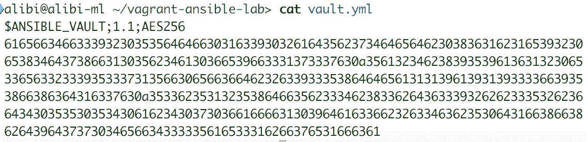
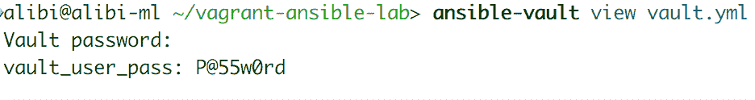

# Ansible 高级功能

在完成本书之前，我们想简要介绍一些 Ansible 更有趣和先进的功能。这些功能可以帮助进一步增强您的自动化。在本章中，我们将介绍三个功能：Ansible Vault，以及它增加 playbooks 和 roles 安全性的能力；Ansible Container，实现与 Ansible 的完全容器自动化；以及 Ansible 插件，具有丰富和灵活的功能集。

本章涵盖以下主题：

+   Ansible Vault 概述

+   如何配置和使用 Ansible Vault

+   Ansible Container 的好处

+   使用 Ansible Container

+   Ansible 插件及其功能概述

# Ansible Vault

在本节中，我们将介绍与 Ansible Vault 相关的功能、用例和最佳实践。

# 什么是 Ansible Vault？

Ansible Vault 是 Ansible 提供的工具，允许用户加密秘密变量，这些变量可以是认证凭据和密钥，也可以是敏感和个人用户信息。Ansible Vault 创建加密文件来存储变量，如果需要，可以将其移动到安全位置。

Ansible Vault 透明地集成到 Ansible roles 和 playbooks 的脚本中。这意味着 Vault 可以加密位于这些脚本中的任何数据结构。这包括主机和组变量，无论是存储在脚本中还是使用 `include_vars` 选项从另一个位置导入的变量。处理 Ansible role 时，它们也可以位于 `defaults` 或 `vars` 文件夹中。当需要隐藏特定变量的名称时，Vault 也可以加密任务文件。

Ansible Vault 还可以扩展到加密常规文件，如二进制文件、存档文件或文本文件。此功能与文件管理模块（如 `copy`、`unarchive` 和 `script`）一起使用。

# 使用 Ansible Vault

为了能够探索 Ansible Vault 的功能，我们需要确保至少创建了一个加密文件来存储我们的变量。为此，我们需要使用 `ansible-vault` 工具，如下所示：

```
ansible-vault create /home/admin/Vault/vault.yml
```

将出现密码输入提示，询问新创建的 Vault 文件的密码。输入密码并确认后，将在指定位置创建一个新的 Vault 文件。默认文本编辑器将打开，以便我们填写 vault 文件。

Ansible Vault 将查找 `EDITOR` 环境变量，以检查打开 vault 文件时要使用的系统默认文本编辑器。要使用特定的文本编辑器，我们需要临时更改变量，如下所示：`export EDITOR=nano; ansible-vault create /home/admin/Vault/vault.yml`。

写入 vault 文件的任何数据在文件关闭时都将被加密。我们可以尝试使用 `cat` 命令行工具绘制文本文件的内容，如下所示：

```
cat /home/admin/Vault/vault.yml
```

工具的输出如下所示：



Vault 文件只能使用 `ansible-vault` 命令行工具正确修改。为此，我们需要使用 `edit` 选项，如下所示：

```
ansible-vault edit /home/admin/Vault/vault.yml
```

输入文件创建时选择的 Vault 文件密码后，将默认文本编辑器打开文件并以明文显示其内容，以便更容易编辑。我们还可以使用 `view` 选项以只读模式打开 vault 文件。

```
 ansible-vault view /home/admin/Vault/vault.yml
```

运行 `ansible-vault` 命令行工具时，使用任何选项都需要输入要执行操作的 vault 文件的密码。可以使用 `rekey` 选项编辑 vault 文件密码：`ansible-vault rekey /home/admin/Vault/vault.yml`。我们需要输入原始密码，然后输入新密码并确认。

正如我们之前提到的，当与文件模块一起使用时，Ansible Vault 可以加密和解密文件。这个功能可以用来手动加密文件，并将它们转换成 vault 文件。以后需要时，始终可以手动解密它们。要执行文件加密，我们需要使用`ansible-vault`命令行工具的`encrypt`选项。

```
ansible-vault encrypt /home/admin/variables.yml
```

这个命令行将需要一个密码和确认来加密和保护新转换的 vault 文件。这个文件可以直接在下一小节中的任何 playbook 中使用。

要将 vault 文件转换为普通文本文件，我们使用相同的命令行工具，只是使用不同的选项，`decrypt`：

```
ansible-vault decrypt /home/admin/variables.yml
```

输入 vault 文件的密码后，我们应该能够使用任何工具查看和编辑文件。

# 在使用 Ansible Vault 时的最佳实践

现在我们已经学会了如何创建和加密 vault 文件，让我们看看如何在 Ansible playbooks 和 roles 中正确使用它们。为了能够使用加密变量，我们需要为 Vault 文件提供密码。当执行 playbook 时，可以通过交互式提示来简单地完成这个操作，如下所示：

```
ansible-playbook playbook.yml --ask-vault-pass 
```

或者，对于更自动化的方法，您可以指向 vault 密码将被存储的文件。操作如下：

```
ansible-playbook playbook.yml --vault-password-file /home/admin/.secrets/vault_pass.txt
```

该文件应该是一个包含密码的一行文件。如果有站点 vault 密码，我们可以通过在 Ansible 全局配置文件中添加以下行到`[defaults]`部分来设置一个持久的 vault 密码文件：

```
vault_password_file = /home/admin/.secrets/vault_pass.txt
```

从 2.3 版本开始，Ansible 引入了一种加密单个 vault 变量的方法。这需要您使用`ansible-vault`命令行工具的`encrypt_string`选项。

作为示例，我们将使用一个包含敏感变量的 vault 文件，该变量将在 playbook 中调用。首先，我们需要确保 vault 文件正确定义了变量：

```
ansible-vault edit /home/admin/vault.yml
```

我们可以使用`view`选项来验证 vault 文件的内容，如下图所示：



然后，我们需要验证 vault 文件是否包含在 playbook 中，并且变量是否被调用：

```
...
  include_vars: /home/admin/vault.yml
  tasks:
    name: connect to a web service
    shell: service-x -user user1 -password "{{ vault_user_pass }}"
...
```

最后，我们执行 playbook 时，指向 vault 密码文件的位置：

```
ansible-playbook service_connect.yml --vault-password-file /home/admin/.vault
```

在通常的主机或组变量文件夹中，最好有一组两个变量文件。您应该在第一个文件中填写所有必要的变量，并且只在第二个文件中填写要加密的变量，通过给它们的名称添加特殊的前缀。然后，使用 Jinja2 语法调整第一个文件中的变量，使它们指向第二个文件中匹配的带前缀的变量。确保您的第二个文件使用 Ansible Vault 进行加密。这种方法在管理许多需要加密的变量时会更加方便。

为了增强使用 Ansible Vault 时的加密和解密速度，建议在系统上安装 Python `cryptography`包。这可以通过 Python PyPI 轻松安装：`pip install cryptography`。

# Ansible Container

在这一部分，我们将讨论 Ansible 为其容器用户提供的非常方便的功能。

# Ansible Container 是什么？

Ansible Container 是一个帮助 Ansible 用户自动构建、部署和管理他们的容器的开源项目。这个功能允许在构建 compose 文件时更好地管理容器代码，并允许您在任何公共或私有云注册表上部署容器。

使用 Ansible Container，我们可以像在虚拟机和裸机主机上一样使用 Ansible 功能与容器。

# 使用 Ansible Container

Ansible Container 默认情况下不作为 Ansible 原始安装的一部分安装。我们需要在容器主机上单独安装它。为了简化安装过程，我们将依赖于 Python PyPI 来安装必要的软件包。Ansible Container 需要容器引擎才能工作，因此我们需要在安装过程中指定一个。以下命令显示了我们如何使用两个引擎 Docker 和 Kubernetes 安装 Ansible Container：

```
pip install ansible-container[docker,k8s]
```

Ansible Container 有一个特殊的重型容器，称为 Conductor，在构建过程中生成。Conductor 包含了构建目标容器镜像所需的所有依赖项。

用于管理容器的 Ansible 命令行 `ansible-container` 提供了从开发级别到测试和生产的多种功能。我们使用 `init` 选项来创建容器文件夹和初始配置文件：

```
ansible-container init
```

在执行命令的目录中应该存在以下文件列表：

```
ansible.cfg
ansible-requirements.txt
container.yml
meta.yml
requirements.yml
.dockerignore
```

`ansible-container` 命令行还通过启动 Conductor 容器来启动容器构建过程，以运行在 `container.yml` 文件中指定的实例和基础容器镜像。然后，在容器的多个层中安装了在文件中指定的 Ansible 角色。所有这些都是通过容器引擎完成的。完整的命令行应该如下所示：

```
ansible-container build
```

我们还可以编排一个容器修改，只更新受更改影响的容器镜像，而不重新构建所有镜像，以加快开发速度。在运行以下命令之前，我们需要确保更改已经在 `container.yml` 文件中进行了保存：

```
ansible-container run
```

然后，为了上传和构建容器镜像到云注册表，我们需要使用 `deploy` 选项。这个选项还允许您生成 Ansible 代码来编排容器镜像的构建以及在使用 Kubernetes 或 Red Hat OpenShift 时的生产容器平台。完整的命令行应该如下所示：

```
ansible-container deploy
```

至于 `init` 选项生成的文件，我们可以识别出以下内容：

+   `container.yml`：这是一个描述容器服务、如何构建和运行容器以及要推送到哪些存储库的 YAML 文件。

+   `meta.yml`：这个文件包含了使容器项目能够在 Ansible Galaxy 上共享所需的信息。

+   `ansible-requirements.yml`：这个文件存储了 Conductor 容器在构建时使用的 Python 依赖项。

+   `requirements.yml`：这个文件列出了容器中要使用的角色。

+   `ansible.cfg`：这个文件包含了在 Conductor 容器中要遵循的 Ansible 配置。

+   `.dockerignore`：这个文件包含与容器项目无关的文件列表。在构建和上传容器项目时应该忽略这些文件。

# 示例 Ansible 容器

例如，我们将创建一个简单的 Web 服务器。首先，我们需要创建我们的 Ansible 容器文件夹和初始配置文件：

```
mkdir /home/admin/Containers/webserver
cd /home/admin/Containers/webserver
ansible-container init
```

然后，我们开始编辑我们创建的文件。我们从 `container.yml` 文件开始，并填写以下代码：

```
version: '2'
settings:
  conductor:
    base: 'ubuntu:xenial'
  project_name: webserver

services:
  web:
    from: centos:7
    command: [nginx]
    entrypoint: [/usr/bin/entrypoint.sh]
    ports:
      - 80:80
    roles:
      - nginx-server
```

然后，我们填写 `meta.yml` 文件，以防需要将我们的容器项目上传到 Ansible Galaxy。我们需要向其中添加以下代码：

```
galaxy_info:
   author: alibi
   description: A generic webserver
   licence: GPL3

   galaxy_tags:
        - container
        - webserver
        - nginx
```

然后，我们编辑 `requirements.txt` 文件，并添加以下要求：

```
 nginx-server
```

我们将保留 `ansible.cfg`、`.dockerignore` 和 `ansible-requirements.yml` 文件不变。对于这个容器项目，我们不需要改变这些文件中的任何内容。

现在我们可以构建我们的容器了：

```
ansible-container build
```

# Ansible 插件

在本节中，我们将简要介绍 Ansible 插件，并讨论如何开发我们自己的插件。

# 什么是 Ansible 插件？

Ansible 插件是一些代码和功能，它们增加了 Ansible 的原始核心功能。这些插件使 Ansible 能够控制几个 API 和工具，从而实现多个模块的正确功能。

Ansible 的默认安装包括几个基本插件，如下列表所示：

+   动作插件：这些是模块的前端插件。它们可以在调用模块本身之前在主机上执行操作。

+   缓存插件：这些是用于缓存主机事实的后台插件。这有助于优化事实收集。

+   回调插件：这些帮助监控和日志收集工具与 Ansible 一起进行优化监控。

+   连接插件：这些负责与支持不同类型连接的远程主机进行通信。

+   清单插件：这些插件帮助从指定的主机生成清单。

+   Shell 插件：这些是用于检查命令是否格式正确并符合目标机器的命令控制器。

+   策略插件：这些控制 Ansible plays 的执行以及任务和计划的流水线化。

+   Vars 插件：这些插入在清单或组或主机变量中定义但对任务执行所需的变量。

# 开发 Ansible 插件

Ansible 确实包含了许多插件在其软件包中，但总是可以开发我们自己的插件。这将有助于扩展 Ansible 的功能。Ansible 通过提供托管多个预先编写的方法和函数的基类来帮助开发人员创建新的插件，这些方法和函数可以与新的插件一起使用，以防止不必要的编码。此外，当我们完成编写一个插件后，可以使用 Ansible 的插件 API 轻松地为其编写一个简单的单元测试。

# 总结

在本章中，我们介绍了 Ansible 提供的一些适用于更高级用途的便利功能。我们首先看了 Ansible Vault，它在基础设施自动化过程中提供了增强的安全性。然后我们看了 Ansible Container，它涵盖了构建和管理容器的新趋势。最后，我们看了 Ansible 插件以及它们如何允许我们个性化我们的自动化。

通过本章，我们完成了*Ansible 快速入门指南*。然而，这并不是旅程的终点；Ansible 还有很多可以提供的，真正掌握它的最佳方法是尽可能多地进行项目。总会有其他书籍、网络论坛和博客来帮助指导您。

# 参考

这是 Ansible 文档网站：[`docs.ansible.com/ansible/latest`](https://docs.ansible.com/ansible/latest)。
