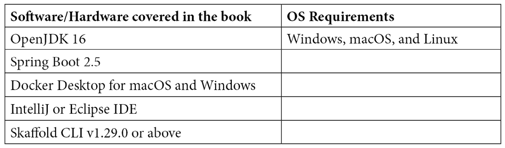

# 前言

多年来，围绕 Kubernetes 的工具已经发生了巨大变化，鉴于其所带来的热潮。越来越多的开发者正在寻找可以帮助他们快速开始使用 Kubernetes 的工具。这也给开发者带来了一些困惑：他们应该使用哪种工具来减少配置本地设置的时间，或者编写脚本来自动化他们的内部开发循环工作流程？此外，开发者在使用 Kubernetes 时需要更好的工具，因为焦点应该放在手头的任务上，即编码，而不是苦恼于如何以及在哪里部署应用程序。理想情况下，您会希望有一个提供可扩展性以支持各种用例的工具。

本书将向您展示如何通过使用 Skaffold 自动化构建、推送和部署样板来解决云原生应用中的内部开发循环复杂性。

# 本书的受众

本书适用于云原生应用开发人员、与 Kubernetes 合作的软件工程师以及寻找简化其内部开发循环并改进云原生应用的 CI/CD 流程的 DevOps 专业人员。在阅读本书之前，需要具备初级水平的 Java、Docker、Kubernetes 和容器生态系统知识。

# 本书涵盖内容

第一章《编码、构建、测试和重复——应用开发的内部循环》定义了应用开发的内部循环及其重要性。它还将内部循环与外部开发循环进行了比较，并涵盖了传统单体应用程序和容器原生微服务应用程序的典型开发工作流程。

第二章《使用 Kubernetes 开发云原生应用——开发者的噩梦》解释了开发者在使用 Kubernetes 开发云原生应用时所面临的问题。

第三章《Skaffold——简单易用的云原生 Kubernetes 应用开发》提供了 Skaffold 的高级概述。我们还将通过构建和部署一个 Spring Boot 应用程序来演示 Skaffold 的基本特性。

第四章《了解 Skaffold 的特性和架构》通过查看其架构、工作流程和配置文件`skaffold.yaml`来探讨 Skaffold 的特性和内部结构。

[*第五章*]，*安装 Skaffold 并揭秘其流水线阶段*，解释了 Skaffold 的安装以及在不同流水线阶段中使用的常见 CLI 命令。

[*第六章*]，*使用 Skaffold 容器镜像构建器和部署器*，介绍了用于使用 Skaffold 将容器镜像（Docker、Jib、kaniko、Buildpacks）构建和部署（Helm、kubectl、kustomize）到 Kubernetes 的各种工具。

[*第七章*]，*使用 Cloud Code 插件构建和部署 Spring Boot 应用*，向您介绍了由 Google 开发的 Cloud Code 插件。它解释了如何使用 Cloud Code 插件和诸如 IntelliJ 之类的 IDE 将 Spring Boot 应用构建和部署到 Kubernetes 集群。

[*第八章*]，*使用 Skaffold 将 Spring Boot 应用部署到 Google Kubernetes Engine*，解释了如何使用 Skaffold 将 Spring Boot 应用部署到 Google Kubernetes Engine，这是 Google Cloud Platform 提供的托管 Kubernetes 服务。

[*第九章*]，*使用 Skaffold 创建一个生产就绪的 CI/CD 流水线*，解释了如何使用 Skaffold 和 GitHub 操作创建一个 Spring Boot 应用的生产就绪的持续集成和部署流水线。

[*第十章*]，*探索 Skaffold 替代方案、最佳实践和陷阱*，介绍了 Skaffold 替代工具，如 Telepresence，并介绍了 Skaffold 的最佳实践和陷阱。

# 要充分利用本书



如果您正在使用本书的数字版本，我们建议您自己输入代码或通过 GitHub 存储库（链接在下一节中提供）访问代码。这样做将有助于您避免与复制和粘贴代码相关的任何潜在错误。

# 下载示例代码文件

您可以从 GitHub 上下载本书的示例代码文件[`github.com/PacktPublishing/Effortless-Cloud-Native-App-Development-Using-Skaffold`](https://github.com/PacktPublishing/Effortless-Cloud-Native-App-Development-Using-Skaffold)。如果代码有更新，将在现有的 GitHub 存储库中进行更新。

我们还有来自我们丰富的图书和视频目录的其他代码包，可在[`github.com/PacktPublishing/`](https://github.com/PacktPublishing/)上找到。快去看看吧！

# 下载彩色图像

我们还提供了一个 PDF 文件，其中包含本书中使用的屏幕截图/图表的彩色图像。您可以在这里下载：

[`static.packt-cdn.com/downloads/9781801077118_ColorImages.pdf`](https://static.packt-cdn.com/downloads/9781801077118_ColorImages.pdf)

# 使用的约定

本书中使用了许多文本约定。

`文本中的代码`：表示文本中的代码单词、数据库表名、文件夹名、文件名、文件扩展名、路径名、虚拟 URL、用户输入和 Twitter 句柄。这是一个例子：“在内部，Skaffold 创建一个`tar`文件，其中包含与我们在`skaffold.yaml`文件中定义的同步规则匹配的更改文件。”

代码块设置如下：

```
profiles:
  - name: userDefinedPortForward
    portForward:
      - localPort: 9090
        port: 8080
        resourceName: reactive-web-app
        resourceType: deployment
```

任何命令行输入或输出都以以下方式编写：

```
curl -Lo skaffold https://storage.googleapis.com/skaffold/releases/latest/skaffold-linux-amd64 && \sudo install skaffold /usr/local/bin/
```

**粗体**：表示新术语、重要单词或屏幕上看到的单词。例如，菜单或对话框中的单词会在文本中以这种方式出现。这是一个例子：“现在我们有一个可用的项目，点击**Run/Debug Configurations**下拉菜单，然后选择**Edit Configurations**。”

提示或重要说明

会以这种方式出现。
