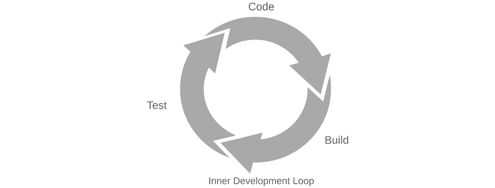
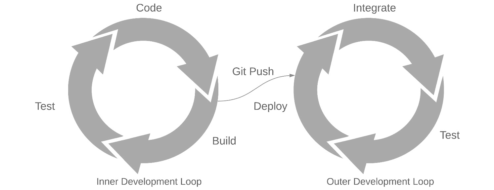
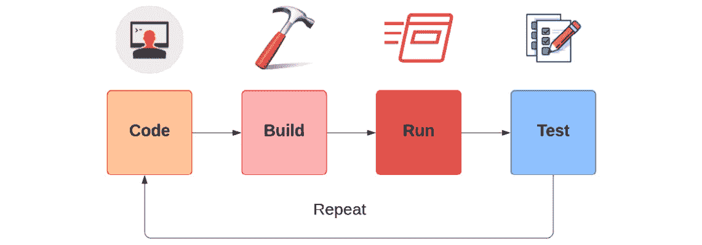
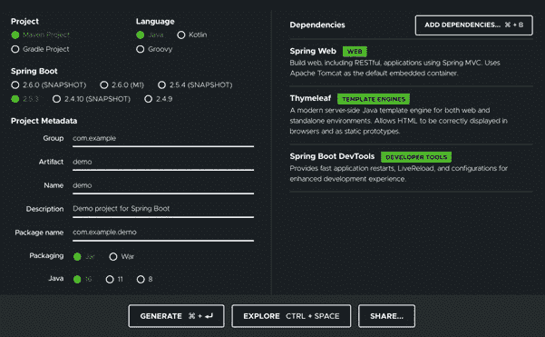
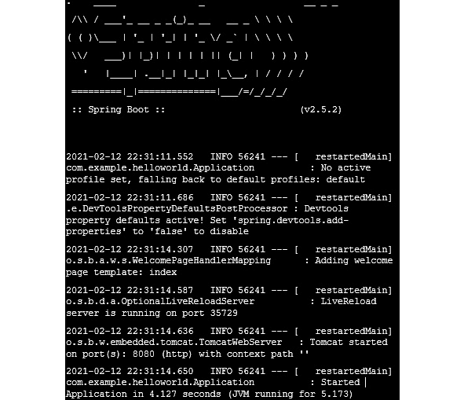
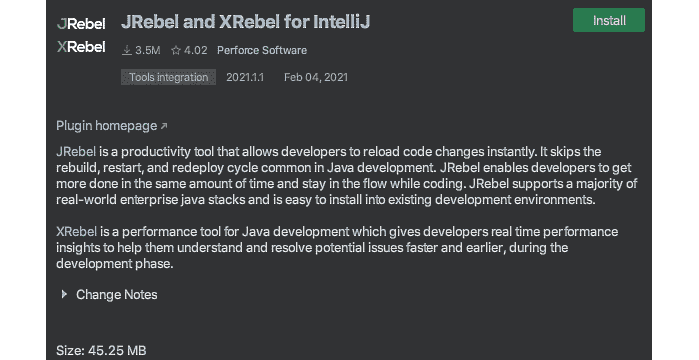
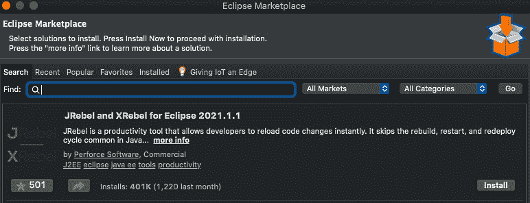
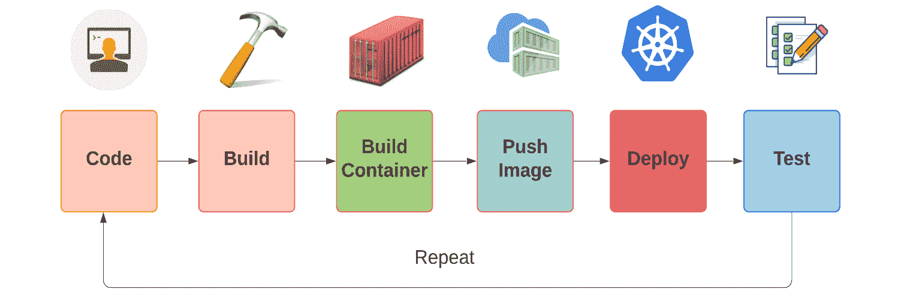

# 第一章：*第一章*：编码、构建、测试和重复 - 应用程序开发内部循环

构建和部署云原生应用程序可能会对本地和远程开发造成麻烦，如果您没有使用适当的工具。开发人员经历了很多痛苦来自动化构建、推送和部署步骤。在本书中，我们将向您介绍**Skaffold**，它可以帮助自动化这些开发工作流程步骤。您将学习如何使用 Skaffold CLI 来加速内部开发循环，以及如何创建有效的**持续集成**/**持续部署**（**CI/CD**）流水线，并执行构建和部署以管理 Kubernetes 实例，如**Google Kubernetes Engine**（**GKE**）、**Microsoft 的 Azure Kubernetes Service**（**AKS**）和 Amazon 的**Elastic Kubernetes Service**（**EKS**）。

本章将定义应用程序开发的内部循环及其重要性，比较内部与外部开发循环，并涵盖传统单体应用程序和容器本地微服务应用程序的典型开发工作流程。我们将深入讨论这两种方法之间的差异。

在本章中，我们将涵盖以下主要主题：

+   了解应用程序开发内部循环是什么

+   内部与外部开发循环

+   探索传统应用程序开发内部循环

+   检查容器本地应用程序开发内部循环

到本章结束时，您将了解传统和容器本地应用程序内部开发循环。

# 技术要求

要跟着本章的示例进行，您需要以下内容：

+   Eclipse ([`www.eclipse.org/downloads/`](https://www.eclipse.org/downloads/)) or IntelliJ IDEA ([`www.jetbrains.com/idea/download/`](https://www.jetbrains.com/idea/download/))

+   Git ([`git-scm.com/downloads`](https://git-scm.com/downloads))

+   Spring Boot 2.5 ([`start.spring.io`](https://start.spring.io))

+   minikube ([`minikube.sigs.k8s.io/docs/`](https://minikube.sigs.k8s.io/docs/)) 或 Docker Desktop for macOS 和 Windows ([`www.docker.com/products/docker-desktop`](https://www.docker.com/products/docker-desktop))

+   OpenJDK 16 ([`jdk.java.net/16/`](https://jdk.java.net/16/))

您可以从 GitHub 存储库[`github.com/PacktPublishing/Effortless-Cloud-Native-App-Development-Using-Skaffold/tree/main/Chapter01`](https://github.com/PacktPublishing/Effortless-Cloud-Native-App-Development-Using-Skaffold/tree/main/Chapter01)下载本章的代码示例

# 理解应用程序开发的内部循环

**应用程序开发的内部循环**是一个迭代过程，在这个过程中，开发人员更改代码，开始构建，运行应用程序，然后测试它。如果出了问题，那么我们就重复整个循环。

因此，基本上，这是开发人员在本地完成更改之前与他人分享更改的阶段。无论您的技术堆栈、使用的工具和个人偏好如何，内部循环过程可能会有所不同，但理想情况下，可以总结为以下三个步骤：

1.  代码

1.  构建

1.  测试

以下是内部开发循环的快速可视化表示：



图 1.1 - 内部循环

如果您仔细想想，编码是唯一增加价值的步骤，其余步骤都像是对您的工作进行验证，即确认您的代码是否正在编译和测试是否通过。由于开发人员大部分时间都花在内部循环上，他们不喜欢在任何步骤上花费太多时间。它应该迅速。此外，作为开发人员，我们渴望快速反馈。

到目前为止，我们定义的所有步骤都是在开发人员的机器上本地发生的，然后再将代码提交到源代码存储库。一旦开发人员提交并推送更改到源代码存储库，通常会启动他们的 CI/CD 管道，称为**外部开发循环**（拉取请求、CI、部署等）。无论您是开发传统的单体应用程序还是容器化的微服务应用程序，都不应忽视内部开发循环的重要性。以下是您应该关注内部开发循环的原因：

+   如果您的内部开发循环缓慢且缺乏自动化，那么开发人员的生产力将会下降。

+   最好始终致力于优化它，因为慢的内部循环会影响其他依赖团队，并且将需要更长的时间将新功能交付给用户。

现在我们已经快速概述了应用程序开发的内部循环，让我们比较一下内部和外部开发循环。

# 内部与外部开发循环

正如前面讨论的那样，只要开发人员在本地环境中测试，他们就处于内部循环中。一般来说，开发人员大部分时间都在内部循环中，因为它快速并且能够立即反馈。通常涉及以下步骤：

1.  开发人员开始处理新的功能请求。此时进行一些代码更改。

1.  一旦开发人员对更改感到自信，就会启动构建。

1.  如果构建成功，开发人员将运行单元测试。

1.  如果测试通过，开发人员将在本地启动应用程序的一个实例。

1.  他们将切换到浏览器验证更改。

1.  开发人员将跟踪日志或附加调试器。

1.  如果出现问题，开发人员将重复前面的步骤。

但是，一旦开发人员提交并将代码推送到源代码存储库，就会触发外部开发循环。外部开发循环与 CI/CD 流程密切相关。它涉及以下步骤：

1.  CI 检出源代码

1.  构建项目

1.  运行功能和集成测试套件

1.  创建运行时构件（JAR、WAR 等）

1.  部署到目标环境

1.  测试和重复

所有前面的步骤通常都是自动化的，开发人员几乎不需要参与。当 CI/CD 流水线因测试失败或编译问题而中断时，开发人员应该收到通知，然后开始在内部开发循环上再次工作以解决这个问题。以下是内循环与外循环的可视化：



图 1.2 - 内循环与外循环

很容易将 CI/CD 用作内部开发循环的替代品。让我们讨论一下这是否是一个好方法。

## 为什么不使用 CI/CD？

与我们刚讨论的内循环相反，一些开发人员可能会说他们不关心他们的内部开发循环，因为他们有一个 CI/CD 流程，这应该足够了。他们并不完全错误，因为这些流水线是为了使现代应用程序开发过程可重复和简单而构建的。但是，您的 CI/CD 流程只能解决一组独特的问题。

使用 CI/CD 替代你的内部开发循环将使整个过程变得更慢。想象一下，不得不等待整个 CI/CD 系统运行你的构建和测试套件，然后部署，只发现你犯了一个小错误；这将是相当恼人的。现在，你必须等待并重复整个过程，只是因为一些愚蠢的错误。如果我们可以避免不必要的迭代，那将会更容易。对于你的内部开发循环，你必须快速迭代并预览更改，就好像它们发生在一个实时集群上一样。

我们已经涵盖了关于应用程序开发内部循环的足够基础知识，现在我们将介绍 Java 开发人员的传统应用程序开发内部循环。

# 探索传统应用程序开发内部循环

在容器变得流行之前，我们被内部开发循环的选择所宠坏。你的集成开发环境可以在后台运行构建，然后你可以部署你的应用程序并在本地测试你的更改。典型的传统应用程序开发内部循环涉及以下步骤：

1.  开发人员在集成开发环境中进行代码更改

1.  构建和打包应用程序

1.  部署，然后在本地服务器上运行

1.  最后，测试更改并重复步骤

这是传统应用程序开发内部循环的可视化。



图 1.3 - 传统应用程序开发内部循环

对于 Java 开发人员，有许多选项可用于自动化此过程。其中一些最受欢迎的选项如下：

+   Spring Boot 开发者工具

+   JRebel

让我们简要讨论这些选项。

## Spring Boot 开发者工具

Spring Boot 首次在 1.3 版中引入了开发者工具。Spring Boot 开发者工具提供快速反馈循环和自动重新启动应用程序以适应任何代码更改。它提供以下功能：

+   它提供了**热重载**功能。一旦在`classpath`上进行了任何文件更改，它将自动重新启动应用程序。自动重新启动可能会根据你的集成开发环境而有所不同。请查看官方文档（[`docs.spring.io/spring-boot/docs/1.5.16.RELEASE/reference/html/using-boot-devtools.html#using-boot-devtools-restart`](https://docs.spring.io/spring-boot/docs/1.5.16.RELEASE/reference/html/using-boot-devtools.html#using)）以获取更多关于此的详细信息。

+   它提供与**LiveReload**插件（[`livereload.com`](http://livereload.com)）的集成，以便在资源更改时自动刷新浏览器。在内部，Spring Boot 将启动一个嵌入式 LiveReload 服务器，每当资源更改时都会触发浏览器刷新。该插件适用于大多数流行的浏览器，如 Chrome、Firefox 和 Safari。

+   它不仅支持本地开发过程，还可以选择更新并重新启动远程在服务器或云上运行的应用程序。您也可以选择启用远程调试。但是，在生产中使用此功能存在安全风险。

以下是如何向 Maven 和 Gradle 项目添加相关依赖项以添加对 Spring Boot 开发工具的支持的简短片段。Maven/Gradle 应该首先有一个介绍部分：

Maven pom.xml

```
<dependencies>
  <dependency>
    <groupId>org.springframework.boot</groupId>
    <artifactId>spring-boot-devtools</artifactId>
  </dependency>
</dependencies>
```

Gradle build.gradle

以下是 Gradle 的代码：

```
dependencies {
compileOnly("org.springframework.boot:spring-boot-devtools")
}
```

但这不是我们将如何添加依赖项来测试开发工具的自动重新加载功能。我们将使用**Spring Initializr**网站（[`start.spring.io/`](https://start.spring.io/)）根据您选择的选项生成项目存根。以下是我们将遵循的步骤：

1.  您可以选择默认选项，也可以自行选择。您可以选择构建工具（Maven 或 Gradle）、语言（Java、Kotlin 或 Groovy）和您选择的 Spring Boot 版本。

1.  之后，您可以通过点击“**ADD DEPENDENCIES…**”按钮并选择应用程序所需的依赖项来添加必要的依赖项。

1.  我选择了默认选项，并将`spring-boot-starter-web`、`spring-boot-dev-tools`和 Thymeleaf 作为我的演示 Hello World Spring Boot 应用程序的依赖项。

1.  现在，继续点击“**GENERATE**”按钮，以下载在您的计算机上生成的源代码。这是您应该看到的屏幕：

图 1.4 – Spring Initializr 首页

1.  下载后，您可以将项目导入到您的 IDE 中。

下一个逻辑步骤是构建一个简单的 Hello World Spring Boot web 应用程序。让我们开始吧。

### Spring Boot web 应用程序的解剖

了解 Spring Boot 应用程序的工作部分的最佳方法是看一个例子。在这个例子中，我们将创建一个简单的**Spring Web MVC**应用程序，它将在`http://localhost:8080/hello`接受 HTTP GET 请求。我们将得到一个 HTML 网页，其中响应中的 HTML 主体中有"Hello, John!"。我们将允许用户通过在`http://localhost:8080/hello?name=Jack` URL 中输入查询字符串来自定义默认响应，以便我们可以更改默认消息。让我们开始：

1.  首先，让我们使用`@Controller`注解创建一个`HelloController` bean 来处理传入的 HTTP 请求。`@GetMapping`注解将 HTTP GET 请求绑定到`hello()`方法：

```
@Controller
public class HelloController {
   @GetMapping("/hello")
   public String hello(@RequestParam(defaultValue =     "John", name = "name", required = false) String name,     Model model) {
      model.addAttribute("name", name);
      return "index";
}
}
```

这个控制器返回视图的名称，在我们的例子中是`index`。我们在这里使用的视图技术是 Thymeleaf，它负责服务器端渲染 HTML 内容。

1.  在源代码模板中，`index.html`位于`src/main/resources/`的 templates 文件夹中。以下是文件的内容：

```
<!DOCTYPE HTML>
<html xmlns:th="http://www.thymeleaf.org">
<head>
      <meta charset="UTF-8"/>
      <title>Welcome</title>
</head>
<body>
<p th:text="'Hello, ' + ${name} + '!'" />
</body>
</html>
```

1.  Spring Boot 为您的应用程序提供了一个默认的设置，其中包括一个`main`类：

```
@SpringBootApplication
public class Application {
   public static void main(String[] args) {
      SpringApplication.run(Application.class, args);
   }
}
```

1.  我们将使用`mvn` `spring-boot:run maven goal`来运行我们的应用程序，这是由`spring-boot-maven-plugin`提供的：

图 1.5 - Spring Boot 应用程序启动日志

注意

为了减少日志的冗长，我们已经将它们缩减到只显示与我们讨论相关的部分。

如果您仔细观察日志，我们已经启用了开发者工具支持，一个嵌入式的 Tomcat 服务器在端口`8080`上监听，并且一个运行在端口`35279`上的嵌入式 LiveReload 服务器。到目前为止，看起来很不错。一旦应用程序启动，您可以访问 http://localhost:8080/hello URL。


图 1.6 - REST 端点响应

1.  现在我们将在 Java 文件中进行一个小的代码更改并保存，您可以从日志中看到嵌入式 Tomcat 服务器已经重新启动。在日志中，您还可以看到生成应用程序的线程不是主线程，而是一个`restartedMain`线程：

```
2021-02-12 16:28:54.500   INFO 53622 --- [nio-8080-exec-1] o.a.c.c.C.[Tomcat].[localhost].[/]          : Initializing Spring DispatcherServlet 'dispatcherServlet'
2021-02-12 16:28:54.500   INFO 53622 --- [nio-8080-exec-1] o.s.web.servlet.DispatcherServlet            : Initializing Servlet 'dispatcherServlet'
2021-02-12 16:28:54.501   INFO 53622 --- [nio-8080-exec-1] o.s.web.servlet.DispatcherServlet            : Completed initialization in 1 ms
2021-02-12 16:29:48.762   INFO 53622 --- [          Thread-5] o.s.s.concurrent.ThreadPoolTaskExecutor   : Shutting down ExecutorService 'applicationTaskExecutor'
2021-02-12 16:29:49.291   INFO 53622 --- [   restartedMain] c.e.helloworld.HelloWorldApplication       : Started HelloWorldApplication in 0.483 seconds (JVM running for 66.027)
2021-02-12 16:29:49.298   INFO 53622 --- [   restartedMain] .ConditionEvaluationDeltaLoggingListener : Condition evaluation unchanged
2021-02-12 16:29:49.318   INFO 53622 --- [nio-8080-exec-1] o.a.c.c.C.[Tomcat].[localhost].[/]          : Initializing Spring DispatcherServlet 'dispatcherServlet'
2021-02-12 16:29:49.319   INFO 53622 --- [nio-8080-exec-1] o.s.web.servlet.DispatcherServlet            : Initializing Servlet 'dispatcherServlet'
2021-02-12 16:29:49.320   INFO 53622 --- [nio-8080-exec-1] o.s.web.servlet.DispatcherServlet            : Completed initialization in 1 ms
```

这完成了 Spring Boot 开发者工具自动重启功能的演示。出于简洁起见，我们没有涵盖 LiveReload 功能，因为在这里很难解释，因为这一切都是实时发生的。

## JRebel

**JRebel** ([`www.jrebel.com/products/jrebel`](https://www.jrebel.com/products/jrebel)) 是 Java 开发人员加速内部循环开发过程的另一个选择。它是一个 JVM 插件，有助于减少本地开发步骤的时间，如构建和部署。这是一个由名为*Perforce*的公司开发的付费工具。但是，如果您想尝试一下，有 10 天的免费试用期。它提供以下功能：

+   它允许开发人员跳过重建和重新部署，并通过刷新浏览器即可看到其更改的实时更新。

+   它将使开发人员在保持应用程序状态的同时更加高效。

+   它提供了即时反馈循环，允许您在开发过程中早期测试和修复问题。

+   它与流行的框架、应用服务器、构建工具和 IDE 有良好的集成。

有许多不同的方法可以使 JRebel 支持您的开发过程。我们将考虑使用它与 Eclipse 或 IntelliJ 这样的 IDE 的可能性。对于这两个 IDE，您可以安装插件，就这样。正如我之前所说，这是一个付费选项，您只能免费试用 10 天。

对于 IntelliJ IDEA，您可以从市场安装插件。



图 1.7 – IntelliJ IDEA 安装 JRebel

对于 Eclipse IDE，您可以从 Eclipse Marketplace 安装插件。



图 1.8 – Eclipse IDE 安装 JRebel

由于 JRebel 是一个付费选项，我们将不会在本书中探讨它，但您可以自行测试。

我们已经介绍了传统应用程序开发内部循环生命周期和工具，如 Spring Boot Developer Tools 和 JRebel，它们允许快速应用程序开发。现在让我们来看一下基于容器的应用程序开发内部循环生命周期。

# 检查基于容器的应用程序开发内部循环

Kubernetes 和容器为内部开发循环引入了一系列新的挑战和复杂性。现在在开发应用程序时，内部循环中添加了一组额外的步骤，这是耗时的。开发人员更愿意花时间解决业务问题，而不是等待构建过程完成。

它涉及以下步骤：

1.  在 IDE 中进行代码更改的开发人员

1.  构建和打包应用程序

1.  创建一个容器镜像

1.  将镜像推送到容器注册表

1.  Kubernetes 从注册表中拉取镜像

1.  Kubernetes 创建和部署 pod

1.  最后，测试和重复

谷歌的工程师称之为“无尽的痛苦和苦难”。这是一个容器本地应用开发内部循环的可视化：



图 1.9 - 容器本地应用开发内部循环

正如你所看到的，我们现在在内部开发循环中增加了三个步骤，即创建应用程序的容器镜像，将其推送到容器注册表，最后，在部署到 Kubernetes 等容器编排工具时拉取镜像。

容器镜像可以是 Docker 或 OCI 格式的镜像，这取决于您用来构建镜像的工具。您可以选择 Docker Hub、AWS 容器注册表、谷歌容器注册表或 Azure 容器注册表作为容器注册表。然后，在部署时，对于容器编排，您可以使用 Kubernetes 等工具，它将首先从容器注册表中拉取镜像并部署您的应用程序。

这里涉及许多手动步骤。这也取决于您在本地开发工作流程中使用了什么工具。例如，您将使用以下命令：

```
docker build 
docker tag
docker push 
kubectl apply
```

以下是开发人员在开发容器本地应用程序时必须经历的详细步骤：

1.  使用 Dockerfile 定义如何配置容器的操作系统

1.  通过向 Dockerfile 添加指令来定义将应用程序打包成容器镜像

1.  使用 Docker 命令（如`docker build`和`docker tag`）创建一个容器镜像

1.  使用命令（如`docker push`）将容器镜像上传到容器注册表

1.  在 YAML 中编写一个或多个 Kubernetes 资源文件

1.  使用命令（如`kubectl apply -f myapp.yaml`）将应用程序部署到集群

1.  使用命令（如`kubectl apply -f mysvc.yaml`）将服务部署到集群

1.  编写配置，使应用程序可以通过命令（如`kubectl create configmap`）协同工作

1.  使用命令（如`kubectl apply -f myappconfigmap.yaml`）配置应用程序以正确地协同工作

哇哦！这是很多步骤和耗时的过程。您可以使用脚本或`docker compose`来在一定程度上自动化它，但很快您会意识到，如果没有 Skaffold 这样的工具，它是无法完全自动化的，Skaffold 可以抽象出许多与构建和部署相关的事情。

在*第三章*中，*Skaffold – 简单易用的云原生 Kubernetes 应用开发*，我们将介绍 Skaffold，它可以用单个命令简化我们在这里涵盖的过程。我在这里的唯一目的是让您了解涉及的步骤。我们将在下一章中通过一些实际示例来介绍这些步骤。

# 摘要

在本章中，我们涵盖了许多主题，比如典型的内部开发循环及其重要性。我们还讨论了内部和外部开发循环的不同之处，然后探讨了 CI/CD 过程是否可以替代内部开发循环。

然后，我们讨论了传统应用程序开发内部循环涉及的步骤，并介绍了诸如 Spring 开发者工具和 JRebel 之类的工具，这些工具使应用程序开发变得更加容易。为了进一步解释这一点，我们创建了一个简单的 Spring Boot web MVC 应用程序。最后，在最后一节中，我们涵盖了容器本地应用程序开发内部循环。我们还介绍了容器本地应用程序开发涉及的步骤。

在本章中，重点是向您介绍内部和外部开发等概念。您可以使用 Spring Boot 开发者工具和 JRebel 来加速/自动化传统应用程序开发生命周期。

在下一章中，我们将介绍开发人员在使用 Kubernetes 开发应用程序时面临的问题。

# 进一步阅读

+   了解有关 Spring Boot 开发者工具的更多信息，请访问[`docs.spring.io/spring-boot/docs/1.5.16.RELEASE/reference/html/using-boot-devtools.html`](https://docs.spring.io/spring-boot/docs/1.5.16.RELEASE/reference/html/using-boot-devtools.html)。

+   有关 JRebel 的更多信息，请访问[`www.jrebel.com/`](https://www.jrebel.com/)。

+   从 Packt 出版的*Docker for Developers*中了解更多有关 Docker 的信息([`www.packtpub.com/product/docker-for-developers/9781789536058`](https://www.packtpub.com/product/docker-for-developers/9781789536058))。

+   从 Packt 出版的《精通 Kubernetes》了解更多关于 Kubernetes 的信息（https://www.packtpub.com/product/mastering-kubernetes/9781786461001）.
