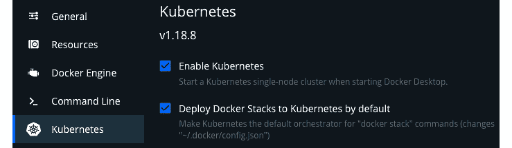
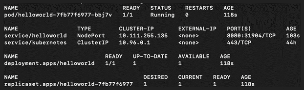
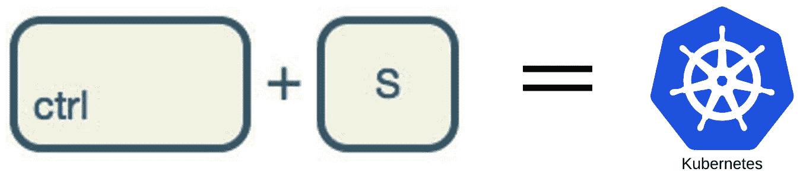

# 第二章：使用 Kubernetes 开发云原生应用程序-开发者的噩梦

在上一章中，我们介绍了开发人员在开发容器原生应用程序时面临的困难。我们还介绍了开发生命周期中引入的新步骤。我们可能已经简化了解释概念，但在本章中我们将详细介绍每个步骤。

本章将涵盖开发人员在使用 Kubernetes 开发云原生应用程序时面临的问题。我们将介绍 Kubernetes 的整体开发体验为什么如此痛苦，以及为什么开发人员不是 Kubernetes 专家，他们在使用 Kubernetes 开发应用程序时寻求简化的工作流程。

在本章中，我们将涵盖以下主要主题：

+   开发者体验不佳

+   开发者希望简化 Kubernetes 的工作流程

+   开发者不是 Kubernetes 专家

通过本章的学习，您将了解开发人员在使用 Kubernetes 开发云原生应用程序时面临的常见挑战。随后，在下一章中，我们将学习如何通过使用 Skaffold 来克服这些挑战，以改善您的开发工作流程。

# 技术要求

要跟随本章中的示例，您需要以下内容：

+   Eclipse ([`www.eclipse.org/downloads/`](https://www.eclipse.org/downloads/)) 或 IntelliJ IDE ([`www.jetbrains.com/idea/download/`](https://www.jetbrains.com/idea/download/))

+   Git ([`git-scm.com/downloads`](https://git-scm.com/downloads))

+   Spring Boot 2.5 ([`start.spring.io`](https://start.spring.io))

+   minikube ([`minikube.sigs.k8s.io/docs/`](https://minikube.sigs.k8s.io/docs/)) 或 Docker Desktop for macOS 和 Windows ([`www.docker.com/products/dockerdesktop`](https://www.docker.com/products/dockerdesktop))

+   OpenJDK 16 ([`jdk.java.net/16/`](https://jdk.java.net/16/))

您可以从 GitHub 存储库[`github.com/PacktPublishing/Effortless-Cloud-Native-App-Development-Using-Skaffold/tree/main/Chapter02`](https://github.com/PacktPublishing/Effortless-Cloud-Native-App-Development-Using-Skaffold/tree/main/Chapter02)下载本章的代码示例。

# 开发者体验不佳

现代开发人员正在寻找能够让他们在快节奏的今天世界中保持竞争力并交付符合客户期望的软件的工具和技术。进入 Kubernetes！Kubernetes 于 2014 年开源，自诞生以来，已成为全球众多企业选择的容器编排平台。Kubernetes 极大地简化了运维人员的工作，但对于构建和部署应用程序到 Kubernetes 的开发人员来说，情况并非如此。

我们在本章中详细介绍了这一点。根据最近的一项研究，大约 59%的企业组织正在使用 Kubernetes 运行其生产工作负载。对于一个只有 5 年历史的技术来说，这是非常出色的。企业采用 Kubernetes 的主要原因是为了增加敏捷性，加快软件交付，并支持数字化转型。

在讨论使用 Kubernetes 的痛点之前，让我们以一个真实的例子来了解 Kubernetes 如何帮助组织进行数字化转型。让我们以一个电子商务网站为例。大多数时候，网站都能正常运行。该网站利用微服务架构，并拥有多个服务协同工作，以提供更好的用户体验。然而，由于即将到来的假期，IT 团队预计网站的使用量会激增，团队担心这可能会导致停机，因为底层的微服务可能无法处理负载。但是有了 Kubernetes，很容易进行扩展而不会带来太多麻烦。例如，您可以利用 Kubernetes 的自动缩放功能以及其水平 Pod 自动缩放器（HPA）。HPA 根据观察到的 CPU 利用率自动调整 Pod 的数量。

此外，容器和 Kubernetes 确实改变了我们打包、部署和大规模运行云原生应用程序的方式。容器化后，您可以在任何地方运行应用程序，即在虚拟机、物理机或云上。并且借助 Kubernetes 等容器编排工具，您可以更有效地扩展、部署和管理云原生应用程序。它减少了生产中的停机时间，并使运维团队的工作更加轻松。然而，与传统应用程序相比，开发人员的体验和实践自 Kubernetes 问世以来并没有多大进步。让我们通过一个例子来了解云原生应用程序开发流程。

## 了解云原生应用程序开发工作流程

我们将使用在*第一章*中创建的相同的*Hello-World Spring Boot Web MVC*应用程序，*代码、构建、测试和重复 – 应用程序开发内部循环*；但是，这次我们将对其进行容器化并部署到 Kubernetes。我们的想法是经历开发人员在开发云原生 Spring Boot 应用程序时所经历的困难。以下是我们将要遵循的步骤：

1.  我们将使用**Docker Desktop**作为 macOS 和 Windows 的工具，因为它支持 Kubernetes，并且我们不必为此示例单独下载**minikube**。但是，如果您不使用 macOS，那么您也可以为其他操作系统安装 minikube ([`v1-18.docs.kubernetes.io/docs/tasks/tools/install-minikube/#installing-minikube`](https://v1-18.docs.kubernetes.io/docs/tasks/tools/install-minikube/#installing-minikube))。按照步骤在 macOS 和 Windows 上启用 Docker Desktop 的 Kubernetes 支持。

1.  在 Docker 菜单栏中导航到**首选项**。然后，在**Kubernetes**选项卡上，单击**启用 Kubernetes**复选框，以启动单节点功能性 Kubernetes 集群。启动集群需要一些时间。这不是强制性的，但您也可以将 Kubernetes 启用为`docker stack`命令的默认编排器。

图 2.1 – 启用 Kubernetes

1.  启用后，您将在 Docker Desktop 菜单栏上看到以下屏幕。这证实了 Kubernetes 集群已经启动和运行：

图 2.2 – 验证设置

1.  接下来，请确保 Kubernetes 上下文设置为`docker-desktop`，如果您在本地运行多个集群或环境：

图 2.3 – 上下文设置为 docker-desktop

1.  顺便说一句，Docker Desktop 带有**kubectl**支持；您不必单独下载它。kubectl 是 Kubernetes 的命令行工具，您可以使用它来针对您的集群运行命令。在 macOS 上，它通常位于路径`/usr/local/bin/kubectl`。对于 Windows，它位于`C:\>Program Files\Docker\Docker\Resources\bin\kubectl.exe`。您可能希望将其添加到您的`PATH`变量中。让我们使用以下命令验证设置：

```
kubectl get nodes
NAME             STATUS   ROLES    AGE   VERSION
docker-desktop   Ready    master   59d   v1.19.3
```

1.  以下是我们用于此示例的 Dockerfile：

```
FROM openjdk:16
COPY target/*.jar app.jar
ENTRYPOINT ["java","-jar","/app.jar"]
```

我们这里有一个非常基本的 Dockerfile。让我简要解释一下指令：

a. `FROM`指令指定了我们的 Spring Boot 应用程序的基础镜像，即 OpenJDK 16。

b. `COPY`用于将文件或目录从主机系统移动到容器内部的文件系统。在这里，我们将`.jar`文件从目标目录复制到容器内部的根路径。

c. `ENTRYPOINT`作为容器的运行时可执行文件，将启动我们的应用程序。

1.  现在我们有了 Dockerfile，接下来我们需要创建一个可执行的`.jar`文件。我们将使用`mvn clean install`命令为我们的应用程序创建一个可执行的`.jar`文件。让我们运行`docker build`命令来创建一个容器镜像。在这里，我们将我们的镜像命名为`helloworld`。`docker build`命令的输出将如下所示：

```
docker build -t hiashish/helloworld:latest .
[+] Building 4.9s (8/8) FINISHED
 => [internal] load build definition from Dockerfile
0.1s
 => => transferring dockerfile: 36B
0.0s
 => [internal] load .dockerignore
0.0s
 => => transferring context: 2B
0.0s
 => [internal] load metadata for docker.io/library/openjdk:16
4.3s
 => [auth] library/openjdk:pull token for registry-1.docker.io
0.0s
 => [internal] load build context
0.1s
 => => transferring context: 86B
0.0s
 => [1/2] FROM docker.io/library/openjdk:11@sha256:3805f5303af58ebfee1d2f5cd5a897e97409e48398144afc223 3f7b778337017
0.0s
 => CACHED [2/2] COPY target/*.jar app.jar
0.0s
 => exporting to image
0.0s
 => => exporting layers
0.0s
 => => writing image sha256:65b544ec877ec10a4dce9883b3 766fe0d6682fb8f67f0952a41200b49c8b0c50
0.0s
 => => naming to docker.io/hiashish/helloworld:latest
```

1.  我们已经为应用程序创建了一个镜像。现在我们准备使用`docker push`命令将镜像推送到 DockerHub 容器注册表，如下所示：

```
docker push hiashish/helloworld
Using default tag: latest
The push refers to repository [docker.io/hiashish/helloworld]
7f517448b554: Pushed 
ebab439b6c1b: Pushed 
c44cd007351c: Pushed 
02f0a7f763a3: Pushed 
da654bc8bc80: Pushed 
4ef81dc52d99: Pushed 
909e93c71745: Pushed 
7f03bfe4d6dc: Pushed 
latest: digest: sha256:16d3d9db1ecdbf21c69bc838d4a a7860ddd5e212a289b726ac043df708801473 size: 2006
```

1.  这个练习的最后一部分是创建 Kubernetes 资源（部署和服务），以便在 Kubernetes 上启动和运行我们的应用程序。服务和部署的声明性 YAML 文件位于源代码的`K8s`目录中。让我们首先创建部署资源，它负责动态创建和运行一组 Pod：

```
apiVersion: apps/v1
kind: Deployment
metadata:
  labels:
    app: helloworld
  name: helloworld
spec:
  replicas: 1
  selector:
    matchLabels:
      app: helloworld
  template:
    metadata:
      labels:
        app: helloworld
    spec:
      containers:
        - image: docker.io/hiashish/helloworld
          name: helloworld
```

让我澄清一下我们用来创建 Kubernetes 部署对象的 YAML 文件的一些事情：

a. `metadata.name`指定要创建的部署对象的名称。

b. `spec.replicas`字段表示 Kubernetes 部署对象将创建一个副本。

c. `template.spec`字段表示 Pod 将运行一个名为`helloworld`的单个容器，该容器运行我们应用程序的 DockerHub 镜像。

这是创建 Deployment 对象的`kubectl`命令：

```
kubectl create -f mydeployment.yaml
deployment.apps/helloworld created
```

1.  服务为一组 Pod 提供单一的 DNS 名称，并在它们之间进行负载平衡。让我们创建 Service 资源，以便可以从集群外部访问应用程序：

```
apiVersion: v1
kind: Service
metadata:
  labels:
    app: helloworld
  name: helloworld
spec:
  ports:
    - port: 8080
      protocol: TCP
      targetPort: 8080
  selector:
    app: helloworld
  type: NodePort
```

让我们谈谈我们用来创建 Kubernetes Service 对象的 YAML 文件：

a. `metadata.name`指定要创建的 Service 对象的名称。

b. `spec.selectors`允许 Kubernetes 将名为`helloworld`的 Pod 分组，并将请求转发给它们。

c. `type: Nodeport`为每个节点创建一个静态 IP，以便我们可以从外部访问 Service。

d. `targetPort`是容器端口。

e. `port`是在集群内部暴露的端口。

以下是创建 Service 对象的`kubectl`命令：

```
kubectl create -f myservice.yaml   
service/helloworld created
```

1.  现在让我们验证一下我们是否有一个正在运行的 Pod：

图 2.4 - Pod 运行

1.  正如您所看到的，我们现在已经在 Kubernetes 上运行我们的应用程序。让我们来验证一下：


图 2.5 - REST 端点响应

这是很多步骤，即使您的更改很小，也需要太多的按键，而且您甚至不知道它是否有效。现在想象一下，每次您推送更改时都需要这样做！如果您有多个微服务相互通信，这个工作流程可能会更加复杂。您可以选择不在本地开发时部署到 Kubernetes，而是依赖于 CI/CD 流程。或者您可能正在使用类似于`docker-compose`或者使用 Docker 进行隔离测试。想象一下，您需要以这种方式运行多个微服务。

要真实地测试一切，您需要使开发环境与部署环境相匹配，以测试您的微服务依赖关系。这是容器本地开发的缺点，因为开发人员花费更少的时间编码，而更多的时间担心配置、设置环境和等待部署完成。在本书的后面章节中，我们将介绍如何使用 Skaffold 构建和部署多个微服务。

由于 Kubernetes 带来的固有复杂性，开发人员正在寻找简单的工作流程。让我们在下一节讨论这个问题。

# 开发人员希望简化 Kubernetes 的工作流程。

在上一章中，我们讨论了开发人员在内部开发循环中开发传统的 Spring Boot 应用程序时经历的步骤。我们还讨论了如何使用*spring-dev-tools*等工具轻松自动化整个流程。一旦开发人员对更改感到满意，他们可以保存更改，更改将自动部署。

开发云原生应用程序的开发人员正在寻找类似的工作流程，他们可以保存更改。在后台进行一些魔术操作后，应用程序应该部署到他们选择的本地或远程集群。此外，之前曾在传统单片应用程序上工作过的开发人员在转向开发云原生应用程序时会期望类似的工作流程。从开发人员的角度来看，期望是云原生应用程序开发的额外步骤应该可以通过单个命令或点击来抑制。

开发人员期望在 Kubernetes 中有简化的工作流程，如下图所示：



图 2.6 - 使用 Kubernetes 的 Ctrl + S 工作流程

为解决这些问题，企业需要为开发人员提供可以抽象一般 Kubernetes 复杂性的工具。具体而言，开发人员正在寻找可以满足以下要求的平台或工具：

+   开发人员应该能够在不经过支持经理批准的官僚主义的情况下连接到 Kubernetes。

+   开发人员不应该浪费时间和精力来配置环境。

+   开发人员在使用 Kubernetes 时应该能够快速开始工作。

+   开发人员可以通过单个命令快速部署更改到 Kubernetes 集群。

+   开发人员应该在开发过程中调试云原生应用程序，就像他们习惯于调试传统应用程序一样。

开发人员不应该被绑定在一个用于构建和部署图像的工具上。好消息是，许多企业已经意识到开发人员在 Kubernetes 上的体验有多痛苦，并正在提出他们自己的解决方案来改进它。在本书的后面，我们将介绍一个名为 Skaffold 的工具，它简化了开发人员在处理云原生应用程序时的内部开发循环。Skaffold 实现了*Ctrl* + *Save*的工作流，并自动化了构建和部署过程。Skaffold 还赋予了开发人员选择构建工具（Docker/Jib/Buildpacks）和部署工具（kubectl/Helm/kustomize）的自由。

拥有这样的技能集会很不错，但我们真的希望开发人员成为 Kubernetes 专家吗？让我们在下一节讨论这个问题。

# 开发人员不是 Kubernetes 专家

Kubernetes 最初是为运维人员开发的，而不是为开发人员开发的。有许多原因，开发人员可能对了解 Kubernetes 并不感兴趣。一个合理的理由是，开发人员更感兴趣的是解决业务问题，为他们正在开发的产品添加功能，而不关心目标环境，也就是他们将部署应用的地方。而且，说实话，Kubernetes 很复杂，这不仅对初学者而言很难，对经验丰富的人也很难。我在哪里看到过这个笑话，可能是在 Twitter 上，关于理解 Kubernetes 有多难：“*有一次我试图向某人解释 Kubernetes。然后我们俩都没搞懂*。”

这需要一种与开发人员日常任务不同的技能水平。由于其复杂性，通常需要很长时间才能让普通开发人员掌握 Kubernetes。

在企业环境中工作的开发人员往往会处理以下任务：

+   参与设计讨论

+   为产品添加新功能

+   编写单元测试用例

+   提高代码质量

+   致力于改进应用程序的性能

+   修复错误

+   重构代码

开发人员只想编码，而不想担心他们的应用程序将如何部署在哪里。

关键是，我们需要不断告诉自己，Kubernetes 对开发人员来说并不是一个容易的工具。此外，开发人员更感兴趣的是创建应用程序，使用可以处理构建并为其部署样板的工具。

# 总结

本章涵盖了开发人员在使用 Kubernetes 开发云原生应用程序时必须经历的困难。我们首先描述了部署到 Kubernetes 的应用程序的云原生应用程序开发工作流程。我们通过一些编码示例介绍了开发人员在开发云原生应用程序时必须经历的额外步骤。然后我们解释了开发人员正在寻找一个简化的工作流程，以便在 Kubernetes 上轻松开发。随后在本章中，我们展示了开发人员并不是 Kubernetes 专家，他们应该配备诸如 Skaffold 之类的工具，以改善他们在 Kubernetes 上的开发体验。

在本章中，主要目标是为您介绍开发人员在开发容器本地应用程序时遇到的问题。阅读完本章后，您应该能够理解这些问题，同时我也给出了 Skaffold 如何帮助解决这些问题的提示。

在下一章中，我们将快速介绍 Skaffold，并通过一些编码示例来更好地理解这些提示。

# 进一步阅读。

+   了解有关 Docker 和 Kubernetes 的更多信息，请访问[`www.packtpub.com/product/kubernetes-and-docker-an-enterprise-guide/9781839213403`](https://www.packtpub.com/product/kubernetes-and-docker-an-enterprise-guide/9781839213403)。

+   有关使用 Kubernetes 进行云原生开发的更多信息，请访问[`www.packtpub.com/product/cloud-native-with-kubernetes/9781838823078`](https://www.packtpub.com/product/cloud-native-with-kubernetes/9781838823078)。
