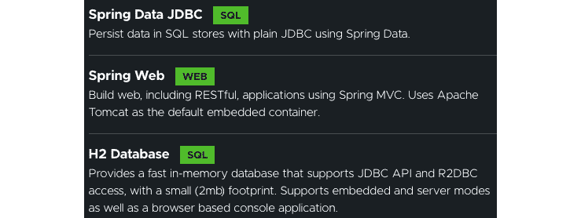
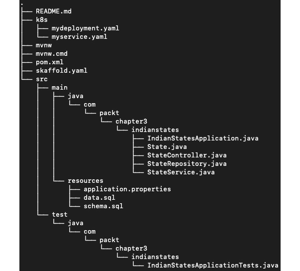
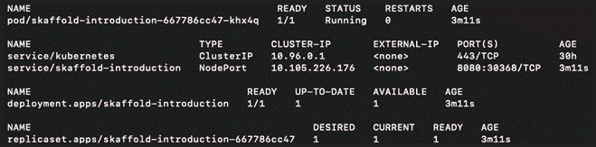

# *第三章*：Skaffold ——轻松开发云原生 Kubernetes 应用程序

在上一章中，我们了解到使用 Kubernetes 开发应用是繁琐的，并提供了一些编码示例。本章将概述 Skaffold 的高级概述。您还将学习和了解 Skaffold 基本命令行界面（CLI）命令以及这些命令如何简化开发人员在 Skaffold 中开发云原生微服务的痛点。我们将通过构建和部署一个 Spring Boot 应用程序来演示 Skaffold 的基本功能。

在本章中，我们将涵盖以下主要主题：

+   什么是 Skaffold？

+   使用 Skaffold 构建和部署 Spring Boot 应用程序

通过本章结束时，您将对 Skaffold 有基本的了解，并能够利用 Skaffold 加速内部开发循环，同时开发云原生应用程序。

# 技术要求

为了跟着本章的例子，你需要以下内容：

+   Eclipse ([`www.eclipse.org/downloads/`](https://www.eclipse.org/downloads/)) 或 IntelliJ IDEA [`www.jetbrains.com/idea/download/`](https://www.jetbrains.com/idea/download/)

+   Git

+   Skaffold CLI ([`skaffold.dev/docs/install/`](https://skaffold.dev/docs/install/))

+   Spring Boot 2.5 ([`start.spring.io`](https://start.spring.io))

+   OpenJDK 16 ([`jdk.java.net/16/`](https://jdk.java.net/16/))

+   minikube ([`minikube.sigs.k8s.io/docs/`](https://minikube.sigs.k8s.io/docs/)) 或 Docker Desktop for macOS and Windows ([`www.docker.com/products/dockerdesktop`](https://www.docker.com/products/dockerdesktop))

您可以从 GitHub 存储库[`github.com/PacktPublishing/Effortless-Cloud-Native-App-Development-Using-Skaffold/tree/main/Chapter03`](https://github.com/PacktPublishing/Effortless-Cloud-Native-App-Development-Using-Skaffold/tree/main/Chapter03)下载本章的代码示例。

# 什么是 Skaffold？

像大多数开发人员一样，Google 工程师 Matt Rickard 在构建和部署 Kubernetes 应用程序时也遇到了同样的痛点。Matt 决定自己动手，创建了 Skaffold。

**Skaffold**是一个 CLI 工具，它可以自动化构建、推送和部署本地或远程 Kubernetes 集群上运行的云原生应用程序的步骤。Skaffold 并不是 Docker 或 Kubernetes 的替代品。它与它们一起工作，并为您处理构建、推送和部署的样板部分。

Skaffold 是由 Google 开发的开源工具。它于 2019 年 11 月 7 日正式发布，并在 Apache 2.0 许可下发布。Skaffold 是用 Go 编程语言编写的。您可以访问 Skaffold 主页[`skaffold.dev/`](https://skaffold.dev/)。Skaffold 文档可在[`skaffold.dev/docs/`](https://skaffold.dev/docs/)找到。

如果您使用的是 macOS，那么您可以使用`homebrew`软件包管理器通过`brew install skaffold`命令安装 Skaffold。然而，在*第五章*，*安装 Skaffold 并揭秘其流水线阶段*中，我们将介绍安装 Skaffold 的各种方法。

Skaffold 在开发者社区中广受欢迎，因为它提供了合理的默认设置，易于使用，并具有可插拔的架构。这是官方 Skaffold 账号最近的一条推文，证实了这一点：


图 3.1 – Skaffold Twitter 账号在 GitHub 上通过 11k 星标推文

如推文中所述，Skaffold GitHub 仓库的星标和分支数量本身就说明了它的受欢迎程度，如下所示：


图 3.2 – Skaffold GitHub 仓库

Skaffold GitHub 页面可在[`github.com/GoogleContainerTools/skaffold`](https://github.com/GoogleContainerTools/skaffold)找到。

让我们尝试通过构建和部署一个 Spring Boot 应用程序来理解 Skaffold 的工作原理。

# 使用 Skaffold 构建和部署 Spring Boot 应用程序

为了更好地理解 Skaffold 命令和概念，在本节中，我们将使用 Skaffold 构建和部署一个 Spring Boot Java 应用程序到本地单节点 Kubernetes 集群。

注意

每当我们在本书中谈论*用于本地开发的 Kubernetes 集群*时，我们指的是*具有 Docker 桌面版的 Kubernetes 集群*，除非另有说明。然而，Docker 桌面版或 minikube 并不是今天用于运行本地 Kubernetes 集群的唯一工具。Skaffold 还支持 Kind [`github.com/kubernetes-sigs/kind`](https://github.com/kubernetes-sigs/kind)和 k3d [`github.com/rancher/k3d`](https://github.com/rancher/k3d)作为本地开发的目标 Kubernetes 集群。

由于这将是 Skaffold 的预览，我们不会详细介绍 Skaffold 的所有内容，因为我们将在接下来的章节中介绍这一点。但是，我会尝试解释所使用的命令，以便您可以理解确切的流程。在我们深入研究 Skaffold 之前，让我们先谈谈我们将使用 Skaffold 构建和部署的 Spring Boot 应用程序。

## 创建一个 Spring Boot 应用程序

我们将要创建的这个 Spring Boot 应用程序将暴露两个**表述状态转移**（**REST**）端点。`/states` REST 端点将返回所有印度各邦及其首府，而`/state?name=statename` REST 端点将返回特定的印度邦及其首府。该应用程序使用内存中的`H2`数据库，在应用程序启动时插入行。与之前的章节类似，我们将使用[`start.spring.io`](https://start.spring.io)生成项目的存根。以下屏幕截图显示了我们将用于构建此应用程序的依赖项：



图 3.3 – Spring Boot 应用程序所需的依赖项

将以下依赖项添加到 Maven 的`pom.xml`文件中：

```
<dependency>
   <groupId>org.springframework.boot</groupId>
   <artifactId>spring-boot-starter-data-jdbc</artifactId>
</dependency>
<dependency>
   <groupId>org.springframework.boot</groupId>
   <artifactId>spring-boot-starter-web</artifactId>
</dependency> 
<dependency>
   <groupId>com.h2database</groupId>
   <artifactId>h2</artifactId>
   <scope>runtime</scope>
</dependency>
<plugin>
   <groupId>com.google.cloud.tools</groupId>
   <artifactId>jib-maven-plugin</artifactId>
   <version>2.8.0</version>
   <configuration>
      <from>
         <image>openjdk:16-jdk-alpine</image>
      </from>
      <to>
         <image>docker.io/hiashish/skaffold-introduction            </image>
      </to>
   </configuration>
</plugin>
```

除了我们已经讨论过的依赖项之外，我还在`pom.xml`中添加了`jib-maven-plugin`插件，它将 Spring Boot 应用程序容器化为一个容器镜像。Jib 将您的源代码作为输入，并输出一个准备就绪的应用程序容器镜像。顺便说一句，Gradle 也有一个等效的插件。对于 Gradle，请使用以下代码：

```
plugins {  
  id 'com.google.cloud.tools.jib' version '2.8.0'
} 
```

提示

**Jib**可以在没有 Docker 守护程序的情况下创建镜像。这意味着您不必安装和配置 Docker，也不必创建或维护 Dockerfile。

我们将在*第六章*中更多地介绍 Jib，*使用 Skaffold 容器镜像构建器和部署器*。

让我们开始吧：

1.  这是源代码目录的布局:

图 3.4 - 项目布局

1.  以下是用`@RestController`注解的 REST 控制器类，用于处理传入的**超文本传输协议**（**HTTP**）请求。`getAllStates()`方法上的`@GetMapping`注解在访问`/states` REST 端点时绑定所有 HTTP `GET`请求。同样，`getSpecificState()`方法处理了传入 REST **统一资源定位符**（**URL**）的`/state`的 HTTP `GET`请求，当州名作为查询参数传递时。如果没有传递参数，则它将采用`Maharashtra`州的默认值:

```
import org.slf4j.Logger;
import org.slf4j.LoggerFactory;
import org.springframework.web.bind.annotation.GetMapping;
import org.springframework.web.bind.annotation.RequestParam;
import org.springframework.web.bind.annotation.RestController;
import java.util.List;
@RestController
public class StateController {
    private final StateService stateService;
    private static final Logger LOGGER =    LoggerFactory.getLogger(Controller.class);
    public StateController(StateService stateService) {
        this.stateService = stateService;
    }
    @GetMapping("/states")
    private List<State> getAllStates() {
        LOGGER.info("Getting all state");
        return stateService.findAll();
    }
    @GetMapping(value = "/state")
    private String getSpecificState(@      RequestParam(required = false, name = "name",         defaultValue = "Maharashtra") String name) {
        return stateService.findByName(name);
    }
}
```

1.  在撰写本书时，Java 16 已经普遍可用。我还有幸向您介绍了一些其新功能。现在让我们谈谈记录。我们有以下数据载体`record`类:

```
public record State(String name, String capital) {}
```

类类型是`record`，它是 Java 16 中作为特性添加的特殊类型。根据*Java Enhancement Proposal 395* ([`openjdk.java.net/jeps/395`](https://openjdk.java.net/jeps/395))，记录是 Java 语言中的一种新类型的类。它们作为不可变数据的透明载体，比普通类的仪式少。记录可以被视为名义元组。`record`类声明包括名称、可选类型参数、头部和主体。关于`record`类的另一个值得一提的有趣特性是编译器会为我们隐式生成`hashcode()`、`equals()`、`toString()`和一个规范构造函数。

1.  以下是由`StateService`类实现的`StateRepository`接口:

```
import java.util.List;
public interface StateRepository {
    List<State> findAll();
    String findByName(String name);
}
import org.springframework.jdbc.core.JdbcTemplate;
import org.springframework.jdbc.core.RowMapper;
import org.springframework.stereotype.Service;
import java.util.List;
@Service
public class StateService implements StateRepository{
    private final JdbcTemplate;
    public StateService(JdbcTemplate jdbcTemplate) {
        this.jdbcTemplate = jdbcTemplate;
    }
    private final RowMapper<State>  rowMapper = (rs,    rowNum) -> new State(rs.getString("name"),
    rs.getString("capital"));
    @Override
    public List<State> findAll() {
        String findAllStates = """
                select * from States
                """;
        return jdbcTemplate.query(findAllStates,
          rowMapper);
    }
    @Override
    public String findByName(String name) {
        String findByName = """
                select capital from States where name
                  = ?;
                """;
        return jdbcTemplate.queryForObject(findByName,          String.class, name);
    }
}
```

在`StateService`类中，我们使用 Spring 的`JdbcTemplate`来访问`H2`数据库。`findAll()`方法返回所有州和它们的首府。在与`findAll()`方法相同的类中，我使用了`RowMapper`函数接口。`JdbcTemplate`使用它来映射`ResultSet`对象的行，并为当前行返回一个`Row`对象。

我相信您可能也注意到我另外使用了`new`关键字来初始化`record`类，这意味着我可以像在 Java 中初始化普通类一样初始化`record`类。`findByName()`方法返回一个`String`，这是在`query`参数请求中传入的州的首府。

在声明**结构化查询语言**（**SQL**）查询时，我还使用了*Java 15 文本块*（[`openjdk.java.net/jeps/378`](https://openjdk.java.net/jeps/378)）功能，这有助于提高 SQL 查询和**JavaScript 对象表示**（**JSON**）字符串值的可读性。

1.  正如我之前解释的，我们使用内存中的`H2`数据库来保存数据，该数据在应用程序运行时插入。它使用以下 SQL 语句在应用程序启动时插入：

```
INSERT INTO States VALUES ('Andra Pradesh','Hyderabad');
INSERT INTO States VALUES ('Arunachal Pradesh','Itangar');
INSERT INTO States VALUES ('Assam','Dispur');
INSERT INTO States VALUES ('Bihar','Patna');
INSERT INTO States VALUES ('Chhattisgarh','Raipur');
INSERT INTO States VALUES ('Goa','Panaji');
INSERT INTO States VALUES ('Gujarat','Gandhinagar');
INSERT INTO States VALUES ('Haryana','Chandigarh');
INSERT INTO States VALUES ('Himachal Pradesh','Shimla');
INSERT INTO States VALUES ('Jharkhand','Ranchi');
INSERT INTO States VALUES ('Karnataka','Bengaluru');
INSERT INTO States VALUES ('Kerala','Thiruvananthapuram');
INSERT INTO States VALUES ('Madhya Pradesh','Bhopal');
INSERT INTO States VALUES ('Maharashtra','Mumbai');
INSERT INTO States VALUES ('Manipur','Imphal');
INSERT INTO States VALUES ('Meghalaya','Shillong');
INSERT INTO States VALUES ('Mizoram','Aizawl');
INSERT INTO States VALUES ('Nagaland','Kohima');
INSERT INTO States VALUES ('Orissa','Bhubaneshwar');
INSERT INTO States VALUES ('Rajasthan','Jaipur');
INSERT INTO States VALUES ('Sikkim','Gangtok');
INSERT INTO States VALUES ('Tamil Nadu','Chennai');
INSERT INTO States VALUES ('Telangana','Hyderabad');
INSERT INTO States VALUES ('Tripura','Agartala');
INSERT INTO States VALUES ('Uttarakhand','Dehradun');
INSERT INTO States VALUES ('Uttar Pradesh','Lucknow');
INSERT INTO States VALUES ('West Bengal','Kolkata');
INSERT INTO States VALUES ('Punjab','Chandigarh');
```

1.  数据使用以下模式定义：

```
DROP TABLE States IF EXISTS;
CREATE TABLE States(name VARCHAR(255), capital VARCHAR(255));
```

1.  Kubernetes 清单，即部署和服务，可在源代码的`k8s`目录下找到，如下面的代码片段所示：

`mydeployment.yaml`

```
apiVersion: apps/v1
kind: Deployment
metadata:
  labels:
    app: skaffold-introduction
  name: skaffold-introduction
spec:
  replicas: 1
  selector:
    matchLabels:
      app: skaffold-introduction
  template:
    metadata:
      labels:
        app: skaffold-introduction
    spec:
      containers:
        - image: docker.io/hiashish/skaffold-introduction
          name: skaffold-introduction
```

`myservice.yaml`

```
apiVersion: v1
kind: Service
metadata:
  labels:
    app: skaffold-introduction
  name: skaffold-introduction
spec:
  ports:
    - port: 8080
      protocol: TCP
      targetPort: 8080
  selector:
    app: skaffold-introduction
  type: LoadBalancer
```

到目前为止，我们已经涵盖了 Skaffold 的所有必需构建块。现在，让我们谈谈 Skaffold 配置。

## 了解 Skaffold 配置

让我们谈谈`skaffold.yaml` Skaffold 配置文件，在其中我们描述了工作流的构建和部署部分。该文件是使用`skaffold init`命令生成的。我们将在*第五章*中探讨这个以及许多其他 Skaffold CLI 命令，*安装 Skaffold 和揭秘其流水线阶段*。Skaffold 通常期望`skaffold.yaml`配置文件在当前目录中，但您可以通过传递`--filename`标志来覆盖它。

这是配置文件的内容：

```
apiVersion: skaffold/v2beta20
kind: Config
metadata:
  name: indian-states
build:
  artifacts:
    - image: docker.io/hiashish/skaffold-introduction
      jib: {}
deploy:
  kubectl:
    manifests:
      - k8s/mydeployment.yaml
      - k8s/myservice.yaml
```

让我解释一下这个文件中的关键组件，如下所示：

+   `apiVersion`：这指定了**应用程序编程接口**（**API**）模式版本。

+   `build`：这指定了如何使用 Skaffold 构建图像。

+   `artifacts`：这里有要构建的图像。

+   `image`：这是要构建的图像的名称。

+   `jib`：这指定了使用 Jib Maven 插件构建图像。

+   `deploy`：这指定了图像将如何部署到本地或远程 Kubernetes 集群。

+   `kubectl`：这指定了要使用`kubectl` CLI 来创建和更新 Kubernetes 清单。

+   `manifests`：这指定了 Kubernetes 清单文件路径，即部署和服务。

现在您已经了解了 Skaffold 配置，下一个逻辑步骤是使用 Skaffold 构建和部署我们的 Spring Boot 应用程序。

## 构建和部署 Spring Boot 应用程序

在继续构建和部署我们的 Spring Boot 应用程序之前，请确保在运行`skaffold`命令之前 Docker 已经启动并运行。否则，您将收到以下错误：

```
Cannot connect to the Docker daemon at unix:///var/run/docker.sock. Is the docker daemon running?
```

现在唯一剩下的就是运行`skaffold dev`命令并启动**持续开发**（**CD**）工作流。如果您在没有启用 Docker Desktop 的情况下运行此命令，它将失败，并显示以下错误。因此，请注意这些先决条件：

```
Deploy Failed. Could not connect to cluster docker-desktop due to "https://kubernetes.docker.internal:6443/version?timeout=32s": dial tcp 127.0.0.1:6443: connect: connection refused. Check your connection for the cluster.
```

如果满足了所有的先决条件，那么当您输入该命令时，Skaffold 将会使用其**文件监视器**机制来监视源代码目录中的更改。它将构建一个图像，将其推送到本地 Docker 注册表，部署您的应用程序，并从运行中的 pod 中流式传输日志。

这多酷啊！！您应该看到以下输出：

```
$ skaffold dev
Listing files to watch...
- docker.io/hiashish/skaffold-introduction
Generating tags...
- docker.io/hiashish/skaffold-introduction -> docker.io/hiashish/skaffold-introduction:22f18cc-dirty
Checking cache...
- docker.io/hiashish/skaffold-introduction: Not found. Building
Starting build...
Found [docker-desktop] context, using local docker daemon.
Building [docker.io/hiashish/skaffold-introduction]...
[INFO] --- jib-maven-plugin:2.8.0:dockerBuild (default-cli) @ skaffold-introduction ---
[INFO] Containerizing application to Docker daemon as hiashish/skaffold-introduction:22f18cc-dirty...
[WARNING] Base image 'openjdk:16-jdk-alpine' does not use a specific image digest - build may not be reproducible
[INFO] Building dependencies layer...
[INFO] Building resources layer...
[INFO] Building classes layer...
[INFO] The base image requires auth. Trying again for openjdk:16-jdk-alpine...
[INFO] Using credentials from Docker config (/Users/ashish/.docker/config.json) for openjdk:16-jdk-alpine
[INFO] Using base image with digest: sha256:49d822f4fa4deb 5f9d0201ffeec9f4d113bcb4e7e49bd6bc063d3ba93aacbcae
[INFO] Container entrypoint set to [java, -cp, /app/resources:/app/classes:/app/libs/*, com.example.indianstates.IndianStatesApplication]
[INFO] Loading to Docker daemon...
[INFO] Built image to Docker daemon as hiashish/skaffold-introduction:22f18cc-dirty
[INFO] BUILD SUCCESS
```

注意

为了减少日志的冗长，我们已经将它们裁剪，只显示与我们讨论相关的部分。

由于生成了大量日志，并且一次性解释它们将会很困难，我故意将它们分成几部分，以帮助您通过这些日志更好地理解 Skaffold 的工作。到目前为止，我们可以从日志中得出以下结论：

+   Skaffold 首先尝试根据`skaffold.yaml`文件中定义的构建器来确定它需要监视的源代码依赖关系。

+   然后，它会为图像生成一个标签，如`skaffold.yaml`文件中的`build`部分所述。您可能想知道为什么在构建图像之前会生成图像标签。我们将在*第五章*中专门介绍 Skaffold 的标记机制，*安装 Skaffold 并揭秘其流水线阶段*。

+   然后，它尝试在本地缓存中找到图像。图像被本地缓存以提高执行时间，如果不需要编译的话。由于图像在本地不可用，Skaffold 开始构建。

在进行实际构建之前，Skaffold 确定了 Kubernetes 上下文设置为`docker-desktop`。它将使用本地 Docker 守护程序来创建图像。您是否看到它所采取的巧妙猜测以加快内部开发循环？您可以使用以下命令验证当前的`kube-context`状态：

```
   $kubectl config current-context
   docker-desktop
```

由于我们使用了`jib-maven-plugin`插件，并且 Kubernetes 上下文设置为`docker-desktop`，Skaffold 将在内部使用`jib:dockerBuild`命令来创建映像。我们使用了`openjdk:16-jdk-alpine`作为基础映像，因为它很轻量级。

首先，Jib 将尝试使用位于`/Users/ashish/.docker/config.json`路径下的`config.json`文件中的凭据进行身份验证，并从 Docker Hub 容器注册表下载基础映像；然后，它将创建映像层，并最终将其上传到本地 Docker 守护程序，如下例所示：

```
Starting test...
Tags used in deployment:
- docker.io/hiashish/skaffold-introduction -> docker.io/hiashish/skaffold-introduction:adb6df1b0757245bd08f790e93ed5f8cc621a8f7e500e3c5ad18505a8b677139
Starting deploy...
- deployment.apps/skaffold-introduction created
- service/skaffold-introduction created
Waiting for deployments to stabilize...
- deployment/skaffold-introduction is ready.
Deployments stabilized in 3.771 seconds
Press Ctrl+C to exit
Watching for changes...
[skaffold-introduction]  :: Spring Boot ::                (v2.4.4)
[skaffold-introduction] 2021-03-25 21:17:49.048  INFO 1 --- [           main] c.e.i.IndianStatesApplication            : Starting IndianStatesApplication using Java 16-ea on skaffold-introduction-85bbfddbc9-bfxnx with PID 1 (/app/classes started by root in /)
[skaffold-introduction] 2021-03-25 21:17:55.895  INFO 1 --- [           main] o.s.b.w.embedded.tomcat.TomcatWebServer  : Tomcat started on port(s): 8080 (http) with context path ''
[skaffold-introduction] 2021-03-25 21:17:55.936  INFO 1 --- [           main] c.e.i.IndianStatesApplication            : Started IndianStatesApplication in 8.315 seconds (JVM running for 9.579)
```

我们可以从日志中得出以下结论：

+   在第一行的`Starting test...`日志中，Skaffold 运行 container-structure 测试来验证构建的容器映像在部署到我们的集群之前。

+   在那之后，Skaffold 将创建 Kubernetes 清单 - 即，在`k8s`目录下可用的部署和服务。

+   一旦清单创建完成，意味着 Pod 在一段时间后已经启动并运行。然后，它还将在您的控制台上开始从 Pod 中流式传输日志。

现在，我们将进行一些验证，以确保 Pod 实际上正在运行。我们将运行以下`kubectl`命令进行验证：



图 3.5 - 创建的 Kubernetes 资源

正如您所看到的，我们有一个名为`skaffold-introduction-667786cc47-khx4q`的 Pod，状态为`RUNNING`。让我们访问`/states` REST 端点，看看我们是否得到了期望的输出，如下所示：

```
$ curl localhost:30368/states
[{"name":"Andra Pradesh","capital":"Hyderabad"},{"name":"Arunachal Pradesh","capital":"Itangar"},{"name":"Assam","capital":"Dispur"},{"name":"Bihar","capital":"Patna"},{"name":"Chhattisgarh","capital":"Raipur"},{"name":"Goa","capital":"Panaji"},{"name":"Gujarat","capital":"Gandhinagar"},{"name":"Haryana","capital":"Chandigarh"},{"name":"Himachal Pradesh","capital":"Shimla"},{"name":"Jharkhand","capital":"Ranchi"},{"name":"Karnataka","capital":"Bengaluru"},{"name":"Kerala","capital":"Thiruvananthapuram"},{"name":"Madhya Pradesh","capital":"Bhopal"},{"name":"Maharashtra","capital":"Mumbai"},{"name":"Manipur","capital":"Imphal"},{"name":"Meghalaya","capital":"Shillong"},{"name":"Mizoram","capital":"Aizawl"},{"name":"Nagaland","capital":"Kohima"},{"name":"Orissa","capital":"Bhubaneshwar"},{"name":"Rajasthan","capital":"Jaipur"},{"name":"Sikkim","capital":"Gangtok"},{"name":"Tamil Nadu","capital":"Chennai"},{"name":"Telangana","capital":"Hyderabad"},{"name":"Tripura","capital":"Agartala"},{"name":"Uttarakhand","capital":"Dehradun"},{"name":"Uttar Pradesh","capital":"Lucknow"},{"name":"West Bengal","capital":"Kolkata"},{"name":"Punjab","capital":"Chandigarh"}]
```

确实，我们得到了预期的输出。让我们也访问另一个`/state?name=statename` REST 端点，看看我们是否得到了期望的输出，如下所示：

```
$ curl -X GET "localhost:30368/state?name=Karnataka"
Bengaluru
```

是的 - 我们确实得到了期望的输出！

当您运行`skaffold dev`命令时，它将创建一个 CD 流水线。例如，在此模式下进行任何代码更改时，Skaffold 将自动重新构建和重新部署映像。

在`Skaffold dev`模式下，由于我们使用的是本地 Kubernetes 集群，并且 Kubernetes 上下文设置为`docker-desktop`，Skaffold 将不会将映像推送到远程容器注册表，而是将其加载到本地 Docker 注册表中。这将进一步帮助加快内部开发循环。

最后，为了清理我们迄今为止所做的一切，我们只需按下*Ctrl* + *C*，Skaffold 将处理其余的事情。

因此，我们到达了这个演示的结束，我们已成功地构建并部署了一个 Spring Boot 应用程序到一个带有 Docker Desktop 的单节点 Kubernetes 集群，使用 Skaffold。

# 总结

在本章中，我们向您介绍了 Skaffold 及其一些命令和概念。在示例中，我们只向您介绍了一个 Skaffold 命令，即`skaffold dev`。然而，还有许多类似的命令，例如`skaffold run`和`skaffold render`，我们将在接下来的章节中介绍。您还学会了如何使用诸如`skaffold dev`这样的命令来构建和部署应用程序到本地 Kubernetes 集群。

在下一章中，我们将学习 Skaffold 的特性和架构。

# 进一步阅读

+   从 Packt Publishing 出版的*Developing Java Applications with Spring and Spring Boot*中了解更多关于使用 Spring Boot 开发 Java 应用程序的信息（[`www.packtpub.com/product/developing-java-applications-with-spring-and-spring-boot/9781789534757`](https://www.packtpub.com/product/developing-java-applications-with-spring-and-spring-boot/9781789534757)）。

+   Java 16 最新版本的发布说明可在[`jdk.java.net/16/`](https://jdk.java.net/16/)上找到。
