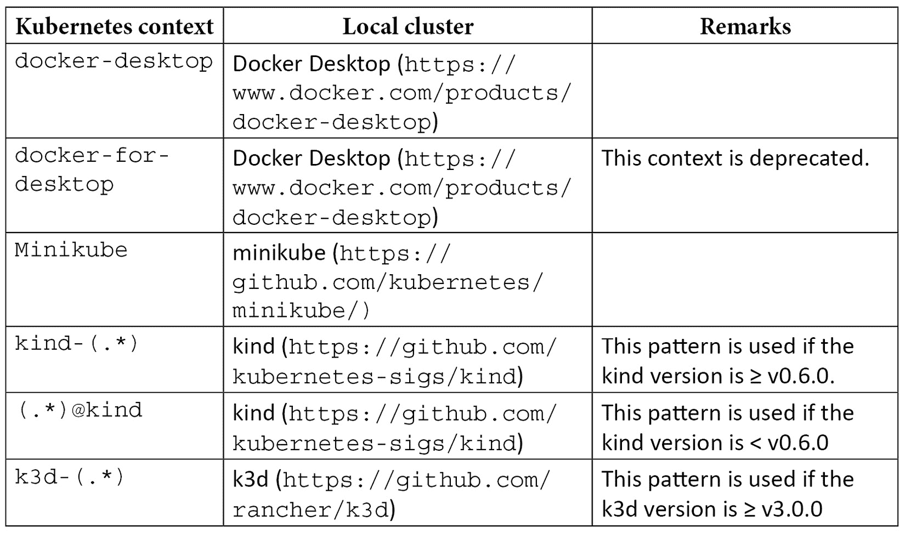
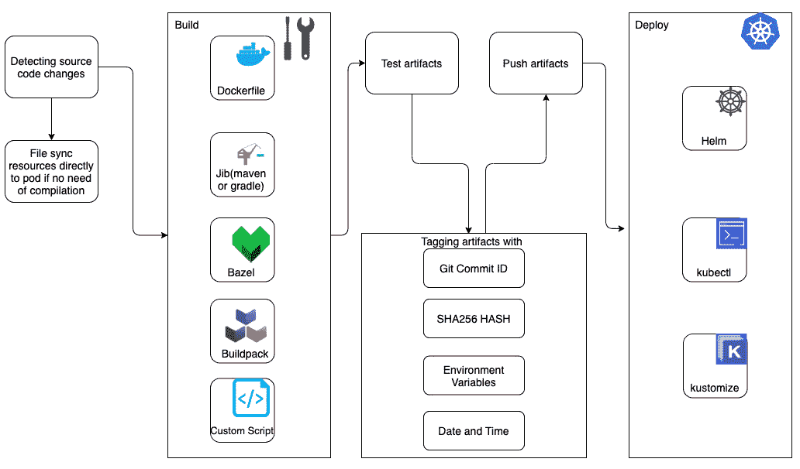
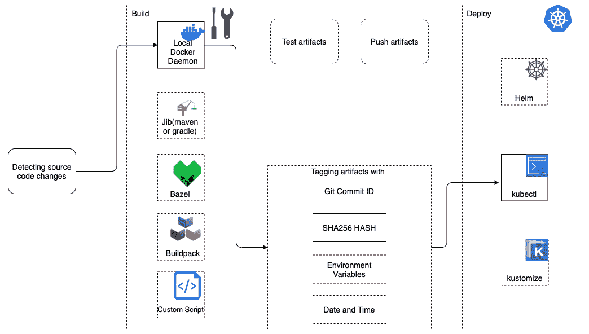
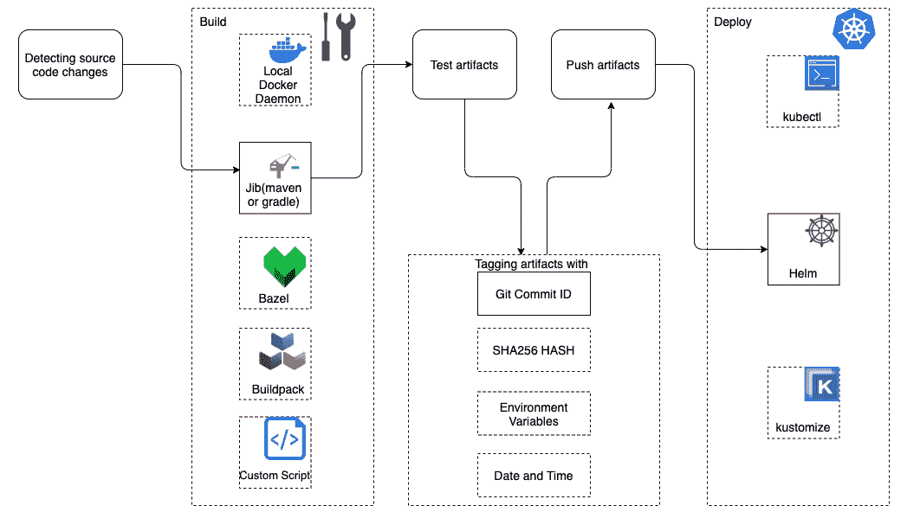
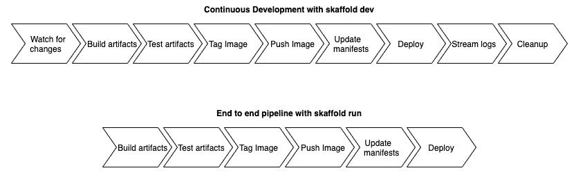
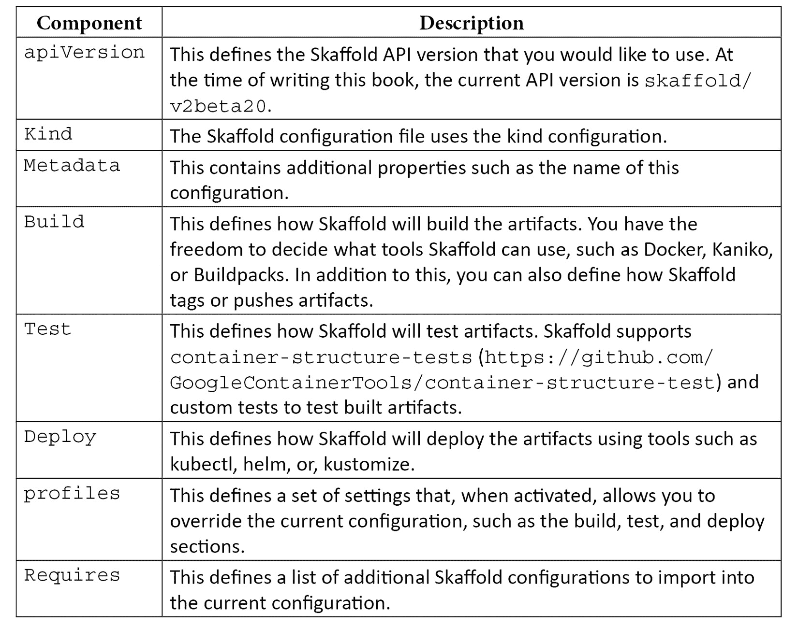
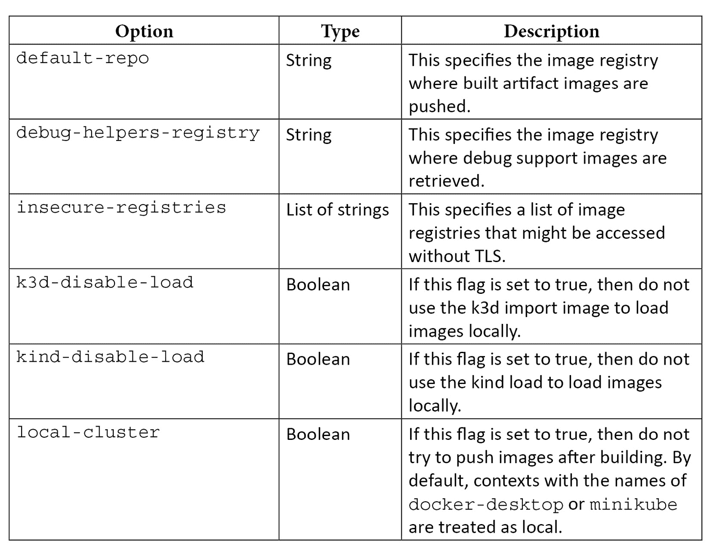

# 第四章：[*第四章*]：理解 Skaffold 的功能和架构

在上一章中，我们通过一些编码示例对 Skaffold 有了基本的了解。本章将介绍 Skaffold 提供的功能。此外，我们将通过查看其架构、工作流程和`skaffold.yaml`配置文件来探索 Skaffold 的内部。

在本章中，我们将涵盖以下主要主题：

+   理解 Skaffold 的功能

+   揭秘 Skaffold 的架构

+   理解 Skaffold 的工作流程

+   使用`skaffold.yaml`解密 Skaffold 的配置

通过本章结束时，您将对 Skaffold 提供的功能有扎实的了解，并通过查看其工作流程和架构来了解它是如何完成所有魔术的。

# 技术要求

要跟随本章的示例，您需要安装以下软件：

+   Eclipse ([`www.eclipse.org/downloads/`](https://www.eclipse.org/downloads/)) 或 IntelliJ IDE ([`www.jetbrains.com/idea/download/`](https://www.jetbrains.com/idea/download/))

+   Git ([`git-scm.com/downloads`](https://git-scm.com/downloads))

+   Skaffold ([`skaffold.dev/docs/install/`](https://skaffold.dev/docs/install/))

+   Docker Desktop for macOS 和 Windows ([`www.docker.com/products/docker-desktop`](https://www.docker.com/products/docker-desktop))

您可以从 GitHub 存储库[`github.com/PacktPublishing/Effortless-Cloud-Native-App-Development-Using-Skaffold`](https://github.com/PacktPublishing/Effortless-Cloud-Native-App-Development-Using-Skaffold)下载本章的代码示例。

# 理解 Skaffold 的功能

在[*第三章*]，*Skaffold – Easy-Peasy Cloud-Native Kubernetes Application Development*中，我们介绍了 Skaffold。我们通过构建和部署 Spring Boot 应用程序到本地 Kubernetes 集群来揭示了一些功能。然而，Skaffold 能做的远不止这些，让我们来看看它的一些功能。

Skaffold 具有以下功能：

+   **易于共享**：在同一团队或不同团队之间共享项目非常简单，只要他们已经安装了 Skaffold，就可以运行以下命令继续开发活动：

```
git clone repository URL
skaffold dev
```

+   **与 IDE 集成**：许多 IDE，如 IntelliJ 和 VS Code，支持由 Google 开发的**Cloud Code**插件，该插件内部使用 Skaffold 及其 API，在开发 Kubernetes 应用程序时提供更好的开发者体验。使用 IntelliJ 或 VS code 的**Google Cloud Code Extension**插件可以更轻松地使用其代码补全功能创建、编辑和更新`skaffold.yaml`文件。例如，为了让您对此有更多的上下文，插件可以通过查看`skaffold.yaml`配置文件来检测项目是否正在使用 Skaffold 进行构建和部署：


图 4.1 – IntelliJ Cloud code 插件检测到 Skaffold 配置

您还可以使用代码补全功能查找 Skaffold 支持的构建器和部署器。我们将在*第七章*中专门介绍 Cloud Code 插件，*使用 Cloud Code 插件构建和部署 Spring Boot 应用程序*。

+   **文件同步**：Skaffold 具有出色的文件同步功能。它可以直接将更改的文件复制到已经运行的容器中，以避免重新构建、重新部署和重新启动容器。

我们将在*第五章*中了解更多信息，*安装 Skaffold 并揭秘其流水线阶段*。

+   **超快速本地开发**：在上一章中，您了解到使用 Skaffold 构建和部署应用程序非常快速，因为它可以确定您的 Kubernetes 上下文是否设置为本地 Kubernetes 集群，并且将避免将镜像推送到远程容器注册表。因此，您可以避免昂贵的网络跳跃，同时也可以延长笔记本电脑的电池寿命。

不仅如此，Skaffold 实时检测您的代码更改，并自动化构建、推送和部署工作流程。因此，您可以在内部开发循环中继续工作，专注于编码，而无需离开该循环，直到您完全确定所做的更改。这不仅加快了您的内部开发循环，还使您更加高效。

+   **轻松的远程开发**：到目前为止，在阅读本书时，你可能会认为 Skaffold 只能加速内部开发循环。哦，天哪！你会惊喜地发现 Skaffold 也可以处理外部开发循环工作流。例如，你可以使用 Skaffold 创建成熟的生产就绪的 CI/CD 流水线。我们将在*第九章*中具体介绍这一点，*使用 Skaffold 创建生产就绪的 CI/CD 流水线*。不仅如此，你还可以使用命令如`kubectl config use-context context-name`在本地开发环境中切换 Kubernetes 上下文，并将部署到你选择的远程集群。

由于我们正在讨论远程开发，我想强调另一点——如果你正在使用`jib-maven`插件进行远程构建（即，如果你要推送到远程容器注册表），你就不需要运行 Docker 守护进程。你也可以使用像**Google Cloud Build**这样的工具进行远程构建。Cloud Build 是**Google Cloud Platform**提供的一项服务，你可以使用它在云中执行构建，并为云原生应用程序创建无服务器 CI/CD 流水线。如果你从本地系统运行它可能会比较慢，但值得探索。

+   **内置镜像标签管理**：在上一章中，在声明 Kubernetes 部署清单时，我们只提到了镜像名称，而没有在构建和部署 Spring Boot 应用程序时提到镜像标签。例如，在上一章的以下片段中，在`image:`字段中，我们只提到了镜像名称：

```
 spec:
      containers:
        - image: docker.io/hiashish/skaffold-introduction
          name: skaffold-introduction
```

通常，我们必须在推送之前给镜像打标签，然后在拉取时使用相同的镜像标签。例如，你还必须以以下格式指定镜像标签：

```
- image: imagename:imagetag
```

这是因为 Skaffold 会在每次重新构建镜像时自动生成镜像标签，这样你就不必手动编辑 Kubernetes 清单文件。Skaffold 的默认标记策略是`gitCommit`。

我们将在*第五章*中更详细地介绍这一点，*安装 Skaffold 并揭秘其流水线阶段*。

+   **轻量级**：Skaffold 完全是一个 CLI 工具。在使用 Skaffold 时不需要寻找服务器端组件。这使得它非常轻量、易于使用，而且没有维护负担。Skaffold 二进制文件的大小约为 63MB。

+   **可插拔架构**：Skaffold 具有可插拔架构。这最终意味着您可以选择构建和部署工具。自带您自己的工具，Skaffold 将相应地调整自己。

+   **专为 CI/CD 流水线而设计**：Skaffold 可以帮助您创建有效的 CI/CD 流水线。例如，您可以使用`skaffold run`命令执行端到端的流水线，或者使用诸如`skaffold build`或`skaffold deploy`之类的单独命令。

此外，通过诸如`skaffold render`和`skaffold apply`之类的命令，您可以为应用程序创建**GitOps**风格的持续交付工作流程。GitOps 允许您将应用程序的期望状态存储在 Git 存储库中，以 Kubernetes 清单的形式。它还允许其他人将您的基础架构视为代码。

+   **轻松的环境管理**：Skaffold 允许您为不同的环境定义、构建、测试和部署配置。您可以为开发或分段保留一组配置，为生产保留另一组配置。此外，您可以根据每个环境保持完全不同的配置。您可以通过使用 Skaffold 配置文件来实现这一点。这与为 Spring Boot 应用程序提供的`profiles`功能相对类似。

请参考以下截图：


图 4.2 – Skaffold 配置文件

典型的 Skaffold 配置文件包括以下部分：

+   `构建`

+   `测试`

+   `激活`

+   `部署`

+   `名称`

+   `补丁`

其中一些部分是相当明显的，因为它们解释了配置文件的唯一名称、构建步骤、部署步骤以及如何测试图像。让我们继续讨论补丁和激活。

首先，让我们了解补丁。

### Skaffold 配置文件补丁

顾名思义，补丁是一种更详细的方式，用于覆盖`skaffold.yaml`文件中的单个值。例如，在以下代码片段中，`dev`配置文件定义了第一个构件的不同`Dockerfile`，而不是覆盖整个构建部分：

```
build:
  artifacts:
    - image: docker.io/hiashish/skaffold-example
      docker:
        dockerfile: Dockerfile
    - image: docker.io/hiashish/skaffold2
    - image: docker.io/hiashish/skaffold3
deploy:
  kubectl:
    manifests:
      - k8s-pod
profiles:
  - name: dev
    patches:
      - op: replace 
        path: /build/artifacts/0/docker/dockerfile
        value: Dockerfile_dev
```

在这里，`patches`部分下面的`op`字符串指定了此补丁要执行的操作。`path`字符串指定了`.yaml`文件中您在`op`字符串中定义的操作发生的位置，`value`对象指定了应替换的值。

支持以下操作：

+   添加

+   删除

+   替换

+   移动

+   复制

+   测试

总之，在这里，我们指示 Skaffold 使用名为`Dockerfile_dev`的不同`Dockerfile`替换用于构建第一个`docker.io/hiashish/skaffold-example`镜像的`Dockerfile`。

现在，让我们讨论配置文件中的激活对象。

### Skaffold 配置文件激活

您可以通过以下两种方式之一在 Skaffold 中激活配置文件：

+   使用 CLI

+   使用`skaffold.yaml`激活

首先，让我们讨论如何使用 CLI 激活配置文件。例如，在下面的`skaffold.yaml`文件中，在`profiles`部分下面，我们声明了一个名为`gcb`的配置文件名称：

```
apiVersion: skaffold/v2beta20
kind: Config
metadata:
  name: skaffold-introduction
build:
  artifacts:
    - image: docker.io/hiashish/skaffold-introduction
      jib: { }
deploy:
  kubectl:
    manifests:
      - k8s/mydeployment.yaml
      - k8s/myservice.yaml
profiles:
  - name: gcb
    build:
      googleCloudBuild:
        projectId: gke_projectid
```

当运行`skaffold run`或`skaffold dev`命令时，可以通过传递`--profile`或`-p`CLI 标志来激活此配置文件。如果运行以下命令，则 Skaffold 将使用**Google Cloud Build**来构建这些构件：

```
skaffold run -p gcb
```

请注意，我们在`gcb`配置文件下面没有指定`deploy`部分。这意味着 Skaffold 将继续使用`kubectl`进行部署。如果您的用例需要多个配置文件，您可以多次使用`-p`标志或传递逗号分隔的配置文件，如下面的命令所示：

```
skaffold dev -p profile1,profile2
```

让我们尝试使用另一个例子来理解这个。在这个例子中，我们将使用我们在*第三章*中构建的 Spring Boot 应用程序，*Skaffold – Easy-Peasy Cloud-Native Kubernetes Application Development*。在那种情况下，我们使用 Jib 来将应用程序容器化；然而，在这个例子中，我们将使用多阶段 Docker 构建来创建我们应用程序的精简 Docker 镜像。以下是我们 Spring Boot 应用程序的`Dockerfile`：

```
FROM maven:3-adoptopenjdk-16 as build
RUN mkdir /app
COPY . /app
WORKDIR /app
RUN mvn clean package
FROM adoptopenjdk:16-jre
RUN mkdir /project
COPY --from=build /app/target/*.jar /project/app.jar
WORKDIR /project
ENTRYPOINT ["java","-jar","app.jar"]
```

我们可以解释多阶段`Dockerfile`构建如下：

+   在构建的第一阶段中，我们使用`maven:3-adoptopenjdk-16`镜像使用`mvn clean package` Maven 命令构建和创建了我们的应用程序的`jar`。

+   在第二阶段，我们复制了在上一个构建阶段中制作的`jar`并基于一个明显更小的*Java 16 JRE 基础镜像*创建了一个新的最终镜像。

+   最终的 Docker 镜像不包括 JDK 或 Maven 镜像，只包括 JRE 镜像。这种方法的唯一缺点是构建时间更长，因为在构建的第一阶段需要下载所有必需的依赖项。

提示

您可以使用 Docker 多阶段构建来创建更小的应用程序 Docker 镜像。典型的 JDK 镜像大小约为 650 MB，通过使用 JRE 作为多阶段构建的最后阶段的基础镜像，我们可以将其大小减半。

此外，您还可以使用 Java 工具如`jdeps`和`jlink`（在 Java 9 中引入）进一步减小镜像的大小。`jdeps`帮助您识别所需的 JVM 模块，`jlink`允许您创建定制的 JRE。通过这些工具的组合，您可以创建一个定制的 JRE，从而使您的应用程序的 Docker 镜像更加精简。

为了演示配置文件的使用，我们将对`skaffold.yaml`文件进行以下更改。以下是我们在`skaffold.yaml`文件中添加了一个名为`docker`的新配置文件：

```
apiVersion: skaffold/v2beta20
kind: Config
metadata:
  name: skaffold-introduction
build:
  artifacts:
    - image: docker.io/hiashish/skaffold-introduction
      jib: { }
deploy:
  kubectl:
    manifests:
      - k8s/mydeployment.yaml
      - k8s/myservice.yaml
profiles:
  - name: docker
    build:
      artifacts:
        - image: docker.io/hiashish/skaffold-introduction
          docker:
            dockerfile: Dockerfile
```

我们将使用`skaffold run --profile docker`命令来构建和部署我们的 Spring Boot 应用程序。以下是输出：

```
Generating tags...
- docker.io/hiashish/skaffold-introduction -> docker.io/hiashish/skaffold-introduction:fcda757-dirty
Checking cache...
- docker.io/hiashish/skaffold-introduction: Not found. Building
Starting build...
Found [minikube] context, using local docker daemon.
Building [docker.io/hiashish/skaffold-introduction]...
Sending build context to Docker daemon  128.5kB
Step 1/10 : FROM maven:3-adoptopenjdk-16 as build
3-adoptopenjdk-16: Pulling from library/maven
........
ecf4fc483ced: Pull complete
Status: Downloaded newer image for maven:3-adoptopenjdk-16
---> 8bb5929b61c3
Step 2/10 : RUN mkdir /app
---> Running in ff5bf71356dc
---> 83040b88c925
Step 3/10 : COPY . /app
---> 5715636b31d8
Step 4/10 : WORKDIR /app
---> Running in 6de38bef1b56
---> ca82b0631625
Step 5/10 : RUN mvn clean package -DskipTests
---> Running in 91df70ce44fa
[INFO] Scanning for projects...
Downloading from repository.spring.milestone: https://repo.spring.io/milestone/org/springframework/boot/spring-boot-starter-parent/2.5.0-M1/spring-boot-starter-parent-2.5.0-M1.pom
........
[INFO] BUILD SUCCESS
```

在前面的日志中，您可以看到，首先，Skaffold 开始使用 Docker 构建我们的镜像。此外，我们使用了多阶段构建，然后在步骤 1 到 6 中，我们进入了构建的第一阶段，在其中我们在容器内创建了我们应用程序的`jar`：

```
Step 6/10 : FROM adoptopenjdk:16-jre
16-jre: Pulling from library/adoptopenjdk
c549ccf8d472: Already exists
........
23bb7f46497d: Pull complete
Digest: sha256:f2d0e6433fa7d172e312bad9d7b46ff227888926f2fe526 c731dd4de295ef887
Status: Downloaded newer image for adoptopenjdk:16-jre
---> 954409133efc
Step 7/10 : RUN mkdir /project
---> Running in abfd14b21ac6
---> 2ab11f2093a3
Step 8/10 : COPY --from=build /app/target/*.jar /project/app.jar
---> 52b596edfac9
Step 9/10 : WORKDIR /project
---> Running in 473cbb6d878d
---> b06856859039
Step 10/10 : ENTRYPOINT ["java","-jar","app.jar"]
---> Running in 6b22aee242d2
---> f62822733ebd
Successfully built f62822733ebd
Successfully tagged hiashish/skaffold-introduction:fcda757-dirty
```

在*步骤 6 到 10*中，我们处于构建的第二阶段，我们使用`adoptopenjdk:16-jre`作为基础镜像，因为我们只需要 JRE 来运行我们的应用程序。通常，JRE 镜像比 JDK 镜像要小。

这个最终的输出是我们的容器化应用程序，应该如下所示：

```
Starting test...
Tags used in deployment:
- docker.io/hiashish/skaffold-introduction -> docker.io/hiashish/skaffold-introduction:f62822733ebd832cab
 058e5b0282af6bb504f60be892eb074f980132e3630d88
Starting deploy...
- deployment.apps/skaffold-introduction created
- service/skaffold-introduction created
Waiting for deployments to stabilize...
- deployment/skaffold-introduction is ready.
Deployments stabilized in 4.378 seconds
```

最后，Skaffold 将我们的容器化应用部署到本地 Kubernetes 集群。

激活配置文件的另一种方法是在`skaffold.yaml`中使用激活对象数组自动激活配置文件，具体取决于以下内容：

+   `kubeContext`

+   一个环境变量：`env`

+   一个 Skaffold 命令

请参考以下截图：


图 4.3 - 使用 skaffold.yaml 文件激活 Skaffold 配置文件

让我们尝试使用一个例子来理解这个激活选项。

在下面的代码示例中，我们有两个配置文件——`profile-staging`和`profile-production`。正如它们的名称所暗示的，`profile-staging`将用于分段环境，而`profile-production`将用于生产环境：

```
build:
  artifacts:
    - image: docker.io/hiashish/skaffold-introduction
      jib: { }
deploy:
  kubectl:
    manifests:
      - k8s/mydeployment.yaml
      - k8s/myservice.yaml
profiles:
  - name: profile-staging
    activation:
      - env: ENV=staging
  - name: profile-production
    build:
      googleCloudBuild:
        projectId: gke_projectid
    activation:
      - env: ENV=production
      - kubeContext: gke_cluster
        command: run
```

在这里，如果`ENV`环境变量键匹配值分段，`profile-staging`将自动激活。我们没有为此特定配置文件指定构建、测试和部署步骤，因此它将继续使用我们在`skaffold.yaml`文件的主要部分中提供的选项。除此之外，只有在满足以下条件时，`profile-production`才会自动激活。请注意，只有在满足所有这些条件时，它才会运行配置文件生产阶段：

+   `ENV`环境变量键匹配值生产。

+   Kubernetes 上下文设置为**GKE**（即**Google Kubernetes Engine**的缩写）。

+   使用的 Skaffold 命令是`scaffold run`。

请注意，`profile-production`将使用 Google 的 Cloud Build 进行构建，并默认使用`kubectl`进行部署（因为没有明确指定）。

这种分离还允许您在不同的环境中使用各种工具进行构建和部署。例如，您可能会在本地开发中使用 Docker 创建映像，而在生产中使用`Jib`。在部署的情况下，您可能会在开发中使用`kubectl`，而在生产中使用 Helm。

在上一章中，我解释了 Skaffold 默认情况下会从位于`${HOME}/.kube/config`路径的`kube config`文件中查找当前的 Kubernetes 上下文。如果您希望更改它，可以在运行`skaffold dev`命令时进行更改：

```
skaffold dev --kube-context <myrepo>
```

您还可以在`skaffold.yaml`文件中提到`kubeContext`，如下所示：

```
deploy:
  kubeContext: docker-desktop
```

通过 CLI 传递的标志优先于`skaffold.yaml`文件。

接下来，让我们讨论 Skaffold 如何配置或调整自己以适应不同的本地 Kubernetes 集群。

### 本地 Kubernetes 集群

到目前为止，您应该已经意识到 Skaffold 提供了明智的、智能的默认值，使开发过程更加轻松，而无需告诉它要做什么。如果您的 Kubernetes 上下文设置为本地 Kubernetes 集群，那么就没有必要将映像推送到远程 Kubernetes 集群。相反，Skaffold 将映像移动到本地 Docker 守护程序，以加快开发周期。

到目前为止，我们只讨论了与 Docker Desktop 一起提供的 Kubernetes 集群，但这并不是您唯一的选择。有多种方式可以设置和运行本地 Kubernetes 集群。例如，在创建本地 Kubernetes 集群时，您有以下选择：

+   Docker Desktop ([`docs.docker.com/desktop/kubernetes/#enable-kubernetes`](https://docs.docker.com/desktop/kubernetes/#enable-kubernetes))

+   Minikube ([`minikube.sigs.k8s.io/docs/`](https://minikube.sigs.k8s.io/docs/))

+   Kind ([`kind.sigs.k8s.io/`](https://kind.sigs.k8s.io/))

+   k3d ([`k3d.io/`](https://k3d.io/))

如果这些支持的 Kubernetes 安装可用于本地开发，则 Skaffold 期望 Kubernetes 的上下文如下表所示。否则，它将假定我们正在部署到远程 Kubernetes 集群。

根据以下表格中描述的 Kubernetes 上下文名称，Skaffold 会检测本地集群：



表 4.1 - Skaffold 支持的 Kubernetes 上下文

然而，对于其他非标准的本地集群设置，比如使用自定义配置运行`minikube`（例如，`minikube` `start -p my-profile`），您可以使用以下命令告诉 Skaffold 您正在使用本地 Kubernetes 集群：

1.  首先，使用以下命令为 Skaffold 设置 Docker 环境：

```
source <(minikube docker-env -p my-profile)
```

1.  然后，使用以下命令指示 Skaffold 将`my-profile`视为本地集群：

```
$ skaffold config set --kube-context my-profile local-cluster true
```

在本节中，我们深入探讨了 Skaffold 提供的功能。现在，让我们讨论 Skaffold 的架构。

# 解密 Skaffold 的架构

如前所述，Skaffold 的设计考虑了可插拔性。以下是 Skaffold 架构的可视化：



图 4.4 - Skaffold 架构

从这个架构图中，您可以得出结论，Skaffold 具有模块化设计。但是，什么是模块化设计？

嗯，模块化设计，或者说设计中的模块化，是一种将系统细分为称为模块的较小部分的设计原则，这些模块可以独立创建、修改、替换或与其他模块或不同系统之间交换。

有了这个定义，我们可以为 Skaffold 定义以下模块：

+   容器镜像构建器

+   容器测试工具/策略

+   容器映像标签器

+   容器部署工具

现在，让我们更详细地讨论每个这些工具/模块。目前，Skaffold 支持以下容器映像构建器：

+   **Dockerfile**

+   **Jib（Maven 和 Gradle）**

+   **Bazel**

+   **Cloud-Native Buildpacks**

+   **自定义脚本**

对于部署到 Kubernetes，Skaffold 支持以下工具：

+   **Helm**

+   **kubectl**

+   **kustomize**

我们将在*第六章*中更详细地讨论这些选项，*使用 Skaffold 容器映像构建器和部署器*。

Skaffold 支持管道阶段之间的以下类型测试：

+   自定义测试

+   容器结构测试

我们将在*第五章*中进一步探讨这些选项，*安装 Skaffold 并揭秘其流水线阶段*。

如前所述，在 Skaffold 的**功能**部分下，Skaffold 提供了内置的映像标签管理。目前，Skaffold 支持多个标签器和标签策略来对映像进行标记：

+   `gitCommit`标签器

+   `inputDigest`标签器

+   `envTemplate`标签器

+   `datetime`标签器

+   `customTemplate`标签器

+   `sha256`标签器

通过 IntelliJ Cloud Code 插件的代码完成功能，很容易知道支持哪种映像标签策略。假设您没有在`skaffold.yaml`文件中指定映像标签策略；在这种情况下，默认策略是`gitCommit`标签器：

看一下以下截图：


图 4.5 – Skaffold 支持的映像标签策略

现在，考虑到 Skaffold 的可插拔架构，您可以使用**本地 Docker 守护程序**来构建映像，使用`kubectl`部署到`minikube`，或者任何其他支持的本地 Kubernetes 集群。在这种情况下，Skaffold 将不会将映像推送到远程注册表，您甚至可以通过使用`-skipTests`标志跳过容器结构测试。

以下图表显示了在这种情况下用于本地开发的工具：



图 4.6 – Skaffold 在开发中

而在生产场景中，您可能会使用 Jib Maven 或 Gradle 插件来构建映像，测试构件，将其推送到远程注册表，最后使用 Helm 将其部署到远程 Kubernetes 集群。

以下图表显示了生产场景中使用的工具：



图 4.7–生产中的 Skaffold

这完成了我们对 Skaffold 架构的深入分析。现在，让我们讨论 Skaffold 的工作流程。

# 理解 Skaffold 的工作流程

通常，Skaffold 以两种模式工作，即*连续开发*或*端到端管道*，通过命令如`skaffold dev`和`skaffold run`。例如，当您运行`skaffold dev`命令时，Skaffold 将执行以下步骤：

1.  接收并监视您的源代码更改。

1.  如果用户将更改的文件标记为可复制，则直接将其复制到`build`中。

1.  从源代码构建您的构件。

1.  使用`container-structure-tests`或自定义脚本测试您构建的构件。

1.  为您的构件打标签。

1.  推送您的构件（仅当 Kubernetes 上下文设置为远程集群时）。

1.  使用正确的标签更新 Kubernetes 清单。

1.  部署您的构件。

1.  使用内置的健康检查监视部署的构件。

1.  从正在运行的 pod 中流式传输日志。

1.  通过按下*Ctrl + C*清除退出时部署的任何构件。

在`skaffold run`命令的情况下，工作流程相对类似。唯一的区别是以下内容：

+   Skaffold 不会持续监视代码更改。

+   默认情况下，Skaffold 不会从正在运行的 pod 中流式传输日志。

+   在端到端管道模式结束后，Skaffold 将在*步骤 9*之后退出。

以下图表说明了我们在前面步骤中解释的连续开发和端到端管道：



图 4.8–Skaffold 工作流程

现在，您应该了解了 Skaffold 在连续开发和端到端管道模式下的工作方式。让我们看一下`skaffold.yaml`文件中可用的组件。

# 使用 skaffold.yaml 解析 Skaffold 的配置

Skaffold 需要执行的任何操作都应在`skaffold.yaml`配置文件中明确定义。在此配置文件中，您必须指定 Skaffold 必须使用哪个工具来构建图像，然后将其部署到 Kubernetes 集群。Skaffold 通常期望在当前目录中找到配置文件`skaffold.yaml`；但是，我们可以使用`--filename`标志覆盖位置。

提示

我们建议您将 Skaffold 配置文件保存在项目的根目录中。

配置文件包括以下主要组件：



表 4.2 - skaffold.yaml 文件组件

Skaffold 还支持一个全局配置文件，位于`~/.skaffold/config`路径下。以下是它支持的选项，可以在全局级别定义：



表 4.3 - Skaffold 全局配置选项

您可以使用以下命令轻松在命令行中列出、设置和取消这些选项：

```
$ skaffold config
Interact with the Skaffold configuration
Available Commands:
  list        List all values set in the global Skaffold config
  set         Set a value in the global Skaffold config
  unset       Unset a value in the global Skaffold config
```

例如，您可以将本地集群选项设置为 false。这将允许您在构建图像后将图像推送到远程注册表。请参考以下命令：

```
$ skaffold config set --global local-cluster false
set global value local-cluster to false
$ cat ~/.skaffold/config
global:
  local-cluster: false
  survey:
    last-prompted: "2021-03-20T13:42:49+05:30"
  collect-metrics: true
```

同样，您可以使用以下命令取消配置：

```
$ skaffold config unset --global local-cluster
unset global value local-cluster
$ cat ~/.skaffold/config
global:
  survey:
    last-prompted: "2021-03-20T13:42:49+05:30"
  collect-metrics: true
kubeContexts: []
```

在本节中，我们介绍了`skaffold.yaml`配置文件的组件。我们还看了一些可以通过 Skaffold CLI 命令设置的全局配置设置。

# 总结

本章向您介绍了 Skaffold 的一些特点，例如超快速的本地开发、轻松的远程开发、内置标签管理、轻量级能力和文件同步能力等。这些是令人信服的功能，将帮助您改善开发人员体验。此外，我们还看了 Skaffold 的架构，并发现 Skaffold 具有可插拔的架构。这意味着您可以随时携带自己的工具来构建和部署应用程序。接下来，我们介绍了 Skaffold 开发工作流程中通常发生的步骤。最后，在本章末尾，我们研究了 Skaffold 的主要组件和一些通过 Skaffold 配置支持的全局配置。

在本章中，主要目标是通过查看其架构和典型的开发工作流程，让您深入了解 Skaffold 的特性和内部工作原理。您已经对 Skaffold 有了深入的了解，现在您将更容易地连接前后章节之间的关系。

在下一章中，我们将介绍安装 Skaffold 的不同方法。此外，我们将探索 Skaffold CLI 命令。

# 参考

+   官方 Skaffold 文档([`skaffold.dev/docs/`](https://skaffold.dev/docs/))
