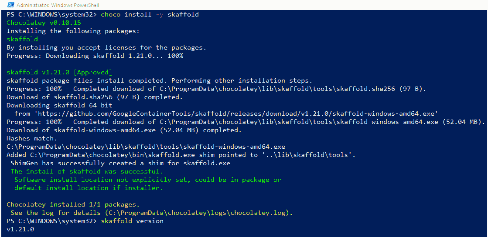
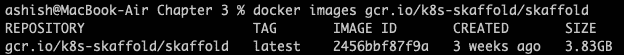
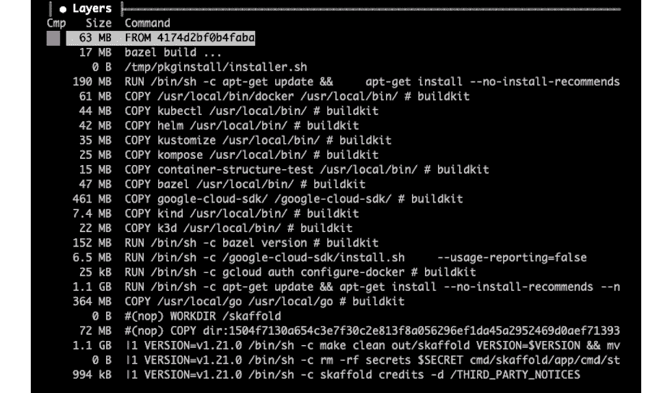
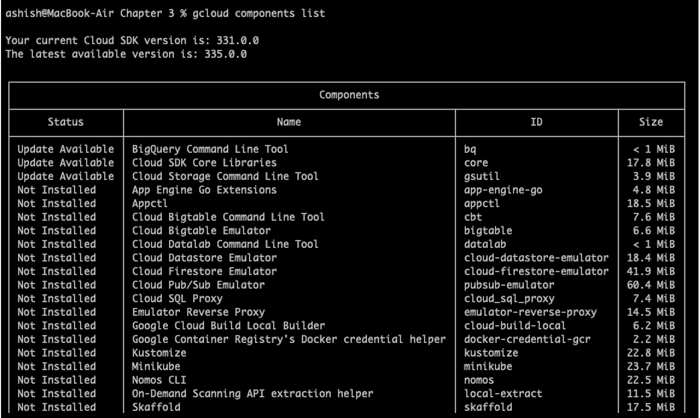
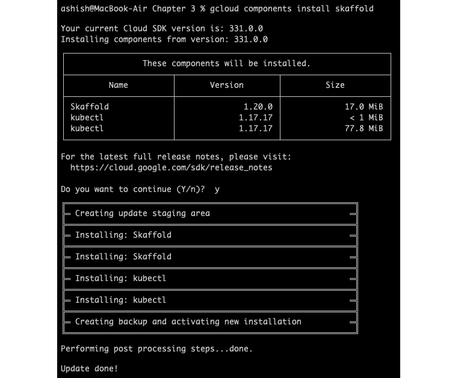
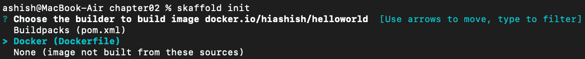
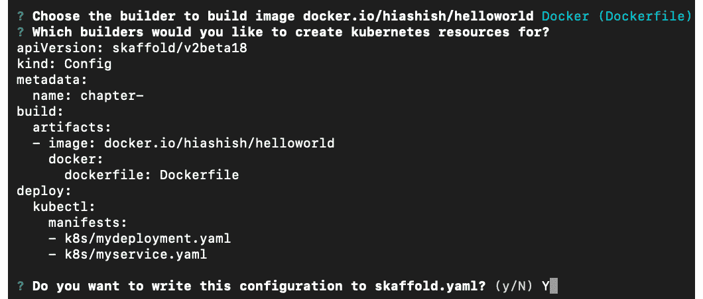
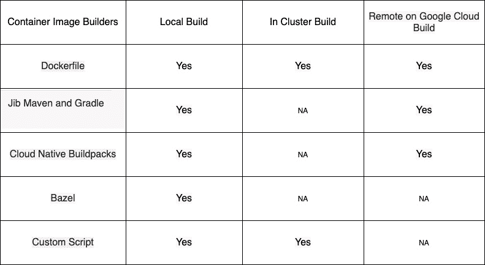
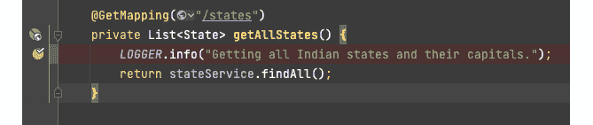
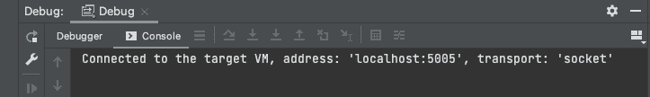

# 第五章：*第五章*：安装 Skaffold 并揭秘其流水线阶段

在上一章中，我们深入了解了 Skaffold 的架构和工作流程。我们还看了 Skaffold 的配置。本章将介绍如何在不同操作系统上安装 Skaffold，如 Linux、Windows 和 macOS。我们还将探讨常见的 CLI 命令以及如何在 Skaffold 的不同流水线阶段中使用这些命令。

在本章中，我们将讨论以下主要主题：

+   安装 Skaffold

+   理解常见的 CLI 命令

+   理解 Skaffold 的流水线阶段

+   使用 Skaffold 进行调试

在本章结束时，您将了解如何在不同平台上安装 Skaffold。您还将对 Skaffold 最常用的 CLI 命令有扎实的理解。

# 技术要求

要跟着本章的示例进行操作，您需要以下内容：

+   Skaffold CLI ([`skaffold.dev/docs/install/`](https://skaffold.dev/docs/install/))

+   minikube ([`minikube.sigs.k8s.io/docs/`](https://minikube.sigs.k8s.io/docs/)) 或者 macOS 和 Windows 上的 Docker Desktop ([`www.docker.com/products/dockerdesktop`](https://www.docker.com/products/dockerdesktop))

# 安装 Skaffold

Skaffold 作为一个 CLI 工具，需要首先在您喜欢的操作系统上下载和安装。以下是支持的平台，您可以在这些平台上下载和安装 Skaffold：

+   Linux

+   macOS

+   Windows

+   Docker

+   Google Cloud SDK

让我们详细讨论这些选项。

## 在 Linux 上安装 Skaffold

对于 Linux，您可以使用以下 URL 来下载最新的稳定版本 Skaffold：

+   [`storage.googleapis.com/skaffold/releases/latest/skaffold-linux-amd64`](https://storage.googleapis.com/skaffold/releases/latest/skaffold-linux-amd64)

+   [`storage.googleapis.com/skaffold/releases/latest/skaffold-linux-arm64`](https://storage.googleapis.com/skaffold/releases/latest/skaffold-linux-arm64)

下载二进制文件后，您可以将其添加到`PATH`变量中。或者，您可以使用以下命令。

对于 AMD64 上的 Linux，请使用以下命令：

```
curl -Lo skaffold https://storage.googleapis.com/skaffold/releases/latest/skaffold-linux-amd64 && \sudo install skaffold /usr/local/bin/
```

对于 ARM64 上的 Linux，请使用以下命令：

```
curl -Lo skaffold https://storage.googleapis.com/skaffold/releases/latest/skaffold-linux-arm64 && \sudo install skaffold /usr/local/bin/
```

还有一个最新版本的 Skaffold，它是使用最新提交构建的。它可能不是一个稳定的版本，所以在使用时要小心。您可以使用以下 URL 来下载最新版本的 Skaffold。

对于 AMD64 上的 Linux，请执行以下操作：

```
curl -Lo skaffold https://storage.googleapis.com/skaffold/builds/latest/skaffold-linux-amd64 && \sudo install skaffold /usr/local/bin/
```

对于 ARM64 架构的 Linux，请执行以下操作：

```
curl -Lo skaffold https://storage.googleapis.com/skaffold/builds/latest/skaffold-linux-arm64 && \sudo install skaffold /usr/local/bin/
```

在本节中，我们查看了在 Linux 操作系统（OS）上安装 Skaffold 的命令。

## 在 macOS 上安装 Skaffold

对于 macOS，您可以使用以下 URL 下载 Skaffold 的最新稳定版本：

+   [`storage.googleapis.com/skaffold/releases/latest/skaffold-darwin-amd64`](https://storage.googleapis.com/skaffold/releases/latest/skaffold-darwin-amd64)

+   [`storage.googleapis.com/skaffold/releases/latest/skaffold-darwin-arm64`](https://storage.googleapis.com/skaffold/releases/latest/skaffold-darwin-arm64)

下载二进制文件后，您可以将其添加到`PATH`变量中。或者，您可以使用以下命令。

对于 AMD64 架构的 macOS，请使用以下命令：

```
curl -Lo skaffold https://storage.googleapis.com/skaffold/releases/latest/skaffold-darwin-amd64 && \sudo install skaffold /usr/local/bin/
```

对于 ARM64 架构的 macOS，请使用以下命令：

```
curl -Lo skaffold https://storage.googleapis.com/skaffold/releases/latest/skaffold-darwin-amd64 && \sudo install skaffold /usr/local/bin/
```

要下载具有最新提交的构建，可以使用以下命令。

对于 AMD64 架构的 macOS，请使用以下命令：

```
curl -Lo skaffold https://storage.googleapis.com/skaffold/builds/latest/skaffold-darwin-amd64 && \sudo install skaffold /usr/local/bin/
```

对于 ARM64 架构的 macOS，请使用以下命令：

```
curl -Lo skaffold https://storage.googleapis.com/skaffold/builds/latest/skaffold-darwin-amd64 && \sudo install skaffold /usr/local/bin/
```

特别是对于 macOS，您可以使用以下软件包管理器下载 Skaffold。

对于 Homebrew，请使用以下命令：

```
brew install skaffold
```

对于 MacPorts，请使用以下命令：

```
sudo port install skaffold
```

在本节中，我们探讨了在 macOS 上安装 Skaffold 的各种命令。

## 在 Windows 上安装 Skaffold

对于 Windows，您可以使用以下 URL 下载 Skaffold 的最新稳定版本：

[`storage.googleapis.com/skaffold/releases/latest/skaffold-windows-amd64.exe`](https://storage.googleapis.com/skaffold/releases/latest/skaffold-windows-amd64.exe)

下载 EXE 文件后，您可以将其添加到`PATH`变量中。

要下载具有最新提交的构建，可以使用以下 URL：

[`storage.googleapis.com/skaffold/builds/latest/skaffold-windows-amd64.exe`](https://storage.googleapis.com/skaffold/builds/latest/skaffold-windows-amd64.exe)

特别是对于 Windows，您可以使用以下 Chocolatey 软件包管理器命令下载 Skaffold：

```
choco install -y skaffold
```

以下是输出：



图 5.1 - 在 Windows 上安装 Skaffold

注意

`skaffold dev`命令存在已知问题（https://github.com/chocolatey/shimgen/issues/32），在 Windows 上使用 Chocolatey 软件包管理器安装时，按下*Ctrl* + *C*时 Skaffold 不会清理部署。问题与 Skaffold 无关，而是与 Chocolatey 在安装过程中如何干扰*Ctrl* + *C*处理有关。

本节介绍了如何在 Windows 上安装 Skaffold。

## 使用 Docker 安装 Skaffold

您还可以下载并在 Docker 容器中运行 Skaffold。要做到这一点，您可以使用以下`docker run`命令：

```
docker run gcr.io/k8s-skaffold/skaffold:latest skaffold <command>
```

要使用最新提交的边缘构建，您可以使用以下命令：

```
docker run gcr.io/k8s-skaffold/skaffold:edge skaffold <command>
```

我想强调一个关于使用 Docker 图像的 Skaffold 的要点。 Docker 图像的大小约为~3.83 GB，这对于 Skaffold 来说似乎过大，因为在*第三章*中，*Skaffold – Easy-Peasy Cloud-Native Kubernetes Application Development*，我们了解到 Skaffold 的二进制大小约为~63 MB。这可以在以下截图中看到：



图 5.2 – Skaffold Docker 图像大小

那么，为什么图像大小如此之大？这是因为图像还包含其他工具，如 gcloud SDK，kind，minikube，k3d，kompose 和 bazel 等。

您可以使用 Dive CLI 验证容器图像中的内容。

提示

Dive 允许您检查图像层的内容，并建议不同的方法来缩小图像的大小，如果您浪费了任何空间。

您可以按照[`github.com/wagoodman/dive#installation`](https://github.com/wagoodman/dive#installation)上的说明下载 Dive。运行以下命令以查看容器图像的内部视图：

```
$ dive image tag/id/digest
```

以下是 Skaffold docker 图像的输出，其中包含一个图像层：



图 5.3 – Skaffold Docker 图像层

从图像内部的层可以看出，我们有许多可用的工具，而不仅仅是 Skaffold。使用此 Docker 图像的另一个优势是，您不必单独安装这些工具，而且可以使用相同的图像来玩耍或尝试这些工具。

本节介绍了如何使用 Docker 图像安装 Skaffold。

## 使用 gcloud 安装 Skaffold

Google 开发了 Skaffold，因此它很好地适应了 Google 产品生态系统。如果您的机器上安装了**Google 的 Cloud SDK**，您可以使用`gcloud components install skaffold`命令来安装 Skaffold。

我们将在*第八章*中介绍如何安装 gcloud SDK，*使用 Skaffold 将 Spring Boot 应用部署到 Google Kubernetes Engine*。目前，我们可以假设 Cloud SDK 已经安装。您可以使用`gcloud list`命令查看已安装和未安装的组件。以下是输出：



图 5.4 – gcloud list 命令输出

从前面的输出可以清楚地看出，Skaffold 未安装。虽然这不是强制性的，但在我们继续安装之前，请确保已安装`gcloud`并且其组件是最新的。我们可以运行以下命令来执行此操作：

```
gcloud components update
```

最后，我们可以使用以下`gcloud`命令安装 Skaffold：

```
gcloud components install skaffold
```

以下是输出：



图 5.5 – 通过 gcloud 安装 Skaffold

在本节中，我们讨论了安装 Skaffold 的不同方法。现在，让我们讨论 Skaffold CLI 命令。

# 理解常见的 CLI 命令

到目前为止，我们已经向您介绍了诸如`skaffold dev`和`skaffold run`之类的命令，但是还有许多类似的命令，您可以在 CI/CD 流水线中使用这些命令来创建端到端的流水线或单独使用。我们将把这些命令分类如下。您还可以通过启用`skaffold completion bash/zsh`命令并在输入命令后按*Tab*键来发现这些命令的支持选项：

+   **端到端流水线的命令**：

+   `skaffold run`：此命令允许您构建和部署一次。

+   `skaffold dev`：此命令允许您触发用于构建和部署的持续开发循环。此工作流将在退出时清理。

+   `skaffold debug`：此命令允许您以*调试模式*触发用于构建和部署流水线的持续开发循环。此工作流也将在退出时清理。

+   **CI/CD 流水线的命令**：

+   `skaffold build`：此命令允许您只构建、标记和推送您的镜像。

+   `skaffold test`：此命令允许您针对构建的应用程序镜像运行测试。

+   `skaffold deploy`：此命令允许您部署给定的镜像。

+   `skaffold delete`：此命令允许您清理已部署的构件。

+   `skaffold render`：此命令允许您构建应用程序映像，然后将经过填充（使用新构建的映像标签）的 Kubernetes 清单导出到文件或终端。

+   `skaffold apply`：此命令以模板化的 Kubernetes 清单作为输入，在目标集群上创建资源。

+   **入门命令**：

+   `skaffod init`：此命令允许您引导 Skaffold 配置。

+   `skaffold fix`：此命令允许您升级模式版本。

+   **其他命令**：

+   `skaffold help`：此命令允许您打印帮助信息。使用`skaffold options`获取全局命令行选项的列表（适用于所有命令）。

+   `skaffold version`：此命令允许您获取 Skaffold 的版本。

+   `skaffold completion`：此命令允许您为 CLI 设置选项卡完成。它支持与`skaffold version`相同的选项。

+   `skaffold config`：此命令允许您管理特定上下文的参数。它支持与`skaffold version`相同的选项。

+   `skaffold credits`：此命令允许您将第三方通知导出到指定路径（默认为`./skaffold-credits`）。它支持与`skaffold version`相同的选项。

+   `skaffold diagnose`：此命令允许您运行对 Skaffold 在您的项目中的诊断。

+   `skaffold schema`：此命令允许您列出并打印用于验证`skaffold.yaml`配置的 JSON 模式。它支持与`skaffold version`相同的选项。

在本节中，我们讨论了 Skaffold 命令及其用法。在下一节中，我们将尝试了解 Skaffold 的不同流水线阶段。

# 了解 Skaffold 流水线阶段

到目前为止，我们已经对 Skaffold 的工作原理有了基本的了解。从前面的章节中，我们知道它会选择项目中的源代码更改，并使用您选择的工具创建容器映像；一旦成功构建，这些映像将根据您的要求进行标记，并推送到您指定的存储库。Skaffold 还可以帮助您在工作流程结束时将这些构件部署到您的 Kubernetes 集群中，再次使用您喜欢的工具。

Skaffold 允许您跳过阶段。例如，如果您在本地使用 Minikube 或 Docker 桌面运行 Kubernetes，Skaffold 足够智能，会为您做出选择，并不会将构件推送到远程存储库。

让我们详细了解 Skaffold 的流水线阶段，以了解每个流水线阶段中我们还有哪些选择。Skaffold 流水线阶段可以大致分为以下几个领域：

+   初始化

+   构建

+   标签

+   测试

+   部署

+   文件

+   日志尾随

+   端口转发

+   清理

让我们详细讨论每个。

## 初始化阶段

在这个阶段，我们通常会生成一个基本的 Skaffold 配置文件，以便在几秒钟内启动和运行您的项目。Skaffold 会查看您的项目目录中是否有任何构建配置文件，比如`Dockerfile`、`build.gradle`和`pom.xml`，然后自动生成构建和部署配置。

Skaffold 目前支持以下构建工具的构建检测：

+   Docker

+   Jib

+   Buildpacks

如果 Skaffold 检测到多个构建配置文件，它将提示您将构建配置文件与在部署配置中检测到的任何镜像配对。

提示

从 Skaffold v1.27.0 开始，您不再需要在`skaffold init`命令中提供`XXenableJibInit`或`XXenableBuildpacksInit`标志，因为它们的默认值已设置为`true`。这也意味着`init`命令将检测您是否应该根据项目使用 Jib 或 Buildpacks，无需指定这些标志。

例如，在运行`skaffold init`命令后，您可能会被要求从以下选项中选择。在这个例子中，我们在根目录中有一个`Dockerfile`，所以 Skaffold 要求您选择此项目的构建配置：



图 5.6 – skaffold init 提示

同样，对于部署，Skaffold 将查看您的项目目录，如果检测到一些 Kubernetes 清单 – 即`deployment.yaml`或`sevice.yaml` – 已经存在，那么它将自动将它们添加到`skaffold.yaml`文件的`deploy`部分：



图 5.7 – 生成 Skaffold 配置文件

如果您没有准备好清单，但希望 Skaffold 处理清单生成部分，那么不用担心 – 您可以在`skaffold init`命令中传递`--generate-manifests`标志。

## 构建阶段

Skaffold 支持各种工具进行镜像构建。

从下表中，您可以了解到镜像构建可以在本地、集群中或远程使用 Google Cloud Build 进行：



表 5.1– Skaffold 支持的容器镜像构建器

我们将在*第六章*中了解更多关于这些选项的内容，*使用 Skaffold 容器镜像构建器和部署器*。在集群中，构建由 kaniko 或使用自定义脚本支持。远程构建仅支持使用 Cloud Build 的 Dockerfile、Jib 和 Buildpacks。对于本地构建，您几乎可以使用任何受支持的图像构建方法。

您可以通过`skaffold.yaml`文件的`build`部分设置构建配置。以下是一个示例：

```
build:
  artifacts:
    - image: docker.io/hiashish/skaffold-introduction
      jib: {}
```

既然我们已经讨论了构建阶段，接下来，我们将看一下标记阶段。

## 标记阶段

Skaffold 支持以下图像标记策略：

+   标记可通过`gitCommit 标记器`进行，它利用 Git 提交来标记图像。

+   标记可通过`sha256 标记器`进行，该标记器使用最新标记来标记图像。

+   标记可通过`envTemplate 标记器`进行，它使用**环境变量**来标记图像。

+   标记可通过`dateTime 标记器`进行，它接受当前的**日期和时间**以及可配置的模式。

+   标记可通过`customTemplate 标记器`进行，它使用现有标记器作为模板的组件组合。

可以使用`skaffold.yaml`的`build`部分中的`tagPolicy`字段来配置图像标记策略。如果未指定`tagPolicy`，则默认为`gitCommit`策略。请参考以下代码片段：

```
build:
  artifacts:
    - image: docker.io/hiashish/skaffold-introduction
      jib: {}
  tagPolicy: 
    sha256: {}
```

既然我们已经了解了 Skaffold 的不同图像标记策略，我们将进入测试阶段。

## 测试阶段

Skaffold 在构建和部署之间有一个集成测试阶段。它支持容器结构测试和集成测试的自定义测试。让我们详细讨论一下。

### 容器结构测试

Skaffold 支持在使用 Skaffold 构建的容器镜像上运行容器结构测试（https://github.com/GoogleContainerTools/container-structure-test）。容器结构测试框架主要旨在验证容器的内容和结构。例如，我们可能想在容器内运行一些命令，以测试它是否成功执行。我们可以在 Skaffold 配置中为每个图像定义测试。构建完毕后，Skaffold 将在该图像上运行相关的结构测试。如果测试失败，Skaffold 将不会继续部署。

自定义测试

使用 Skaffold 自定义测试，开发人员可以在其开发循环的一部分运行自定义命令。自定义测试将在将镜像部署到 Kubernetes 集群之前运行。该命令将在执行 Skaffold 的本地机器上执行，并与所有支持的 Skaffold 平台一起工作。您可以使用`--skip-tests`标志选择不运行自定义测试。您可以使用`skaffold test`命令单独运行测试。

以下是自定义测试的一些用例：

+   运行单元测试

+   使用 GCP Container Analysis 或 Anchore Grype 在图像上运行验证和安全扫描

+   我们还可以使用**kubeval**（[`github.com/instrumenta/kubeval`](https://github.com/instrumenta/kubeval)）或**kubeconform**（[`github.com/yannh/kubeconform`](https://github.com/yannh/kubeconform)）等工具，在部署前验证 Kubernetes 清单。

+   在 Helm 图表的情况下，我们可以在部署前使用**helm lint**命令。

在以下示例中，我们有一个名为`test`的配置文件，并且我们正在使用`mvn test`命令运行各种测试。我们将在此处使用`skaffold dev --profile=test`命令，该命令在构建后和部署前运行测试：

```
profiles:
  - name: test
    test:
      - image: docker.io/hiashish/skaffold-introduction
        custom:
          - command: mvn test -Dmaven.test.skip=false
```

在日志中，您将看到以下内容，其中说明测试已经开始，并且没有失败：

```
Starting test...
Testing images...
Running custom test command: "mvn test -Dmaven.test.skip
=false"
[INFO] Results:
[INFO] 
[INFO] Tests run: 5, Failures: 0, Errors: 0, Skipped: 0
```

有了这些，我们已经学会了如何使用 Skaffold 执行自定义测试。在部署阶段，我们将学习如何使用 Skaffold 部署应用程序。

## 部署阶段

Skaffold 部署阶段通常通过将 Kubernetes 清单中的未标记的镜像名称替换为最终标记的镜像名称来呈现 Kubernetes 清单。它还可能通过扩展 helm 的模板或计算 kustomize 的叠加来进行额外的中间步骤。然后，Skaffold 将最终的 Kubernetes 清单部署到集群中。为了确保部署发生，理想情况下，它将通过健康检查等待部署的资源稳定。

健康检查默认启用，并且是 CI/CD 流水线用例的一个重要功能，以确保部署的资源健康，并且可以在流水线中进一步进行。Skaffold 内部使用`kubectl rollout status`命令来测试部署的状态。

例如，在以下日志中，您可以看到 Skaffold 等待部署稳定：

```
Starting test...
Tags used in deployment:
 - docker.io/hiashish/skaffold-introduction -> docker.io/hiashish/skaffold-introduction:fcda757-dirty@sha256:f07c1dc192 cf5f391a1c5af8dd994b51f7b6e353a087cbcc49e754367c8825cc
Starting deploy...
 - deployment.apps/skaffold-introduction created
 - service/skaffold-introduction created
Waiting for deployments to stabilize...
 - deployment/skaffold-introduction: 0/4 nodes are available: 2 Insufficient memory, 4 Insufficient cpu.
    - pod/skaffold-introduction-59b479ddcb-f8ljj: 0/4 nodes are available: 2 Insufficient memory, 4 Insufficient cpu.
 - deployment/skaffold-introduction is ready.
Deployments stabilized in 56.784 seconds
Press Ctrl+C to exit
Watching for changes...
```

Skaffold 目前支持以下工具，用于将应用程序部署到本地或远程 Kubernetes 集群：

+   `kubectl`

+   `helm`

+   `kustomize`

您可以通过`skaffold.yaml`文件的`deploy`部分设置部署配置，如下所示：

```
deploy:
  kubectl:
    manifests:
      - k8s/mydeployment.yaml
      - k8s/myservice.yaml
```

通过这样，我们学会了如何使用 Skaffold 将镜像部署到 Kubernetes。接下来，我们将探讨如何使用文件同步直接将更改同步到 pod，而无需重新构建和重新部署镜像。

## 文件同步

Skaffold 具有一个很棒的功能，可以将更改的文件复制到部署的容器中，而无需重新构建、重新部署和重新启动相应的 pod。我们可以通过在`skaffold.yaml`文件的构件中添加带有同步规则的`sync`部分来启用此文件复制功能。在内部，Skaffold 创建一个包含与我们在`skaffold.yaml`文件中定义的同步规则匹配的更改文件的`.tar`文件。然后，这个`.tar`文件被传输到相应的容器中并在其中解压。

Skaffold 支持以下类型的同步：

+   `manual`：在此模式下，我们需要指定本地源文件路径和运行容器的目标路径。

+   `infer`：在此模式下，Skaffold 将通过查看您的 Dockerfile 来推断目标路径。在同步规则下，您可以指定哪些文件适合同步。

+   `auto`：在此模式下，Skaffold 将自动生成已知文件类型的同步规则。

为了理解**文件同步**功能，我们将使用我们在*第三章*中构建的 Spring Boot 应用程序，*Skaffold – Easy-Peasy Cloud-Native Kubernetes Application Development*。Spring Boot 应用程序公开了一个`/states` REST 端点，将返回所有印度各邦及其首府。我们在`skaffold.yaml`文件中添加了一个名为 sync 的新配置文件。

在下面的`skaffold.yaml`文件中，我们使用`jib`作为镜像构建器。Jib 与 Skaffold 集成允许您在更改后自动同步类文件、资源文件和 Jib 的额外目录文件到远程容器。但是，它只能与 Jib 一起在默认构建模式（exploded）下用于非 WAR 应用程序，因为存在一些限制。您还需要在项目中添加 Spring Boot 开发工具依赖项才能使其工作。它还可以与任何能够重新加载或重启的嵌入式服务器一起工作：

```
apiVersion: skaffold/v2beta20
kind: Config
metadata:
  name: skaffold-introduction
build:
  artifacts:
    - image: docker.io/hiashish/skaffold-introduction
      jib: { }
deploy:
  kubectl:
    manifests:
      - k8s/mydeployment.yaml
      - k8s/myservice.yaml
profiles:
  - name: sync
    build:
      artifacts:
        - image: docker.io/hiashish/skaffold-introduction
          jib: {}
          sync: 
            auto: true
```

在 Spring Boot 应用程序中，我们故意将班加罗尔的名称更改为班加罗尔。在运行`skaffold dev --profile=sync`命令后，您将在输出中看到以下内容：


图 5.8 - 同步前的输出

现在，由于我们将 Jib 的自动同步设置为`true`，对`schema.sql`文件所做的任何更改都将直接与在 Kubernetes 集群内运行的 pod 同步。我们对`schema.sql`文件进行了更改，它们通过重新启动应用程序直接与运行中的 pod 同步。在这里，我们不必重新构建镜像、推送镜像、重新部署镜像或重新启动 pod。在进行此更改后，您将在控制台的流式日志中看到以下输出：

```
: Completed initialization in 3 ms
[skaffold-introduction] 2021-07-18 21:07:03.279  INFO 1 --- [nio-8080-exec-1] c.p.c.indianstates.StateController       : Getting all states.
Syncing 1 files for docker.io/hiashish/skaffold-introduction:fcda757-dirty@sha256:f07c1dc192cf5f391a1c5af8d
d994b51f7b6e353a087cbcc49e754367c8825cc
Watching for changes...
```

再次访问 URL 后，您将看到更改后的输出：


图 5.9 - 同步后的输出

`schema.sql`在我们的资源下，所以让我们看看当我们对 Java 类文件进行更改时，是否也会被同步。让我们试一试。

为了测试这一点，我将调整我们在`StateController`类中的日志记录语句。我们有以下日志记录语句：

```
LOGGER.info("Getting all states.");
```

我们将其更改为以下内容：

```
LOGGER.info("Getting all Indian states and their capitals.");
```

在进行这些更改后，您应该在控制台的流式日志中看到以下内容。您可能会想知道为什么有五个文件被同步，因为我们只改变了一个文件。嗯，原因是 Jib 传输了整个层，其中包含您的类文件：

```
: Completed initialization in 3 ms
[skaffold-introduction] 2021-07-18 21:19:52.941  INFO 1 --- [nio-8080-exec-2] c.p.c.indianstates.StateController       : Getting all states.
Syncing 5 files for docker.io/hiashish/skaffold-introduction:fcda757-dirty@sha256:f07c1dc192cf5f391a1c5af
8dd994b51f7b6e353a087cbcc49e754367c8825cc
Watching for changes...
```

同样，在流式日志中，我们将看到更改后的日志记录语句。

```
[skaffold-introduction] 2021-07-18 21:40:46.868  INFO 1 --- [nio-8080-exec-1] c.p.c.indianstates.StateController       : Getting all Indian states and their capitals.
```

通过这样，我们已经了解了 Skaffold 的直接文件同步功能。现在，让我们了解如何使用各种 Skaffold 命令尾随日志。

## 日志尾随

Skaffold 可以为其构建和部署的容器尾随日志。有了这个功能，当您执行`skaffold dev`、`skaffold debug`或`skaffold run`时，您可以从集群尾随日志到本地机器。

默认情况下，skaffold `dev`和`skaffold debug`模式启用了日志尾随。对于 skaffold `run`，您可以使用`--tail`标志显式启用日志尾随。

对于典型的 Spring Boot 应用程序，您将在使用`skaffold dev`构建和部署后，在尾随日志中看到以下内容。

在下面的日志中，您可以看到成功构建并部署到集群后，应用程序日志被流式传输到控制台：

```
Starting test...
Tags used in deployment:
 - docker.io/hiashish/skaffold-introduction -> docker.io/hiashish/skaffold-introduction:fcda757-dirty@sha256:f07c1dc1 92cf5f391a1c5af8dd994b51f7b6e353a087cbcc49e754367c8825cc
Starting deploy...
 - deployment.apps/skaffold-introduction created
 - service/skaffold-introduction created
Waiting for deployments to stabilize...
 - deployment/skaffold-introduction: 0/4 nodes are available: 2 Insufficient memory, 4 Insufficient cpu.
    - pod/skaffold-introduction-59b479ddcb-f8ljj: 0/4 nodes are available: 2 Insufficient memory, 4 Insufficient cpu.
 - deployment/skaffold-introduction is ready.
Deployments stabilized in 56.784 seconds
Press Ctrl+C to exit
Watching for changes...
[skaffold-introduction]  
[skaffold-introduction] 2021-07-18 21:06:44.072  INFO 1 --- [  restartedMain] c.p.c.i.IndianStatesApplication          : Starting IndianStatesApplication using Java 16-ea on skaffold-introduction-59b479ddcb-f8ljj with PID 1 (/app/classes started by root in /)
```

此时，我们知道了如何使用 Skaffold 从运行的容器中尾随日志。接下来，让我们讨论 Skaffold 的端口转发。

## 端口转发

Skaffold 支持在开发、调试、部署或运行模式下自动转发服务和用户定义的端口转发。您不必暴露端点来访问您的应用程序。端口转发对于本地开发非常有帮助。Skaffold 在内部使用`kubectl port-forward`来实现端口转发。您可以在`skaffold.yaml`中明确定义自定义端口转发，或者在运行`skaffold dev`、`debug`、`run`或`deploy`时传递`--port-forward`标志。

以下是用户定义的端口转发的示例。在这个例子中，Skaffold 将尝试将端口`8080`转发到`localhost:9000`。如果由于某种原因端口`9000`不可用，那么 Skaffold 将转发到一个随机开放的端口：

```
profiles:
  - name: userDefinedPortForward
    portForward:
      - localPort: 9090
        port: 8080
        resourceName: reactive-web-app
        resourceType: deployment
```

在完成工作后，清理我们使用 Skaffold 创建的资源是一个好习惯。现在，让我们学习如何使用 Skaffold 清理和删除 Kubernetes 资源。

## 清理

通过`skaffold run`和`skaffold dev`命令，我们可以在 Kubernetes 集群中创建资源，在本地 Docker 守护程序上创建图像，并有时将图像推送到远程注册表。做所有这些工作可能会对您的本地和部署环境产生副作用，您可能会在本地环境中占用大量磁盘空间。

Skaffold 提供了清理功能来中和其中一些副作用：

+   您可以通过运行`skaffold delete`来清理 Kubernetes 资源，或者通过使用*Ctrl* + *C*来执行自动清理`skaffold dev`和`skaffold debug`。

+   可以通过传递`--no-prune=false`标志来为本地 Docker 守护程序镜像启用图像修剪。由于默认情况下启用了工件缓存，您需要禁用该功能才能进行清除。您需要运行的实际命令是`skaffold dev --no-prune=false --cache-artifacts=false`。通过按下`skaffold dev`和`skaffold debug`的*Ctrl* + *C*，Skaffold 将自动清理存储在本地 Docker 守护程序上的图像。

+   对于已推送到远程容器注册表的图像，用户必须负责清理工作。

例如，为了测试图像修剪，我们可以使用以下`docker`配置文件来使用我们的本地 Docker 守护程序构建图像：

```
  - name: docker
    build:
      artifacts:
        - image: docker.io/hiashish/skaffold-introduction
          docker:
            dockerfile: Dockerfile
```

然后，我们可以运行`skaffold dev --no-prune=false --cache-artifacts=false`命令。构建和部署后，我们可以按下*Ctrl* + *C*，这应该清除图像并删除任何 Kubernetes 资源。在以下日志中，您可以看到按下*Ctrl* + *C*后，Skaffold 开始删除 Kubernetes 资源并清除图像：

```
Cleaning up...
 - deployment.apps "skaffold-introduction" deleted
 - service "skaffold-introduction" deleted
Pruning images...
```

在本节中，我们深入探讨了 Skaffold 流水线阶段，如 init、build 和 deploy 等。在下一节中，我们将讨论使用 Skaffold 部署到 Kubernetes 集群的应用程序的调试。

# 使用 Skaffold 进行调试

Skaffold 支持在 Kubernetes 上运行的容器化应用程序进行调试，使用`skaffold debug`命令。Skaffold 为不同容器的运行时技术提供调试支持。一旦启用了调试，相关的调试端口将被暴露和标记为要转发到本地机器。IntelliJ IDE 的插件，比如 Cloud Code，内部使用 Skaffold 为您的语言添加和附加正确的调试器。

然而，在调试模式下，`skaffold debug`将禁用图像重建和同步，因为这可能会导致调试会话在保存文件更改时意外终止。您可以使用`--auto-build`、`--auto-deploy`和`--auto-sync`标志允许图像重建和同步。

`skaffold debug`命令支持以下语言和运行时：

+   Go 1.13+（运行时 ID：go）并使用 Delve

+   Node.js（运行时 ID：nodejs）并使用 Node.js Inspector Chrome DevTools

+   Java 和 JVM 语言（运行时 ID：jvm）并使用 JDWP

+   Python 3.5+（运行时 ID：python）并使用`debugpy`（调试适配器协议）或`pydevd`

+   .NET Core（运行时 ID：netcore）使用`vsdbg`

在 IDE 中，比如 IntelliJ，一旦启动应用程序，您需要将远程 Java 应用程序配置添加到您的运行/调试配置中。您还必须选择在启动应用程序时定义的端口/地址。然后，您就可以开始调试了：

```
[skaffold-introduction] Picked up JAVA_TOOL_OPTIONS: -agentlib:jdwp=transport=dt_socket,server=y,address=5005,suspend=n,quiet=y
Port forwarding pod/skaffold-introduction-766df7f799-dmq4t in namespace default, remote port 5005 -> 127.0.0.1:5005
```

在 IntelliJ 中，设置断点后，您应该看到以下内容。在断点处，一旦调试会话已激活，您应该看到对号：



图 5.10 – 已启用断点

在**调试**控制台日志中，一旦调试会话开始，您应该看到以下内容。现在，您已经准备好调试您的应用程序了：



图 5.11 – 调试器已连接

在本节中，我们深入探讨了 Skaffold 的调试能力。我们还学习了如何使用`skaffold debug`命令调试我们应用程序的容器化版本。您还可以使用 Cloud Code IntelliJ 插件进行调试，我们将在第七章中介绍，即使用 Cloud Code 插件构建和部署 Spring Boot 应用程序。

# 总结

在本章中，我们首先发现了在不同操作系统上安装 Skaffold 的各种方法。我们涵盖了流行操作系统（如 macOS、Windows 和 Linux）的安装。然后，我们看了一些 Skaffold 支持的帮助构建和部署 Kubernetes 应用程序的各种命令。我们还涵盖了一些杂项和日常命令。然后，我们发现了不同的 Skaffold 流水线阶段，比如 init、build 和 deploy 等。最后，我们讨论了如何使用`skaffold dev`等命令调试应用程序。

在下一章中，我们将讨论 Skaffold 容器镜像构建器（Dockerfile、kaniko、Buildpacks、Jib）和部署器（Helm、kubectl、kustomize）。

# 进一步阅读

如果您想了解更多关于 Skaffold 的信息，请查看其文档 https://skaffold.dev/docs/。
