# *第六章*：使用 Skaffold 容器映像构建器和部署器

在上一章中，我们深入研究了 Skaffold CLI 及其流水线阶段。我们还研究了 Skaffold 配置。在本章中，我们将通过创建一个 Reactive Spring Boot CRUD 应用程序来向您介绍响应式编程。然后，我们将了解 Skaffold 的可插拔架构，该架构支持不同的构建和部署容器映像到 Kubernetes 集群的方法。

在本章中，我们将涵盖以下主要主题：

+   创建一个 Reactive Spring Boot CRUD 应用程序

+   使用 Skaffold 容器映像构建器

+   探索 Skaffold 容器映像部署器

在本章结束时，您将对 Skaffold 支持的容器映像构建器（包括 Jib、Docker 和 Buildpacks）有了扎实的理解。您还将了解到 Helm、kubectl 和 Kustomize，这些工具由 Skaffold 支持，帮助您将容器化的应用程序部署到 Kubernetes。

# 技术要求

要跟随本章中的示例，您将需要以下内容：

+   Helm ([`helm.sh/docs/intro/install/`](https://helm.sh/docs/intro/install/))

+   Kustomize ([`kubectl.docs.kubernetes.io/installation/kustomize/`](https://kubectl.docs.kubernetes.io/installation/kustomize/))

+   Eclipse ([`www.eclipse.org/downloads/`](https://www.eclipse.org/downloads/)) 或 IntelliJ IDE ([`www.jetbrains.com/idea/download/`](https://www.jetbrains.com/idea/download/))

+   Git ([`git-scm.com/downloads`](https://git-scm.com/downloads))

+   Skaffold ([`skaffold.dev/docs/install/`](https://skaffold.dev/docs/install/))

+   Spring Boot 2.5

+   OpenJDK 16

+   minikube ([`minikube.sigs.k8s.io/docs/`](https://minikube.sigs.k8s.io/docs/)) 或 Docker Desktop for macOS 和 Windows ([`www.docker.com/products/dockerdesktop`](https://www.docker.com/products/dockerdesktop))

您可以从本书的 GitHub 存储库[`github.com/PacktPublishing/Effortless-Cloud-Native-App-Development-Using-Skaffold/tree/main/Chapter06`](https://github.com/PacktPublishing/Effortless-Cloud-Native-App-Development-Using-Skaffold/tree/main/Chapter06)下载本章的代码示例。

# 创建一个 Reactive Spring Boot CRUD 应用程序

为了演示使用 Skaffold 支持的各种容器镜像构建器，我们将创建一个简单的 Reactive Spring Boot `CRUD` REST 应用程序。当应用程序通过 curl 或 Postman 等 REST 客户端在本地访问时，我们会暴露一个名为`/employee`的 REST 端点，它将返回员工数据。

首先，为了建立一些上下文，让我们讨论一下构建应用程序的反应式方式。反应式编程（https://projectreactor.io/）是构建非阻塞应用程序的一种新方式，它是异步的、事件驱动的，并且需要少量线程来扩展。它们与典型的非反应式应用程序的另一个区别是，它们可以提供背压机制，以确保生产者不会压倒消费者。

Spring WebFlux 是一个反应式 Web 框架，是在 Spring 5 中引入的。Spring WebFlux 不需要 servlet 容器，可以在非阻塞容器（如 Netty 和 Jetty）上运行。我们需要添加`spring-boot-starter-webflux`依赖项来添加对 Spring WebFlux 的支持。使用 Spring MVC 时，我们有 Tomcat 作为默认的嵌入式服务器，而使用 WebFlux 时，我们得到 Netty。Spring WebFlux 控制器通常返回反应式类型，即 Mono 或 Flux，而不是集合或领域对象。

以下是将用于此 Spring Boot 应用程序的 Maven 依赖项：

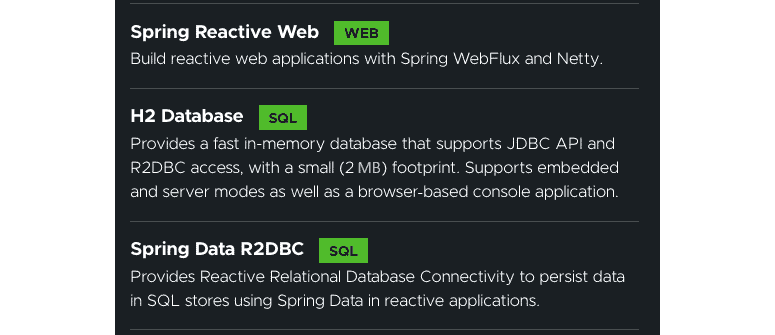

图 6.1 - Maven 依赖项

让我们从应用程序的代码开始讲解：

1.  在这里，我们有一个包含五列的员工表：`id`、`first_name`、`last_name`、`age`和`salary`。`id`列是自动递增的。其他列遵循默认的蛇形命名方案。以下的`schema.sql` SQL 文件位于源代码目录中的`src/main/resources/schema.sql`路径下：

```
DROP TABLE IF EXISTS employee ;
CREATE TABLE employee ( id SERIAL PRIMARY KEY, first_name VARCHAR(100) NOT NULL,last_name VARCHAR(100) NOT NULL, age integer,salary decimal);
```

由于 H2 驱动程序位于类路径上，我们不必指定连接 URL，Spring Boot 会在应用程序启动时自动启动嵌入式 H2 数据库。

1.  为了在应用程序启动时初始化数据库架构，我们还需要注册`ConnectionFactoryInitializer`来获取`schema.sql`文件，如下面我们应用程序的主类所述。在这里，我们还保存了一些`Employee`实体，以便以后使用：

```
@SpringBootApplication
public class ReactiveApplication {
    private static final Logger logger =LoggerFactory.
      getLogger(ReactiveApplication.class);
    public static void main(String[] args) {
      SpringApplication.run(ReactiveApplication.class,
        args);
    }
    @Bean
    ConnectionFactoryInitializer initializer
      (ConnectionFactory connectionFactory) {
      ConnectionFactoryInitializer initializer = new
      ConnectionFactoryInitializer();
      initializer.setConnectionFactory
        (connectionFactory);
        initializer.setDatabasePopulator(new
        ResourceDatabasePopulator(new
        ClassPathResource("schema.sql")));
        return initializer;
    }
    @Bean
    CommandLineRunner init(EmployeeRepository
      employeeRepository) {
        return args -> {
            List<Employee> employees =  List.of(
                new Employee("Peter", "Parker", 25,
                      20000),
                new Employee("Tony", "Stark", 30,
                      40000),
                new Employee("Clark", "Kent", 31,
                      60000),
                new Employee("Clark", "Kent", 32,
                      80000),
                    new Employee("Bruce", "Wayne", 33,
                      100000)
            );
            logger.info("Saving employee " +
              employeeRepository.saveAll
                (employees).subscribe());
        };
    }
}
```

1.  使用 Spring Data R2DBC，您不必编写存储库接口的实现，因为它会在运行时为您创建一个实现。`EmployeeRepository`扩展了`ReactiveCrudRepository`，并继承了使用响应式类型保存、删除和查找员工实体的各种方法。以下是 CRUD 存储库：

```
import com.example.demo.model.Employee;
import org.springframework.data.repository.reactive.Reactive
  CrudRepository;
    public interface EmployeeRepository extends
      ReactiveCrudRepository<Employee,Long> {
}
```

以下是`EmployeeService`类：

```
import com.example.demo.model.Employee;
import com.example.demo.repository.EmployeeRepository;
import org.springframework.stereotype.Service;
import reactor.core.publisher.Flux;
import reactor.core.publisher.Mono;
@Service
public class EmployeeService {
    private final EmployeeRepository 
      employeeRepository;
    public EmployeeService(EmployeeRepository
      employeeRepository) {
        this.employeeRepository = employeeRepository;
    }
    public Mono<Employee> createEmployee(Employee
      employee) {
        return employeeRepository.save(employee);
    }
    public Flux<Employee> getAllEmployee() {
        return employeeRepository.findAll();
    }
    public Mono<Employee> getEmployeeById(Long id) {
        return employeeRepository.findById(id);
    }
    public Mono<Void> deleteEmployeeById(Long id) {
        return employeeRepository.deleteById(id);
    }
}
```

1.  在以下 REST 控制器类中，您可以看到所有端点都返回 Flux 或 Mono 响应式类型：

```
import com.example.demo.model.Employee;
import com.example.demo.service.EmployeeService;
import org.springframework.http.ResponseEntity;
import org.springframework.web.bind.annotation.*;
import reactor.core.publisher.Flux;
import reactor.core.publisher.Mono;
@RestController
@RequestMapping("/employee")
public class EmployeeController {
    private final EmployeeService employeeService;
    public EmployeeController(EmployeeService 
      employeeService) {
        this.employeeService = employeeService;
    }
    @GetMapping
    public Flux<Employee> getAllEmployee() {
        return employeeService.getAllEmployee();
    }
    @PostMapping
    public Mono<Employee> createEmployee(@RequestBody
      Employee employee) {
        return
          employeeService.createEmployee(employee);
    }
    @GetMapping("/{id}")
    public Mono<ResponseEntity<Employee>> 
      getEmployee(@PathVariable Long id) {
        Mono<Employee> employee =
          employeeService.getEmployeeById(id);
        return employee.map(e -> ResponseEntity.ok(e))
          .defaultIfEmpty(ResponseEntity.
            notFound().build());
    }
    @DeleteMapping("/{id}")
    public Mono<ResponseEntity<Void>> 
      deleteUserById(@PathVariable Long id) {
        return employeeService.deleteEmployeeById(id)
            .map(r ResponseEntity.ok().
               <Void>build())
            .defaultIfEmpty(ResponseEntity.notFound()
.              build());
    }
}
```

以下是`Employee`领域类：

```
public class Employee {
    @Id
    private Long id;
    private String firstName;
    private String lastName;
    private int age;
    private double salary;
    public Employee(String firstName, String lastName,
      int age, double salary) {
        this.firstName = firstName;
        this.lastName = lastName;
        this.age = age;
        this.salary = salary;
    }
    public Long getId() {
        return id;
    }
    public void setId(Long id) {
        this.id = id;
    }
    public String getFirstName() {
        return firstName;
    }
    public void setFirstName(String firstName) {
        this.firstName = firstName;
    }
    public String getLastName() {
        return lastName;
    }
    public void setLastName(String lastName) {
        this.lastName = lastName;
    }
    public int getAge() {
        return age;
    }
    public void setAge(int age) {
        this.age = age;
    }
    public double getSalary() {
        return salary;
    }
    public void setSalary(double salary) {
        this.salary = salary;
    }
}
```

1.  让我们使用`mvn spring-boot:run`命令运行此应用程序。一旦应用程序启动运行，您将看到以下日志：

```
2021-07-13 20:40:12.979  INFO 47848 --- [           main] com.example.demo.ReactiveApplication     : No active profile set, falling back to default profiles: default
2021-07-13 20:40:14.268  INFO 47848 --- [           main] .s.d.r.c.RepositoryConfigurationDelegate : Bootstrapping Spring Data R2DBC repositories in DEFAULT mode.
2021-07-13 20:40:14.379  INFO 47848 --- [           main] .s.d.r.c.RepositoryConfigurationDelegate : Finished Spring Data repository scanning in 102 ms. Found 1 R2DBC repository interfaces.
2021-07-13 20:40:17.627  INFO 47848 --- [           main] o.s.b.web.embedded.netty.NettyWebServer  : Netty started on port 8080
2021-07-13 20:40:17.652  INFO 47848 --- [           main] com.example.demo.ReactiveApplication     : Started ReactiveApplication in 5.889 seconds (JVM running for 7.979)
2021-07-13 20:40:17.921  INFO 47848 --- [           main] com.example.demo.ReactiveApplication     : Saving employee reactor.core.publisher.LambdaSubscriber@7dee835
```

访问`/employee` REST 端点后的输出如下：

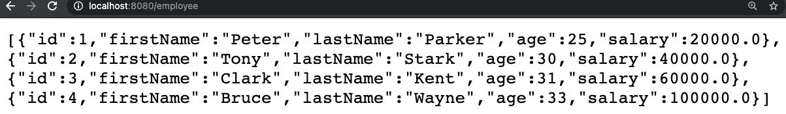

图 6.2 – REST 端点响应

在本节中，我们了解了响应式编程模型，并创建了一个响应式 Spring Boot CRUD 应用程序。在下一节中，我们将看看使用 Skaffold 将您的 Java 应用程序容器化的不同方法。

# 使用 Skaffold 容器镜像构建器

从*第三章*，*Skaffold – 简单易用的云原生 Kubernetes 应用开发*，我们知道 Skaffold 目前支持以下容器镜像构建器：

+   Dockerfile

+   Jib（Maven 和 Gradle）

+   Bazel

+   云原生 Buildpacks

+   自定义脚本

+   kaniko

+   Google Cloud Build

在本节中，我们将通过在上一节中构建的 Spring Boot 应用程序中详细介绍它们。让我们先谈谈 Dockerfile。

## Dockerfile

Docker 多年来一直是创建容器的黄金标准。即使今天有许多 Docker 的替代品，但它仍然活跃。Docker 架构依赖于必须运行以服务所有 Docker 命令的守护进程。然后有一个 Docker CLI，它将命令发送到 Docker 守护进程以执行。守护进程执行所需的操作，如推送、拉取、运行容器镜像等。Docker 期望一个名为 Dockerfile 的文件，由您手动编写，其中包含它理解的步骤和指令。然后使用诸如`docker build`之类的命令使用此 Dockerfile 创建应用程序的容器镜像。这里的优势在于，这允许根据您的需求对应用程序的容器镜像进行不同的定制级别。

要使用 Docker 构建镜像，我们需要向 Dockerfile 添加一些指令。这些指令作为输入，然后 Docker 守护进程使用这些指令创建镜像。让我们看一个示例，以了解典型 Dockerfile 用于 Java 应用程序的工作原理。

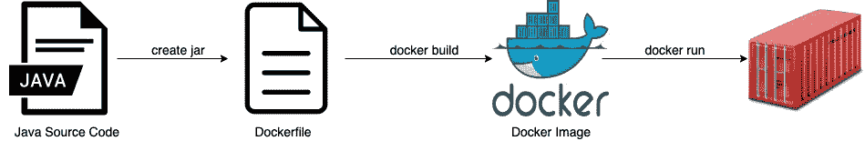

图 6.3 – Docker 构建流程

我们将使用以下 Dockerfile 来容器化我们的应用程序：

```
FROM openjdk:16
COPY target/*.jar app.jar
ENTRYPOINT ["java","-jar","/app.jar"]
```

从上述代码块中，我们可以看到以下内容：

+   `FROM`指令表示我们应用程序的基础镜像。

+   `COPY`指令，顾名思义，将由 Maven 构建的本地.jar 文件复制到我们的镜像中。

+   `ENTRYPOINT`指令在容器启动时充当可执行文件。

在`skaffold.yaml`文件中，我们添加了一个名为`docker`的新配置文件。以下是`docker`配置文件的相关部分：

```
profiles:
  - name: docker
    build:
      artifacts:
        - image: reactive-web-app
      local: {}
```

我们可以使用`skaffold dev –profile=docker`命令运行构建。输出应该与我们之前在*图 6.2*中看到的类似。

## Jib

**Jib** (https://github.com/GoogleContainerTools/jib)代表**Java Image Builder**，纯粹由 Java 编写。您已经知道 Jib 允许 Java 开发人员使用诸如 Maven 和 Gradle 之类的构建工具构建容器。但是，它还有一个 CLI 工具，可用于非 Java 应用程序，如 Python 或 Node.js。

使用 Jib 的重要优势是您无需了解安装 Docker 或维护 Dockerfile 的任何内容。要使您的 Java 应用程序容器化，您无需阅读无数的 Docker 教程。Jib 是无守护进程的。此外，作为 Java 开发人员，我们只关心构件（即 jar 文件），并且使用 Jib，我们不必处理任何 Docker 命令。使用 Jib，Java 开发人员可以将插件添加到他们选择的构建工具（Maven/Gradle）中，并且只需进行最少的配置，即可使应用程序容器化。Jib 将您的应用程序源代码作为输入，并输出您的应用程序的容器镜像。以下是使用 Jib 构建您的 Java 应用程序的流程：

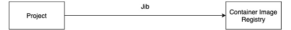

图 6.4 – Jib 构建流程

让我们尝试使用 Jib 构建上一节中创建的应用程序：

1.  首先，我们将使用 Skaffold 的`init`命令创建`skaffold.yaml`文件，如下所示：

```
apiVersion: skaffold/v2beta20
kind: Config
metadata:
  name: reactive-web-app
build:
  artifacts:
  - image: reactive-web-app
    jib:
      fromImage: adoptopenjdk:16-jre
      project: com.example:reactive-web-app
      args:
        - -DskipTests
deploy:
  kubectl:
    manifests:
    - k8s/manifest.yaml
```

提示

Jib 巧妙地将应用程序图像层分成以下几个部分，以加快重建速度：

-类

-资源

-项目依赖项

-快照和所有其他依赖项

目标是将经常更改的文件与很少更改的文件分开。直接的好处是，您不必重建整个应用程序，因为 Jib 只重新构建包含更改文件的层，并重用未更改文件的缓存层。

使用 Jib，如果您不指定镜像摘要，您可能会在日志中看到以下警告：

[警告] 基础镜像 `'adoptopenjdk/openjdk16'` 没有使用特定的镜像摘要 - 构建可能不可重现。

您可以通过使用正确的镜像摘要来克服这一点。例如，在 `maven-jib-plugin` 中，您可以进行以下更改，而在 `skaffold.yaml` 文件中，您可以指定镜像摘要：

`<plugin>`

`<groupId>com.google.cloud.tools</groupId>`

`<artifactId>jib-maven-plugin</artifactId>`

`<version>3.1.1</version>`

`<configuration>`

      <from>

`<image>adoptopenjdk/openjdk16@           sha256:b40f81a9f7e7e4533ed0c` `           6ac794ded9f653807f757e2b8b4e1            fe729b6065f7f5</image>`

      </from>

      <to>

`<image>docker.io/hiashish/image</image>`

      </to>

`</configuration>`

`</plugin>`

以下是 Kubernetes 服务清单：

```
apiVersion: v1
kind: Service
metadata:
  name: reactive-web-app
spec:
  ports:
    - port: 8080
      protocol: TCP
      targetPort: 8080
  type: Loadbalancer
  selector:
    app: reactive-web-app
```

以下是 Kubernetes 部署清单：

```
apiVersion: apps/v1
kind: Deployment
metadata:
  name: reactive-web-app
spec:
  selector:
    matchLabels:
      app: reactive-web-app
  template:
    metadata:
      labels:
        app: reactive-web-app
    spec:
      containers:
        - name: reactive-web-app
          image: reactive-web-app
```

1.  现在，我们必须运行 `skaffold dev` 命令。以下是输出：

```
skaffold dev
Listing files to watch...
 - reactive-web-app
Generating tags...
 - reactive-web-app -> reactive-web-app:fcda757-dirty
Checking cache...
 - reactive-web-app: Found Locally
Starting test...
Tags used in deployment:
 - reactive-web-app -> reactive-web-app:3ad471bdebe8e0606040300c9b7f1af4bf6d0a9d014d7cb62d7ac7b884dcf008
Starting deploy...
 - service/reactive-web-app created
 - deployment.apps/reactive-web-app created
Waiting for deployments to stabilize...
 - deployment/reactive-web-app is ready.
Deployments stabilized in 3.34 seconds
Press Ctrl+C to exit
Watching for changes...
```

使用 `minikube service reactive-web-app` 命令可以在 minikube 中打开暴露的服务。我们将使用以下截图中提到的 URL 来访问我们的应用程序：

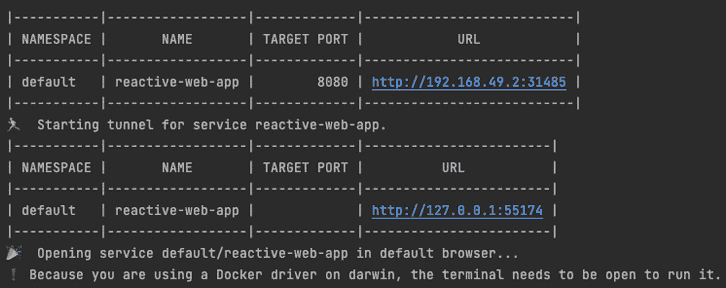

图 6.5 - 暴露的服务 URL

访问 `http://127.0.0.1:55174/employee` URL 后，我们应该得到类似于 *图 6.2* 的输出。

## Bazel

Bazel 是一个类似于 Maven 和 Gradle 的开源、多语言、快速和可扩展的构建工具。Skaffold 支持 Bazel，并且可以将镜像加载到本地 Docker 守护程序中。Bazel 需要两个文件：`WORKSPACE` 和 `BUILD`。

`WORKSPACE` 文件通常位于项目的根目录。此文件指示 Bazel 工作区。它查找构建输入，并将构建输出存储在创建 `WORKSPACE` 文件的目录中。

`BUILD`文件指示 Bazel 要构建什么以及如何构建项目的不同部分。以下是一个 Java 应用程序的`BUILD`文件示例。在这个例子中，我们指示 Bazel 使用`java_binary`规则为我们的应用程序创建一个`.jar`文件：

```
java_binary(    
name = "ReactiveWebApp",    
srcs = glob(["src/main/java/com/example/*.java"]),)
```

要构建您的项目，您可以运行诸如`build //: ReactiveWebApp`之类的命令。以下是包含`bazel`配置文件的`skaffold.yaml`文件：

```
profiles:
  - name: bazel
    build:
      artifacts:
        - image: reactive-web-app
          bazel:
            target: //:reactive-web-app.tar
```

接下来我们有 Buildpacks。

## Buildpacks

Heroku 在 2011 年首次创建了 Buildpacks（[`buildpacks.io/`](https://buildpacks.io/)）。它现在是 CNCF 基金会的一部分。就像 Jib 一样，Buildpacks 也可以在不需要 Dockerfile 的情况下工作。但是，您需要一个正在运行的 Docker 守护程序进程才能使其工作。使用 Buildpacks，输入是您的应用程序源代码，输出是容器镜像。在这方面，它与 Jib 非常相似，尽管 Jib 可以在没有 Docker 守护程序的情况下工作。

在后台，Buildpacks 做了很多工作，包括检索依赖项，处理资产，处理缓存以及为应用程序使用的任何语言编译代码：

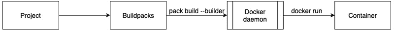

图 6.6 - Buildpacks 构建流程

正如前面所解释的，Skaffold 需要一个本地的 Docker 守护程序来使用 Buildpacks 构建镜像。Skaffold 将在容器内部使用`skaffold.yaml`文件中 Buildpacks 配置中指定的构建器执行构建。此外，您不必安装 pack CLI，因为 Google Cloud Buildpacks 项目（[`github.com/GoogleCloudPlatform/buildpacks`](https://github.com/GoogleCloudPlatform/buildpacks)）提供了用于工具如 Skaffold 的构建器镜像。您可以选择跳过此步骤，但在成功构建后，Skaffold 将把镜像推送到远程注册表。

提示

从 Spring Boot 2.3 版本开始，Spring Boot 直接支持 Maven 和 Gradle 项目的 Buildpacks。使用`mvn spring-boot:build-image`命令，您可以创建一个加载到本地运行的 Docker 守护程序的应用程序镜像。虽然您不需要维护 Dockerfile，但 Buildpacks 依赖于 Docker 守护程序进程。如果您在本地没有运行 Docker 守护程序，执行 Maven 命令时将会收到以下错误：

“无法执行目标 org.springframework.boot:spring-boot-maven-plugin:2.4.2:build-image (default-cli) on project imagebuilder: Execution default-cli of goal org.springframework.boot:spring-boot-maven-plugin:2.4.2:build-image failed: Connection to the Docker daemon at 'localhost' failed with error "[61] Connection refused"; ensure the Docker daemon is running and accessible”

为了使用 Buildpacks 构建我们的应用程序，我们添加了一个名为`pack`的新配置文件，并将其用于向`skaffold.yaml`配置文件的`build`部分添加一个新的部分。在`builder`字段中，我们指示 Skaffold 使用`gcr.io/buildpacks/builder:v1`构建器映像。以下是配置文件的相关部分：

```
profiles:
  - name: pack
    build:
      artifacts:
        - image: reactive-web-app
          buildpacks:
            builder: gcr.io/buildpacks/builder:v1
            env:
              - GOOGLE_RUNTIME_VERSION=16
```

我们可以使用`skaffold dev –profile=pack`命令运行构建。输出应该类似于我们在*图 6.2*中看到的。

提示

Spring Boot Buildpacks 集成可用于将映像推送到远程容器注册表。我们需要在`pom.xml`中进行以下更改：

```
<plugin>
    <groupId>org.springframework.boot</groupId>
      <artifactId>spring-boot-maven-plugin</artifactId>
    <configuration>
        <image>
           <name>docker.example.com/library/$
            {project.artifactId}</name>
           <publish>true</publish>
        </image>
        <docker>
          <publishRegistry>
            <username>user</username>
            <password>secret</password>
            <url>https://docker.example.com/v1/</url>
            <email>user@example.com</email>
            </publishRegistry>
        </docker>
    </configuration>
</plugin>
```

## 自定义脚本

如果没有支持的容器映像构建器适用于您的用例，您可以使用自定义脚本选项。通过此选项，您可以编写自定义脚本或选择您喜欢的构建工具。您可以通过在`skaffold.yaml`文件的构建部分的每个相应构件中添加一个自定义字段来配置自定义脚本。

在下面的示例`skaffold.yaml`文件中，我们创建了一个名为`custom`的新配置文件。在`buildCommand`字段中，我们使用`build.sh`脚本来将我们的 Spring Boot 应用程序容器化：

```
 profiles:
  - name: custom
    build:
      artifacts:
        - image: reactive-web-app
          custom:
            buildCommand: sh build.sh
```

`build.sh`脚本文件包含以下内容。它使用`docker build`命令来创建我们应用程序的映像。Skaffold 将提供`$IMAGE`（即完全限定的映像名称环境变量）给自定义构建脚本：

```
#!/bin/sh
set -e
docker build -t "$IMAGE" .
```

接下来我们转向 kaniko。

## kaniko

kaniko 是一个开源工具，用于在容器或 Kubernetes 集群内部从 Dockerfile 构建容器映像。kaniko 不需要特权根访问权限来构建容器映像。

kaniko 不依赖于 Docker 守护程序，并在用户空间完全执行 Dockerfile 中的每个命令。使用 kaniko，您可以在无法安全运行 Docker 守护程序的环境中开始构建容器映像，例如标准 Kubernetes 集群。那么，kaniko 是如何工作的呢？嗯，kaniko 使用一个名为`gcr.io/kaniko-project/executor`的执行器映像，该映像在容器内运行。不建议在另一个映像中运行 kaniko 执行器二进制文件，因为它可能无法正常工作。

让我们看看这是如何完成的：

1.  我们将使用以下 Dockerfile 与 kaniko 构建应用程序的容器映像：

```
FROM maven:3-adoptopenjdk-16 as build
RUN mkdir /app
COPY . /app
WORKDIR /app
RUN mvn clean verify -DskipTests
FROM adoptopenjdk:16-jre
RUN mkdir /project
COPY --from=build /app/target/*.jar /project/app.jar
WORKDIR /project
ENTRYPOINT ["java","-jar","app.jar"]
```

1.  以下是`skaffold.yaml`的相关部分：

```
profiles:
  - name: kaniko
    build:
      cluster:
        pullSecretPath: /Users/ashish/Downloads/kaniko-secret.json
      artifacts:
        - image: reactive-web-app
          kaniko: {}
```

在这里，我们添加了一个名为`kaniko`的新配置文件，以在 Google Kubernetes 集群中构建我们的容器映像。您将在*第八章*中了解更多关于 GKE 的信息，*使用 Skaffold 将 Spring Boot 应用部署到 Google Kubernetes Engine*。

`skaffold.yaml`文件中需要强调的一个重要点是，我们需要从活动的 Kubernetes 集群获取凭据，以便在集群内构建我们的映像。为此，需要一个 GCP 服务帐户。此帐户具有存储管理员角色，以便可以拉取和推送映像。我们可以使用以下命令构建并将应用程序部署到 GKE：

```
skaffold run --profile=kaniko --default-repo=gcr.io/basic-curve-316617
```

我们将在 GCP 上托管的远程 Kubernetes 集群上进行演示。让我们开始吧：

1.  首先，我们需要为 kaniko 创建一个服务帐户，该帐户具有从`gcr.io`拉取和推送映像的权限。然后，我们需要下载 JSON 服务帐户文件并将文件重命名为`kaniko-secret`。还要确保不要在文件名后添加`.json`；使用以下命令创建 Kubernetes 密钥。您需要确保 Kubernetes 上下文设置为远程 Kubernetes 集群：

```
kubectl create secret generic kaniko-secret --from-file=kaniko-secret
```

1.  由于我们将把映像推送到**Google 容器注册表**（**GCR**），我们已经提到了`--default-repo`标志，以便它始终指向 GCR。以下是日志：

```
Generating tags...
 - reactive-web-app -> gcr.io/basic-curve-316617/reactive-web-app:fcda757-dirty
Checking cache...
 - reactive-web-app: Not found. Building
Starting build...
Checking for kaniko secret [default/kaniko-secret]...
Creating kaniko secret [default/kaniko-secret]...
Building [reactive-web-app]...
INFO[0000] GET KEYCHAIN                                 
INFO[0000] running on kubernetes ....
```

在以下日志中，您可以看到 kaniko 开始在容器内构建映像，下载不同构建阶段的基础映像。kaniko 开始打包和下载我们的 Spring Boot 应用程序的依赖项：

```
INFO[0001] Retrieving image manifest adoptopenjdk:16-jre 
INFO[0001] Retrieving image adoptopenjdk:16-jre from registry index.docker.io 
INFO[0001] GET KEYCHAIN
INFO[0001] Built cross stage deps: map[0:[/app/target/*.jar]] 
INFO[0001] Retrieving image manifest maven:3-adoptopenjdk-16 
...............
INFO[0035] RUN mvn clean verify -DskipTests             
INFO[0035] cmd: /bin/sh                                 
INFO[0035] args: [-c mvn clean verify -DskipTests]      
INFO[0035] Running: [/bin/sh -c mvn clean verify -DskipTests] 
[INFO] Scanning for projects...
Downloading from central: https://repo.maven.apache.org/maven2/org/springframework/boot/spring-boot-starter-parent/2.5.2/spring-boot-starter-parent-2.5.2.pom
```

1.  在以下日志中，您可以看到构建成功，并且 kaniko 能够将映像推送到 GCR。然后，我们使用`kubectl`将映像部署到 Google Kubernetes 集群：

```
[INFO] BUILD SUCCESS
INFO[0109] Taking snapshot of full filesystem...        
INFO[0114] Saving file app/target/reactive-web-app-0.0.1-SNAPSHOT.jar for later use 
....        
INFO[0130] COPY --from=build /app/target/*.jar /project/app.jar    
....        
INFO[0131] ENTRYPOINT ["java","-jar","app.jar"]
INFO[0131] GET KEYCHAIN                                 
INFO[0131] Pushing image to gcr.io/basic-curve-316617/reactive-web-app:fcda757-dirty 
INFO[0133] Pushed image to 1 destinations               
Starting test...
Tags used in deployment:
 - reactive-web-app -> gcr.io/basic-curve-316617/reactive-web-app:fcda757-dirty@9797e8467bd25fa4a237 e21656cd574c0c46501e5b3233a1f27639cb5b66132e
Starting deploy...
 - service/reactive-web-app created
 - deployment.apps/reactive-web-app created
Waiting for deployments to stabilize...
 - deployment/reactive-web-app: creating container reactive-web-app
    - pod/reactive-web-app-6b885dcf95-q8dr5: creating container reactive-web-app
 - deployment/reactive-web-app is ready.
Deployments stabilized in 12.854 seconds
```

在以下截图中，我们可以看到部署后，一个 pod 正在运行，并且暴露的服务是**Load balancer**类型：

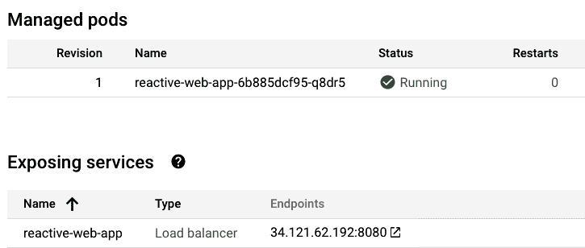

图 6.7 – Pod 运行和服务暴露给外部访问

访问我们的 Spring Boot 应用程序的`/employee` REST 端点后，使用 GKE 公开的端点的输出如下：

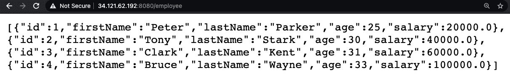

图 6.8 – REST 应用程序响应

## Google Cloud Build

Cloud Build 是一个使用 GCP 基础设施运行构建的服务。Cloud Build 通过从各种存储库或 Google Cloud Storage 空间导入源代码，执行构建，并生成容器镜像等工件来工作。

我们在`skaffold.yaml`中创建了一个名为`gcb`的新配置文件，以使用 Google Cloud Build 触发我们应用程序的远程构建。以下是`skaffold.yaml`配置文件部分的相关部分：

```
profiles:
  - name: gcb
    build:
      artifacts:
        - image: reactive-web-app
          docker:
            cacheFrom:
              - reactive-web-app
      googleCloudBuild: {}
```

我们可以运行以下命令来开始使用 Google Cloud Build 远程构建我们的应用程序：

```
skaffold run --profile=gcb --default-repo=gcr.io/basic-curve-316617
```

如果这是您第一次这样做，请确保已经从**Cloud Console**仪表板或通过 gcloud CLI 启用了 Cloud Build API。否则，您可能会收到以下错误：

```
Generating tags...
 - reactive-web-app -> gcr.io/basic-curve-316617/reactive-web-app:fcda757-dirty
Checking cache...
 - reactive-web-app: Not found. Building
Starting build...
Building [reactive-web-app]...
Pushing code to gs://basic-curve-316617_cloudbuild/source/basic-curve-316617-046b951c-5062-4824-963b-a204302a77e1.tar.gz
could not create build: googleapi: Error 403: Cloud Build API has not been used in project 205787228205 before or it is disabled. Enable it by visiting https://console.developers.google.com/apis/api/cloudbuild.googleapis.com/overview?project=205787228205 then retry. If you enabled this API recently, wait a few minutes for the action to propagate to our systems and retry.
.....
```

您可以通过访问错误日志中提到的 URL 并单击**ENABLE**按钮来通过**Cloud Console**仪表板启用 Cloud Build API，如下截图所示：

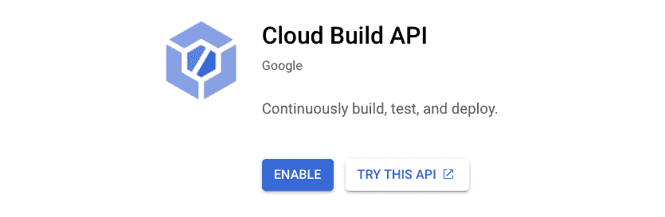

图 6.9 – 启用 Cloud Build API

在运行实际命令启动构建和部署过程之前，您需要确保在您的`kubeconfig`文件中，GKE 远程集群是此部署的活动集群。以下是`skaffold run`命令的输出。在以下日志中，您可以看到我们的整个源代码被打包为`tar.gz`文件并发送到 Google Cloud Storage 位置。然后，Cloud Build 会获取它并开始构建我们的镜像：

```
skaffold run --profile=gcb --default-repo=gcr.io/basic-curve-316617
Generating tags...
 - reactive-web-app -> gcr.io/basic-curve-316617/reactive-web-app:fcda757-dirty
Checking cache...
 - reactive-web-app: Not found. Building
Starting build...
Building [reactive-web-app]...
Pushing code to gs://basic-curve-316617_cloudbuild/source/basic-curve-316617-aac889cf-d854-4e7f-a3bc-b26ea06bf854.tar.gz
Logs are available at 
https://console.cloud.google.com/m/cloudstorage/b/basic-curve-316617_cloudbuild/o/log-43705458-0f75-4cfd-8532-7f7db103818e.txt
starting build "43705458-0f75-4cfd-8532-7f7db103818e"
FETCHSOURCE
Fetching storage object: gs://basic-curve-316617_cloudbuild/source/basic-curve-316617-aac889cf-d854-4e7f-a3bc-b26ea06bf854.tar.gz#1626576177672677
Copying gs://basic-curve-316617_cloudbuild/source/basic-curve-316617-aac889cf-d854-4e7f-a3bc-b26ea06bf854.tar.gz#1626576177672677...
- [1 files][ 42.2 MiB/ 42.2 MiB]                                                
Operation completed over 1 objects/42.2 MiB.                                     
BUILD
Starting Step #0
Step #0: Already have image (with digest): gcr.io/cloud-builders/docker
…
```

在以下日志中，您可以看到镜像已经构建、标记并推送到 GCR。然后，使用`kubectl`，应用程序被部署到 GKE，如下所示：

```
Step #1: Successfully built 1a2c04528dad
Step #1: Successfully tagged gcr.io/basic-curve-316617/reactive-web-app:fcda757-dirty
Finished Step #1
PUSH
Pushing gcr.io/basic-curve-316617/reactive-web-app:fcda757-dirty
The push refers to repository [gcr.io/basic-curve-316617/reactive-web-app]
7a831de44071: Preparing
574a11c0c1c8: Preparing
783bfc5acd81: Preparing
2da4fab53cd6: Preparing
a70daca533d0: Preparing
783bfc5acd81: Layer already exists
2da4fab53cd6: Layer already exists
a70daca533d0: Layer already exists
574a11c0c1c8: Pushed
7a831de44071: Pushed
fcda757-dirty: digest: sha256:22b2de72d3e9551f2531f2b9dcdf5e4b2eabaabc9d1c7a5930bcf226e6b9c04b size: 1372
DONE
Starting test...
Tags used in deployment:
 - reactive-web-app -> gcr.io/basic-curve-316617/reactive-web-app:fcda757-dirty@sha256:22b2de72d3e9551f2531f2b9dcdf5e4b2 eabaabc9d1c7a5930bcf226e6b9c04b
Starting deploy...
 - service/reactive-web-app configured
 - deployment.apps/reactive-web-app created
Waiting for deployments to stabilize...
 - deployment/reactive-web-app: creating container reactive-web-app
    - pod/reactive-web-app-789f775d4-z998t: creating container reactive-web-app
 - deployment/reactive-web-app is ready.
Deployments stabilized in 1 minute 51.872 seconds
```

在 GKE 的**Workload**部分，您可以看到**reactive-web-app**已经部署，并且其状态为 OK，如下所示：

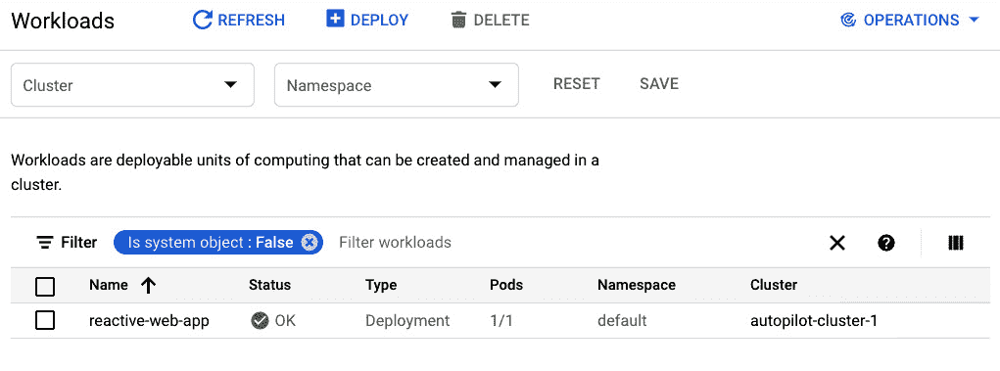

图 6.10 - 应用程序成功部署在 GKE 上

在本节中，我们学习了如何以不同的方式将我们的 Reactive Spring Boot CRUD 应用程序容器化。

在下一节中，我们将探讨使用 Skaffold 将应用程序部署到 Kubernetes 的不同方法。

# 探索 Skaffold 容器镜像部署程序

在本节中，我们将看看 Skaffold 支持的容器镜像部署方法。使用 Skaffold，您可以使用以下三种工具将应用程序部署到 Kubernetes：

+   Helm

+   kubectl

+   Kustomize

让我们详细讨论一下。

## Helm

**Helm**是软件包管理器，**charts**是您的 Kubernetes 应用程序的软件包。它允许您轻松定义、安装和更新您的 Kubernetes 应用程序。您可以为您的应用程序编写图表，或者从稳定的图表存储库中使用用于流行软件（如 MySQL 和 MongoDB）的生产就绪的预打包图表。

直到 Helm 2，Helm 遵循客户端-服务器架构。然而，由于 Helm 3 对架构进行了重大更改，它是一个仅客户端的架构。因此，在您的 Kubernetes 集群上不需要安装**Tiller**等服务器端组件。

现在，让我们更多地了解 Helm：

1.  Skaffold 不会为我们安装 Helm，因此我们必须使用 macOS 的 Homebrew 软件包管理器进行安装：

```
$ brew install helm
$ helm version
version.BuildInfo{Version:"v3.6.3", GitCommit:"d506314abfb5d21419df8c7e7e68012379db2354", GitTreeState:"dirty", GoVersion:"go1.16.5"}
```

对于 Windows，您可以使用 chocolatey 进行下载：

```
choco install kubernetes-helm
```

您还可以使用安装程序脚本下载 Helm，该脚本将下载最新版本：

```
$ curl -fsSL -o get_helm.sh https://raw.githubusercontent.com/helm/helm/master/scripts/get-helm-3
$ chmod 700 get_helm.sh
$ ./get_helm.sh
```

1.  接下来，我们将使用以下命令创建 Helm 图表骨架：

```
$ helm create reactive-web-app-helm             
Creating charts
```

1.  我们将创建一个名为`jibWithHelm`的新 Skaffold 配置文件，以使用 Jib 构建图像，然后使用 Helm 部署它：

```
profiles:
    - name: jibWithHelm
    build:
      artifacts:
        - image: gcr.io/basic-curve-316617/reactive-
            web-app-helm
          jib:
            args:
              - -DskipTests
    deploy:
      helm:
        releases:
          - name: reactive-web-app-helm
            chartPath: reactive-web-app-helm
            artifactOverrides:
              imageKey: gcr.io/basic-curve-
                316617/reactive-web-app-helm
            valuesFiles:
              - reactive-web-app-helm/values.yaml
            imageStrategy:
              helm: { }
```

在`build`部分下的图像名称应与`skaffold.yaml`文件的`artifactOverrides`部分下给定的图像名称匹配。否则，将会出现错误。

我们还在`skaffold.yaml`文件的`valuesFiles`部分提供了指向`values.yaml`文件的路径。

使用 Helm 定义图像引用的典型约定是通过`values.yaml`文件。以下是将由 Helm 引用的`values.yaml`文件的内容：

```
replicaCount: 1
imageKey:
  repository: gcr.io/basic-curve-316617
  pullPolicy: IfNotPresent
  tag: latest
service:
  type: LoadBalancer
  port: 8080
  targetPort: 8080
```

`values.yaml`文件中的值将在模板化资源文件中被引用，如下面的代码片段所示。此模板文件位于`reactive-web-app-helm/templates/**.yaml`中：

```
    spec:
      containers:
        - name: {{ .Chart.Name }}
          image: {{ .Values.imageKey.repository }}:{{ 
            .Values.imageKey.tag }}
          imagePullPolicy: {{ .Values.imageKey.pullPolicy }}
```

运行`skaffold run --profile=jibWithHelm`后，Skaffold 将使用 Jib 构建图像，并使用 Helm 图表将其部署到 GKE。这将导致以下输出：

```
skaffold run --profile=jibWithHelm
Generating tags...
 - gcr.io/basic-curve-316617/reactive-web-app-helm -> gcr.io/basic-curve-316617/reactive-web-app-helm:3ab62c6-dirty
Checking cache...
 - gcr.io/basic-curve-316617/reactive-web-app-helm: Found Remotely
Starting test...
Tags used in deployment:
 - gcr.io/basic-curve-316617/reactive-web-app-helm -> gcr.io/basic-curve-316617/reactive-web-app-helm:3ab62c6-dirty@sha256:2d9539eb23bd9db578feae7e4956c30d9320786217a7307e0366d9cc5ce359bc
Starting deploy...
Helm release reactive-web-app-helm not installed. Installing...
NAME: reactive-web-app-helm
LAST DEPLOYED: Thu Aug 26 11:34:39 2021
NAMESPACE: default
STATUS: deployed
REVISION: 1
Waiting for deployments to stabilize...
 - deployment/reactive-web-app-helm is ready.
Deployments stabilized in 3.535 seconds
```

我们可以通过转到 GKE 的**工作负载**部分来验证 pod 是否正在运行。在下面的截图中，我们可以看到我们有一个正在运行的 pod：

图 6.11 - Helm 图表在 GKE 上成功部署

](image/Figure_6.11_B17385.jpg)

图 6.11 - Helm 图表在 GKE 上成功部署

同样，在**服务和入口**部分下，我们可以看到已经为外部访问暴露了一个**外部负载均衡器**类型的服务：

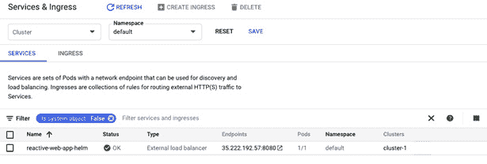

图 6.12 - 在 GKE 上暴露的 LoadBalancer 服务类型

在**Endpoints**列中使用 URL 访问应用程序后，输出应该类似于我们在*图 6.2*中看到的。

## kubectl

kubectl 是一个命令行工具，用于在 Kubernetes 集群上运行命令。它与 Kubernetes API 服务器交互以运行这些命令。您可以使用它来完成各种任务，例如查看 pod 的日志，创建 Kubernetes

例如部署资源，了解集群的状态和 pod 等。在下面的代码片段中，您可以看到我们正在使用 kubectl 进行部署。Kubernetes 清单位于`k8s`目录下：

```
deploy:
  kubectl:
    manifests:
    - k8s/manifest.yaml
```

## Kustomize

Kustomize，顾名思义，是一种无模板的声明性方法，用于 Kubernetes 配置、管理和自定义选项。使用 Kustomize，我们提供一个基本的框架和补丁。在这种方法中，与 Helm 相比，我们提供一个基本的部署，然后描述不同环境的差异。例如，我们可以在生产环境和暂存环境中有不同数量的副本和健康检查。Kustomize 可以单独安装，自 kubectl 的 1.14 版本以来，我们可以使用`-k`命令。请按照[`kubectl.docs.kubernetes.io/installation/kustomize/`](https://kubectl.docs.kubernetes.io/installation/kustomize/)中提到的说明在支持的操作系统上安装它。

在下面的例子中，我们有一个名为`kustomizeProd`的配置文件，并且正在使用 Kustomize 作为我们应用的部署策略：

```
 profiles:  
  - name: kustomizeProd
    build:
      artifacts:
        - image: reactive-web-app
          jib:
            args:
              - -DskipTests
    deploy:
      kustomize:
        paths:
          - kustomization/overlays/prod
```

为了使 Kustomize 正常工作，我们必须具有以下目录结构。在下面的目录中，您可以看到在`kustomization/base`目录下，我们有描述我们想要在 GKE 集群中部署的资源的原始 YAML 文件。我们永远不会触及这些文件；相反，我们只会在它们之上应用定制来创建新的资源定义：

```
├── kustomization
│   ├── base
│   │   ├── deployment.yaml
│   │   ├── kustomization.yaml
│   │   └── service.yaml
│   └── overlays
│       ├── dev
│       │   ├── environment.yaml
│       │   └── kustomization.yaml
│       └── prod
│           ├── increase_replica.yaml
│           ├── kustomization.yaml
│           └── resources_constraint.yaml
```

我们在`base`文件夹中有一个名为`kustomization.yaml`的文件。它描述了您使用的资源。这些资源是相对于当前文件的 Kubernetes 清单文件的路径：

```
apiVersion: kustomize.config.k8s.io/v1beta1
kind: Kustomization
resources:
  - deployment.yaml
  - service.yaml 
```

接下来，我们有`kustomization/overlays/prod`文件夹，其中包含一个`kustomization.yaml`文件。它包含以下内容：

```
apiVersion: kustomize.config.k8s.io/v1beta1
kind: Kustomization
resources:
  - ../../base
patchesStrategicMerge:
  - increase_replica.yaml
  - resources_constraint.yaml
```

如果您能看到，在`base`中，我们没有定义任何环境变量、副本数或资源约束。但是对于生产场景，我们必须在我们的基础之上添加这些内容。为此，我们只需创建我们想要应用在我们的基础之上的 YAML 块，并在`kustomization.yaml`文件中引用它。我们已经将这个 YAML 添加到`kustomization.yaml`文件中的`patchesStrategicMerge`列表中。

`increase_replica.yaml`文件包含两个副本，内容如下：

```
apiVersion: apps/v1
kind: Deployment
metadata:
  name: reactive-web-app
spec:
  replicas: 2
```

`resources_constraint.yaml`文件包含资源请求和限制，内容如下：

```
apiVersion: apps/v1
kind: Deployment
metadata:
  name: reactive-web-app
spec:
  template:
    spec:
      containers:
        - name: reactive-web-app
          resources:
            requests:
              memory: 512Mi
              cpu: 256m
            limits:
              memory: 1Gi
              cpu: 512m
```

现在，我们可以运行`skaffold run --profile=kustomizeProd --default-repo=gcr.io/basic-curve-316617`命令。这将使用 Kustomize 将应用程序部署到 GKE。我们得到的输出应该与我们之前在*图 6.2*中看到的类似。

在本节中，我们看了一下我们可以使用 Skaffold 来将应用程序部署到 Kubernetes 集群的工具。

# 总结

在本章中，我们首先介绍了响应式编程，并构建了一个 Spring Boot CRUD 应用程序。我们还介绍了 Skaffold 支持的容器镜像构建工具，包括 Docker、kaniko、Jib 和 Buildpacks。我们通过实际实现来了解了它们。我们还讨论了使用诸如 kubectl、Helm 和 Kustomize 等工具将镜像部署到 Kubernetes 集群的不同方式。

在本章中，我们对诸如 Jib、kaniko、Helm 和 Kustomize 等工具有了扎实的了解。您可以运用这些工具的知识来构建和部署您的容器。

在下一章中，我们将使用 Google 的 Cloud Code 扩展构建和部署一个 Spring Boot 应用程序到 Kubernetes。

# 进一步阅读

要了解更多关于 Skaffold 的信息，请查看 Skaffold 文档：[`skaffold.dev/docs/`](https://skaffold.dev/docs/)。
