# *第七章*：使用 Cloud Code 插件构建和部署 Spring Boot 应用程序

在上一章中，我们了解了 Skaffold 支持的容器镜像构建器和部署器。在本章中，我们将向您介绍 Google 的 Cloud Code 插件，该插件可在 IntelliJ 等 IDE 中使用。我们将创建一个 Spring Boot 应用程序，并使用 Cloud Code 插件将其部署到本地 Kubernetes 集群。

在本章中，我们将涵盖以下主要主题：

+   介绍 Google 的 Cloud Code 插件

+   安装并使用 IntelliJ Cloud Code 插件

+   创建一个 Spring Boot 应用程序

+   使用 Cloud Code 对 Spring Boot 应用进行容器化和部署

通过本章结束时，您将对 Cloud Code 插件有一个扎实的理解，并了解如何使用它来加速使用 IDE 开发 Kubernetes 应用程序的开发生命周期。

# 技术要求

对于本章，您将需要以下内容：

+   Visual Studio Code ([`code.visualstudio.com/download`](https://code.visualstudio.com/download)) 或 IntelliJ IDE ([`www.jetbrains.com/idea/download/`](https://www.jetbrains.com/idea/download/))

+   Git

+   Spring Boot 2.5

+   OpenJDK 16

本书的 GitHub 存储库中的代码可以在[`github.com/PacktPublishing/Effortless-Cloud-Native-App-Development-Using-Skaffold/tree/main/Chapter07`](https://github.com/PacktPublishing/Effortless-Cloud-Native-App-Development-Using-Skaffold/tree/main/Chapter07)找到。

# 介绍 Google 的 Cloud Code 插件

如果您正在开发或维护当今的云原生应用程序，那么一个不成文的事实是您需要一套工具或工具来简化您的开发过程。作为开发人员，我们通常在内部开发循环中执行以下任务：

+   下载特定的依赖项，如 Skaffold、`minikube`和`kubectl`，以设置本地开发环境。

+   进行大量的上下文切换以查看日志、文档并浏览云供应商提供的控制台。

虽然 Skaffold 是解决这个问题的一个很好的解决方案，但是将所有东西都整合到您的 IDE 中不是很好吗？例如，我们可以添加一个插件来执行所有这些任务并专注于编码部分。为此，我们可以使用 Google Cloud Code 扩展，因为它简化了使用您喜爱的 IDE（如 IntelliJ、Visual Studio Code 等）开发基于云的应用程序。

让我们了解一些 Cloud Code 提供的功能：

+   更快地编写、调试和部署 Kubernetes 应用程序。

+   支持多个 IDE，包括 JetBrains IntelliJ、Visual Studio Code 和 Cloud Shell Editor。

+   多个不同语言的启动模板，以最佳实践快速开始开发。

+   您可以通过单击 Google Kubernetes 引擎或 Cloud Run 来部署您的应用程序。

+   高效地与其他谷歌云平台服务一起使用，包括谷歌 Kubernetes 引擎、谷歌容器注册表和云存储。

+   通过代码片段和内联文档等功能改进 YAML 文件编辑过程。

+   内置对 Skaffold 的支持，加快内部开发循环。

+   轻松远程和本地调试在 Kubernetes 上运行的应用程序。

+   内置日志查看器，实时查看 Kubernetes 应用程序的应用程序日志。

现在我们已经了解了 Cloud Code 是什么以及它的特性，让我们尝试安装和使用其启动模板，快速部署 Java 应用程序到本地 Kubernetes 集群。

# 安装并使用 IntelliJ Cloud Code 插件

要开始使用 Cloud Code 插件，首先我们需要下载它。您可以访问 IntelliJ 插件市场进行下载。让我们学习如何做到这一点：

1.  对于 Windows 或 Linux，导航到**File** | **Settings** | **Plugins**，在搜索区域输入**Cloud Code**，然后单击**Install**。

1.  对于 macOS，导航到**IntelliJ IDEA** | **Preferences** | **Plugins**，在搜索区域输入**Cloud Code**，然后单击**Install**，如下截图所示：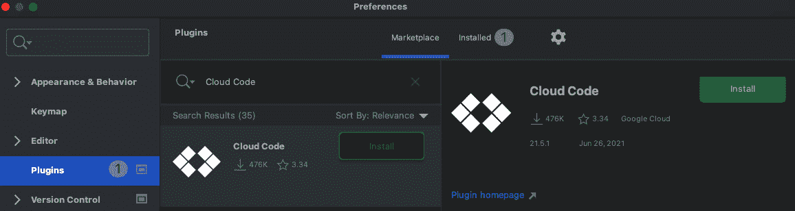

图 7.1 - 从 IntelliJ 市场安装 Cloud Code

1.  下载完成后，将弹出一个欢迎屏幕。在这里，单击**创建一个 Kubernetes 示例应用程序**，如下截图所示：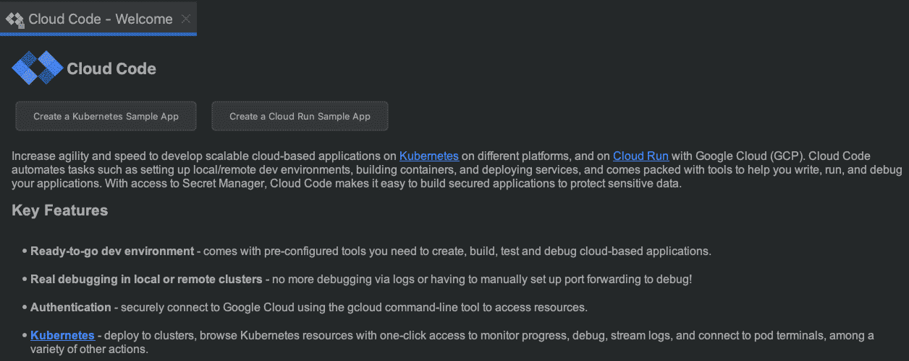

图 7.2 - Cloud Code 欢迎页面

1.  在下一个屏幕上，将打开一个**新项目**窗口。我们需要选择**Java: Guestbook**项目，如下截图所示，然后单击**Next**：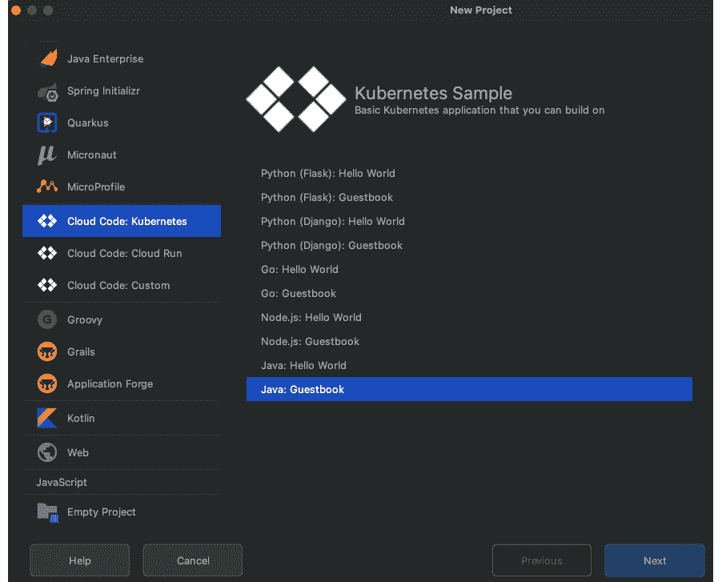

图 7.3 - 选择预构建的 Java Guestbook 应用程序

1.  在下一个屏幕上，您将被要求指定您的容器镜像存储库。如果您使用 DockerHub、GCR 或任何其他镜像注册表，则添加这些详细信息，然后单击**下一步**。例如，如果您使用 GCR，则输入类似`gcr.io/gcp-project-id`的内容。由于我们使用启动模板并且镜像名称已在 Kubernetes 清单中定义，因此我们可以留下这部分。

1.  在下一个屏幕上，输入项目名称，然后单击**完成**。示例 Java 项目将下载到默认项目位置。

1.  现在我们有一个可用的项目，单击**运行/调试配置**下拉菜单，然后选择**编辑配置**。

1.  在**运行/调试配置**对话框中，选择**在 Kubernetes 上开发**配置。然后，在**运行** | **部署**下，选择**部署到当前上下文（minikube）**，如下面的屏幕截图所示：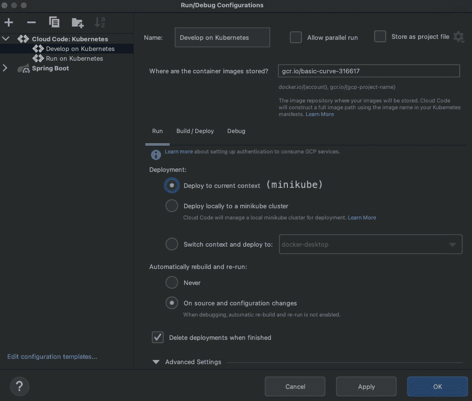

图 7.4 – 将 Kubernetes 的当前上下文设置为 Minikube

1.  单击**应用**和**确定**以保存更改。

1.  最后，要在本地 Minikube 集群上运行应用程序，请单击绿色运行图标：

图 7.5 – 运行应用程序

如前所述，Cloud Code 使用 Skaffold。一旦应用程序成功部署到本地 Minikube 集群，您应该会看到以下输出：

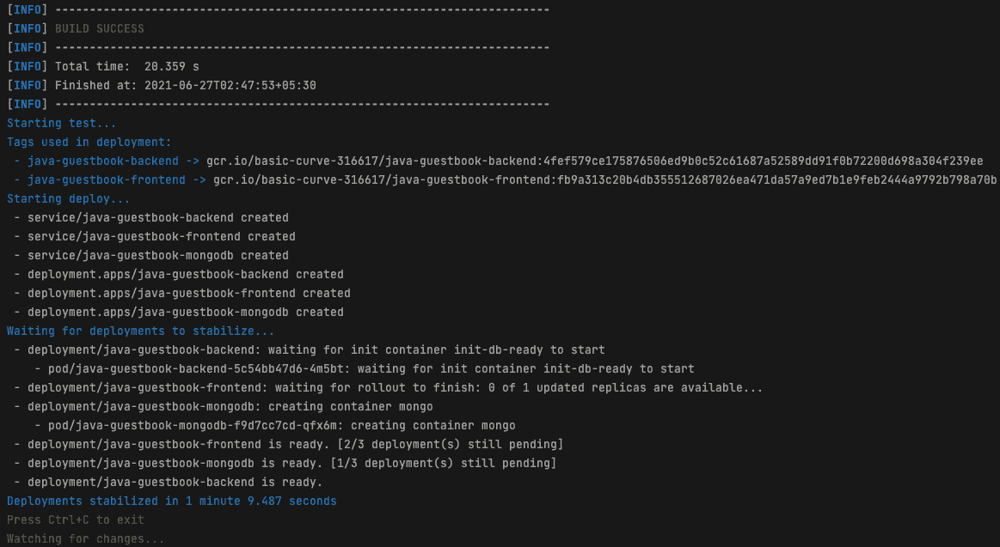

图 7.6 – 部署日志

1.  您将在 IntelliJ 的**事件日志**部分收到通知。单击**查看**以访问已部署的 Kubernetes 服务的本地 URL：

图 7.7 – 事件日志通知

1.  您可以单击**java-guestbook-frontend** URL 来访问应用程序：


图 7.8 – 可用服务

在访问`http://localhost:4503` URL 后，您应该会看到以下屏幕：

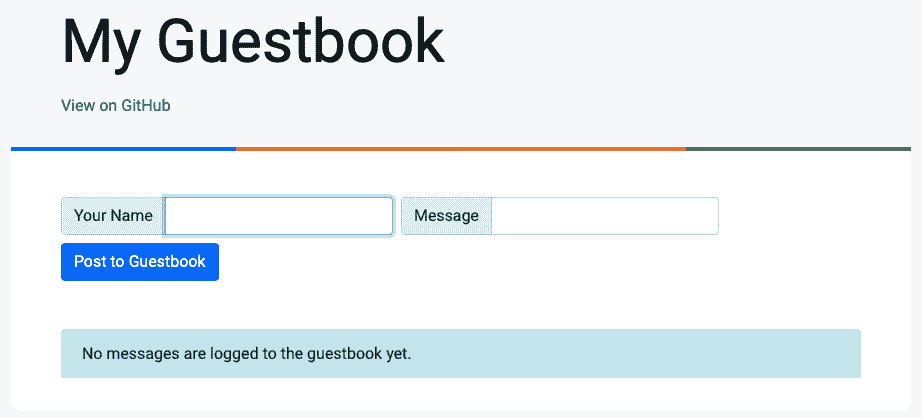

图 7.9 – 我的留言板应用程序登录页面

在这一部分，我们安装了 Cloud Code 插件，并使用提供的启动模板快速启动了这个插件。通过我们非常简单的设置，我们构建并部署了一个 Java 应用到本地的 Kubernetes 集群。接下来的部分将创建一个 Spring Boot 应用程序，用于显示实时空气质量数据。

# 创建一个 Spring Boot 应用程序

根据世界卫生组织（https://www.who.int/health-topics/air-pollution）的数据，空气污染每年导致全球约 700 万人死亡。这不仅是发达国家的问题，也是发展中国家的问题。我们应该尽一切努力阻止这种情况发生，采取有力措施。作为技术人员，我们可以创造解决方案，让人们了解他们所在地区的空气质量。有了这个，人们可以采取预防措施，比如在外出时戴口罩，如果室外空气有毒，让老年人和孩子呆在家里。

在这一部分，我们将创建一个 Spring Boot 应用程序，用于显示您当前位置的实时空气质量数据。我们将使用 Openaq（https://openaq.org/）提供的 API，这是一个名为空气质量数据维基百科的非营利组织。它公开了许多实时空气质量数据的端点，但我们将使用[`api.openaq.org/v1/latest?country=IN`](https://api.openaq.org/v1/latest?country=IN) URL 来为我们的 Spring Boot 应用程序。让我们开始吧。

和往常一样，我们将通过浏览[`start.spring.io/`](https://start.spring.io/)来下载一个 Spring Boot 应用程序的工作桩。我们还将为我们的项目添加以下依赖项：

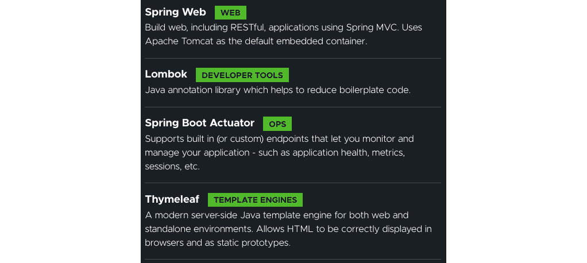

图 7.10 – Spring Boot 项目 Maven 依赖

除了我们已经讨论过的依赖项，我们还将添加以下 Dekorate Spring Boot starter 依赖项：

```
<dependency>
    <groupId>io.dekorate</groupId>
    <artifactId>kubernetes-spring-starter</artifactId>
    <version>2.1.4</version>
</dependency>
```

Dekorate（https://github.com/dekorateio/dekorate）是一个工具，可以自动生成 Kubernetes 清单文件。它可以检测应用程序是否具有 Spring Boot web 依赖项，并在编译期间自动生成 Kubernetes 清单文件，并默认配置服务、部署和探针。另外，在你的主类中，你可以添加`@KubernetesApplication`注解来进行一些自定义。例如，你可以提供副本数量、服务类型、入口等等：

```
@KubernetesApplication(serviceType = ServiceType.LoadBalancer, replicas = 2,expose = true)
```

Dekorate 在`target/classes/META-INF/dekorate`目录中以`.json`或`.yml`格式生成 Kubernetes 清单。

以下是 Kubernetes 服务清单的代码：

```
apiVersion: v1
kind: Service
metadata:
  labels:
    app.kubernetes.io/name: scanner
    app.kubernetes.io/version: 0.0.1-SNAPSHOT
  name: scanner
spec:
  ports:
    - name: http
      port: 8080
      targetPort: 8080
  selector:
    app.kubernetes.io/name: scanner
    app.kubernetes.io/version: 0.0.1-SNAPSHOT
  type: LoadBalancer
```

以下是部署 Kubernetes 清单的相关部分。正如您所看到的，Dekorate 已生成了存活和就绪探针：

```
spec:
  containers:
    - env:
        - name: KUBERNETES_NAMESPACE
          valueFrom:
            fieldRef:
              fieldPath: metadata.namespace
      image: breathe
      imagePullPolicy: IfNotPresent
      livenessProbe:
        failureThreshold: 3
        httpGet:
          path: /actuator/health/liveness
          port: 8080
          scheme: HTTP
        initialDelaySeconds: 0
        periodSeconds: 30
        successThreshold: 1
        timeoutSeconds: 10
      name: scanner
      ports:
        - containerPort: 8080
          name: http
          protocol: TCP
      readinessProbe:
        failureThreshold: 3
        httpGet:
          path: /actuator/health/readiness
          port: 8080
          scheme: HTTP
        initialDelaySeconds: 0
        periodSeconds: 30
        successThreshold: 1
        timeoutSeconds: 10
```

这是`AirQualityController`类，它已经用`@Controller`注解进行了注释。所有传入的 HTTP 请求到`/index`都由`index()`方法处理，该方法以国家代码、限制、页面和城市名称作为输入。这些参数的默认值分别为`IN`、`5`、`1`和`Delhi`。

根据以下代码片段，我们有一个名为`getAqiForCountry()`的方法，每当我们请求`/index`时都会调用该方法。该方法还使用`RestTemplate`从端点获取实时空气质量数据，如`COUNTRY_AQI_END_POINT`变量中所述，并返回一个`AqiCountryResponse`对象。请参考以下代码：

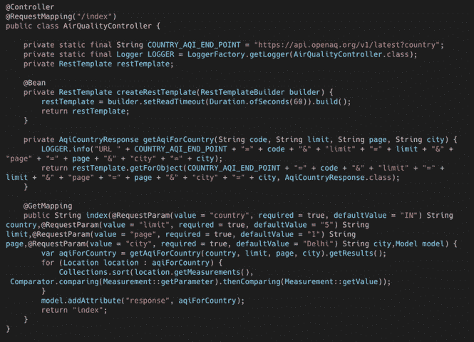

图 7.11 - 实时空气质量数据的代码

提示

自 5.0 版本以来，`RestTemplate`类已进入维护模式。这意味着只允许进行轻微的错误修复，并且它将在未来被移除，以支持`org.springframework.web.reactive.client.WebClient`类，该类支持同步和异步操作。要使用`WebClient`，您将需要添加另一个依赖，比如`spring-boot-starter-webflux`。如果您想避免只有一个依赖，您也可以使用 Java 11 中新增的新 HTTP 客户端 API。使用这个新 API，我们可以发送同步或异步请求。在下面的同步阻塞示例中，我们使用了`send(HttpRequest, HttpResponse.BodyHandler)`方法。该方法会阻塞，直到请求被发送并收到响应：

`HttpClient httpClient = HttpClient.newBuilder().build();`

`HttpRequest httpRequest = HttpRequest.newBuilder()`

`      .uri(URI.create("URL"))`

`.GET()`

`      .build();`

`HttpResponse<String> syncHttpResponse = httpClient.send(httpRequest, HttpResponse.BodyHandlers.ofString());`

同样，对于异步非阻塞，我们可以使用`sendAsync(HttpRequest, HttpResponse.BodyHandler)`方法。它返回一个`CompletableFuture<HttpResponse>`，可以与不同的异步任务结合使用。

`AqiCountryResponse`对象包含以下数据元素：

```
@Data
@JsonIgnoreProperties(ignoreUnknown = true)
  public class AqiCountryResponse {
    public List<Location> results;
}
@Data
@JsonIgnoreProperties(ignoreUnknown = true)
  public class Location {
    public String location;
    public String city;
    public List<Measurement> measurements;
}
@Data
@JsonIgnoreProperties(ignoreUnknown = true)
  public class Measurement {
    public String parameter;
    public String value;
    public String unit;
}
```

最后，我们必须对数据进行排序，并将数据返回到`index.html`页面上，以便在 UI 上呈现。对于 UI 部分，我们使用了 Spring Boot Thymeleaf 依赖。使用以下逻辑，我们可以在`/index.html`页面上显示实时空气质量数据：

```
<div th:if="${ not#lists.isEmpty(response)}">
    <table class="table table-bordered table-striped" 
      id="example" style="width: -moz-max-content">
        <tr>
            <th>Location</th>
            <th>City</th>
            <th colspan="30">Measurements</th>
        </tr>
        <tr th:each="response : ${response}">
            <td th:text="${response.location}"></td>
            <td th:text="${response.city}"></td>
            <th:block th:each="p ${response.measurements}">
                <td th:text="${p.parameter}"></td>
                <td th:text="${p.value}+''+${p.unit}"></td>
            </th:block>
        </tr>
        <table>
</div>
```

我们还创建了一个静态 HTML 表，指定了空气污染级别，并在同一页内为它们分配了颜色。这些颜色使人们可以轻松地确定他们所在地区的污染是否已经达到警戒级别：

```
<table class="table table-bordered" id="example1"
  style="width: max-content">
    <tr>
        <th>AQI</th>
        <th>Air Pollution Level</th>
        <th>Health Implications</th>
        <th>Cautionary Statement (for PM2.5)</th>
    </tr>
    <tr bgcolor="green">
        <td>0-50</td>
        <td>Good</td>
        <td>Air quality is considered satisfactory,
            and air pollution poses little or no risk</td>
        <td>None</td>
    </tr>
    <tr bgcolor="yellow">
        <td>51-100</td>
        <td>Moderate</td>
        <td>Air quality is acceptable; however, 
            for some pollutants there may be a moderate
            health concern for a very small number of
            people who are unusually sensitive to air
            pollution.
        </td>
        <td>Active children and adults, and people with
            respiratory disease, such as asthma,
            should limit prolonged outdoor exertion.
        </td>
    </tr>
<table>
```

此时，应用程序已经准备就绪。我们可以通过使用`mvn sprinboot:run`命令来运行它。让我们这样做，看看我们是否得到了预期的输出。在下面的截图中，您可以看到我们已将默认城市更改为孟买，并且我们可以查看孟买的实时空气质量数据：

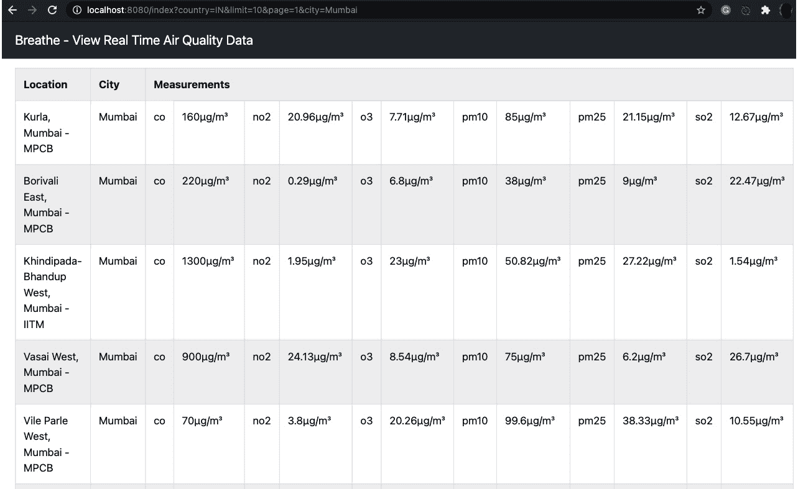

图 7.12 - 呼吸 - 孟买的实时空气质量数据

在同一页上，我们可以看到一个包含不同 AQI 范围及其严重程度相关信息的表格：

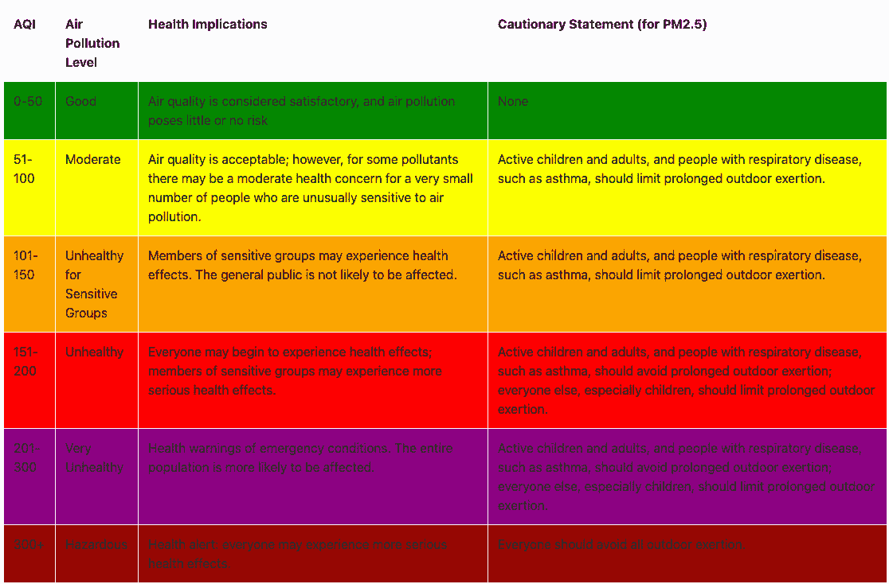

图 7.13 - 空气质量指数

在这一部分，我们创建了一个 Spring Boot 应用程序，用于显示您国家一个城市的实时空气质量数据。

在下一节中，我们将使用 Cloud Code 插件将我们的应用程序容器化并部署到本地的 Kubernetes 集群。

# 使用 Cloud Code 对 Spring Boot 应用程序进行容器化和部署

让我们尝试将我们在上一节中创建的 Spring Boot 应用程序进行容器化和部署。为了容器化我们的 Spring Boot 应用程序，我们将使用`jib-maven-plugin`。我们在之前的章节中多次使用过这个插件，所以我会在这里跳过设置。我们将使用`kubectl`将其部署到本地的 Minikube 集群。让我们学习如何做到这一点：

1.  首先，我们需要在项目的根目录中有一个`skaffold.yaml`文件。

1.  您可以创建一个名为`skaffold.yaml`的空文件，并使用 Cloud Code 的自动补全功能，如下截图所示，生成一个可用的`skaffold.yaml`文件：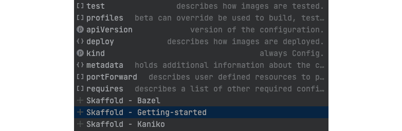

图 7.14 - 使用 Cloud Code 创建 skaffold.yaml 文件

1.  有时，可能会有新的模式版本可用。Cloud Code 足够智能，可以检测到这些更改，并建议您升级模式，如下面的屏幕截图所示：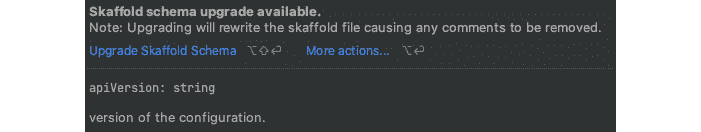

图 7.15 – 使用 Cloud Code 更新模式版本

1.  以下是我们的`skaffold.yaml`配置文件的最终版本。在这里，您可以看到我们使用`jib`来将我们的应用程序容器化。我们使用`kubectl`进行部署，我们使用的路径与我们为 Kubernetes 清单生成使用 Dekorate 时使用的路径相同：

```
apiVersion: skaffold/v2beta20
kind: Config
metadata:
  name: scanner
build:
  artifacts:
  - image: breathe
    jib:
      project: com.air.quality:scanner
deploy:
  kubectl:
    manifests:
      - target/classes/META-INF/dekorate/kubernetes.yml
```

在创建`skaffold.yaml`配置文件后不久，Cloud Code 检测到更改，并建议我们**创建 Cloud Code Kubernetes 运行配置**，如下所示：


图 7.16 – 使用 Cloud Code 创建运行配置

1.  单击此选项后，在 IntelliJ 的**运行/调试**配置下，将创建两个名为**在 Kubernetes 上开发**和**在 Kubernetes 上运行**的新配置文件：

图 7.17 – Cloud Code 配置文件

1.  要在持续开发模式下运行我们的应用程序，请从下拉菜单中选择**在 Kubernetes 上开发**。Cloud Code 在此模式下内部使用`skaffold dev`命令。它将为您执行以下操作：

+   它将开始监视源代码的更改。

+   它将使用 Jib 对我们的 Spring Boot 应用程序进行容器化。由于我们使用的是本地 Kubernetes 集群，Skaffold 足够智能，不会将图像推送到远程注册表以实现快速内部开发循环。相反，它将图像加载到本地 Docker 守护程序中。

+   它将部署图像到 Minikube 集群，端口转发到端口`8080`，并在您的 IDE 中开始流式传输日志。您的 IDE 中的事件日志将显示服务 URL，您可以使用该 URL 访问您的应用程序。输出将类似于我们在上一节中看到的内容。

**在 Kubernetes 上运行**选项类似于`skaffold run`命令。您可以使用此选项在需要时部署，而不是在每次代码更改时都这样做。

即使我们还没有这样做，您甚至可以使用 Cloud Code 部署到远程 Kubernetes 集群。如果您的 Kubernetes 上下文指向像 GKE 这样的远程集群，那么 Cloud Code 也可以在那里进行部署。如果您没有远程集群，Cloud Code 也可以帮助您创建。

Cloud Code 具有良好的集成，可以运行无服务器工作负载，以及使用谷歌的 Cloud Run。

在本节中，您学习了如何使用 Cloud Code 将 Spring Boot 应用程序容器化并部署到本地 Kubernetes 集群。现在，让我们总结一下本章。

# 总结

在本章中，您学习了如何使用谷歌开发的 Cloud Code 插件，从您的 IDE 中进行单击部署 Kubernetes 应用程序。我们从解释 Cloud Code 的各种功能开始了本章。在示例中，我们解释了如何使用 Cloud Code 提供的启动模板从您的 IDE 中编写、构建和部署 Java 应用程序。然后，我们创建了一个使用 Dekorate 在编译时生成 Kubernetes 清单的 Spring Boot 应用程序。最后，我们将 Spring Boot 应用程序容器化并部署到本地 Minikube 集群。

通过这样做，您已经发现了如何使用 Cloud Code 在开发云原生应用程序时提高生产力。

下一章将讨论如何将 Spring Boot 应用程序部署到 Google Kubernetes Engine。
