# 第八章：使用 Skaffold 将 Spring Boot 应用部署到 Google Kubernetes Engine

在上一章中，您学习了如何使用 Google 的 IntelliJ 的 Cloud Code 插件将 Spring Boot 应用部署到本地 Kubernetes 集群。本章重点介绍了如何将相同的 Spring Boot 应用部署到远程 Google Kubernetes Engine（GKE），这是 Google Cloud Platform（GCP）提供的托管 Kubernetes 服务。我们还将向您介绍 Google 最近推出的无服务器 Kubernetes 服务 GKE Autopilot。您还将了解 Google Cloud SDK 和 Cloud Shell，并使用它们来连接和管理远程 Kubernetes 集群。

在本章中，我们将涵盖以下主要主题：

+   开始使用 Google Cloud Platform

+   使用 Google Cloud SDK 和 Cloud Shell

+   设置 Google Kubernetes Engine

+   介绍 GKE Autopilot 集群

+   将 Spring Boot 应用部署到 GKE

到本章结束时，您将对 GCP 提供的基本服务有深入的了解，以便将 Spring Boot 应用部署到 Kubernetes。

# 技术要求

您需要在系统上安装以下内容才能按照本章的示例进行操作：

+   Eclipse ([`www.eclipse.org/downloads/`](https://www.eclipse.org/downloads/)) 或 IntelliJ IDE ([`www.jetbrains.com/idea/download/`](https://www.jetbrains.com/idea/download/))

+   Git ([`git-scm.com/downloads`](https://git-scm.com/downloads))

+   Google Cloud SDK

+   GCP 账户

+   Spring Boot 2.5

+   OpenJDK 16

本章中的代码示例也可以在 GitHub 上找到：[`github.com/PacktPublishing/Effortless-Cloud-Native-App-Development-Using-Skaffold`](https://github.com/PacktPublishing/Effortless-Cloud-Native-App-Development-Using-Skaffold)。

# 开始使用 Google Cloud Platform

今天，许多组织利用不同云提供商提供的服务，如亚马逊网络服务（AWS）、谷歌的 GCP、微软 Azure、IBM 云或甲骨文云。使用这些云供应商的优势在于您无需自行管理基础架构，通常按小时支付这些服务器的使用费用。此外，大多数情况下，如果组织不了解或未能解决其应用程序所需的计算能力，可能会导致计算资源的过度配置。

如果您自行管理基础架构，就必须雇佣一大批人员来负责维护活动，如打补丁操作系统、升级软件和升级硬件。这些云供应商通过为我们提供这些服务来帮助我们解决业务问题。此外，这些云供应商支持的产品都具有内置的维护功能，无论是数据库还是 Kubernetes 等托管服务。如果您已经使用过这些云供应商中的任何一个，您可能会发现所有这些供应商提供类似的服务或产品，但实施和工作方式是不同的。

例如，您可以在链接[`cloud.google.com/free/docs/aws-azure-gcp-service-comparison`](https://cloud.google.com/free/docs/aws-azure-gcp-service-comparison)中查看 GCP 提供的服务及其 AWS 和 Azure 等价物。

现在我们知道使用这些云供应商有不同用例的优势，让我们谈谈一个这样的云供应商——谷歌云平台。

谷歌云平台（通常缩写为 GCP）为您提供一系列服务，如按需虚拟机（通过谷歌计算引擎）、用于存储文件的对象存储（通过谷歌云存储）和托管的 Kubernetes（通过谷歌 Kubernetes 引擎）等。

在开始使用谷歌的云服务之前，您首先需要注册一个帐户。如果您已经拥有谷歌帐户，如 Gmail 帐户，那么您可以使用该帐户登录，但您仍需要单独注册云帐户。如果您已经在谷歌云平台上注册，可以跳过此步骤。

首先，转到[`cloud.google.com`](https://cloud.google.com)。接下来，您将被要求进行典型的 Google 登录流程。如果您还没有 Google 帐户，请按照注册流程创建一个。以下屏幕截图是 Google Cloud 登录页面：

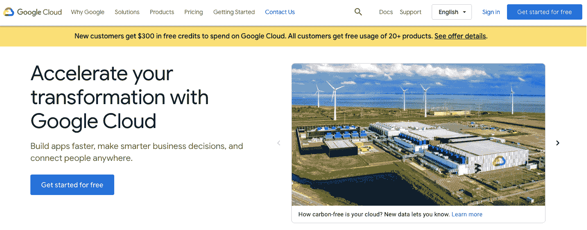

图 8.1 - 开始使用 Google Cloud

如果您仔细查看屏幕截图，会发现它说**新客户可获得价值 300 美元的 Google Cloud 免费信用额度。所有客户都可以免费使用 20 多种产品**。这意味着您可以免费使用免费套餐产品，而无需支付任何费用，并且您还将获得价值 300 美元的信用额度，可供您在 90 天内探索或评估 GCP 提供的不同服务。例如，您可以在指定的月度使用限制内免费使用 Compute Engine、Cloud Storage 和**BigQuery**。

您可以单击**免费开始**或**登录**。如果您是第一次注册，必须提供您的计费信息，这将重定向您到您的云**控制台**。此外，系统会自动为您创建一个新项目。项目是您的工作空间。单个项目中的所有资源都与其他项目中的资源隔离。您可以控制对该项目的访问，并仅授予特定个人或服务帐户访问权限。以下屏幕截图是您的 Google Cloud 控制台仪表板视图：

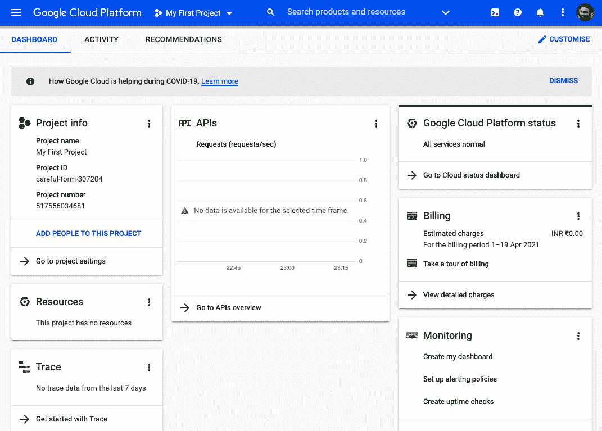

图 8.2 - Google Cloud 控制台仪表板

在控制台页面的左侧，您可以查看 GCP 提供的不同服务：

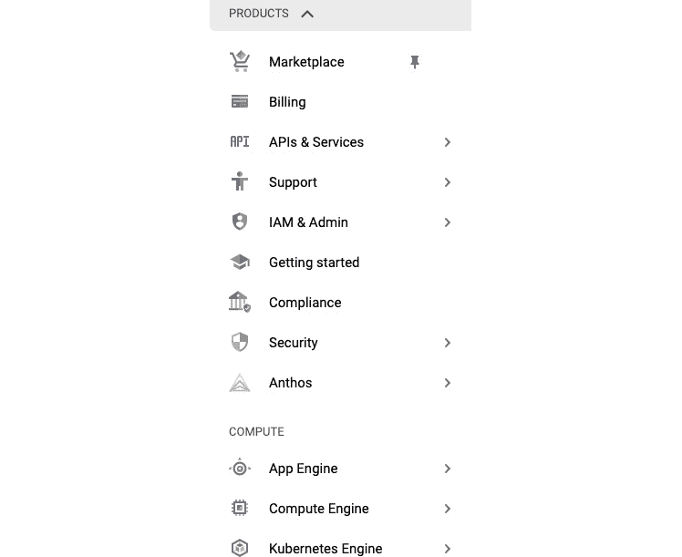

图 8.3 - Google Cloud 服务视图

在本章中，重点将放在 GCP 提供的 GKE 服务 API 上。但在讨论这些服务之前，我们需要安装一些工具来使用这些服务。让我们在下一节讨论这些工具。

# 使用 Google Cloud SDK 和 Cloud Shell

您现在可以访问 GCP 控制台，并且可以使用控制台几乎可以做任何事情。但是，开发人员的更好方法是使用 Cloud SDK，这是一组工具，允许通过使用仿真器或**kubectl**、**Skaffold**和**minikube**等工具进行更快的本地开发。不仅如此，您还可以管理资源，对远程 Kubernetes 集群进行身份验证，并从本地工作站启用或禁用 GCP 服务。另一个选项是从浏览器使用 Cloud Shell，我们将在本章中探索这两个选项。Cloud SDK 为您提供了与其产品和服务进行交互的工具和库。在使用 Cloud SDK 时，您可以根据需要安装和删除组件。

让我们从 Cloud SDK 开始。您可以转到[`cloud.google.com/sdk/`](https://cloud.google.com/sdk/)并单击**开始**按钮。这将重定向您到安装指南。Cloud SDK 的最低先决条件是具有 Python。支持的版本包括 Python 3（首选 3.5 到 3.8）和 Python 2（2.7.9 或更高版本）。例如，现代版本的 macOS 包括 Cloud SDK 所需的适当版本的 Python。但是，如果您想要安装带有 Cloud SDK 的 Python 3，可以选择带有捆绑 Python 安装的 macOS 64 位版本。

## 在 Linux 上下载 Cloud SDK

Cloud SDK 需要安装 Python，因此首先使用以下命令验证 Python 版本：

```
python --version
```

要从命令行下载 Linux 64 位存档文件，请运行以下命令：

```
curl -O https://dl.google.com/dl/cloudsdk/channels/rapid/downloads/google-cloud-sdk-336.0.0-linux-x86_64.tar.gz
```

对于 32 位存档文件，请运行以下命令：

```
curl -O https://dl.google.com/dl/cloudsdk/channels/rapid/downloads/google-cloud-sdk-336.0.0-linux-x86.tar.gz
```

## 在 macOS 上下载 Cloud SDK

要在 macOS 上下载 Cloud SDK，您可以选择以下选项：

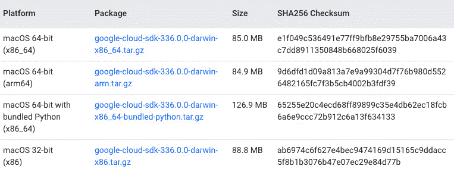

图 8.4 - macOS 的下载选项

如果您不确定您的机器硬件，那么运行`uname -m`命令。根据您的机器，您将获得以下输出：

```
$uname -m
x86_64
```

现在选择适当的软件包，并从[`cloud.google.com/sdk/docs/install#mac`](https://cloud.google.com/sdk/docs/install#mac)中的表中的**软件包**列中给出的 URL 进行下载。

## 设置 Cloud SDK

下载软件包后，您需要将存档提取到文件系统上您选择的位置。以下是提取的`google-cloud-sdk`存档的内容：

```
tree -L 1 google-cloud-sdk
google-cloud-sdk
├── LICENSE
├── README
├── RELEASE_NOTES
├── VERSION
├── bin
├── completion.bash.inc
├── completion.zsh.inc
├── data
├── deb
├── install.bat
├── install.sh
├── lib
├── path.bash.inc
├── path.fish.inc
├── path.zsh.inc
├── platform
├── properties
└── rpm
```

解压缩存档后，您可以通过运行存档根目录中的`install.sh`脚本来继续安装。您可能会看到以下输出：

```
$ ./google-cloud-sdk/install.sh 
Welcome to the Google Cloud SDK!
To help improve the quality of this product, we collect anonymized usage data
and anonymized stacktraces when crashes are encountered; additional information
is available at <https://cloud.google.com/sdk/usage-statistics>. This data is
handled in accordance with our privacy policy
<https://cloud.google.com/terms/cloud-privacy-notice>. You may choose to opt in this
collection now (by choosing 'Y' at the below prompt), or at any time in the
future by running the following command:
    gcloud config set disable_usage_reporting false
Do you want to help improve the Google Cloud SDK (y/N)?  N
Your current Cloud SDK version is: 336.0.0
The latest available version is: 336.0.0
```

在以下屏幕中，您可以看到已安装和未安装的组件列表：

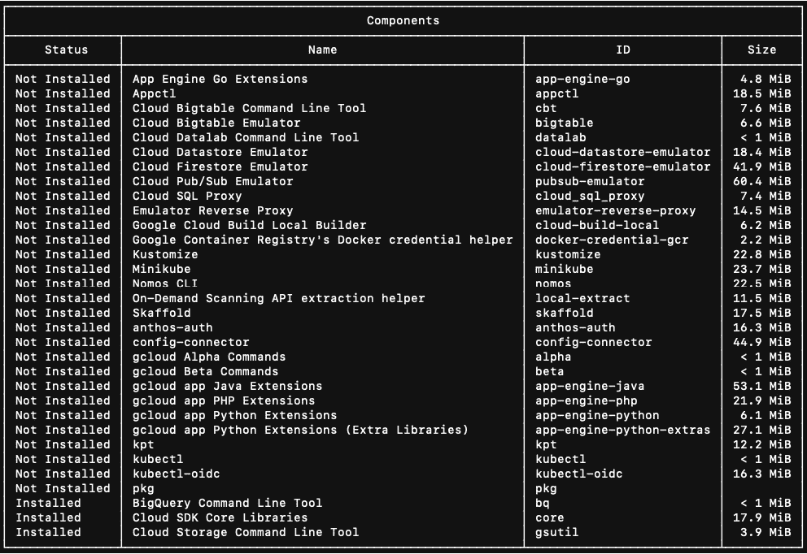

图 8.5 – Google Cloud SDK 组件列表

您可以使用以下 Cloud SDK 命令来安装或移除组件：

```
To install or remove components at your current SDK version [336.0.0], run:
  $ gcloud components install COMPONENT_ID
  $ gcloud components remove COMPONENT_ID
Enter a path to an rc file to update, or leave blank to use 
[/Users/ashish/.zshrc]:  
No changes necessary for [/Users/ashish/.zshrc].
For more information on how to get started, please visit:
  https://cloud.google.com/sdk/docs/quickstarts
```

确保在此之后使用`source .zshrc`命令来源化您的 bash 配置文件。从安装中，您可以看到默认只安装了三个组件，即`. bq`、`core`和`gsutil`。

下一步是运行`gcloud init`命令来初始化 SDK，使用以下命令：

```
$/google-cloud-sdk/bin/gcloud init  
Welcome! This command will take you through the configuration of gcloud.
Your current configuration has been set to: [default]
You can skip diagnostics next time by using the following flag:
  gcloud init --skip-diagnostics
Network diagnostic detects and fixes local network connection issues.
Checking network connection...done
Reachability Check passed.
Network diagnostic passed (1/1 checks passed).
You must log in to continue. Would you like to log in (Y/n)?  Y
Your browser has been opened to visit:
    https://accounts.google.com/o/oauth2/auth?response_type=code&client_id=32555940559.apps.googleusercontent.com&redirect_uri=http%3A%2F%2Flocalhost%3A8085%2F&scope=openid+https%3A%2F%2Fwww.googleapis.com%2Fauth%2Fuserinfo.email+https%3A%2F%2Flocalhost%3A8085%2F&scope=openid+https%3A%2F%2Fwww.googleapis.com%2Fauth%2Fuserinfo.email+https%3A%2F%2Fwww.googleapis.com%2Fauth%2Fcloud-platform+https%3A%2F%2Fwww.googleapis.com%2Fauth%2Fappengine.admin+https%3A%2F%2Fwww.googleapis.com%2Fauth%2Fcompute+https%3A%2F%2Fwww.googleapis.com%2Fauth%2Faccounts.reauth&state=CU1Yhij0NWZB8kZvNx6aAslkkXdlYf&access_type=offline&code_challenge=sJ0_hf6-zNKLjVSw9fZlxjLodFA-EsunnBWiRB5snmw&code_challenge_method=S256
```

此时，您将被重定向到浏览器窗口，并被要求登录您的 Google 账户进行身份验证，并授予 Cloud SDK 对您的云资源的访问权限。

点击**允许**按钮，确保下次可以作为自己与 GCP API 进行交互。授予访问权限后，您将看到以下屏幕以确认身份验证：

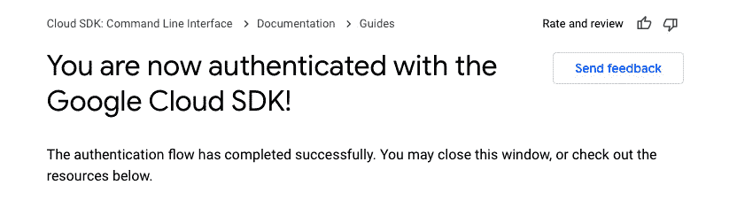

图 8.6 – Google Cloud SDK 身份验证完成

现在您已经完成了身份验证，并准备好使用 Cloud SDK 进行工作。完成身份验证后，您可能会在命令行上看到以下内容：

```
Updates are available for some Cloud SDK components.  To install them,
please run:
  $ gcloud components update
You are logged in as: [XXXXXXX@gmail.com].
Pick cloud project to use: 
 [1] xxxx-xxx-307204
 [2] Create a new project
Please enter numeric choice or text value (must exactly match list 
item):  1
Your current project has been set to: [your-project-id].
Do you want to configure a default Compute Region and Zone? (Y/n)?  Y
Which Google Compute Engine zone would you like to use as project 
default?
If you do not specify a zone via a command line flag while working 
with Compute Engine resources, the default is assumed.
 [1] us-east1-b
 [2] us-east1-c
 [3] us-east1-d
.................
Please enter a value between 1 and 77, or a value present in the list:  1
Your project default Compute Engine zone has been set to [us-east1-b].
You can change it by running [gcloud config set compute/zone NAME].
Your project default Compute Engine region has been set to [us-east1].
You can change it by running [gcloud config set compute/region NAME].
Your Google Cloud SDK is configured and ready to use!
......
```

从命令行输出可以清楚地看出，我们已经选择了项目并确认了计算引擎区域。现在，我们已经成功安装了 Cloud SDK。在下一节中，我们将学习有关 Cloud Shell 的内容。

### 使用 Cloud Shell

Cloud Shell 是一个基于浏览器的终端/CLI 和编辑器。它预装了诸如 Skaffold、minikube 和 Docker 等工具。您可以通过单击 Cloud 控制台浏览器窗口右上角的以下图标来激活它：


图 8.7 – 激活 Cloud Shell

激活后，您将被重定向到以下屏幕：

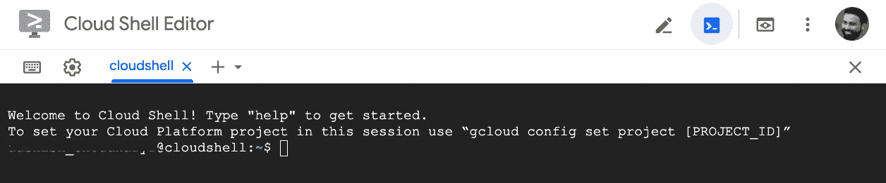

图 8.8 – Cloud Shell 编辑器

您可以使用`gcloud config set project projectid`命令设置您的项目 ID，或者只是开始使用`gcloud`命令进行操作。以下是 Cloud Shell 提供的一些突出功能：

+   Cloud Shell 完全基于浏览器，并且您可以从任何地方访问它。唯一的要求是互联网连接。

+   Cloud Shell 为您的`$HOME`目录挂载了 5GB 的持久存储。

+   Cloud Shell 带有在线代码编辑器。您可以使用它来构建、测试和调试您的应用程序。

+   Cloud Shell 还带有安装的 Git 客户端，因此您可以从代码编辑器或命令行克隆和推送更改到您的存储库。

+   Cloud Shell 带有 Web 预览，您可以在 Web 应用中查看本地更改。

我们已经为我们的使用安装和配置了 Google Cloud SDK。我们还看了 Cloud Shell 及其提供的功能。现在让我们创建一个 Kubernetes 集群，我们可以在其中部署我们的 Spring Boot 应用程序。

# 设置 Google Kubernetes Engine 集群

我们需要在 GCP 上设置一个 Kubernetes 集群，以部署我们的容器化 Spring Boot 应用程序。GCP 可以提供托管和管理的 Kubernetes 部署。我们可以使用以下两种方法在 GCP 上创建 Kubernetes 集群：

+   使用 Google Cloud SDK 创建 Kubernetes 集群

+   使用 Google 控制台创建 Kubernetes 集群

让我们详细讨论每个。 

## 使用 Google Cloud SDK 创建 Kubernetes 集群

我们可以使用以下 gcloud SDK 命令创建用于运行容器的 Kubernetes 集群。这将使用默认设置创建一个 Kubernetes 集群：

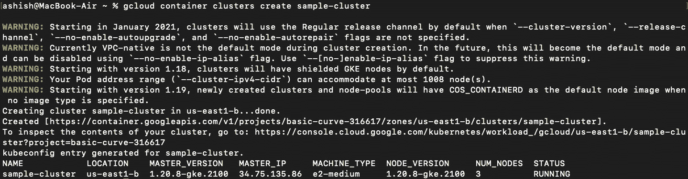

图 8.9 - GKE 集群已启动

我们已成功使用 Cloud SDK 创建了一个 Kubernetes 集群。接下来，我们将尝试使用 Google 控制台创建集群。

## 使用 Google 控制台创建 Kubernetes 集群

要使用控制台创建 Kubernetes 集群，您应首先使用左侧导航栏并选择**Kubernetes Engine**。在呈现的选项中，选择**Clusters**：

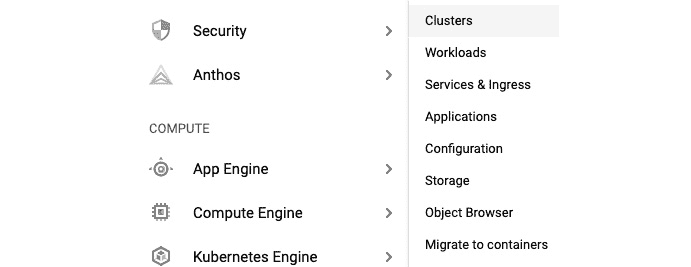

图 8.10 - 开始使用 Google Kubernetes Engine 创建集群

之后，您将在下一页上看到以下屏幕：

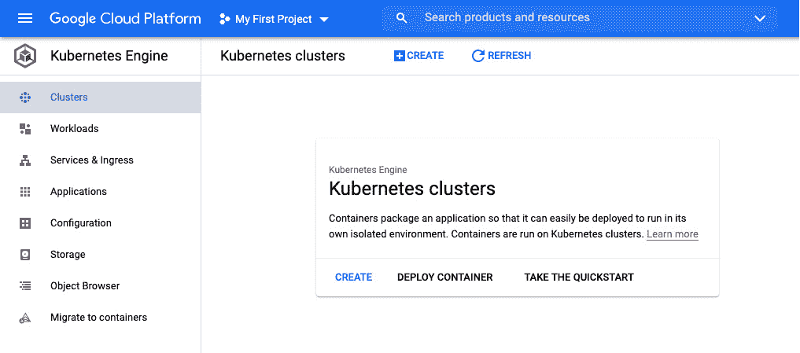

图 8.11 - 创建 Google Kubernetes Engine 集群

您可以通过单击弹出窗口上的**CREATE**按钮或单击页面顶部的**+CREATE**来选择创建集群。两者都会为您提供以下选项可供选择，如*图 8.12*中所述：

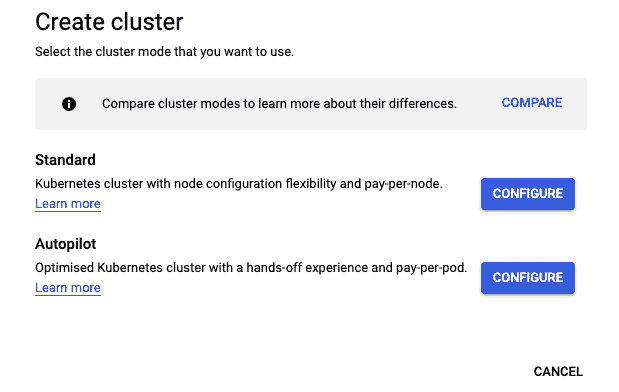

图 8.12 – Google Kubernetes Engine 集群模式

您可以选择创建**标准**Kubernetes 集群，或者选择完全无需操作的**Autopilot**模式。在本节中，我们将讨论标准集群。我们将在下一节单独讨论 Autopilot。

在标准集群模式下，您可以灵活选择集群节点的数量，并根据需要调整配置或设置。以下是创建 Kubernetes 集群的步骤。由于我们使用默认配置，您必须单击**下一步**接受默认选项。

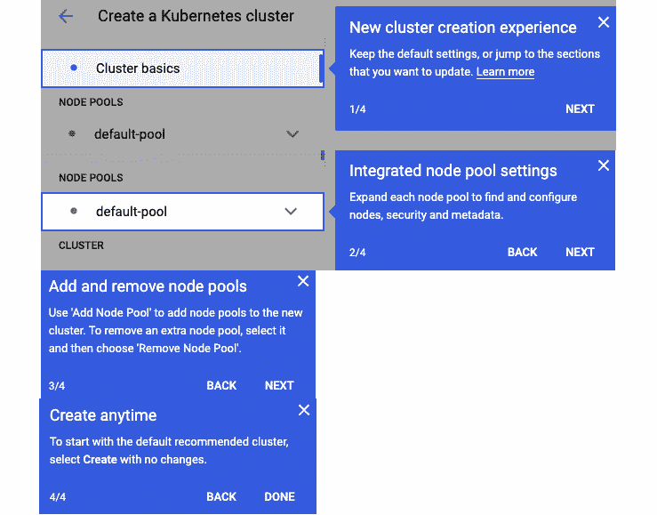

图 8.13 – Google Kubernetes Engine 集群创建

最后，单击页面底部的**创建**按钮，您的 Kubernetes 集群将在几分钟内运行起来！

以下是您集群的默认配置：

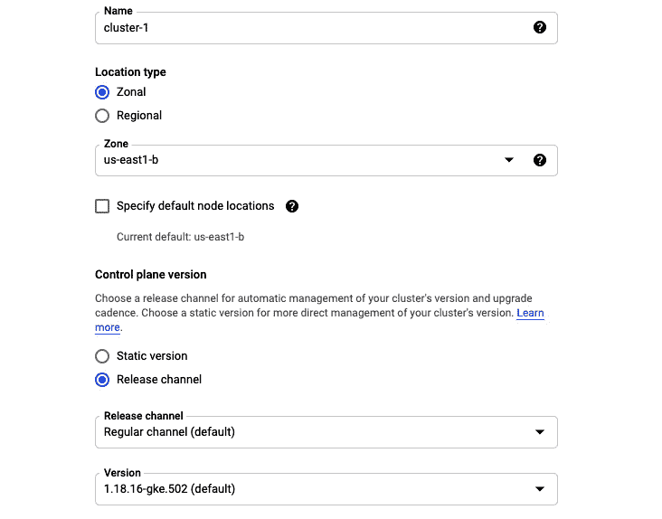

图 8.14 – Google Kubernetes Engine 集群配置视图

您的 Kubernetes 集群现在已经运行起来。在下面的截图中，我们可以看到我们有一个三节点集群，具有六个 vCPU 和 12GB 的总内存：

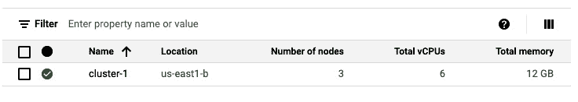

图 8.15 – Google Kubernetes Engine 集群已经运行

您可以通过单击集群名称**cluster-1**查看有关集群节点、存储和日志的更多详细信息。以下是我们刚刚创建的集群节点的详细信息：

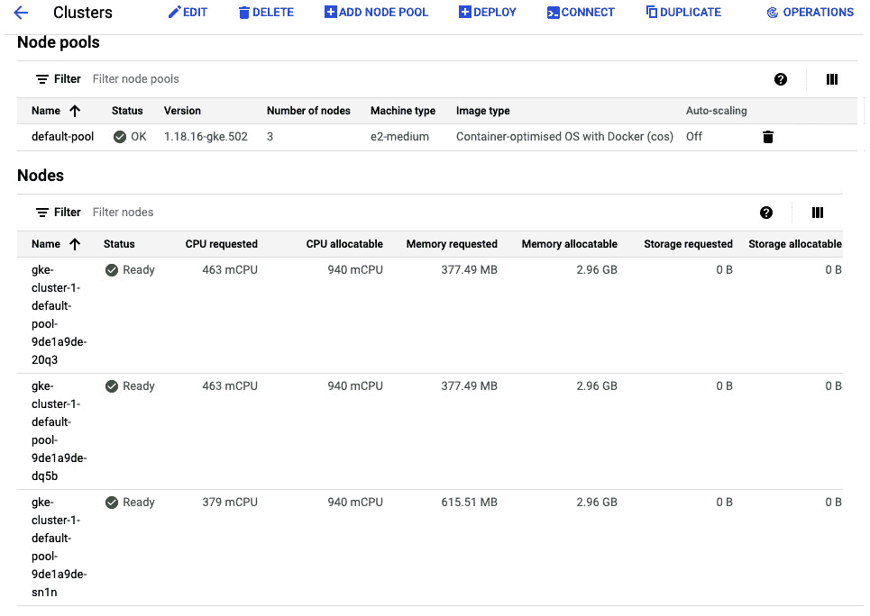

图 8.16 – Google Kubernetes Engine 集群视图

您可以看到整体集群状态和节点健康状况都是正常的。集群节点是使用 Compute Engine GCP 创建的，并提供机器类型为**e2-medium**。您可以通过查看左侧导航栏上的 Compute Engine 资源来验证这一点。我们在这里显示了相同的三个节点，GKE 集群使用了我们刚刚创建的这些节点。

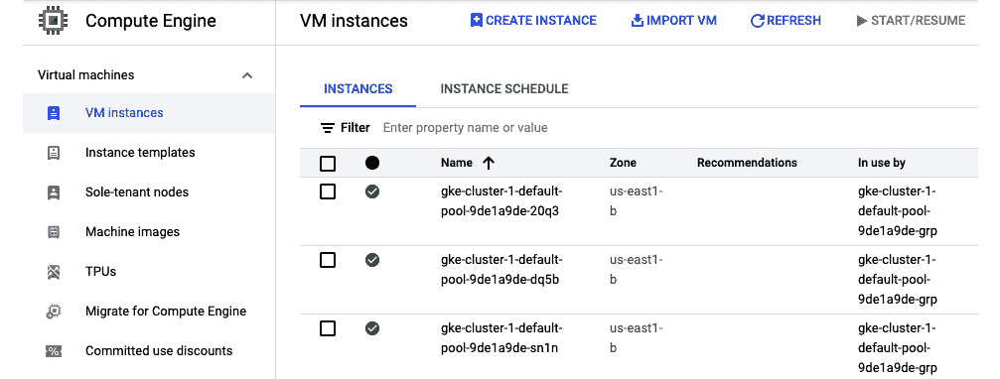

图 8.17 – Google Kubernetes Engine 集群 VM 实例

我们已经学会了如何使用 Google 控制台创建一个 Kubernetes 标准集群。在接下来的部分，我们将学习关于 Autopilot 集群。

# 介绍 Google Kubernetes Engine Autopilot 集群

2021 年 2 月 24 日，Google 宣布了他们完全托管的 Kubernetes 服务 GKE Autopilot 的一般可用性。这是一个完全托管和无服务器的 Kubernetes 即服务提供。目前没有其他云提供商在管理云上的 Kubernetes 集群时提供这种级别的自动化。大多数云提供商会让你自己管理一些集群管理工作，无论是管理控制平面（API 服务器、etcd、调度器等）、工作节点，还是根据你的需求从头开始创建一切。

正如其名字所示，GKE Autopilot 是一个完全无需干预的体验，在大多数情况下，你只需要指定一个集群名称和区域，如果需要的话设置网络，就这样。你可以专注于部署你的工作负载，让 Google 完全管理你的 Kubernetes 集群。Google 为 Autopilot pods 在多个区域提供 99.9%的正常运行时间。即使你自己管理这些，也无法达到 Google 提供的数字。此外，GKE Autopilot 是具有成本效益的，因为你不需要支付虚拟机（VMs）的费用，你只需要按资源的秒数计费（例如，被你的 pods 消耗的 vCPU、内存和磁盘空间）。

那么，我们在上一节中创建的 GKE 标准集群和 GKE Autopilot 集群有什么区别呢？答案如下：对于标准集群，你只管理节点，因为 GKE 管理控制平面；而对于 GKE Autopilot，你什么都不用管理（甚至不用管理你的工作节点）。

这引发了一个问题：我无法控制我的节点是好事还是坏事？现在，这是值得讨论的，但是今天大多数组织并不像 amazon.com、google.com 或 netflix.com 那样处理流量或负载。这可能是一个过于简化的说法，但老实说，即使您认为自己有特定的需求或需要一个专门的集群，往往最终会浪费大量时间和资源来保护和管理您的集群。如果您有一支 SRE 团队，他们可以匹敌 Google SRE 的经验或知识水平，您可以随心所欲地处理您的集群。但是今天大多数组织并没有这样的专业知识，也不知道他们在做什么。这就是为什么最好依赖完全托管的 Kubernetes 服务，比如 GKE Autopilot – 它经过了实战测试，并且根据从 Google SRE 学到的最佳实践进行了加固。

我们已经讨论了足够多关于 GKE 自动驾驶的特性以及它提供的完全抽象，然而，要记住这些抽象，也有一些限制。例如，在自动驾驶模式下，您不能为容器运行特权模式。有关限制的完整列表，请阅读官方文档：[`cloud.google.com/kubernetes-engine/docs/concepts/autopilot-overview#limits`](https://cloud.google.com/kubernetes-engine/docs/concepts/autopilot-overview#limits)。

到目前为止，我们已经对 GKE 自动驾驶有了足够的了解，现在是时候创建我们的集群了。让我们开始吧！

## 创建自动驾驶集群

在单击**配置**按钮之后，如*图 8.13*中所述，您将被重定向到以下屏幕：

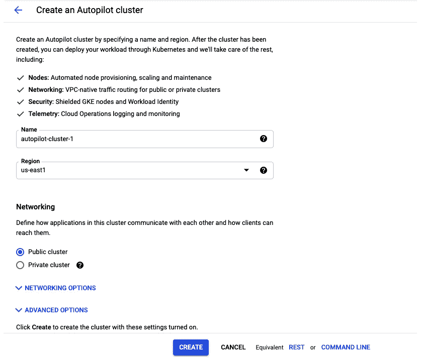

图 8.18 – 创建 GKE 自动驾驶集群

自动驾驶集群具有节点管理、网络、安全和遥测等功能，这些功能已经内置了 Google 推荐的最佳实践。GKE 自动驾驶确保您的集群经过了优化，并且已经准备好投入生产。

正如您所见，您在这里可以更改的选项非常少。您可以更改集群的**名称**，选择另一个**区域**，或选择**网络**（即公共或私有）。在**网络选项**下，您可以更改诸如网络、子网络、Pod IP 地址范围和集群服务 IP 地址范围等内容，如下面的屏幕截图所示：

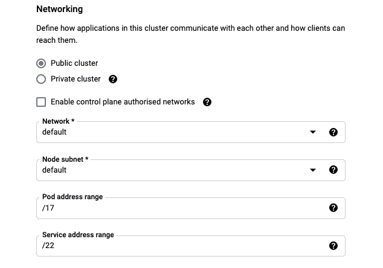

图 8.19 – GKE Autopilot 集群配置

在**高级选项**下，您可以启用维护窗口，并允许特定时间范围内的维护排除（如*图 8.19*所示）。在此窗口中，您的 GKE 集群将进行自动维护窗口，并且不会对您可用。您应根据自己的需求选择维护窗口。

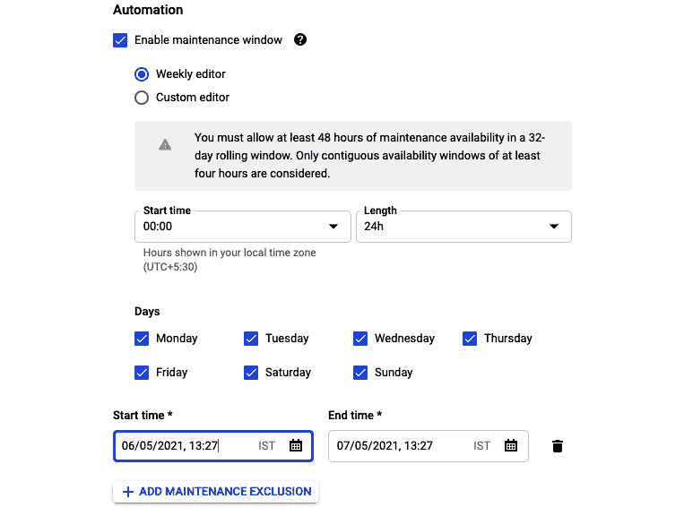

图 8.20 – 配置 GKE Autopilot 集群维护窗口

现在，我们将使用默认值并单击页面底部的**创建**按钮来创建集群。创建集群可能需要几分钟时间。在下面的屏幕截图中，您可以看到 Autopilot 集群已经运行：

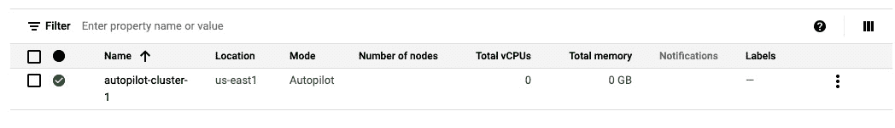

图 8.21 – GKE Autopilot 集群已经运行

在这里，您可以看到节点的数量没有被提及，因为它是由 GKE 管理的。

接下来，我们可以尝试连接到这个集群。要这样做，请单击屏幕右上角的三个点，然后单击**连接**：


图 8.22 – 连接到 GKE Autopilot 集群

单击**连接**后，应该会出现以下弹出窗口。您可以将此处提到的命令复制到您的 CLI 或 Cloud Shell 中：

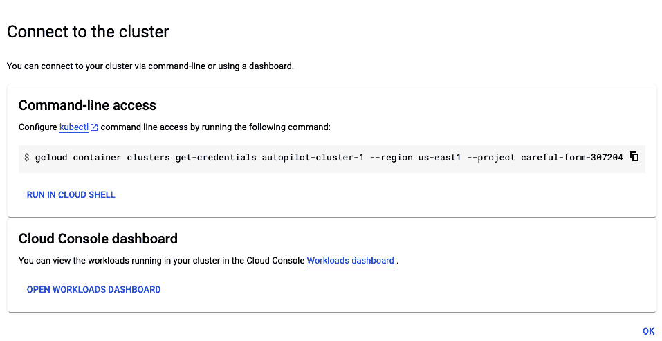

图 8.23 – 连接到 GKE Autopilot 集群的命令

然后，您可以使用以下`kubectl get nodes`命令验证集群详细信息：

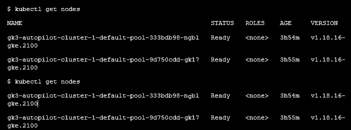

图 8.24 – kubectl 命令输出

我们还可以使用以下命令在自动驾驶模式下创建 GKE 集群：

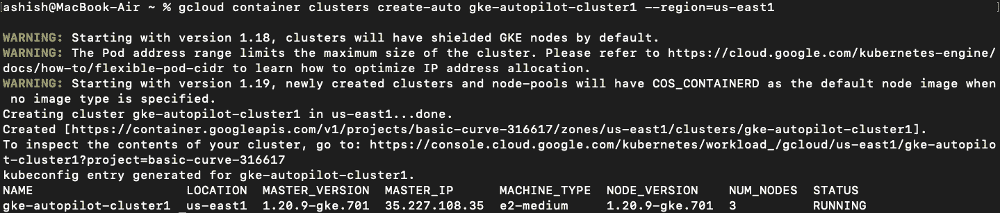

图 8.25 – 自动驾驶模式下的 GKE 集群

我们也可以在 Google Cloud 控制台上进一步验证。您可以看到我们现在有两个集群。第一个是使用 Cloud 控制台创建的，第二个是使用 gcloud 命令行创建的。

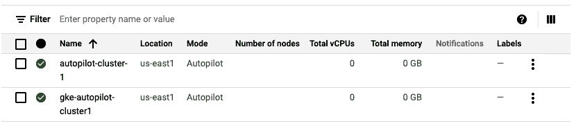

图 8.26 – GKE Autopilot 集群

我们已经了解了在 GCP 上创建 Kubernetes 集群的不同方式。现在，让我们使用 Skaffold 将一个可工作的 Spring Boot 应用程序部署到 GKE。

# 将 Spring Boot 应用程序部署到 GKE

我们将在本节中使用的 Spring Boot 应用程序与上一章中相同（我们命名为*Breathe – View Real-Time Air Quality Data*的应用程序）。我们已经熟悉这个应用程序，所以我们将直接跳转到部署到 GKE。我们将使用在上一节中创建的`gke-autopilot-cluster1`来进行部署。我们将使用 Skaffold 使用以下两种方法进行部署：

+   使用 Skaffold 从本地部署到远程 GKE 集群

+   使用 Skaffold 从 Cloud Shell 部署到 GKE 集群

## 使用 Skaffold 从本地部署到远程 GKE 集群

在本节中，您将学习如何使用 Skaffold 将 Spring Boot 应用程序部署到远程 Kubernetes 集群。让我们开始吧：

1.  在上一章中，我们使用**Dockerfile**将我们的 Spring Boot 应用程序容器化。然而，在本章中，我们将使用`Jib-Maven`插件来容器化应用程序。我们已经知道如何在以前的章节中使用 jib-maven 插件，所以我们将跳过在这里再次解释这个。

1.  唯一的变化是我们将使用**Google 容器注册表**（**GCR**）来存储 Jib 推送的图像。GCR 是您图像的安全私有注册表。在那之前，我们需要确保 GCR 访问已对您的帐户启用。您可以使用以下`gcloud`命令来允许访问：

```
gcloud services enable containerregistry.googleapis.com
```

或者您可以转到[`cloud.google.com/container-registry/docs/quickstart`](https://cloud.google.com/container-registry/docs/quickstart)，并通过单击**启用 API**按钮来启用容器注册表 API。


图 8.27 – 启用 Google 容器注册表 API

接下来，您将被要求选择一个项目，然后单击**继续**。就是这样！

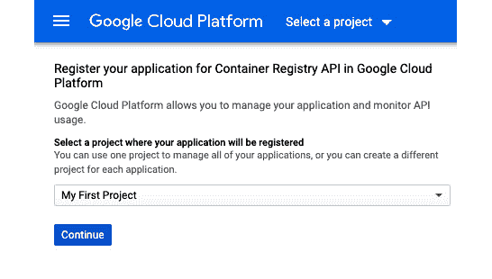

图 8.28 – 为容器注册表 API 注册您的应用程序

1.  您还可以使容器注册表中的图像对公共访问可用。如果它们是公共的，您的图像用户可以在不进行任何身份验证的情况下拉取图像。在下面的屏幕截图中，您可以看到一个选项，**启用漏洞扫描**，用于推送到您的容器注册表的图像。如果您愿意，您可以允许它扫描您的容器图像以查找漏洞。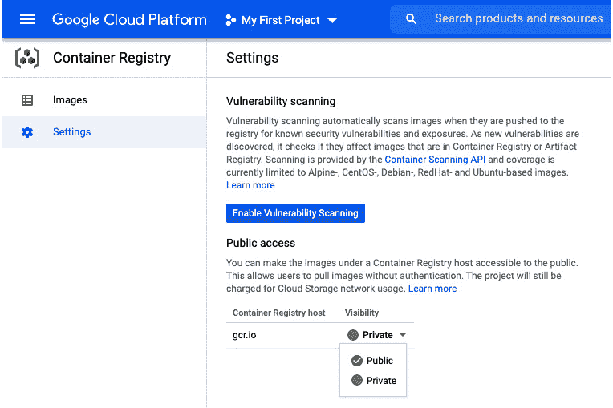

图 8.29 – GCR 设置

1.  下一个谜题的部分是创建 Kubernetes 清单，如**Deployment**和**Service**。在上一章中，我们使用了**Dekorate**工具（[`github.com/dekorateio/dekorate`](https://github.com/dekorateio/dekorate)）创建了它们。在这里，我们将继续使用相同的 Kubernetes 清单生成过程。生成的 Kubernetes 清单位于`target/classes/META-INF/dekorate/kubernetes.yml`路径下。

1.  接下来，我们将运行`skaffold init --XXenableJibInit`命令，这将为我们创建一个`skaffold.yaml`配置文件。您可以看到 Skaffold 在生成的`skaffold.yaml`文件的`deploy`部分中添加了 Kubernetes 清单的路径，并将使用`jib`进行镜像构建：

```
apiVersion: skaffold/v2beta20
kind: Config
metadata:
  name: scanner
build:
artifacts:
  - image: breathe
    jib:
      project: com.air.quality:scanner
deploy:
  kubectl:
    manifests:
    - target/classes/META-INF/dekorate/kubernetes.yml
```

1.  我们有与上一章中解释的相同的主类，该主类使用了 Dekorate 工具提供的`@KubernetesApplication` `(serviceType = ServiceType.LoadBalancer)`注解，将服务类型声明为`LoadBalancer`：

```
@KubernetesApplication(serviceType = ServiceType.LoadBalancer)
@SpringBootApplication
public class AirQualityScannerApplication {
   public static void main(String[] args) {
      SpringApplication.run(AirQualityScannerApplication.        class, args);
   }
}
```

在编译时，Dekorate 将生成以下 Kubernetes 清单。我还将它们保存在源代码的 k8s 目录中，因为有时我们必须手动添加或删除 Kubernetes 清单中的内容。部署和服务 Kubernetes 清单也可以在 GitHub 上找到：[`github.com/PacktPublishing/Effortless-Cloud-Native-App-Development-Using-Skaffold/blob/main/Chapter07/k8s/kubernetes.yml`](https://github.com/PacktPublishing/Effortless-Cloud-Native-App-Development-Using-Skaffold/blob/main/Chapter07/k8s/kubernetes.yml)。

接下来，我们需要确保您已经通过`gcloud auth list`命令进行了身份验证，以便使用 Google Cloud 服务。您将看到以下输出：

```
Credentialed AccountsACTIVE  ACCOUNT*       <my_account>@<my_domain.com>To set the active account, run:    $ gcloud config set account 'ACCOUNT'
```

如果您尚未进行身份验证，也可以使用`gcloud auth login`命令。

1.  如果尚未设置，请使用`gcloud config set project <PROJECT_ID>`命令设置您的 GCP 项目。

1.  确保 Kubernetes 上下文设置为远程 Google Kubernetes 集群。使用以下命令进行验证：

```
$ kubectl config current-context    
gke_project_id_us-east1_gke-autopilot-cluster1
```

1.  现在我们已经准备好部署。让我们运行`skaffold run --default-repo=gcr.io/<PROJECT_ID>`命令。这将构建应用程序的容器镜像，并将其推送到远程 GCR。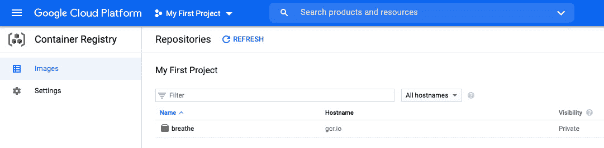

图 8.30 – 镜像推送到 Google 容器注册表

推送的镜像详细信息可以在以下截图中看到：

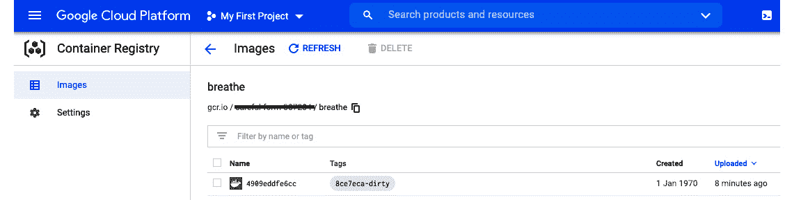

图 8.31 – Google 容器注册表图像视图

1.  最后，将其部署到远程 Google Kubernetes 集群。第一次运行时，部署需要一些时间来稳定，但后续运行会快得多。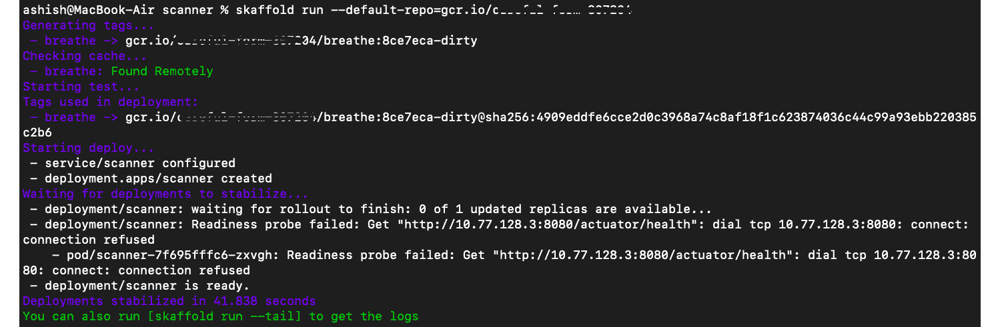

图 8.32 – Skaffold 运行输出

1.  我们还可以在 Google Cloud 控制台上查看部署状态。转到**Kubernetes Engine**，然后单击左侧导航栏上的**工作负载**选项卡以查看部署状态。部署状态为**OK**。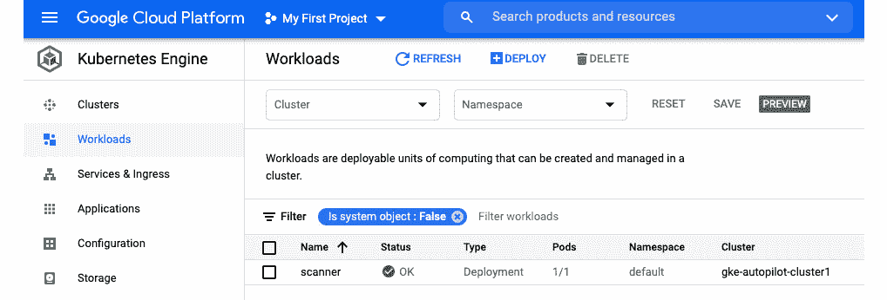

图 8.33 – 部署状态

您可以通过单击应用程序名称查看更多**部署**详情。

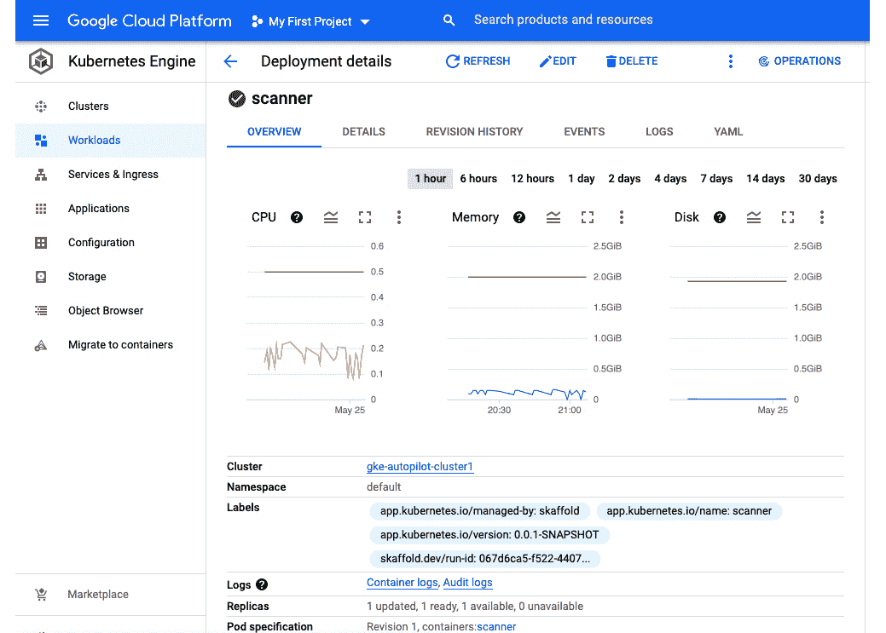

图 8.34 – 部署详情

1.  到目前为止一切看起来都很好。现在我们只需要服务的 IP 地址，这样我们就可以访问我们的应用程序了。在同一部署详情页面的底部，我们有关于我们的服务的详细信息。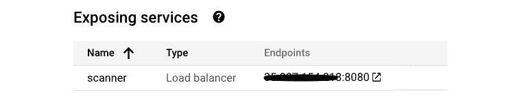

图 8.35 – 暴露的服务

1.  让我们访问 URL 并验证是否获得了期望的输出。我们可以查看德里的实时空气质量数据：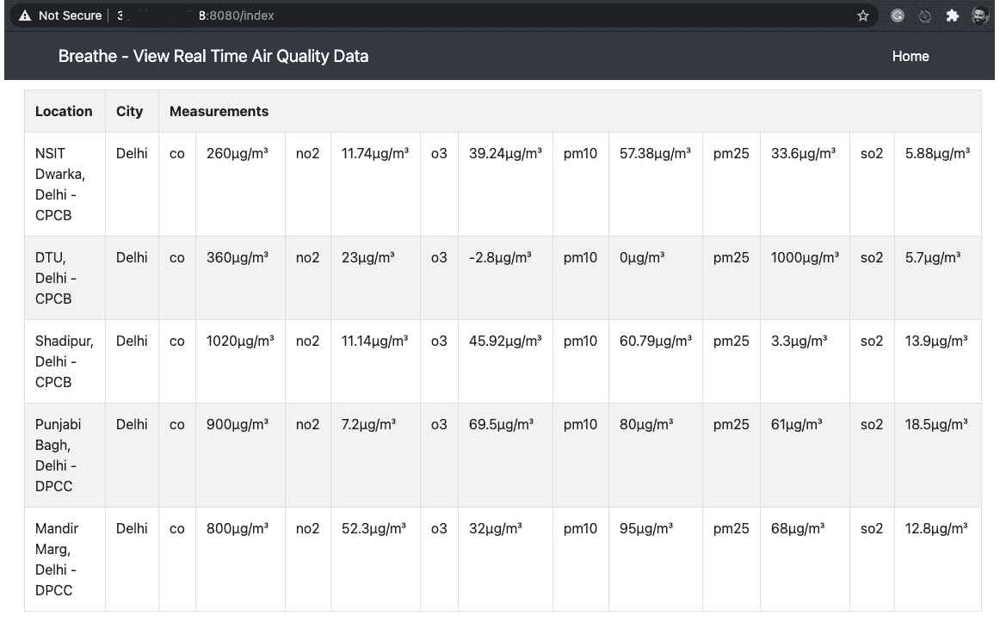

图 8.36 – Spring Boot 应用响应

1.  我们可以使用执行器`/health/liveness`和`/health/readiness`端点来验证应用程序的健康状况。我们已经将这些端点用作部署到 Kubernetes 集群的 Pod 的活跃性和就绪性探针。


图 8.37 – Spring Boot 应用执行器探针

通过这些步骤，我们已经完成了使用 Skaffold 从本地工作站将我们的 Spring Boot 应用部署到远程 Google Kubernetes 集群。在下一节中，我们将学习如何从基于浏览器的 Cloud Shell 环境部署应用到 GKE。

## 使用 Skaffold 从 Cloud Shell 部署到 GKE 集群

在本节中，重点将放在使用基于浏览器的 Cloud Shell 工具将 Spring Boot 应用部署到 GKE 上。让我们开始吧！

1.  第一步是激活 Cloud Shell 环境。这可以通过在 Google Cloud 控制台右上角点击**激活 Cloud Shell**图标来完成。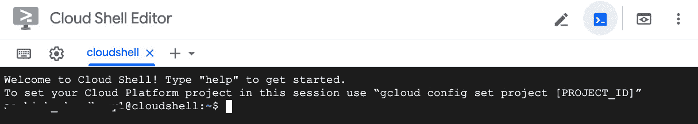

图 8.38 – Cloud Shell 编辑器

1.  如前一个截图所示，您被要求使用`gcloud config set project [PROJECT_ID]`命令设置您的 Cloud `PROJECT_ID`。如果您知道您的`PROJECT_ID`，您可以使用这个命令，或者使用`gcloud projects list`等命令。之后，Cloud Shell 将请求授权您的请求，通过调用 GCP API。之后，您无需为每个请求提供凭据。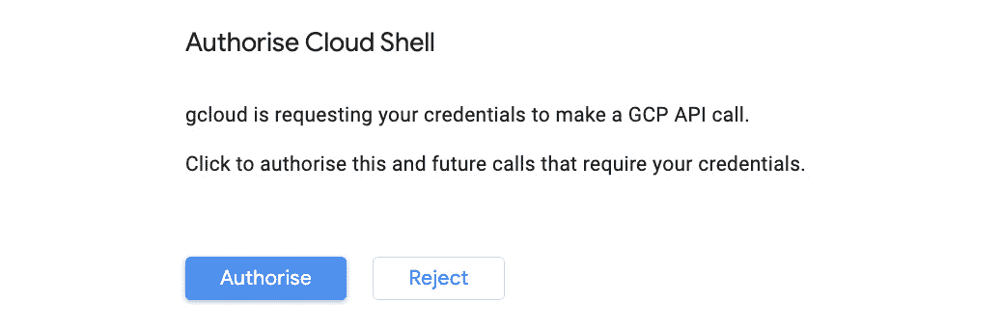

图 8.39 – 授权 Cloud Shell

我们需要在 Cloud Shell 环境中的应用程序源代码。Cloud Shell 带有安装了 Git 客户端，因此我们可以运行`git clone` [`github.com/PacktPublishing/Effortless-Cloud-Native-App-Development-using-Skaffold.git`](https://github.com/PacktPublishing/Effortless-Cloud-Native-App-Development-using-Skaffold.git)命令并克隆我们的 GitHub 存储库。

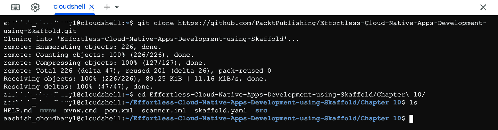

图 8.40 – 克隆 GitHub 存储库

1.  接下来，您需要编译项目，以便生成 Kubernetes 清单。运行`./mvnw clean compile`命令来构建您的项目。您的构建将失败，并且您将收到错误：

```
[ERROR] Failed to execute goal org.apache.maven.plugins:maven-compiler-plugin:3.8.1:compile (default-compile) on project scanner: Fatal error compiling: error: invalid target release: 16 -> [Help 1] . 
```

失败的原因是在 Cloud Shell 环境中将`JAVA_HOME`设置为 Java 11：

```
$ java -version
openjdk version "11.0.11" 2021-04-20
OpenJDK Runtime Environment (build 11.0.11+9-post-Debian-1deb10u1)
OpenJDK 64-Bit Server VM (build 11.0.11+9-post-Debian-1deb10u1, mixed mode, sharing)
```

我们在`pomx.ml`中指定要使用 Java 16。这个问题可以通过下载 Java 16 并设置`JAVA_HOME`环境变量来解决。

注意

我们有解决这个问题的正确工具，**SDKMAN**，可以从 [`sdkman.io/`](https://sdkman.io/) 访问。它允许您并行使用多个版本的 **Java JDK**。查看支持的 JDK（[`sdkman.io/jdks`](https://sdkman.io/jdks)）和 SDK（[`sdkman.io/sdks`](https://sdkman.io/sdks)）。随着新的六个月发布周期，我们每六个月就会获得一个新的 JDK。作为开发人员，我们喜欢尝试和探索这些功能，通过手动下载并更改 `JAVA_HOME` 来切换到不同的 JDK。整个过程都是手动的，而使用 `SDKMAN`，我们只需运行一个命令来下载您选择的 JDK，下载完成后，它甚至会将 `JAVA_HOME` 更新为最新下载的 JDK。很酷，不是吗？

1.  让我们尝试使用 SDKMAN 安装 JDK16。请注意，您不必在云 Shell 预配的 VM 实例中安装 SDKMAN，因为它已经预装。现在在 CLI 中输入 `sdk`，它将显示支持的命令：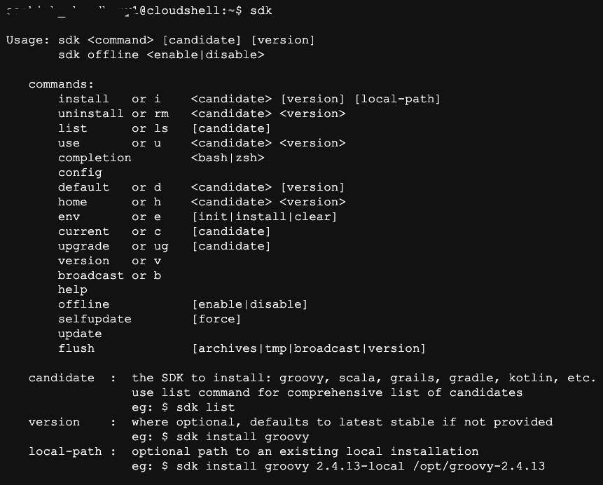

图 8.41 – SDKMAN 命令帮助

要了解不同支持的 JDK，请运行 `sdk list java` 命令。在下面的截图中，您将无法看到所有支持的 JDK 供应商，但您可以了解到大致情况：

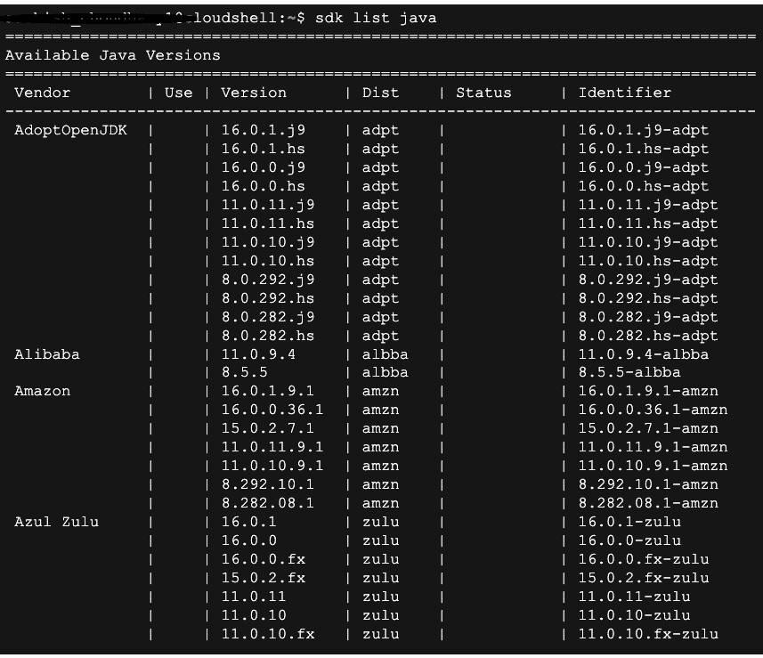

图 8.42 – SDKMAN 支持的 JDK

要下载特定供应商的 JDK，请运行 `sdk install java Identifier` 命令。在我们的情况下，实际命令将是 `sdk install java 16-open`，因为我们决定使用 Java 16 的 OpenJDK 构建。

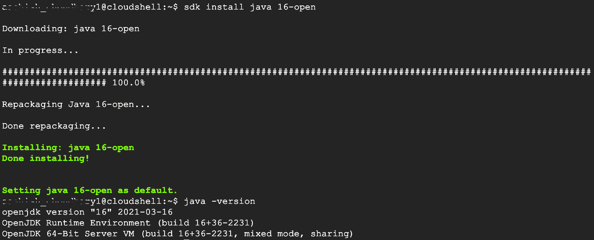

图 8.43 – 安装 JDK16

您可能还想要运行以下命令来更改活动 shell 会话中的 JDK：

```
$ sdk use java 16-open
Using java version 16-open in this shell.
```

1.  让我们再次通过运行 `./mvnw clean compile` 命令来编译项目。在下面的输出中，您可以看到构建成功：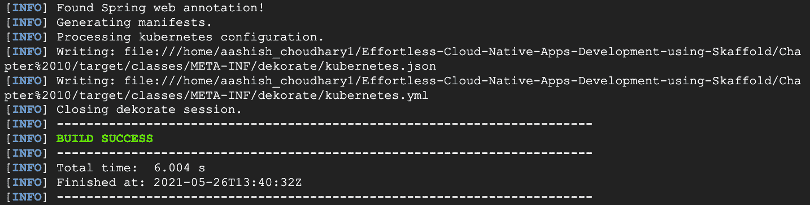

图 8.44 – Maven 构建成功

1.  我们准备好从 Cloud Shell 运行命令，将 Spring Boot 应用部署到远程 GKE 集群。在此之前，请确保您的 Kubernetes 上下文已设置为远程集群。如果不确定，请通过运行`kubectl config current-context`命令进行验证。如果未设置，则使用`gcloud container clusters get-credentials gke-autopilot-cluster1 --region us-east1`命令进行设置，这将在`kubeconfig`文件中添加条目。

1.  在最后一步，我们只需运行`skaffold run --default-repo=gcr.io/<PROJECT_ID>`命令。部署已稳定，最终输出将与上一节中*步骤 13*中看到的相同。

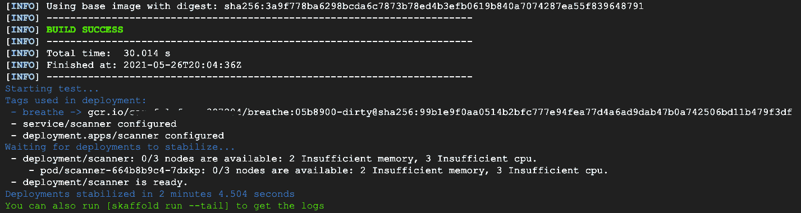

图 8.45 - Skaffold 运行输出

使用基于浏览器的 Cloud Shell 环境完成了将 Spring Boot 应用部署到远程 GKE 集群的过程。我们学会了如何利用基于浏览器的预配置 Cloud Shell 环境进行开发。如果您想尝试和尝试一些东西，那么这是 Google 提供的一个很好的功能。但是，我不确定您是否应该将其用于生产用例。使用 Cloud Shell 提供的 Google Compute Engine VM 实例是基于每个用户、每个会话的基础提供的。如果您的会话处于活动状态，您的 VM 实例将持续存在；否则，它们将被丢弃。有关 Cloud Shell 工作原理的信息，请阅读官方文档：

[`cloud.google.com/shell/docs/how-cloud-shell-works`](https://cloud.google.com/shell/docs/how-cloud-shell-works)

# 总结

在本章中，我们首先讨论了使用云供应商的功能和优势。然后，我们向您介绍了 GCP。首先，我们详细介绍了如何加入 Cloud 平台。接下来，我们介绍了 Google Cloud SDK，它允许您执行各种任务，如安装组件、创建 Kubernetes 集群以及启用不同的服务，如 Google 容器注册表等。

我们还讨论了基于浏览器的 Cloud Shell 编辑器，它由 Google Compute Engine VM 实例提供支持。您可以将其用作临时沙盒环境，以测试 GCP 支持的各种服务。然后，我们介绍了使用 Cloud SDK 和 Cloud Console 创建 Kubernetes 集群的两种不同方式。之后，我们向您介绍了无服务器 Kubernetes 提供的 GKE Autopilot，并介绍了其特点和优势，以及与标准 Kubernetes 集群相比的优势。最后，我们使用 Skaffold 从本地成功将 Spring Boot 应用程序部署到 GKE Autopilot 集群，然后在最后一节中使用 Google Cloud Shell。

在本章中，您已经获得了有关 GCP 托管的 Kubernetes 服务以及 Cloud SDK 和 Cloud Shell 等工具的实际知识。您还学会了如何使用 Skaffold 将 Spring Boot 应用程序部署到远程 Kubernetes 集群。

在下一章中，我们将学习如何使用 GitHub actions 和 Skaffold 创建 CI/CD 流水线。

# 进一步阅读

+   了解有关 GKE 自动驾驶的更多信息：[`cloud.google.com/blog/products/containers-kubernetes/introducing-gke-autopilot`](https://cloud.google.com/blog/products/containers-kubernetes/introducing-gke-autopilot)

+   了解有关 Google Cloud 平台的更多信息：[`cloud.google.com/docs`](https://cloud.google.com/docs)

+   面向架构师的 Google Cloud 平台：[`www.packtpub.com/product/google-cloud-platform-for-architects/9781788834308`](https://www.packtpub.com/product/google-cloud-platform-for-architects/9781788834308)
