# 第九章：*第九章*：使用 Skaffold 创建一个生产就绪的 CI/CD 流水线

在上一章中，我们学习了如何使用 Skaffold 将 Spring Boot 应用部署到 Google Cloud Platform。在本章中，重点将介绍 GitHub Actions 及其相关概念。我们还将演示如何使用 Skaffold 和 GitHub Actions 创建一个生产就绪的 Spring Boot 应用的**持续集成（CI）**和**持续部署（CD）**流水线。在最后一节中，我们将熟悉 GitOps 概念，并学习如何使用 Argo CD 和 Skaffold 为 Kubernetes 应用创建持续交付流水线。

本章将涵盖以下主要主题：

+   使用 GitHub Actions 入门

+   创建 GitHub Actions 工作流

+   使用 GitHub Actions 和 Skaffold 创建 CI/CD 流水线

+   使用 Argo CD 和 Skaffold 实现 GitOps 工作流

通过本章的学习，您将对如何使用 GitHub Actions 和 Skaffold 创建有效的 CI/CD 流水线有扎实的理解。

# 技术要求

+   Eclipse ([`www.eclipse.org/downloads/`](https://www.eclipse.org/downloads/)) 或 IntelliJ IDE ([`www.jetbrains.com/idea/download/`](https://www.jetbrains.com/idea/download/))

+   GitHub 账户

+   Spring Boot 2.5

+   OpenJDK 16

GitHub 存储库中的代码可以在[`github.com/PacktPublishing/Effortless-Cloud-Native-App-Development-using-Skaffold/tree/main/Chapter07`](https://github.com/PacktPublishing/Effortless-Cloud-Native-App-Development-using-Skaffold/tree/main/Chapter07)找到。

# 使用 GitHub Actions 入门

GitHub Actions 允许您从 GitHub 存储库构建、测试和部署工作负载。GitHub Actions 是事件驱动的；例如，当有人创建拉取请求、打开问题、进行部署等时。具体的操作是基于事件触发的。您甚至可以创建自己的 GitHub Actions 来根据您的用例定制工作流。还有一个很棒的市场可用，网址为 https://github.com/marketplace，您可以从中将现有的 GitHub Actions 集成到您的工作流中。

GitHub Actions 使用 YAML 语法文件来定义事件、作业、操作和命令。在下图中，您可以看到 GitHub Actions 组件的完整列表：

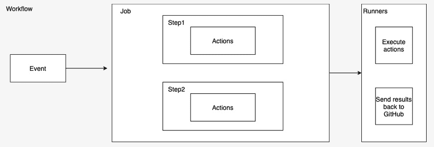

图 9.1 – GitHub Actions 组件

让我们详细讨论 GitHub 组件：

+   **工作流**：这用于在 GitHub 上构建、测试、打包、发布或部署项目。工作流由作业组成，并由事件触发。工作流在您的 GitHub 存储库中的`.github/workflows`目录中以 YAML 语法文件定义。

+   **事件**：这代表触发工作流的活动；例如，将更改推送到分支或创建拉取请求。

+   **作业**：这由在 runner 上执行的步骤组成。它使用步骤来控制操作执行的顺序。您可以为工作流运行多个作业。它们可以并行或顺序运行。

+   **步骤**：这些代表一个动作，即检出源代码或 shell 命令。

+   **操作**：这些代表您想要运行的命令，比如检出您的源代码或下载 JDK。

+   **跑步者**：这是一个托管在 GitHub 上的服务器，安装了 runner 应用程序。您可以托管自己的 runner，也可以使用 GitHub 提供的 runner。在工作流中定义的作业在 runner 机器上执行。它将结果、进度和日志发送回 GitHub 存储库。GitHub 托管的 runner 支持 Ubuntu Linux、Microsoft Windows 和 macOS。

现在我们已经了解了 GitHub Action 组件的详细信息。在下一节中，我们将为 Spring Boot 应用程序创建一个 GitHub Action 工作流。

# 创建 GitHub Actions 工作流

在本节中，我们将创建一个使用 GitHub Actions 构建 Spring Boot Java 应用程序的工作流。这个工作流将使用`mvn clean install` Maven 构建工具命令来构建一个 Spring Boot 应用程序。以下是使用 Maven 构建 Java 项目的工作流文件示例：

```
name: Build Java project with Maven
on:
  push:
    branches: [ main ]
  pull_request:
    branches: [ main ]
jobs:
  build:
    runs-on: ubuntu-latest
    steps:
    - uses: actions/checkout@v2
    - name: Install and Setup Java 16  
      uses: AdoptOpenJDK/install-jdk@v1
      with:
        version: '16'
        architecture: x64
    - name: Build with Maven
      run: mvn clean install
```

以下是工作流 YAML 文件的解释：

1.  在工作流 YAML 文件中，我们已经订阅了`push`和`pull`请求事件。因此，每当为主分支提出`pull`请求或推送更改时，此工作流将触发。

1.  然后在`jobs`部分，我们首先指定该作业将在 GitHub 托管的`ubuntu` Linux 操作系统 runner 上运行。

1.  在`steps`中，我们已经定义了需要执行此工作流的操作。

1.  首先，我们使用`actions/checkout@v2`在 runner 上检出源代码。

1.  然后我们安装诸如 Java 之类的依赖项。我们使用`AdoptOpenJDK/install-jdk@v1`操作来做到这一点。

1.  在最后一步中，我们正在使用`mvn clean install`命令构建一个 Java 项目。

让我们看看这个工作流是如何运作的。接下来，我们将在我们的 GitHub 存储库中创建这个工作流，并通过将更改推送到主分支来触发工作流。

我们将使用我们在*第七章*中创建的 Spring Boot 应用程序，*使用 Cloud Code 插件构建和部署 Spring Boot 应用程序*，进行演示。我已经详细解释了应用程序，所以在这里不会再次解释：

1.  第一步是在您的 GitHub 存储库中创建工作流 YAML 文件。这可以通过导航到 GitHub 存储库的**Actions**选项卡，并点击**自己设置工作流**链接来完成，如下截图所示：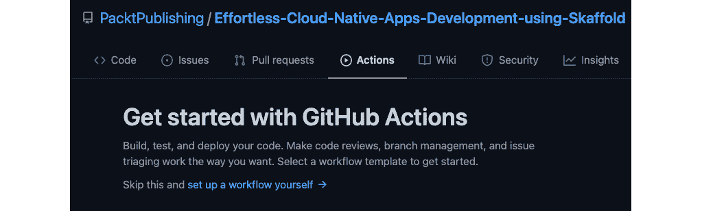

图 9.2 – 使用 GitHub Actions 入门

在下一个屏幕上，粘贴我们之前讨论过的工作流 YAML 文件的内容。请参考以下截图：

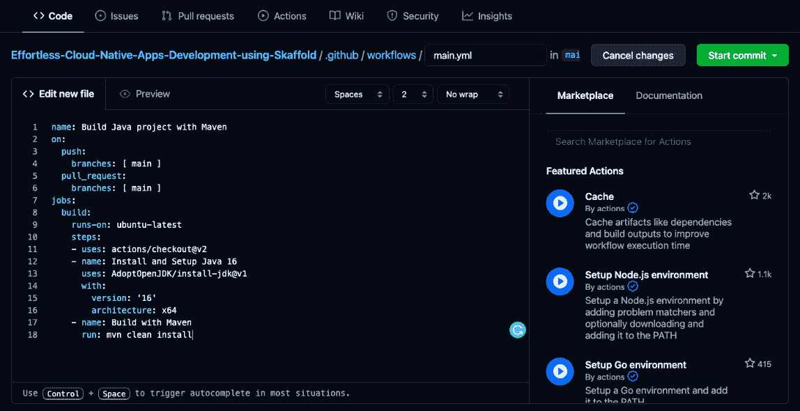

图 9.3 – 创建工作流

点击**开始提交**按钮后，将打开一个新的提交消息窗口，您可以在其中输入提交消息。

1.  然后点击**提交新文件**将工作流文件添加到 GitHub 存储库中：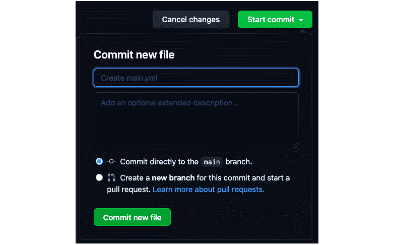

图 9.4 – 提交工作流文件

1.  在存储库中，现在您可以看到有一个`.github/workflows`目录，在该目录中，我们有`main.yml`工作流文件：

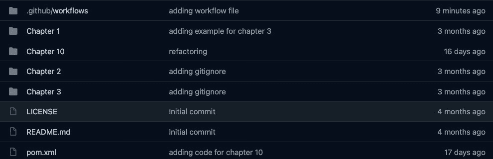

图 9.5 – 将 GitHub 工作流文件添加到您的存储库

这也会创建一个提交并将更改推送到存储库，从而触发工作流。在下面的截图中，您可以看到工作流已触发并正在进行中：

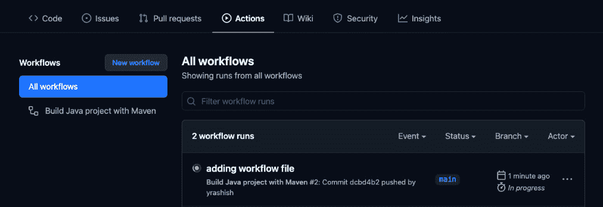

图 9.6 – 执行 GitHub 工作流

在下面的截图中，您可以看到流水线是绿色的，触发的工作流已成功完成：

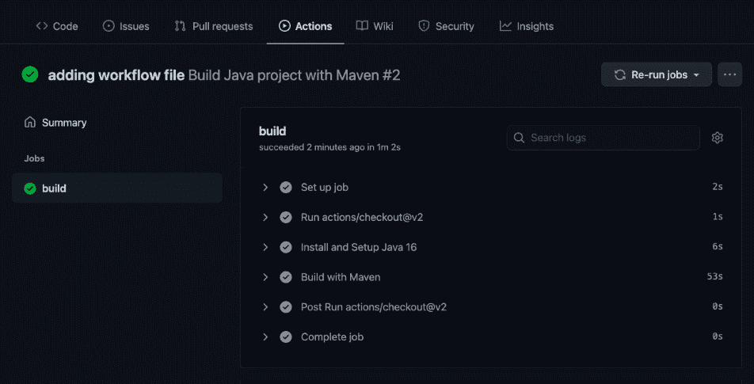

图 9.7 – GitHub 工作流成功完成

我们已经成功使用 GitHub Actions 构建了一个 Spring Boot 应用程序。下一部分将使用 Skaffold 和 GitHub Actions 为 GitHub 仓库中的 Spring Boot 应用程序创建一个 CI/CD 流水线。

# 使用 GitHub Actions 和 Skaffold 创建 CI/CD 流水线

CI 和 CD 是 DevOps 生命周期的主要支柱之一。顾名思义，**持续集成**（**CI**）是一种软件开发实践，开发人员每天多次将代码提交到版本控制系统。在**持续部署**（**CD**）中，软件功能通过自动部署频繁交付，这个过程中没有手动干预或批准。只有测试失败才会阻止部署到生产环境。经常与持续部署混淆的是持续交付，但它们在现实中是不同的。在持续交付中，主要关注的是发布和发布策略，并通过批准实际部署到生产环境。它经常被称为**单击部署**。

到目前为止，您将对 GitHub Actions 如何基于事件驱动并可以自动化软件开发任务有一定的了解。您还将了解到您可以根据 GitHub 仓库中的某些事件（如 Git 推送或在特定分支上创建拉取请求）触发整个 CI/CD 流水线。

本节将重点介绍使用 Skaffold 和 GitHub Actions 将 Spring Boot 应用程序部署到 Google Kubernetes 引擎。工作流程将紧密模仿我们通常如何使用 CI/CD 流水线在生产环境中进行部署。

在继续进行此任务之前，我们应该了解一些先决条件。以下是一些重点先决条件。

## 先决条件

请注意以下先决条件：

+   您需要创建一个新的 Google Cloud 项目（或选择现有项目）。这部分在*第八章*中已经完成，*使用 Skaffold 将 Spring Boot 微服务部署到 Google Cloud 平台*，我们将使用相同的项目。

+   请确保您启用了**容器注册表**和**Kubernetes 引擎**API。

+   您还需要创建一个新的**Google Kubernetes 引擎**（**GKE**）集群或选择现有的 GKE 集群。

+   如果尚未完成，您还需要为服务帐户创建 JSON 服务帐户密钥，并添加 Kubernetes 引擎开发人员和存储管理员角色。服务帐户密钥是从外部访问您的云资源的安全方式。为了建立服务帐户的身份，使用公钥/私钥对。公钥存储在 Google Cloud 中，私钥可供您使用。

+   要创建服务帐户密钥，请在 Google Cloud 控制台的左侧导航栏上单击**IAM 和管理**。单击**服务帐户**，然后您将看到以下屏幕：

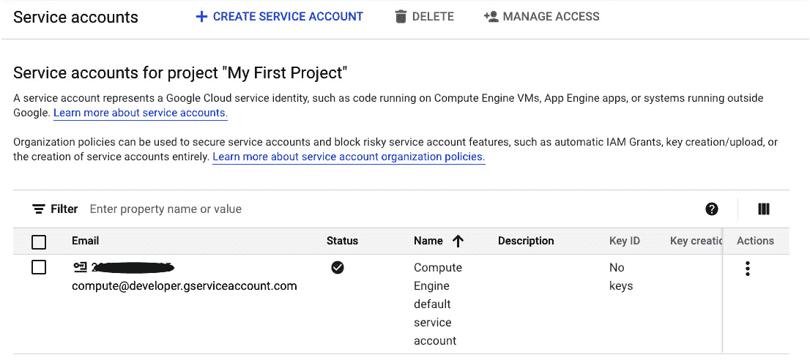

图 9.8 - 您的 GCP 项目的服务帐户

+   现在单击服务帐户的电子邮件地址，并从右侧选项卡中选择**密钥**。单击**添加密钥**，然后选择**创建新密钥**，如下面的屏幕截图所示：

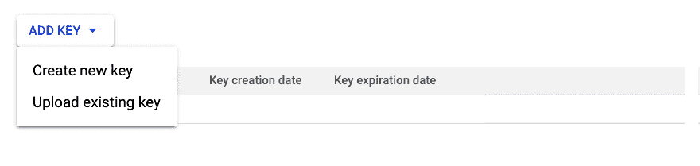

图 9.9 - 为您的服务帐户添加密钥

选择**JSON**作为**密钥类型**，然后单击**创建**。它将下载密钥到您的系统，如下所示：

图 9.10 - 为您的服务帐户选择密钥类型

](image/Figure_9.10_B17385.jpg)

图 9.10 - 为您的服务帐户选择密钥类型

+   您需要向您的服务帐户添加以下 Cloud IAM 角色：

a. **Kubernetes 引擎开发人员**：此角色将允许您部署到 GKE。

b. **存储管理员**：此角色将允许您将容器映像发布到 Google 容器注册表：

图 9.11 - 为您的服务帐户添加角色

](image/Figure_9.11_B17385.jpg)

图 9.11 - 为您的服务帐户添加角色

+   将以下机密添加到您的 GitHub 存储库的机密中。您可以通过导航到**设置**选项卡，然后单击左侧导航栏上的**机密**来添加 GitHub 存储库机密。在那里，单击**新存储库机密**，然后添加以下机密：

a. **PROJECT_ID**：Google Cloud 项目 ID

b. **SERVICE_ACCOUNT_KEY**：服务帐户 JSON 文件的内容

请参阅以下屏幕截图：

图 9.12 - 为您的 GitHub 存储库添加密钥

](image/Figure_9.12_B17385.jpg)

图 9.12 - 为您的 GitHub 存储库添加密钥

有了这个，我们已经完成了所有的先决条件。在下一节中，我们将使用 GitHub Actions 和 Skaffold 创建 CI/CD 流水线。

### 使用 GitHub Actions 和 Skaffold 实现 CI/CD 工作流程

在本节中，我们将使用 Skaffold 和 GitHub Actions 创建一个生产就绪的 CI/CD 流水线。

以下图示演示了使用 Skaffold 和 GitHub Actions 的 CI/CD 工作流程：

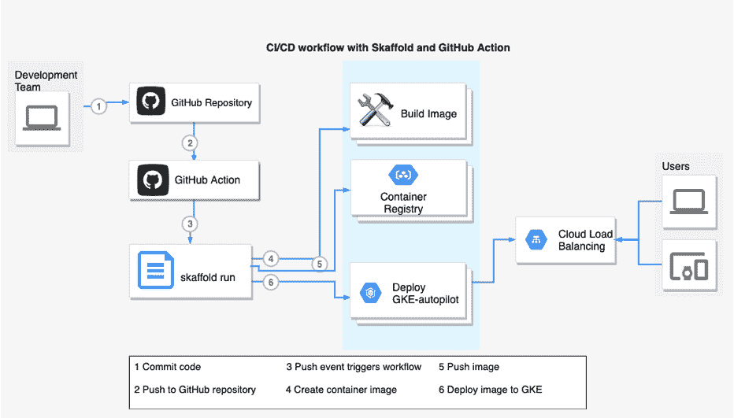

图 9.13 – 使用 Skaffold 的 CI/CD 工作流程

我们将使用以下工作流程 YAML 文件。在这里，我已经在每个步骤的注释中解释了工作流程 YAML 文件：

1.  指定工作流程的名称和事件：

```
name: Deploy to GKE
on:
  push:
    branches:
      - main
```

1.  然后我们将 GitHub 的秘密作为环境变量传递：

```
env:
  PROJECT_ID: ${{ secrets.PROJECT_ID }}
  GKE_CLUSTER: autopilot-cluster-1
  GKE_ZONE: us-central1
  SKAFFOLD_DEFAULT_REPO: gcr.io/${{ secrets.PROJECT_ID
  }}/breathe
```

1.  接下来，我们定义在 GitHub 托管的 Ubuntu Linux 运行器上运行的作业：

```
jobs:
  deploy:
    name: Deploy
    runs-on: ubuntu-latest
    env:
      ACTIONS_ALLOW_UNSECURE_COMMANDS: 'true'
```

1.  在定义步骤时，第一步是检出源代码，然后安装 Java 16：

```
    steps:
      - name: Check out repository on main branch
        uses: actions/checkout@v1
        with:
          ref: main
      - name: Install Java 16  
        uses: AdoptOpenJDK/install-jdk@v1
        with:
          version: '16'
          architecture: x64
```

1.  然后我们设置`gcloud` CLI：

```
      - name: Install gcloud
        uses: google-github-actions/setup-
              gcloud@master
        with:
          version: "309.0.0"
          service_account_key: ${{
            secrets.SERVICE_ACCOUNT_KEY }}
          project_id: ${{ secrets.PROJECT_ID }}
          export_default_credentials: true
```

1.  接下来，下载`kubectl`进行部署后验证和`skaffold`进行持续交付：

```
      - name: Install kubectl and skaffold
        uses: daisaru11/setup-cd-tools@v1
        with:
          kubectl: "1.19.2"
          skaffold: "1.29.0"
```

1.  接下来，缓存诸如依赖项之类的工件，以提高工作流程执行时间：

```
      - name: Cache skaffold image builds & config
        uses: actions/cache@v2
        with:
          path: ~/.skaffold/
          key: fixed-${{ github.sha }}
```

1.  配置 docker 以使用 gcloud 命令行工具作为身份验证的凭据助手：

```
      - name: Configure docker
        run: |
          gcloud --quiet auth configure-docker
```

获取 GKE 凭据并使用`skaffold run`命令部署到集群，如下所示：

```
      - name: Connect to cluster
        run: |
          gcloud container clusters get-credentials
            "$GKE_CLUSTER" --zone "$GKE_ZONE"
```

1.  最后，使用`skaffold run`构建和部署到 GKE，并在部署后使用`kubectl get all`进行验证：

```
      - name: Build and then deploy to GKE cluster
              with Skaffold
        run: |
          skaffold run
      - name: Verify deployment
        run: |
          kubectl get all
```

您可以在项目中使用此工作流程 YAML 文件，并用您的值替换秘密。如果您已将`skaffold.yaml`文件放在存储库的根目录中，那就没问题，否则您可以在`skaffold run`命令中传递`--filename`标志，指向 Skaffold 配置文件。

如果工作流程成功执行，则应该看到以下输出：

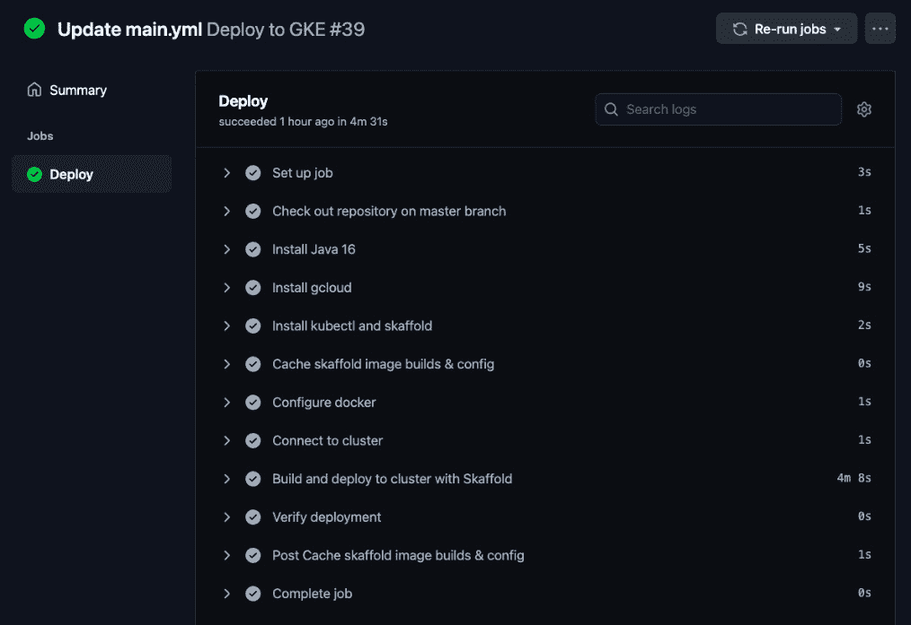

图 9.14 – 使用 Skaffold 成功构建和部署到 GKE

在本节中，我们已经成功地使用 Skaffold 和 GitHub Actions 从 GitHub 存储库构建和部署了一个 Spring Boot 应用程序到远程集群，使用了定制的 CI/CD 流水线。

接下来，让我们看看在理解它们是什么的同时，如何使用 Argo CD 和 Skaffold 实现工作流程。

# 使用 Argo CD 和 Skaffold 实现 GitOps 工作流程

在*第四章*中，*了解 Skaffold 的功能和架构*，在解释 Skaffold 功能时，我们简要讨论了如何使用`skaffold render`和`skaffold apply`命令使用 Skaffold 创建 GitOps 风格的持续交付工作流程。在本节中，我们将使用 Skaffold 和 Argo CD 实现 GitOps 工作流程。但首先，让我们了解 GitOps 及其好处。

## 什么是 GitOps，以及它的好处是什么？

*GitOps*一词是由一家名为 Weaveworks 的公司创造的。GitOps 背后的理念是将 Git 视为应用程序和声明性基础设施的单一真相来源。使用 Git 管理声明性基础设施使开发人员更容易，因为他们每天都与 Git 进行交互。一旦您在 Git 中添加配置，您就会获得版本控制的好处，例如使用拉取请求审查更改，审计和合规性。

通过 GitOps，我们创建自动化流水线，以在有人向 Git 存储库推送更改时向您的基础设施推出更改。然后，我们使用 GitOps 工具将您的应用程序的实际生产状态与您在源代码控制下定义的状态进行比较。然后，当您的集群与您在生产环境中拥有的不匹配时，它还会告诉您，并自动或手动将其与期望状态进行协调。这就是真正的持续交付。

您可以通过简单的`git` `revert`从 Kubernetes 中回滚更改。在灾难情景中，或者如果有人意外地摧毁了整个 Kubernetes 集群，我们可以快速地从 Git 中重新生成整个集群基础设施。

现在，让我们了解一下 GitOps 的一些好处：

+   使用 GitOps，团队每天向生产环境发布 30-100 个更改。当然，您需要使用部署策略，如蓝绿部署和金丝雀发布，在向所有用户提供更改之前验证您的更改。总体好处是增加开发人员的生产力。

+   通过 GitOps，开发人员推送代码而不是容器，从而获得更好的开发人员体验。此外，他们使用熟悉的工具，如 Git，并且不需要了解 Kubernetes 的内部（即`kubectl`命令）。

+   通过将声明性基础设施作为代码放入 Git 存储库中，您自动获得诸如集群审计跟踪（例如谁在什么时候做了什么）的好处。它进一步确保了 Kubernetes 集群的合规性和稳定性。

+   在灾难发生时，您也可以更快地恢复集群，从几个小时到几分钟，因为您的整个系统都在 Git 中描述。

+   您的应用程序代码已经在 Git 上，并且通过 GitOps，您的操作任务是同一端到端工作流程的一部分。您在整个组织中都有一致的 Git 工作流程。

公平地说，我们也应该涵盖一些关于 Argo CD 的细节，这样在后面实现使用 Skaffold 和 Argo CD 的 GitOps 工作流程时会更容易理解。

## 什么是 Argo CD？

根据**Argo CD**的官方文档，[`argo-cd.readthedocs.io/en/stable/`](https://argo-cd.readthedocs.io/en/stable/)，它是一个声明性的、GitOps 的 Kubernetes 持续交付工具。在前一节中，我们使用了术语*GitOps 工具*，它可以比较和同步应用程序状态，如果与 Git 存储库中定义的不一致，那么可以说 Argo CD 是处理这种自动化的工具。Kubernetes 通过控制循环的概念介绍了我们，通过这个概念，Kubernetes 检查运行的副本数量是否与期望的副本数量匹配。Argo CD 利用了相同的**Kubernetes**（**K8s**）功能，它的核心组件是`argocd-application-controller`，基本上是一个 Kubernetes 控制器。它监视您的应用程序状态，并相应地调整集群。

现在是时候通过在 Google Kubernetes Engine 上使用 Skaffold 和 Argo CD 来实现 GitOps 了。让我们开始吧。

## 在 GKE 上使用 Argo CD 和 Skaffold 进行持续交付

在开始之前，我们需要确保已满足以下先决条件。

+   我们首先需要安装`kubectl`。

+   当前的 Kubernetes 上下文设置为远程 GKE 集群。您可以使用`kubectl config current-context`命令验证当前上下文。

我们可以在本地 Kubernetes 集群上运行这个演示，但是理想情况下，您应该在像 GKE 这样的托管 Kubernetes 服务上运行它。让我们开始吧：

1.  首先，我们将使用以下命令在 GKE 上安装 Argo CD：

```
kubectl create namespace argocd 
kubectl apply -n argocd -f 
https://raw.githubusercontent.com/argoproj/argo-cd/stable/manifests/install.yaml
```

我们创建了一个单独的命名空间`argocd`，所有与 Argo CD 相关的组件都将成为其中的一部分。我们可以通过转到 GKE 下的工作负载部分来验证安装。

在下面的截图中，您可以看到 Argo CD 的有状态集组件，即`argocd-application-controller`，以及部署组件，如`argocd-server`正在在 GKE 上运行：

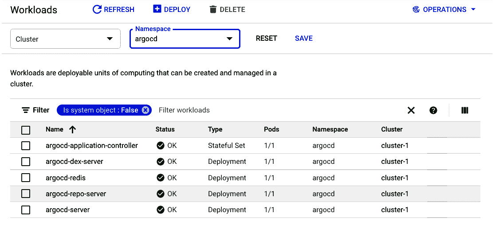

图 9.15 - Argo CD Kubernetes 资源部署到 GKE

接下来，我们可以安装 Argo CD CLI。这是一个可选步骤，因为我们将使用 Argo CD UI。

1.  接下来，我们需要公开 Argo CD API 服务器，因为默认情况下它不会对外部访问公开。我们可以运行以下命令将服务类型更改为`LoadBalancer`：

```
kubectl patch svc argocd-server -n argocd -p '{"spec": {"type": "LoadBalancer"}}'
```

在下面的屏幕截图中，您可以看到服务类型已更改为“外部负载均衡器”，我们将使用该 IP 地址访问 Argo CD GUI：

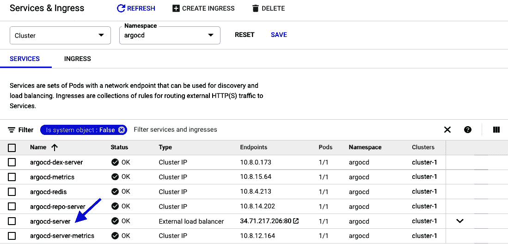

图 9.16 - Argo CD API 服务器公开为 LoadBalancer

您甚至可以使用 ingress 或`kubectl`端口转发来访问 Argo CD API 服务器，而无需暴露服务。

1.  我们现在可以使用默认的管理员用户名访问 Argo CD GUI，并使用以下命令获取密码：

```
kubectl -n argocd get secret argocd-initial-admin-secret -o jsonpath="{.data.password}" | base64 -d
```

您应该看到以下登录界面：

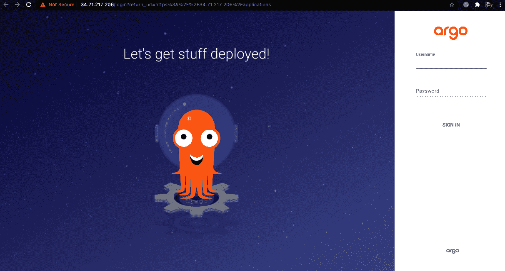

图 9.17 - Argo CD 登录界面

登录后，点击**+新应用**按钮，如下面的屏幕截图所示：


图 9.18 - 创建应用程序

在下一个屏幕上，输入您的应用程序名称，选择默认项目，并将**同步策略**设置为**自动**：

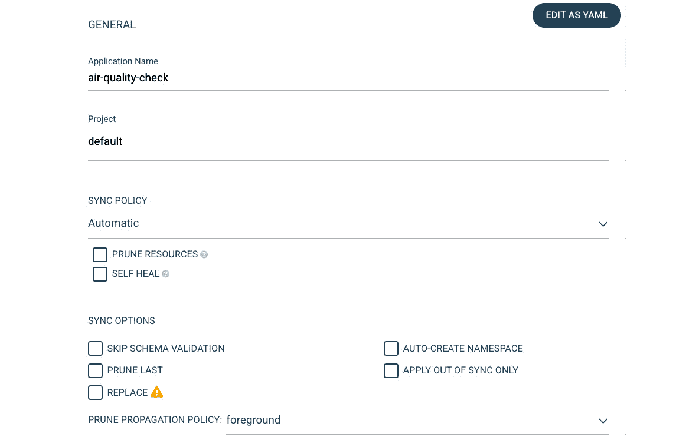

图 9.19 - Argo CD 应用程序入职

1.  输入源 Git 存储库 URL。提供 Git 存储库中 Kubernetes 清单的路径。 Argo CD 每 3 分钟轮询一次您的 Git 存储库，以将更新的清单应用到您的 Kubernetes 集群。您可以通过设置 webhook 事件来避免此延迟：

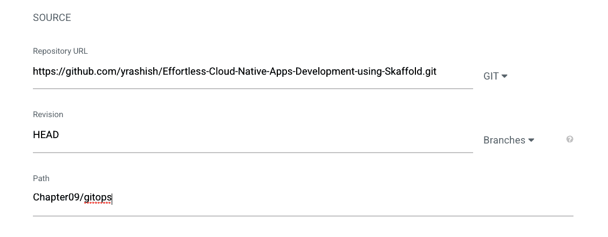

图 9.20 - 向 Argo CD 提供应用程序 Git 存储库详细信息

将目的地设置为集群内部，并将命名空间设置为默认值，如下面的屏幕截图所示：

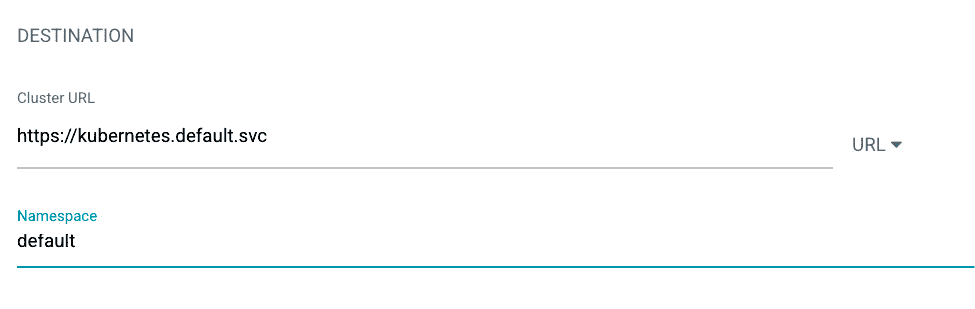

图 9.21 - 向 Argo CD 提供目的地集群详细信息

填写所需信息后，点击 UI 顶部的**CREATE**来创建应用程序。点击**CREATE**按钮后，将从 Git 存储库的路径`Chapter09/gitops`中检索到的 Kubernetes 清单，并且 Argo CD 对这些清单执行`kubectl apply`：


图 9.22 - 创建应用程序

创建应用程序后，您应该看到以下屏幕。**状态**为**进行中**：


图 9.23 - 应用程序已创建并同步

点击应用程序，您将看到以下屏幕：

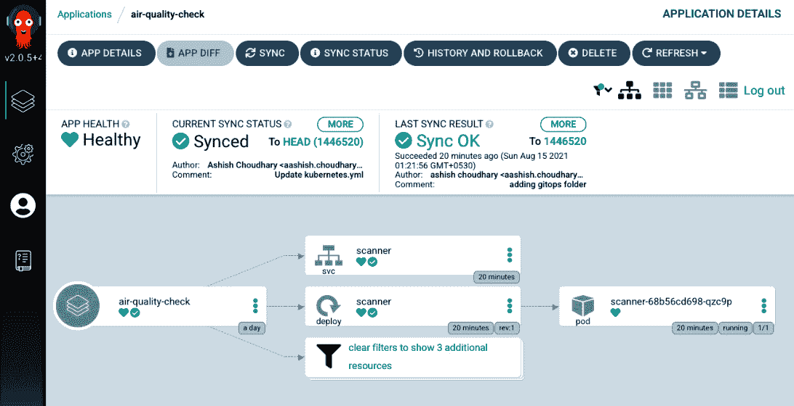

图 9.24 - 应用程序部署并处于健康状态

您可以在此处看到部署、`svc`和 pod 的列表。应用程序**同步状态**为**已同步**，**应用健康**为**健康**。Argo CD 对不同的 Kubernetes 资源类型（如 Deployment 和 ReplicaSets）内置了健康检查。

我们已经为我们的应用程序设置了持续交付工作流程，并且应用程序已成功同步。现在我们将尝试通过以下步骤进行一些本地更改来测试工作流程：

1.  使用`skaffold config set default-repo gcr.io/project-id`命令将默认容器注册表设置为 GCR。

1.  我们将使用`skaffold build`命令构建、标记和推送容器映像。

1.  然后我们将运行`skaffold render`命令。该命令将生成水合物（即，带有新生成的图像标签）的 Kubernetes 清单文件，我们将稍后提交并推送到 Git 存储库。使用 Argo CD 的 GitOps 流水线将挑选并同步这些更改到目标 Kubernetes 集群。

让我们从这个过程开始。

我们将进行一些代码的外观更改，将副本数从 1 增加到 2，并运行`skaffold render`命令。根据`skaffold.yaml`文件，Kubernetes 清单在 k8s 目录中定义。在运行`skaffold render`命令时，我们还将传递`--output=gtipos/manifest.yaml`标志，以便稍后将其推送到 Git 存储库。以下是输出：

```
skaffold build && skaffold render --output=gtipos/manifest.yaml 
Generating tags...
- breathe -> gcr.io/basic-curve-316617/breathe:99b8380-dirty
Checking cache...
- breathe: Not found. Building
Starting build...
Building [breathe]...
```

我只想强调一下，`skaffold render`不会生成新的，而是将使用现有的 Kubernetes 清单并使用新标签更新图像。

最后，我们使用以下命令提交更改并将其推送到 GitHub 存储库：

```
git commit -m  "changing number of replicas" && git push
```

推送后不久，Argo CD 将同步更改到 GKE 集群，如下截图所示：

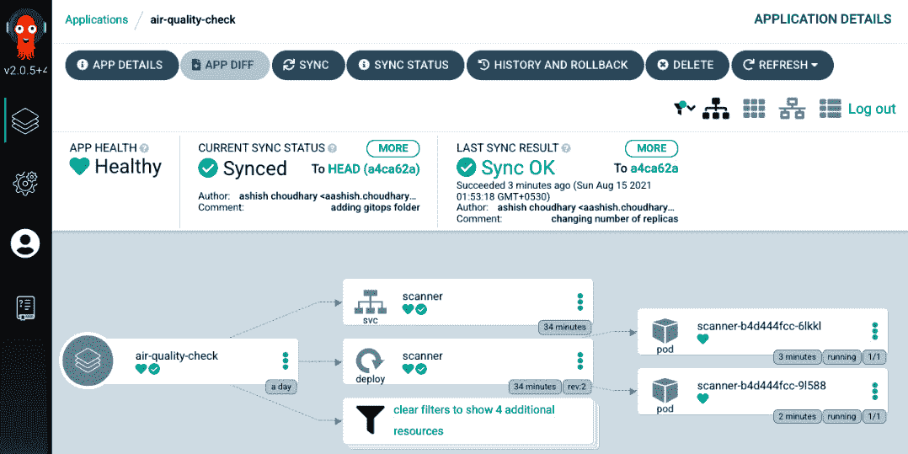

图 9.25 – 增加副本数

在截图中，您可以看到现在我们有两个正在运行的 pod，因为我们增加了副本数。

以下截图说明了使用 Skaffold 和 Argo CD 的典型 GitOps 工作流程。到目前为止，我们已经基本上涵盖了相同的步骤。让我们尝试总结到目前为止我们学到了什么。

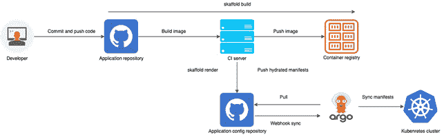

图 9.26 – 使用 Skaffold 和 Argo CD 的 GitOps 工作流程

我们可以从截图中得出以下结论：

+   开发人员提交并推送代码更改到 Git 存储库。

+   连续集成流水线启动，并使用 skaffold 构建，我们将构建、标记并推送图像到容器注册表。

+   我们还将使用 skaffold render 生成水合物清单，并将其提交到相同或不同的存储库。

+   使用 CI webhook 触发任一同步操作，或者在 Kubernetes 集群内运行的 Argo CD 控制器定期轮询间隔后拉取更改。

+   此外，Argo CD 控制器将比较实时状态与期望的目标状态（根据配置存储库上的 git 提交）。

+   如果 Argo CD 检测到应用程序处于 OutOfSync 状态，它将应用最新更改到 Kubernetes 集群。

在本节中，我们学习了如何结合两个强大工具 Skaffold 和 Argo CD 创建 GitOps 流水线。我们本可以使用`skaffold apply`命令代替 Argo CD，但`skaffold apply`命令总是使用`kubetcl`将资源部署到目标集群。如果您的应用程序打包为 Helm 图表，则它将无法工作。此外，使用 Argo CD，您可以结合 Argo Rollouts 进行蓝绿部署和金丝雀部署，因为它们在 Skaffold 中原生不受支持。

# 摘要

在本章中，您已经学会了如何使用 GitHub Actions 自动化您的开发工作流程。我们通过解释 GitHub Actions 及其组件来开始本章。我们通过示例解释了 GitHub Actions 和相关概念。在示例中，我们解释了如何从 GitHub 存储库构建、测试和部署 Java 应用程序。然后我们描述了如何使用 Skaffold 和 GitHub Actions 为您的 Kubernetes 应用程序创建 CI/CD 流水线。

您已经了解了如何利用 GitHub Actions 并将其与 Skaffold 结合，创建 CI/CD 流水线。然后在最后一节中，我们深入探讨了如何使用 Skaffold 和 Argo CD 建立 GitOps 风格的持续交付工作流。我们已经了解到，在 GitOps 中，我们将 Git 存储库视为与基础架构相关的任何更改的唯一真相来源。我们还演示了如何使用 Argo CD 和 Skaffold 实现 GitOps 流水线。

在下一章中，我们将讨论 Skaffold 的替代方案，还将涵盖其最佳实践和常见陷阱。

# 进一步阅读

+   从 Packt 出版的《使用 GitHub Actions 自动化工作流》([`www.packtpub.com/product/automating-workflows-with-github-actions/9781800560406`](https://www.packtpub.com/product/automating-workflows-with-github-actions/9781800560406))了解如何使用 GitHub actions 自动化工作流。

+   从 Packt 出版的《GitHub Essentials》([`www.packtpub.com/product/github-essentials-second-edition/9781789138337`](https://www.packtpub.com/product/github-essentials-second-edition/9781789138337))了解更多关于 GitHub 的内容。
