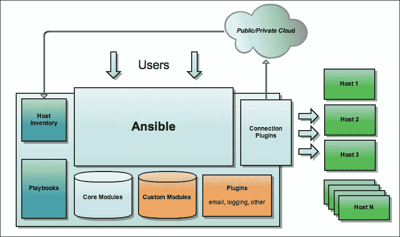

# 第一章：使用 Ansible 入门

随着技术的进步，计算变得越来越复杂。随着每天制造出更好的硬件，计算系统的复杂性也增加了。分布式计算开始蓬勃发展，很快就发明了“云”。软件变得微不足道，管理它变得痛苦。开发周期加快，手动测试和部署很快就过时了，因此需要自动化。如果您正在阅读本书，您可能了解自动化的重要性，无论是用于测试应用程序还是管理整个基础设施。

随着负载的增加和基础设施的不断扩展，系统管理员已经不再是简单的手工艺人，手动配置每个系统，而是开始一次管理成千上万个系统。无论环境有多大，您都需要一个可靠的系统来管理所有这些。地理分散的工作场所和不断增长的基础设施几乎不可能跟踪库存并手动配置和管理每台机器。快速的开发周期和缩短的上市时间留下了很少的错误余地，并且抛弃了手动流程。

管理整个基础设施、部署构建、加快流程的关键，同时跟踪变化的方法是拥有一个用户友好、学习曲线小、可以根据您的需求进行插件化的系统。最重要的是，您要保持专注，花更多时间管理基础设施和流程，而不是自动化脚本和管理工具本身。在众多可用的解决方案中，Ansible 是一个具有许多有趣功能的工具。它易于扩展，并且对于 90%的用户需求可以立即使用。本书重点关注剩下的 10%。

在本章中，我们将探讨：

+   为什么选择 Ansible？

+   为什么要扩展 Ansible？

+   Ansible 架构

+   扩展 Ansible

# 为什么选择 Ansible？

在市场上有很多可用的工具，您如何选择最适合您需求的工具？在选择满足您需求的工具时，应该考虑哪些因素？可能会有一些问题浮现，比如：

+   投资回报率（ROI）是指金钱、时间和精力方面的回报是什么？

+   我能得到什么样的工具支持？

+   有哪些潜在的安全风险？

+   这个工具足够灵活，可以插入我的基础设施吗？

+   覆盖范围是什么？我的所有需求都得到了满足吗？

如果你有这些疑问，我将试着站在 Ansible 的角度来回答。

+   Ansible 是免费的。你唯一需要投入的是一些时间和精力。Ansible 的 playbooks 基于 YAML，因此非常容易阅读、理解和维护，学习曲线很小。模块隐藏了底层的复杂性。

+   Ansible 是开源的。因此，有整个社区来支持你。你可以提交问题，甚至自己修复问题，因为你始终可以访问代码。

+   与大多数基于代理的解决方案不同，Ansible 完全基于 SSH 工作，无需代理。因此，你可以坐下来放松，因为在你的生产系统上不需要额外的软件包。

+   Ansible 提供了一个非常好的 API，你可以使用它来构建适合你需求的 Ansible 模块，然后将其插入到你的基础设施中。

+   Ansible 可以满足 90%的用户需求，剩下的 10%有着完善的 API 和社区支持，可以构建自己的模块，从而增加覆盖范围。

如果你对以上论点感到满意，并愿意尝试一下 Ansible，继续阅读。

# 为什么要扩展 Ansible？

Ansible 在各种情境下都很方便使用——作为配置管理工具和部署自动化工具，以及用于供应和编排。它默认提供了许多插件和模块，可以用于构建 playbooks。你可以使用 Ansible 来管理整个基础设施，就像大多数软件开发项目一样。**基础设施即代码**（IAC）将软件开发的原则应用到配置管理中。

人们喜欢 Ansible 是因为它简单易用，清晰地分离了关注点。它不会强迫你遵循特定的配置管理方式，而是为你设计基础设施即代码（IAC）解决方案提供了完美的构建模块，以满足你的特定需求。

有很多原因可以扩展 Ansible。这可能包括添加缺失的功能，根据自己的需求修改/增强现有功能。由于 Ansible 是一个开源的、社区驱动的项目，不是所有的东西都能一次性集成进去。效用和需求之间总是存在权衡。如果某个特定功能的用户不多，对项目维护者来说，支持它就会成为负担。

## 需要新的东西吗？

因此，您可能会遇到这样的情况：Ansible 以其现有的模块和插件的原始形式不足以满足您的要求。你会怎么做？更换工具？寻找其他选项？甚至因为无法预见即将发生的事情而诅咒自己的运气，现在你需要改变一切？

好吧，答案是否定的。Ansible 提供了一个非常好的 API 和样板，您可以使用它们根据自己的需求编写自己的 Ansible 模块或插件。构建 Ansible 模块很容易。由于 Ansible 是社区驱动的，如果您觉得更多的人可能会遇到与您遇到的相同问题，甚至可以为所需的模块提交功能请求。如果您是开发人员，您可以简单地编写自己的 Ansible 模块或插件，并与社区分享。为您的模块发送拉取请求，并与项目维护者进行讨论。希望该模块将被合并并在将来的 Ansible 版本中提供。

在本书中，我们将看到如何根据要求扩展 Ansible，并通过为一个开源项目，特别是 Ansible，做出贡献来分发定制内容。

## 公司范围的抽象

将基础设施视为代码提供了许多优势，但也有成本。您团队的成员并非都愿意攀登学习曲线。因此，只有少数人将成为诸如 Ansible 之类的任何配置管理工具的强大用户，并且他们将成为整个团队的瓶颈。

良好的 IAC 实施应该使每个人都能轻松地与基础设施互动，部署新软件，提供资源并将组件编织在一起。尽可能将细节抽象化，行为应该清晰，定义应该是可导航的。还应该存在一种将任何问题追溯到高级配置的简单方法。

为了实现这一点，可以开发可以抽象细节并提供人们可以直接使用并获得结果的接口的插件和模块。这将帮助每个人迅速掌握并与基础设施互动。

您可以创建模块和插件，使您的日常任务变得简单。您可以将这些共享为实用程序，任何公司成员都可以使用它们来执行类似的任务。这将需要一些开发人员的努力，但将使即使不那么强大的用户也能充分利用他们的基础设施。

## 深入了解 Ansible

基础设施逐渐增长到一个点，你最终放弃手动管理，并开始感受到需要更好的方式来管理不断增长的复杂性。

一种方法是花费大量时间寻找合适的工具，然后最终采用完整的配置管理解决方案，并费尽心思地改变问题以适应现有解决方案。显然，这种方法是有缺陷的。

另一种方法是保持简单，并逐步利用现有工具的力量，当它们确实给你带来立即的优势时。

Ansible 更适合于后一种方法。它写得很好，提供了清晰的关注点分离和简单的模型。事实上，你可以选择在多大程度上参与其中。它允许你重用社区提供的组件，同时保持控制。

你可以利用 Ansible 提供的各种扩展点来构建适合你需求的模块和插件。重用已有的插件和模块，并根据需要创建自己的，可以更多地控制你的基础设施。

# 为 Ansible 做贡献

Ansible 是一个托管在 GitHub 上的开源项目。如果你有 GitHub 账号，你可以轻松地 fork Ansible 存储库并开始为项目做贡献（Ansible 代码：[`github.com/ansible/ansible`](https://github.com/ansible/ansible)）。

你可以在自己的账户中 fork 项目，克隆它，然后进行更改并向项目所有者发送拉取请求。这适用于所有开源项目。

如果你不知道从哪里开始贡献，你也可以查看存储库中的*Issues*部分。*Issues*部分包含了使用该工具的人们的 bug 报告和功能请求。你可以选择验证和修复问题，然后将你的补丁作为针对问题的拉取请求发送给项目所有者。

补丁经过审查流程，只有在项目维护者批准后，补丁才会合并。一旦合并，该功能将对用户可用。

# Ansible 架构

尽管我们假设读者对 Ansible 有一定的了解，但通过简要概述 Ansible 架构仍然很有用，以便更好地理解各种扩展点。

Ansible 是一种无代理配置管理系统，这意味着受管主机上不必运行特殊软件。Ansible 通常通过普通 SSH 连接到其目标，复制所有必要的代码，并在目标机器上运行。无代理是 Ansible 相对于其他解决方案的主要优势之一。这减少了在目标机器上安装所需代理的设置开销，同时减少了安全风险，因为不需要安装额外的软件包或代理。

核心的 Ansible 组件包括：

+   **清单**：目标

+   **变量**：关于目标主机的信息

+   **连接**：如何与目标主机通信

+   **Runner**：连接到目标并执行操作

+   **Playbook**：要在目标主机上执行的配方

+   **Facts**：关于目标的动态信息

+   **模块**：实现操作的代码

+   **回调**：收集 playbook 操作的结果

以下图显示了 Ansible 的架构：

## Ansible 组件的简要概述

让我们更仔细地看一下 Ansible 组件。

## Ansible runner

Ansible 的核心是**runner**。runner 允许您在一个或多个主机上执行操作并收集结果。

runner 使用清单选择要连接的主机。清单还可以将一组变量与每个主机关联起来。然后可以通过 playbook 和其他 Ansible 组件（如连接插件）访问这些变量。

### 连接插件

连接插件（默认为 SSH 连接）可以使用特定的主机变量来确定如何连接到远程主机。变量可能包括诸如要用于连接到远程主机的用户名，非默认端口号等信息。

### Playbook

转到另一个组件，**playbook**是最重要的之一，因为所有的配方都是以 Ansible playbook 的形式编写的。Playbooks 被建模为一组 plays，每个 play 定义了要在一组远程主机上执行的一组任务。play 还定义了任务将被执行的环境。

### 角色

Playbook 可以分解为**角色**以便更好地组织。角色有助于模块化 playbook 任务。这些角色可以稍后包含在针对特定主机组的播放中。例如，如果您的基础设施涉及 Web 服务器和代理服务器，每个都需要一组常见的任务（准备系统），然后是特定类型的任务（设置和配置 Web/代理服务器），这些可以简单地分解为角色，然后可以针对特定主机运行。常见任务可以针对所有主机定义，在此时 Web 服务器和代理服务器角色可以针对各自的主机组执行。

### 变量

Ansible 架构中的另一个重要组件是**变量**。变量可用于提取常见值并对共享的 playbook 片段进行参数化。它们还可以用于根据它们共享的某些特性对主机进行分类。

### 事实

由于每个主机都可以提供大量关于自身的信息，手动管理它们并不是一种推荐的做法。因此，Ansible 在其软件中包含了一个称为**facts**的特殊变量。

事实变量由设置模块提供，并在每个主机上隐式执行（除非明确禁用）。此变量在运行程序开始在远程主机上执行 playbook 之前收集有关远程主机的信息。

### 运行程序

现在我们已经有了 Ansible playbook，并且已经收集了关于远程主机组的所有事实，运行程序开始执行。运行程序变量通过将操作代码复制到目标机器并在执行操作代码之前准备环境来在远程主机上执行特定操作（如在 Ansible playbook 中指定的）。

一旦运行程序评估并执行任务，它会清理从远程主机复制的代码，最后通过**回调**报告状态。

# Playbook 表现力

为了促进配置的一种相对声明性和描述性结构，playbook 语言的表现力是有限的。然而，Ansible 并没有过分努力地模拟严格的声明性配置。Ansible plays 被建模为任务的顺序执行，仅受变量的影响。

有几种技巧可以允许您在 playbooks 中插入复杂的逻辑，以及一些稍后将看到的扩展点，可以让您实现您想要的内容。

## 扩展 Ansible

Ansible 提供了各种扩展点，可用于扩展 Ansible 并使其适应您的定制需求。它有四个主要入口点，您可以在其中放入您的代码：

+   **自定义事实脚本**：从远程主机收集自定义事实

+   **Ansible 模块**：实际基础设施更改的执行器

+   **插件**：扩展了 Ansible 执行生命周期

+   **Python API**：颠倒了控制并从您的自定义工具中利用了 Ansible 的部分功能

### 自定义事实脚本

动态清单可能提供有关基础设施以及其如何分组和管理的一些知识，但它并不提供有关实际事物状态的视图。

在每次 Ansible 运行之前，都会收集有关针对 playbook 执行的基础设施的事实。这收集了有关主机的大量信息，并且如果需要，可以在 Ansible playbook 本身中稍后使用。

但是，您可能会发现自己处于这样一个位置：作为事实收集过程的一部分收集的默认事实不够。为了解决这个问题，Ansible 允许您在事实收集阶段的一部分运行自定义代码，就在 Ansible 执行 play 之前。

### 模块

模块定义了可以在基础设施上执行的原始操作。它们允许您从 playbook 中精确描述要做什么。它们可以封装复杂的高级任务，例如与某些外部基础设施组件进行交互，并部署虚拟机或整个环境。

模块是定制 Ansible 的关键。模块可以用任何编程语言编写，并且如果合适，它们可以使用 Ansible 本身来执行其操作的细节。

本书的相当部分专门讨论了构建 Ansible 模块。

### 插件

术语**插件**将一些扩展点分组在一起，这些扩展点深入连接到 Ansible 核心，并以强大的方式扩展其行为。

目前可用的 Ansible 插件如下：

+   操作插件

+   回环插件

+   回调插件

+   连接插件

+   过滤器插件

+   Vars 插件

插件将在第四章“探索 API”和第五章“Ansible 插件深入研究”中详细介绍，您将在这里学习有关插件的所有必要知识，包括如何实现它们并构建自己的插件。

### Python API

Ansible Python API 允许您将 Ansible 用作库，从而可以从您的自定义配置管理解决方案（无论是什么）中直接使用 Ansible 擅长的东西。您可以以编程方式运行 Ansible playbooks。

Python API 也可以从其他 Ansible 扩展中使用；我们将在本书中突出重要部分。

# 总结

阅读完本章后，您可能会被诱惑将 Ansible 用作配置管理和编排工具。也许我们还给了您选择 Ansible 作为 IAC 解决方案的理由。本章向您介绍了 Ansible 及其功能和用例的简要介绍。它使您熟悉了 Ansible 架构、Ansible 的不同组件以及 Ansible 提供的各种扩展点。本章还带您了解了参与到一个 Ansible 项目的过程。

在下一章中，您将学习有关 Ansible 模块的知识。本章将带您了解在开始编写 Ansible 模块之前需要了解的内容，并指导您编写您的第一个模块。本章还将教您一些在开发 Ansible 模块时应遵循的最佳实践。此外，本章将为本书后面将涵盖的更高级主题奠定基础，其中包括您可以利用 Ansible 的力量的真实场景。
