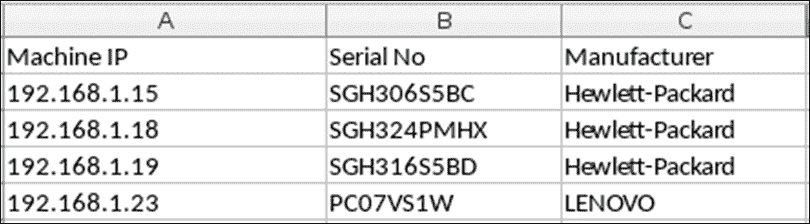

# 第七章 成为大师-完整配置指南

当你到达这一章时，你已经通过了本书范围内的所有概念。本章将建立在前几章学到的一切基础之上，并为你提供 Ansible 可以派上用场的真实用例。本章将向你展示如何使用 Ansible 来解决简单和复杂的问题和场景。

# 一个 playbook，不同的应用程序，多个目标

你可能会遇到不同环境需要不同设置或部署步骤的情况，例如，部署到不同的环境，如开发、QA、阶段或生产。部署方案可能会有小的变化，例如，Web 应用的 QA 实例指向本地数据库的实例，而生产部署指向不同的数据库服务器。

另一种情况可能是你需要部署一个你为不同发行版构建的应用程序（例如，基于 RPM 和基于 Debian 的发行版）。在这种情况下，部署将不同，因为这两个平台使用不同的应用程序管理器。基于 RPM 的发行版使用 Yum 或 DNF 软件包管理实用程序，而基于 Debian 的发行版使用 DPKG 实用程序进行软件包管理。此外，创建的结果软件包也会有所不同-一个是`.rpm`，另一个是`.deb`。

在这种情况下，即使目标平台不同，部署方案或配置也不同，所有这些都可以通过定义角色在一个 playbook 中处理。

让我们来看几个实际的场景。在第一个场景中，你需要部署一个由后端数据库（MySQL）和前端 Web 应用程序组成的应用程序。Web 应用程序查询后端数据库，并根据用户的请求提供数据。Web 应用程序和 MySQL 数据库都需要部署在不同的机器上。

让我们将安装和配置任务分为两类：

+   **系统准备**: 这是 Web 应用系统和数据库服务器的常见任务。两个系统都需要先准备好进行安装。准备工作可能涉及配置存储库和更新系统等任务。

+   **部署**: 这包括部署数据库和 Web 应用程序，然后进行所需的任何配置更改。

如果你分析这些类别，系统准备对两个系统都是通用的，而部署作业对每个应用程序都是特定的。在这种情况下，你可以将作业分成角色。你可以有三个角色 - 一个“通用”角色，它在两台机器上执行，以及一个分别用于数据库和 Web 应用程序的角色。这使得 Ansible playbook 更加模块化和易于维护。

以下是根据上述问题陈述的分析编写的 Ansible playbook：

`db-webapp-role.yaml`

```
---

- hosts: all 
  user: root
  roles:
    - { role: common }

- hosts: database
  user: root
  roles:
    - { role: database }

- hosts: webapp
  user: root
  roles:
    - { role: webapp }
```

前面的 playbook 调用不同的角色 - `common`，`webapp`和`database`，并在相应的主机组上执行它们。`common`角色在所有主机组上执行（即在`webapp`和`database`上）。然后在特定主机组上执行各个角色。以下是前面的 play 调用的角色：

**角色**：`common`

```
---
- name: Create hosts file for each machine
  template: src hosts.j2 dest=/etc/hosts

- name: Copy Repo file
  copy: src=local-tree.repo dest=/etc/yum.repos.d/

- name: Update the system
  yum: name=* state=latest
```

这是一个“通用”角色，将在所有目标主机上执行。它配置一个仓库，为目标机器提供软件包和依赖项。该角色配置此仓库，并将目标机器上安装的所有软件包更新为它们的最新版本。

以下角色将仅在清单文件中数据库组指定的主机上执行。这将安装 MySQL 数据库并复制配置文件，该文件将配置数据库并在目标主机上创建所需的表。它还将确保 MYSQL 服务在目标主机上运行。根据 Ansible play，此角色将在“通用”角色成功完成后在目标主机上执行：

**角色**：`database`

```
---
- name: Install MySQL databse server
  yum: name=mysql state=present

- name: Start MySQL service
  service: name=mysqld status=started

- name: Create a directory to copy the setup script
  file: path=/temp/configdb state=directory mode=0755

- name: Copy script to create database tables
  copy: src=configdb.sh dest=/temp/configdb

- name: Run configdb.sh to create database tables
  shell: configdb.sh chdir=/temp/configdb
```

以下角色专用于在清单文件中的 webapp 组上部署 Web 应用程序。根据 Ansible play，在“通用”角色成功完成后，该角色将执行：

**角色**：`webapp`

```
---
- name: Install HTTP server
  yum: name=httpd state=present

- name: Start httpd service
  service: name=httpd state=started

- name: Create temporary directory to copy over the rpm 
  file: path=/temp/webapp state=directory mode=0755

- name: Copy the application package to the target machine
  copy: src=webapp-2.4.16-1.fc22.x86_64 dest=/temp/webapp

- name: Install the webapp
  command: yum install -y ./webapp-2.4.16-1.fc22.x86_64 chdir=/temp/webapp

- name: Copy configuration script
  copy: src=configweb.sh dest=/temp/webapp

- name: Execute the configuration script
  shell: configweb.sh chdir=/temp/webapp
```

# 使用标签的 Ansible 角色

Ansible playbook 旨在是模块化的，并且可以在需要时在不同环境中使用。为此，引入了角色。然而，仅使用角色可能不足够，因为您可能希望在同一主机上的不同环境中使用不同的角色。好的，这听起来有点混乱。让我们来看一个场景。

您可以将您的 Ansible playbook 与持续部署系统集成，这有助于开发人员在开发周期中随时部署应用程序。在此周期中，他们可能希望以适合开发阶段的方式设置系统并配置应用程序。由于应用程序正在开发中，部署到开发环境时可能并非所有功能都已完成。但是，一旦应用程序完成，开发人员可能希望完全运行 Ansible 以复制生产或 QE 环境，从而确保应用程序在生产主机上以所需的所有设置运行。在这种情况下，存在两个不同的环境 - 开发和 QE-ready。

由于部署在同一主机上，并且可以执行多个角色，因此可以使用标签。您可以将角色与标签配对。因此，通过从命令行指定标签，Ansible 知道要执行哪个角色。

演示这一点的一种简单方法如下。假设您有一个应用程序，当需要在开发环境中部署时，您可以从 Git Hub 存储库克隆代码并运行 `install.sh` 脚本。同样，在开发环境中，您有一些放松的安全策略，比如 SeLinux 设置为宽松模式。当将同一应用程序传递给 QE 时，应该将其打包为 RPM 然后安装。此外，不允许放松安全策略，因此 SeLinux 需要保持强制模式。由于开发人员将拥有一个开发实例，因此他们将不得不在同一实例上执行两个角色。在这种情况下，开发人员可以使用标签根据需要使用不同的角色来部署应用程序。

以下是一个包含演示先前场景的角色的 Ansible playbook：

**角色**：`development`

```
---

- name: Create directory to clone git repo
  file: path=/tmp/gitrepo state=directory mode=0755

- name: Clone Git repo
  git: repo={{ item }} dest=/tmp/gitrepo
  with_items:
    - "{{ git_repo }}"

- name: Set selinux to permissive
  selinux: policy=targeted state=permissive

- name: Run install.sh to deploy application
  shell: install.sh chdir=/tmp/gitrepo/example
```

**角色**：`qe_ready`

```
---

- name: Make directory to store RPM 
  file: path=/tmp/deploy state=directory mode=0755

- name: Download the RPM to Directory
  get_url: url={{ item }} dest=/tmp/deploy
  with_items:
    - "{{ rpm_link }}"

- name: Install RPM 
  command: yum install -y *.rpm chdir=/tmp/deploy

- name: Set Selinux to Enforcing
  selinux: policy=targeted state=enforcing
```

上述两个角色是同一个 Ansible playbook 的一部分，并将根据您指定的标签按需调用。以下 Ansible play 演示了如何将角色绑定到特定标签：

Ansible Play：`demo-tag.yaml`

```
---

- hosts: application
  user: rdas
  sudo: yes 
  roles:
    - { role: development, tags: ['development'] }
    - { role: qe_ready, tags: ['qe'] }
```

`development` 角色现在绑定到 `development` 标签，而 `qe_ready` 角色绑定到 `qe` 标签。可以通过在命令中使用 `-t` 标志来指定标签来执行 Ansible playbook：

```
**# ansible-playbook -i hosts -t development demo-tag.yaml**

```

# 获取基础设施信息并将其集中托管

在之前的章节中，您创建了一个`dmidecode`模块，从目标机器收集系统信息并返回 JSON 输出。该模块还允许您切换一个名为"save"的标志为`true`，如果您希望将输出存储在目标机器上的 JSON 文件中。

在各自的目标机器上存储系统信息并没有太大意义，因为数据仍然驻留在目标机器上，要访问数据，需要登录到不同的机器，然后解析相应的 JSON 文件。为了解决这个问题，本书向您介绍了回调函数，它有助于获取 JSON 数据并将其存储为 JSON 文件在控制器节点上（即您执行 Ansible playbook 的节点）。

然而，即使这样做了，问题仍未完全解决。您确实设法从基础设施节点收集了数据，但可访问性仍然是一个问题。

+   需要访问控制器机器才能访问所有文件

+   在现实世界的情况下，您无法向每个人授予访问权限

+   即使您计划授予某些人访问权限，您的可用性仍然是一个瓶颈

为了解决这个问题，一个解决方案可以是将所有这些 JSON 文件托管到一个中央服务器上，从那里可以下载所需的 JSON 文件，解析它们并生成报告。然而，这个问题的更好解决方案可以是将数据索引到一个中央的 Elasticsearch 实例中，然后通过 RESTful API 提供数据。

### 注意

**Elasticsearch**是建立在 Apache Lucene 之上的开源搜索引擎。Elasticsearch 用 Java 编写，并在内部使用 Lucene 进行索引和搜索。它旨在通过在简单的 RESTful API 后面隐藏 Lucene 的复杂性来使全文搜索变得容易。

来源：[www.elastic.co](http://www.elastic.co)的 Elasticsearch 文档。

本章不会深入讨论 Elasticsearch 是什么以及它的功能如何，因为这超出了本书的范围。有关 Elasticsearch 的详细信息，您可以参考在线文档或*精通 ElasticSearch*（[`www.packtpub.com/web-development/mastering-elasticsearch-second-edition`](https://www.packtpub.com/web-development/mastering-elasticsearch-second-edition)），由*Packt Publishing*出版。

关于在 Elasticsearch 中索引数据并通过 HTTP 提供服务的问题，API 可以是解决问题的方法。为了使其工作，您将需要编写一个回调插件，与 Elasticsearch 实例交互并索引 JSON 数据，然后可以通过 API 提供服务。Python 提供了一个名为`pyes`的库，用于与 Elasticsearch 实例交互。

让我们将回调插件命名为`loges.py`，并将其存储在 Ansible play 根目录中的`callback_plugins`目录中，如下面的代码所示：

```
from pyes import *
import json

# Change this to your Elasticsearch URL
ES_URL = '10.3.10.183:9200'

def index_elasticsearch(host, result):
    '''  index results in elasticsearch '''
    # Create connection object to Elasticsearch instance
    conn = ES(ES_URL)
    # Create index 'infra' if not present. Used for the first function call
    if not conn.indices.exists_index('infra'):
        conn.indices.create_index('infra')
    # Index results in Elasticsearch.
    # infra: index name
    # dmidecode: document type
    # host: ID
    conn.index(result, 'infra', 'dmidecode', host)
    print 'Data added to Elasticsearch'

class CallbackModule(object):
    ''' 
    This adds the result JSON to ElasticSearch database
    '''
    def runner_on_ok(self, host, result):
        try:
            if result['var']['dmi_data[\'msg\']']:
                index_elasticsearch(host, result['var']['dmi_data[\'msg\']'])
        except:
            pass
```

创建了这个回调插件之后，如果您运行 Ansible play `dmidecode.yaml`，在成功运行后，JSON 输出将被索引到 Elasticsearch 实例中，并且应该可以通过 API 访问。数据将被索引到名为`infra`的索引中，文档类型为`dmidecode`。每个索引的文档都将有一个唯一的 ID，在这种情况下，将是`Hostname`或`IP`，取决于适用的情况。

# 创建刚启动实例的动态清单

Ansible playbook，甚至是单独的模块，通常针对清单文件中常指定的目标主机执行。它们最基本的用途是拥有一个静态清单文件（例如 hosts），其中包含要执行 Ansible play 的所有目标主机 IP 或主机名的列表。然而，在现实世界中，事情可能并不是这么简单。例如，您可能需要在云上启动一个新实例 - 比如 OpenStack 或 AWS - 或启动一个基本的虚拟机，然后使用 Ansible playbook 部署您的应用程序。在这种情况下，目标 IP 在实例启动之前是未知的，因此静态清单文件将无法达到目的。

以编程方式运行 Ansible 并使用 Ansible API 的主要好处之一是处理运行时变量，比如这种情况下的目标 IP。这是一个场景，您可以充分利用 Python API 来运行 Ansible playbook，同时创建一个动态清单。

为了生成动态清单文件，可以使用 Jinja2 模板。Jinja2 完全受 Ansible 支持，可以用于创建任何您想要的模板。Jinja2 本身是一个广泛的主题，无法在本书的范围之内详细介绍。然而，这个特定的场景将涉及 Jinja2 以及如何与 Ansible 一起使用。在上述情况下，Jinja2 模板将用于在运行时渲染清单文件。

让我们重新访问第四章中的示例，*探索 API*，在那里一个 Ansible playbook，`webserver.yaml`，在一个清单文件`hosts`上被以编程方式执行。与第四章中的示例相反，下面的示例中清单文件将在运行时渲染。这在执行端到端自动化时非常方便，从启动实例到部署应用程序。

```
from ansible.playbook import PlayBook
from ansible.inventory import Inventory
from ansible import callbacks
from ansible import utils

import jinja2
from tempfile import NamedTemporaryFile
import os

# Boilerplace callbacks for stdout/stderr and log output

utils.VERBOSITY = 0
playbook_cb = callbacks.PlaybookCallbacks(verbose=utils.VERBOSITY)
stats = callbacks.AggregateStats()
runner_cb = callbacks.PlaybookRunnerCallbacks(stats, verbose=utils.VERBOSITY)

# [Mock] Launch instance and return instance IP

def launch_instance(number):
    '''
    Launch instances on OpenStack and return a list of instance IPs

    args:
        number: Number of instances to launch
    return:
        target: List containing IPs of launched instances

    This is a dummy function and does not contain code for launching instances
    Launching an instance on OpenStack, AWS or a virtual machine is beyond the
    scope of this book. The example focuses on creating a dynamic inventory
    file to be used by Ansible.
    '''
    # return 2 IPs as the caller requested launching 2 instances.
    target = ['192.168.10.20', '192.168.10.25']
    return target

# Dynamic Inventory

inventory = """ 
[remote]

{{ elem }}

"""
target = launch_instance(2)
inventory_template = jinja2.Template(inventory)
rendered_inventory = inventory_template.render({
    'public_ip_address' : target
})

# Create a temporary file and write the template string to it
hosts = NamedTemporaryFile(delete=False)
hosts.write(rendered_inventory)
hosts.close()

pb = PlayBook(
    playbook = 'webserver.yaml',
    host_list = hosts.name,
    remote_user = 'rdas',
    stats = stats,
    callbacks=playbook_cb,
    runner_callbacks=runner_cb,
    private_key_file='id_rsa.pem'
)

results = pb.run()

playbook_cb.on_stats(pb.stats)

print results
```

在上面的示例中，`launch_instance`函数仅用于表示可以启动实例或虚拟机的一些代码。当调用该函数时，它返回与启动实例关联的 IP 列表。返回的列表被缓存在一个变量`target`中，然后用于渲染清单文件。以下代码部分...：

```
inventory = """ 
[remote]

{{ elem }}

"""
```

...是由以下代码渲染的 Jinja2 模板：

```
inventory_template = jinja2.Template(inventory)
rendered_inventory = inventory_template.render({
    'public_ip_address' : target
})
```

然后使用以下代码将渲染的清单写入临时文件：

```
hosts = NamedTemporaryFile(delete=False)
hosts.write(rendered_inventory)
hosts.close()
```

这将在运行时创建一个包含目标机器 IP 的清单文件（新启动的实例），这些 IP 是由`launch_instance`方法返回的。

# 通过堡垒主机使用 Ansible

在现实世界中，生产服务器通常配置为阻止来自其私有网络之外的 SSH 连接。这是为了减少可能的攻击向量的数量，同时将访问点保持在最低限度。这有助于限制访问，创建更好的日志记录，并增加安全性。这是一种常见的安全实践，通过使用堡垒主机来实现。

堡垒主机专门设计用来抵御攻击。通常，堡垒主机只运行一个服务。其他服务要么被移除，要么被禁用，以最小化威胁。

在这种情况下，有了堡垒主机，Ansible 无法直接从控制节点 SSH 到目标主机。它需要通过堡垒主机代理其命令，以便到达目标机器。

要实现这一点，您只需要修改 Ansible 播放根目录中的三个文件：

+   `hosts`：清单文件

+   `ansible.cfg`：Ansible 的配置文件

+   `ssh.cfg`：SSH 配置

清单文件包括一个名为`bastion`的组，以及通常的目标主机。以下代码是一个示例清单`hosts`文件：

```
[bastion]
10.68.214.8

[database_servers]
172.16.10.5
172.16.10.6
```

由于 Ansible 几乎在所有操作中都使用 SSH，下一步是配置 SSH。SSH 本身允许我们根据需求自定义设置。要为特定的 Ansible play 配置 SSH，你需要在 Ansible playbook 的根目录中创建一个`ssh.cfg`文件，内容如下：

```
Host 172.16.*
  ProxyCommand  ssh -q -A rdas@10.68.214.8 nc %h:%p
Host *
  ControlMaster    auto
  ControlPath    ~/.ssh/mux-%r@%h:%p
  ControlPersist    15m
```

上述 SSH 配置将通过我们的堡垒主机`10.68.214.8`代理到网络`172.16.*`中的所有节点的所有命令。控制设置`ControlPersist`允许 SSH 重用已建立的连接，从而提高性能并加快 Ansible playbook 的执行速度。

现在 SSH 已配置好，你需要告诉 Ansible 使用这个 SSH 配置。为此，你需要在 Ansible play 的根目录中创建一个`ansible.cfg`文件，内容如下：

```
[ssh_connection]
ssh_args = -F ssh.cfg
control_path = ~/.ssh/mux-%r@%h:%p
```

Ansible 现在将使用上述配置来使用`ssh.cfg`作为 SSH 配置文件，因此通过堡垒主机代理命令。

# 快乐的管理者=快乐的你

到目前为止，本章已经讨论了如何实施 Ansible 进行管理、部署和配置。好吧，还有一个问题仍然存在 - 报告。

在长时间的 playbook 执行结束时，你可能已经部署了应用程序，也可能已经有了基础设施的审计数据，或者 playbook 设计的任何其他内容。此外，你可能还有 playbook 执行的日志。然而，假设在一天结束时，有人要求你提供一个报告。现在你必须坐下来创建报告，并填写 Excel 电子表格，因为这是你的经理要求的 - 对事物状态的概述。这也是可以通过扩展 Ansible 再次实现的事情。

所以，你运行了一个 playbook，得到的是`stdout`上的运行日志。现在的问题是：如何将其制作成 Excel 报告？是的，你猜对了 - 回调插件来拯救你。你可以编写自己的自定义回调插件，可以帮助你记录 Ansible play 的结果并创建电子表格。这将减少手动创建报告的工作量。

报告可能因不同的用例而异，因为没有一个报告适用于所有情况。因此，你将不得不为你想要生成的不同类型的报告编写回调插件。有些人喜欢基于 HTML 的报告，而有些人喜欢 Excel 电子表格。

以下示例重用了来自第三章的`dmidecode`模块，*深入了解 Ansible 模块*。该模块用于生成 JSON 输出，非常适合机器处理。然而，JSON 并不是人们愿意手动阅读报告的格式。将数据表示为 Excel 电子表格更有意义，因为将报告创建为电子表格更易于阅读，并能一目了然地呈现完整的图片。即使是非技术背景的人也可以轻松地从 Excel 表中读取数据。

以下是一个回调模块，它创建一个 Excel 表格，读取执行`dmidecode`模块生成的 JSON 输出，并将每个主机的数据追加到 Excel 电子表格中。它是用 Python 编写的，并使用`openpyxl`库来创建 Excel 电子表格。

```
#!/bin/python
import openpyxl
import json
import os

PATH = '/tmp'

def create_report_file():
    ''' Create the initial workbook if not exists
    '''
    os.chdir(PATH)
    wb = openpyxl.Workbook()
    sheet = wb.get_active_sheet()
    sheet.title = 'Infrastructure'
    sheet['A1'] = 'Machine IP'
    sheet['B1'] = 'Serial No'
    sheet['C1'] = 'Manufacturer'
    fname = 'Infra-Info.xlsx'
    wb.save(fname)
    return fname

def write_data(host, serial_no, manufacturer):
    ''' Write data to Excel '''
    os.chdir(PATH)
    wb = openpyxl.load_workbook('Infra-Info.xlsx')
    sheet = wb.get_sheet_by_name('Infrastructure')
    rowNum = sheet.max_row + 1 
    sheet.cell(row=rowNum, column=1).value = host
    sheet.cell(row=rowNum, column=2).value = serial_no
    sheet.cell(row=rowNum, column=3).value = manufacturer
    wb.save('tmp-Infra-Info.xlsx')

def rename_file():
    os.chdir(PATH)
    os.remove('Infra-Info.xlsx')
    os.rename('tmp-Infra-Info.xlsx', 'Infra-Info.xlsx')

def extract_data(host, result_json):
    ''' Write data to the sheet
    '''
    serial_no = result_json['Hardware Specs']['System']['Serial Number']
    manufacturer = result_json['Hardware Specs']['System']['Manufacturer']
    if not os.path.exists('/tmp/Infra-Info.xlsx'):
        create_report_file()
    write_data(host, serial_no, manufacturer)
    rename_file()

class CallbackModule(object):

    def runner_on_ok(self, host, result):
        try:
            if result['var']['dmi_data[\'msg\']']:
                extract_data(host, result['var']['dmi_data[\'msg\']'])
        except:
            pass
```

前面的回调模块只是一个示例，展示了如何将数据表示为 Excel 电子表格并生成报告。可以根据需要扩展回调模块以填写更多细节。前面的模块只添加了主机、序列号和主机制造商。

请注意，由于上述回调模块将数据追加到同一 Excel 电子表格中，因此 Ansible 应该一次执行一个主机的任务。因此，您应该将 fork 设置为`1`。

这可以通过使用`--forks`标志来实现。以下代码片段展示了 Ansible playbook 的执行方式：

```
**ansible-playbook -i hosts dmidecode.yaml --forks 1**

```

这是生成的 Excel 报告：



# 摘要

本章带领您走过了各种真实场景，展示了 Ansible 的用途以及如何扩展 Ansible 以满足您的需求。本章从 Ansible 的基础知识开始，比如定义角色和使用标签。然后逐渐深入到更复杂的场景，构建在前几章的示例基础上。本章还包括了一个非常常见的场景，即 Ansible 需要自定义配置以通过堡垒主机代理任务。本章还让您了解了如何利用 Ansible 来自动化一些例行任务，比如报告。

总的来说，本章结合了前几章学到的知识，并提供了相同知识的真实场景和用例。
