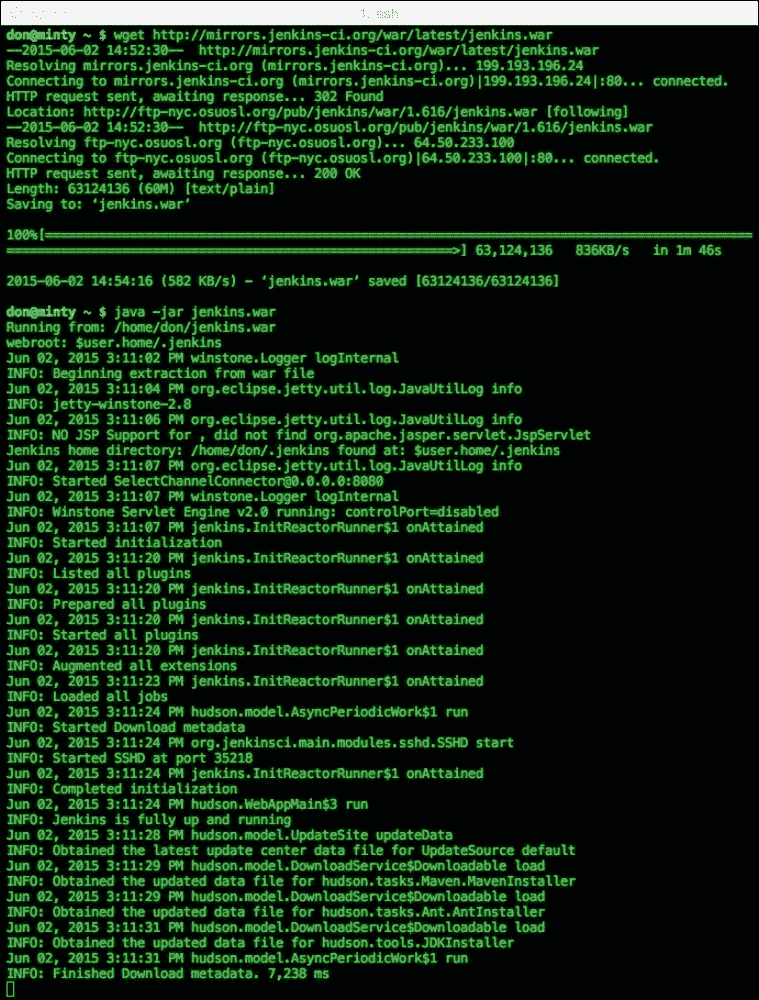
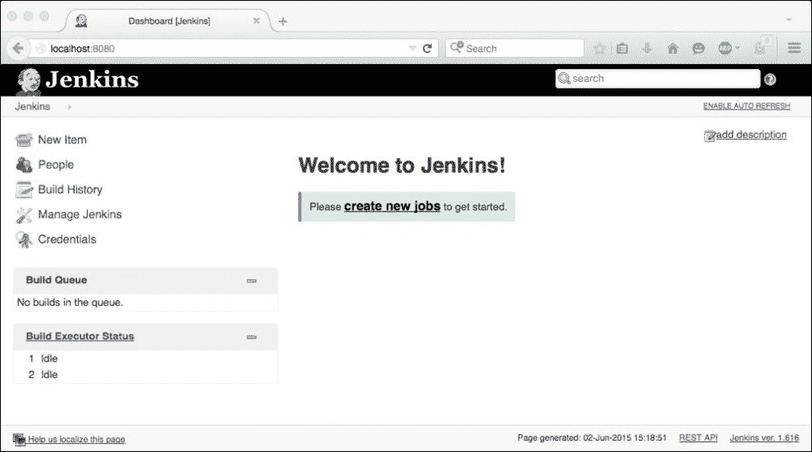

# 第一章：准备步骤

在这第一章中，我们将从几个不同的角度来看 Jenkins；如何获取和运行它，人们使用它的方式和原因，以及它为他们提供了什么。在这样做的过程中，我们将看一些标准用例，并检查 Jenkins 安装通常会随着时间的推移而演变的方式——通常从基本安装和核心功能开始，然后逐渐变得更加定制和先进，使用不同类型的扩展。我们将从“现成的”插件开始，然后逐步扩展这些插件，然后看如何开发自己的插件。

然后我们将总结本书的高层目标，并详细说明您希望从中获得的内容。

我们将概述你需要运行后续章节中涵盖的实际示例所需的各种工具和环境设置，并通过识别 Jenkins 可以用来实现这些最佳实践的一些方式来审查**持续集成**（**CI**）的最佳实践。

在本书中，假设您已经对 Jenkins 有一些工作知识，因此我们不会花太多时间来介绍基础知识，比如安装和启动 Jenkins，或者详细说明标准功能和核心功能的使用。

如果您想了解更多关于这些主题的细节，在线有许多有用的教程和示例；Jenkins 主页的**使用 Jenkins**部分，[`jenkins-ci.org`](https://jenkins-ci.org)，通常是寻求一般设置和使用问题帮助的好起点。

# 开始使用 Jenkins

作为一个 Java 应用程序，Jenkins 可以根据您的要求、个人偏好和运行环境的不同方式进行安装和运行。

快速启动 Jenkins 的最简单和最简单的方法是设置 Java，从 Jenkins 主页([www.jenkins-ci.org](http://www.jenkins-ci.org))下载最新的 Jenkins WAR 文件，然后像这样从命令行启动它：

```
**java –jar jenkins.war**

```

以下图示了通过运行两个简单命令来使用这种方法：

1.  `wget http://mirrors.jenkins-ci.org/war/latest/jenkins.war`：

这个命令从主站点下载最新版本的 Jenkins。

`wget`是一个从网络获取文件的 Linux 实用程序——如果您使用的平台没有`wget`，您可以通过浏览器将链接（`jenkins.war`文件）保存到工作目录。

URL 是通过从主页[`jenkins-ci.org/`](https://jenkins-ci.org/)复制**最新和最伟大**链接获得的。请注意，还有一个选项可以下载并使用长期支持版本，而不是当前的、最新的和最伟大的版本，如下所述：[`wiki.jenkins-ci.org/display/JENKINS/LTS+Release+Line`](https://wiki.jenkins-ci.org/display/JENKINS/LTS+Release+Line)。

这对于更保守的安装来说更可取，稳定性比拥有最新功能更重要。

1.  `java –jar jenkins.war`：

这第二个命令告诉 Java 运行我们刚刚下载的 WAR 文件作为一个应用程序，产生了你可以在下面的截图中看到的结果输出——Jenkins 从 WAR 文件中解压，检查和初始化各个子系统，并在端口`8080`上启动一个进程：



下载和启动 Jenkins

这个简单的过程通常是下载最新版本的 Jenkins 并让它运行所需的全部。现在你应该能够通过浏览器访问`http://localhost:8080`的 web 界面，并开始设置工作来让 Jenkins 为你工作：



Jenkins 启动页面

# 扩展基本设置

当您从启动我们之前查看的进程的命令提示符或 shell 退出时，Jenkins 实例将随着退出而停止，因此除了非常快速的临时测试外，强烈建议使用某种初始化或进程管理脚本。这样的脚本也可以很容易地定制，以执行一些对您有益的功能，例如以下内容：

+   在系统启动时启动

+   满足`stop|start|restart|status`请求

+   将控制台输出重定向到日志文件，以便您可以监视其中的问题

+   作为后台/守护进程运行

+   通过设置`--httpPort=`参数在非标准端口上运行，在端口`8080`已被另一个应用程序使用的情况下

+   绑定到特定的网络接口，而不是使用`--httpListenAddress=`选项的默认值`0.0.0.0`

这个基于 Ubuntu 的示例脚本从主页演示了 Jenkins 在 Tomcat 下运行的许多先前提到的功能。该脚本可以在[`wiki.jenkins-ci.org/display/JENKINS/JenkinsLinuxStartupScript`](https://wiki.jenkins-ci.org/display/JENKINS/JenkinsLinuxStartupScript)找到，如下所示：

```
#!/bin/sh
#
# Startup script for the Jenkins Continuous Integration server
# (via Jakarta Tomcat Java Servlets and JSP server)
#
# chkconfig: - 85 15
# description: Jakarta Tomcat Java Servlets and JSP server
# processname: jenkins
# pidfile: /home/jenkins/jenkins-tomcat.pid

# Set Tomcat environment.
JENKINS_USER=jenkins
LOCKFILE=/var/lock/jenkins
export PATH=/usr/local/bin:$PATH
export HOME=/home/jenkins
export JAVA_HOME=/usr/lib/jvm/java-6-sun
export JENKINS_BASEDIR=/home/jenkins
export TOMCAT_HOME=$JENKINS_BASEDIR/apache-tomcat-6.0.18
export CATALINA_PID=$JENKINS_BASEDIR/jenkins-tomcat.pid
export CATALINA_OPTS="-DJENKINS_HOME=$JENKINS_BASEDIR/jenkins-home -Xmx512m -Djava.awt.headless=true"

# Source function library.
. /etc/rc.d/init.d/functions

[ -f $TOMCAT_HOME/bin/catalina.sh ] || exit 0

export PATH=$PATH:/usr/bin:/usr/local/bin

# See how we were called.
case "$1" in
  start)
        # Start daemon.
        echo -n "Starting Tomcat: "
        su -p -s /bin/sh $JENKINS_USER -c "$TOMCAT_HOME/bin/catalina.sh start"
        RETVAL=$?
        echo
        [ $RETVAL = 0 ] && touch $LOCKFILE
        ;;
  stop)
        # Stop daemons.
        echo -n "Shutting down Tomcat: "
        su -p -s /bin/sh $JENKINS_USER -c "$TOMCAT_HOME/bin/catalina.sh stop"
        RETVAL=$?
        echo
        [ $RETVAL = 0 ] && rm -f $LOCKFILE
        ;;
  restart)
        $0 stop
        $0 start
        ;;
  condrestart)
       [ -e $LOCKFILE ] && $0 restart
       ;;
  status)
        status -p $CATALINA_PID -l $(basename $LOCKFILE) jenkins
        ;;
  *)
        echo "Usage: $0 {start|stop|restart|status}"
        exit 1
esac
exit 0
```

请注意，[`jenkins-ci.org/`](http://jenkins-ci.org/)主页还托管了许多流行操作系统的**本机安装程序**，在**本机软件包**栏下。这些页面提供了每个操作系统的下载链接和安装说明。

您可能还想考虑在 J2EE 容器中运行 Jenkins，这通常会更好地与您现有的软件堆栈和架构相匹配。这可能意味着您将继承额外的好处，如容器的日志记录、身份验证、授权或弹性。Jenkins 可以在许多流行的 J2EE 兼容容器中运行，包括以下内容：

+   WebSphere

+   WebLogic

+   Tomcat

+   JBoss

+   Jetty

+   Jonas

Web 上有更多的`init`脚本示例和详细的安装说明，应该涵盖任何操作系统和容器设置的组合。这意味着您应该能够设置 Jenkins 以适应您的环境和偏好。

为了本书的目的，我们将假设 Jenkins 直接从本地主机的命令行运行。如果您使用 J2EE 容器来托管应用程序或在远程主机上运行应用程序，您唯一会注意到的区别是您可能需要执行额外的管理和部署步骤。

# Jenkins 演进

通常，大多数用户或组织会通过设置基本的标准 Jenkins 安装来开始他们的 Jenkins 之旅，以管理一些简单的开发任务。最常见的用途是构建您的源代码，无论是定期还是在中央仓库（Git、Subversion 等）中更改时。

使用 Jenkins 自动化这种简单和重复的任务通常会很快而轻松地提供许多有用的好处。直接使用，您将获得一系列有用的功能，如任务调度和作业触发、构建和测试报告页面、在出现新问题时发送电子邮件通知和警报，以及提供当前代码库的健康（或不健康）的快速实时反馈。如果您还没有工具来提供这些功能，那么设置标准的 Jenkins 实例将提供这些初始基本功能，这些功能本身可能会改变您的开发流程。

在这之后的下一个逻辑步骤是逐渐向设置中添加更多的智能和复杂性——代码是否编译正常？现在通过了多少单元测试？应用程序编译需要多长时间？哦，我们能否在网页上显示谁改变了代码库的哪些部分？我们的应用程序是否比以前运行得更快或更好，是否稳定？甚至在我们开始添加任何类型的扩展或定制之前，核心的 Jenkins 安装就提供了大量的选项——你可以选择在任何运行 Java 的平台上构建你的应用程序（这意味着现在几乎任何地方都可以），你也可以以最适合你和当前设置的方式来做，包括使用标准和流行的构建工具，如 Ant 或 Maven，并/或重用现有的 Ant 或 Maven 构建脚本，或者你的 Linux Shell 或 Windows DOS 脚本。

您还可以通过部署 Jenkins 从节点轻松设置跨平台环境，这将允许您在不同的主机上运行不同的作业。这在使用组合操作系统的环境中可能很有用；例如，您的应用程序在 Linux 上运行，您希望在 Windows 主机上使用 Internet Explorer 运行基于浏览器的测试。

作为现有流程易于配置的“包装器”的能力，再加上 Jenkins 的灵活性，使得很容易以最小的变化或中断来适应您的特定设置。这使得 Jenkins 比不得不改变现有的构建和部署流程和实践来适应新工具的要求要容易得多。

在这个阶段之后，建立持续集成环境的好处往往变得非常明显：如果我们可以自动构建我们的代码并打包我们的应用程序，那么如果我们能够自动部署它，那不是很好吗？然后，如果我们这样做了，我们可以自动测试我们的新应用程序在目标平台的副本上的性能如何！

在达到这一点时，Jenkins 将成为您持续集成过程中的关键工具，您可以将其扩展以满足不断增长和特定的需求，您将从中获得更多的好处。

这将引导我们扩展 Jenkins，这是我们将在本书的其余部分中研究的内容。

扩展 Jenkins 的最简单方法是通过其不断扩展的插件。建议并且有益的是浏览它们；现有的插件经常得到改进，并更新了新功能，新的插件也在不断增加到列表中。然而，我们将不仅仅在这里审查一些流行的插件——在本书结束时，您应该能够将您对 Jenkins 的使用提升到一个新的水平，创建您自己的定制插件和扩展，并使用 Jenkins 提供给我们的许多功能和接口进行扩展和交互。

我们将详细研究以下内容：

+   我们可以使用现有功能的不同方式

+   通过其各种接口和 API 与 Jenkins 进行交互

+   如何在 IDE 内部与 Jenkins 进行交互

+   构建现有功能以满足您的需求的方法

+   开发、测试和构建您自己的定制 Jenkins 扩展。

以下是我们将使用的主要工具，以及有关设置它们的信息，以及如果需要的话进一步帮助和信息的来源：

+   **Java 开发工具包**（**JDK**）：您需要与您的 Java IDE 相同位级的版本，也就是说，根据您的架构和偏好，两者都需要是 32 位或 64 位。您可以选择 IBM、Oracle 或 OpenJDK 6.0 或更高版本。每个供应商都为所有主要平台提供安装说明。

+   Java IDE：我们主要将使用 Eclipse，但也会尽可能满足 NetBeans 和 IntelliJ。

每个 IDE 的最新版本都可以在各自的网站上找到：

+   [`www.eclipse.org/downloads/`](https://www.eclipse.org/downloads/)

+   [`netbeans.org/downloads/`](https://netbeans.org/downloads/)

+   [`www.jetbrains.com/idea/download/`](https://www.jetbrains.com/idea/download/)

+   Mylyn：这用于从我们的 IDE 与 Jenkins 进行通信。如果您的 IDE 中尚未包含 Mylyn，您可以从 Eclipse 网站下载它：[`www.eclipse.org/mylyn/downloads/`](http://www.eclipse.org/mylyn/downloads/)。我们将在第三章中详细介绍这一点，*Jenkins 和 IDE*。

+   Maven：我们将使用 Maven 3 来构建 Jenkins 源代码和我们自己的自定义插件。Maven 是一个 Java 工具，因此它需要了解您系统的 JDK。

+   Jenkins 源：这将由 Maven 下载。

+   Git：在大多数 Linux 平台上，`sudo apt-get install git`的等效命令应该足够了。在 Mac 上，有几个选项，包括 Sourceforge 上的`git-osx`安装程序。对于 Microsoft Windows，可以在[`msysgit.github.io/`](http://msysgit.github.io/)上找到可执行安装程序。

随着我们在后面的章节中使用它们，我们将更详细地介绍每个组件的安装和使用。

# 使用 Jenkins 进行持续集成

在我们结束本章之前，这里是持续集成的关键实践列表（由 Martin Fowler 在 2006 年定义），以及 Jenkins 可以帮助您实现这些实践的方式的示例：

+   维护单一源代码存储库：Jenkins 可以与所有现代源代码和版本控制存储库进行交互——一些功能是内置的，其他功能可以作为扩展添加。

+   自动化构建：正如前面的用例中所描述的，这是 Jenkins 的核心目标之一，也经常是开始使用 Jenkins 的主要动力。

+   使您的构建自我测试：这通常是在使用 Jenkins 设置 CI 环境的第二步——一旦自动化了代码构建，自动化测试也是自然的进展。

+   每个人每天都致力于主线：不幸的是，我们无法强迫开发人员这样做。然而，我们可以很容易地突出和报告谁在做什么，或者没有做什么，这最终应该帮助他们学会遵循这一最佳实践。

+   每次提交都应在集成机器上构建主线：构建可以由开发人员的提交触发，并且 Jenkins 从节点可以用于构建并提供准确的副本环境以进行构建。

+   立即修复破损的构建：这是另一个需要采用的开发人员最佳实践——当 Jenkins 显示红色时，重点应该放在修复问题上，直到显示绿色。在构建破损时，没有人应该提交新的更改，Jenkins 可以配置为以最有效的方式传达当前状态。

+   保持构建速度快：通过将工作分派和分布到分布式从节点，并通过分解构建来识别和专注于已更改的区域，Jenkins 可以被调整为对变化提供快速响应——一个良好的目标是提交更改并在 10 分钟内获得清晰的结果或影响。

+   在生产环境的克隆中进行测试：在编译新更改后，可以创建下游 Jenkins 作业，这些作业将准备环境并将其带到所需的级别——应用数据库更改，启动依赖进程，并部署其他先决条件。在 Jenkins 与虚拟机或容器结合使用，自动在已知良好状态下启动环境可能非常有用。

+   **让任何人都能轻松获取最新的可执行文件**：Jenkins 可以设置为充当托管最新版本的 Web 服务器，以便每个人（以及其他进程/消费者）可以轻松获取，或者还可以用于在新版本已上传到 Nexus、Artifactory 等时向感兴趣的方发送详细信息和链接。

+   **每个人都可以看到发生了什么**：Jenkins 的通信方式可以通过多种方式扩展——包括电子邮件提醒、桌面通知、信息辐射器、RSS 订阅、即时通讯等等——从熔岩灯和交通灯到无处不在的玩具火箭发射器！

+   **自动化部署**：这通常是“构建->测试->部署”自动化顺序的逻辑延伸，Jenkins 可以在许多方面提供帮助；通过在部署主机上运行从属节点，或者设置作业以连接到目标并使用最近构建的构件进行更新。

一旦您实现了前述的最佳实践，通常会有许多重要的好处——您的团队将会发布质量更高的软件，并且比以往更快地完成，成本也更低。然而，仅仅建立自动化构建、测试和部署流程是不够的；测试、环境和文化也必须具有足够的质量，而且开发人员、经理和业主对流程和实践的认可通常会产生重大影响。

# 总结

在这个准备章节中，我们已经从功能和实际角度了解了 Jenkins 的基础知识。我们已经对我们将在接下来的章节中使用的工具集进行了高层次的概述，并回顾了持续集成的最佳实践以及 Jenkins 如何帮助您的团队实现这些实践的方式。

在下一章中，我们将探讨如何扩展 Jenkins 用户界面，使其更加高效和智能，以及如何扩展用户体验，使最终用户、Jenkins 管理员、构建脚本和流程的生活更加轻松和高效。
