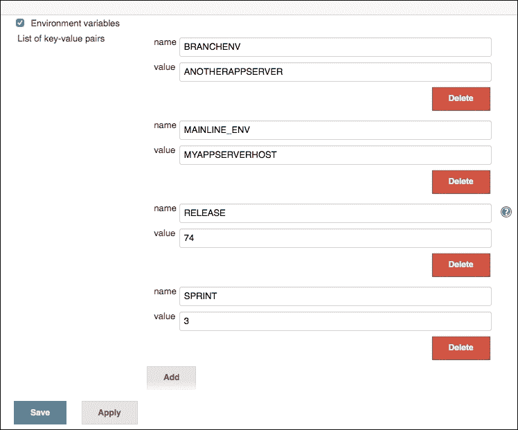
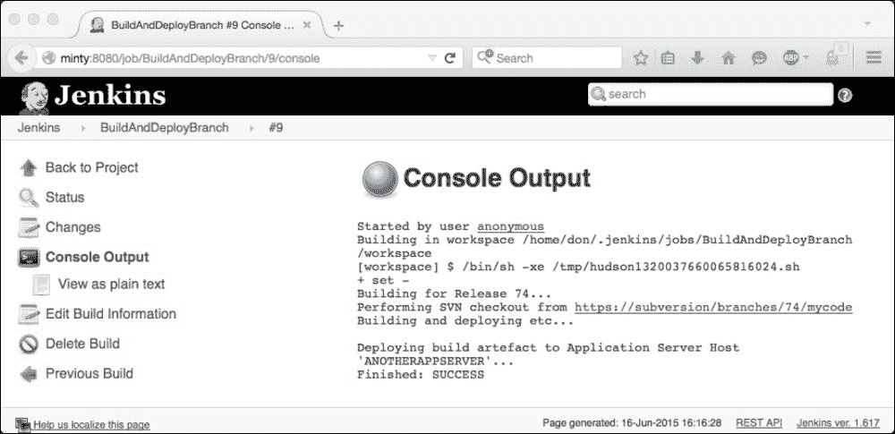
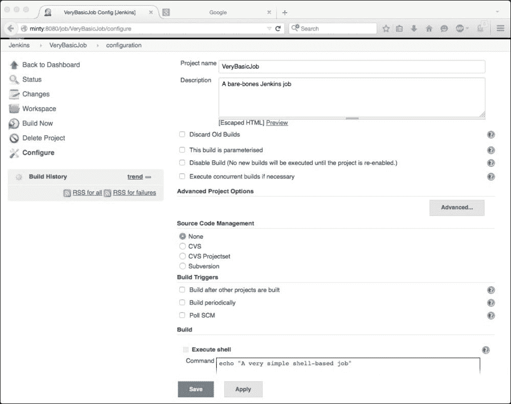
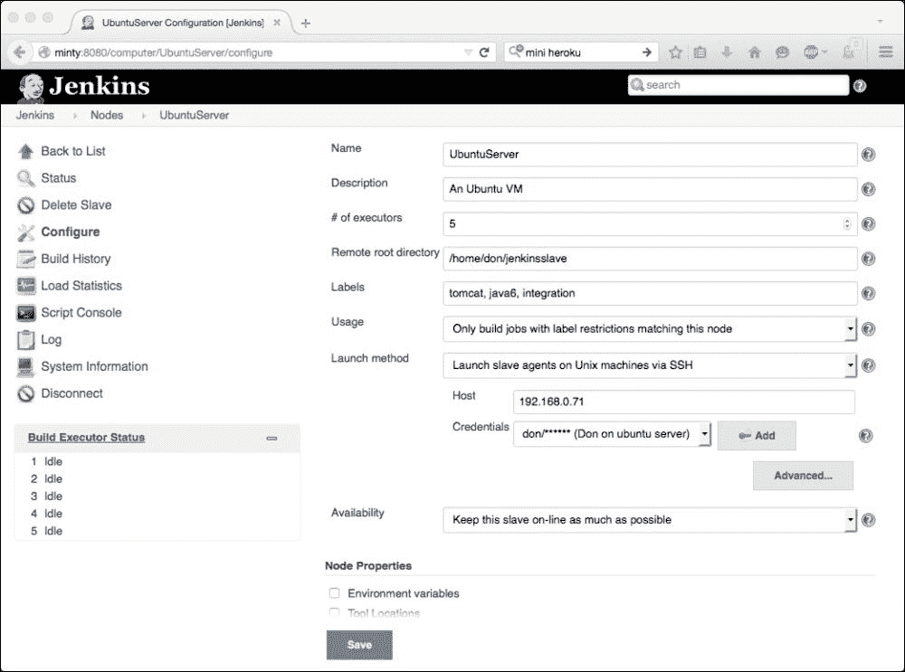
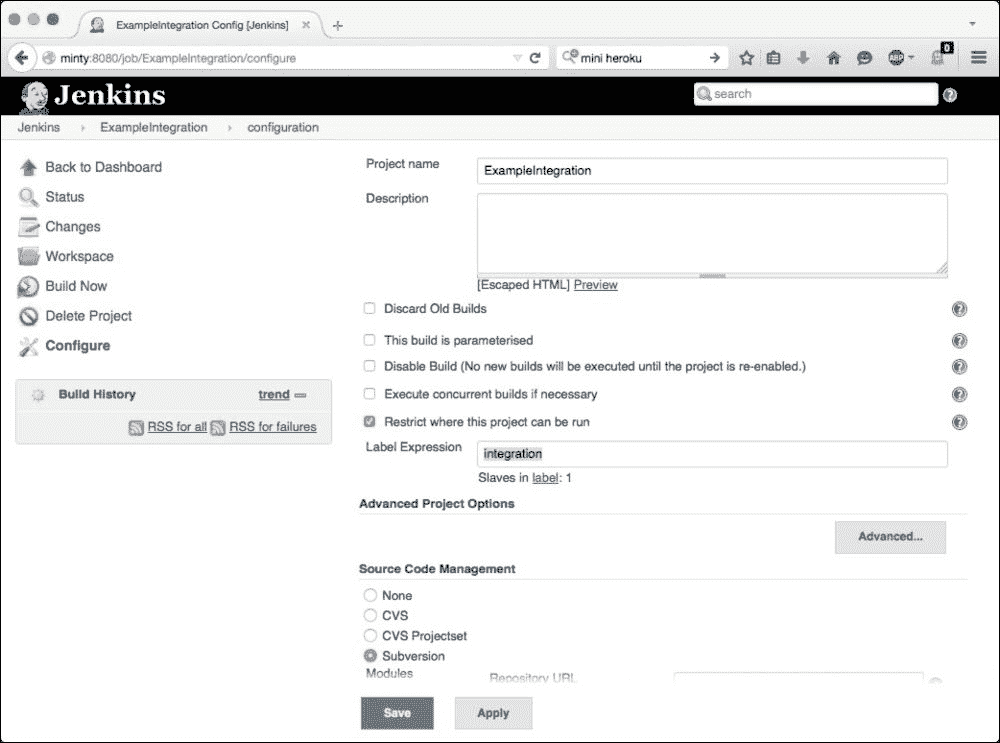
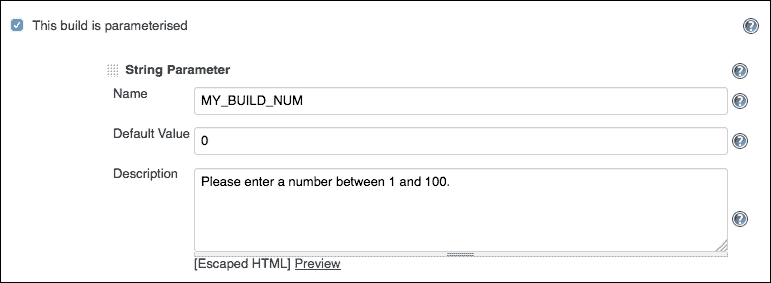
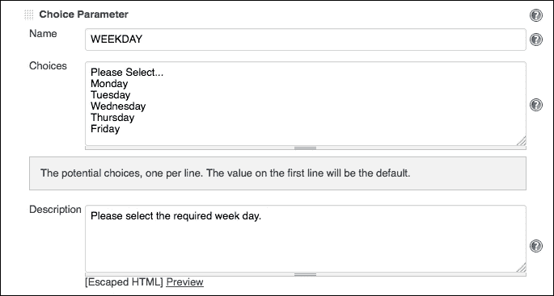
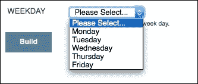
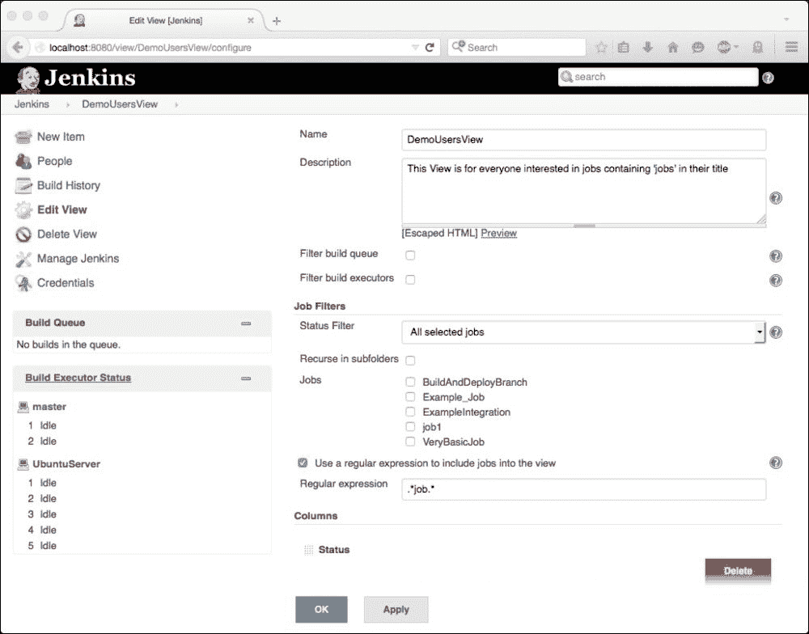

# 第二章：自动化 Jenkins UI

在本章中，我们将研究一系列不同的方法，可以用来改变和增强 Jenkins 的**用户界面**（**UI**）。

与整个 Jenkins 一样，Jenkins 的 UI 是高度可定制的，并且从一开始就明确设计为可适应和可扩展，以便您可以根据自己的特定要求和环境进行定制和调整。

有不同的方式可以定制 UI，从纯粹的*外观*化妆品改变到用户输入的改进，然后到 Jenkins 作业的自动创建和设置动态从节点供应系统。

焦点和最合适的方法通常是由 Jenkins 的使用方式驱动的；通常情况下，关注特定情况中最重要的领域通常是可以获得最大利益的地方。

在本章中，我们将研究四种最常见的用例场景，以及自动化和开发 Jenkins UI 对每种情况可能有所帮助的不同方式。

# 用例场景 1 - 大量作业

单个 Jenkins 实例可以包含许多作业。实际限制因多种因素而异，如下所示：

+   硬件资源，如 RAM、CPU、磁盘和网络性能

+   从节点——有多少个，它们是如何设置的，以及它们的性能

+   工作在主节点和从节点之间分布得如何

+   个别作业的设置；它们的大小、功能、历史和保留

Jenkins 实例拥有超过 1,000 个作业或大约 100 个从节点连接到主节点并不罕见。

管理这造成的性能负载本身就是一项艰巨的任务，Jenkins 还需要管理这些作业的呈现和清理工作——您的用户不希望浏览超过 1,000 个作业来搜索他们需要的作业，我们还需要确保旧作业被清理或归档，新作业可以轻松而准确地创建。

如果您可以减少所需的作业数量，那么管理和资源开销将相应减少，性能、可用性和可靠性也将提高，用户体验也将得到改善。

一些规划和对 UI 的一点自动化通常可以帮助我们实现这一点——让我们看看一些场景和可能的解决方案。

如果最紧迫的问题或瓶颈是有太多的作业，首先了解所有这些作业的需求来源，然后看看我们能做些什么来减轻这个问题，将会很有帮助。

开发团队经常在 Sprints 和/或 Releases 中工作。这通常意味着有一个主要的开发流和一个或多个分支流。通常这个惯例也会在 Jenkins 中遵循——我们可能希望设置 Jenkins 作业来构建然后部署 Sprint 3 或 Release 49 代码到集成环境，同时将我们的主线更改部署到 CI 和开发环境。同时，可能有一个逻辑或业务要求来支持*一切*的生产版本，以防出现问题。

这可能意味着设置相应命名的作业，比如`Sprint 3`，并在配置中硬编码这个值，伪代码大致是*获取 Sprint 3 战争文件并部署到 Sprint 3 服务器…*。

这些工作将有一个有限的（可能相当短的）寿命，然后需要清理或更新为下一个 Sprint 或 Release 的新值。这种定期和手动的维护很快就会成为一个头痛的问题，这进一步增加了人为错误导致错误的部署到错误的地方的可能性。

这种常见情况的一个简单解决方案是利用 Jenkins 环境变量。如果您导航到**管理 Jenkins** | **配置系统** | **全局属性**，您可以创建和定义自己的键值对，这些键值对立即可用于任何节点上的每个作业：



前面的截图显示了您可能想设置的几种简单的键值对的示例 - 它们可以是您喜欢或需要的任何内容。

使用这种方法意味着，与其为每个发布或冲刺创建大量新作业，并为将很快过时的多个并发发布提供支持，您可以只定义两三个永久作业集，这些作业将从该位置获取键值对并使用它们来驱动它们的操作 - 我们的作业配置伪代码随后发生变化。最初，它采用以下形式：

*获取 Sprint 3 war 文件并部署到 Sprint 3 服务器...*

这些变化更通用，类似于以下内容：

*获取${SPRINT} war 文件并部署到${SPRINT}服务器...*

这种简单的方法变通，有时可以让您通过（并集中）更新这些环境变量到开发生命周期所需的新属性的位置，从而大大减少 Jenkins 作业的数量 - 例如，在发布、冲刺或迭代周期结束时。

这一次中心配置更改将立即更新所有作业，以便它们可以使用这些新值，这种方法可以扩展到包括构建、测试和部署过程的许多其他方面的信息，要检出和构建的分支位置，或者构建的构件应该部署到的环境或主机等。下面的截图显示了反映这一变化的控制台输出页面：



如果您需要为每个迭代创建新作业，还有一些方法可以自动化 UI 以简化此过程 - 我们可以使用 Jenkins 来管理 Jenkins。

如果您查看文件系统上的 Jenkins 主目录（由 JENKINS_HOME 变量定义），您将看到用于存储每个 Jenkins 作业设置的结构：每个作业由一个以其代表的作业名称命名的文件夹表示，每个文件夹包含一个名为`config.xml`的 XML 文件。每个`config.xml`文件包含该作业的设置和信息。

通常还有其他几个文件和文件夹，例如用于跟踪下一个构建的编号的文件（`nextBuildNumber`）和用于跟踪和存储先前构建创建的历史和构件的文件夹。

Jenkins 作业的基本框架，在其最基本的形式下，就是这样简单：

+   一个以作业名称命名的文件夹，例如`VeryBasicJob`

+   在这个文件夹里，一个名为`config.xml`的文件

+   在这个文件里，有一些类似以下的 XML：

```
<?xml version='1.0' encoding='UTF-8'?>
<project>
  <actions/>
  <description>A bare-bones Jenkins job</description>
  <keepDependencies>false</keepDependencies>
  <properties/>
  <scm class="hudson.scm.NullSCM"/>
  <canRoam>true</canRoam>
  <disabled>false</disabled>
  <blockBuildWhenDownstreamBuilding>false</blockBuildWhenDownstreamBuilding>
  <blockBuildWhenUpstreamBuilding>false</blockBuildWhenUpstreamBuilding>
  <triggers/>
  <concurrentBuild>false</concurrentBuild>
  <builders>
    <hudson.tasks.Shell>
      <command>echo &quot;A very simple shell-based job&quot;</command>
    </hudson.tasks.Shell>
  </builders>
  <publishers/>
  <buildWrappers/>
</project>
```

正如您所看到的，这个简单的作业包含一些非常简单的 XML 标签和数据，详细说明了`<description>`和`<command>`标签，以及 Jenkins 使用的各种其他设置。

Jenkins UI 将解释此文件夹和 XML 文件，并显示**配置**页面如下：



当源配置和前端 UI 并排显示时，就像您在前面的截图中看到的那样，很明显，改变 XML 文件应该改变 UI 显示的作业，反之亦然。

因此，如果我们可以自动创建这些 XML 文件并以某种方式加载到 Jenkins 中，那么我们也应该能够自动化并对所有 Jenkins 作业进行版本控制，并允许最终用户在运行时应用他们需要的任何自定义，从而消除手动干预的需要。

从版本控制中获取文件夹结构和 XML 文件，使用用户选择的值更新这些 XML 文件，并将生成的配置加载到我们的 Jenkins 实例中，这些都是 Jenkins 的理想工具-我们可以设置 Jenkins 来设置 Jenkins！

简而言之，首先可以通过*模板化*您的 XML 文件来实现此过程-将所有对变量因素的引用（例如对**Release**、**Sprint**、**Hostnames**等的引用）替换为易于识别的内容。然后，创建 Jenkins 作业，使用户能够指定他们想要在这些占位符值的位置使用什么。

下一步是执行一些字符串替换（使用您喜欢的工具-**Perl**、**Sed**、**Awk**等）来用用户选择的值替换占位符值，然后您只需要在运行时将新配置加载到 Jenkins 中。

为了演示这种可能的方法，这里有一个基本的功能性 shell 脚本，它使用注释解释了每个步骤的进行。这使用了`Jenkins-cli.jar`文件，您可以通过转到您的 Jenkins 实例并在 URL 中添加`/cli`来下载并了解更多信息，例如：`http://myjenkins.instance:8080/cli`。

在这里，您还将找到有关 Jenkins 提供的许多功能和能力的详细帮助和信息。

```
# set up the variables required for this to work:
export JAVA="/usr/bin/java"
# Location & port of your Jenkins server
export HOST=http://myjenkinshost:8080

# location of the Jenkins CLI jar file
export CLI_JAR="/tool/ jenkins-cli.jar"

# a simple counter to track the number of jobs created
export COUNTER=0
# the location of the customized config.xml files to load
export WORKDIR="/home/jenkins_user/jobstoload"
# a simple for loop to iterate through each job:
for JobName in `ls $WORKDIR`
do echo "About to create job number ${COUNTER} with name ${JobName}"
${JAVA} -jar ${CLI_JAR} -s ${HOST} create-job ${JobName} < $WORKDIR/${JobName}/config.xml
  echo "${JobName} created."
  let COUNTER++
  echo " "
done
```

这个简单的例子，在 Jenkins 作业中设置后，可以通过从版本控制中拉取模板并允许用户从预定义的有效选项集中进行选择，从而快速、轻松、可靠地允许用户创建（或清理）新的 Jenkins 作业。

# 用例场景 2-多个主机

Jenkins UI 也可以定制，以帮助管理需要大量 Slave 主机的安装。这可能需要通过将负载分配到其他系统来改善构建或测试运行的性能，或者在 Jenkins 用于执行跨多主机操作系统的功能时-这是 Jenkins 可以通过内置的 JNLP 功能非常容易地实现的。

通常，测试要求决定运行不同操作系统和软件组合的各种不同节点是必不可少的-当您有一个需要在不同版本的 Internet Explorer 上进行测试的应用程序时，这是很常见的；每个版本都需要一个不同的 Windows 主机，因为每个主机一次只能支持一个浏览器版本。

管理多个和不同的 Slave 节点可能会有问题；然而，Jenkins UI 提供了几个功能，可以帮助简化和自动化这一方面。

管理具有许多 Slave 节点的实例的最简单方法之一是使用 Slave 标记方案和描述单个节点执行的能力或功能的命名约定。

要做到这一点，首先需要对 Slave 节点进行标记-这可以在创建时进行，也可以返回到现有的 Slave 节点并根据需要对其进行标记-请注意以下 Slave 定义页面中指定的多个标签：



正如您所看到的，这个简单的 Slave 已被赋予`tomcat`、`java6`和`integration`的多个标签。

现在，我们可以创建或修改一个作业，并选择**限制此项目可以运行的位置**选项，如下面的屏幕截图所示：



如果我们输入与一个或多个现有标签（在这种情况下为`integration`）匹配的标签，那么此作业将在与此标签匹配的节点上运行。在存在多个匹配项的情况下，作业将仅在其中一个节点上运行。

这个简单但非常强大的 UI 功能使您能够在多个节点之间分配负载。这些节点可以执行不同的功能，或者它们可以具有不同的能力-标签可以是任何有助于您决定对您的情况最好的东西。

您可以决定区分节点的物理特性，例如具有大量可用磁盘空间、更多内存或快速处理器的节点，或者具有所需级别的本地数据库或代码部署的节点，或者具有应用服务器或其他支持工具的节点。这样，您不仅可以分配负载，还可以通过将适合的作业放在最适合它们的主机上，以及通过汇集资源来优化各种构建任务的响应时间，从而最大化性能并减少周转时间，尽快完成紧急任务，并将不太紧急的作业排队在一组专用服务器上。

使用 Swarm 插件可以进一步采用这种方法：[`wiki.jenkins-ci.org/display/JENKINS/Swarm+Plugin`](https://wiki.jenkins-ci.org/display/JENKINS/Swarm+Plugin)。

该插件提供了一个额外的功能，可以通过 UDP 广播自动配置和连接新的从节点，发现并连接新的节点到现有的主节点，从而创建一个临时集群，您可以根据需求进行定制。

您可以使用此功能设置当构建队列达到预定义阈值时，新节点将动态配置并添加到可用节点池中。您需要在主节点上安装该功能，并在新的从节点上使用命令行客户端。

Swarm 节点在创建时也可以通过 CLI 中的`-labels`参数分配多个标签。这些值还可以由创建它们的脚本设置；例如，脚本可以检查本地 Oracle 安装的存在或大量的可用磁盘空间，然后使用这些结果来决定要应用哪些标签——例如`database`、`performance`、`java6`、`tomcat`等等。

另一个非常强大的动态主机配置和管理工具是 Docker，而且，不出所料，Jenkins 也有可用的插件：

[`wiki.jenkins-ci.org/display/JENKINS/Docker+Plugin`](https://wiki.jenkins-ci.org/display/JENKINS/Docker+Plugin)

Docker 允许您快速轻松地创建和管理在 Docker 容器中运行的 Docker 镜像。这些在实践中与虚拟机非常相似，但体积更小、更轻，因此比传统虚拟机更快更容易进行配置。

Docker 镜像也可以通过**Docker Registry**进行版本控制，它类似于虚拟机的 Git 或 Subversion 仓库；您可以从 Docker Index 中拉取现有的镜像，并更新以满足您的需求（就像为虚拟机执行任务一样——执行任务，如部署 Tomcat，安装和配置 Apache，上传一些脚本，添加 Java 的版本，或安装 Jenkins）。一旦您定制了您的镜像，您可以选择将其推送/发布回到索引中，状态与您创建时完全相同，但名称不同，从而创建一个模板从节点，您可以快速可靠地配置到运行 Docker 的任何平台。甚至可以在虚拟机上运行 Docker——这种方法提供的可能性非常有趣，我们将在第九章 *将事物放在一起*中更详细地讨论这一点。

# 用例场景 3 - 通过 UI 自动化帮助用户

定制和自动化 Jenkins 用户界面可以帮助并赋予您的 Jenkins 实例的用户自助帮助。

通过确保只有用户能够输入有效数据，我们可以大大减少无效输入和由此产生的问题的风险，这也应该改善用户体验。

这样做的最常见方式是在运行时验证用户输入。例如，如果您的作业提示用户输入一周中的某一天或一个构建编号，您可以分别将其分配给一个名为`$WEEKDAY`或`$MY_BUILD_NUM`的变量。 

然后，我们可以设置我们的作业以确保提供的用户数据是有效的——如果`$WEEKDAY`的值不是一周中的有效日期，或者用户提供的构建编号是`Build Two`而不是我们希望的整数值，我们可以导致构建失败，并显示错误消息解释用户做错了什么以及如何纠正，而不是让我们的作业继续进行并让它尝试执行我们知道是无效的功能或创建某些东西。

如果您可以让用户知道您的期望，这也是一个良好的做法，对所有相关方都有帮助——通过在输入框旁边设置描述，可以轻松实现这一点：



在运行时，此配置将向用户提供我们希望他们输入的描述，并通过设置默认值为 0，我们可以给他们另一个提示。

然后，这个 Jenkins 作业可以检查`$MY_BUILD_NUM`的值（正如我们所希望和请求的那样）是否大于零且小于 101，然后我们可以相当确信事情可以继续进行。

通常更安全的做法是采取下一个逻辑步骤，并限制用户可以选择的选项。这进一步减少了风险，也让用户体验更好——他们可能只偶尔运行某些作业，期望他们记住你想要的内容有时可能有点过分要求。这可以通过向他们呈现一系列有效选项并确保他们选择其中之一来实现：



上述信息将在运行时向用户呈现如下：



这种方法应该会更加健壮，只要我们记得在尝试使用它之前检查${WEEKDAY}的值是否等于**请选择...**！

这种方法可以通过从其他来源获取数据并在运行时动态构建用户可用的选项来进一步扩展。

另一个有用且更强大的例子是能够使用当前 Subversion 标签的值填充选择列表。

这可以通过参数化构建的**列出 Subversion 标签（等等）**选项来实现。这允许您向用户呈现当前可用标签的列表供选择——例如，这些标签可以由其他 Jenkins 作业创建，并且可能包含用户可以选择的候选构建列表，以便将构建部署到环境中。

假设您有一个具有以下结构的 Subversion 存储库：

`https://subversionrepo/mainproject/tags/Build_12.56`

`https://subversionrepo/mainproject/tags/Build_14.78`

`https://subversionrepo/mainproject/tags/Build_18.20`

在这种情况下，用户将看到一个下拉菜单，提供这三个构建中的一个选择。

用户选择的选项在运行时分配给您创建的变量，比如`$BUILD_TO_DEPLOY`，然后您的作业可以使用此选择来检出请求的构建并使用 SVN URL 与用户的首选选项部署它：

`https://subversionrepo/mainproject/tags/${BUILD_TO_DEPLOY}`

此功能作为 Subversion 插件的一部分提供，现在是核心 Jenkins 构建的一部分。

还有许多其他插件和功能可以用来构建和改进您的用户界面体验 - 内置的 Jenkins **Views**功能允许您创建一个动态列表，其中列出符合您条件的作业。这可以表示为一个简单的正则表达式，以便所有匹配的作业都将显示在一个视图中。当与合理的作业命名约定结合使用时，这种方法特别有效。

其他可能改善用户体验的方法包括设置管理作业执行和流程的流水线。通过设置用户可以轻松启动的流程，然后继续执行一系列其他作业，用户只需要触发几个动作中的第一个，就像推倒多米诺骨牌一样，而不是在检查前一个构建是否已完成并检查其输出后触发每个构建。

这可以通过简单地使用每个作业下的内置**构建其他项目**选项来实现一个简单的序列。使用各种触发选项，我们可以微调一些东西，以便某些作业在出现问题时停止流程，或者在适当时继续进行。

如果您想添加更多选项，有许多插件可以帮助您。Build Pipeline 插件提供了一些有用的功能，Join 插件也非常有用。如果您想同时运行多个作业，然后等待它们完成后继续并触发下一个作业 - 像往常一样，Jenkins 插件几乎适用于所有场合！

# 用例场景 4 - UI 调整

有时 Jenkins 被设置好后就在后台运行，很少被检查或查看，除非出了问题，用户们都很满意事情得以完成。

在其他情况下，Jenkins 用户界面被许多人同时大量使用，所有这些人都不可避免地会有自己的需求和优先事项，然后 Jenkins 的外观和感觉就成了一个高优先级。

有许多方法可以满足用户的需求，包括设置多个视图，每个视图为不同的用户或组提供适合他们的（Jenkins）世界的视图。



使用简单的`.*job.*`正则表达式确保所有包含字符串`"job"`在其标题中的作业（现有和未来的）都将显示在此视图中。同样，这确实依赖于一个合理的命名约定，但如果这样做了，它可以将此方面的维护要求减少到零 - 当创建一个新的匹配作业时，它会自动添加到视图中。

在这个领域提供进一步增强的插件包括 Personal View 插件；正如其名称所示，它使用户能够创建和管理自己的世界视图，查看**作业过滤器**，并允许进一步调整。**Chosen Views Tab**栏非常有用，如果您最终拥有太多视图并希望轻松管理所有视图在一个屏幕上！

# 总结

在本章中，我们探讨了用户界面可以如何改变以满足您的需求。我们研究了一些常见问题，并审查了一些可能用于缓解这些问题的方法。

正如您所见，Jenkins 用户界面非常强大，其中很大一部分力量来自于其灵活性和可扩展性。

调整 Jenkins 用户界面以适应您环境中适用的任何用例，可以极大地改善 Jenkins 安装的成功。同时，它也可以使用户体验更加积极，并引导用户以互惠互利的方式与 Jenkins 进行交互。当人们很容易找到他们想要的东西，很难犯错（例如，由于运行时验证、动态填充的表单和自动创建的作业套件），您应该会拥有更快乐的用户和更健壮、高效的 Jenkins。

Jenkins 的内置功能通常可以提供足够的灵活性来解决您最紧迫的 Jenkins 用户界面问题；然而，丰富的可用插件使您可以很容易地进一步扩展功能，如果您愿意的话。

在第 6 和第七章，当我们自己查看扩展 Jenkins 用户界面时，我们将更详细地重新讨论这个话题。我们将看到如何开发并直接将自定义的 GUI 项目添加到 Jenkins 用户界面，使您能够使用 Jelly、自己的插件和提供的 Jenkins 扩展点进一步扩展功能。
