# 第三章：Jenkins 和 IDE

在第一章*准备步骤*中，我们高层次地了解了持续集成的基本原则和目标。然后，我们通过一些相当典型的 Jenkins 使用案例场景，来说明扩展 Jenkins 可以帮助我们实现这些目标。

在本章中，我们将更详细地了解如何扩展 Jenkins 并实现持续集成的原则和目标。本章的重点是发现我们如何帮助软件开发人员使事情变得更容易。管理和开发团队的支持和*认同*对于任何良好的构建流程的成功至关重要，而开发人员显然是任何软件开发团队的基本组成部分。

我们将看一下一些方法，您可以使用这些方法来扩展和调整 Jenkins 以满足开发人员的特定需求和要求，并且我们将演示如何调整 Jenkins 信息呈现的方式，以便与他们的工作方式自然地融合。这里的意图是赋予人们他们发现既有益又易于使用的工具，并因此鼓励人们*做正确的事情*，而不是试图通过使用指标、威胁、唠叨的电子邮件和每次构建失败时指责别人来强迫他们做我们所指示的事情——这是一种确保最终会有很多不满的开发人员的方法，他们只想低调地工作！

理解动机是理解行为的关键，而且，相当合理的是，开发人员通常会高度专注于开发代码更改。他们通常不太感兴趣执行额外的任务，比如监视构建仪表板的更新或滚动一整天的电子邮件，以检查是否有其他人最近破坏了构建，然后再提交他们的更改。他们自然而然地专注于自己的角色、优先事项、编写代码和测试，并将它们交付，以便他们可以继续下一个任务。任何偏离或分散注意力的事情可能被视为适得其反。因此，如果我们可以扩展 Jenkins，同时使开发人员更容易专注于他们代码的质量，并鼓励他们从持续集成的角度*做正确的事情*，那么每个人都应该更加快乐...好吧，这是目标。

我通常用来实现这一点的方法最好由这句话来描述：

| | *"让错误的事情变得困难，让正确的事情变得容易。"* | |
| --- | --- | --- |
| | --雷·亨特 |

这是一个简单但有效的口头禅，我发现在这种情况下真的很有效。雷·亨特是自然马术运动的创始人，他在训练马匹时非常成功地运用了这一哲学。而且，说实话，我在将其应用于开发人员时也取得了一些成功！

因此，本章的重点是探索我们如何扩展 Jenkins，以便为辛勤工作的开发人员提供所需的信息，让他们能够自然方便地吸收，并且让他们更容易*做正确的事情*。如果我们能够直接在他们已经花费大部分时间的 IDE 中呈现信息，希望我们可以实现这一点。

回到我们的持续集成目标，从开发人员的角度来看，我们在这里试图鼓励三种主要行为：

1.  **频繁提交**：我们可以通过使用适当的版本控制系统来使这一点变得容易，该系统允许开发人员在他们正在使用的 IDE 中快速进行检入，并且不会分散他们的注意力来检查构建任务和状态。

1.  **如果构建失败，将其作为最重要的事情来修复**：使当前状态非常明显将有助于实现这一点。

1.  **检查您的操作结果**：这将大大改善其功能。

快速反馈并使其易于查看（并且不容易错过！）也会在这里有所帮助。如果我们可以从开发人员已经使用的 IDE 中清晰地呈现所有这些信息，我们应该会看到一些小的改进。

虽然我们即将要运行的技术解决方案应该对我们有所帮助，但我们不能指望它们单独成为奇迹。正如之前提到的，需要一个团队共同努力才能使这些事情起作用，因此建立和监控一套开发人员最佳实践、发布标准和指南，并提供用户教育和信息，都在建立高效和专业的开发团队和生产构建过程 IDE 以及 Jenkins 构建连接器中起着重要作用。

有不同的开发 IDE，选择取决于许多因素，如编程语言（Java，C ++，.Net 等），环境（Linux，Windows，Mac 等）以及公司和个人偏好（开源或闭源）。我们将看一下一些最受欢迎的 IDE 和它们的解决方案；但是，还有许多其他可用的解决方案，以满足不同的需求。

# Eclipse 和 Mylyn

我们将要查看的第一个，也可能是迄今为止最受欢迎的所有开发 IDE 中的 Eclipse 平台-这对于许多不同的项目（包括 Java，C/C++和 PHP）都非常受欢迎，并且具有庞大的用户群和丰富成熟且易获得的插件。

为了实现我们向开发人员展示 Jenkins 信息的目标，Mylyn 目前是我们可以与 Eclipse 一起使用的最受欢迎的扩展。

有关 Mylyn 及其提供的许多功能的更多信息，请访问此链接：

[`www.eclipse.org/mylyn/`](http://www.eclipse.org/mylyn/)

此链接中的文档还指出，Mylyn*减少信息过载并使多任务处理变得容易*，这正是我们正在寻找的！

# 安装 Mylyn

Mylyn 已预装在最新版本的 Eclipse 中，因此您可能只需要通过导航到**窗口** | **显示视图** | **其他**，然后从**Mylyn**类别中选择**构建**组件来选择它：

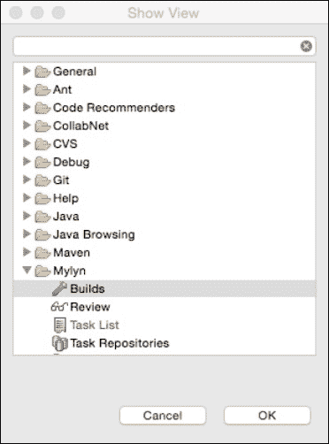

现在，您只需要使用以下详细信息配置 Mylyn：

如果您使用的 Eclipse 版本未预装 Mylyn，您可以通过选择**帮助** | **软件更新...**，然后添加一个具有此 URL 的新更新站点来下载并安装它：[`download.eclipse.org/tools/mylyn/update/e3.4`](http://download.eclipse.org/tools/mylyn/update/e3.4%20)（如果有更高版本可用且更受欢迎）。

完成后，选择刚刚创建的新更新站点，并添加您想要安装的 Mylyn 组件。

## Mylyn 和 Jenkins 配置

安装完成后，您将能够从主工具栏菜单中选择**窗口**，然后**显示视图**，**Mylyn**和**构建**。

这应该产生一个类似于以下窗口，然后您可以选择突出显示的选项来创建新的构建服务器定义：

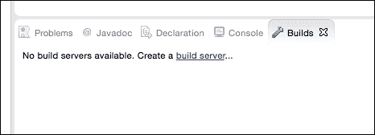

这将产生一个新的向导：

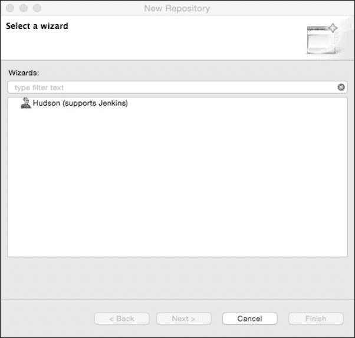

选择**Hudson**选项并单击**下一步**后，您将看到一个**服务器属性**对话框，您可以在其中定义和配置**新构建服务器**的属性：

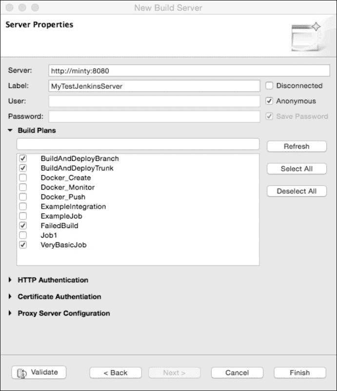

在这里，您可以指定 Jenkins 服务器的 URL 和所需的凭据。快速刷新应该显示成功连接到 Jenkins 实例，并且还会拉回一个作业定义列表供您选择。请注意，Mylyn 还提供了一系列其他连接和授权功能，如果需要，您可以进行配置。

快速检查使用**验证**按钮后，点击**完成**保存并关闭服务器配置。

这将导致一个新的**构建**窗口显示您从 Jenkins 服务器中选择的作业的实时信息，类似于这样：

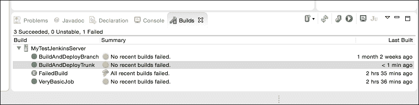

在此窗口中探索选项表明，您可以右键单击并选择执行所选作业的多个有用功能：

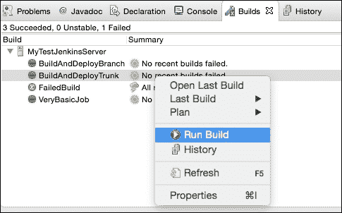

您可以执行以下功能：

+   查看所选作业的历史记录

+   在 Eclipse 中在浏览器中打开作业

+   运行所选的作业

+   查看最后一次运行的控制台输出

+   在 JUnit 视图中显示 JUnit 结果

所有这些都可以直接从 Eclipse IDE 中完成，使开发人员非常容易地关注他们需要了解的事情，几乎没有什么努力和最小的干扰。

# IntelliJ IDEA 和 Jenkins 构建连接器

由 JetBrains 开发的 IntelliJ IDEA 是另一个非常受欢迎的集成开发环境，与 Eclipse 类似，它也有大量的附加组件和插件可用于扩展其使用和功能。

在本节中，我们将快速查看在 IntelliJ IDEA 中安装和配置**Jenkins 控制插件**，并将其配置为提供类似于 Eclipse 下 Mylyn 提供的功能。

在 IntelliJ 中安装插件非常容易-打开**首选项**菜单项，然后在左侧菜单中选择**插件**。Jenkins 控制插件目前未与 IDE 捆绑在一起，因此请按照以下截图中显示的点击**浏览存储库...**按钮：

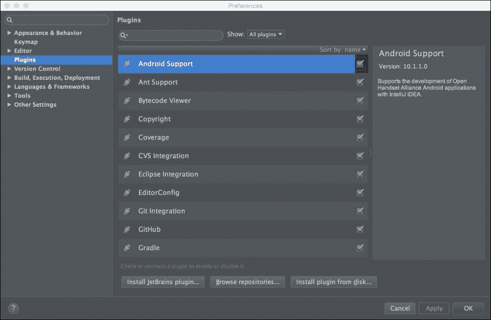

这将打开一个新的子窗口，您可以在搜索对话框中输入`Jenkins`以找到两个（当前）可用的插件，如下所示：

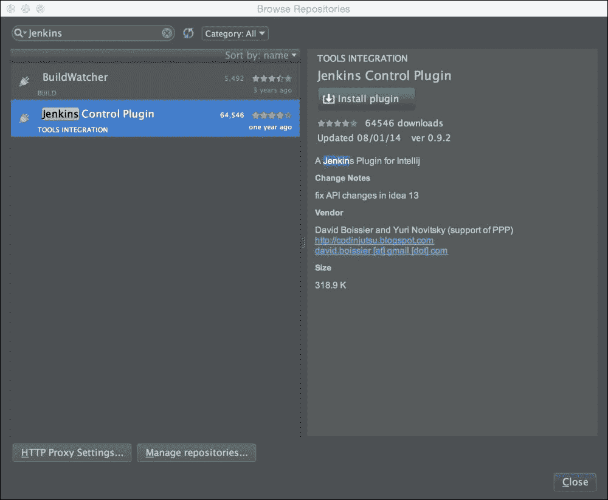

点击绿色的**安装插件**按钮-插件将被下载，并提示您重新启动 IntelliJ IDEA-这样安装就完成了。

重新启动 IDE 后，点击**查看**菜单，选择**工具窗口**，您应该会看到一个新的**Jenkins**选项。选择此选项会产生一个名为**Jenkins**的新窗格，在那里您可以通过点击扳手图标并填写必要的详细信息来配置连接到 Jenkins 服务器：

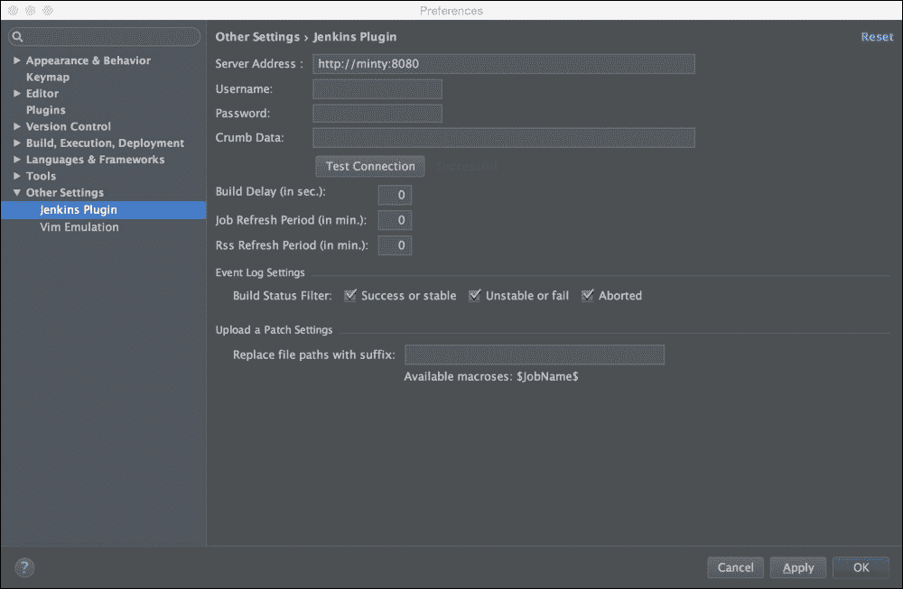

我的示例 Jenkins 实例非常简单-您可能希望在真实的 Jenkins 实例上使用身份验证，因此需要填写相应的详细信息。您可能希望调整时间和日志记录设置以适应自己；但是，基本设置非常简单，也非常类似于之前的 Mylyn 示例。

完成后，点击**确定**按钮，您应该在 IntelliJ 内看到您的 Jenkins 实例的视图：

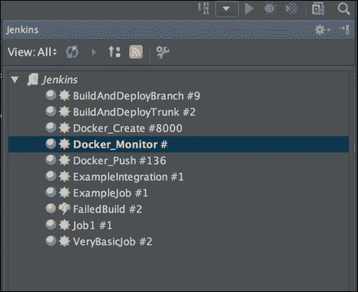

与 Mylyn 一样，您可以使用此插件执行几个有用的功能-监视构建的状态，触发新的构建，并查看所选作业的结果和历史记录。

# NetBeans

NetBeans IDE 具有内置功能，可以通过`HudsonInNetBeans`服务监视 Jenkins。

在 NetBeans 中选择**服务**选项卡将显示一个 Hudson Builders 项目，您可以在其中定义您的 Jenkins 实例，并根据 Jenkins 服务器上可用的视图定义配置要监视的项目：

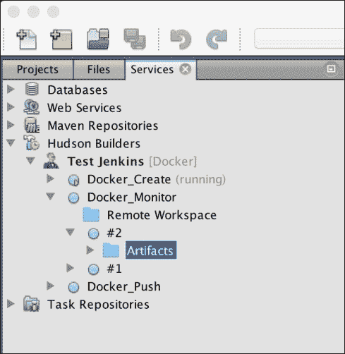

注册服务器后，您将收到 IDE 内弹出窗口通知任何失败情况。您可以在这里阅读有关此扩展的功能和配置的更多信息：[`wiki.netbeans.org/HudsonInNetBeans#General_setup_and_view`](http://wiki.netbeans.org/HudsonInNetBeans#General_setup_and_view)。

此外，构建监视器插件也可以添加以包括状态栏通知——可以从插件主页下载：[`plugins.netbeans.org/plugin/814/build-monitor`](http://plugins.netbeans.org/plugin/814/build-monitor)。

然后，通过选择**下载**选项并导航到最近下载的带有`.nbm`扩展名的文件，从**工具**|**插件**菜单项安装插件：

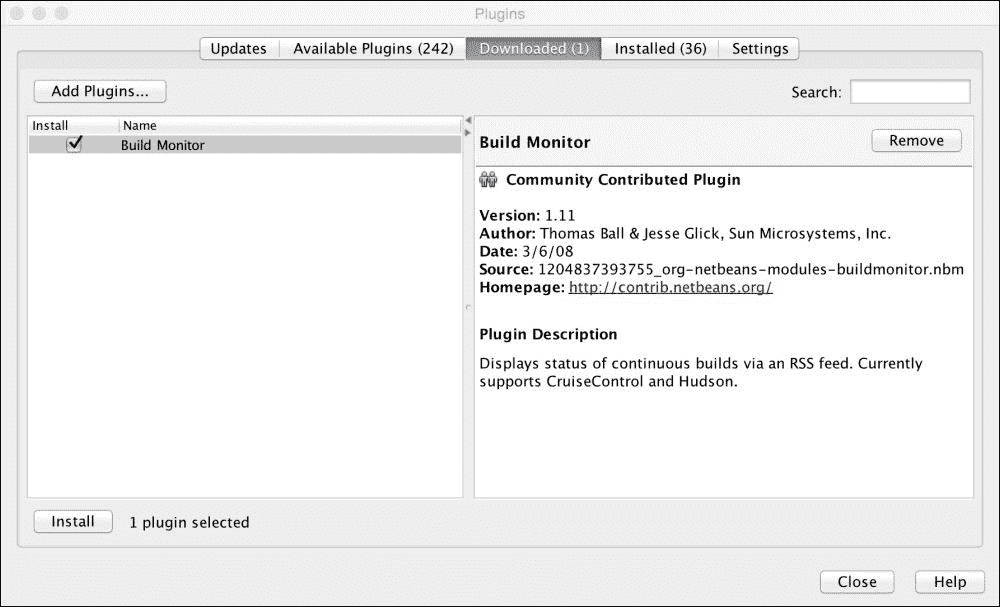

现在，只需选择**安装**，同意条款，然后再次点击**安装**—完成后，点击**完成**。现在，您应该有一个状态栏项目，可以配置为监视一个或多个 Jenkins 作业的状态，从而提供另一种有用且不会打扰的机制来关注更重要的构建。

# 总结

在本章中，我们看了持续集成的关键目标，以及它们如何与开发人员特别相关。我们已经审查了在这个领域我们想要实现什么，以及我们如何做到这一点，即通过使开发人员能够轻松地做正确的事情，并使他们的生活和角色更加轻松。

有许多不同的选项可供我们将 Jenkins 与开发环境集成，我们已经详细介绍了三种最流行的 IDE 的一些常见示例——这些 IDE 还有许多其他选项，其他 IDE 也有许多其他选项。如果前面的选项不适合您的环境，希望一般的想法和方法能够转化为适合您的东西。这些插件正在定期开发和增强，因此选择最适合您和您的环境的方法和组合。关键目标是让他人的生活变得更轻松，并鼓励他们也让您的生活变得更轻松！

此外，除了 IDE 之外，我们还有许多其他方式可以将 Jenkins 信息传达给其他人；有系统托盘通知器、信息辐射器、仪表板、自定义 Web 应用程序、电子邮件提醒、即时消息通知，甚至是自动化的熔岩灯和泡沫火箭发射器！

在下一章中，我们将看看与 Jenkins 互动的其他几种方式——这些方式更加技术化，不太关注最终用户，但它们在某种程度上相关，可能会给您一些开发自己定制解决方案的替代想法。
