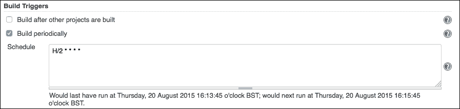
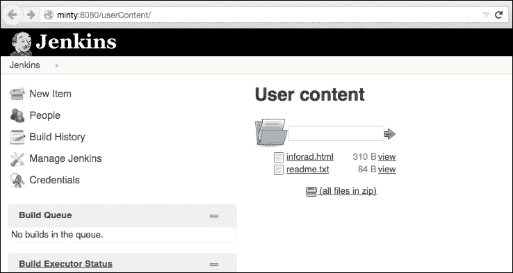
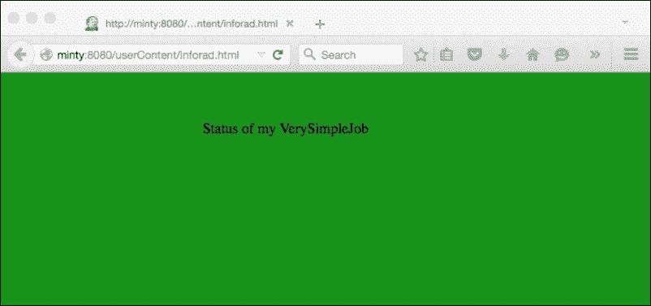
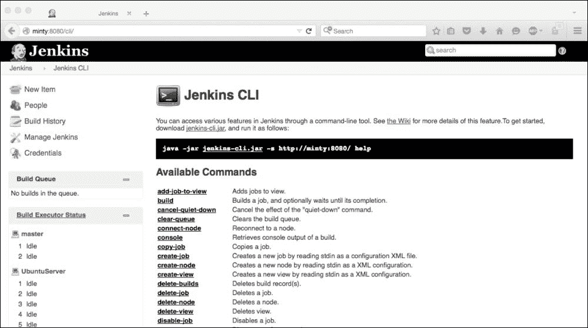
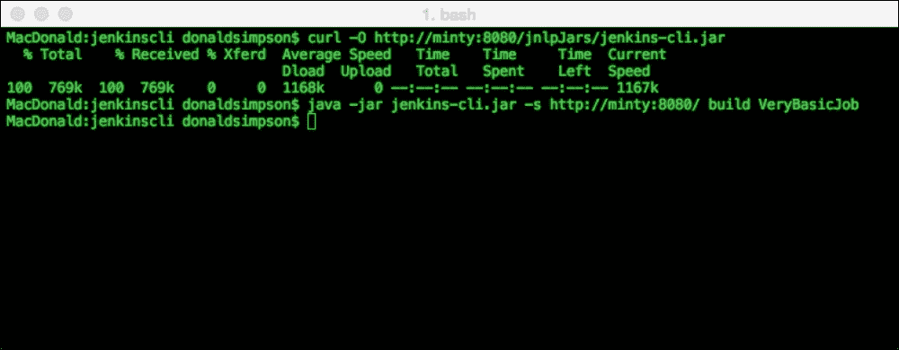
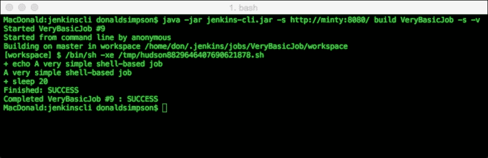
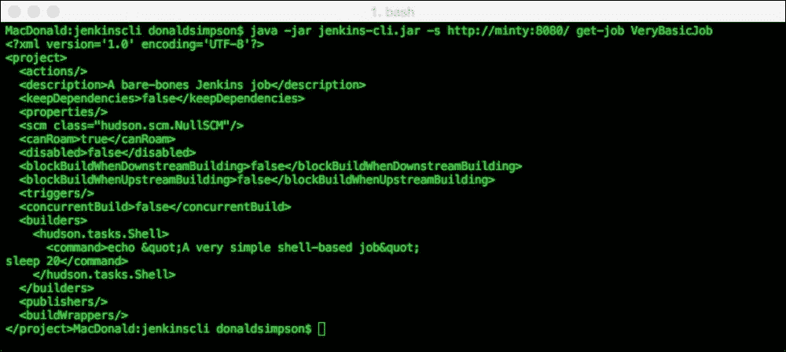

# 第四章。API 和 CLI

在上一章中，我们看了几种与 Jenkins 交互和扩展其使用的方式，以便开发人员可以直接从他们的开发环境中受益。

我们看到的插件和附加组件显然可以从 Jenkins 中获取“实时”数据，以便直接将这些数据传达到客户环境（开发人员的 IDE）。

在本章中，我们将看看这些插件是如何能够访问这些信息的，并且我们将探索 Jenkins 为编程交互提供的各种机制和接口，例如 Jenkins **应用程序编程接口**（**API**）。我们还将探索 Jenkins **命令行界面**（**CLI**），它提供了一种远程以编程方式和/或交互方式与 Jenkins 进行交互的机制。

这两个功能都非常强大，并且是扩展 Jenkins 的基本实用程序。

通常您会使用 Jenkins API 的三个主要功能如下：

+   从 Jenkins 检索和使用信息

+   基于外部事件触发构建

+   创建、复制和更改 Jenkins 配置

# 使用 Jenkins XML API 创建信息辐射器

为了说明您如何可以使用 Jenkins API 以编程方式从 Jenkins 中提取实时信息，我们将高层次地看一个实际示例 - 创建一个信息辐射器，从 Jenkins 获取信息并在外部网页中显示它。我们将不会详细编写所有的代码；但是，我们将详细分析基本构建块，以便您能够采用一般方法并使用您选择的语言开发自己的定制解决方案。

信息辐射器是简单但有用的*实时*网页，允许人们实时轻松监视您最关键的 Jenkins 作业的状态。这与我们之前看到的 IDE 插件非常相似，但是这些指示器显示在办公室的电视屏幕上，以辐射信息。

信息辐射器的约定是*保持简单* - 尽可能少地拥有作业，并且如果一切正常则显示绿色指示器，如果有问题则显示红色指示器。有时，如果构建正在进行中，则显示琥珀色指示器也是有用的。这个简单的系统有助于突出需要作为最优先解决的紧急问题，并且它还有助于阻止人们在他们清楚地看到构建当前不稳定时检入新更改；向已经破损的系统添加进一步的更改只会加剧问题。

在我们的高级概述中，我们将监视一个 Jenkins 构建的当前状态。您可以重复使用和扩展相同的方法来监视您想要的任意数量的构建，并且您将看到如何可以额外拉取和报告来自 Jenkins 作业的其他细节。

请注意，有许多预先构建的解决方案可供您使用，包括各种不同需求的插件 - 我们在这里故意采用自定义方法，以展示可能性并向您展示如何使用 Jenkins API。

# 从 Jenkins 获取信息

第一步是获取我们（程序化）的信息。最简单的方法是通过 XML API 进行。这只是简单地将`/api/xml`字符串附加到您想要监视的作业的 URL 上，如下所示：`http://yourjenkinsserver:8080/job/YourJob/api/xml`。

### 注意

请注意，还有一个可用的 JSON API；如果这更适合您的需求 - 只需将`api/xml`替换为`api/json`，以便以 JSON 格式接收相同的信息。

如果您在浏览器中执行此操作，您应该看到与我的**VeryBasicJob**作业类似的 XML：

从 Jenkins 获取信息

API 返回的文本很简单，XML 本身也很简单易懂；快速浏览一下就会发现它包含了您对刚刚查询的工作所需的所有信息——只是需要进行处理和解释。对于这些 XML 元素，似乎没有太多的文档可用；但是，如果您从尽可能简单的工作开始，然后对其进行更改和添加，您应该能够弄清楚每个元素的作用以及可能的值。

XML 处理器是处理这个问题的最佳方法，您选择的脚本或编程语言应该提供多种选择。例如，Perl 有**XML::Simple**，Python 有**ElementTree**，Groovy 有**XmlParser**，Java 有**JAXP**，还有许多其他选项。如果您没有这些，您可以在 shell 脚本中使用`grep`和`awk`来查找您想要的行和值。

因此，我们现在有一个我们想要监视的工作，一种获取所有当前工作信息的方法，一个适当的处理 XML 的方法，以及提取我们想要的信息的机制。

对于这个例子，我们真正想知道的只是构建的当前状态——对应于我们的红色、琥珀色和绿色健康指示器的值——这些值作为作业的当前`color`属性存在于 XML 示例中。

例如，考虑以下 XML 标记：`<color>blue</color>`。这表明我们目前有一个非运行和稳定的工作，而`<color>blue_anime</color>`则指的是上次构建健康且当前正在构建的工作的蓝色和动画健康指示图标。

我们可以简单地将任何提到`anime`的内容显示为琥珀色在我们的信息显示器中。`<color>red</color>`和`<color>red_anime</color>`分别是失败和运行（但以前失败）的作业的明显等价物。如果您查看各种不同类型和状态的作业的 XML，您将能够发现并解释所使用的命名约定——只需将`/api/xml`添加到各种作业的选择中并进行比较。

# 自动化工作

我们简单的信息显示器的下一个障碍是自动化和调度工作，正如您所期望的那样，我们可以在 Jenkins 中非常快速和轻松地完成这项工作。

只需创建一个新的 Jenkins 作业，获取相应的 URL（在末尾加上`/api/xml`），并将其传递给您的 XML 解析脚本以提取当前值。

许多编程和脚本语言都具有内置的 XML 或网络获取功能，但如果您愿意，您也可以使用 curl 或 wget 来获取数据，然后将其传递给您的脚本。

Jenkins 作业可以按照您的需要安排运行频率——您可以使用标准的 cron 表示法通过内置的 cron 函数来设置作业，例如，您可以将作业设置为每两分钟运行一次，如下所示：



在这个示例中，我指定了`H/2 * * * *`，以便每两分钟运行一次此作业。符号`H`是 Jenkins 内置的一个方便机制，允许 Jenkins 平衡和管理作业调度。Jenkins 能够分发负载，而不是在完全相同的时间触发所有作业。要了解更多详情，请点击**Schedule**输入框旁边的**?**图标，其中写着以下内容：

**为了让定期计划的任务对系统产生均匀的负载，应尽可能使用符号 H（哈希）。例如，对于十几个每天的作业使用 0 0 * * *将在午夜引起大量的负载。相比之下，使用 H H * * *仍然每天执行每个作业一次，但不会同时执行，更好地利用有限的资源。**

如果您对 cron 语法不熟悉，请在任何 Linux 系统上查看 cron 手册页（在终端中键入`man cron`）。还有一些有用的 cron 生成器在线，比如[`crontab-generator.org/`](http://crontab-generator.org/)，这些都非常有用。

### 注意

请注意，在决定和设置重复构建的频率之前，强烈建议您测试和微调您的作业*。例如，如果您的作业运行需要 3 分钟，而您设置它每分钟运行一次，事情将不会进行顺利！

这一步的最后一个任务是将数据存储在某个地方-我通常更喜欢一个简单的 MySQL 数据库，我可以通过将当前运行时参数传递给 MySQL 二进制文件来在作业结束时更新。

# 辐射信息

最后一步是将数据库中的信息显示为颜色"辐射器"——这只是简单地生成一个查询数据并将这些信息转换为适当颜色-红色、琥珀色或绿色的网页。这可以用许多语言来实现，包括 PHP、JSP 和 ASP，但最简单的方法可能是让您的 Jenkins 作业为您写出原始 HTML 到一个文件，也许像这样：

```
<html>
  <head>
    <**meta http-equiv="refresh" content="5"**>
    <style type="text/css">
      .myclass{
        width:270px;
        height:150px;
        position:absolute;
        left:50%;
        top:50%;
        margin:-75px 0 0 -135px;
      }
    </style>
  </head>
  <body style="background**:#088A08**">
    <div class="myclass">Status of my VerySimpleJob</div>
  </body>
</html>
```

使用作业更新背景颜色的值。请注意，前面的代码中有一个 Meta 刷新标签，每 5 秒重新加载页面一次-否则您将长时间看着相同的信息！

# Jenkins 作为 Web 服务器- userContent 目录

您甚至可以让 Jenkins 充当一个简单的 Web 服务器，并托管我们为您创建的网页-如果您将作业生成的文件复制到`JENKINS_HOME`位置中的`userContent`目录中，您将在此 URL 看到该文件出现：`http://myjenkins:8080/userContent`

这应该如下所示：



点击**inforad.html**链接将给您以下页面-我们非常简单的 DIY 信息辐射器：



这个简单的练习说明了您如何通过 API 查询 Jenkins 以实时检索和消耗信息。

# Jenkins CLI

在本节中，我们将回顾 Jenkins CLI-这是另一个 Jenkins 扩展点，在某些情况下可能非常有用-通常用于针对远程 Jenkins 服务器运行命令，执行触发构建或更新配置等功能。

## 如何设置

为了使用 Jenkins CLI，您需要"jenkins-cli.jar"文件。

这可以很快、很容易地从您自己的 Jenkins 服务器获取。如果您在 Jenkins 实例的 Web 地址后附加"/cli"，您应该会看到一个类似于这样的页面：



这个 URL 提供了您启动 Jenkins CLI 所需的一切。

有一个指向 Jenkins Wiki 主题的链接，以获取更多信息，还有一个直接从您的服务器下载 Jenkins-cli.jar 文件的链接（`http://{yourserverand:port}/jnlpJars/jenkins-cli.jar`），以及可用 CLI 命令的列表和简要描述。

## 如何使用它

一旦您在本地保存了 CLI jar（您可以通过浏览器下载它，也可以使用命令行工具，如`wget`或`curl`），您只需要设置好您的 Java 环境，然后执行帮助页面开头详细说明的命令，如下所示：

`java -jar jenkins-cli.jar -s http://{yourserverand:port}/ help`

假设您在当前目录中有`Jenkins-cli.jar`，并且您更新了地址以反映您的服务器，您应该会收到基本的帮助信息，然后您就可以开始了。

## 通过 CLI 触发远程作业

CLI 最常见、也许是最简单的任务是在流程的某个特定点触发远程作业运行。当您将 Jenkins 与其他传统系统集成并逐渐引入自动化到手动流程中时，这可能非常有用。您可能无法立即自动化所有内容，或者一次性让 Jenkins 控制所有内容，但是如果您可以设置一个 Jenkins 作业来自动化现有手动工作流程的各个部分，那么您可以逐步引入 Jenkins，并逐步消除链条中的手动步骤。

例如，假设我们有一个传统的批处理作业，运行某种形式的数据处理。这个处理可能需要一些时间来运行，可能会有另一个步骤来检查处理是否完成，如果是的话，然后将新数据传输到另一个位置或传递给另一个进程。我们可以首先创建一个 Jenkins 作业，当调用时，它会接收数据，检查它是否有效，然后将其传递给流程的下一部分。这可能会消除一个手动步骤并减少整体处理时间。但是 Jenkins 作业如何知道何时运行？可能无法有效或可能无法告知处理是否已完成，但我们可以对流程进行小的更新，以在初始处理后自动调用 Jenkins 作业。

远程触发在简化的 Jenkins 服务器上运行作业就像这样简单：



在这里，我们首先使用`curl`将 Jenkins CLI jar 文件下载到当前目录：

```
**curl -O http://minty:8080/jnlpJars/jenkins-cli.jar**

```

这一步只需要做一次。然后我们将使用这个命令调用远程作业：

```
**java -jar jenkins-cli.jar -s http://minty:8080/ build VeryBasicJob**

```

使用这种简单的配置，您将得不到任何反馈；但是，在 Jenkins 服务器上检查`VeryBasicJob`应该会显示作业已触发，并且在控制台输出中，它还应该提到以下内容：

**由匿名用户从命令行启动**

所以，我们可以看到这已经可以了，但是缺乏反馈并不是很有帮助。如果我们在命令中添加`-s`和`-v`参数，我们将得到完整的详细信息，如下所示：



这看起来好多了——我们现在可以看到我们已经启动了`VeryBasicJob`的第 9 次运行，它只是在成功退出之前睡了 20 秒。

这些输出信息可以用于客户端脚本中检查成功或失败，或者您可以记录作业编号，或记录任何其他有用的输出。

显然，我们通常不会在没有任何形式的身份验证的情况下运行 Jenkins，因此在现实世界中，事情会变得有点复杂。您首先需要在 Jenkins 的用户配置页面中为您运行 CLI 命令的用户授予“Overall/Read”帐户权限。然后您可以简单地在命令行的末尾添加用户名和密码，如下所示：

```
**--username don --password MyPassword123**

```

这足以让事情运转起来，但从安全角度来看仍然不够好；凭据将以明文形式显示在您添加它们的脚本中，或者在您使用的 shell 的历史记录中，或者在您没有使用 HTTPS 时的 HTTP 流中。凭据也可能作为参数显示在用户运行`ps`或`top`等命令时传递给运行的进程，等等，在同一主机上。

更安全的方法是设置 SSH 密钥并传递私钥以获取公钥。如果您在 Jenkins 的“配置”中为您的用户名设置 SSH 密钥，您可以在提供的文本框中设置您的帐户的 SSH 密钥。这里有关设置 SSH 的详细说明：

[`help.github.com/articles/generating-ssh-keys/`](https://help.github.com/articles/generating-ssh-keys/)

完成此操作后，根据您使用的 Jenkins 版本，Jenkins 可能会自动检查并使用您的 SSH 凭据来自以下任何位置：

```
**~/.ssh/identity, ~/.ssh/id_dsa, ~/.ssh/id_rsa**

```

然后，您可以明确提供密钥的路径（将其附加到命令行而不是之前的用户名和密码详细信息）：

```
**-i ~/.ssh/id_rsa**

```

对于需要参数的工作（即您已设置为在运行时从用户请求信息的工作），您可以提供额外的“-p”参数，如下所示：

```
**-p sprint=1.7**

```

这将被传递给作业，就好像用户通过用户界面输入数据一样，并假设为该作业配置了名为“sprint”的输入元素。

## 更新 Jenkins 配置

Jenkins CLI 的另一个非常有用的能力是以编程方式和远程方式更新 Jenkins 配置。

从帮助页面上，我们看到当我们在服务器 URL 后附加`/cli`时，两个命令`get-job`和`create-job`非常有用。

运行 get-job 将请求 Jenkins 提供该作业的 XML 定义。

例如，考虑以下命令：

```
**java -jar jenkins-cli.jar -s http://minty:8080/ get-job VeryBasicJob**

```

当在我的服务器上运行时，它将返回以下输出：



这个 XML 也可以通过在命令的末尾添加`> VeryBasicJob.xml`来重定向到文件，然后可以将文件作为定期备份添加或更新到您的版本控制软件中。

同样，您可以选择使用 create-job 命令创建新作业，如下所示：

```
**java -jar jenkins-cli.jar -s http://{yourserverand:port} create-job MyNewJobName < MyNewJob.xml**

```

例如，可以通过 Jenkins 作业、XML 模板和一些用户指定的输入的组合来编程创建`MyNewJob.xml`文件。

我们还可以使用 update-job 来更新现有作业，与现有作业名称结合使用：

```
**java -jar jenkins-cli.jar -s http://{yourserverand:port} update-job VeryBasicJob < VeryBasicJob_v2.xml**

```

这种方法可以用来构建一个机制，将您的 Jenkins 配置的全部或部分备份到版本控制，然后通过 Jenkins 以编程方式重新加载它们。

如果需要，您还可以扩展此方法以对 XML 文件（因此也是它们创建的作业配置）进行一些修改；例如，定期更新发布或冲刺详细信息。

# 摘要

在本章中，我们探讨了 Jenkins API 和 Jenkins CLI 打开的可能性。

我们已经通过一些高级示例并说明了如何使用 XML API 开发自己的定制信息辐射器。

我们还概述了 CLI 提供的一些功能，并演示了如何使用它们。

从这两个功能的开放性可以看出，Jenkins 的灵活性非常惊人——它是一个开放平台，为您提供了许多适应和扩展它以满足您的需求和要求的方式。

我们之前检查的插件能够在远程 Jenkins 服务器上显示实时信息的方式现在应该是非常明显的，当我们稍后看看如何为 Jenkins 开发我们自己的插件时，我们将进一步使用 API 和 CLI。

在下一章中，我们将探索 Jenkins 扩展点，研究其背后的理论，并审查开发的最佳实践。
