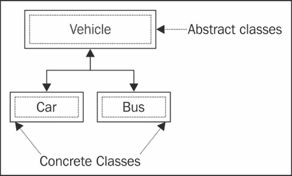
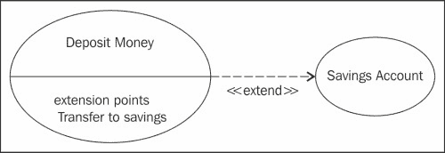
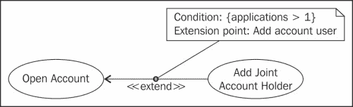
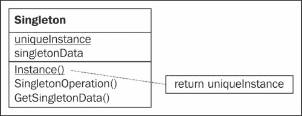

# 第五章：扩展点

在本章中，我们将介绍并探讨开发 Jenkins 插件时使用的理论和设计概念。我们将在这里涵盖高层概念，并提供一些通用示例，作为下两章的准备，我们将看到如何为实际情况实现这些想法。

在本章中，我们将介绍以下设计模式：

+   接口

+   抽象类

+   单例

此外，我们将回顾几个重要的设计概念：

+   契约设计

+   扩展点

+   创建扩展

+   注解

# Jenkins 插件的简要历史

Jenkins 有数千个可用的插件，涵盖了广泛的任务范围，并为使用和使用 Jenkins 的社区提供了丰富的宝贵资源。许多现有的插件最初提供了简单的功能并提供了有限的功能，但其中大多数已经发展成为非常成熟的软件，提供了大量的功能。许多插件也已经并入了 Jenkins 核心功能，将它们从额外的可选附加组件转变为默认情况下随 Jenkins 一起提供的代码。

Jenkins 插件的成功及其插件范围的主要原因之一是一开始用于开发和扩展 Jenkins 的设计理念。这种软件开发方法鼓励人们共同合作，使项目能够从彼此中受益，并创建了一个高度富有成效和协作的开发者和贡献者社区。

当您首次考虑为 Jenkins 开发自己的插件时，您应该首先解决几个问题——以下链接提供了在着手开发自己的新插件之前应采取的步骤的详细描述：

[`wiki.jenkins-ci.org/display/JENKINS/Before+starting+a+new+plugin`](https://wiki.jenkins-ci.org/display/JENKINS/Before+starting+a+new+plugin)

这背后的意图是提高插件的质量并避免重复。这种方法旨在鼓励现有和未来或拟议的插件的开发者共同合作，并在现有功能的基础上构建，而不是拥有大量非常相似的插件，每个插件都做一些略有不同的事情。

如果您正在寻找当前插件列表中不可用的一些附加功能，有可能有人正在努力提供此功能。如果您在开发社区中公布您的需求和意图，这可能会为您节省大量时间和麻烦。您可以选择与其他开发人员合作开发这个新插件，而不是自己动手。这种合作的最终结果更有可能产生受欢迎和高质量的产品，而不是两个开发人员创建类似功能。您还可能会发现您正在寻找的大部分功能已经在相关插件中可用，并且通过一些信息和合作，您可能能够利用这些功能来重用大部分现有代码来添加新功能。

所有这些协作、代码重用和增强主要是通过使用**扩展点**来实现的，这些扩展点代表插件或 Jenkins 功能的某些方面。这些是接口和抽象类，它们通过声明和公开的入口点实现交互和重用，提供并执行服务以符合文档化的合同。

现在我们将快速了解这些想法背后的理论，这样当我们编写自己的插件时，我们将了解幕后发生了什么，以及为什么我们从一开始就要考虑重用和扩展。

# 接口

Java 中的接口是用来提供和声明**合同**的机制，该合同定义了如何与和重用现有软件进行交互。这种方法背后的主要思想是，它消除了对内部工作方式的了解要求；您只需要知道所需的输入参数应该是什么，以及通过调用接口可以期望得到什么。代码的内部工作原理和处理方式并不是真正重要的，只要您遵守声明的合同，一切都应该没问题。

这种“按合同设计”的方法的另一个主要好处是，它减少了代码和流程更新对外部用户的影响。例如，如果您在名为`calculator`的类上调用一个`add`接口，该接口接受两个数字并返回结果，您（作为此服务的消费者）不需要知道或关心加法是如何完成的——在内部，该类可能只是简单地将两个 Java 整数相加，或者输入变量可能被传递到云中的 Web 服务，该服务将答案返回给`calculator`。代码和使用的方法可以完全重新设计和重写，但只要每个人都遵守约定的合同和接口，外部消费者就不应受到影响。

这种明确定义的接口还使得编写自动回归测试变得更加容易。当您知道有一个明确定义和稳定的接口时，通常可以简单地针对它编写测试，这些测试不需要太多的维护，因为接口通常不太可能被更改。这些测试可以在相关代码更改时作为 CI 构建的一部分自动重新运行，任何差异都应该很容易被识别。

要在 Java 中创建一个接口，我们在类定义中使用**interface**关键字：

```
**interface** Vehicle {
  // Vehicle methods
  // …
}
```

要使外部类使用这个接口，我们在类声明中使用**implements**关键字，如下所示：

```
class Motorbike **implements** Vehicle {
  // Vehicle Methods
  // …
  // Motorbike Methods
  // …
}
```

由于`Motorbike`类声明实现了`Vehicle`，它将需要实现在`Vehicle`中声明的每个方法。Java 编译器将确保在编译时完成这些操作。对于我们的`Vehicle`示例，这些方法可能包括逻辑函数，例如启动、停止、左转、右转、刹车和加速。`Motorbike`类特定的方法可能包括特定的内容，例如“飙车”，伸展支架，倒下等。

# 抽象类

Java 中的抽象类提供了可以被其他类使用的高级功能。您不能直接创建抽象类，但可以实现从抽象类派生的另一个类。

最简单的解释是，抽象类是一种类型的东西，但不是一个具体的东西——我的意思是，您可以有一个像我们的`Vehicle`示例那样声明了我们提到的所有方法的抽象类，但您永远不能只创建一个车辆——您必须有一些具体的东西，例如汽车、摩托车、气垫船、直升机等；您不能只有一个通用的车辆。

我们所有的车辆都略有不同，但共享相同的基本功能——它们可以行驶，可以停止，可以转弯。因此，这一共同的功能集可以被建模为抽象（`Vehicle`）类的基本方法，每当您创建一种新类型的车辆时，您将可以使用所有这些方法。

要在 Java 中创建一个抽象类，您必须使用`abstract`关键字：

```
abstract class Vehicle{}
```

通常，抽象类只会定义方法（行驶、停止、转弯），而子类将提供它们的实际实现。

我们的`Motorbike`类将扩展这个抽象类。

```
class Motorbike extends Vehicle {}
```

扩展抽象类的子类被称为**具体类**：



与抽象类的概念和逻辑分组不同，这些代表真实的、有形的对象。

# 抽象和接口

扩展点利用抽象和接口来允许和鼓励功能的重用。

在下图中，**存款**声明了一个名为**转账到储蓄**的扩展点。如果我们将其视为现有的代码，并且为了举例，如果我们想要创建一个新的**储蓄账户**对象，我们可以扩展已提供的存款功能，并使用它来实现一个名为储蓄账户的新功能，它扩展了存款。这意味着它将使用大部分存款功能，并且还将提供自己的附加功能。



在另一个例子中，我们将现有的`开户`代码扩展到`添加联名账户持有人`。这使用了许多`开户`方法，但也声明了一些特定于第二申请人的方法。以下图表显示了关系：



在我们有多个应用程序的情况下，我们可以扩展开户来创建一个新的**添加联名账户持有人**对象。这个新对象将包含并重用大部分开户代码，但它将以稍微不同的方式来满足第二个账户持有人的需求。

抽象类型是 Java 编程和面向对象设计中的一个关键概念。它们有时被称为**存在**类型，这有助于强调它们是*一种东西*，但没有必要的实现或属性来实际成为*一种东西*。

# 单例

在我们从高级和设计理论主题转移到在 Jenkins 中实现扩展之前，还有一个 Java 设计模式我们需要涵盖——单例模式。

当您希望确保给定类只有零个或一个实例时，可以使用单例。

通常，当您需要控制并发操作时会出现这种模式——通过确保只有一个实例可能，我们可以确保不会面临任何并发或竞争条件，因为这个类（和它的代码）将*绝对*是任何给定时间的唯一可能实例。通常，一个单例将被许多不同的函数使用，其目的是安全地处理和管理这种需求。

一个常见的单例示例是日志记录实用程序。例如，一个从系统的几个不同区域随时接收消息的类。然后它打开一个日志文件并将消息附加到文件中。我们不希望两个类同时写入同一个日志文件——那将引起混乱并且最终会以悲剧结束——因此控制和访问由该类的最多一个实例进行管理和限制。这个实例将被保证拥有并自由地写入日志文件，并且它将安全地知道没有其他相同类的实例在同时做同样的事情——它安全地管理“将这些信息写入日志文件”的功能。

希望使用“写入日志文件”方法的代码部分将尝试初始化单例对象。如果该对象的实例已经存在，我们将重用它，如果当前没有实例，将创建一个实例。然后它将保持可用，直到程序退出，或者被清理。

单例实例化是通过私有构造函数进行管理的，以便只有单例内部的代码才能创建它，如下所示：

```
public class Singleton {
  private static Singleton uniqueInstance = new Singleton();

  private Singleton() {}

  public static Singleton getInstance() {
    return uniqueInstance;
  }

  public String getDescription() {
    return "Singleton class";
  }
}
```

这被称为急切实例化，因为我们将在调用`getInstance()`方法之前每次创建一个新的单例对象。

对此的另一种方法——你使用哪种取决于你的偏好和要求——是使用延迟实例化，如下所示：

```
public class Singleton {
  private static Singleton uniqueInstance;
  private Singleton() {}

  public static synchronized Singleton getInstance() {
    if (uniqueInstance == null) {
      uniqueInstance = new Singleton();
    }
    return uniqueInstance;
  }

  public String getDescription() {
    return "Singleton class";
  }
}
```

在这里，我们使用了一个静态的单例实例，并同步了`getInstance()`方法。比较这两种方法应该有助于您决定最适合您需求的方法。在 UML 中，可以这样记录一个单例：



# 在 Jenkins 中声明一个扩展

正如我们迄今所见，一旦我们理解了它们背后的逻辑，创建一个接口或抽象类就很简单。声明一个接口或抽象类，然后实现所需的功能会更容易。

一旦您了解何时使用每种设计模式以及哪种方法适合您的要求，创建一个单例也很简单。

如果我们在创建或添加组件到 Jenkins 插件时牢记这一模式，我们应该能够确定适当的机会，可以在那里公开一个接口并为其他人创建一个扩展点以供使用。例如，如果您正在开发一个插件，出于某种原因将 Jenkins 作业的历史转换为 CSV 文件，以便可以导出并在电子表格中进行分析，您将编写函数将一些数据转换为 CSV 值——这可以声明为一个扩展点，只要传递的数据是指定类型的，其他人就可以重用您的代码将其数据转换为 CSV，而不是每个人都实现相同的函数，这将导致不必要的重复。

要在 Jenkins 中定义或创建一个扩展，我们使用`@Extension`注释类型。

Jenkins 会捕获这个注释，并将新的扩展添加到一个`ExtensionList`对象中，然后可以通过`ExtensionFinder`找到该扩展。

有关扩展注释的更多细节可以在这里找到：[`javadoc.jenkins-ci.org/?hudson/Extension.html`](http://javadoc.jenkins-ci.org/?hudson/Extension.html)。

以下示例显示了`Animal`扩展点的声明：

```
/**
 * Extension point that defines different kinds of animals
 */
public abstract class Animal implements ExtensionPoint {
  ...

  /**
   * All registered {@link Animal}s.
   */
  public static ExtensionList<Animal> all() {
    return Hudson.getInstance().getExtensionList(Animal.class);
  }
}
```

这说明了一个实现`ExtensionPoint`的抽象类：[`wiki.jenkins-ci.org/display/JENKINS/Defining+a+new+extension+point`](https://wiki.jenkins-ci.org/display/JENKINS/Defining+a+new+extension+point)。

# 总结

在本章中，我们探讨了几种主要设计模式背后的概念，并看到了何时使用每种方法以及为什么这样做。

如果您是一位经验丰富的 Java 程序员，这些概念应该非常熟悉，如果不是，那么希望这将成为一个基础，不仅帮助您理解我们在随后章节中所做的事情，也帮助您理解我们为什么这样做。

在本章的开头，我们提到了插件开发背后的哲学——人们应该寻求合作，重用和扩展现有的代码，以尽可能提供新的功能。如果每个人都单独创建自己特定需求的插件，而不是合作和贡献到现有的努力中，就会出现大量重复和复制，结果质量会大大降低。

这种理念和前述的设计方法已经创造了一个插件开发者社区，他们通过提供大量功能来生产高质量的软件，使 Jenkins 用户能够适应和扩展 Jenkins 以执行非常多样化的任务。

在下一章中，我们将在这些知识的基础上构建，并看到我们在开发第一个 Jenkins 插件时使用的概念。
