# 第六章。开发您自己的 Jenkins 插件

在上一章中，我们专注于 Jenkins 插件背后的高级概念。

在本章中，我们将亲自动手，通过设置我们的开发环境，熟悉我们需要了解的工具和约定，然后创建我们的第一个 Jenkins 插件。

在本章结束时，您应该熟悉以下内容：

+   使用 Maven 进行构建和依赖管理

+   用于插件项目的结构和布局

+   创建您自己的 Jenkins 插件项目

+   对插件源代码进行基本更改

+   编译，打包和部署插件到远程 Jenkins 实例

+   使用 IDE 进行更改和运行 Jenkins

+   在 IDE 中运行和调试 Jenkins 和您的插件代码的基础知识

我们将首先设置我们的开发环境；然后，按照传统方式，我们将创建一个非常简单的`Hello World`Jenkins 插件项目，以说明机制并让我们开始。

本章的大部分内容都是基于 Jenkins 插件教程指南中涵盖的主题：

[`wiki.jenkins-ci.org/display/JENKINS/Plugin+tutorial`](https://wiki.jenkins-ci.org/display/JENKINS/Plugin+tutorial)

### 注意

这个页面有很多有用的参考资料，如果您在本章的任何方面遇到困难，这应该是您的首要选择。

我们将首先专注于工具、约定和框架，并坚持使用最简单的插件，以便对开发插件所使用的过程和工具有扎实的理解。我们将在下一章中研究扩展点和更复杂的代码更改。

我们还将介绍在 Eclipse 中直接进行的插件开发和基本 Jenkins 调试的 IDE 设置。

### 提示

首先，我们集中于使用 Java 和 Maven，因为它们目前是构建插件最常用的工具集，但我们也将在下一章中看看替代方法，比如 Groovy 和 Gradle。

让我们开始设置您的环境。

# Maven 简介

我们将使用 Maven 来构建我们的插件。如果您对 Maven 不熟悉，不用担心——Maven 的主要观点是，您不一定需要对 Maven 了解很多，就可以使用它并从中获得很多好处！

对于一个相当不寻常的构建工具来说，您可能期望自己深陷于配置文件和代码中。然而，由于 Maven 的核心理念是使用“约定优于配置”，因此即使没有这些文件，Maven 也可以很好地工作。

Maven 的工作假设您和您的项目遵循一套标准、合理的约定。这些并不是太奇怪或繁重的东西，所以如果您遵循这条路线，那么 Maven 应该知道一切在哪里，以及您想要实现什么，并将帮助您快速轻松地启动和运行。

其中一个核心假设与您的项目结构有关；具体来说，如果您使用的是这样的目录布局：

| 项目 | 默认目录（相对于项目目录） |
| --- | --- |
| 源代码 | `src/main/java` |
| 资源 | `src/main/resources` |
| 测试 | `src/test` |
| 编译代码 | `target` |
| 可分发的 JAR | `target/classes` |

给定一个遵循这个约定的项目，Maven 将自动知道如何构建您的代码，如何测试它，以及如何将所有内容打包得很好，而无需其他配置或干预，为您提供了很大的好处，成本很小。

### 提示

只要您的项目坚持 Maven 所期望的路径，这就很好……如果您偏离了，事情就会变得非常混乱！这使得 Maven 非常适合新的和良好结构的项目，但在引入具有其自己关于位置和命名约定的传统项目时，需要更多的工作。

# 安装 Maven

Maven 是一个 Java 工具，因此，我们需要安装 Java 才能使用它。如果你在本地运行 Jenkins，你的系统上应该已经有 Java 了，但如果没有，你可以从以下链接下载适合你平台的 JDK——需要 6.0 或更高版本：

[`www.oracle.com/technetwork/java/javase/downloads/index.html`](http://www.oracle.com/technetwork/java/javase/downloads/index.html)

一旦你解决了 Java 的先决条件，就从 Apache 网站下载适合你平台的 Maven：

[`maven.apache.org/download.cgi`](https://maven.apache.org/download.cgi)

然后按照此页面上的操作系统的安装步骤进行安装：

[`maven.apache.org/install.html`](https://maven.apache.org/install.html)

在所有平台上，主要要求是确保你的`PATH`中有`JAVA_HOME`变量，并且`PATH`还包含你从下载中提取的 Maven `bin`目录。

一旦你设置好了，当你运行`java -version`然后`mvn -version`时，你应该得到与以下大致相似的东西——我也在这里显示 Java 和 Maven 环境变量供你参考：

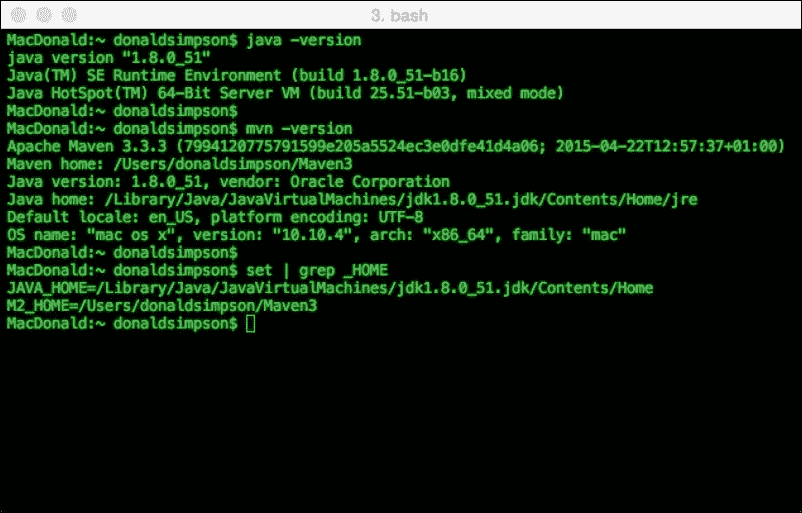

现在我们需要告诉 Maven 关于 Jenkins 的情况；它在哪里以及如何构建它。我们通过更新 m2 主目录中的`settings.xml`文件来实现这一点，其中包含在前面提到的 Jenkins 插件教程页面的**设置环境**部分提供的 XML：

[`wiki.jenkins-ci.org/display/JENKINS/Plugin+tutorial`](https://wiki.jenkins-ci.org/display/JENKINS/Plugin+tutorial)

在 Linux 或 Mac 中找到你的`settings.xml`文件：`~/.m2/settings.xml`。

对于 Windows，文件位于：`%USERPROFILE%\.m2\`。

在`settings.xml`文件中添加以下文本：

```
<settings>
  <pluginGroups>
    <pluginGroup>org.jenkins-ci.tools</pluginGroup>
  </pluginGroups>

  <profiles>
    <!-- Give access to Jenkins plugins -->
    <profile>
      <id>jenkins</id>
      <activation>
        <activeByDefault>true</activeByDefault> 
          <!-- change this to false, if you don't like to have it on per default -->
      </activation>
      <repositories>
        <repository>
          <id>repo.jenkins-ci.org</id>
          <url>http://repo.jenkins-ci.org/public/</url>
        </repository>
      </repositories>
      <pluginRepositories>
        <pluginRepository>
          <id>repo.jenkins-ci.org</id>
          <url>http://repo.jenkins-ci.org/public/</url>
        </pluginRepository>
      </pluginRepositories>
    </profile>
  </profiles>
  <mirrors>
    <mirror>
      <id>repo.jenkins-ci.org</id>
      <url>http://repo.jenkins-ci.org/public/</url>
      <mirrorOf>m.g.o-public</mirrorOf>
    </mirror>
  </mirrors>
</settings>
```

为每个项目创建一个新目录是个好主意。这样做可以保持清洁和简单，而不是让多个项目共存于一个文件夹中。要为这个项目创建一个目录，运行`mkdir`，然后`cd`进入目录，如下所示：

```
**mkdir jenkinspluginexample**
**cd jenkinspluginexample**

```

之后，我们可以开始构建，这将为我们创建一个骨架插件项目：

```
**mvn -U org.jenkins-ci.tools:maven-hpi-plugin:create**

```

### 注意

如果在这一点上有任何问题，请首先检查以下三个常见原因：

+   `mvn`在这个目录下工作吗？使用`mvn -version`进行检查

+   Java 在这个目录下工作吗？使用`java -version`进行检查

+   你有互联网连接吗？使用 `ping www.google.com` 进行检查

如果一切顺利，你将被提示回答几个简单的问题；Maven 将要求你指定插件的`groupId`和`artifactId`参数。

对于`groupId`，惯例是使用你的域名倒序，然后是项目名称，全部小写并用点分隔。给定`donaldsimpson.co.uk`域名和`jenkinspluginexample`项目名称，我会使用这个：`uk.co.donaldsimpson.jenkinspluginexample`。

`artifactId`的值应该是你的项目名称，即`jenkinspluginexample`。

如果`jenkinspluginexample`项目包含多个组件或服务，你应该在这里附加额外的服务名称，例如以下内容：

```
**jenkinspluginexample-service**
**jenkinspluginexample-web**
**jenkinspluginexample-gui**

```

这种方法的目的是确保与组 ID 一起使用时，项目的每个部分都能保持独特和容易识别。

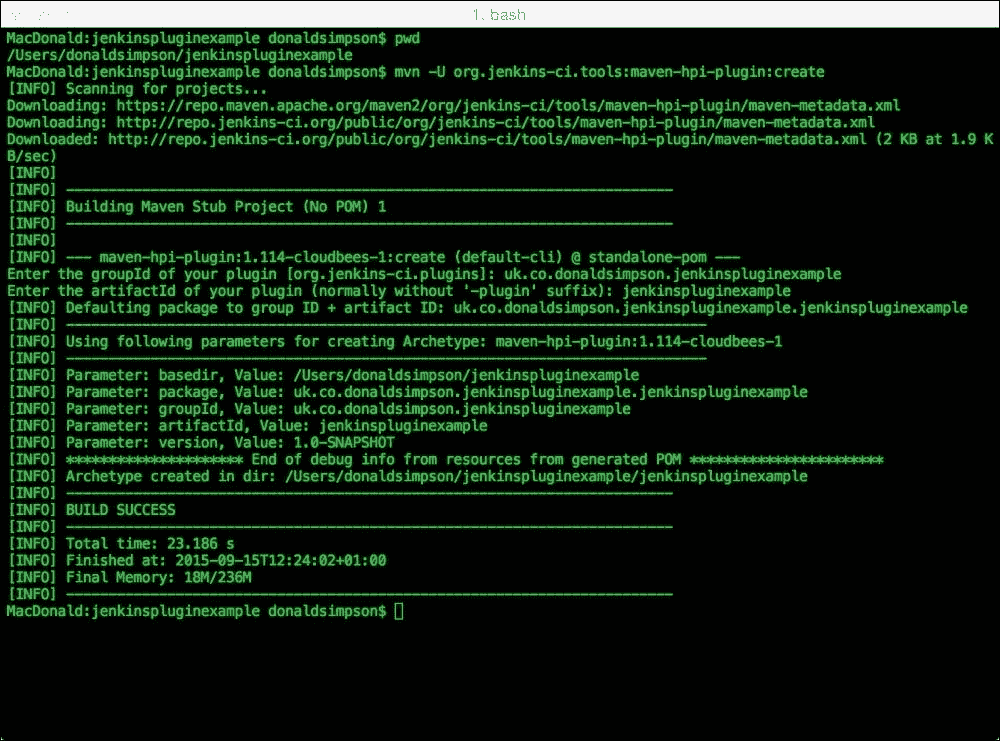

上述截图是先前输入的结果，并声明使用骨架插件创建了版本 1.0 快照构建，这为我们创建了一个非常基本的第一个插件供我们检查。

现在看看新创建的子目录里面，它的名称应该与你的`artifactId`匹配。

在探索这个目录之后，我们现在应该生成了创建最基本插件所需的所有示例。这些包括以下内容：

+   `pom.xml`：我们项目的新 Maven POM 文件，其中包含 Maven 构建、打包和分发我们示例插件所需的信息

+   `src/main`：这个目录包含 Java 目录和资源目录

+   `src/main/java`：这个目录包含我们稍后将更新的`Hello World`构建器类

+   `src/main/resources`：这个文件夹包含配置和帮助文件

仔细查看我们刚刚生成并提到的这些新文件夹的内容，将帮助你熟悉 Maven 和 Jenkins 用于开发、构建和分发插件的不同文件和结构。布局遵循 Maven 的约定，并且也用于许多其他项目。

正如你之前看到的，我们的新项目目录有自己的`pom.xml`文件，所以我们应该能够将其构建为一个 Maven 项目——让我们来看看并尝试一下！

切换到新的`pom.xml`文件所在的位置，并查看它——你会看到这里提供了各种可用的目标，以及与我们的项目一起使用所需的所有细节。

还有一个打包声明，如下所示：

```
<packaging>hpi</packaging>
```

这告诉 Maven 你希望将这个项目打包成一个 HPI 文件——这是 Jenkins 插件的标准文件格式。其他打包指令通常包括 ZIP、JAR、WAR 和 EAR。

Maven 还假设你希望对项目执行一组标准任务——这些通常包括以下功能或**阶段**：

+   `validate`：这将验证项目是否正确，并且所有必要的信息都是可用的。

+   `compile`：这将编译项目的源代码。

+   `test`：这将使用适当的单元测试框架测试编译后的源代码。这些测试不应该需要代码被打包或部署。

+   `package`：这将编译后的代码打包成可分发的格式，比如 JAR。

+   `integration-test`：如果需要，这个过程会将包部署到集成测试环境中。

+   `verify`：这将运行检查以验证包是否有效并符合质量标准。

+   `install`：这将把包安装到本地仓库，以便在其他项目中作为依赖使用。

+   `deploy`：这是在集成或发布环境中完成的。此功能将最终的包复制到远程存储库，以便与其他开发人员和项目共享包。

+   `clean`：这将清理先前构建创建的构件。

+   `site`：这为该项目生成站点文档。

这个指南有关于 Maven 阶段和目标以及它们如何关联的更多信息：

[`maven.apache.org/guides/getting-started/maven-in-five-minutes.html`](https://maven.apache.org/guides/getting-started/maven-in-five-minutes.html)

如果我们现在运行`package`目标，Maven 应该会运行所有先决步骤，然后生成一个 HPI 文件，我们可以通过运行以下命令将其部署到 Jenkins：

```
**mvn package**

```

这个阶段将使用 POM 文件中的信息下载所有必需的依赖项。然后它将编译 Java 代码，并且如果存在测试（在预期位置`src/test`中），也会运行测试。

根据你的互联网连接，这可能需要一些时间，因为 Maven 将对所有声明的依赖项（以及它们的依赖项！）进行初始下载，这些依赖项在本地还没有。在后续运行中，事情应该会快得多，因为 Maven 将在`.m2/repository`缓存文件夹中保留已下载的资源，该文件夹位于你的家目录旁边，就在我们之前更新的 settings.xml 文件旁边。

完成后，你现在应该有一个可分发的`.hpi`文件！

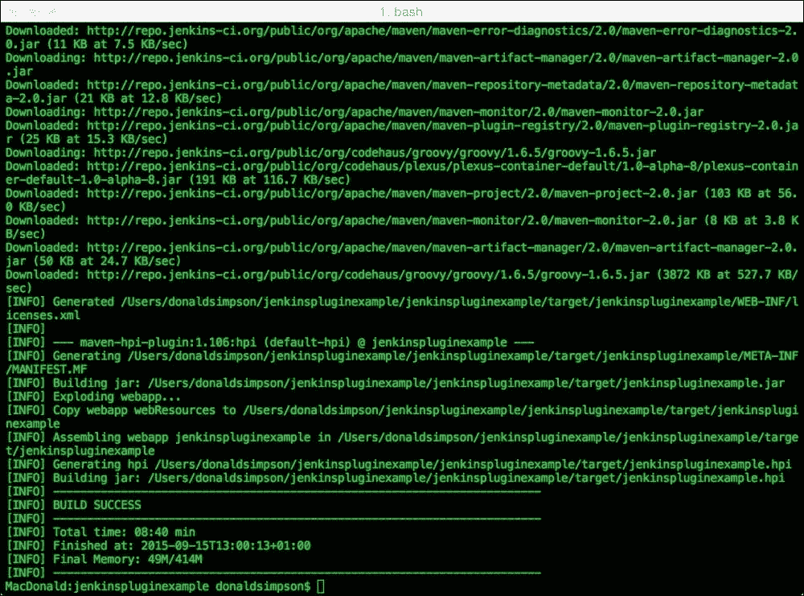

从前面的图像中可以看出，控制台输出在最后附近解释了代码已经被编译成一个 Java 存档（`.jar`）文件，资源（Jelly、配置和 HTML 文件）已经被包含，并且一切都已经在我的情况下被打包成了一个名为`jenkinspluginexample.hpi`的结果存档，现在位于`target/`目录中。

我们还没有写一行代码，但我们刚刚制作了我们的第一个 Jenkins 插件！

现在让我们将其部署到标准的 Jenkins 实例：

1.  打开您的 Jenkins 实例的主页。

1.  导航到 Jenkins 的**主页** | **管理 Jenkins**。

1.  选择**管理插件**，然后选择**高级**。

1.  滚动到**上传插件**部分，然后点击**浏览**。

1.  导航到您的项目目录的目标目录中的新`.hpi`文件所在的本地文件夹：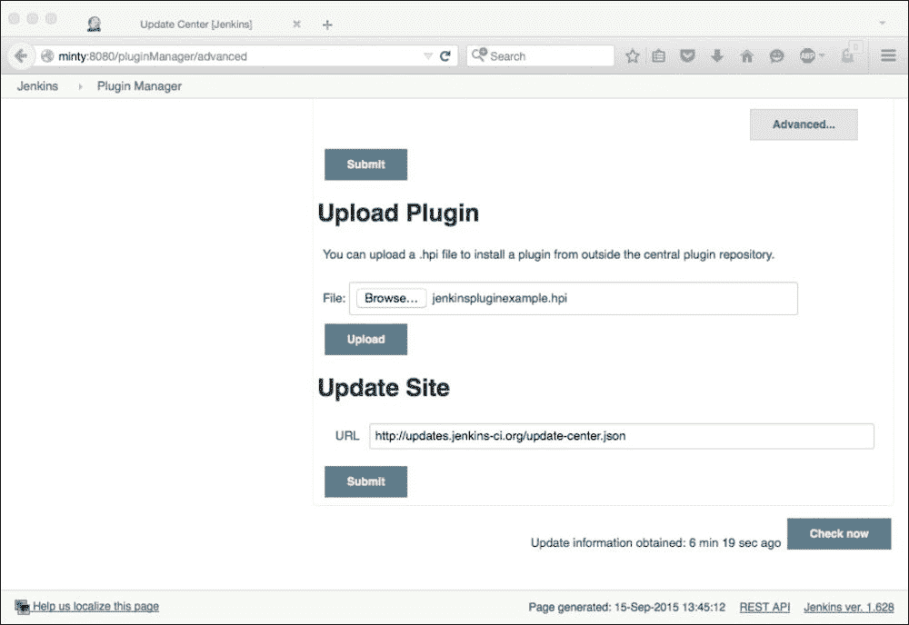

单击**提交**按钮后，您应该看到您的插件已上传并安装到您的 Jenkins 实例上：

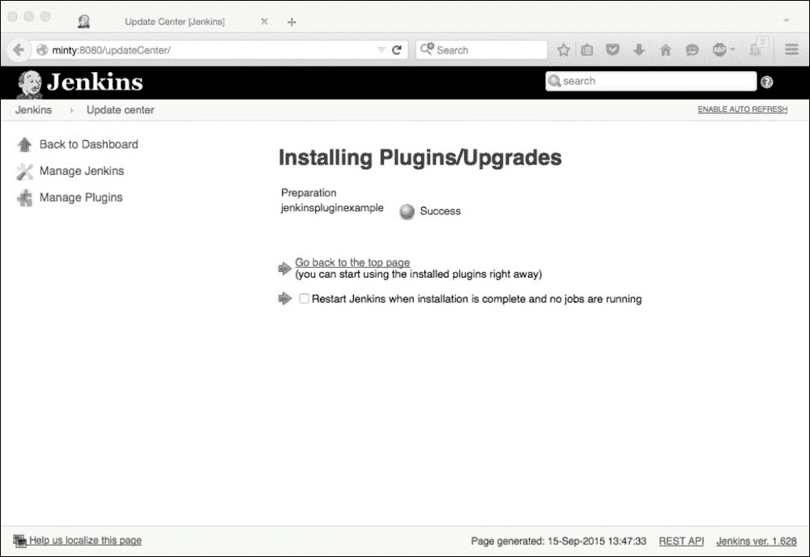

现在，您的已安装插件列表中将会有一个`TODO`插件，以及快照构建编号和您的名字作为作者。

如果您现在点击任何自由风格作业的**配置**，将会有一个新选项添加一个名为**Say hello world**的构建步骤：

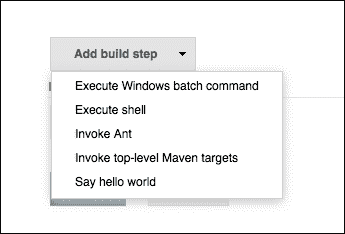

选择这个选项将产生以下对话框，您需要在其中提供您的名字：

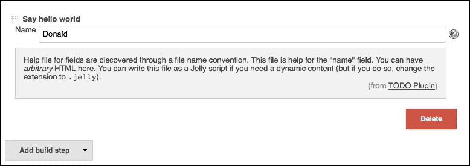

毫不奇怪，对于一个`Hello World`项目，下次运行此作业时，这将显示为控制台输出中的一个额外构建步骤：

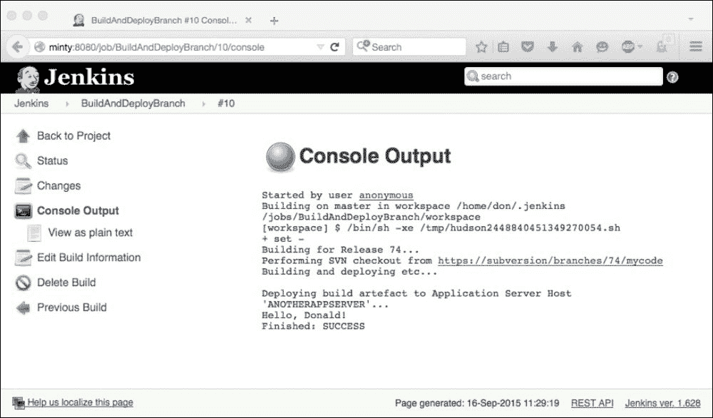

在 Jenkins 实例上安装和运行我们自己的插件看起来很酷，第一次这样做很有趣。然而，当您开发插件时，每次进行小改动时都要经历这样的过程比您想象的更麻烦！

现在让我们看看如何进行第一次代码更改以及更智能、更高效地打包、部署和测试我们的代码。

首先，对`HelloWorldBuilder.java`文件进行微小的更改，该文件位于您的`src/main/java`目录中：

```
src/main/java/uk/co/donaldsimpson/jenkinspluginexample/jenkinspluginexample/HelloWorldBuilder.java
```

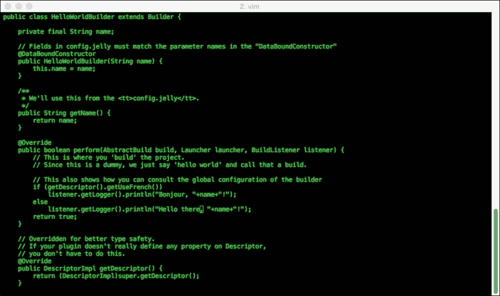

最初，这行是这样的：

```
listener.getLogger().println("Hello, "+name+"!");
```

我只是将前一行改成了以下内容：

```
listener.getLogger().println("Hello there, "+name+"!");
```

与其再次经历之前的整个过程——编译、打包、通过 Jenkins 网页部署等等——来检查这个小更新，我们可以通过一个简单的 Maven 命令执行所有这些步骤：

```
**mvn hpi:run**

```

这将编译代码（在接受我们的修改后），然后启动并在您的计算机上运行一个带有我们新更新的插件的本地 Jenkins 实例——这使得测试您的更改变得更容易、更快速、也更安全。

要在 Windows 上执行此操作，首先导出以下设置：

```
**set MAVEN_OPTS=-Xdebug –Xrunjdwp:transport=dt_socket,server=y,address=8000,suspend=n**

```

在 Unix 和 Mac 上，执行相应的操作，如下所示：

```
**export MAVEN_OPTS="-Xdebug –Xrunjdwp:transport=dt_socket,server=y,address=8000,suspend=n"**

```

然后，无论平台如何，调用`hpi:run`目标，如下所示：

```
**mvn hpi:run**

```

之后，您将能够看到 Maven 下载依赖项，然后启动一个本地的 Jetty 实例，该实例在其中运行具有您的插件的 Jenkins！

密切关注控制台输出，当显示以下文本时，您将看到一切都完成了：**INFO: Jenkins is fully up and running**。

在这一点上，您可以通过将浏览器指向以下位置来安全地连接到 Jenkins 实例：

`http://127.0.0.1:8080/jenkins/`

### 注意

不要尝试连接到您在`MAVEN_OPTS`中设置的`8000`端口——这用于调试，我们稍后会看一下。使用端口`8080`，并注意附加的`/jenkins/`路径也是必需的，以便连接。

现在，我们可以创建和配置一个新的自由风格作业，并通过选择使用我们的**Say hello world**作业并将我们的名字添加到其中来添加与之前相同的构建步骤。

运行这个新作业应该会产生预期的输出，如下所示：

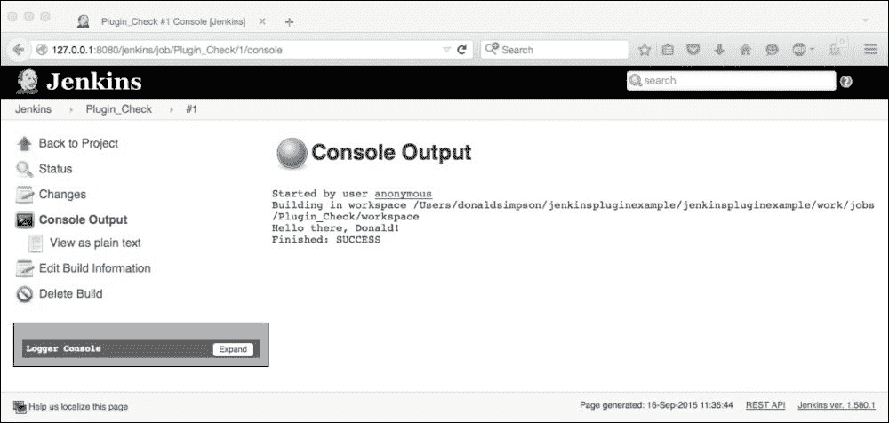

这证明了我们的代码更改已被接受，并展示了您可以多快多轻松地进行代码更改、测试、打包、部署和验证——一个小小的 Maven 命令为您完成了大部分工作！在初始设置和下载之后，这也是一个相当快速的过程。

为了使生活更加轻松，我们可以设置一个 IDE 来帮助我们开发 Jenkins 插件。

### 注意

官方的 Jenkins 插件教程页面位于[`wiki.jenkins-ci.org/display/JENKINS/Plugin+tutorial`](https://wiki.jenkins-ci.org/display/JENKINS/Plugin+tutorial)。该教程包含了 NetBeans、IntelliJ IDEA 和 Eclipse 的步骤。前两者非常简单，所以我们将在这里更详细地介绍 Eclipse 的设置。

插件指南目前建议使用此命令为插件开发生成新的 Eclipse 工作空间：

```
mvn –DdownloadSources=true –DdownloadJavadocs=true -DoutputDirectory=target/eclipse-classes –Declipse.workspace=**/path/to/workspace** eclipse:eclipse eclipse:add-maven-repo
```

您需要将`/path/to/workspace`更新为系统上合适的工作空间位置，这可以是您喜欢的任何地方，但理想情况下应该与其他 Eclipse 工作空间相邻。

### 注意

我在运行建议的命令时遇到了问题，并发现`eclipse:add-maven-repo`已经过时，所以我将其更新为`eclipse:configure-workspace`。

对于我的项目，以下操作有效：

```
mvn –DdownloadSources=true –DdownloadJavadocs=true -DoutputDirectory=target/eclipse-classes -Declipse.workspace=/Users/donaldsimpson/Documents/JenkinsPluginEclipseWorkspace eclipse:eclipse eclipse:configure-workspace
```

确保您从创建`Hello World`插件的相同目录中运行此命令，因为它需要`pom.xml`文件和其他资源。

完成后，此步骤应成功在新的工作空间中填充一个新的 Eclipse`.metadata`目录，并在您的项目目录中具有所有必需的设置和资源。

接下来，打开 Eclipse 并切换到您选择的工作空间，选择**导入**（在**文件**菜单下），选择**常规**，然后选择**现有项目到工作空间**，如下所示：

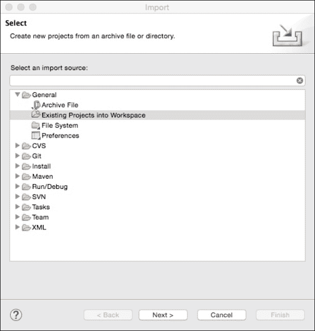

将此对话框指向您创建`Hello World`插件的目录（`pom.xml`文件所在的位置），Eclipse 应该会自动为您加载项目：

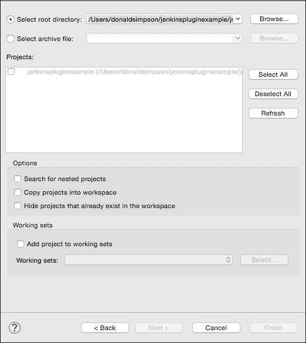

完成后，您的 IDE 应该看起来像这样：

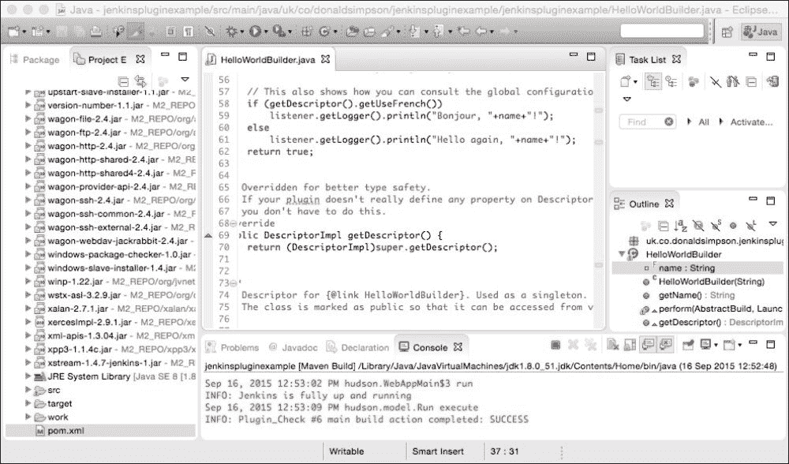

现在您可以在 Eclipse 中编辑 Java 类和插件资源。

### 提示

请记住，您还可以启用我们之前设置的 Mylyn 插件，以便随时关注您最重要的 Jenkins 构建的情况！

您还可以从这里管理项目的 POM 文件并运行 Maven 构建——右键单击`pom.xml`文件，然后选择**运行为**和**Maven 构建**，Jenkins 现在应该会直接在您的 Eclipse 控制台中启动，并且您的插件已经部署了最新版本的代码。

要测试此设置，请尝试进行另一个非常简单的更改——在前面的图像中，我将输出消息更新为**Hello again**，只是为了不同。保存`Hello World`构建器类，然后通过 Eclipse 运行 Maven 目标`hpi:run`将启动 Jenkins，您可以在 Eclipse 中看到所做的更改。

您还可以在**调试**模式下运行 Jenkins，并通过单击 Eclipse 中所需代码的行来设置断点，如下所示：

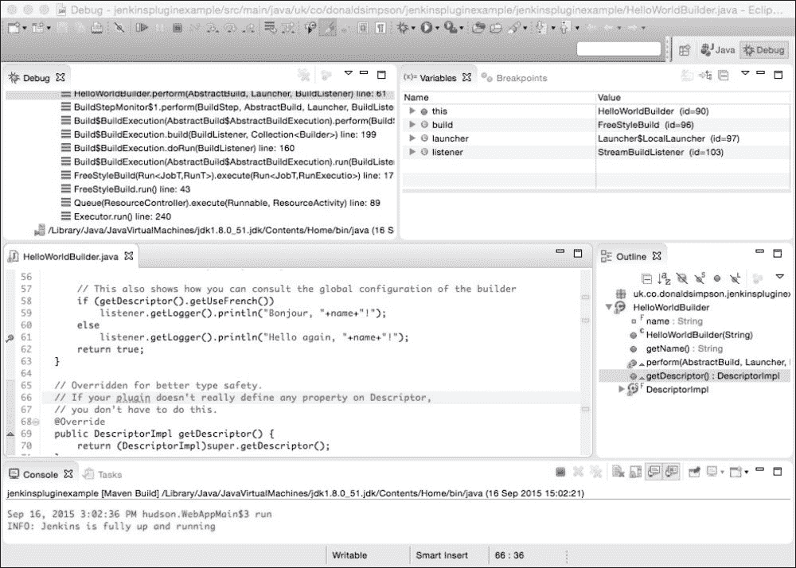

在这里，我们可以看到当通过 Jenkins 运行构建时，断点被激活。此时，焦点将自动从浏览器中的 Jenkins 切换到 Eclipse IDE，在那里我们可以实时检查现有变量的当前值。然后，我们可以通过实时调试值并在每一步监视控制台输出来逐步走过代码。

这是一个非常方便的开发功能，以这种方式设置 Jenkins 插件开发环境可以使事情更加高效，也可以让您的生活变得更轻松！

# 摘要

在本章中，我们已经构建、打包和部署了我们自己的“基本”Jenkins 插件。

我们已经了解了开发 Jenkins 插件所使用的工具和约定。我们在开发主机上设置了 Java、Maven 和 Eclipse，并学会了如何构建、打包、测试、部署，甚至调试我们自己的插件。

我们仍然缺少的主要内容是您决定放在中间的内容！这将是我们下一章的重点。
