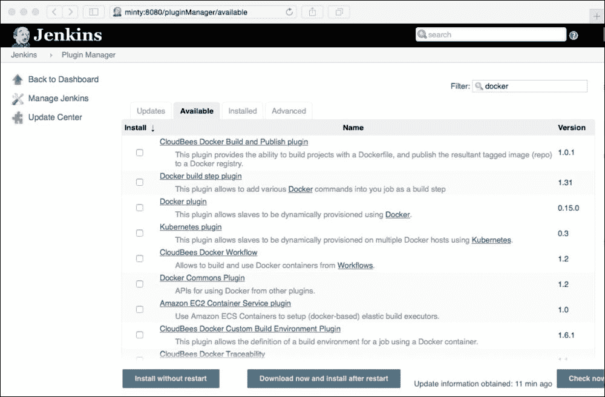
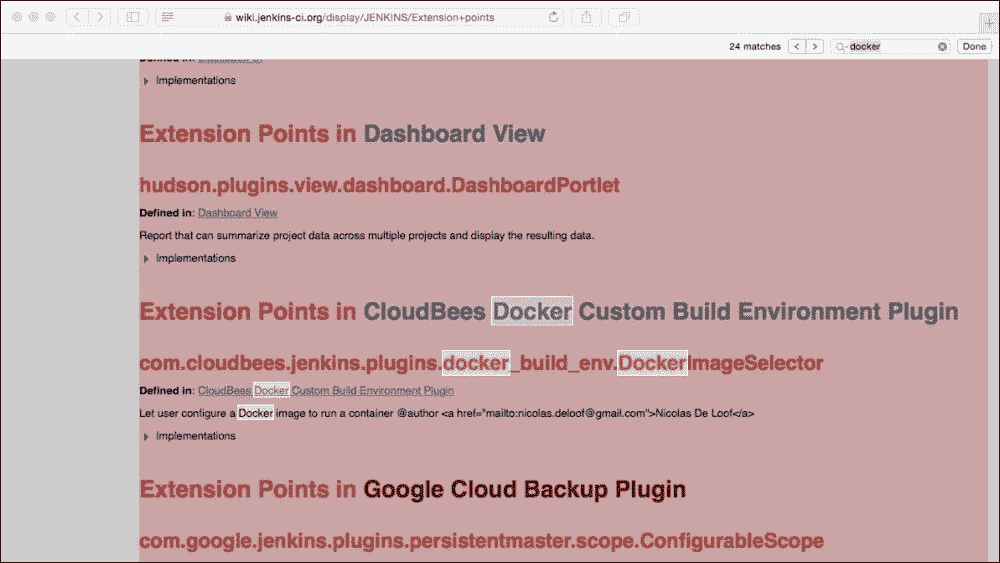
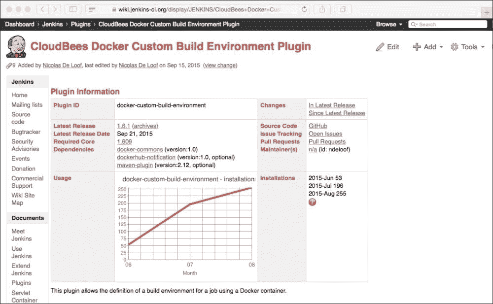
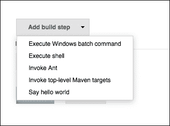
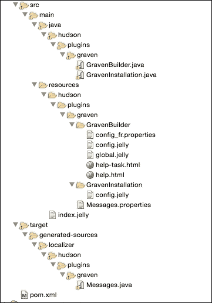
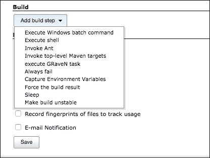
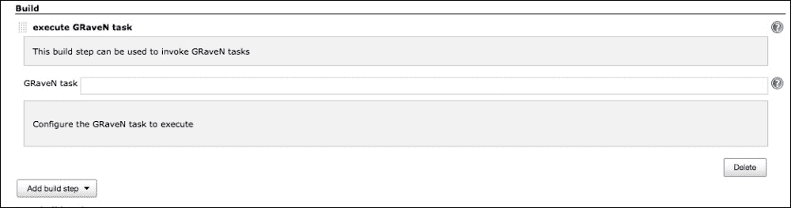

# 第七章：扩展 Jenkins 插件

到目前为止，我们已经看过 Jenkins 插件开发的以下内容：

+   采取的方法-在可能的情况下重用，避免不必要的重复

+   协作-过程和社区如何工作

+   使用的设计方法和 Java 模式

+   设置开发环境和构建工具

+   开发第一个简单的插件

+   本地和远程部署和测试我们的插件

我们现在将看一下帮助您解决上一章缺失的中间部分并实现使您的插件能够做任何事情的方法！

这里的意图是引导您开发自己的插件，并演示您可以（并且应该）如何处理已经存在的资源的（再）使用的方式。

这意味着当您想要开发自己的插件并且想要尽可能快速和轻松地进行开发时，您可以通过遵循最佳实践并避免向 Jenkins 和插件代码库添加不必要的重复来实现这一点。

在此过程中，我们还将探索 Jenkins 插件使用的一些额外框架和技术。这些包括 Jelly、Stapler、本地化和国际化；当这些工具和实践一起使用时，能够使插件开发人员重用 Jenkins 内置功能，使他们的插件看起来像是“属于”Jenkins，而不是简单地添加上去的东西，通过保持与用户界面的其他部分相同的外观和感觉。

遵循这种方法，开始并了解如何使用这些框架将为您节省大量时间和挫折。一旦您知道如何研究和重用现有插件和 Jenkins 提供的代码和功能，您也将节省大量的开发工作。

在开发`Hello World`插件时，我们涵盖了大量新信息并引入了一些新概念。这些都是在相当高的层次上完成的，并且最小化了编码和配置，以便我们可以专注于整个过程并了解事物的运作方式。实际的代码非常简单，对于一个插件来说，它只是在每次运行构建时向控制台日志中写入一条消息。

毫无疑问，Jenkins 插件已被创建用于执行各种任务，并且它们以各种方式执行这些任务-有些与 Jenkins 用户界面无缝集成，而其他一些在背景中默默工作。有些扩展了现有功能，而其他一些添加了全新的功能。插件似乎是一致的-它们大致具有相同的外观和感觉，而不是看起来像是由不同的人开发的，他们对颜色方案、导航、对话框等有自己的想法。它们甚至能够响应区域设置的更改，根据用户指定的首选项以不同语言提供对话框。尽管 Jenkins 的许多功能来自大量插件，其中许多已经被吸收到 Jenkins 的核心中，但印象和用户体验是一个相当流畅和一致的整体，而不是一个碎片化和不一致的添加集合。

在本章中，我们将看一下进入 Jenkins 插件的其他元素，并扩展您可以完善自己的插件的方式。我们还将看一下如何查找和重用现有的代码/插件以便快速开始，并且我们将浏览一个提供类似于我们想要开始开发的假设新插件的功能的插件的内容。

# 从哪里开始？

因此，在查看了 Jenkins 网站和社区之后，我们决定编写一个新的插件，因为目前没有任何现成的（或者正在开发中的）插件能够满足我们的需求；我们应该从哪里开始呢？

我们可以从一个新的空白 Eclipse 项目开始，如果我们真的想的话，可以自己写所有的东西，但那将需要很长时间。

我们可以使用骨架`Hello World`项目，删除其中的内容，然后开始向其中添加我们的代码，但考虑到我们已经讨论了一段时间的代码重用和避免重复，这似乎不是我们期望遵循的方法。

即使您对插件有一个完全新颖的想法，也肯定已经有与之大致相关的东西存在；即使这并不能提供我们想要的功能，它可能以类似的方式工作或使用我们已经确定的许多感兴趣的扩展点，因此值得检查一下。

# 查看现有插件列表

通常，查看的第一个地方是可用插件的列表。如果您的 Jenkins 实例是最新的，您可以在 Jenkins 的**可用插件**页面中浏览当前可用的选项。

转到**管理 Jenkins**，然后选择**管理插件**，并选择**可用**选项卡，以选择越来越多的插件列表。

请注意，此屏幕允许您按特定单词进行过滤，并提供每个插件的简要描述。

另外，Jenkins 的**插件**页面提供了一个更容易浏览和稍微更详细的列表：

[`wiki.jenkins-ci.org/display/JENKINS/Plugins`](https://wiki.jenkins-ci.org/display/JENKINS/Plugins)

这将按其一般类别或功能对插件进行分组，并提供到每个插件相应 Jenkins 主页的链接。反过来，主页提供了更多信息，包括指向 GitHub 上该插件的源代码的链接，您可以在线浏览或本地下载。

如果您能在这里找到与您的插件类似的东西，那么在 GitHub 上查看源代码将使您能够详细了解每个插件的工作原理。您还将能够找出此插件使用了哪些扩展点。

另一个要考虑的选项是直接转到这里的**扩展点**索引页面：

[`wiki.jenkins-ci.org/display/JENKINS/Extension+points`](https://wiki.jenkins-ci.org/display/JENKINS/Extension+points)

此列表是由**Extension Indexer**程序自动生成和维护的，该程序可在以下位置找到：

[`github.com/jenkinsci/backend-extension-indexer`](https://github.com/jenkinsci/backend-extension-indexer)

该程序解析当前代码库中声明的所有扩展点，然后在生成的**扩展点**页面上列出它们，以及诸如项目主页和使用它们的插件列表等进一步的细节。

无论哪个起点适合您，插件列表还是扩展点列表，您都应该希望最终到达同一个地方——大致类似于您想要最终得到的东西的想法，这应该是一个很好的开始。

例如，如果我的插件与 Docker 连接，我可以从本地 Jenkins 的现有插件列表开始搜索：



或者，我可以转到[`wiki.jenkins-ci.org/display/JENKINS/Extension+points`](https://wiki.jenkins-ci.org/display/JENKINS/Extension+points)，并在这里搜索 Docker 的引用：



这两条路最终都会导致所讨论的插件的主页，例如：



这告诉您关于插件的一切，包括指向托管在 GitHub 上的此插件的源代码和配置文件的链接。

为了说明其余的过程并介绍其他你可能想要使用的框架和文件，我们将考虑一个我们想要开始开发的新插件。我们将尝试找到一个已经存在的东西，用它来开始，然后查看代码、配置文件和扩展点，以便让我们达到可以开始添加我们自己的代码的地步。

# 需要一个新的构建类型

对于这个假设的例子，我将首先创建一个用于 Docker 构建的新构建步骤。这将允许用户创建这种类型的构建，添加一些信息，然后最终执行与 Docker 构建类似的操作。

在通常添加构建步骤的选项中（加上我们的**打印 Hello World**示例）：



这个令人惊奇的新插件将添加一个额外的条目来启动 Docker 构建。

通过查看添加额外构建步骤的类似项目和**Hello World**示例，我猜想我的新插件也需要扩展`Builder`、`BuildStep`和`AbstractProject`类。

在查看之前列出的链接和资源之后，我发现有一个现有的 Graven 插件项目，执行的步骤与我们想要的非常相似，而且恰好包括了我们想要在本章中检查的所有新资源。另外，这里还有一些方便的文档：

[`wiki.jenkins-ci.org/display/JENKINS/Create+a+new+Plugin+with+a+custom+build+Step`](https://wiki.jenkins-ci.org/display/JENKINS/Create+a+new+Plugin+with+a+custom+build+Step)

让我们来看一下。源代码可以从 GitHub 下载，然后提取到本地目录：

[`github.com/jenkinsci/graven-plugin`](https://github.com/jenkinsci/graven-plugin)

这给了我们开始自己的插件所需的一切，这比从头开始要容易得多——我们可以检查和重用这里使用的扩展点，看看插件是如何创建新的构建类型，并调整属性文件和其他资源的，因为它执行了我们想要做的相同步骤。

# 加载和构建我们的起点

让我们将这个项目导入到 Eclipse 中。同样，这个过程非常简单；就像我们在上一章中所做的那样，我们将为我们的 Eclipse 项目创建一个目录，使用`cd`进入包含我们项目的 POM 文件的目录，然后再次运行`eclipse:configure-workspace`目标，如下所示：

```
mvn -DdownloadSources=true -DdownloadJavadocs=true -DoutputDirectory=target/eclipse-classes -Declipse.workspace=/Users/donaldsimpson/Documents/GravenPluginMasterWorkspace eclipse:eclipse eclipse:configure-workspace
```

这应该下载所有的依赖项，并允许你将项目导入到你的 IDE 中（导航到**文件** | **导入** | **常规** | **导入现有项目到工作区**），就像我们在上一章中所做的那样。

现在你应该已经将这个插件的所有资源和源代码加载到你的 IDE 中，它应该大致看起来像这样：



我们现在将快速浏览这些文件和文件类型，解释它们的功能，并探索它们为这个插件提供的附加插件组件和选项，以及它们可能为我们的新插件带来的潜在功能。

# 构建器类和 Stapler

第一个类是`GravenBuilder.java`。该类声明扩展了`Builder`类：

```
public class GravenBuilder extends Builder {
```

正如我们在[`javadoc.jenkins-ci.org/hudson/tasks/Builder.html`](http://javadoc.jenkins-ci.org/hudson/tasks/Builder.html)的 JavaDoc 中所看到的，扩展`Builder`类将把这个类注册为 Jenkins 的**自定义构建器**，这正是我们想要的。

### 提示

这个扩展声明是**扩展点**页面如何更新的——构建索引的程序将在代码中找到这个引用，并自动为我们创建关联。

`GravenBuilder`类还包含这个简单的方法：

```
@DataBoundConstructor
public GravenBuilder(String task) {
  this.task = task;
}
```

通过使用`@DataBoundConstructor`注解，当用户决定创建此新的构建类型时，此方法将注册此任务/构建类型的选择。这是通过 Jenkins 使用的 Stapler 框架自动完成的，该框架用于序列化和转换 Java 对象。您可以在此处了解有关 Stapler 的更多信息，它的工作原理以及如何在插件中使用它。

[`stapler.kohsuke.org/what-is.html`](http://stapler.kohsuke.org/what-is.html)

此外，在`GravenBuilder`类中，有一个名为`Descriptor`的内部类。这个类扩展了`BuildStepDescriptor`，其功能是为 Jenkins 提供一种管理`GravenBuilder`实例及其生命周期的方式。

`GravenInstallation`类包含所有必需的安装和注册设置；这些设置工具提示并定义了用于此插件的显示名称等。

# Jelly 和 Jenkins

`config.jelly`配置文件是一个简单的 Jelly 模板。您可以在以下链接中了解有关 Jenkins 中 Jelly 的更多信息：

[`wiki.jenkins-ci.org/display/JENKINS/Basic+guide+to+Jelly+usage+in+Jenkins`](https://wiki.jenkins-ci.org/display/JENKINS/Basic+guide+to+Jelly+usage+in+Jenkins)

您可以在[`commons.apache.org/proper/commons-jelly/`](http://commons.apache.org/proper/commons-jelly/)中了解更多关于 Jelly 的一般信息。这篇文章陈述了以下内容：

> *Jelly 是基于 Java 和 XML 的脚本和处理引擎。*

在这种情况下，Jelly 的主要目的是为开发人员提供一个高度灵活的标签库，通过它们可以快速轻松地创建和处理 UI 视图更改。

从开发者的角度来看，Jelly 文件与 Java 代码交互，以在运行时获取和设置声明的值，并通过 UI 呈现给用户。

# 帮助

`help*.html`文件为用户提供上下文相关的帮助消息。这些消息只是在`<div>`标签内定义，并将显示为 Jenkins 用户界面中的标准工具提示。这种方法允许您引导用户，建议他们可以做什么，不能做什么，并解释您的插件的功能和要求。

`index.jelly`文件为用户提供了关于此插件功能的一般高级描述——当我们在 Jenkins 中查看插件运行时，我们将看到这段文本显示为插件描述。

# 属性文件和消息

`Messages.properties`和`config_fr.properties`文件用于提供 i18n 国际化，如下所述：

[`wiki.jenkins-ci.org/display/JENKINS/Internationalization`](https://wiki.jenkins-ci.org/display/JENKINS/Internationalization)

在此链接中有关本地化和国际化的更多详细信息：

[`www.w3.org/International/questions/qa-i18n`](http://www.w3.org/International/questions/qa-i18n)

在 Jenkins 插件开发中，我们实际上只需要提供`config_LOCALE.properties`文件来满足每种语言。例如，如果用户的`LOCALE`变量设置为`fr`，则将使用`config_fr.properties`文件中的消息——其他`LOCALE`文件可以根据需要添加以支持其他语言。

您的插件代码能够在运行时使用和引用这些属性，如下所示：

```
Messages.GravenBuilder_Task()
```

`Messages.java`类在目标目录中是根据这些属性文件在构建时生成的。

# POM 文件

最后剩下的文件`pom.xml`是我们之前看过的 Maven 设置文件。这个文件特定于我们在此处使用的插件，并包含将用于构建、运行和打包项目的组、artifact 和版本信息，我们现在将执行这些操作。

右键单击`pom.xml`文件，然后选择**Run as**，然后**Maven Build...**允许您再次指定`hpi:run`目标，这应该会启动一个新的本地 Jenkins 实例，其中包含了这个插件编译和部署到这个新实例的所有资源和本地化设置。

当实例启动时，我们可以通过浏览器连接并查看我们在理论上审查过的各种设置和代码在实践中被使用。

我们可以检查并查看插件是否被列为已安装，以及消息文本，这些消息文本是从`index.jelly`中提取的：


当我们创建一个新的自由风格作业并查看可用的**构建**步骤时，这个插件将显示为一个新选项——**执行 GRaveN 任务**，这是从**Messages.properties**中提取的：



当我们选择这个选项时，我们将看到在配置和代码中定义的对话框、本地化工具提示和输入框：



这个示例插件看起来像是我们假想插件的一个很好的起点。它可能不能做我们想做的一切，但我们可以调整和重用设置文件和一些代码以及扩展点，让我们开始，并且可以很快地运行我们自己的插件的基本功能。

这个假想插件的实现，或者你自己的插件，在细节上可能有不同的需求，但希望这能说明你可以遵循的方法和途径，让你快速启动你的插件。

如果你想了解一个插件是如何工作的，或者如何改变一个插件，或者修复一个插件中的错误，了解各种资源文件的使用方法，并通过从源代码开始加载和运行任何本地插件是一项非常有用的技能。

# 插件进展

我们搜索并找到了大致符合我们想要做的事情的东西，至少起步阶段是这样。我们已经确定了提供我们需要的一些功能的扩展点，并且我们已经有了一个功能非常齐全的插件的雏形，它看起来和感觉像 Jenkins 的一个正常部分。它将为用户提供内置的帮助，甚至会说用户偏好的语言...只要我们添加相应的配置文件。

# 总结

这个插件的下一步将是实现更多我们自己的代码，执行 Docker 构建，或者我们想要执行的任何功能。再次，这个功能可以进一步利用可用的扩展点，或者如果没有可用的扩展点可以做我们想要的事情，我们应该考虑声明它们的接口，并在编写自己的实现后与社区分享。

在下一章中，我们将探讨测试插件的工具、选项和资源。当我们探讨如何处理、解决和避免插件问题时，我们还将进一步深入调试。
