# 第八章。测试和调试 Jenkins 插件

在本章中，我们将看一下 Jenkins 插件的测试和调试。我们将探讨目前可用的几种流行选项和方法，并审查每种方法的好处和适用性。

如果您愿意简单地运行标准的 Java 单元测试，那么测试 Jenkins 插件就相当简单，但是如果您希望通过用户界面测试和模拟交互，测试可能会变得有点复杂。我们将从一个简单的例子开始，然后再看一些您可能希望进一步调查的方法和工具，以应对更复杂的情况。

能够调试 Jenkins 插件是您开发技能的宝贵补充—它可以帮助您了解在开发自己的插件时发生了什么，并且还可以帮助您解决其他插件或 Jenkins 本身的问题。

在本章中，我们将看一下以下主题：

+   测试：在测试下，我们将涵盖以下主题：

+   为现有项目运行测试

+   编写您自己的测试

+   可用工具

+   技术—HTML 抓取，模拟等

+   调试：在调试下，我们将涵盖以下主题：

+   标准日志文件

+   使用本地 Jenkins 调试会话

+   从 IDE 连接

+   `mvnDebug`命令

# 使用 Maven 运行测试

当我们早些时候探索插件开发时，我们学会了在哪里找到并如何获取任何给定 Jenkins 插件的源代码。

大多数插件的完整源代码可以从 GitHub 快速轻松地下载，然后在本地机器上构建。在许多情况下，这也包括单元测试，这些测试与源代码捆绑在一起，可以在预期的（按照 Maven 约定）`src/test`位置找到。检查一些流行的插件将为您提供有用的信息，并为编写自己的测试用例提供一个很好的起点。

Maven 的`test`目标将执行所有测试，并通过详细说明所有通常的统计数据，如运行的测试数量以及有多少失败和错误，以及跳过的测试数量，生成结果的摘要。

为了演示这个过程，我们将看一下非常流行的`Green Balls`插件，它简单地用绿色的球替换了 Jenkins 中的标准蓝色球。

### 提示

这个链接解释了为什么 Jenkins 默认是蓝色的球：

[`jenkins-ci.org/content/why-does-jenkins-have-blue-balls`](http://jenkins-ci.org/content/why-does-jenkins-have-blue-balls)

绿色球插件主页链接到这个 GitHub 位置，您可以在其中下载源代码和配置文件的 zip 文件，或使用提供的 URL 进行克隆：

[`github.com/jenkinsci/greenballs-plugin`](https://github.com/jenkinsci/greenballs-plugin)

我们正在研究这个示例插件，因为它包含了涵盖主要主题和测试风格的各种测试—我们将很快更详细地看一下内容。一旦您将源代码下载到本地机器上，您应该能够通过简单运行 Maven 的`test`目标来启动测试：

```
**mvn test**

```

然后，该目标将在执行所有测试之前运行所有先决设置步骤，然后报告结果，如下所示：

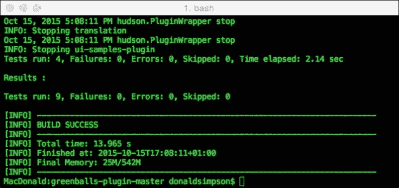

请注意，可以通过指定测试的名称来运行单个测试，如下所示：

```
**mvn test -Dtest=GreenBallIntegrationTest**

```

这将导致运行一个测试，或者您可以使用通配符，如下所示：

```
**mvn test -Dtest=*ilter***

```

前面的代码导致在这种情况下运行四个测试。

这种方法可以用来将您的测试分类为逻辑套件—集成测试、夜间测试、回归测试或单元测试—无论您喜欢什么，只需将一致的命名约定应用于您的测试类，然后设置 Jenkins 作业，或运行 Maven 目标，执行相应的操作，例如：

```
**mvn test –Dtest=*Integration***

```

`Green Balls`插件包含两个测试类：`GreenBallFilterTest`和`GreenBallIntegrationTest`，它们展示了插件测试的两种不同方法—浏览它们的源代码应该有助于了解如何开发自己的测试。

`GreenBallFilterTest` 执行一些简单的模式匹配测试，以确保正确的图像已经就位：

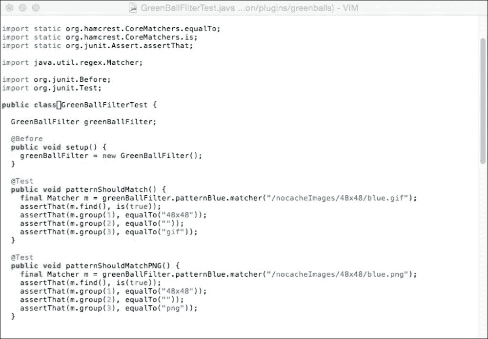

`GreenBallIntegrationTest`，如下截图所示，扩展了`HudsonTestCase`并使用`com.gargoylesoftware.htmlunit.WebResponse`来直接测试和与部署的 Web 组件进行交互，断言它们返回预期的结果：

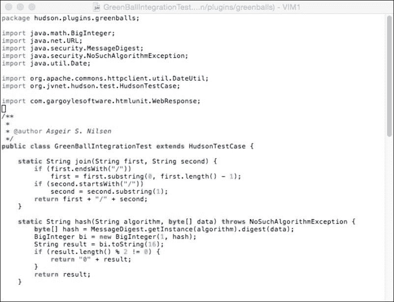

这个 Jenkins 页面提供了有用的资源，供进一步阅读，以满足更详细和复杂的测试场景：

[`wiki.jenkins-ci.org/display/JENKINS/Unit+Test`](https://wiki.jenkins-ci.org/display/JENKINS/Unit+Test)

此链接涵盖了模拟、HTML 抓取、提交表单、JavaScript 和网页断言等主题。

# 调试 Jenkins

本章的其余部分侧重于以多种不同的方式进行调试，以帮助进一步了解应用程序及其运行时行为。

主要关注于使用本地的 Jenkins 实例和 IDE 来调试开发会话；然而，了解 Jenkins 内置日志选项的可用选项仍然很有用，这些选项是复杂且高度可定制的。这些通常是解决任何问题的良好起点，因此我们将在继续开发自己的代码时，首先快速概述这些选项，然后再转向您可能想要设置和使用的调试类型。

## 服务器调试 – 快速回顾

Jenkins 使用`java.util.logging`包进行日志记录；有关详细信息，请参阅此处：

[`docs.oracle.com/javase/7/docs/api/java/util/logging/package-summary.html`](https://docs.oracle.com/javase/7/docs/api/java/util/logging/package-summary.html)

有关 Jenkins 日志记录的文档在此处可用：

[`wiki.jenkins-ci.org/display/JENKINS/Logging`](https://wiki.jenkins-ci.org/display/JENKINS/Logging)

本页面解释了如何设置自定义日志记录器—这对于分离和过滤所有日志输出以帮助查找感兴趣的内容非常有用，因为*所有*通常都被传送到默认日志中，这可能使分析变得困难。

可以使用用户界面在**管理 Jenkins** | **系统日志** | **所有 Jenkins 日志**中检查 Jenkins 系统日志，并且页面底部还有 RSS 订阅的链接可用：

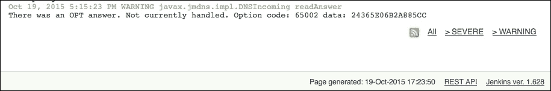

这些可以帮助识别和过滤系统中的不同类型的事件。

对于从节点的问题，可以在以下位置找到日志文件：`~/.jenkins/logs/slaves/{slavename}`。

对于作业问题，历史日志文件保存在`~/.jenkins/jobs/{jobname}/builds/{jobnumber}`。

您还可以通过在启动过程中添加额外的`-D`参数来以特定的日志记录级别启动 Jenkins：

```
-Djava.util.logging.loglevel={level}
```

在这里，`level`是以下之一：

+   `SEVERE（最高值）`

+   `WARNING`

+   `INFO`

+   `CONFIG`

+   `FINE`

+   `FINER`

+   `FINEST（最低值）`

`Off`和`All`级别也可用—请参阅此页面以获取更多详细信息和选项：

[`docs.oracle.com/javase/7/docs/api/java/util/logging/Level.html`](http://docs.oracle.com/javase/7/docs/api/java/util/logging/Level.html)

## 使用 IntelliJ 进行调试

要从 IntelliJ 中进行调试，请将 IntelliJ 指向项目的`pom.xml`文件，然后从运行菜单中选择选项来创建新的运行/调试配置。这应该会带您到一个类似于这样的屏幕：

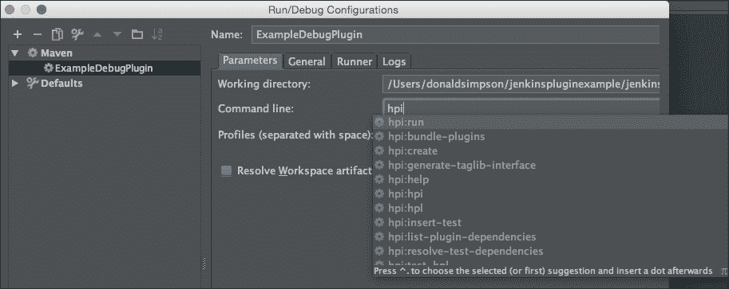

IntelliJ 已经解析了 POM 文件，并且知道它包含的可用目标。一旦您开始输入，例如`hpi`，您将看到一个下拉列表，其中包含所有匹配的选项供您选择。

从下拉菜单中选择并运行所需的目标（在这种情况下再次是**hpi:run**），然后单击**Debug**。

您应该在控制台中看到熟悉的 Jenkins 启动过程，然后能够连接到本地调试会话：

`http://localhost:8080/jenkins`

在与之前更改“Hello World”文本的相同位置的代码中添加一个调试点（双击左边缘上写着**hello world…**的行，然后运行 Jenkins 作业）。这应该运行到您设置的断点并产生这个：

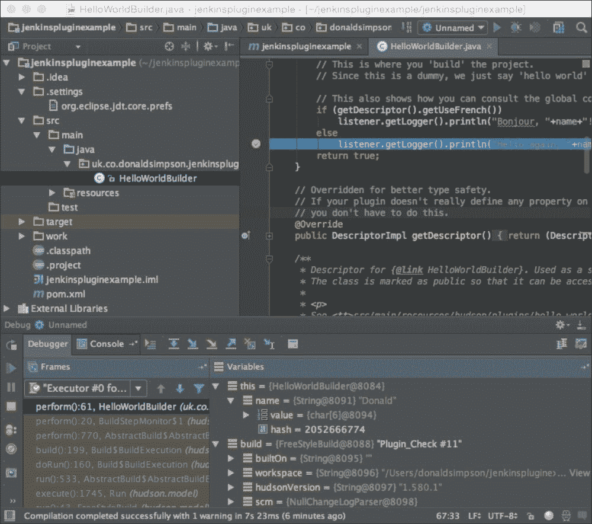

然后，您可以使用调试箭头和按钮来驱动调试过程：

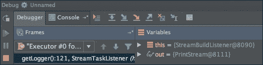

这些允许您进入、跳过或退出当前的调试点，并且您应该能够检查列出的变量，以反映正在调试的应用程序的实时状态。

有关使用 IntelliJ 进行调试的更多信息，请参阅此链接：

[`www.jetbrains.com/idea/help/stepping-through-the-program.html`](https://www.jetbrains.com/idea/help/stepping-through-the-program.html)

## 使用 Eclipse 进行调试

使用 Eclipse 进行调试与之前描述的 IntelliJ 非常相似。

要设置断点，请在代码窗口的左侧边缘双击，就像这样：

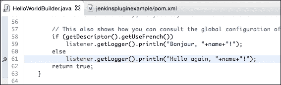

接下来，在 Eclipse 项目中右键单击 POM 文件，然后选择**Debug as…**，将出现以下窗口：

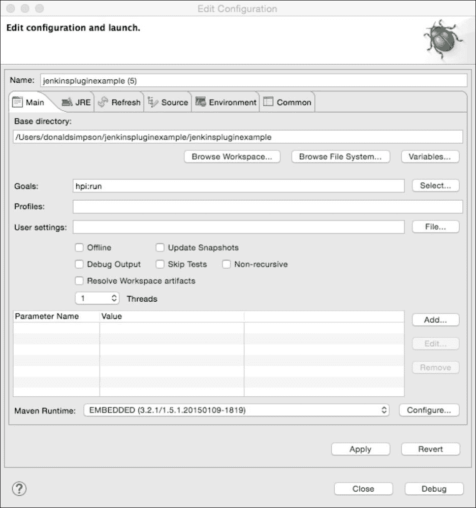

指定`hpi:run`目标，然后单击**Debug**；Jenkins 应该像往常一样在 Eclipse 控制台窗口中启动。

与以前一样，将浏览器指向`http://localhost:8080/jenkins`，然后创建或运行一个触发您之前设置的断点的作业 - 当达到这个代码/点时，Jenkins 将冻结，焦点将切换到 Eclipse，在那里您可以检查当前变量和属性的状态，并浏览各种调试步骤，进一步深入问题或跳过区域以查看发生了什么变化。

## mvnDebug

`mvnDebug`工具提供了一个可能会对您感兴趣的替代方法。要使用此功能，请在命令行中运行`mvnDebug hpi:run`。

这应该启动 Maven 调试模式，并在本地主机的端口`8000`上启动监听器，就像这样：

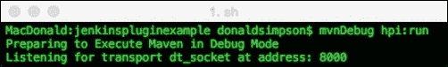

现在切换到您的 IDE，并连接到这个端口的调试会话。例如，在 Eclipse 中，选择**Run** | **Debug Configurations…**

这应该产生以下窗口，您可以从中选择**Remote Java Application**。检查主机和端口是否匹配：

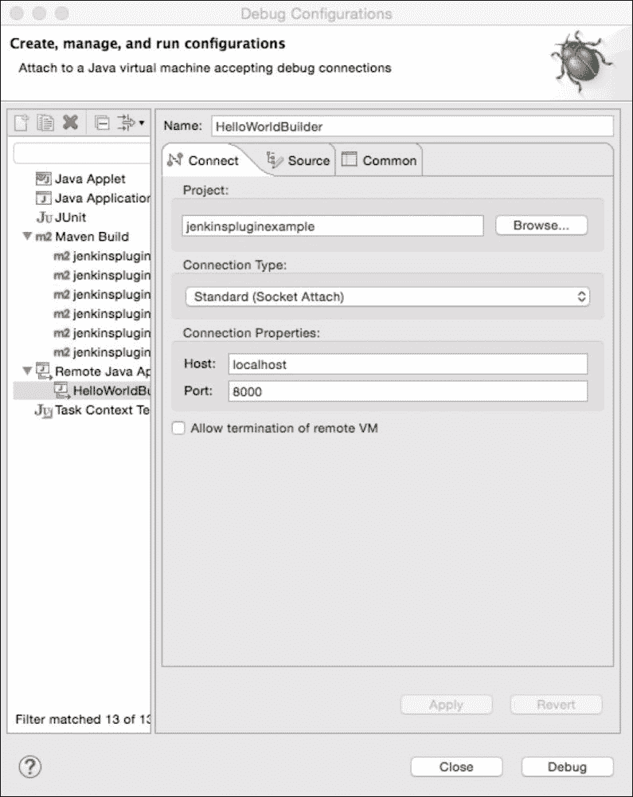

接下来，选择**Debug**连接到您在控制台中启动的`mvnDebug`会话。此时，`hpi:run`目标将在（控制台中）启动，并在 Maven 中以调试模式运行 Jenkins，同时连接到您选择的调试器，例如 Eclipse。

如果您检查`mvnDebug`可执行文件，您会发现它只是在运行普通的`mvn`二进制文件之前设置`MAVEN_DEBUG_OPTS`，如下所示：

```
MAVEN_DEBUG_OPTS="-Xdebug -Xrunjdwp:transport=dt_socket,server=y,suspend=y,address=8000"
echo Preparing to Execute Maven in Debug Mode
env MAVEN_OPTS="$MAVEN_OPTS $MAVEN_DEBUG_OPTS" $(dirname $0)/mvn "$@"
```

这表明，如果您愿意，可以很容易地指定不同的端口，或者您可以调整此脚本以添加您可能想要包含的任何其他参数或设置。

# Jenkins Logger 控制台

本章的最后一个主题是内置在 Jenkins 调试版本中的**Logger Console**。

当您通过 Maven 启动 Jenkins 的本地开发实例（无论是通过命令行还是 IDE），您会注意到屏幕左侧包含的额外**Logger Console**框：

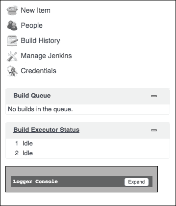

展开此框将显示一个**实时**日志输出窗口，您可以实时自定义以调整和过滤您想要看到或隐藏的日志项目的类型和严重程度。

保持选择**info**会提供非常冗长的输出级别，其中包括有关鼠标悬停事件和其他 UI 交互的信息。在调试 UI 问题时，这些信息可能非常有用。

取消**info**框的勾选只留下**warn**和**error**消息。日志输出可以通过暂停和可选清除输出以及调整过滤器来满足您的需求。以下截图显示了**Logger Console**：

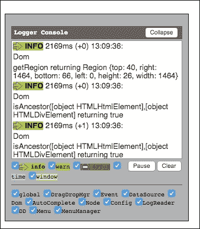

# 总结

正如您所看到的，Jenkins 内部有大量的选项和方法可供测试和调试。本章介绍了一些您可能会发现对自己的开发流程有用的主要工具和方法。

了解如何测试和调试您的代码，并设置一个适合您需求和偏好的高效开发环境，应该会提高您自己开发的质量。当您考虑分发自己的插件并考虑替代开发选项时，这也应该会让事情变得更容易。我们将在下一章中看一些替代技术和语言。
