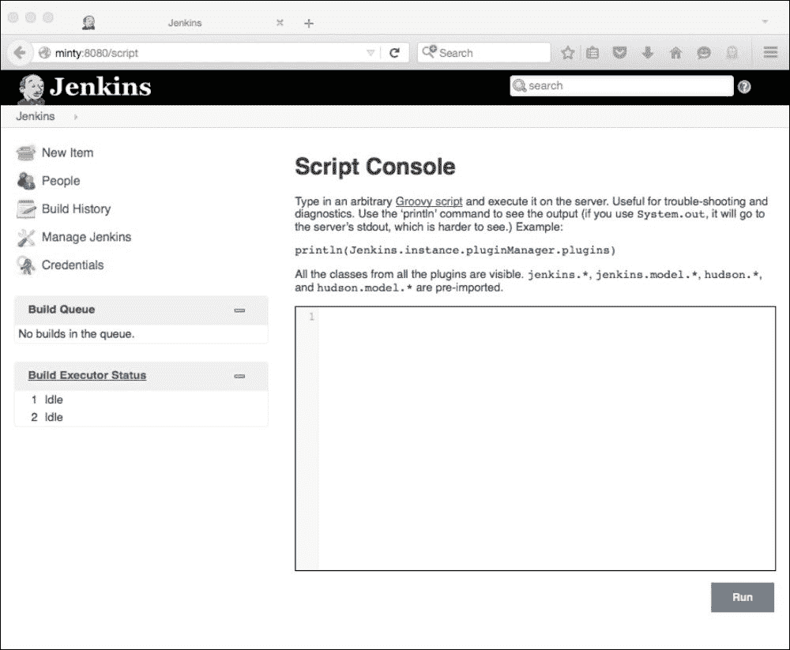
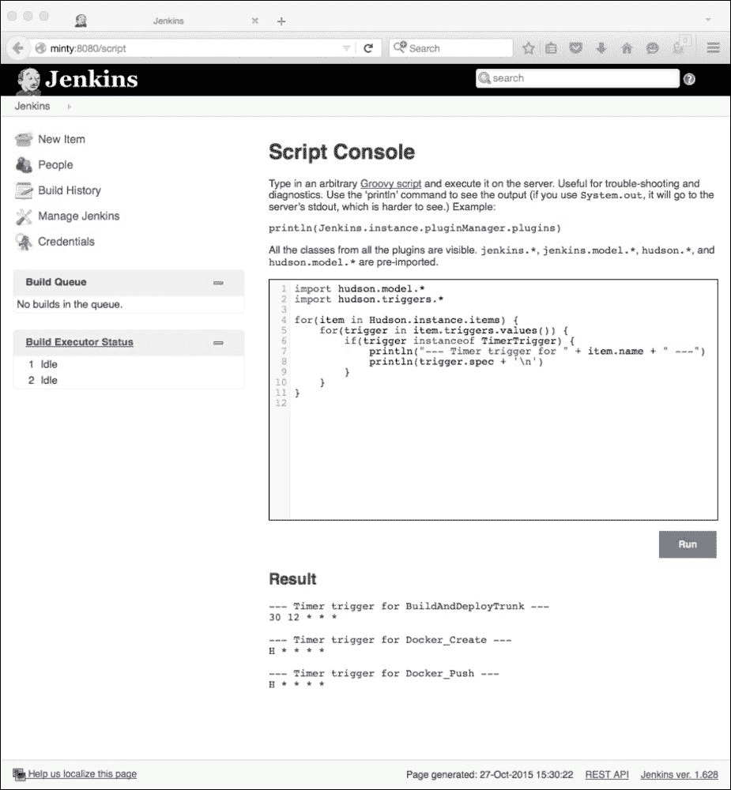
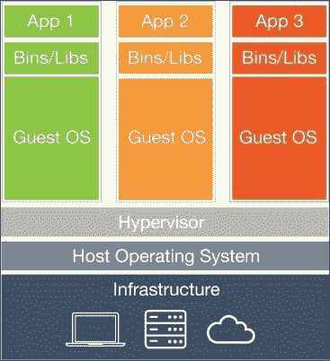
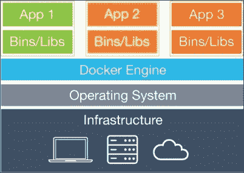
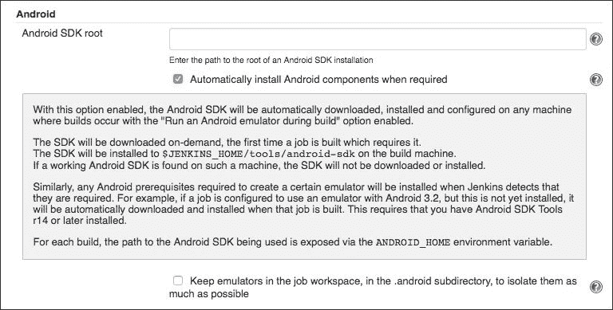
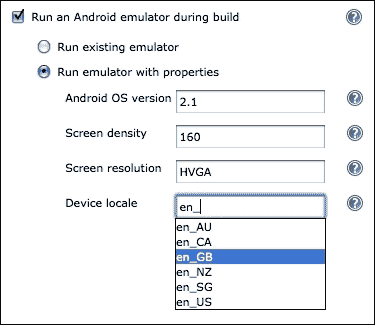
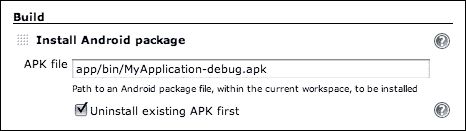

# 第九章：把事情放在一起

在本章中，我们将看一下 Jenkins 如何通过与其他语言、工具和软件结合来进行扩展。

在这样做的过程中，我们将看一下以下主题：

+   使用 Jenkins 脚本控制台

+   使用 Groovy、Grails 和 Gradle 进行开发

+   Jenkins 和 Docker——Jenkins 在 Docker 中，Docker 在 Jenkins 中

+   使用 Jenkins 构建 Android 应用程序

+   使用 Jenkins 构建 iOS 应用程序

详细介绍所有这些主题超出了本书的范围，但我们将介绍这些主题，解释基本设置，并提供进一步信息的链接。这应该提供足够的概述，并使你能够开始使用 Jenkins 与这些技术。此外，它可能提供一些扩展你的 Jenkins 设置以整合其他工具和技术的想法。

# Jenkins 脚本控制台和 Groovy

内置的脚本控制台是一个非常有用和强大的 Jenkins 扩展，并且非常适合某些类型的任务。这个简单但功能强大的内置 Web 控制台允许你在用户界面中直接运行 Jenkins 实例（或其从节点）上的 Groovy 脚本，并且是标准安装。

要访问控制台，可以导航到**管理 Jenkins**，然后选择**脚本控制台**，或者简单地将`/script`附加到你的 Jenkins 主机和端口，例如：

`http://jenkinshost:8080/script`

然后你会看到一个类似下面的页面。这个页面包含一些介绍信息和一个链接到网站[`www.groovy-lang.org/`](http://www.groovy-lang.org/)，以获取有关 Groovy 的更多详细信息，这是脚本控制台使用的语言。



这个提供的链接来自 Jenkins 主页：

[`wiki.jenkins-ci.org/display/JENKINS/Jenkins+Script+Console`](https://wiki.jenkins-ci.org/display/JENKINS/Jenkins+Script+Console)

它提供了一系列有用的示例脚本，以向你展示这是如何工作的，以便让你开始。

这些示例脚本涵盖了各种功能，并且大多集中在一般的 Jenkins 管理和日常任务上——这些任务非常适合这个工具，因为它易于使用且灵活。使用这个界面，你可以快速、轻松地在网页中插入和编辑代码，点击按钮运行它，并立即看到结果。没有编译步骤或外部依赖需要担心。

例如，复制这个 Groovy 代码：

```
import hudson.model.*
import hudson.triggers.*
for(item in Hudson.instance.items) {
  for(trigger in item.triggers.values()) {
    if(trigger instanceof TimerTrigger) {
      println("--- Timer trigger for " + item.name + " ---")
      println(trigger.spec + '\n')
    }
  }
}
```

在控制台输入示例脚本[`wiki.jenkins-ci.org/display/JENKINS/Display+timer+triggers`](https://wiki.jenkins-ci.org/display/JENKINS/Display+timer+triggers)并点击**Run**将返回预期的结果——这个 Jenkins 实例上所有计划任务的细节（假设你已经设置了一些）：



正如你从这个非常简单的例子和 Groovy 网站上看到的，Groovy 语言面向 Java 开发人员，学习曲线非常平缓。它是一个非常强大的工具，非常适合某些任务。它经常用于开发和管理自己的插件超出了你真正想要或需要的情况。一个简单的 Groovy 脚本，可以随时运行和修改，通常是这些任务的更好选择。

你还可以创建执行系统 Groovy 脚本的作业。这些作业在 Jenkins JVM 内运行，因此可以访问 Jenkins 内部对象并与其交互。

这个例子详细介绍了设置一个 Groovy 作业来监视你的从节点的状态，更多细节请参考[`www.donaldsimpson.co.uk/2013/06/07/monitoring-jenkins-slave-nodes-with-groovy/`](http://www.donaldsimpson.co.uk/2013/06/07/monitoring-jenkins-slave-nodes-with-groovy/)。

这种方法的关键是以下简单的 Groovy 代码：

```
int exitcode = 0
for (slave in hudson.model.Hudson.instance.slaves) {
  if (slave.getComputer().isOffline().toString() == "true"){
    println('Slave ' + slave.name + " is offline!");
    exitcode++;
  }
}
if (exitcode > 0){
  println("We have a Slave down, failing the build!");
  return 1;
}
```

当添加到 Jenkins 作业并通过计划任务运行时，Groovy 代码应该在您现有的一个或多个从节点离线时以错误状态退出，输出应该是这样的：

```
Building on master in workspace /apps/jenkins/jobs/MonitorSlaves/workspace Slave <YOURSLAVENAME> is offline!
We have a Slave down, failing the build!
Script returned: 1
Build step 'Execute system Groovy script' marked build as failure Finished: FAILURE
```

这显然可以扩展到执行您想要的任何后续操作，例如，发送电子邮件警报，或执行其他功能（例如，尝试重新启动从节点或将替代从节点上线）。

此链接演示了一种自动重新启动离线从节点的方法——它也是用 Groovy 编写的：

[`wiki.jenkins-ci.org/display/JENKINS/Monitor+and+Restart+Offline+Slaves`](https://wiki.jenkins-ci.org/display/JENKINS/Monitor+and+Restart+Offline+Slaves)

Jenkins 对 Groovy 的内置支持允许您快速轻松地为自己的需求开发强大的自定义脚本。Jenkins 脚本控制台主页还详细介绍了如何远程运行 Groovy 脚本，并提供了一系列可用的 Jenkins 插件，这些插件使用和支持 Groovy 语言。这些可以设置为允许您在构建的一部分中运行 Groovy 脚本。

# Groovy 和 Gradle 作为替代方案

如果您对 Groovy 感兴趣，您也可以使用这种语言和其他工具的组合来创建自己的插件——如果您不想的话，您不必坚持使用 Java 和 Maven。

本页解释了如何修改您的项目以使用`build.gradle`文件来替代我们之前使用的 Maven POM 文件：

[`jenkins-ci.org/content/gradle-fy-your-jenkins-plugin-project`](http://jenkins-ci.org/content/gradle-fy-your-jenkins-plugin-project)

然后，您可以执行诸如`gradle jpi`、`gradle check`、`gradle install`等命令来构建和管理插件生命周期，而无需使用 Maven。

这个 CloudBees 演示说明了使用 Groovy 而不是 Java 来编写插件本身：

[`www.cloudbees.com/event/topic/groovy-way-write-jenkins-plugin`](https://www.cloudbees.com/event/topic/groovy-way-write-jenkins-plugin)

这是一种越来越受欢迎的方法，因为 Groovy 的强大和简单。它还解释了如何用 Groovy 替换 Jelly——在整个开发过程中使用相同的语言（Gradle 基于 Groovy，所以...都是 Groovy！）是非常有意义的。

# Jenkins 和 Docker

Docker 是一种应用程序，它使您可以将应用程序及其所有依赖项打包成一个单一单元（Docker **容器**），可以进行版本控制并以一种简单和标准化的方式部署。

Docker 主页解释了 Docker 的工作原理以及如何安装和使用它：

[`www.docker.com/what-docker`](https://www.docker.com/what-docker)。

从概念上讲，Docker 容器类似于轻量级虚拟机，但它们具有一些基本的架构差异，使它们更轻量级和更高效，如下所示的 Docker 和虚拟机比较图所示。

以下图显示了一个正常的虚拟机：



以下图显示了一个 Docker 容器：



Docker 容器可以发布和管理，每次更改都会记录。它们就像高效的 VM 一样，受版本控制系统管理，提供类似 Git 的功能。它们还具有高度可配置性，并提供灵活和可扩展的部署过程。

除了审计和易用性之外，还有一个保证，即容器在任何能够运行 Docker 的环境中都将是（并且行为）完全相同的。

这可以消除许多通常与现代软件开发相关的环境差异，消除了旧的“嗯，它在我的机器上可以运行”的综合症，以及（假定相同的）环境之间的微妙差异，有时会导致严重且难以检测的问题。

与 Jenkins 一样，Docker 非常灵活、功能强大且高度可扩展。毫不奇怪，它们在一起工作得非常好。

有许多方法可以结合和利用 Docker 和 Jenkins 的功能。这些方法通常意味着使用**Jenkins 中的 Docker**或**Docker 中的 Jenkins**。

## Jenkins 中的 Docker

使用 Jenkins 的 Docker 插件（[`wiki.jenkins-ci.org/display/JENKINS/Docker+Plugin`](https://wiki.jenkins-ci.org/display/JENKINS/Docker+Plugin)），您可以设置 Jenkins 作业，每次都可以在一个新的已知良好的 Docker 容器中执行保证的*干净构建*。

这可以通过为作业动态供应一个新的从属节点来完成（从版本控制的**Docker** **Hub**中拉取）。

然后可以在这个环境中运行构建或测试，并记录和存档结果。整个环境随后可以被删除，并保证，如果您愿意的话，将来任何日期和任何环境中，与部署代码的相同版本的 Docker 容器组合将会重新创建完全相同的结果。

## Docker 中的 Jenkins

我们之前已经看过了几种不同的设置和管理 Jenkins 服务器的方法。我们还强调了将 Jenkins 配置存储在版本控制系统中的重要性，并确保您可以在不丢失数据的情况下解决问题。

将 Jenkins 扩展到利用 Docker 的能力可以让您快速、轻松地从已知良好的快照中创建（或重新创建）自己的 Jenkins 环境。只需在 Docker 管理的容器中设置和维护 Jenkins 服务器，您立即就能获得 Docker 提供的所有优势和功能。

这种方法的一个受欢迎的现成 Docker 容器在这里是 CloudBees 的一个：

[`github.com/jenkinsci/docker`](https://github.com/jenkinsci/docker)

一旦您在环境中安装并设置了 Docker，您只需要运行这个命令：

```
**docker run -p 8080:8080 -p 50000:50000 jenkins**

```

以下 GitHub 页面上的`Dockerfile`详细说明了如何构建此容器以及您可以使用和调整的许多替代方法和选项：

[`github.com/jenkinsci/docker/blob/master/Dockerfile`](https://github.com/jenkinsci/docker/blob/master/Dockerfile)

一旦您在 Docker 中运行 Jenkins，您可以进行任何您想要的更改，然后在 Docker Hub 上的您自己的帐户下发布您修改后的版本的快照，有效地对整个设置进行版本控制。如果您愿意，您甚至可以创建和维护您自己的 Docker Hub 本地版本（当然是在 Docker 上运行），并将您自己的图像发布/拉取到那里。

Docker 容器在容器本身死亡后不会保留其数据-您需要保存状态并发布它。尽管在 GitHub 页面上提到，您可以通过从本地文件系统（即运行 Docker 的主机上的指定文件夹）挂载数据卷来设置持久存储。这些文件夹的内容（可能包含配置信息、公钥或插件数据等）也可以从版本控制中拉取和管理。或者，您可以创建自己的专用卷容器，允许您在另一个 Docker 容器中管理所有持久数据。这也可以进行版本控制，并在需要时附加到您的 Jenkins 容器上。

您还可以设置 Jenkins 从属以在动态供应的 Docker 从属上运行。有许多 Jenkins 插件可以做到这一点，由于这是一种快速发展的技术，肯定会有更多的插件，例如这个插件：

[`wiki.jenkins-ci.org/display/JENKINS/Docker+Slaves+Plugin`](https://wiki.jenkins-ci.org/display/JENKINS/Docker+Slaves+Plugin)

这篇关于为动态供应创建 Jenkins 从属 Docker 镜像的详细帖子可以在以下链接找到：

[`developer.jboss.org/people/pgier/blog/2014/06/30/on-demand-jenkins-slaves-using-docker`](https://developer.jboss.org/people/pgier/blog/2014/06/30/on-demand-jenkins-slaves-using-docker)

这些只是目前最常见的几种结合 Jenkins 和 Docker 的方式；还有许多其他可能性，而且很快可能会有更多可能性。例如，您可以在 Docker 容器中运行主要的 Jenkins 实例，并让它运行创建其他 Docker 容器来运行您的测试和构建的 Jenkins 作业，然后这些 Docker 容器可以使用 Docker 容器！

甚至还有一个**Docker in Docker**项目，允许您从 Docker 容器内部创建和管理 Docker 容器...许多有趣的可能性！

# Jenkins 和 Android

Jenkins 可以借助 SDK 和一些插件来自动构建、部署、测试和发布 Android 应用程序。要构建 Android 应用程序，您需要 Android 软件开发工具包，可以从以下网址下载：

[`developer.android.com/sdk/index.html`](http://developer.android.com/sdk/index.html)

下载后，将存档解压到本地目录。然后编辑并添加以下环境变量到您的系统：

```
export ANDROID_HOME="<location of extracted files>" export PATH="$ANDROID_HOME/tools:$ANDROID_HOME/platform-tools:$PATH"
```

完成后，更新 SDK 并验证您的 Jenkins 用户对 SDK 可执行文件具有读取和执行权限。

要在构建过程中运行 Android 模拟器，请将此插件添加到您的 Jenkins 服务器：

[`wiki.jenkins-ci.org/display/JENKINS/Android+Emulator+Plugin`](https://wiki.jenkins-ci.org/display/JENKINS/Android+Emulator+Plugin)

请注意，如果找不到 Android SDK，这将尝试为您安装 Android SDK。尽管如此，最好根据您的要求提前设置 SDK。您可以通过**在需要时自动安装 Android 组件**选项在**管理 Jenkins**设置页面上禁用自动安装尝试，并在此处指定应使用哪个 SDK：



如 Android 模拟器插件说明中所述，您应该能够创建一个新的 Jenkins 作业，在构建过程中运行 Android 模拟器，并使用您想要使用的任何硬件和软件规格。您可以指定内存、屏幕大小和分辨率、操作系统版本等，如下所示：



(来源：https://wiki.jenkins-ci.org/download/attachments/43712988/android_job-custom.png?version=1&modificationDate=1270447137000)

您的 Jenkins 作业随后可以继续使用 Android `adb`命令行工具安装您最近编译的应用程序，例如：

```
**adb install my-app.apk**

```

或者，您可以指定一个新的构建步骤，将为您重新安装 APK，如下图所示：



(图片来自 https://wiki.jenkins-ci.org/download/attachments/43712988/android_install-package.png?version=1&modificationDate=1299432099000)

应用部署后，您可以包括一个额外的测试步骤来运行 Android Monkey Tester 工具。这将针对 Android 模拟器上运行的最新 APK 运行您的测试，该模拟器将模拟您选择的任何硬件和软件规格。通常有用的是设置多个作业，以确保您的测试覆盖用户可能拥有的所有硬件和软件组合和排列。

还有一个 Jenkins 插件，可以使您自动将构建的应用程序发布和推出到 Google Play 商店：

[`wiki.jenkins-ci.org/display/JENKINS/Google+Play+Android+Publisher+Plugin`](https://wiki.jenkins-ci.org/display/JENKINS/Google+Play+Android+Publisher+Plugin)

有关在 Jenkins 中构建、部署和测试 Android 应用程序的更多详细信息，请从这个链接开始：

[`wiki.jenkins-ci.org/display/JENKINS/Building+an+Android+app+and+test+project`](https://wiki.jenkins-ci.org/display/JENKINS/Building+an+Android+app+and+test+project)

# Jenkins 和 iOS

您的 Jenkins 设置和范围也可以类似地扩展到构建 iOS 项目，方法与前面的 Android 步骤非常相似。总体思路是一样的；安装和配置 SDK（iOS 的 XCode），添加所需的 Jenkins 插件，构建并部署应用程序到模拟器上，对其运行测试，并记录结果。

然而，iOS 构建的一个重要区别是您需要在 OS X 主机上运行它。不过，这个主机可以设置为 Jenkins 的从节点，您的基于 iOS 的 Jenkins 作业只能在该节点上运行。

主机需要本地安装 XCode，可以在这里获取：

[`developer.apple.com/xcode/download/`](https://developer.apple.com/xcode/download/)

或者可以在 Apple App Store 中获取。

这个 Jenkins 页面详细介绍了安装和设置过程：

[`wiki.jenkins-ci.org/display/JENKINS/Xcode+Plugin`](https://wiki.jenkins-ci.org/display/JENKINS/Xcode+Plugin)

以下是一些有关 iOS 和 Jenkins 的进一步信息的附加链接：

+   [`savvyapps.com/blog/continuous-integration-ios-jenkins`](http://savvyapps.com/blog/continuous-integration-ios-jenkins)

+   [`www.built.io/blog/2014/10/how-to-set-up-customized-jenkins-for-ios/`](https://www.built.io/blog/2014/10/how-to-set-up-customized-jenkins-for-ios/)

+   [`blog.pivotal.io/labs/labs/ios-ci-jenkins`](http://blog.pivotal.io/labs/labs/ios-ci-jenkins)

+   [`youandthegang.com/2015/continuous-integration-delivery-with-jenkins/`](http://youandthegang.com/2015/continuous-integration-delivery-with-jenkins/)

# 保持您的 Jenkins 版本和插件更新

与所有现代软件一样，保持您的 Jenkins 版本和插件更新是很重要的。

您可以通过此处的 RSS 订阅插件发布通知：[`feeds.feedburner.com/JenkinsPluginReleases`](http://feeds.feedburner.com/JenkinsPluginReleases)

或者，您可以在这里订阅：[`jenkins-ci.org/releases.rss`](https://jenkins-ci.org/releases.rss)

您可以在 Twitter 上关注 Jenkins 发布通知，链接在这里：[`twitter.com/jenkins_release`](https://twitter.com/jenkins_release)

# 总结

从本章的简要介绍和示例中，我们已经看到了 Jenkins 如何轻松扩展和适应其他语言和技术，利用它们提供的优势，并允许您设置按您希望和需要的方式工作的流程。将 Jenkins 与其他工具结合使用，可以为各种项目和目的创建强大而灵活的构建流程。

Jenkins 与这些技术（以及许多其他技术）很好地集成在一起，这在很大程度上归功于其固有的灵活性和可扩展性，其丰富的插件，以及充满活力的开发、支持和用户社区。

在本书中，我们探讨了许多不同的方式，Jenkins 可以被调整和扩展以执行您想要的任何功能，从利用 API，通过 IDE 进行交互，调整用户界面到开发自己的插件，创建和使用扩展点，以及拥抱和利用新兴技术。

希望这些主题和技能能够鼓励和赋予您发现利用 Jenkins 为您自己的项目提供动力和有趣方式的能力。
