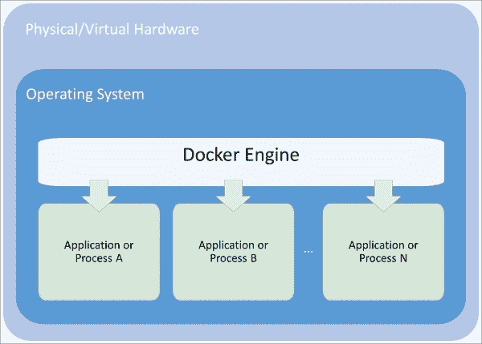
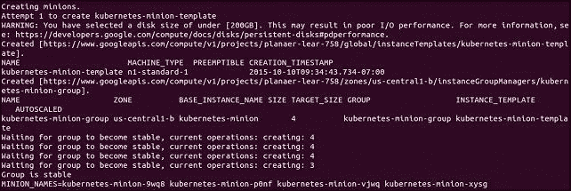
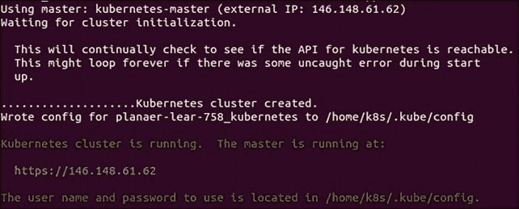
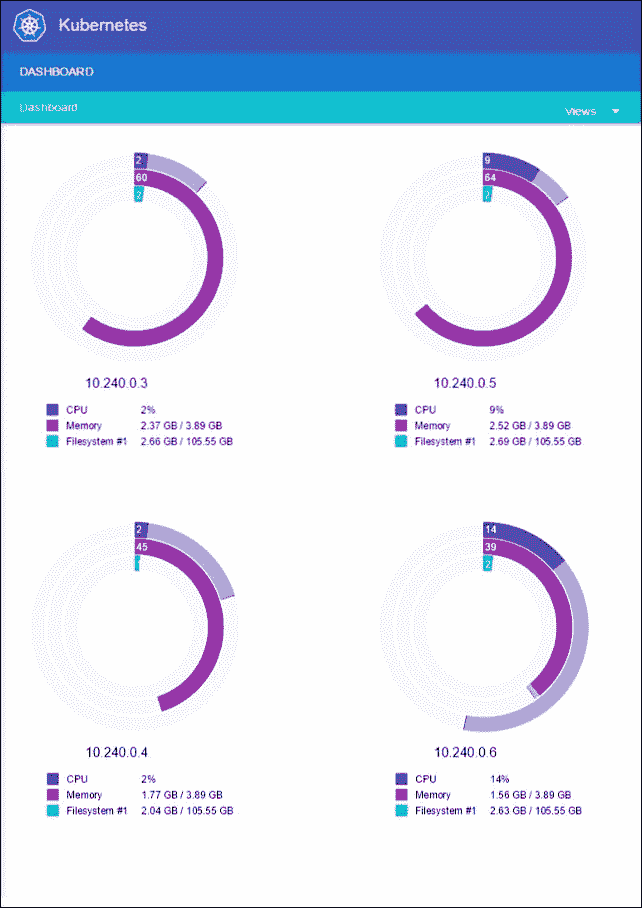
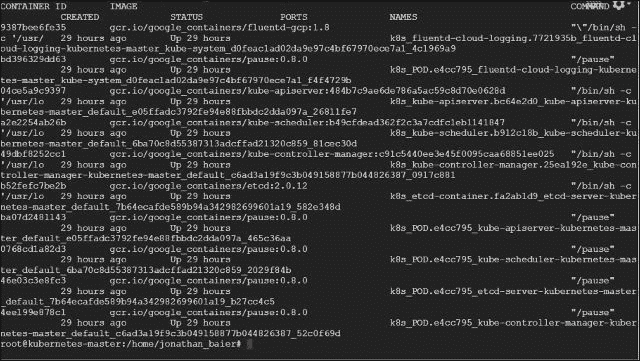
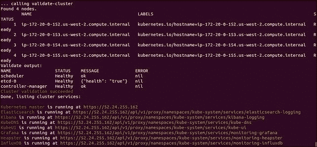
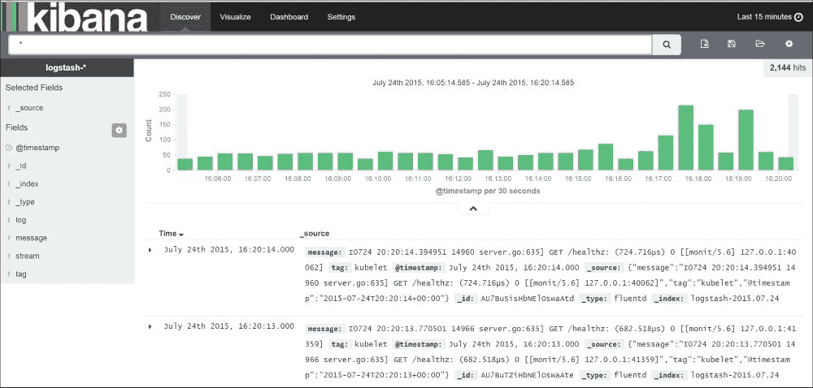

# 一、Kubernetes 和容器操作

本章将简要概述容器及其工作方式，以及为什么管理和编排对您的业务和/或项目团队很重要。本章还将简要概述 **Kubernetes** 编排如何增强我们的容器管理策略，以及我们如何让一个基本的 Kubernetes 集群启动、运行并为容器部署做好准备。

本章将包括以下主题:

*   介绍容器操作和管理
*   为什么容器管理很重要
*   Kubernetes 的优势
*   下载最新的 Kubernetes
*   安装和启动新的 Kubernetes 集群

# 容器的简要概述

在过去的两年里，**容器** 的受欢迎程度像野火一样增长。你将很难参加一个信息技术会议而不在 Docker 或容器上找到流行的会议。

Docker 是容器领域大规模采用和令人兴奋的核心。随着马尔康·马克林在 1957 年通过创建一个标准化的海运容器而彻底改变了物理海运世界，该容器如今被用于从冰块托盘到汽车的一切事物 <sup class="calibre14">1</sup> ，Linux 容器正在通过使应用环境可移植并在整个基础设施领域保持一致而彻底改变软件开发世界。作为一个组织，Docker 将现有的容器技术提升到了一个新的水平，使其易于跨环境和提供商实施和复制。

## 什么是容器？

容器技术的核心是 cGroups 和名称空间。此外，Docker 使用联合文件系统来增加容器开发过程的好处。

**控制组** ( **组** ) 通过允许主机共享来工作，并且还限制每个进程或容器可以消耗的资源。这对资源利用率和安全性都很重要，因为它可以防止对主机硬件资源的 **拒绝服务攻击**。几个容器可以共享 CPU 和内存，同时保持在预定义的限制内。

**名称空间**提供了另一种形式的进程隔离。进程被限制为只能看到同一命名空间中的进程标识。来自其他系统进程的名称空间将无法从容器进程中访问。例如，网络名称空间将隔离对网络接口和配置的访问，这允许分离网络接口、路由和防火墙规则。



图 1.1。容器的组成

**联合文件系统**也是使用 Docker 容器的关键优势。理解联合文件系统最简单的方法是把它们想象成一个蛋糕层，每一层都独立烘烤。Linux 内核是我们的基础层；然后，我们可能会添加一个类似 **红帽 Linux** 或 **Ubuntu** 的操作系统。接下来，我们可能会添加一个类似**【Nginx】**或 **Apache** 的应用。每次更改都会创建一个新层。最后，当您进行更改并添加新层时，您将始终拥有一个可写的顶层(想想磨砂层)。


图 1.2。分层文件系统

真正高效的是 Docker 在我们第一次构建层时就缓存了它们。那么，假设我们用 Ubuntu 创建了一个映像，然后添加 Apache 并构建该映像。接下来，我们以 Ubuntu 为基础构建 MySQL。第二次构建会快得多，因为 Ubuntu 层已经被缓存了。从本质上来说，我们的巧克力和香草层，从图 1.2，已经烤好了。我们只需要烘烤开心果(MySQL)层，组装，并添加糖衣(可写层)。

# 为什么容器这么酷？

容器本身并不是一项新技术，事实上已经存在很多年了。真正让 Docker 与众不同的是他们给社区带来的工具和易用性。

## 持续集成/持续部署的优势

维基百科将 **持续集成**定义为“在软件工程中，每天数次将所有开发人员工作副本合并到共享主线的实践。”通过构建和部署代码的连续过程，组织能够将质量控制和测试作为日常工作周期的一部分。结果是更新和错误修复发生得更快，整体质量得到提高。

然而，在设置开发环境以匹配测试和生产环境方面一直存在挑战。通常，这些环境中的不一致性使得很难获得连续交付的全部优势。

使用 Docker，开发人员现在能够进行真正可移植的部署。部署在开发人员笔记本电脑上的容器很容易部署在内部的临时服务器上。然后，它们可以轻松地传输到运行在云中的生产服务器。这是因为 Docker 使用指定父层的构建文件构建容器。这样做的一个优点是，确保操作系统、软件包和应用版本在开发、试运行和生产环境中保持一致变得非常容易。

因为所有的依赖项都打包到层中，所以同一个主机服务器可以有多个运行各种操作系统或包版本的容器。此外，我们可以在同一个主机服务器上拥有各种语言和框架，而不会像在具有单个操作系统的 **虚拟机** ( **虚拟机**)中那样出现典型的依赖冲突。

## 资源利用

定义明确的隔离和层文件系统也使容器非常适合运行占用空间非常小的系统和特定于域的目的。简化的部署和发布流程意味着我们可以快速、频繁地进行部署。因此，在某些情况下，许多公司已经将其部署时间从几周或几个月缩短到几天或几小时。这种开发生命周期非常适合小的、有目标的团队，他们在一个大应用的小块上工作。

# 微服务和流程编排

当我们将应用分解成非常具体的域时，我们需要一种统一的方式在所有不同的部分和域之间进行通信。Web 服务多年来一直服务于这一目的，但是容器带来的额外的隔离和粒度关注为被命名为**微服务**铺平了道路。

微服务的定义可能有点模糊，但是一个来自马丁·福勒的定义，一位受人尊敬的软件开发作者和演讲者，说道 <sup class="calibre14">2</sup> :

> *“简而言之，微服务架构风格是一种将单个应用开发为一套小型服务的方法，每个服务都在自己的进程中运行，并与轻量级机制(通常是 HTTP 资源 API)进行通信。这些服务是围绕业务能力构建的，可以通过全自动部署机制独立部署。这些服务可以用不同的编程语言编写，并使用不同的数据存储技术，因此只有最低限度的集中管理。”*

随着组织向容器化和微服务转变，他们将很快需要一种策略来维护许多容器和微服务。一些组织在未来几年将有数百甚至数千个容器在运行。

## 未来的挑战

生命周期流程本身就是运营和管理的一个重要部分。当容器出现故障时，我们将如何自动恢复？哪些上游服务受到此类中断的影响？我们如何在最短的停机时间内修补我们的应用？随着流量的增长，我们将如何扩大容器和服务的规模？

联网和处理也是重要的关注点。某些进程是同一服务的一部分，可能会受益于网络上的邻近性。例如，数据库可能会将大量数据发送到特定的微服务进行处理。在我们的集群中，我们如何将容器*放置在彼此靠近的*位置？是否有需要访问的公共数据？新服务将如何被发现并提供给其他系统？

资源利用率也是一个关键。容器占地面积小意味着我们可以优化基础设施以提高利用率。将弹性云世界中开始的节约进一步扩展到最大限度地减少硬件浪费。我们将如何最高效地安排工作负载？我们将如何确保我们的重要应用始终拥有资源？我们如何在备用容量上运行不太重要的工作负载？

最后，可移植性是许多组织转向容器化的关键因素。Docker 使跨各种操作系统、云提供商、内部硬件甚至开发人员笔记本电脑部署标准容器变得非常容易。然而，我们仍然需要工具来移动容器。我们将如何在集群的不同节点之间移动容器？我们将如何在最小中断的情况下推出更新？我们使用什么流程来执行蓝绿色部署或加那利发布？

无论您是开始构建单个微服务并将关注点分离到独立的容器中，还是仅仅希望在应用开发中充分利用可移植性和不变性，管理和编排的需求都变得显而易见。

# 库伯内斯的优势

这就是编排工具如 Kubernetes 提供最大价值的地方。 **Kubernetes** ( **K8s** )是谷歌在 2014 年 6 月发布的开源项目。谷歌发布该项目是为了与整个社区分享他们自己的基础设施和技术优势。

谷歌每周在其基础设施中推出 20 亿个容器，并且已经使用容器技术超过十年。最初，他们正在构建一个名为 **【博格】**的系统，现在 **欧米茄**的系统，以在其不断扩大的数据中心覆盖范围内安排大量工作负载。他们吸取了多年来的许多经验教训，重新编写了现有的数据中心管理工具，供世界其他地方广泛采用。结果是 Kubernetes 开源项目 <sup class="calibre14">3</sup> 。

自 2014 年首次发布以来，K8s 经历了快速发展，在整个开源社区都做出了贡献，包括红帽、VMware 和 Canonical。Kubernetes 的 1.0 版本于 2015 年 7 月上线。我们将在整本书中介绍 1.0 版本。K8s 为组织提供了一个工具来处理一些主要的运营和管理问题。我们将探讨 Kubernetes 如何帮助处理资源利用率、高可用性、更新、修补、联网、服务发现、监控和日志记录。

# 我们的第一个集群

各种平台和操作系统都支持 Kubernetes。对于本书中的例子，我使用了一个 Ubuntu 14.04 Linux VirtualBox 作为我的客户端，使用了一个带有 Debian 的 **谷歌计算引擎** ( **GCE** )作为集群本身。我们还将简要看一下一个运行在带有 Ubuntu 的 **亚马逊网络服务** ( **AWS** )上的集群。

### 类型

本书中的大多数概念和示例应该适用于任何 Kubernetes 集群的安装。要获得其他平台设置的更多信息，请查看以下 GitHub 链接上的 Kubernetes 入门页面:

[https://github . com/Google CloudPlatform/kubernetes/blob/v 1 . 0 . 0/docs/入门指南/README.md](https://github.com/GoogleCloudPlatform/kubernetes/blob/v1.0.0/docs/getting-started-guides/README.md)

首先，在安装 Kubernetes 之前，让我们确保我们的环境设置正确。

首先更新包:

```
$ sudo apt-get update

```

如果 Python 和 curl 不存在，请安装它们:

```
$ sudo apt-get install python
$ sudo apt-get install curl

```

安装 **gcloud** SDK:

```
$ curl https://sdk.cloud.google.com | bash

```

### 类型

在`gcloud`上路之前，我们需要开始一个新的外壳。

配置您的 **谷歌云平台** ( **GCP** )账号信息。这将自动打开一个浏览器，我们可以在其中登录我们的谷歌云帐户并授权软件开发工具包:

```
$ gcloud auth login

```

### 类型

如果登录有问题或想使用其他浏览器，可以选择使用`--no-launch-browser`命令。将网址复制并粘贴到您选择的机器和/或浏览器上。使用您的谷歌云凭据登录，并在权限页面上单击**允许**。最后，您应该会收到一个授权代码，您可以将其复制并粘贴回提示等待的 shell 中。

应该设置一个默认项目，但是我们可以用下面的内容来检查:

```
$ gcloud config list project

```

我们可以修改它，并用这个命令设置一个新的默认项目。确保使用*项目 ID* 而不是*项目名称*，如下:

```
$ gcloud config set project <PROJECT ID>

```

### 类型

我们可以在控制台中找到我们的项目标识:

[https://console.developers.google.com/project](https://console.developers.google.com/project)

或者，我们可以列出活动项目:

```
$ gcloud alpha projects list

```

现在我们已经设置好了环境，安装最新的 Kubernetes 版本只需一步，如下所示:

```
$ curl -sS https://get.k8s.io | bash

```

根据您的连接速度，下载 Kubernetes 可能需要一两分钟。之后，它会自动调用`kube-up.sh`脚本，开始构建我们的集群。默认情况下，它将使用谷歌云和 GCE。

### 类型

如果集群设置过程中出现故障，需要重新启动，可以简单运行`kube-up.sh`脚本。转到运行上一个`curl`命令的文件夹。然后，您可以使用以下命令开始集群构建:

```
$ kubernetes/cluster/kube-up.sh

```

下载 Kubernetes 并开始`kube-up.sh`脚本后，我们会看到相当多的台词滚过去。让我们一次看一个部分。


图 1.3。GCE 先决条件检查

### 类型

如果您的`gcloud`组件不是最新的，可能会提示您更新。

前面的部分(图 1.3)显示了先决条件的检查，并确保所有组件都是最新的。这是每个提供商特有的。对于 GCE，它将检查是否安装了 SDK，以及所有组件是否都是最新的。如果没有，此时您将看到安装或更新的提示。


图 1.4。上传集群包

现在脚本正在打开集群。同样，这是特定于提供商的。对于 GCE，它首先检查以确保 SDK 被配置为默认的**项目**和**区域**。如果设置好了，您会在输出中看到它们。

接下来，它将服务器二进制文件上传到谷歌云存储，如**创建 gs:\\...**线路。


图 1.5。主创作

然后，它检查集群中已经运行的任何部分。然后，我们最终开始创建集群。在图 1.5 的输出中，我们看到它为集群创建了**主**服务器、IP 地址和适当的防火墙配置。



图 1.6。迷你创造

最后，它为我们的集群创建**喽啰**或**节点**。这是我们的容器工作负载实际运行的地方。它将不断循环等待，而所有的爪牙开始。默认情况下，集群将有四个节点(从属节点)，但 K8s 支持超过 100 个(很快超过 1000 个)。我们将在本书的稍后部分回到缩放节点。



图 1.7。集群完成

现在一切都已创建，集群已初始化并启动。假设一切顺利，我们将为主机获得一个 IP 地址。另外，请注意，配置和集群管理凭据存储在`home/` **`<Username>`** `/.kube/config`中。


图 1.8。聚类验证

然后，脚本将验证集群。此时，我们不再运行特定于提供者的代码。验证脚本将通过`kubectl.sh`脚本查询集群。这是管理集群的核心脚本。在这种情况下，它会检查找到、注册并处于就绪状态的奴才数量。它循环给集群 10 分钟来完成初始化。

成功启动后，会在屏幕上打印奴才和集群组件运行状况的摘要:


图 1.9。集群摘要

最后，运行`kubectl cluster-info`命令，该命令输出主服务的网址以及域名系统、用户界面和监控。让我们来看看其中的一些组件。

## 立方 UI

打开浏览器，尝试以下代码:

`https://` **`<your master ip>`** `/api/v1/proxy/namespaces/kube-system/services/kube-ui`

默认情况下，证书是自签名的，因此在继续之前，您需要忽略浏览器中的警告。之后，我们会看到一个登录对话框。这是我们在 K8s 安装过程中使用所列凭据的地方。我们可以通过简单地使用`config`命令随时找到它们:

```
$ kubectl config view

```

现在我们已经有了登录凭据，使用这些凭据，我们应该会看到如下图所示的仪表板:



图 1.10。无缝用户界面控制板

主仪表板页面为我们提供了奴才(或从属节点)的摘要。我们还可以看到每个迷你电脑的中央处理器、内存和已用磁盘空间以及 IP 地址。

用户界面在屏幕右上角的**视图**下拉菜单下列出了数量的内置视图。但是，默认情况下，它们中的大多数都是空的。一旦工作负载和服务被拆分，这些视图将变得更加有趣。

## Grafana

默认安装的另一个服务是 **Grafana** 。这个工具将为我们提供一个仪表板来查看集群节点上的指标。我们可以在浏览器中使用以下语法访问它:

`https://` **`<your master ip>`** `/api/v1/proxy/namespaces/kube-system/services/monitoring-grafana`


图 1.11。库比涅斯·格拉凡尼亚仪表盘

在这里，Kubernetes 实际上正在运行许多服务。 **Heapster** 用于收集**吊舱**和**节点**上的资源使用情况，并将信息存储在 **InfluxDB** 中。结果，比如 CPU 和内存的使用，就是我们在 Grafana UI 中看到的。我们将在[第 6 章](6.html#1BRPS1-22fbdd9ef660435ca6bcc0309f05b1b7 "Chapter 6. Monitoring and Logging")、*监控和记录*中对此进行深入探讨。

## 霸气

**swaggle**([http://swagger.io/](http://swagger.io/))是一个工具，为一个 API 增加了更高级别的交互和轻松的发现。

Kubernetes 构建了一个启用 Swagger 的 API，可以使用`https://` **`<your master ip>`** `/swagger-ui/`进行访问。


图 1.12。库比涅斯·斯瓦格仪表盘

通过这个界面，你可以学到很多关于 Kubernetes RESTful API 的知识。大部分有趣的终点列在`v1`下面。如果我们看一下`/api/v1/nodes`，我们可以看到 JSON 响应的结构以及请求的可能参数的细节。在这种情况下，我们看到第一个参数是`pretty`，它切换 JSON 是否以漂亮的缩进返回，以便于阅读。

我们可以用`https://` **`<your master ip>`** `/api/v1/nodes/`来试试这个。

默认情况下，我们会看到启用了漂亮缩进的 JSON 响应。响应应该包含当前在我们集群中的所有节点的列表。

现在，让我们尝试调整您刚刚了解到的`pretty`请求参数。使用 `https://` **`<your master ip>`** `/api/v1/nodes/?pretty=false`。

现在我们有了相同的响应输出，但是没有缩进。这是探索应用编程接口和学习如何使用各种函数调用来获取更多信息并以编程方式与您的集群交互的绝佳资源。

## 命令行

`kubectl.sh`脚本有命令来探索我们的集群和其上运行的工作负载。我们将在整本书中使用这个命令，所以让我们花一秒钟来设置我们的环境。我们可以通过以下方式使脚本可执行并将其放在我们的`PATH`上:

```
$ cd /home/<Username>/kubernetes/cluster
$ chmod +x kubectl.sh
$ export PATH=$PATH:/home/<Username>/kubernetes/cluster
$ ln -s kubectl.sh kubectl

```

### 类型

您可以选择在个人文件夹外下载`kubernetes`文件夹，因此请根据需要修改前面的命令。

将`export`命令添加到主目录中的`.bashrc`文件的末尾，使更改永久化也是一个好主意。

现在我们已经有了`kubectl`在我们的道路上，我们可以开始与它合作。它有很多命令。由于我们还没有启动任何应用，这些命令中的大多数都不会很有趣。但是，我们可以立即使用两个命令进行探索。

首先，我们已经在初始化过程中看到了`cluster-info`命令，但是我们可以随时再次运行它，如下所示:

```
$ kubectl cluster-info

```

另一个有用的命令是`get`。`get`命令可用于查看当前运行的**服务**、**吊舱**、**复制控制器**等。以下是三个非常有用的例子:

*   列出我们集群中的节点:

    ```
    $ kubectl get nodes

    ```

*   列出集群事件:

    ```
    $ kubectl get events

    ```

*   最后，我们可以看到集群中运行的任何服务，如下所示:

    ```
    $ kubectl get services

    ```

首先，我们只会看到一个服务，名为`kubernetes`。该服务是核心 API 服务器，为 pods 和集群提供监控和日志服务。

## 在主机上运行的服务

让我们更深入地了解一下我们的新集群及其核心服务。默认情况下，机器以`kubernetes-`前缀命名。在集群启动之前，我们可以使用`$KUBE_GCE_INSTANCE_PREFIX`对此进行修改。对于我们刚刚开始的集群，主人应该命名为`kubernetes-master`。我们可以使用`gcloud`命令行实用程序将 SSH 引入机器。以下命令将启动与主节点的 SSH 会话。请确保替换您的项目标识和区域以匹配您的环境。另外，请注意，您可以使用以下语法从谷歌云控制台启动 SSH:

```
$ gcloud compute --project "<Your project ID>" ssh --zone "<your gce zone>" "kubernetes-master"

```

一旦我们登录，我们应该会得到一个标准的 shell 提示。让我们运行熟悉的`sudo docker ps`命令。



图 1.13。主容器列表

即使我们还没有在 Kubernetes 上部署任何应用，我们注意到有几个容器已经在运行。以下是每个容器的简要描述:

*   `fluentd-gcp`:这个容器收集集群日志文件并发送给谷歌云日志服务。
*   `kube-ui`:这是我们之前看到的 UI。
*   `kube-controller-manager`:控制器管理器控制多种集群功能。确保准确和最新的复制是其重要作用之一。此外，它还监视、管理和发现新节点。最后，它管理和更新服务端点。
*   `kube-apiserver`:这个容器运行 API 服务器。正如我们在 Swagger 界面中所探索的，这个 RESTful API 允许我们创建、查询、更新和移除 Kubernetes 集群的各种组件。
*   `kube-scheduler`:调度器获取未调度的 pods，并基于当前调度算法将其绑定到节点。
*   `etcd`:这运行由 CoreOS 构建的 **etcd** 软件。`etcd`是一个分布式且一致的键值存储。这是 K8s 的各个组件存储、更新和检索 Kubernetes 集群状态的地方。
*   `pause`:`Pause`容器通常被称为 pod 基础设施容器，用于设置和保存每个 pod 的网络命名空间和资源限制。

### 注

下一章中的图 2.1 还将展示这些服务是如何协同工作的。

要退出 SSH 会话，只需在提示符下键入`exit`。

## 在爪牙上运行的服务

我们可以 SSH 到其中一个奴才，但是由于 Kubernetes 在集群中调度工作负载，我们不会在一个奴才上看到所有的容器。但是，我们可以使用`kubectl`命令查看所有喽啰上运行的吊舱:

```
$ kubectl get pods

```

因为我们还没有在集群上启动任何应用，所以我们没有看到任何 pods。然而，实际上有几个运行 Kubernetes 基础设施的系统单元。我们可以通过指定`kube-system`名称空间来看到这些豆荚。我们将在后面探讨名称空间及其意义，但是现在，`--namespace=kube-system`命令可以用来查看这些 K8s 系统资源，如下所示:

```
$ kubectl get pods --namespace=kube-system

```

我们应该会看到类似以下内容的内容:

```
etcd-server
fluentd-cloud-logging
kube-apiserver
kube-controller-manager
kube-scheduler
kube-ui
kube-dns
monitoring-heapster
monitoring-influx-grafana

```

前六个应该很眼熟。这些是我们在主机上看到的附加服务。最后三个是我们还没有看到的服务。`kube-dns`提供 DNS 和服务发现管道。`monitoring-heapster`是用于监控整个集群的资源使用情况的系统。`monitoring-influx-grafana`提供我们之前看到的用于监控基础设施的数据库和用户界面。

如果我们对一个随机的迷你程序进行 SSH，我们会看到几个容器运行在其中的几个豆荚上。示例可能如下图所示:


图 1.14。迷你容器列表

同样，我们在主服务器上看到了类似的服务系列。我们在主界面上没有看到的服务包括以下内容:

*   `skydns`:这使用 DNS 提供一个分布式服务发现实用程序，与`etcd`配合使用。
*   `kube2Sky`:这是`skydns`和`kubernetes`之间的连接器。监控应用编程接口中的服务变化，并在`skydns`中进行适当更新。
*   `heapster`:这个做资源使用和监控。
*   `exechealthz`:这将对吊舱进行健康检查。

## 拆掉集群

好了，这是我们在 GCE 上的第一个集群，但是让我们探索一些其他的提供商。为了保持简单，我们需要删除我们刚刚在 GCE 上创建的一个。我们可以用一个简单的命令拆除集群:

```
$ kube-down.sh

```

# 与其他提供商合作

默认情况下，Kubernetes 使用谷歌云的 GCE 提供商。我们可以通过设置`KUBERNETES_PROVIDER`环境变量来覆盖这个默认值。表 1.1 中列出的值支持以下提供程序:

<colgroup class="calibre18"><col class="calibre19"> <col class="calibre19"> <col class="calibre19"></colgroup> 
| 

供应者

 | 

kubernetes _ provider value 库比涅斯 _ provider value 库比涅斯 _ provider value 库比涅斯 _ provider value 库比涅斯 _ provider value 库比涅斯 _ provider value

 | 

类型

 |
| --- | --- | --- |
| **谷歌计算引擎** | 炮控设备 | 公共云 |
| **谷歌容器引擎** | gke | 公共云 |
| **亚马逊网络服务** | 美国焊接协会 | 公共云 |
| **微软 Azure** | 蔚蓝的 | 公共云 |
| **印度大麻公司游民** | 无赖 | 虚拟开发环境 |
| **VMware 虚拟圈** | 虚拟圈 | 私有云/内部虚拟化 |
| **Libvirt 运行 CoreOS** | libvirt-韩文 | 虚拟化管理工具 |
| **正典巨著(乌班图背后的人)** | 符咒 | 操作系统服务编排工具 |

> *表 1.1。库柏提供者〔t1〕*

让我们尝试在 AWS 上设置集群。作为先决条件，我们需要为我们的帐户安装和配置 AWS **命令行界面** ( **命令行界面** ) 。AWS 命令行界面安装和配置文档可在此找到:

*   安装文档:[http://docs . AWS . Amazon . com/CLI/latest/user guide/installing . html # install-bundle-other-OS](http://docs.aws.amazon.com/cli/latest/userguide/installing.html#install-bundle-other-os)
*   配置文档:[http://docs . AWS . Amazon . com/CLI/latest/user guide/CLI-chap-入门. html](http://docs.aws.amazon.com/cli/latest/userguide/cli-chap-getting-started.html)

那么，它是一个简单的环境变量设置，如下所示:

```
$ export KUBERNETES_PROVIDER=aws

```

同样，我们可以使用`kube-up.sh`命令旋转集群，如下所示:

```
$ kube-up.sh

```

与 GCE 一样，设置活动需要几分钟的时间。它将在我们的 AWS 帐户中的**【S3】****虚拟私有云**(**【VPC】**)和安全组等中存放文件。然后，将建立并启动 Kubernetes 集群。一旦一切完成并开始，我们应该会在输出的末尾看到集群验证。



图 1.15。AWS 集群验证

我们再一次将 SSH 变成主人。这一次，我们可以使用本机 SSH 客户端。我们会在`/home/` **`<username>`** `/.ssh`找到关键文件:

```
$ ssh -v -i /home/<username>/.ssh/kube_aws_rsa ubuntu@<Your master IP>

```

我们将使用`sudo docker ps`来探索运行的容器。我们应该看到如下内容:


图 1.16。主容器列表

对于大部分部分，我们看到与我们的 GCE 集群相同的容器。但是，我们看到的不是`fluentd-gcp`服务，而是`fluentd-elasticsearch`。

在 AWS 提供商上，为我们设置了**弹性搜索** 和 **基巴纳**。我们可以使用以下语法作为网址来找到基巴纳用户界面:

`https://` **`<your master ip>`** `/api/v1/proxy/namespaces/kube-system/services/kibana-logging/#/discover`



图 1.17。忽必烈 Kibana 控制板

## 重置集群

那有点在 AWS 上运行集群的味道。在本书的剩余部分，我将把我的例子建立在一个 GCE 集群的基础上。为了获得最佳体验，您可以轻松返回到 GCE 集群。

只需按如下方式拆除 AWS 集群:

```
$ kube-down.sh

```

然后，使用以下命令再次创建一个 GCE 集群:

```
$ export KUBERNETES_PROVIDER=gce
$ kube-up.sh

```

# 总结

我们非常简要地看了一下容器是如何工作的，以及它们如何适应微服务中的新架构模式。现在，您应该更好地了解这两种力量将如何需要各种运营和管理任务，以及 Kubernetes 如何提供强大的功能来应对这些挑战。最后，我们在 GCE 和 AWS 上创建了两个不同的集群，并探索了启动脚本以及 Kubernetes 的一些内置特性。

在下一章中，我们将探讨 K8s 提供的管理容器和完整应用堆栈的核心概念和抽象。我们还将研究基本调度、服务发现和运行状况检查。

## 脚注

Malcom McLean 条目维基百科:[https://en . Wikipedia . org/wiki/malcom _ McLean](https://en.wikipedia.org/wiki/Malcom_McLean)

<sup class="calibre14">2</sup> 马丁·福勒在微服务上:[http://martinfowler.com/articles/microservices.html](http://martinfowler.com/articles/microservices.html)

<sup class="calibre14">3</sup> 久坐运钞机项目页面:[https://github . com/kublets/kublets](https://github.com/kubernetes/kubernetes)

## 参考文献

*   [https://en.wikipedia.org/wiki/Continuous_integration](https://en.wikipedia.org/wiki/Continuous_integration)
*   [https://docs.docker.com/](https://docs.docker.com/)
*   [https://github . com/Google cloudplatform/kublets/](https://github.com/GoogleCloudPlatform/kubernetes/)