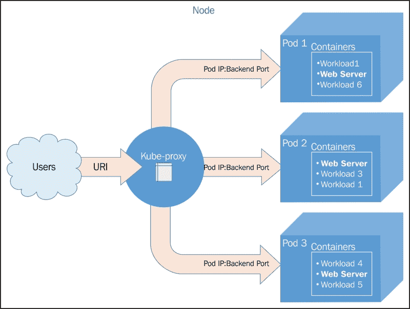
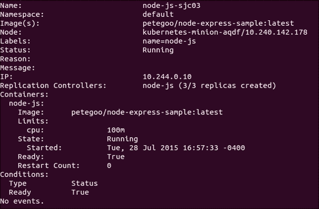
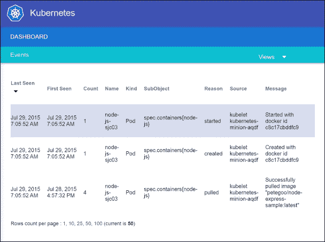
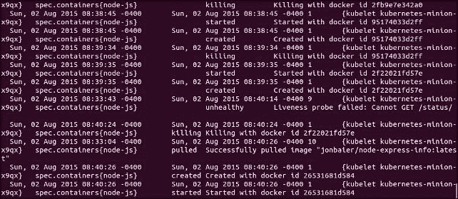
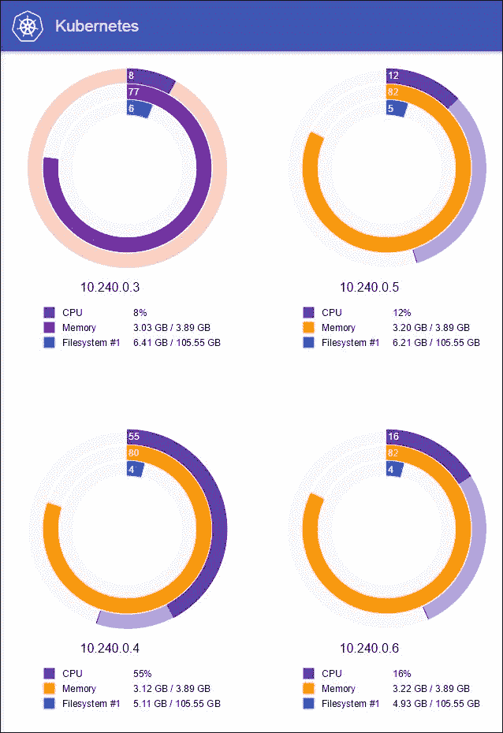
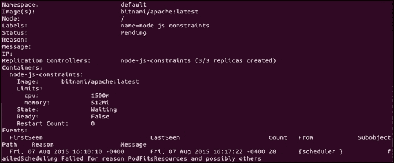

# 二、Kubernetes——核心概念和结构

本章将涵盖核心 **Kubernetes** 构造，如**吊舱**、**服务**、**复制控制器**和**标签**。将包含一些简单的应用示例来演示每个构造。本章还将介绍集群的基本操作。最后用几个例子介绍**健康检查**和**排班**。

本章将讨论以下主题:

*   Kubernetes 的整体架构
*   核心 Kubernetes 构造的介绍，如 pods、服务、复制控制器和标签
*   了解标签如何简化 Kubernetes 集群的管理
*   了解如何监控服务和容器运行状况
*   了解如何基于可用的集群资源设置调度约束

# 建筑

虽然 **Docker** 为带来了围绕容器管理的一层有用的抽象和工具，但是 Kubernetes 为大规模编排容器以及管理完整的应用程序堆栈带来了类似的帮助。

**K8s** 在堆栈中上移，为我们提供了在应用程序或服务级别处理管理的结构。这为我们提供了自动化和工具来确保高可用性、应用程序堆栈和服务范围的可移植性。K8s 还允许对资源使用进行更精细的控制，例如我们基础设施中的 CPU、内存和磁盘空间。

Kubernetes 通过为我们提供将多个容器、端点和数据组合成完整的应用程序堆栈和服务的关键构造，提供了这种更高级别的流程编排管理。然后 K8s 提供工具来管理*何时*、*何处*以及*堆栈及其组件的多少*。


图 2.1。坚如磐石的核心体系结构

在上图(图 2.1)中，我们看到了 Kubernetes 的核心架构。大多数管理交互都是通过`kubectl`脚本和/或对应用编程接口的 RESTful 服务调用来完成的。

仔细记下*期望状态*和*实际状态*的想法。这是 Kubernetes 如何管理集群及其工作负载的关键。所有的 K8s 都在持续工作，监控当前的*实际状态*，并将其与管理员通过 API 服务器或`kubectl`脚本定义的*期望状态*同步。有时这些状态并不匹配，但系统总是在努力调和两者。

## 大师

本质上**大师**是我们集群的大脑。这里，我们有核心的应用编程接口服务器，它维护 RESTful 网络服务，用于查询和定义我们想要的集群和工作负载状态。需要注意的是，控制窗格只访问主窗格来启动更改，而不是直接访问节点。

此外，主节点包括**调度器，该调度器与应用编程接口服务器一起工作，以吊舱的形式在实际的迷你节点上调度工作负载。这些容器包括组成我们应用程序堆栈的各种容器。默认情况下，基本的 Kubernetes 调度程序将 pod 分布在整个集群中，并使用不同的节点来匹配 pod 副本。Kubernetes 还允许为每个容器指定必要的资源，因此可以通过这些额外的因素来改变调度。**

 **复制控制器与应用编程接口服务器一起工作，以确保在任何给定时间运行正确数量的 pod 副本。这是*期望状态*概念的示例。如果我们的复制控制器定义了三个副本，而我们的*实际状态*是正在运行的 pod 的两个副本，那么调度器将被调用来在我们集群的某个地方添加第三个 pod。如果在任何给定时间集群中运行过多的吊舱，情况也是如此。这样，K8s 总是朝着那个*想要的状态*推进。

最后，我们让 **etcd** 作为分布式配置存储运行。Kubernetes 状态存储在这里，etcd 允许观察值的变化。把这想象成大脑的共享记忆。

## 节点(原喽啰)

在每个节点中，我们有一对组件。 **库布里特**与应用编程接口服务器交互，以更新状态并启动调度程序调用的新工作负载。

**Kube 代理** 提供基本的负载平衡，并将去往特定服务的流量定向到后端的适当 pod。参见本章后面的*服务*部分。

最后，我们有一些默认的 pods，它们为节点运行各种基础设施服务。正如我们在上一章中简要探讨的那样，pod 包括**域名系统** ( **域名系统**)的服务、日志记录和 pod 运行状况检查。默认的 pod 将在每个节点上与我们计划的 pod 一起运行。

### 注

请注意，在 v1.0 中，**宠臣**被重命名为**节点**，但是在网络上存在的一些机器命名脚本和文档中仍然有“宠臣”一词的残留。为了清楚起见，我在整本书的几个地方除了 node 之外还增加了 minion 这个术语。

# 核心结构

现在，让我们更深入地探讨一下并探索 Kubernetes 提供的一些核心抽象。这些抽象将使我们更容易思考我们的应用程序，并减轻生命周期管理、高可用性和调度的负担。

## 豆荚

在网络和硬件基础设施方面，Pods 允许保持相关容器关闭。数据可以存在于应用程序附近，因此可以在不导致网络遍历的高延迟的情况下完成处理。同样，公共数据可以存储在多个容器共享的卷上。Pods 本质上允许您将容器和我们应用程序堆栈的片段逻辑地组合在一起。

虽然 pod 内部可能运行一个或多个容器，但 pod 本身可能是运行在 Kubernetes (minion)节点上的许多容器之一。正如我们将看到的，pods 为我们提供了一组逻辑容器，然后我们可以跨这些容器复制、调度和平衡服务端点。

### Pod 示例

让我们快速看一下正在运行的吊舱。我们将在集群上启动一个 **Node.js** 应用程序。你需要一个 GCE 集群来运行这个，所以请参见【第三章】第一章、【第五章】库本内特斯和容器操作【第六章】，在【第七章】我们的第一个集群【第八章】下，如果你还没有开始的话。

现在，让我们为我们的定义创建一个目录。在这个例子中，我将在我们主目录下的`/book-examples`子文件夹中创建一个文件夹。

```
$ mkdir book-examples
$ cd book-examples
$ mkdir 02_example
$ cd 02_example

```

### 类型

**下载示例代码**

您可以从您在[http://www.packtpub.com](http://www.packtpub.com)的账户下载您购买的所有 Packt Publishing 书籍的示例代码文件。如果您在其他地方购买了这本书，您可以访问[http://www.packtpub.com/support](http://www.packtpub.com/support)并注册，以便将文件直接通过电子邮件发送给您。

使用您最喜欢的编辑器创建以下文件:

```
apiVersion: v1
kind: Pod
metadata:
  name: node-js-pod
spec:
  containers:
  - name: node-js-pod
    image: bitnami/apache:latest
    ports:
    - containerPort: 80
```

*清单 2-1* : `nodejs-pod.yaml`

该文件创建了一个吊舱名称`node-js-pod`，最新的`bitnami/apache`容器在`80`港运行。我们可以使用以下命令对此进行检查:

```
$ kubectl create -f nodejs-pod.yaml

```

输出如下:

```
pods/node-js-pod

```

这为我们提供了一个运行指定容器的 pod。我们可以通过运行以下命令来查看 pod 的更多信息:

```
$ kubectl describe pods/node-js-pod

```

您将看到大量信息，例如 pod 的状态、IP 地址，甚至相关的日志事件。您会注意到 pod 的 IP 地址是私有的`10.x.x.x`地址，因此我们无法从本地机器直接访问它。不用担心，因为`kubectl exec`命令反映了 Docker 的 `exec`功能。使用该功能，我们可以在 pod 中运行一个命令:

```
$ kubectl exec node-js-pod -- curl <private ip address>

```

### 类型

默认情况下，这会在其找到的第一个容器中运行一个命令，但是您可以使用`-c`参数选择一个特定的命令。

运行后，命令你应该会看到一些 HTML 代码。本章后面我们会看到更漂亮的视图，但是现在，我们可以看到我们的吊舱确实如预期的那样运行。

## 标签

标签给了我们另一个层次的分类，这对日常运营和管理非常有帮助。与标签类似，标签可以用作服务发现的基础，也是日常操作和管理任务的有用分组工具。

标签只是简单的键值对。您将在 pod、复制控制器、服务等上看到它们。标签充当选择器，告诉 Kubernetes 在各种操作中使用哪些资源。就当是*过滤*选项。

在本章的后面，我们将更深入地了解标签，但是首先，我们将探讨剩下的两个构造，服务和复制控制器。

## 容器的来世

任何参与操作的人都可以证明，失败总是会发生。容器和豆荚可能会崩溃，变得损坏，甚至可能只是被一个笨拙的管理员在其中一个节点上无意中关闭。强有力的政策和安全实践，如强制最低特权，减少了其中一些事件，但“非自愿的工作负载屠杀发生了”，这只是操作的事实。

幸运的是，Kubernetes 提供了两个非常有价值的构造，让这个阴暗的事件在窗帘后面保持整洁。服务和复制控制器使我们能够在几乎没有中断和正常恢复的情况下保持应用程序的运行。

## 服务

服务允许我们从应用程序的消费者那里抽象出访问权限。使用可靠的端点，用户和其他程序可以无缝地访问运行在您的集群上的 pods。

K8s 通过确保集群中的每个节点运行一个名为 kube-proxy 的代理来实现这一点。顾名思义，kube-proxy 的工作是将通信从服务端点代理回运行实际应用程序的相应 pod。



图 2.2。kube 代理架构

服务负载平衡池中的成员资格由选择器和标签的使用决定。带有匹配标签的 Pods 被添加到候选列表中，服务在该列表中转发流量。虚拟 IP 地址和端口被用作服务的入口点，然后流量被转发到由 K8s 或您的定义文件定义的目标端口上的随机 pod。

服务定义的更新由 K8s 集群主机监控和协调，并传播到每个节点上运行的 **kube 代理守护程序**。

### 类型

目前，kube 代理正在节点主机上运行。未来有计划默认将这个和 kubelet 容器化。

## 复制控制器

**复制控制器** ( **RCs** )顾名思义，管理 pod 和包含的容器映像运行的节点数量。它们确保一个映像实例以特定数量的副本运行。

当您开始操作您的容器和容器时，您将需要一种方法来展开更新，扩展运行的副本数量(向上和向下)，或者简单地确保堆栈中至少有一个实例始终在运行。RCs 创建了一个高级机制，以确保整个应用程序和集群中的事物正常运行。

RCs 只是负责确保您的应用具有所需的规模。您可以定义想要运行的 pod 副本的数量，并为其提供如何创建新 pod 的模板。就像服务一样，我们将使用选择器和标签来定义复制控制器中 pod 的成员资格。

### 类型

Kubernetes 不需要复制控制器的严格行为。事实上，1.1 版本在测试版中有一个**作业控制器**，可以用于允许作业运行到完成状态的短期工作负载。

# 我们的第一个 Kubernetes 应用

在我们继续之前，让我们来看看这三个概念的实际运用。Kubernetes 附带了许多安装的示例，但是我们将从头开始创建一个新的示例来说明一些概念。

我们已经创建了一个 pod 定义文件，但是正如我们所知，通过复制控制器运行我们的 pod 有很多好处。同样，使用我们之前创建的`book-examples/02_example`文件夹，我们将创建一些定义文件，并使用复制控制器方法启动一个 Node.js 服务器集群。此外，我们将通过负载平衡服务为其添加一个公共面。

使用您最喜欢的编辑器创建以下文件:

```
apiVersion: v1
kind: ReplicationController
metadata:
  name: node-js
  labels:
    name: node-js
deployment: demo
spec:
  replicas: 3
  selector:
    name: node-js
    deployment: demo
  template:
    metadata:
      labels:
        name: node-js
    spec:
      containers:
      - name: node-js
        image: jonbaier/node-express-info:latest
        ports:
        - containerPort: 80
```

*清单 2-2* : `nodejs-controller.yaml`

这是我们集群的第一个资源定义文件，让我们仔细看看。你会注意到它有四个一级元素(`kind`、`apiVersion`、`metadata`和`spec`)。这些在所有顶级 Kubernetes 资源定义中都很常见:

*   `Kind`告诉 K8s 我们正在创建什么类型的资源。在这种情况下，类型是`ReplicationController`。`kubectl`脚本对所有类型的资源使用单一的`create`命令。这样做的好处是，您可以轻松地创建各种类型的大量资源，而不需要为每种类型指定单独的参数。但是，它要求定义文件能够识别它们所指定的内容。
*   `ApiVersion`只是告诉 Kubernetes 我们使用的是模式的哪个版本。本书中的所有例子都将出现在`v1`上。
*   `Metadata`是我们给资源命名的地方，也是指定标签的地方，标签将用于搜索和选择给定操作的资源。元数据元素还允许您创建注释，这些注释用于可能对客户端工具和库有用的非识别信息。
*   最后，我们有`spec`，这将根据`kind`或我们正在创建的资源类型而变化。在这种情况下，是`ReplicationController`，它确保了所需数量的吊舱运行。`replicas`元素定义了所需的吊舱数量，`selector`告诉控制器要观察哪些吊舱，最后，`template`元素定义了一个模板来启动一个新的吊舱。`template`部分包含我们之前在 pod 定义中看到的相同部分。需要注意的一点是`selector`值需要与 pod 模板中指定的`labels`值相匹配。请记住，这种匹配用于选择被管理的吊舱。

现在，我们来看看的服务定义:

```
apiVersion: v1
kind: Service
metadata:
  name: node-js
  labels:
    name: node-js
spec:
  type: LoadBalancer
  ports:
  - port: 80
  selector:
    name: node-js
```

*清单 2-3* : `nodejs-rc-service.yaml`

这里的 YAML 类似于`ReplicationController`。主要区别在于服务`spec`元素。这里，我们定义`Service`类型，监听`port`，和`selector`，告诉`Service`代理哪个吊舱可以应答服务。

### 类型

Kubernetes 支持定义文件的 YAML 和 JSON 格式。

创建 Node.js 快速复制控制器:

```
$ kubectl create -f nodejs-controller.yaml

```

输出如下:

```
replicationcontrollers/node-js

```

这为我们提供了一个复制控制器，确保容器的三个副本始终运行:

```
$ kubectl create -f nodejs-rc-service.yaml

```

输出如下:

```
services/node-js

```

在 GCE 上，这将创建一个外部负载平衡器和转发规则，但您可能需要添加额外的防火墙规则。在我的情况下，防火墙已经为端口`80`打开。但是，您可能需要打开此端口，尤其是如果您使用除`80`和`443`之外的端口部署服务。

好了，现在我们有了一个正在运行的服务，这意味着我们可以从一个可靠的网址访问 Node.js 服务器。让我们看看我们的运行服务:

```
$ kubectl get services

```

下面的截图是前面命令的结果:


图 2.3。服务列表

在上图(图 2.3)中，您应该注意到**节点-js** 服务正在运行，并且在 **IP(S)** 列中，您应该同时拥有私有和公共(**130.211.186.84【截图中的 T5】)IP 地址。让我们看看是否可以通过在浏览器中打开公共地址来连接:**


图 2.4。容器信息应用程序

您应该会看到类似图 2.4 的内容。如果我们多次访问，您应该注意到容器名称发生了变化。本质上，服务负载平衡器在后端的可用单元之间旋转。

### 注

浏览器通常会缓存网页，因此要真正看到容器名称的变化，您可能需要清除缓存或使用如下代理:

[https://hide.me/en/proxy](https://hide.me/en/proxy)

让我们试着玩一下混沌猴子，干掉几个容器，看看 Kubernetes 会做什么。为了做到这一点，我们需要看到吊舱实际运行的位置。首先，让我们列出我们的豆荚:

```
$ kubectl get pods

```

下面的截图是前面命令的结果:


图 2.5。当前运行的吊舱

现在，让我们获得一些运行`node-js`容器的吊舱的更多细节。您可以使用最后一个命令中列出的其中一个 pod 名称来执行`describe`命令:

```
$ kubectl describe pod/node-js-sjc03

```

下面的截图是前面命令的结果:



图 2.6。Pod 描述

您应该会看到前面的输出。我们需要的信息是**节点:**部分。让我们使用节点名称将 **SSH** (简称**安全外壳**)放入运行此工作负载的(迷你)节点中:

```
$ gcloud compute --project "<Your project ID>" ssh --zone "<your gce zone>" "<Node from pod describe>"

```

一旦进入节点，如果我们运行一个`sudo docker ps`命令，我们应该会看到至少两个容器:一个运行`pause`图像，一个运行实际的`node-express-info`图像。如果 K8s 在此节点上调度了多个副本，您可能会看到更多。让我们抓取`jonbaier/node-express-info`图像的容器标识(而不是`gcr.io/google_containers/pause`)并将其删除，看看会发生什么。将此容器标识保存在某个地方以备后用:

```
$ sudo docker ps --filter="name=node-js"
$ sudo docker stop <node-express container id>
$ sudo docker rm <container id>
$ sudo docker ps --filter="name=node-js"

```

除非你真的很快，否则你可能会注意到仍然有一个`node-express-info`容器在运行，但是仔细看，你会注意到`container id`是不同的，创建时间戳仅在几秒钟前显示。如果您回到服务网址，它的功能就像正常一样。现在继续并退出 SSH 会话。

在这里，我们已经看到 Kubernetes 扮演着随叫随到的角色，确保我们的应用程序始终运行。

让我们看看是否能找到停电的证据。转到库本内特用户界面中的**事件**页面。您可以在主 K8s 仪表板上的**视图**菜单中的**事件**下找到它。或者，您可以只使用以下网址，添加`your master ip`:

`https://` **`<your master ip>`** `/api/v1/proxy/namespaces/kube-system/services/kube-ui/#/dashboard/events`

您将看到类似于以下屏幕截图的屏幕:



图 2.7 .库比厄 UI event page(库比厄 UI 事件页)

你应该看看最近发生的三件事。首先，Kubernetes 拉动图像。第二，它用拉取的图像创建一个新的容器。最后，它再次启动该容器。你会注意到，从时间戳来看，这一切都发生在不到一秒钟的时间内。所需时间可能因群集大小和映像拉入而异，但恢复非常快。

## 更多标签信息

如前所述，标签只是简单的键值对。它们可在 pod、复制控制器、服务等上获得。如果你回忆一下我们的服务 YAML，在*列表 2-3* : `nodejs-rc-service.yaml`中，有一个`selector`属性。`selector`告诉 Kubernetes 在寻找吊舱时使用哪些标签来转发该服务的流量。

K8s 允许用户直接在复制控制器和服务上使用标签。让我们修改我们的副本和服务，以包括一些更多的标签。再次使用您最喜欢的编辑器，创建这两个文件，如下所示:

```
apiVersion: v1
kind: ReplicationController
metadata:
  name: node-js-labels
  labels:
    name: node-js-labels
    app: node-js-express
    deployment: test
spec:
  replicas: 3
  selector:
    name: node-js-labels
    app: node-js-express
    deployment: test
  template:
    metadata:
      labels:
        name: node-js-labels
        app: node-js-express
        deployment: test
    spec:
      containers:
      - name: node-js-labels
        image: jonbaier/node-express-info:latest
        ports:
        - containerPort: 80
```

*清单 2-4* : `nodejs-labels-controller.yaml`

```
apiVersion: v1
kind: Service
metadata:
  name: node-js-labels
  labels:
    name: node-js-labels
    app: node-js-express
    deployment: test
spec:
  type: LoadBalancer
  ports:
  - port: 80
  selector:
    name: node-js-labels
    app: node-js-express
    deployment: test
```

*清单 2-5* : `nodejs-labels-service.yaml`

如下创建复制控制器和服务:

```
$ kubectl create -f nodejs-labels-controller.yaml
$ kubectl create -f nodejs-labels-service.yaml

```

让我们看看如何在日常管理中使用标签。下表显示了选择标签的选项:

<colgroup class="calibre18"><col class="calibre19"> <col class="calibre19"> <col class="calibre19"></colgroup> 
| 

经营者

 | 

描述

 | 

例子

 |
| --- | --- | --- |
| `= or ==` | 您可以使用任一样式来选择值等于右侧字符串的键 | `name = apache` |
| `!=` | 选择值不等于右边字符串的键 | `Environment != test` |
| `In` | 选择其标签具有带该集中值的关键字的资源 | `tier in (web, app)` |
| `Notin` | 选择标签包含值不在此集中的关键字的资源 | `tier not in (lb, app)` |
| `<Key name>` | 仅使用关键字名称来选择标签包含该关键字的资源 | `tier` |

> *表 1:标签选择器*

让我们尝试寻找`test`部署的副本:

```
$ kubectl get rc-l deployment=test

```

下面的截图是前面命令的结果:


图 2.8。复制控制器列表

您会注意到，它只返回我们刚刚启动的复制控制器。标签为`component`的服务怎么样？使用以下命令:

```
$ kubectl get services -l component

```

下面的截图是前面命令的结果:


图 2.9。标签为“组件”的服务列表

在这里，我们只看到核心的 Kubernetes 服务。最后，让我们只得到我们在本章开始的`node-js`服务器。请参见以下命令:

```
$ kubectl get services -l "name in (node-js,node-js-labels)"

```

下面的截图是前面命令的结果:


图 2.10。带有标签名称和值“node-js”或“nodejs-labels”的服务列表

此外，我们可以跨多个单元和服务执行管理任务。例如，我们可以按如下方式删除属于`demo`部署的所有复制控制器(如果我们有任何正在运行的复制控制器的话):

```
$ kubectl delete rc -l deployment=demo

```

否则，删除所有不属于`production`或`test`部署的服务(同样，如果我们有任何正在运行的服务)，如下所示:

```
$ kubectl delete service -l "deployment notin (test, production)"

```

需要注意的是，虽然标签选择在日常管理任务中很有帮助，但它确实需要我们适当的部署卫生。我们需要确保我们有一个标记标准，并且在我们在 Kubernetes 上运行的所有内容的资源定义文件中都积极遵循这个标准。

### 类型

到目前为止，虽然我们使用服务定义 YAML 文件来创建我们的服务，但是您实际上只能使用`kubectl`命令来创建它们。要尝试这一点，首先运行`get pods`命令并获得一个`node-js`吊舱名称。接下来，使用以下`expose`命令为该 pod 创建一个服务端点:

```
$ kubectl expose pods/node-js-gxkix --port=80 --name=testing-vip --create-external-load-balancer=true

```

这将创建一个名为`testing-vip`的服务和一个公共的`vip`(负载均衡器 IP)，可用于通过端口`80`访问这个 pod。还有许多其他可选参数可以使用。这些可以从以下内容中找到:

```
kubectl expose --help

```

# 健康检查

Kubernetes 提供了两层健康检查。首先，以 HTTP 或 TCP 检查的形式，K8s 可以尝试连接到特定端点，并在成功连接时给出健康状态。其次，可以使用命令行脚本执行特定于应用程序的运行状况检查。

让我们来看看一些正在进行的健康检查。首先，我们将创建一个带有运行状况检查的新控制器:

```
apiVersion: v1
kind: ReplicationController
metadata:
  name: node-js
  labels:
    name: node-js
spec:
  replicas: 3
  selector:
    name: node-js
  template:
    metadata:
      labels:
        name: node-js
    spec:
      containers:
      - name: node-js
        image: jonbaier/node-express-info:latest
        ports:
        - containerPort: 80
        livenessProbe:
          # An HTTP health check 
          httpGet:
            path: /status/
            port: 80
          initialDelaySeconds: 30
          timeoutSeconds: 1
```

*清单 2-6* : `nodejs-health-controller.yaml`

注意`livenessprobe`元素的添加。这是我们的核心健康检查要素。从那里，我们可以指定`httpGet`、`tcpScoket`或`exec`。在这个例子中，我们使用`httpGet`对我们的容器执行简单的 URI 检查。探测器将检查指定的路径和端口，如果没有成功返回，将重新启动 pod。

### 类型

`200`和`399`之间的状态代码都被探头认为是健康的。

最后，`initialDelaySeconds`让我们可以灵活地延迟运行状况检查，直到 pod 完成初始化。`timeoutSeconds`只是探头的超时值。

让我们用新的启用健康检查的控制器来代替旧的`node-js` RC。我们可以使用`replace`命令来实现这一点，该命令将替换复制控制器定义:

```
$ kubectl replace -f nodejs-health-controller.yaml

```

自行更换 RC 不会取代我们的容器，因为它仍然有三个我们第一次运行的健康豆荚。让我们干掉那些豆荚，让更新的`ReplicationController`用有健康检查的容器代替它们。

```
$ kubectl delete pods -l name=node-js

```

现在，在等待一两分钟后，我们可以在一个 RC 中列出吊舱，并抓取其中一个吊舱 id，使用`describe`命令进行更深入的检查:

```
$ kubectl describe rc/node-js

```

下面的截图是前面命令的结果:


图 2.11。“节点-js”复制控制器的描述

然后，对其中一个吊舱使用以下命令:

```
$ kubectl describe pods/node-js-1m3cs

```

下面的截图是前面命令的结果:



图 2.12。“node-js-1m3cs”吊舱的描述

根据你的时间安排，你可能会有一系列的活动。一两分钟内，你会注意到*杀死*、*启动*、*创造*事件一遍又一遍重复的模式。您还应该看到描述为**活动探测失败的不健康事件:无法获取/状态/** 。这是我们的健康检查失败，因为我们在`/status`没有页面响应。

您可能会注意到，如果您打开一个指向服务负载平衡器地址的浏览器，它仍然会以一个页面作为响应。您可以通过`kubectl get services`命令找到负载平衡器 IP。

出现这种情况有很多原因。首先，健康检查失败只是因为`/status`不存在，但是服务指向的页面仍然正常运行。第二，`livenessProbe`仅负责在健康检查失败时重启容器。有一个单独的`readinessProbe`将从回答服务端点的 pods 池中移除一个容器。

让我们修改的运行状况检查，检查我们的容器中是否存在某个页面，以便进行适当的运行状况检查。我们还将添加一个就绪检查，并将其指向不存在的状态页面。打开`nodejs-health-controller.yaml`文件，修改`spec`部分，使其与*列表 2-7* 匹配，并保存为`nodejs-health-controller-2.yaml`。

```
apiVersion: v1
kind: ReplicationController
metadata:
  name: node-js
  labels:
    name: node-js
spec:
  replicas: 3
  selector:
    name: node-js
  template:
    metadata:
      labels:
        name: node-js
    spec:
      containers:
      - name: node-js
        image: jonbaier/node-express-info:latest
        ports:
        - containerPort: 80
        livenessProbe:
          # An HTTP health check 
          httpGet:
            path: /status/
            port: 80
          initialDelaySeconds: 30
          timeoutSeconds: 1
        readinessProbe:
          # An HTTP health check 
          httpGet:
            path: /status/
            port: 80
          initialDelaySeconds: 30
          timeoutSeconds: 1
```

*清单 2-7* : `nodejs-health-controller-2.yaml`

这一次，我们将删除旧的 RC，这将杀死它的荚，并创建一个新的 RC 与我们更新的 YAML 文件。

```
$ kubectl delete rc -l name=node-js
$ kubectl create -f nodejs-health-controller-2.yaml

```

现在当我们描述其中一个豆荚时，我们只看到豆荚和容器的创造。然而，你会注意到服务负载平衡器 IP 不再工作。如果我们在其中一个新节点上运行`describe`命令，我们会注意到**就绪探测失败**错误消息，但是 pod 本身继续运行。如果我们将就绪探测路径更改为`path: /`，我们将再次能够满足主服务的请求。在编辑器中打开`nodejs-health-controller-2.yaml`并立即进行更新。然后，再次删除并重新创建复制控制器:

```
$ kubectl delete rc -l name=node-js
$ kubectl create -f nodejs-health-controller-2.yaml

```

现在负载平衡器 IP 应该再次工作。保留这些豆荚，因为我们将在[第 3 章](3.html#QMFO2-22fbdd9ef660435ca6bcc0309f05b1b7 "Chapter 3. Core Concepts – Networking, Storage, and Advanced Services")、*核心概念—网络、存储和高级服务*中再次使用它们。

## TCP 检查

Kubernetes 还支持通过简单的 TCP 套接字检查和自定义命令行脚本进行健康检查。以下片段是 YAML 文件中两个用例的示例:

```
livenessProbe:
  exec:
    command:
    -/usr/bin/health/checkHttpServce.sh
  initialDelaySeconds:90
  timeoutSeconds: 1
```

*清单 2-8* : *使用命令行脚本*进行运行状况检查

```
livenessProbe:
  tcpSocket:
    port: 80
  initialDelaySeconds: 15
  timeoutSeconds: 1
```

*清单 2-9* : *使用简单的 TCP 套接字连接进行健康检查*

## 生命周期挂钩或正常关机

当您在现实场景中遇到故障时，您可能会发现您希望在容器关闭之前或启动之后立即采取额外的措施。Kubernetes 实际上为这种用例提供了生命周期挂钩。

以下示例控制器定义定义了在 Kubernetes 将容器移动到其生命周期的下一阶段 <sup class="calibre14">1</sup> 之前发生的`postStart`和`preStop`动作:

```
apiVersion: v1
kind: ReplicationController
metadata:
  name: apache-hook
  labels:
    name: apache-hook
spec:
  replicas: 3
  selector:
    name: apache-hook
  template:
    metadata:
      labels:
        name: apache-hook
    spec:
      containers:
      - name: apache-hook
        image: bitnami/apache:latest
        ports:
        - containerPort: 80
        lifecycle:
          postStart:
            httpGet:
              path: http://my.registration-server.com/register/
              port: 80
          preStop:
            exec:
              command: ["/usr/local/bin/apachectl","-k","graceful- stop"]
```

*清单 2-10* : `apache-hooks-controller.yaml`

你会注意到对于`postStart`钩子，我们定义了一个`httpGet`动作，但是对于`preStop`钩子，我定义了一个`exec`动作。就像我们的健康检查一样，`httpGet`操作尝试对特定端点和端口组合进行 HTTP 调用，而`exec`操作在容器中运行本地命令。

`httpGet`和`exec`动作都由`postStart`和`preStop`挂钩支撑。在`preStop`的情况下，名为`reason`的参数将作为参数发送给处理程序。有效值见下表(表 2.1):

<colgroup class="calibre18"><col class="calibre19"> <col class="calibre19"></colgroup> 
| 

原因参数

 | 

故障描述

 |
| --- | --- |
| **删除** | 通过`kubectl`或应用编程接口发出的删除命令 |
| **健康** | 运行状况检查失败 |
| **依存关系** | 依赖性故障，如磁盘装载故障或默认基础架构 pod 崩溃 |

> *表 2.1。有效预存原因<sup class="calibre14">1</sup>T3】*

需要注意的是，挂机呼叫至少会被发送一次。因此，动作中的任何逻辑都应该优雅地处理多个调用。另一个重要的注意事项是`postStart`在吊舱进入就绪状态之前运行。如果钩子本身失效，吊舱将被认为是不健康的。

# 应用程序调度

现在我们了解了如何在 pods 中运行容器，甚至从故障中恢复，了解如何在我们的集群节点上调度新容器可能会很有用。

如前所述，Kubernetes 调度程序的默认行为是将容器副本分布在集群中的节点上。在没有所有其他约束的情况下，调度器将在属于匹配服务或复制控制器的其他单元数量最少的节点上放置新的单元。

此外，调度器提供了基于节点可用资源添加约束的能力。今天，这包括最小的中央处理器和内存分配。就 Docker 而言，它们在封面下使用 **cpu 共享**和**内存限制标志**。

当定义了额外的约束时，Kubernetes 将检查一个节点的可用资源。如果一个节点不满足所有约束，它将移动到下一个节点。如果找不到符合标准的节点，我们将在日志中看到一个调度错误。

Kubernetes 路线图还计划支持网络和存储。因为调度是容器整体运营和管理中如此重要的一部分，我们应该期望随着项目的增长，在这个领域看到许多增加。

## 调度示例

让我们看一下设置一些资源限制的快速示例。如果我们查看我们的 K8s 仪表板，我们可以使用`https://` **`<your master ip>`** `/api/v1/proxy/namespaces/kube-system/services/kube-ui`快速获取集群上资源使用的当前状态快照，如下图所示:



图 2.13。Kube UI 仪表板

在这种情况下，我们的 CPU 利用率相当低，但是使用了大量内存。让我们看看当我尝试再旋转几个吊舱时会发生什么，但这一次，我们将请求 512 米的内存和 1500 米的中央处理器。我们将使用 1500 m 来指定 1.5 个 CPU，因为每个节点只有 1 个 CPU，这应该会导致失败。下面是钢筋混凝土定义的一个例子:

```
apiVersion: v1
kind: ReplicationController
metadata:
  name: node-js-constraints
  labels:
    name: node-js-constraints
spec:
  replicas: 3
  selector:
    name: node-js-constraints
  template:
    metadata:
      labels:
        name: node-js-constraints
    spec:
      containers:
      - name: node-js-constraints
        image: jonbaier/node-express-info:latest
        ports:
        - containerPort: 80
        resources:
        limits:
          memory: "512Mi"
          cpu: "1500m"
```

*清单 2-11* : `nodejs-constraints-controller.yaml`

要打开前面的文件，请使用以下命令:

```
$ kubectl create -f nodejs-constraints-controller.yaml

```

复制控制器成功完成，但是如果我们运行一个`get pods`命令，我们会注意到`node-js-constraints`单元处于挂起状态。如果我们仔细观察一下`describe pods/<pod-id>`命令，我们会注意到一个调度错误:

```
$ kubectl get pods
$ kubectl describe pods/<pod-id>

```

下面的截图是前面命令的结果:



图 2.14。Pod 描述

请注意，事件中列出的**计划失败**错误伴随着**因原因失败。在我们的屏幕上，可能还有其他**。正如您所看到的，Kubernetes 在集群中找不到符合我们定义的所有约束的匹配。

如果我们现在将我们的 CPU 限制修改为 500 m，然后重新创建我们的复制控制器，我们应该在几分钟内运行所有三个单元。

# 总结

我们已经了解了 Kubernetes 的整体架构，以及为构建您的服务和应用程序堆栈而提供的核心结构。您应该更好地理解这些抽象如何使管理堆栈和/或服务的生命周期变得更容易，而不仅仅是管理单个组件。此外，我们还亲自了解了如何使用 pods、服务和复制控制器来管理一些简单的日常任务。我们还研究了如何使用 Kubernetes 通过运行状况检查自动响应中断。最后，我们探讨了 Kubernetes 调度器以及用户可以指定的一些约束来影响调度的放置。

## 脚注

<sup class="calibre14">1</sup>[https://github . com/Google CloudPlatform/kubernetes/blob/release-1.0/docs/用户指南/容器-环境. MD #容器-挂钩](https://github.com/GoogleCloudPlatform/kubernetes/blob/release-1.0/docs/user-guide/container-environment.md#container-hooks)**