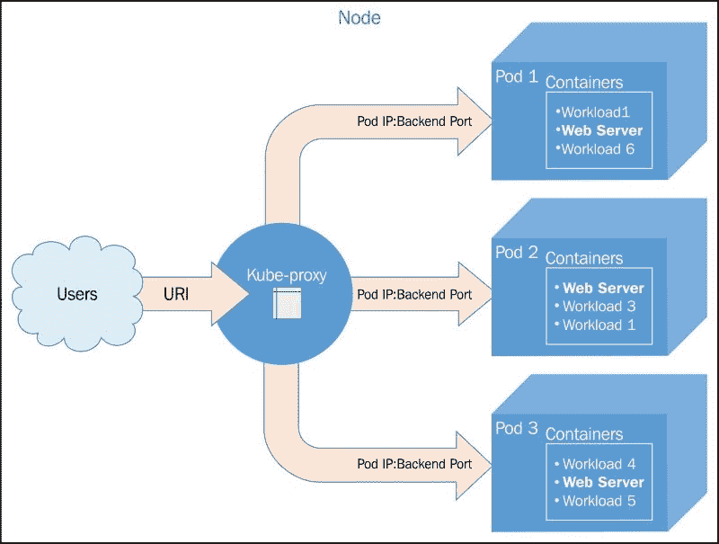
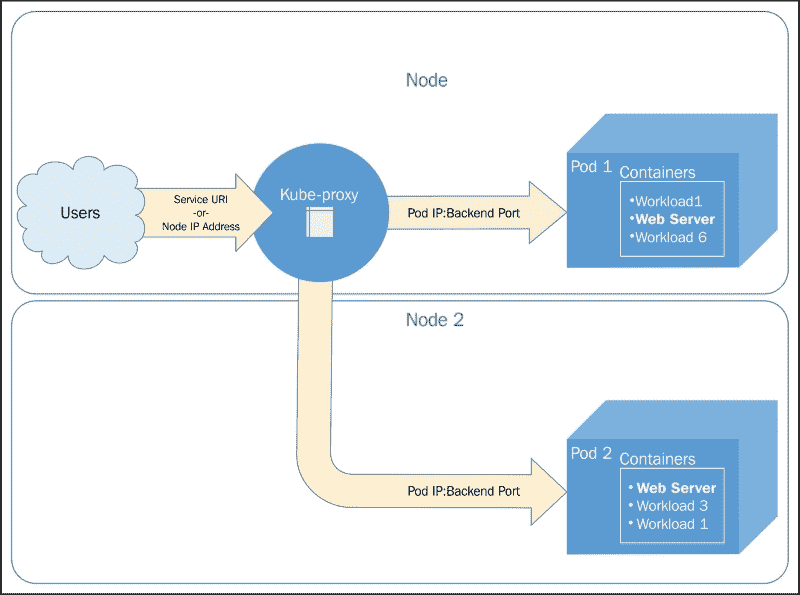
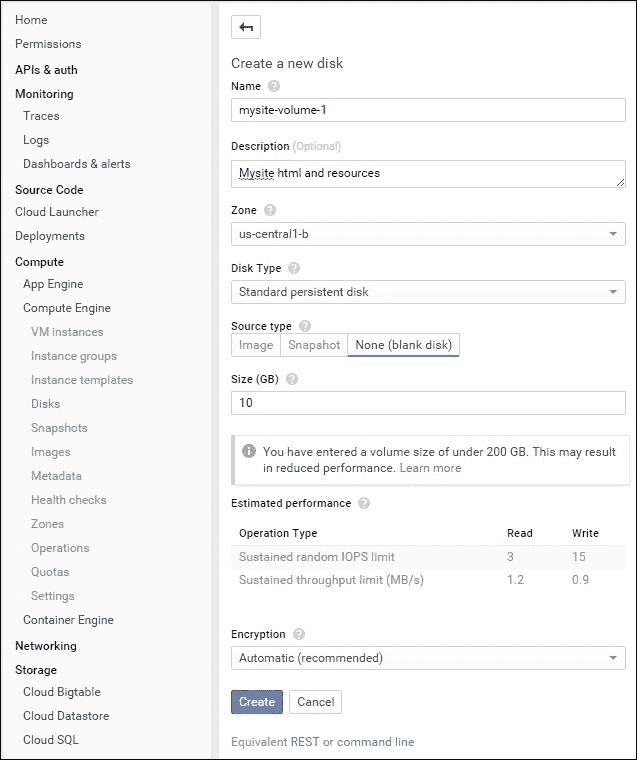
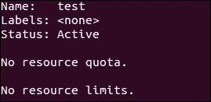
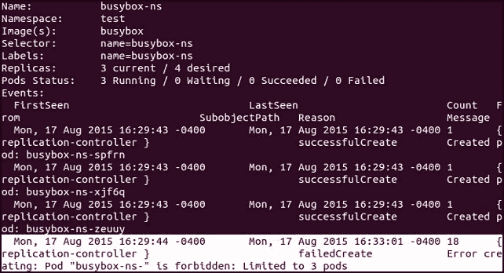

# 三、核心概念——网络、存储和高级服务

在本章中，我们将介绍 Kubernetes 集群如何处理网络，以及它与其他方法的不同之处。我们将描述 Kubernetes 网络解决方案的三个要求，并探讨为什么这些是简化操作的关键。此外，我们将深入研究服务以及 Kubernetes 代理如何在每个节点上工作。最后，我们将了解存储问题，以及我们如何跨容器和容器生命周期保存数据。最后，我们将看到一些针对多租户的高级隔离功能的简要概述。

本章将讨论以下内容:

*   不可思议的网络
*   高级服务概念
*   服务发现
*   域名服务器(Domain Name Server)
*   持久存储
*   命名空间限制和配额

# 不间断的网络

对于生产级运营来说，网络是至关重要的。在服务级别上，我们需要一种可靠的方式让我们的应用程序组件找到并相互通信。将容器和集群引入到组合中，事情会变得更加复杂，因为我们现在需要记住多个网络名称空间。通信和发现现在已经成为一项壮举，必须跨越容器 IP 空间、主机网络，有时甚至跨越多个数据中心网络拓扑。

Kubernetes 在这里受益于从谷歌过去十年使用的聚类工具中获得其祖先。网络是谷歌超越全球最大网络竞争的一个领域。早期，谷歌构建了自己的硬件交换机和软件定义的网络(T2)，为他们的日常网络运营提供更多的控制、冗余和效率。从每周运行和联网 20 亿个容器中吸取的许多经验教训已经被提炼到 Kubernetes 中，并被告知 K8s 联网是如何完成的。

Kubernetes 中的网络要求每个 pod 都有自己的 IP 地址。实施细节可能因基础架构提供商而异。然而，所有的实现都必须遵守一些基本规则。第一和第二，Kubernetes 不允许将 **网络地址转换** ( **NAT** )用于容器到容器或容器到节点(迷你)流量。此外，内部容器的 IP 地址必须与用来与其通信的 IP 地址相匹配。

这些规则将大部分复杂性排除在我们的网络堆栈之外，并简化了应用程序的设计。此外，它消除了重新设计从现有基础架构迁移而来的传统应用程序中的网络通信的需要。最后，在绿地应用中，它允许更大规模地处理数百甚至数千个服务和应用通信。

K8s 通过使用 **占位符**实现了这种豆荚范围的知识产权魔法。还记得我们在[第 1 章](1.html#E9OE1-22fbdd9ef660435ca6bcc0309f05b1b7 "Chapter 1. Kubernetes and Container Operations")、*库本内斯和容器操作*中看到的`pause`容器吗，在主部分运行的*服务下。这通常被称为 **pod 基础设施容器**，它的重要工作是为我们稍后将启动的应用程序容器预留网络资源。本质上，暂停容器保存了整个 pod 的网络命名空间和 IP 地址，并且可以被运行在其中的所有容器使用。*

## 网络对比

为了更好地理解容器联网，看看容器联网的其他方法可能会有所启发。

### 码头工人

**Docker 引擎**默认使用*桥接的*网络模式。在这种模式下，容器有自己的网络命名空间，然后通过虚拟接口桥接到主机(或 K8s 情况下的节点)网络。

在*桥接*模式下，两个容器可以使用相同的 IP 范围，因为它们是完全隔离的。因此，服务通信需要通过网络接口的主机端进行一些额外的端口映射。

Docker 还支持*主机*模式，该模式允许容器使用主机网络堆栈。性能受益匪浅，因为它消除了一定程度的网络虚拟化；但是，您失去了拥有独立网络名称空间的安全性。

最后，Docker 支持*容器*模式，两个容器之间共享一个网络命名空间。容器将共享名称空间和 IP 地址，因此容器不能使用相同的端口。

在所有这些场景中，我们仍然在一台机器上，在主机模式之外，容器 IP 空间在该机器之外不可用。跨两台机器连接容器需要 **网络地址转换** ( **NAT** )和 **端口映射**进行通信。

### 坞站插件(libnetwork)

为了解决的跨机通讯问题，Docker 发布了新的网络插件，在我们去发稿的时候刚刚脱离了实验支持。这个插件允许独立于容器本身创建网络。通过这种方式，容器可以加入相同的现有*网络*。通过新的插件架构，可以为不同的网络用例提供各种驱动。

第一个是 **叠加**司机。为了使能够跨多台主机进行协调，它们必须就可用网络及其拓扑达成一致。覆盖驱动程序使用分布式键值存储来同步多个主机上的网络创建。

值得注意的是，插件机制将允许 Docker 中广泛的网络可能性。事实上，许多第三方选项，如 Weave，已经在创建自己的 Docker 网络插件。

### 编织

**编织** 为码头工人容器提供了一个覆盖网络。它可以作为一个插件与新的 Docker 网络插件接口，它也与 Kubernetes 兼容。像许多覆盖网络一样，许多人批评封装开销对性能的影响。请注意，他们最近添加了一个预览版本，具有**虚拟可扩展局域网** ( **VXLAN** ) 封装支持，这大大提高了性能。有关更多信息，请访问:

[http://blog.weave.works/2015/06/12/weave-fast-datapath/](http://blog.weave.works/2015/06/12/weave-fast-datapath/)

### 法兰绒

**法兰绒**来自Coreos，是一个 etcd 背景的叠加。法兰绒为每个主机/节点提供了一个完整的子网，实现了与 Kubernetes 做法相似的模式，即每个容器或容器组都有一个可路由的 IP。法兰绒包括内核中的 VXLAN 封装模式，以获得更好的性能，并具有类似于覆盖 Docker 插件的实验性多网络模式。有关更多信息，请访问:

[https://github . com/coreos/flannel](https://github.com/coreos/flannel)

### 印花布项目

**项目 Calico** 是一个基于层的网络模型，使用了 Linux 内核的内置路由功能。路由通过 **边界网关协议** ( **BGP** )传播到每台主机上的虚拟路由器。从小规模部署到大型互联网安装，Calico 都可以使用。因为它在网络堆栈的较低层工作，所以不需要额外的 NAT、隧道或覆盖。它可以直接与底层网络基础设施交互。此外，它还支持网络级 ACL，以提供额外的隔离和安全性。欲了解更多信息，请访问:

[http://www.projectcalico.org/](http://www.projectcalico.org/)

## 平衡设计

重要的是要指出【Kubernetes 试图通过将 IP 放在 pod 级别来实现平衡。随着容器数量的增长，在主机级别使用唯一的 IP 地址是有问题的。端口必须用于公开特定容器上的服务并允许外部通信。除此之外，运行多个彼此可能知道也可能不知道的服务(以及它们的自定义端口)以及管理端口空间的复杂性也成为一个大问题。

然而，给每个容器分配一个 IP 地址可能会有些过分。在规模相当大的情况下，需要覆盖网络和网络接入技术来处理每个容器。覆盖网络会增加延迟，并且 IP 地址也会被后端服务占用，因为它们需要与前端服务进行通信。

在这里，我们真的看到了 Kubernetes 在应用程序和服务级别提供的抽象的优势。如果我有一个网络服务器和一个数据库，我们可以将它们放在同一个 pod 上，并使用一个 IP 地址。web 服务器和数据库可以使用本地接口和标准端口进行通信，不需要自定义设置。此外，后端上的服务不会不必要地暴露给运行在集群中其他地方(但可能在同一主机上)的其他应用程序堆栈。由于 pod 看到的 IP 地址与在其中运行的应用程序看到的 IP 地址相同，因此服务发现不需要任何额外的转换。

如果您需要覆盖网络的灵活性，您仍然可以在 pod 级别使用覆盖。编织和法兰绒覆盖以及 BGP 路由项目 Calico 都可以与 Kubernetes 一起使用。

这在调度工作负载时也非常有用。对于调度程序来说，拥有一个简单且标准的结构是一个关键，以便匹配约束并了解在任何给定时间集群网络上的空间位置。这是一个动态的环境，运行着各种各样的应用程序和任务，因此任何额外的复杂性都会产生涟漪效应。

对服务发现也有影响。即将上线的新服务必须确定并注册一个 IP 地址，在这个地址上，世界其他地方，或者至少集群，都可以访问它们。如果使用网络地址转换，服务将需要一个额外的机制来学习它们的面向外部的 IP。

# 高级服务

让我们探索与容器之间的服务和通信相关的知识产权策略。如果您还记得，在[第 2 章](2.html#KVCC1-22fbdd9ef660435ca6bcc0309f05b1b7 "Chapter 2. Kubernetes – Core Concepts and Constructs")、*Kubernetes–核心概念和构造* **、**中的*服务*部分，您了解到 Kubernetes 正在使用 kube-proxy 来确定服务于每个请求的正确 pod IP 地址和端口。在幕后，kube-proxy 实际上是在使用虚拟 IPs 和**【iptables】**让这一切变得神奇。

回想一下，kube-proxy 正在每台主机上运行。它的第一个职责是从库本内特斯大师那里监控原料药。对服务的任何更新都会触发 kube-proxy 对 iptables 的更新。例如，创建新服务时，选择虚拟 IP 地址并设置 iptables 中的规则，这将通过随机端口将其流量定向到 kube-proxy。因此，我们现在有一种方法可以在这个节点上捕获以服务为目的地的流量。由于 kube-proxy 在所有节点上运行，我们为服务 VIP 提供了集群范围的解析。此外，域名系统记录也可以指向这个虚拟 IP。

既然我们已经在 iptables 中创建了一个*钩子*，我们仍然需要将流量传送到服务舱；但是，此时规则只是向 kube-proxy 中的服务条目发送流量。一旦 kube-proxy 收到特定服务的流量，它必须将其转发到服务候选池中的 pod。它使用在服务创建期间选择的随机端口来实现这一点。参考下图(图 3.1)了解流程概述:



图 3.1。代理通信

在撰写本书时，在即将到来的 1.1 版本中有计划包括一个 kube-proxy，它不依赖于服务条目，只使用 iptable 规则。

### 类型

还可以使用服务定义中的`sessionAffinity`元素，始终将流量从同一个客户端 IP 转发到同一个后端 pod/容器。

## 外部服务

在最后一章，我们看到了几个服务的例子。出于测试和演示的目的，我们希望所有服务都可以从外部访问。这是由我们的服务定义中的`type: LoadBalancer`元素配置的。`LoadBalancer`类型在云提供商上创建外部负载平衡器。我们应该注意到，对外部负载平衡器的支持因提供商而异，实现也是如此。在我们的例子中，我们使用的是 GCE，所以集成非常顺利。唯一需要的附加设置是为外部服务端口打开防火墙规则。

让我们更深入地了解一下第 2 章、*库本内特斯-核心概念和构造*中标签下的*更多服务。*

```
$ kubectl describe service/node-js-labels

```

下面的截图是前面命令的结果:


图 3.2。服务描述

在图 3.2 的输出中，您将注意到几个关键元素。我们的名称空间设置为默认，**类型:**为`LoadBalancer`，外部 IP 列在**负载平衡器入口:**下。此外，我们看到**端点:**，它向我们显示了可用于回答服务请求的吊舱的 IPs。

## 内部服务

让我们探索一下我们可以部署的其他类型的服务。首先，默认情况下，服务仅面向内部。您可以指定`clusterIP`的类型来实现这一点，但是如果没有定义类型，则`clusterIP`是假设的类型。我们来看一个例子，注意`type`元素的缺失:

```
apiVersion: v1
kind: Service
metadata:
  name: node-js-internal
  labels:
    name: node-js-internal
spec:
  ports:
  - port: 80
  selector:
    name: node-js
```

*清单 3-1* : `nodejs-service-internal.yaml`

使用此列表创建服务定义文件。你需要一个健康版本的`node-js` RC ( *清单 2-7* : `nodejs-health-controller-2.yaml`)。如你所见，选择器与我们的 RC 在上一章推出的名为`node-js`的吊舱相匹配。我们将创建服务，然后使用过滤器列出当前运行的服务:

```
$ kubectl create -f nodejs-service-internal.yaml
$ kubectl get services -l name=node-js-internal

```

下面的截图是前面命令的结果:


图 3.3。内部服务列表

如您所见，我们有一项新服务，但只有一个 IP。此外，该 IP 地址不能从外部访问。这次我们将无法从网络浏览器测试该服务。然而，我们可以使用方便的`kubectl exec`命令，并尝试从其他吊舱之一连接。您将需要`node-js-pod` ( *清单 2-1* : `nodejs-pod.yaml`)运行。然后，您可以执行以下命令:

```
$ kubectl exec node-js-pod -- curl <node-js-internal IP>

```

这允许我们运行`docker exec`命令，就像我们在`node-js-pod`容器中有一个外壳一样。然后，它会点击内部服务网址，该网址会转发给任何带有`node-js`标签的豆荚。

如果一切正常，您应该会得到原始的 HTML 输出。因此，您已经成功创建了一个内部专用服务。这对于后端服务非常有用，您希望让运行在集群中的其他容器可以使用这些服务，但是不能对整个世界开放。

## 自定义负载平衡

K8s 允许的第三种类型是`NodePort`类型。这种类型允许我们通过特定端口上的主机或仆从来公开服务。这样，我们可以使用任何节点(迷你)的 IP 地址，并在分配的节点端口上访问我们的服务。默认情况下，Kubernetes 会在 3000–32767 范围内分配一个节点端口，但您也可以指定自己的自定义端口。在*清单 3-2* : `nodejs-service-nodeport.yaml`的例子中，我们选择端口`30001`如下:

```
apiVersion: v1
kind: Service
metadata:
  name: node-js-nodeport
  labels:
    name: node-js-nodeport
spec:
  ports:
  - port: 80
    nodeport: 30001
  selector:
    name: node-js
  type: NodePort
```

*清单 3-2* : `nodejs-service-nodeport.yaml`

再次创建这个 YAML 定义文件，并按如下方式创建您的服务:

```
$ kubectl create -f nodejs-service-nodeport.yaml

```

输出应该有如下消息:


图 3.4。新 GCP 防火墙规则

您会注意到一条关于打开防火墙端口的消息。类似于外部负载平衡器类型，`NodePort`使用节点上的端口向外部公开您的服务。例如，如果您想在节点前使用自己的负载平衡器，这可能会很有用。在测试我们的新服务之前，让我们确保开放 GCP 的那些港口。

从 GCE 虚拟机实例控制台，单击任何节点(从属节点)的网络。就我而言，这是违约。在防火墙规则下，我们可以通过点击**添加防火墙规则**来添加规则。创建一个如图 3.5 所示的规则:


图 3.5。新 GCP 防火墙规则

我们现在可以通过打开浏览器并使用集群中任何节点(迷你)的 IP 地址来测试我们的新服务。测试新服务的格式是:

`http://` **`<Minoion IP Address>`** `:` `<NodePort>` `/`

## 跨节点代理

请记住kube-proxy 正在所有节点上运行，因此即使 pod 没有在那里运行，流量也将被赋予相应主机的代理。参见图 3.6，查看流量如何流动。用户向外部 IP 或 URL 发出请求。在这种情况下，请求由**节点 1** 提供服务。但是，pod 不会恰好在此节点上运行。这不是问题，因为 pod 的 IP 地址是可路由的。因此， **Kube-proxy** 简单地将流量传递给这个服务的 pod IP。然后，网络路由在**节点 2** 上完成，所请求的应用程序位于该节点。



图 3.6。跨节点流量

## 定制端口

服务也允许你把你的流量映射到不同的港口，然后容器和吊舱自己暴露出来。我们将创建一个服务，公开`port 90`并将流量转发到豆荚上的`port 80`。我们将调用`node-js-90` pod 来反映自定义端口号。创建以下两个定义文件:

```
apiVersion: v1
kind: ReplicationController
metadata:
  name: node-js-90
  labels:
    name: node-js-90
spec:
  replicas: 3
  selector:
    name: node-js-90
  template:
    metadata:
      labels:
        name: node-js-90
    spec:
      containers:
      - name: node-js-90
        image: jonbaier/node-express-info:latest
        ports:
        - containerPort: 80
```

*清单 3-3* : `nodejs-customPort-controller.yaml`

```
apiVersion: v1
kind: Service
metadata:
  name: node-js-90
  labels:
    name: node-js-90
spec:
  type: LoadBalancer
  ports:
  - port: 90
    targetPort: 80
  selector:
    name: node-js-90
```

*清单 3-4* : `nodejs-customPort-service.yaml`

您会注意到，在服务定义中，我们有一个`targetPort`元素。这个元素告诉服务该端口用于池中的容器。正如我们在前面的例子中看到的，如果您不指定`targetPort`，它会假设它与服务是同一个端口。港口仍然被用作服务港口，但是在这种情况下，我们将在港口 `90`公开服务，而容器在港口 `80`提供内容。

创建这个 RC 和服务，并打开适当的防火墙规则，就像我们在上一个示例中所做的那样。外部负载平衡器 IP 可能需要一段时间才能传播到`get service`命令。一旦完成，您应该能够使用以下格式在浏览器中打开并查看我们熟悉的 web 应用程序:

`http://` **`<external service IP>`** `:90/`

## 多个端口

另一个自定义端口用例是多端口的。许多应用程序公开了多个端口，例如端口`80`上的 HTTP 和网络服务器的端口`8888`。以下示例显示了我们的应用程序在两个端口上的响应。同样，我们还需要为这个端口添加一个防火墙规则，就像我们之前为*列表 3-2* : `nodejs-service-nodeport.yaml`所做的那样:

```
apiVersion: v1
kind: ReplicationController
metadata:
  name: node-js-multi
  labels:
    name: node-js-multi
spec:
  replicas: 3
  selector:
    name: node-js-multi
  template:
    metadata:
      labels:
        name: node-js-multi
    spec:
      containers:
      - name: node-js-multi
        image: jonbaier/node-express-multi:latest
        ports:
        - containerPort: 80
        - containerPort: 8888
```

*清单 3-5* : `nodejs-multicontroller.yaml`

```
apiVersion: v1
kind: Service
metadata:
  name: node-js-multi
  labels:
    name: node-js-multi
spec:
  type: LoadBalancer
  ports:
  - name: http
    protocol: TCP
    port: 80
  - name: fake-admin-http
    protocol: TCP
    port: 8888
  selector:
    name: node-js-multi
```

*清单 3-6* : `nodejs-multiservice.yaml`

### 注

请注意，应用程序和容器本身必须在两个端口上侦听才能工作。在这个例子中，端口`8888`被用来表示一个假的管理界面。

例如，如果您想监听端口 443，您需要一个适当的 SSL 套接字监听服务器。

## 迁移、多集群等等

正如您到目前为止所看到的，Kubernetes 提供了高度的灵活性和定制，以围绕集群中运行的容器创建服务抽象。但是，有时您可能想要指向集群之外的东西。

这方面的一个例子是使用遗留系统，甚至运行在另一个集群上的应用程序。在前一种情况下，为了迁移到 Kubernetes 和容器，这是一个非常好的策略。我们可以在 Kubernetes 中开始管理服务端点，同时使用 K8s 编排概念将堆栈拼接在一起。此外，当组织为微服务和/或容器化重构应用程序时，我们甚至可以开始将堆栈的各个部分作为前端，一次一个。

为了允许访问非基于 pod 的应用程序，服务构造允许您使用集群外部的端点。Kubernetes 实际上是在每次创建使用选择器的服务时都创建一个端点资源。`endpoints`对象跟踪负载平衡池中的 pod IPs。您可以通过运行如下`get endpoints`命令看到这一点:

```
$ kubectl get endpoints

```

您应该会看到类似这样的内容:

```
NAME               ENDPOINTS
http-pd            10.244.2.29:80,10.244.2.30:80,10.244.3.16:80
kubernetes         10.240.0.2:443
node-js            10.244.0.12:80,10.244.2.24:80,10.244.3.13:80

```

您会注意到的一个条目，它代表我们集群上当前运行的所有服务。对大多数人来说，端点只是运行在 RC 中的每个 pod 的 IP。正如我提到的，Kubernetes 会根据选择器自动执行此操作。当我们在具有匹配标签的控制器中缩放副本时，Kubernetes 将自动更新端点。

如果我们想为非 pod 的东西创建一个服务，因此没有标签可供选择，我们可以通过服务和端点定义轻松地做到这一点，如下所示:

```
apiVersion: v1
kind: Service
metadata:
  name: custom-service
spec:
  type: LoadBalancer
  ports:
  - name: http
    protocol: TCP
    port: 80
```

*清单 3-7* : `nodejs-custom-service.yaml`

```
apiVersion: v1
kind: Endpoints
metadata:
  name: custom-service
subsets:
- addresses:
  - IP: <X.X.X.X>
  ports:
    - name: http
      port: 80
      protocol: TCP
```

*清单 3-8* : `nodejs-custom-endpoint.yaml`

在前面的例子中，您需要用新服务可以指向的真实 IP 地址替换`<X.X.X.X>`。在我的例子中，我使用了我们之前创建的`node-js-multiservice`中的公共负载平衡器 IP。现在就开始创建这些资源。

如果我们现在运行一个`get endpoints`命令，我们将在与`custom-service`端点相关联的端口`80`处看到这个 IP 地址。此外，如果我们查看服务细节，我们会看到在`Endpoints`部分列出的 IP。

```
$ kubectl describe service/custom-service

```

我们可以通过从浏览器打开`custom-service`外部 IP 来测试这个新服务。

## 自定义寻址

另一个定制服务的选项是`clusterIP`元素。到目前为止，在我们的例子中，我们还没有指定一个 IP 地址，这意味着它为我们选择了服务的内部地址。但是我们可以添加这个元素，用类似`clusterip: 10.0.125.105`的东西提前选择 IP 地址。

有时，您可能不想进行负载平衡，而希望每个 pod 都有带有 *A* 记录的 DNS。例如，需要将数据均匀复制到所有节点的软件可能依赖 *A* 记录来分发数据。在这种情况下，我们可以用一个像下面这样的例子，将`clusterip`设置为`None`。Kubernetes 不会分配一个 IP 地址，而是只为每个豆荚分配 DNS 中的 *A* 记录。如果您使用的是 DNS，该服务应该可以从集群内的`node-js-none`或`node-js-none.default.cluster.local`获得。我们有以下代码:

```
apiVersion: v1
kind: Service
metadata:
  name: node-js-none
  labels:
    name: node-js-none
spec:
  clusterip: None
  ports:
  - port: 80
  selector:
    name: node-js
```

*清单 3-9* : `nodejs-headless-service.yaml`

在您使用可信的`exec`命令创建该服务后，测试它:

```
$ kubectl exec node-js-pod -- curl node-js-none

```

# 服务发现

正如我们前面讨论的，Kubernetes 主服务器跟踪所有服务定义和更新。发现有三种方式。前两种方法使用 Linux 环境变量。支持环境变量的 Docker 链接样式，但是 Kubernetes 也有自己的命名约定。下面是一个使用 K8s 环境变量的`node-js`服务示例的示例(注意 IPs 会有所不同):

```
NODE_JS_PORT_80_TCP=tcp://10.0.103.215:80
NODE_JS_PORT=tcp://10.0.103.215:80
NODE_JS_PORT_80_TCP_PROTO=tcp
NODE_JS_PORT_80_TCP_PORT=80
NODE_JS_SERVICE_HOST=10.0.103.215
NODE_JS_PORT_80_TCP_ADDR=10.0.103.215
NODE_JS_SERVICE_PORT=80

```

*清单 3-10* : *服务环境变量*

另一种发现方法是通过域名系统。当域名系统不可用时，环境变量可能很有用，但它也有缺点。系统只在创建时创建变量，所以以后上线的服务不会被发现，或者需要一些额外的工具来更新所有的系统环境。

# DNA

DNS 通过允许我们通过名称引用服务来解决环境变量的问题。随着服务重新启动、横向扩展或重新出现，DNS 条目将会更新，并确保服务名称始终指向最新的基础架构。默认情况下，大多数受支持的提供商都设置了 DNS。

### 类型

如果您的提供商支持域名系统，但不支持设置，您可以在创建 Kubernetes 集群时在默认提供商`config`中配置以下变量:

```
ENABLE_CLUSTER_DNS="${KUBE_ENABLE_CLUSTER_DNS:-true}"
DNS_SERVER_IP="10.0.0.10"
DNS_DOMAIN="cluster.local"
DNS_REPLICAS=1

```

在 DNS 处于活动状态的情况下，可以通过两种形式之一访问服务，即服务名称本身`<service-name>`，或者包含命名空间`<service-name>.<namespace-name>.cluster.local`的完全限定名称。在我们的例子中，它看起来类似于`node-js-90`或`node-js-90.default.cluster.local`。

# 持久存储

让我们切换一下档位，谈谈另一个核心概念:持久存储。当您开始从开发转向生产时，您面临的最明显的挑战之一是容器本身的短暂性。如果您还记得我们在[第 1 章](1.html#E9OE1-22fbdd9ef660435ca6bcc0309f05b1b7 "Chapter 1. Kubernetes and Container Operations")、 *Kubernetes 和*中对分层文件系统的讨论，顶层是可写的。(也是糖霜，很好吃。)但是，当容器死亡时，数据随之而来。Kubernetes 重启的崩溃容器也是如此。

这就是 **持久磁盘** ( **PDs** )或卷发挥作用的地方。存在于容器外部的持久卷允许我们在容器中断时保存我们的重要数据。此外，如果我们在 pod 级别有一个卷，数据可以在同一个应用程序堆栈中的容器之间以及同一个 pod 内共享。

Docker 本身对卷有一些支持，但是 Kubernetes 为我们提供了持久存储，可以持续到单个容器的生命周期之外。这些卷被绑在豆荚上，与豆荚一起生与死。此外，一个 pod 可以有来自各种来源的多个卷。让我们来看看其中的一些来源。

## 临时磁盘

在容器崩溃和数据共享的情况下，提高持久性最简单的方法之一是使用`emptydir`卷。这种卷类型可以与节点机器本身的存储卷或可选的随机存取存储器磁盘一起使用，以获得更高的性能。

同样，我们改进了单个容器之外的持久性，但是当一个容器被移除时，数据将会丢失。机器重启也将清除内存类型磁盘中的任何数据。有时候，我们可能只需要一些共享的临时空间，或者拥有处理数据的容器，并在它们死亡之前将其交给另一个容器。不管是哪种情况，这里有一个使用这个临时磁盘和内存支持选项的快速例子。

打开你最喜欢的编辑器，创建一个类似于清单 3-11 : `storage-memory.yaml`中的文件:

```
apiVersion: v1
kind: Pod
metadata:
  name: memory-pd
spec:
  containers:
  - image: nginx:latest
    ports:
    - containerPort: 80
    name: memory-pd
    volumeMounts:
    - mountPath: /memory-pd
      name: memory-volume
  volumes:
  - name: memory-volume
    emptydir:
      medium: Memory
```

*清单 3-11* : `storage-memory.yaml`

现在这可能是的第二天性，但是我们将再次发出`create`命令，接着是`exec`命令来查看容器中的文件夹:

```
$ kubectl create -f storage-memory.yaml
$ kubectl exec memory-pd -- ls -lh | grep memory-pd

```

这将在容器本身中给我们一个 bash 外壳。`ls`命令在顶层显示一个`memory-pd`文件夹。我们使用`grep`过滤输出，但是你可以不用`| grep memory-pd`运行命令来查看所有文件夹。


图 3.7。容器内的临时存储

同样，这个文件夹是临时的，因为所有东西都存储在小主人的内存中。当节点重新启动时，所有文件都将被擦除。接下来我们将看一个更持久的例子。

## 云卷

许多公司将已经拥有在公共云中运行的重要基础设施。幸运的是，Kubernetes 对两个最流行的提供者提供的持久卷类型有本地支持。

### GCE 持久磁盘

让我们创建一个新的 **GCE 持久卷**。从控制台的**计算**下，转到**磁盘**。在这个新屏幕上，点击**新盘**按钮。

我们将看到一个类似于图 3.8 的屏幕。为此卷选择一个名称，并给出一个简短的描述。确保该区域与集群中的节点相同。GCE PDs 只能连接到同一区域的机器。

输入**名称**的`mysite-volume-1`。选择**无(空白磁盘)**的**源类型**，并在**大小(GB)** 中给出`10` (10 GB)作为值。最后，点击**创建**。



图 3.8。新的永久磁盘

GCE 上 PDs 的好处是它们允许安装到多台机器上(在我们的例子中是节点)。但是，当装载到多台计算机时，卷必须处于只读模式。所以，让我们先把这个挂载到一个单独的吊舱中，这样我们就可以创建一些文件了。使用*清单 3-12* : `storage-gce.yaml`如下创建一个以读/写模式装载磁盘的容器:

```
apiVersion: v1
kind: Pod
metadata:
  name: test-gce
spec:
  containers:
  - image: nginx:latest
    ports:
    - containerPort: 80
    name: test-gce
    volumeMounts:
    - mountPath: /usr/share/nginx/html
      name: gce-pd
  volumes:
  - name: gce-pd
    gcePersistentDisk:
      pdName: mysite-volume-1
      fsType: ext4
```

*清单 3-12* : `storage-gce.yaml`

首先，让我们发出一个`create`命令，后跟一个 description，以找出它在哪个节点上运行。记下节点并保存 pod 的 IP 地址以备后用。然后，在节点中打开一个 SSH 会话。

```
$ kubectl create -f storage-gce.yaml
$ kubectl describe pod/test-gce
$ gcloud compute --project "<Your project ID>" ssh --zone "<your gce zone>" "<Node running test-gce pod>"

```

由于我们已经从运行容器内部查看了卷，这次让我们直接从 minion 节点本身访问它。我们将运行`df`命令来查看它安装在哪里:

```
$ df -h | grep mysite-volume-1

```

如您所见，GCE 卷直接装载到节点本身。我们可以使用前面`df`命令输出中列出的挂载路径。现在使用`cd`切换到文件夹。然后，用你最喜欢的编辑器创建一个名为`index.html`的新文件:

```
$ cd /var/lib/kubelet/plugins/kubernetes.io/gce-pd/mounts/mysite-volume-1
$ vi index.html

```

输入有趣的信息，如`Hello from my GCE PD!`。现在保存文件并退出编辑器。如果你回忆一下*清单 3-12* : `storage-gce.yaml`，PD 直接挂载到 NGINX html 目录。因此，让我们在节点上仍然打开 SSH 会话的情况下测试一下。对我们之前写下的豆荚 IP 做一个简单的`curl`命令。

```
$ curl <Pod IP from Describe>

```

你应该看看**我 GCE PD 的你好！**或您保存在`index.html`文件中的任何消息。在现实场景中，我们可以将该卷用于整个网站或任何其他中央存储。让我们看一下运行一组负载平衡的 web 服务器，它们都指向同一个卷。

首先，用`exit`离开 SSH 会话。在我们继续之前，我们需要移除我们的`test-gce` pod，以便该卷可以跨多个节点以只读方式装载。

```
$ kubectl delete pod/test-gce

```

现在，我们可以创建一个 RC，它将运行三个 web 服务器，所有服务器都装载相同的持久卷，如下所示:

```
apiVersion: v1
kind: ReplicationController
metadata:
  name: http-pd
  labels:
    name: http-pd
spec:
  replicas: 3
  selector:
    name: http-pd
  template:
    metadata:
      name: http-pd
    spec:
      containers:
      - image: nginx:latest
        ports:
        - containerPort: 80
        name: http-pd
        volumeMounts:
        - mountPath: /usr/share/nginx/html
          name: gce-pd
      volumes:
      - name: gce-pd
        gcePersistentDisk:
          pdName: mysite-volume-1
          fsType: ext4
          readOnly: true
```

*清单 3-13* : `http-pd-controller.yaml`

让我们也创建一个外部服务，这样我们就可以从集群外部看到它:

```
apiVersion: v1
kind: Service
metadata:
  name: http-pd
  labels:
    name: http-pd
spec:
  type: LoadBalancer
  ports:
  - name: http
    protocol: TCP
    port: 80
  selector:
    name: http-pd
```

*清单 3-14* : `http-pd-service.yaml`

现在就创建这两个资源。稍等片刻，分配外部 IP。在此之后，一个`describe`命令将给出我们可以在浏览器中使用的 IP:

```
$ kubectl describe service/http-pd

```

下面的截图是前面命令的结果:


图 3.9。K8s 服务，GCE PD 跨三个吊舱共享

把 IP 地址输入浏览器，你应该会看到你熟悉的`index.html`文件出现了，上面有我们之前输入的文本！

### AWS 弹性块店

K8s 还支持 AWS **弹性块存储** ( **EBS** )卷。与 GCE PDs 一样，EBS 卷需要连接到在同一可用性区域中运行的实例。另一个限制是 EBS 一次只能装载到一个实例。

为简洁起见，我们将不遍历 AWS 示例，但包含一个示例 YAML 文件来帮助您入门。同样，请记住在您的 pod 之前创建 EBS 卷。

```
apiVersion: v1
kind: Pod
metadata:
  name: test-aws
spec:
  containers:
  - image: nginx:latest
    ports:
    - containerPort: 80
    name: test-aws
    volumeMounts:
    - mountPath: /usr/share/nginx/html
      name: aws-pd
  volumes:
  - name: aws-pd
    awsElasticBlockStore:
      volumeID: aws://<availability-zone>/<volume-id>
      fsType: ext4
```

*清单 3-15* : `storage-aws.yaml`

## 其他 PD 选项

Kubernetes 支持多种其他类型的持久存储。完整列表可在此找到:

[http://kubernetes . io/v 1.0/docs/用户指南/volumes . html #卷的类型](http://kubernetes.io/v1.0/docs/user-guide/volumes.html#types-of-volumes)

以下是一些可能特别感兴趣的问题:

*   `nfs`:这种类型允许我们挂载一个**网络文件共享** ( **NFS** ，这对于持久化数据和跨基础设施共享数据都非常有用
*   `gitrepo`:你可能已经猜到了，这个选项将一个 Git 回购克隆到一个新的空文件夹中

# 多重租赁

Kubernetes 还有一个额外的构建，用于在集群级别进行隔离。在大多数情况下，您可以运行 Kubernetes，而不必担心名称空间；如果未指定，所有内容都将在默认命名空间中运行。但是，如果您运行多租户社区或希望大规模隔离和隔离集群资源，可以为此使用名称空间。

首先，Kubernetes 有两个名称空间:`default`和`kube-system`。`kube-system`用于我们在[第 1 章](1.html#E9OE1-22fbdd9ef660435ca6bcc0309f05b1b7 "Chapter 1. Kubernetes and Container Operations")、 *Kubernetes 和*容器操作*中看到的所有系统级容器，在*服务运行在奴才*部分。UI、日志、DNS 等都在`kube-system`下运行。用户创建的所有其他内容都在默认命名空间中运行。然而，我们的资源定义文件可以选择性地指定一个自定义名称空间。为了进行实验，让我们来看看如何构建一个新的名称空间。*

首先，我们需要创建一个名称空间定义文件，如清单中所示:

```
apiVersion: v1
kind: Namespace
metadata:
  name: test
```

*清单 3-16* : `test-ns.yaml`

我们可以用我们方便的`create`命令创建这个文件:

```
$ kubectl create -f test-ns.yaml

```

现在我们可以创建使用`test`命名空间的资源。下面是一个使用这个新命名空间的 pod 示例。我们有以下内容:

```
apiVersion: v1
kind: Pod
metadata:
  name: utility
  namespace: test
spec:
  containers:
  - image: debian:latest
    command:
      - sleep
      - "3600"
    name: utility
```

*清单 3-17* : `ns-pod.yaml`

虽然 pod 仍然可以访问其他名称空间中的服务，但它需要使用`<service-name>.<namespace-name>.cluster.local`的长域名系统形式。例如，如果您要在*清单 3-17* : `ns-pod.yaml`中从容器内部运行命令，您可以使用`http-pd.default.cluster.local`从*清单 3-14* : `http-pd-service.yaml`访问 PD 示例。

## 限值

让我们更多地检查一下我们的新名称空间。如下运行`describe`命令:

```
$ kubectl describe namespace/test

```

下面的截图是前面命令的结果:



图 3.10。命名空间描述

Kubernetes 允许您使用配额来限制单个荚或容器使用的资源以及整个命名空间使用的资源。您会注意到，目前在测试命名空间上没有设置资源**限制**或**配额**。

假设我们想要限制这个新名称空间的足迹；我们可以设置配额，例如:

```
apiVersion: v1
kind: ResourceQuota
metadata:
  name: test-quotas
  namespace: test
spec:
  hard: 
    pods: 3
    services: 1
    replicationcontrollers: 1
```

*清单 3-18* : `quota.yaml`

### 注

请注意，实际上，名称空间将用于更大的应用程序社区，并且可能永远不会有这么低的配额。我使用这个是为了简化示例中功能的说明。

在这里，我们将为测试命名空间创建一个 3 个 pod、1 个 RC 和 1 个服务的配额。正如你可能猜到的，这是由我们值得信赖的`create`命令再次执行的:

```
$ kubectl create -f quota.yaml

```

现在我们已经准备好了，让我们对命名空间使用`describe`如下所示:

```
$ kubectl describe namespace/test

```

下面的截图是前面命令的结果:


图 3.11。配额设置后描述命名空间

您会注意到，我们现在在配额部分列出了一些值，而限制部分仍然是空白的。我们还有一个 **Used** 列，它让我们知道我们现在离极限有多近。让我们尝试使用以下定义旋转几个吊舱:

```
apiVersion: v1
kind: ReplicationController
metadata:
  name: busybox-ns
  namespace: test
  labels:
    name: busybox-ns
spec:
  replicas: 4
  selector:
    name: busybox-ns
  template:
    metadata:
      labels:
        name: busybox-ns
    spec:
      containers:
      - name: busybox-ns
        image: busybox
        command:
          - sleep
          - "3600"
```

*清单 3-19* : `busybox-ns.yaml`

你会注意到我们正在创建这个基本吊舱的四个复制品。使用`create`构建该 RC 后，再次在`test`命名空间上运行`describe`命令。你会注意到吊舱和 RCs 的`used`值处于最大值。然而，我们要求四个副本，只看到三个豆荚在使用。

让我们看看我们的 RC 发生了什么。您可能会尝试使用下面的命令来实现这一点:

```
kubectl describe rc/busybox-ns

```

然而，如果你尝试，你会被贬低看到一个来自服务器的**未找到**消息。这是因为我们在一个新的命名空间中创建了这个 RC，`kubectl`假设默认命名空间，如果没有指定的话。这意味着当我们希望访问`test`命名空间中的资源时，我们需要用每个命令指定`--namepsace=test`。

### 类型

我们还可以通过使用上下文设置来设置当前的名称空间。首先，我们需要找到我们当前的上下文，它是通过以下命令找到的:

```
$ kubectl config view | grep current-context

```

接下来，我们可以获取该上下文并设置名称空间变量，如下所示:

```
$ kubectl config set-context <Current Context>  --namespace=test

```

现在，您可以运行`kubectl`命令，而不需要指定名称空间。当你想查看你的`default`命名空间中运行的资源时，记得切换回来。

使用这样指定的名称空间运行命令。如果您已经在提示框中设置了您当前的名称空间，您可以省略`--namespace`参数:

```
$ kubectl describe rc/busybox-ns --namespace=test

```

下面的截图是前面命令的结果:



图 3.12。命名空间配额

正如你在前面的图片中看到的，前三个豆荚已经成功创建，但是我们的最后一个豆荚失败了，错误为**限制为 3 个豆荚**。

这是一种为在社区范围内划分的资源设置限制的简单方法。值得注意的是，您还可以为 CPU、内存、持久卷和机密设置配额。此外，限制的工作类似于配额，但它们为名称空间内的每个容器或容器设置了限制。

# 总结

我们深入研究了 Kubernetes 的网络和服务。现在，您应该了解 K8s 中网络通信是如何设计的，并对从内部和外部访问您的服务感到放心。我们看到了 kube-proxy 如何平衡本地和跨集群的流量。我们还简要介绍了在 Kubernetes 中如何实现 DNS 和服务发现。在本章的后面部分，我们探讨了各种持久存储选项。最后，我们简要介绍了多租户的名称空间和隔离。

## 脚注

<sup class="calibre14">1</sup>[http://www . wired . com/2015/06/谷歌-揭秘-装备-连接-在线-帝国/](http://www.wired.com/2015/06/google-reveals-secret-gear-connects-online-empire/)