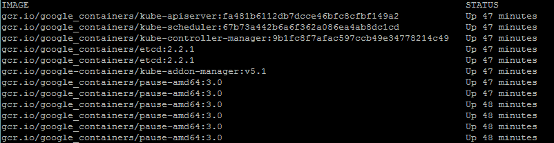

# 第一章：Kubernetes 简介

在本书中，我们将帮助您学习构建和管理 Kubernetes 集群。我们将尽可能地介绍一些基本的容器概念和操作上下文。在整本书中，您将得到一些您可以在学习过程中应用的示例。到本书结束时，您应该具有坚实的基础，甚至可以涉足一些更高级的主题，如联邦和安全性。

本章将简要概述容器及其工作原理，以及为何管理和编排对您的业务和/或项目团队至关重要。本章还将简要介绍 Kubernetes 编排如何增强我们的容器管理策略以及如何启动、运行和准备容器部署的基本 Kubernetes 集群。

本章将包括以下主题：

+   介绍容器的操作和管理

+   为什么容器管理很重要？

+   Kubernetes 的优势

+   下载最新的 Kubernetes

+   安装和启动一个新的 Kubernetes 集群

+   Kubernetes 集群的组件

# 容器的简要概述

在过去的三年里，**容器**像野火般风靡。你很难参加一个 IT 会议而不找到关于 Docker 或容器的热门议题。

Docker 是大规模采用和容器领域的激情的核心。正如 Malcom McLean 在 1950 年代通过创建标准化的运输集装箱彻底改变了物理运输世界一样，Linux 容器正在通过使应用程序环境在基础设施景观中可移植和一致来改变软件开发世界。作为一个组织，Docker 将现有的容器技术提升到一个新的水平，使其易于在各种环境和提供者中实施和复制。

# 什么是容器？

容器技术的核心是**控制组**（**cgroups**）和命名空间。此外，Docker 使用联合文件系统来增强容器开发过程的优势。

Cgroups 的工作原理是允许主机共享并限制每个进程或容器可以消耗的资源。这对资源利用和安全都很重要，因为它可以防止对主机硬件资源的**拒绝服务攻击**。多个容器可以共享 CPU 和内存，同时保持在预定义约束内。

**命名空间**为操作系统内的进程交互提供了另一种隔离形式。命名空间限制了一个进程对其他进程、网络、文件系统和用户 ID 组件的可见性。容器进程只能看到相同命名空间中的内容。来自容器或主机的进程无法直接从容器进程内部访问。此外，Docker 为每个容器提供了自己的网络堆栈，以类似的方式保护套接字和接口。


容器的组成

**联合文件系统**也是使用 Docker 容器的一个关键优势。容器是从镜像运行的。与虚拟机或云世界中的镜像类似，它代表了特定时间点的状态。容器镜像快照文件系统，但通常比虚拟机小得多。容器共享主机内核，并且通常运行一组更小的进程，因此文件系统和引导期间 tend to be much smaller。尽管这些约束条件并不严格执行。其次，联合文件系统允许高效存储、下载和执行这些镜像。

理解联合文件系统最简单的方法是将其想象成一个独立烘焙的层层蛋糕。Linux 内核是我们的基础层；然后，我们可能会添加一个操作系统，如**红帽 Linux**或**Ubuntu**。接下来，我们可能会添加一个应用程序，如**Nginx**或**Apache**。每个更改都会创建一个新层。最后，随着您进行更改并添加新层，您始终会有一个顶层（考虑一下糖霜），它是一个可写的层。


分层文件系统

使这真正高效的是 Docker 在第一次构建时缓存了这些层。所以，假设我们有一个包含 Ubuntu 的镜像，然后添加 Apache 并构建镜像。接下来，我们使用 Ubuntu 作为基础构建 MySQL。第二次构建将会更快，因为 Ubuntu 层已经被缓存了。本质上，我们的巧克力和香草层，来自前面的*分层文件系统*图，已经烘焙完成。我们只需要烘焙开心果（MySQL）层，组装并添加糖衣（可写层）。

# 为什么容器如此酷？

单独的容器并不是一种新技术，事实上它们已经存在多年了。真正使 Docker 脱颖而出的是他们为社区带来的工具和易用性。现代开发实践推广了持续集成和持续部署的使用。当这些技术正确使用时，可以对您的软件产品质量产生深远的影响。

# 持续集成/持续部署的优势

ThoughtWorks 将**持续集成**定义为一种开发实践，要求开发人员每天将代码集成到一个共享的代码库中多次。通过持续构建和部署代码的过程，组织能够将质量控制和测试作为日常工作周期的一部分。结果是更新和错误修复发生得更快，整体质量得到提高。

然而，一直以来在创建与测试和生产环境匹配的开发环境方面存在挑战。通常，这些环境中的不一致性使得很难充分利用持续交付的全部优势。

使用 Docker，开发人员现在能够拥有真正可移植的部署。在开发人员的笔记本电脑上部署的容器很容易部署到内部的暂存服务器上。然后，它们很容易转移到在云中运行的生产服务器上。这是因为 Docker 使用构建文件来构建容器，这些构建文件指定了父层。这样做的一个优点是，可以非常轻松地确保在开发、暂存和生产环境中操作系统、软件包和应用程序版本相同。

因为所有的依赖关系都打包到了层中，所以同一个主机服务器可以运行多个容器，运行各种操作系统或软件包版本。此外，我们可以在同一台主机服务器上使用各种语言和框架，而不会像在带有单个操作系统的**虚拟机**（**VM**）中那样出现典型的依赖冲突。

# 资源利用

明确定义的隔离和分层文件系统也使得容器非常适合运行具有非常小的占地面积和特定领域用途的系统。简化的部署和发布流程意味着我们可以快速而频繁地部署。因此，许多公司将他们的部署时间从几周甚至几个月缩短到了几天甚至几小时。这种开发生命周期非常适合于小型、有针对性的团队致力于一个更大的应用程序的小块。

# 微服务与编排

当我们将一个应用程序分解为非常具体的领域时，我们需要一种统一的方式在所有不同的部分和领域之间进行通信。多年来，Web 服务一直在发挥这种作用，但容器带来的额外隔离和粒度聚焦为**微服务**铺平了道路。

对于微服务的定义可能有点模糊，但是马丁·福勒（Martin Fowler）提出了一个定义，他是一位备受尊敬的软件开发作家和演讲者（你可以在本章末尾的*参考资料*中参考更多详细信息）：

简而言之，微服务架构风格是将单个应用程序开发为一套小服务的方法，每个服务在自己的进程中运行，并使用轻量级机制进行通信，通常是 HTTP 资源 API。这些服务围绕业务功能构建，并通过完全自动化的部署机制独立部署。这些服务的集中管理是最小的，它们可以使用不同的编程语言编写，并使用不同的数据存储技术。

随着组织转向容器化，并且微服务在组织中发展，他们很快就会需要一种策略来维护许多容器和微服务。未来几年，一些组织将拥有数百甚至数千个正在运行的容器。

# 未来的挑战

生命周期进程本身就是运营和管理的重要组成部分。当容器失败时，我们如何自动恢复？哪些上游服务受到这种中断的影响？我们如何在最小停机时间内打补丁我们的应用？随着流量增长，我们如何扩展容器和服务的规模？

网络和处理也是重要的考虑因素。有些进程是同一服务的一部分，可能会受益于靠近网络。例如，数据库可能会向特定的微服务发送大量数据进行处理。我们如何在集群中将容器放置在彼此附近？是否有需要访问的共同数据？如何发现新服务并使其对其他系统可用？

资源利用率也是关键。容器的小占用空间意味着我们可以优化基础架构以实现更大的利用率。扩展弹性云中开始的节省将使我们更进一步地减少浪费的硬件。我们如何最有效地安排工作负载？如何确保我们的重要应用程序始终具有正确的资源？我们如何在备用容量上运行不太重要的工作负载？

最后，可移植性是许多组织转向容器化的关键因素。Docker 使在各种操作系统、云提供商和本地硬件甚至开发人员笔记本电脑上部署标准容器变得非常容易。然而，我们仍然需要工具来移动容器。我们如何在集群的不同节点之间移动容器？我们如何以最小的中断滚动更新？我们使用什么流程执行蓝绿部署或金丝雀发布？ 

无论您是开始构建单个微服务并将关注点分离到隔离的容器中，还是只是想充分利用应用程序开发中的可移植性和不变性，对管理和编排的需求变得明确起来。这就是编排工具如 Kubernetes 提供最大价值的地方。

# Kubernetes 的诞生

**Kubernetes**（**K8s**）是谷歌于 2014 年 6 月发布的一个开源项目。谷歌发布该项目是为了与社区分享他们自己的基础设施和技术优势。

Google 每周在他们的基础设施中启动 20 亿个容器，并已经使用容器技术超过十年。最初，他们正在构建一个名为**Borg**，现在称为**Omega**的系统，用于在扩展中的数据中心中调度大量工作负载。多年来，他们吸取了许多经验教训，并重写了他们现有的数据中心管理工具，以便广泛被世界其他地方采纳。其结果便是开源项目 Kubernetes（您可以在本章末尾的*参考资料*部分中的第 3 点中了解更多详情）。

自 2014 年首次发布以来，K8s 在开源社区的贡献下经历了快速发展，包括 Red Hat、VMware 和 Canonical 等。Kubernetes 的 1.0 版本于 2015 年 7 月正式发布。从那时起，该项目得到了开源社区的广泛支持，目前是 GitHub 上最大的开源社区之一。我们将在整本书中涵盖版本 1.5。K8s 提供了一个工具，用于解决一些主要操作和管理问题。我们将探讨 Kubernetes 如何帮助处理资源利用、高可用性、更新、打补丁、网络、服务发现、监控和日志记录等问题。

# 我们的第一个集群

Kubernetes 支持各种平台和操作系统。在本书的示例中，我在客户端使用 Ubuntu 16.04 Linux VirtualBox，而在集群本身则使用 Debian 的**Google Compute Engine**（**GCE**）。我们还将简要介绍在使用 Ubuntu 的**Amazon Web Services**（**AWS**）上运行的集群。

为节省一些资金，GCP 和 AWS 都为他们的云基础设施提供了免费层和试用优惠。如果可能的话，值得使用这些免费试用来学习 Kubernetes。

本书中的大部分概念和示例应该适用于任何 Kubernetes 集群的安装。要获取有关其他平台设置的更多信息，请参考以下 GitHub 链接中的 Kubernetes 入门页面：

[`kubernetes.io/docs/getting-started-guides/`](http://kubernetes.io/docs/getting-started-guides/)

首先，在安装 Kubernetes 之前，让我们确保我们的环境已经正确设置。从更新软件包开始：

```
$ sudo apt-get update

```

如果没有安装 Python 和 curl，请先安装：

```
$ sudo apt-get install python
$ sudo apt-get install curl

```

安装**gcloud** SDK：

```
$ curl https://sdk.cloud.google.com | bash

```

在`gcloud`出现在我们的路径之前，我们需要启动一个新的 shell。

配置您的**Google Cloud Platform**（**GCP**）帐户信息。这应该会自动打开一个浏览器，我们可以从中登录到我们的 Google Cloud 帐户并授权 SDK：

```
$ gcloud auth login

```

如果您登录遇到问题或想要使用其他浏览器，可以选择使用`--no-launch-browser`命令。将 URL 复制并粘贴到您选择的计算机和/或浏览器上。使用您的 Google Cloud 凭据登录，并在权限页面上单击**允许**。最后，您应该收到一个授权码，可以将其复制并粘贴回等待提示的 shell 中。

默认项目应该已设置，但我们可以通过以下命令进行验证：

```
$ gcloud config list project

```

我们可以使用以下命令修改并设置新的默认项目。确保使用**项目 ID**而不是**项目名称**，如下所示：

```
$ gcloud config set project <PROJECT ID>

```

我们可以在以下 URL 中的控制台中找到我们的项目 ID：

[`console.developers.google.com/project`](https://console.developers.google.com/project) 或者，我们可以列出活动项目：

`$ gcloud alpha projects list`

现在我们已经设置好了环境，安装最新的 Kubernetes 版本只需一步，如下所示：

```
$ curl -sS https://get.k8s.io | bash

```

根据您的连接速度下载 Kubernetes 可能需要一两分钟的时间。较早的版本会自动调用`kube-up.sh`脚本并开始构建我们的集群。在版本 1.5 中，我们需要自己调用`kube-up.sh`脚本来启动集群。默认情况下，它将使用 Google Cloud 和 GCE：

```
$ kubernetes/cluster/kube-up.sh

```

在运行`kube-up.sh`脚本后，我们将看到许多行通过。让我们逐个部分查看它们：


GCE 先决条件检查

如果您的`gcloud`组件不是最新版本，则可能会提示您更新它们。

前面的图像*GCE 先决条件检查*显示了先决条件的检查，以及确保所有组件都是最新版本的情况。这是针对每个提供程序的。在 GCE 的情况下，它将验证 SDK 是否已安装以及所有组件是否是最新版本。如果不是，则会在此时看到提示进行安装或更新：


上传集群软件包

现在脚本正在启动集群。同样，这是针对提供程序的。对于 GCE，它首先检查 SDK 是否配置为默认的**项目**和**区域**。如果设置了，您将在输出中看到它们。

接下来，它将服务器二进制文件上传到 Google Cloud 存储中，如在创建 gs:... 行中所示：


Master 创建

然后，它会检查是否已经运行了集群的任何部分。然后，我们最终开始创建集群。在上述图中的输出中 *Master 创建* 中，我们看到它创建了**主**服务器、IP 地址以及集群的适当防火墙配置：


Minion 创建

最后，它创建了我们集群的**minions**或**nodes**。这是我们的容器工作负载实际运行的地方。它将不断循环并等待所有 minions 启动。默认情况下，集群将有四个节点（minions），但 K8s 支持超过 1000 个（很快会更多）。我们将在书中稍后回来扩展节点。


集群完成

现在一切都创建好了，集群已初始化并启动。假设一切顺利，我们将获得主服务器的 IP 地址。此外，请注意，配置以及集群管理凭据都存储在`home/<用户名>/.kube/config`中：


集群验证

然后，脚本将验证集群。此时，我们不再运行特定于提供程序的代码。验证脚本将通过`kubectl.sh`脚本查询集群。这是管理我们集群的中央脚本。在这种情况下，它检查找到的、注册的和处于就绪状态的 minion 数量。它循环执行，给集群最多 10 分钟的时间完成初始化。

成功启动后，在屏幕上打印出 minion 的摘要和集群组件的健康状况：


集群摘要

最后，运行`kubectl cluster-info`命令，该命令会输出主服务的 URL，包括 DNS、UI 和监视。让我们来看看其中一些组件。

# Kubernetes UI

在浏览器中打开并运行以下代码：

`https://<你的主服务器 IP>/ui/`

默认情况下，证书是自签名的，因此您需要忽略浏览器中的警告，然后继续。之后，我们将看到一个登录对话框。这是我们在 K8s 安装期间列出的凭据的使用位置。我们可以随时通过简单地使用`config`命令来查找它们：

```
$ kubectl config view

```

现在我们有了登录凭据，请使用它们，我们应该会看到一个类似以下图像的仪表板：


Kubernetes UI 仪表板

主仪表板首先将我们带到一个显示不多的页面。有一个链接可以部署一个容器化应用程序，这将带您到一个用于部署的 GUI。这个 GUI 可以是一个非常简单的方式开始部署应用程序，而不必担心 Kubernetes 的 YAML 语法。然而，随着您对容器的使用逐渐成熟，最好使用检入源代码控制的 YAML 定义。

如果您点击左侧菜单中的**Nodes**链接，您将看到有关当前集群节点的一些指标：


Kubernetes 节点仪表板

在顶部，我们看到 CPU 和内存使用情况的汇总，然后是我们集群节点的列表。单击其中一个节点将带我们到一个页面，显示有关该节点、其健康状况和各种指标的详细信息。

随着我们开始启动真实应用程序并向集群添加配置，Kubernetes UI 将具有许多其他视图，这些视图将变得更加有用。

# Grafana

默认安装的另一个服务是**Grafana**。这个工具将为我们提供一个仪表板，用于查看集群节点上的指标。我们可以使用以下语法在浏览器中访问它：`https://<your master ip>/api/v1/proxy/namespaces/kube-system/services/monitoring-grafana`


Kubernetes Grafana 仪表板

从主页，点击首页下拉菜单并选择 Cluster。在这里，Kubernetes 实际上正在运行许多服务。**Heapster** 用于收集**pods**和**nodes**上的资源使用情况，并将信息存储在**InfluxDB**中。结果，如 CPU 和内存使用情况，是我们在 Grafana UI 中看到的。我们将在第八章，*监控和日志记录*中深入探讨此问题。

# 命令行

`kubectl`脚本有命令来探索我们的集群以及在其中运行的工作负载。您可以在`/kubernetes/client/bin`文件夹中找到它。我们将在整本书中使用此命令，因此让我们花一点时间设置我们的环境。我们可以通过以下方式将二进制文件夹放在我们的`PATH`中来执行此操作：

```
$ export PATH=$PATH:/<Path where you downloaded K8s>/kubernetes/client/bin
$ chmod +x /<Path where you downloaded K8s>/kubernetes/client/bin

```

您可以选择将`kubernetes`文件夹下载到主目录之外，因此根据需要修改上述命令。

通过将`export`命令添加到您主目录中的`.bashrc`文件的末尾，也是一个不错的主意。

现在我们的路径上有了`kubectl`，我们可以开始使用它了。它有相当多的命令。由于我们尚未启动任何应用程序，因此这些命令中的大多数将不会很有趣。但是，我们可以立即使用两个命令进行探索。

首先，我们已经在初始化期间看到了`cluster-info`命令，但是我们随时可以使用以下命令再次运行它：

```
$ kubectl cluster-info

```

另一个有用的命令是`get`。它可用于查看当前正在运行的**服务**、**pods**、**副本控制器**等等。以下是立即使用的三个示例：

+   列出我们集群中的节点：

```
    $ kubectl get nodes

```

+   列出集群事件：

```
    $ kubectl get events

```

+   最后，我们可以查看集群中运行的任何服务，如下所示：

```
    $ kubectl get services

```

起初，我们只会看到一个名为`kubernetes`的服务。此服务是集群的核心 API 服务器。

# 运行在主节点上的服务

让我们进一步了解我们的新集群及其核心服务。默认情况下，机器以`kubernetes-`前缀命名。我们可以在启动集群之前使用`$KUBE_GCE_INSTANCE_PREFIX`修改这个前缀。对于我们刚刚启动的集群，主节点应该被命名为`kubernetes-master`。我们可以使用`gcloud`命令行实用程序 SSH 进入机器。以下命令将启动与主节点的 SSH 会话。确保替换您的项目 ID 和区域以匹配您的环境。还要注意，您可以使用以下语法从 Google Cloud 控制台启动 SSH：

```
$ gcloud compute ssh --zone "<your gce zone>" "kubernetes-master"

```

如果您在使用 Google Cloud CLI 时遇到 SSH 问题，您可以使用内置的 SSH 客户端的控制台。只需转到 VM 实例页面，您将在 kubernetes-master 列表中的一列中看到一个 SSH 选项。或者，VM 实例详细信息页面顶部有 SSH 选项。

一旦我们登录，我们应该会得到一个标准的 shell 提示符。让我们运行过滤 `Image` 和 `Status` 的 `docker` 命令：

```
$ sudo docker ps --format 'table {{.Image}}t{{.Status}}' 

```


主容器列表

尽管我们尚未在 Kubernetes 上部署任何应用程序，但我们注意到已经有几个容器正在运行。以下是对每个容器的简要描述：

+   `fluentd-gcp`：这个容器收集并发送集群日志文件到 Google Cloud Logging 服务。

+   `node-problem-detector`：这个容器是一个守护程序，在每个节点上运行，并当前在硬件和内核层检测问题。

+   `rescheduler`：这是另一个附加容器，确保关键组件始终运行。在资源可用性低的情况下，它甚至可能删除较不重要的 pod 以腾出空间。

+   `glbc`：这是另一个 Kubernetes 附加容器，使用新的 *Ingress* 功能提供 Google Cloud 第 7 层负载均衡。

+   `kube-addon-manager`：这个组件是通过各种附加组件扩展 Kubernetes 的核心。它还定期应用对 `/etc/kubernetes/addons` 目录的任何更改。

+   `etcd-empty-dir-cleanup`：一个用于清理 etcd 中空键的实用程序。

+   `kube-controller-manager`：这是一个控制器管理器，控制各种集群功能，确保准确和最新的复制是其重要角色之一。此外，它监视、管理和发现新节点。最后，它管理和更新服务端点。

+   `kube-apiserver`：这个容器运行 API 服务器。正如我们在 Swagger 界面中探索的那样，这个 RESTful API 允许我们创建、查询、更新和删除 Kubernetes 集群的各种组件。

+   `kube-scheduler`：这个调度程序将未调度的 pod 绑定到节点，基于当前的调度算法。

+   `etcd`：这个容器运行由 CoreOS 构建的 **etcd** 软件，它是一个分布式和一致的键值存储。这是 Kubernetes 集群状态被存储、更新和检索的地方，被 K8s 的各种组件使用。

+   `pause`：这个容器通常被称为 pod 基础设施容器，用于设置和保存每个 pod 的网络命名空间和资源限制。

我省略了许多名称的 amd64，以使其更通用。pod 的目的保持不变。

要退出 SSH 会话，只需在提示符处键入 `exit`。

在下一章中，我们还将展示一些这些服务如何在第一张图片中共同工作，*Kubernetes 核心架构*。

# 服务运行在 minions 上

我们可以 SSH 到其中一个 minion，但由于 Kubernetes 在整个集群上调度工作负载，因此我们不会在单个 minion 上看到所有容器。但是，我们可以使用 `kubectl` 命令查看所有 minion 上运行的 Pod：

```
$ kubectl get pods

```

由于我们尚未在集群上启动任何应用程序，因此我们看不到任何 Pod。但实际上，有几个系统 Pod 运行着 Kubernetes 基础架构的各个部分。我们可以通过指定 `kube-system` 命名空间来查看这些 Pod。稍后我们将探讨命名空间及其重要性，但目前可以使用 `--namespace=kube-system` 命令来查看这些 K8s 系统资源，如下所示：

```
$ kubectl get pods --namespace=kube-system

```

我们应该看到类似以下的内容：

```
etcd-empty-dir-cleanup-kubernetes-master 
etcd-server-events-kubernetes-master 
etcd-server-kubernetes-master 
fluentd-cloud-logging-kubernetes-master 
fluentd-cloud-logging-kubernetes-minion-group-xxxx
heapster-v1.2.0-xxxx 
kube-addon-manager-kubernetes-master 
kube-apiserver-kubernetes-master 
kube-controller-manager-kubernetes-master 
kube-dns-xxxx 
kube-dns-autoscaler-xxxx 
kube-proxy-kubernetes-minion-group-xxxx 
kube-scheduler-kubernetes-master 
kubernetes-dashboard-xxxx 
l7-default-backend-xxxx 
l7-lb-controller-v0.8.0-kubernetes-master 
monitoring-influxdb-grafana-xxxx 
node-problem-detector-v0.1-xxxx 
rescheduler-v0.2.1-kubernetes-master

```

前六行应该看起来很熟悉。其中一些是我们看到在主节点上运行的服务，而在节点上也会看到其中的部分。还有一些其他服务我们还没有看到。`kube-dns` 选项提供了 DNS 和服务发现的基本结构，`kubernetes-dashboard-xxxx` 是 Kubernetes 的用户界面，`l7-default-backend-xxxx` 提供了新的第 7 层负载均衡功能的默认负载均衡后端，`heapster-v1.2.0-xxxx` 和 `monitoring-influx-grafana` 提供了 **Heapster** 数据库和用于监视集群资源使用情况的用户界面。最后，`kube-proxy-kubernetes-minion-group-xxxx` 是将流量定向到集群上正确后备服务和 Pod 的代理。

如果我们 SSH 到一个随机的 minion，我们会看到几个容器跨越其中一些 Pod 运行。示例可能看起来像这样的图片：


Minion 容器列表

同样，我们在主节点上看到了类似的服务排列。我们在主节点上没有看到的服务包括以下内容：

+   `kubedns`：此容器监视 Kubernetes 中的服务和端点资源，并同步 DNS 查询的任何更改。

+   `kube-dnsmasq`：这是另一个提供 DNS 缓存的容器。

+   `dnsmasq-metrics`：这为集群中的 DNS 服务提供度量报告。

+   `l7-defaultbackend`：这是用于处理 GCE L7 负载均衡器和 *Ingress* 的默认后端。

+   `kube-proxy`：这是集群的网络和服务代理。此组件确保服务流量被定向到集群上运行工作负载的位置。我们将在本书后面更深入地探讨这一点。

+   `heapster`：此容器用于监视和分析。

+   `addon-resizer`：这个集群实用工具用于调整容器的规模。

+   `heapster_grafana`：此操作用于资源使用情况和监控。

+   `heapster_influxdb`：这个时序数据库用于 Heapster 数据。

+   `cluster-proportional-autoscaler`：这个集群实用工具用于根据集群大小按比例调整容器的规模。

+   `exechealthz`：此操作对 Pod 执行健康检查。

再次，我省略了许多名称中的 amd64，以使其更通用。Pod 的用途保持不变。

# 拆除集群

好的，这是我们在 GCE 上的第一个集群，但让我们探索一些其他提供商。为了保持简单，我们需要删除我们刚刚在 GCE 上创建的那个。我们可以用一个简单的命令拆除集群：

```
$ kube-down.sh

```

# 与其他提供商合作

默认情况下，Kubernetes 使用 GCE 提供商进行 Google Cloud。我们可以通过设置`KUBERNETES_PROVIDER`环境变量来覆盖此默认值。此表中列出的值支持以下提供商：

| **提供商** | **KUBERNETES_PROVIDER 值** | **类型** |
| --- | --- | --- |
| **谷歌计算引擎** | `gce` | 公有云 |
| **谷歌容器引擎** | `gke` | 公有云 |
| **亚马逊网络服务** | `aws` | 公有云 |
| **微软 Azure** | `azure` | 公有云 |
| **Hashicorp Vagrant** | `vagrant` | 虚拟开发环境 |
| **VMware vSphere** | `vsphere` | 私有云/本地虚拟化 |
| **运行 CoreOS 的 Libvirt** | `libvirt-coreos` | 虚拟化管理工具 |
| **Canonical Juju（Ubuntu 背后的人）** | `juju` | 操作系统服务编排工具 |

Kubernetes 提供商

让我们尝试在 AWS 上设置集群。作为先决条件，我们需要安装并为我们的帐户配置 AWS **命令行界面**（**CLI**）。AWS CLI 的安装和配置文档可以在以下链接找到：

+   安装文档：[`docs.aws.amazon.com/cli/latest/userguide/installing.html#install-bundle-other-os`](http://docs.aws.amazon.com/cli/latest/userguide/installing.html#install-bundle-other-os)

+   配置文档：[`docs.aws.amazon.com/cli/latest/userguide/cli-chap-getting-started.html`](http://docs.aws.amazon.com/cli/latest/userguide/cli-chap-getting-started.html)

然后，这是一个简单的环境变量设置，如下所示：

```
$ export KUBERNETES_PROVIDER=aws

```

再次，我们可以使用`kube-up.sh`命令来启动集群，如下所示：

```
$ kube-up.sh

```

与 GCE 一样，设置活动将需要几分钟。它将在我们的 AWS 帐户中的**S3**中分阶段文件，并创建适当的实例、**虚拟专用云**（**VPC**）、安全组等等。然后，将设置并启动 Kubernetes 集群。一旦一切都完成并启动，我们应该在输出的末尾看到集群验证：


AWS 集群验证

请注意，集群启动的区域由`KUBE_AWS_ZONE`环境变量确定。默认情况下，此值设置为`us-west-2a`（该区域是从此可用区派生的）。即使您在 AWS CLI 中设置了区域，它也将使用`KUBE_AWS_ZONE`中定义的区域。

再次，我们将 SSH 进入 master。这次，我们可以使用本机 SSH 客户端。我们会在`/home/<username>/.ssh`中找到密钥文件：

```
$ ssh -v -i /home/<username>/.ssh/kube_aws_rsa ubuntu@<Your master IP>

```

我们将使用`sudo docker ps --format 'table {{.Image}}t{{.Status}}'`来探索正在运行的容器。我们应该看到类似下面的东西：



Master 容器列表（AWS）

我们看到与我们的 GCE 集群相同的一些容器。但也有一些缺失的。我们看到了核心 Kubernetes 组件，但缺少了 `fluentd-gcp` 服务以及一些新的实用程序，如 `node-problem-detector` 、`rescheduler` 、`glbc` 、`kube-addon-manager` 和 `etcd-empty-dir-cleanup`。这反映了各个公共云提供商之间在 `kube-up` 脚本中的一些微妙差异。这最终由庞大的 Kubernetes 开源社区的努力决定，但 GCP 通常最先拥有许多最新功能。

在 AWS 提供程序上，**Elasticsearch** 和 **Kibana** 已经为我们设置好。我们可以使用以下语法找到 Kibana UI 的 URL：

`https://<your master ip>/api/v1/proxy/namespaces/kube-system/services/kibana-logging`

就像 UI 的情况一样，您将被提示输入管理员凭据，可以使用 `config` 命令获取，如下所示：

```
$ kubectl config view

```

初次访问时，你需要设置你的索引。你可以保留默认值，并选择 @timestamp 作为时间字段名称。然后，单击创建，你将进入索引设置页面。从那里，点击顶部的 Discover 标签页，你可以探索日志仪表板：


Kubernetes Kibana 仪表板

# 重置集群

你刚刚对在 AWS 上运行集群有了一点体验。在本书的剩余部分，我将以 GCE 集群为例。为了更好地跟随示例，你可以轻松地回到 GCE 集群。

简单地拆除 AWS 集群，如下所示：

```
$ kube-down.sh

```

然后，再次使用以下方式创建 GCE 集群：

```
$ export KUBERNETES_PROVIDER=gce
$ kube-up.sh

```

# 修改 kube-up 参数

值得了解 `kube-up.sh` 脚本使用的参数。`kubernetes/cluster/` 文件夹下的每个提供程序都有自己的 `su` 文件夹，其中包含一个 `config-default.sh` 脚本。

例如，`kubernetes/cluster/aws/config-default.sh` 中有使用 AWS 运行 `kube-up.sh` 的默认设置。在该脚本的开头，你将看到许多这些值被定义以及可以用于覆盖默认值的环境变量。

在以下示例中，`ZONE` 变量被设置用于脚本，并且使用名为 `KUBE_AWS_ZONE` 的环境变量的值。如果此变量未设置，将使用默认值 `us-west-2a`：

```
ZONE=${KUBE_AWS_ZONE:-us-west-2a}

```

了解这些参数将帮助你更好地使用 `kube-up.sh` 脚本。

# kube-up.sh 的替代方法

`kube-up.sh` 脚本仍然是在你所选择的平台上开始使用 Kubernetes 的一种相当方便的方式。然而，它并非没有缺陷，有时在条件不尽如人意时可能会出现问题。

幸运的是，自 K8 成立以来，已经出现了许多创建集群的替代方法。其中两个 GitHub 项目是 *KOPs* 和 *kube-aws*。尽管后者与 AWS 绑定，但它们都提供了一种轻松启动新集群的替代方法：

+   **[`github.com/kubernetes/kops`](https://github.com/kubernetes/kops)**

+   **[`github.com/coreos/kube-aws`](https://github.com/coreos/kube-aws)**

另外，出现了许多受管服务，包括**Google Container Engine**（**GKE**）和微软**Azure Container Service**（**ACS**），它们提供了自动安装和一些受管的集群操作。我们将在第十二章中简要演示这些内容，*走向生产就绪*。

# 从零开始

最后，还有从零开始的选项。幸运的是，在 1.4 版本中，Kubernetes 团队在简化集群设置过程方面投入了重大精力。为此，他们引入了用于 Ubuntu 16.04、CentOS 7 和 HypriotOS v1.0.1+ 的 kubeadm。

让我们快速了解如何使用 kubeadm 工具从头开始在 AWS 上搭建集群。

# 集群设置

我们需要提前为集群主节点和节点进行部署。目前，我们受到先前列出的操作系统和版本的限制。此外，建议您至少有 1GB 的 RAM 并且所有节点之间必须具有网络连接。

在本次演示中，我们将在 AWS 上使用一个 t2.medium（主节点）和三个 t2.micro（工作节点）大小的实例。这些实例具有可突发的 CPU，并且配备了所需的最低 1GB RAM。我们需要创建一个主节点和三个工作节点。

我们还需要为集群创建一些安全组。对于主节点，需要以下端口：

| **类型** | **协议** | **端口范围** | **来源** |
| --- | --- | --- | --- |
| 所有流量 | 所有 | 所有 | {此 SG ID（主 SG）} |
| 所有流量 | 所有 | 所有 | {节点 SG ID} |
| SSH | TCP | 22 | {您的本地机器 IP} |
| HTTTPS | TCP | 443 | {允许访问 K8s API 和 UI 的范围} |

主节点安全组规则

下表显示了节点安全组的端口：

| **类型** | **协议** | **端口范围** | **来源** |
| --- | --- | --- | --- |
| 所有流量 | 所有 | 所有 | {主 SG ID} |
| 所有流量 | 所有 | 所有 | {此 SG ID（节点 SG）} |
| SSH | TCP | 22 | {您的本地机器 IP} |

节点安全组规则

一旦您拥有这些 SG，继续在 AWS 上启动四个实例（一个 t2.medium 和三个 t2.micros），使用 Ubuntu 16.04。如果您对 AWS 不熟悉，请参考以下网址中关于启动 EC2 实例的文档：

**[`docs.aws.amazon.com/AWSEC2/latest/UserGuide/LaunchingAndUsingInstances.html`](http://docs.aws.amazon.com/AWSEC2/latest/UserGuide/LaunchingAndUsingInstances.html)**

请确保将 t2.medium 实例标识为主节点，并关联主安全组。将其他三个命名为节点，并将节点安全组与它们关联。

这些步骤是根据手册中的演示进行调整的。要获取更多信息，或使用 Ubuntu 以外的替代方案，请参考 [`kubernetes.io/docs/getting-started-guides/kubeadm/`](https://kubernetes.io/docs/getting-started-guides/kubeadm/)。

# 安装 Kubernetes 组件（kubelet 和 kubeadm）

接下来，我们需要 SSH 进入所有四个实例并安装 Kubernetes 组件。

以 root 身份，在所有四个实例上执行以下步骤：

1\. 更新软件包并安装 `apt-transport-https` 软件包，以便我们可以从使用 HTTPS 的源下载：

```
 $ apt-get update 
 $ apt-get install -y apt-transport-https

```

2\. 安装 Google Cloud 的公共密钥：

```
 $ curl -s https://packages.cloud.google.com/apt/doc/apt-key.gpg |
   apt-key add -    

```

3\. 接下来，使用您喜欢的编辑器为 Kubernetes 包下载创建源列表：

```
 $ vi /etc/apt/sources.list.d/kubernetes.list

```

4\. 使用以下内容作为此文件的内容并保存：

```
 deb http://apt.kubernetes.io/ kubernetes-xenial main

```

*图示 1-1.* `/etc/apt/sources.list.d/kubernetes.list`

5\. 再次更新您的源：

```
 $ apt-get update

```

6\. 安装 Docker 和核心 Kubernetes 组件：

```
 $ apt-get install -y docker.io 
 $ apt-get install -y kubelet kubeadm kubectl kubernetes-cni

```

# 设置主节点

在您之前选择为 *master* 的实例上，我们将运行主初始化。再次以 root 身份运行以下命令：

```
$ kubeadm init 

```

请注意，初始化只能运行一次，所以如果遇到问题，您将 `kubeadm reset`。

# 加入节点

成功初始化后，您将获得一个可以被节点使用的加入命令。将其复制下来以供稍后的加入过程使用。它应该类似于这样：

```
$ kubeadm join --token=<some token> <master ip address>

```

令牌用于验证集群节点，因此请确保将其安全地存储在某个地方以供将来使用。

# 网络设置

我们的集群将需要一个网络层来使 pod 进行通信。请注意，kubeadm 需要一个 CNI 兼容的网络结构。当前可用插件的列表可以在此处找到：

**[`kubernetes.io/docs/admin/addons/`](http://kubernetes.io/docs/admin/addons/)**

对于我们的示例，我们将使用 calico。我们需要使用以下 `yaml` 在我们的集群上创建 calico 组件。为了方便起见，您可以在此处下载它：

**[`docs.projectcalico.org/v1.6/getting-started/kubernetes/installation/hosted/kubeadm/calico.yaml`](http://docs.projectcalico.org/v1.6/getting-started/kubernetes/installation/hosted/kubeadm/calico.yaml)**

一旦您在 *master* 上有了这个文件，请使用以下命令创建组件：

```
$ kubectl apply -f calico.yaml

```

给这个运行设置一分钟，然后列出 `kube-system` 节点以检查：

```
$ kubectl get pods --namespace=kube-system

```

你应该会得到类似下面的列表，其中有三个新的 calico pods 和一个未显示的已完成的作业：


Calico 设置

# 加入集群

现在我们需要在每个节点实例上运行之前复制的 `join` 命令：

```
$ kubeadm join --token=<some token> <master ip address>

```

完成后，您应该能够通过运行以下命令从主节点看到所有节点：

```
$ kubectl get nodes

```

如果一切顺利，这将显示三个节点和一个主节点，如下所示：


Calico 设置

# 概要

我们简要了解了容器的工作原理以及它们如何适合微服务中的新架构模式。现在，您应该更好地理解这两种力量将需要各种运维和管理任务，以及 Kubernetes 提供强大功能来解决这些挑战。我们在 GCE 和 AWS 上创建了两个不同的集群，并探索了启动脚本以及 Kubernetes 的一些内置功能。最后，我们看了`kube-up`脚本的替代方案，并尝试在 AWS 上使用 Ubuntu 16.04 使用新的 kubeadm 工具。

在下一章中，我们将探讨 K8s 提供的核心概念和抽象，用于管理容器和完整应用程序堆栈。我们还将介绍基本的调度、服务发现和健康检查。

# 参考资料

1.  Malcom McLean 在 PBS 网站上的条目：[`www.pbs.org/wgbh/theymadeamerica/whomade/mclean_hi.html`](https://www.pbs.org/wgbh/theymadeamerica/whomade/mclean_hi.html)

1.  Martin Fowler 关于微服务的观点：[`martinfowler.com/articles/microservices.html`](http://martinfowler.com/articles/microservices.html)

1.  Kubernetes GitHub 项目页面：[`github.com/kubernetes/kubernetes`](https://github.com/kubernetes/kubernetes)

1.  [`www.thoughtworks.com/continuous-integration`](https://www.thoughtworks.com/continuous-integration)

1.  [`docs.docker.com/`](https://en.wikipedia.org/wiki/Continuous_integration%20https:/docs.docker.com/)

1.  [`kubernetes.io/docs/getting-started-guides/kubeadm/`](http://kubernetes.io/docs/getting-started-guides/kubeadm/)
