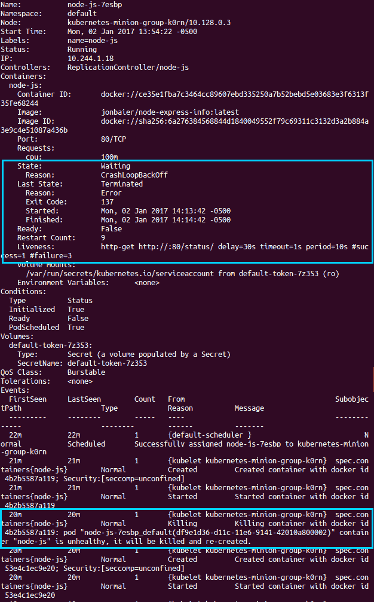

# 第二章：Pod、Service、Replication Controller 和 Label

本章将介绍核心 Kubernetes 构件，即**pod**、**service**、**replication controller**、**replica set**和**label**。将包括几个简单的应用示例，以演示每个构件。本章还将介绍集群的基本操作。最后，将通过几个示例介绍**健康检查**和**调度**。

本章将讨论以下主题：

+   Kubernetes 的整体架构

+   介绍核心 Kubernetes 构件，即 pod、service、replication controller、replica set 和 label。

+   了解标签如何简化 Kubernetes 集群的管理

+   了解如何监视服务和容器的健康状况

+   了解如何根据可用集群资源设置调度约束

# 架构

尽管**Docker**在容器管理方面带来了有用的抽象层和工具，但 Kubernetes 也为规模化编排容器和管理完整应用程序堆栈提供了类似的帮助。

**K8s**在堆栈上升，为我们提供处理应用程序或服务级别管理的构件。这为我们提供了自动化和工具，以确保高可用性、应用程序堆栈和服务的整体可移植性。K8s 还允许我们对资源使用进行更精细的控制，例如 CPU、内存和磁盘空间。

Kubernetes 通过给我们关键构件来组合多个容器、端点和数据成为完整的应用程序堆栈和服务，提供了这种更高级别的编排管理。K8s 还提供了管理堆栈及其组件的何时、何地和多少的工具：


Kubernetes 核心架构

在上图中，我们看到了 Kubernetes 的核心架构。大多数管理交互是通过`kubectl`脚本和/或对 API 的 RESTful 服务调用完成的。

注意仔细理解期望状态和实际状态的概念。这是 Kubernetes 管理集群及其工作负载的关键。K8s 的所有部件都在不断工作，监视当前的实际状态，并将其与管理员通过 API 服务器或`kubectl`脚本定义的期望状态同步。有时这些状态不会匹配，但系统始终在努力协调这两者。

# 主节点

实际上，**master**是我们集群的大脑。在这里，我们有核心 API 服务器，它维护 RESTful Web 服务，用于查询和定义我们期望的集群和工作负载状态。重要的是要注意，控制平面只通过主节点发起更改，而不是直接访问节点。

另外，主节点包括 **调度器**，它与 API 服务器一起工作，以在实际的从节点上调度 pod 形式的工作负载。这些 pod 包含组成我们应用程序堆栈的各种容器。默认情况下，基本的 Kubernetes 调度器将 pod 分布在整个集群中，并使用不同的节点来匹配 pod 的副本。Kubernetes 还允许为每个容器指定必要的资源，因此可以通过这些额外因素来改变调度。

复制控制器/副本集与 API 服务器一起工作，确保任何时候运行正确数量的 pod 副本。这是理想状态概念的典范。如果我们的复制控制器/副本集定义了三个副本，而我们的实际状态是两个 pod 副本正在运行，那么调度器将被调用，在集群的某个地方添加第三个 pod。如果在任何给定时间集群中运行的 pod 过多，也是如此。通过这种方式，K8s 总是朝着理想状态的方向努力。

最后，我们有 **etcd** 作为分布式配置存储运行。Kubernetes 状态存储在这里，etcd 允许监视值的变化。将其视为大脑的共享内存。

# 节点（以前称为 minions）

在每个节点中，我们有一些组件组成。**kubelet** 与 API 服务器交互，以更新状态并启动调度器调用的新工作负载。

**Kube-proxy** 提供基本负载均衡，并将特定服务的流量引导到后端合适的 pod。请参考本章后面的 *服务* 部分。

最后，我们有一些默认的 pod，运行节点的各种基础设施服务。正如我们在上一章节中简要探讨的那样，这些 pod 包括用于 **域名系统（DNS）**、日志记录和 pod 健康检查的服务。默认的 pod 将与我们在每个节点上调度的 pod 一起运行。

在 v1.0 中，**minion** 更名为 **node**，但在一些网络命名脚本和文档中仍然保留了 minion 一词的痕迹。为了清晰起见，在整本书中，我在一些地方同时添加了 minion 和 node 这两个术语。

# 核心构造

现在，让我们深入了解 Kubernetes 提供的一些核心抽象。这些抽象将使我们更容易思考我们的应用程序，减轻生命周期管理、高可用性和调度的负担。

# Pods

Pods 允许你将相关容器在网络和硬件基础设施方面保持密切联系。数据可以靠近应用程序，因此可以在不经历网络遍历的高延迟情况下进行处理。同样，常见的数据可以存储在多个容器之间共享的卷上。Pods 本质上允许你逻辑地将容器和应用程序堆栈的各部分组合在一起。

虽然 Pod 内部可能运行一个或多个容器，但 Pod 本身可能是在 Kubernetes 节点（从属节点）上运行的众多 Pod 之一。正如我们将看到的，Pod 为我们提供了一个逻辑容器组，我们可以在其中复制、调度并通过负载均衡服务端点。

# Pod 示例

让我们快速看一下 Pod 的操作。我们将在群集上启动一个**Node.js**应用程序。您需要为此运行一个 GCE 群集；如果您尚未启动群集，请参考*我们的第一个集群*部分，在第一章的*， Kubernetes 简介*中。

现在，让我们为我们的定义创建一个目录。在本例中，我将在我们的主目录下的`/book-examples`子文件夹中创建一个文件夹：

```
$ mkdir book-examples
$ cd book-examples
$ mkdir 02_example
$ cd 02_example

```

下载示例代码

您可以从您在[`www.packtpub.com`](http://www.packtpub.com)上的帐户中下载所有您购买的 Packt Publishing 图书的示例代码文件。如果您在其他地方购买了本书，您可以访问[`www.packtpub.com/support`](http://www.packtpub.com/support)并注册，将文件直接通过电子邮件发送给您。

使用您喜欢的编辑器创建以下文件：

```
apiVersion: v1 
kind: Pod 
metadata: 
  name: node-js-pod 
spec: 
  containers: 
  - name: node-js-pod 
    image: bitnami/apache:latest 
    ports: 
    - containerPort: 80

```

*清单 2-1*：`nodejs-pod.yaml`

此文件创建一个名为`node-js-pod`的 Pod，其中运行着最新的`bitnami/apache`容器，运行在端口`80`上。我们可以使用以下命令来检查：

```
$ kubectl create -f nodejs-pod.yaml

```

输出如下：

```
pod "node-js-pod" created

```

这样我们就可以运行指定容器的 Pod。我们可以通过运行以下命令查看有关 Pod 的更多信息：

```
$ kubectl describe pods/node-js-pod

```

您将看到大量信息，如 Pod 的状态、IP 地址，甚至相关的日志事件。您会注意到 Pod 的 IP 地址是私有 IP 地址，因此我们无法直接从本地计算机访问它。不用担心，因为`kubectl exec`命令反映出 Docker 的`exec`功能。一旦 Pod 显示为运行状态，我们就可以使用此功能在 Pod 内运行命令：

```
$ kubectl exec node-js-pod -- curl <private ip address>

```

默认情况下，这将在找到的第一个容器中运行命令，但您可以使用`-c`参数选择特定的容器。

运行命令后，您将看到一些 HTML 代码。在本章后面我们将有一个更漂亮的视图，但现在，我们可以看到我们的 Pod 确实按预期运行。

# 标签

标签为我们提供了另一种分类级别，在日常运维和管理方面非常有帮助。类似于标记，标签可以用作服务发现的基础，同时也是日常运维和管理任务的有用分组工具。

标签只是简单的键值对。您会在 Pod、复制控制器、副本集、服务等资源上看到它们。该标签充当选择器，告诉 Kubernetes 为各种操作使用哪些资源。可以将其视为过滤选项。

我们将在本章稍后更深入地看一下标签，但首先，我们将探索剩余的三个构造——服务、复制控制器和副本集。

# 容器的余生

正如 AWS 的首席技术官 Werner Vogels 所说的那样*一切都会遇到故障*：容器和 Pod 可能会崩溃、损坏，甚至可能会被手忙脚乱的管理员误关闭一个节点上的操作。强大的策略和安全实践如最低权限原则会遏制部分这类事件，但不可抗拒的工作量屠杀发生是运维的现实。

幸运的是，Kubernetes 提供了两个非常有价值的构建，以将这个庄严的事务都整洁地隐藏在幕后。服务和复制控制器/副本集使我们能够在几乎没有干扰和优雅恢复的情况下保持我们的应用程序运行。

# 服务

服务允许我们将访问方式与我们应用程序的消费者进行分离。使用可靠的端点，用户和其他程序能够无缝访问运行在您的集群上的 Pod。

K8s 通过确保集群中的每个节点运行一个名为**kube-proxy**的代理来实现这一点。正如其名称所示，**kube-proxy**的工作是将服务端点的通信代理回到运行实际应用程序的相应 Pod。


kube-proxy 架构

服务负载均衡池的成员资格由选择器和标签的使用确定。具有匹配标签的 Pod 被添加到候选列表中，服务将将流量转发给这些 Pod 中的一个。虚拟 IP 地址和端口被用作服务的入口点，然后流量被转发到由 K8s 或您的定义文件定义的目标端口上的随机 Pod。

服务定义的更新是从 K8s 集群主节点监视和协调，并传播到运行在每个节点上的**kube-proxy 守护程序**。

目前，kube-proxy 正在节点主机上运行。未来计划将其和 kubelet 默认容器化。

# 复制控制器和副本集

**复制控制器**（**RCs**）正如其名称所示，管理着 Pod 和包含的容器镜像运行的节点数。它们确保特定数量的此镜像的实例正在被运行。

随着您开始将容器和 Pod 运营化，您需要一种方式来滚动更新、扩展正在运行的副本数量（上下扩展），或者只需确保您的堆栈至少运行一个实例。RCs 提供了一个高级机制，以确保整个应用程序和集群的运行正常。

RC（Replication Controllers）的任务很简单，即确保您的应用程序具有所需的规模。您定义要运行的 Pod 副本的数量，并为其提供如何创建新 Pod 的模板。与服务一样，我们将使用选择器和标签来定义 Pod 在复制控制器中的成员资格。

Kubernetes 不要求复制控制器的严格行为，这对长时间运行的进程非常理想。事实上，**作业控制器**可以用于短期工作负载，允许作业运行到完成状态，并且非常适合批处理工作。

**副本集**，是一种新型类型，目前处于 Beta 版，代表了复制控制器的改进版本。目前的主要区别在于能够使用新的基于集合的标签选择器，正如我们将在下面的示例中看到的。

# 我们的第一个 Kubernetes 应用程序

在我们继续之前，让我们看看这三个概念是如何运作的。Kubernetes 预装了许多示例，但我们将从零开始创建一个新示例来说明一些概念。

我们已经创建了一个 pod 定义文件，但是正如你所学到的，通过复制控制器运行我们的 pod 有许多优势。再次使用我们之前创建的 `book-examples/02_example` 文件夹，我们将创建一些定义文件，并使用复制控制器方法启动一个 Node.js 服务器集群。此外，我们还将使用负载均衡服务为其添加一个公共面孔。

使用您喜欢的编辑器创建以下文件：

```
apiVersion: v1 
kind: ReplicationController 
metadata: 
  name: node-js 
  labels: 
    name: node-js 
spec: 
  replicas: 3 
  selector: 
    name: node-js 
  template: 
    metadata: 
      labels: 
        name: node-js 
    spec: 
      containers: 
      - name: node-js 
        image: jonbaier/node-express-info:latest 
        ports: 
        - containerPort: 80

```

*清单 2-2*：`nodejs-controller.yaml`

这是我们集群的第一个资源定义文件，让我们仔细看一看。您会注意到它有四个一级元素（`kind`、`apiVersion`、`metadata` 和 `spec`）。这些在所有顶级 Kubernetes 资源定义中都很常见：

+   `类型`：这告诉 K8s 我们正在创建的资源类型。在这种情况下，类型是 `ReplicationController`。`kubectl` 脚本使用单个 `create` 命令来处理所有类型的资源。这里的好处是您可以轻松创建各种类型的资源，而无需为每种类型指定单独的参数。但是，这要求定义文件能够识别它们所指定的内容。

+   `apiVersion`：这只是告诉 Kubernetes 我们正在使用的模式的版本。

+   `元数据`：在这里，我们将为资源指定一个名称，并指定将用于搜索和选择给定操作的资源的标签。元数据元素还允许您创建注释，这些注释用于非标识信息，可能对客户端工具和库有用。

+   最后，我们有 `spec`，它将根据我们正在创建的资源的 `kind` 或类型而变化。在这种情况下，它是 `ReplicationController`，它确保所需数量的 pod 正在运行。`replicas` 元素定义了所需的 pod 数量，`selector` 元素告诉控制器要监视哪些 pod，最后，`template` 元素定义了启动新 pod 的模板。`template` 部分包含我们之前在 pod 定义中看到的相同部分。需要注意的一点是，`selector` 值需要与 pod 模板中指定的 `labels` 值匹配。请记住，这种匹配用于选择正在管理的 pod。

现在，让我们来看一下服务定义：

```
apiVersion: v1 
kind: Service 
metadata: 
  name: node-js 
  labels: 
    name: node-js 
spec: 
  type: LoadBalancer 
  ports: 
  - port: 80 
  selector: 
    name: node-js

```

*清单 2-3*: `nodejs-rc-service.yaml`

这里的 YAML 与 `ReplicationController` 类似。主要区别在于服务的 `spec` 元素中。在这里，我们定义了 `Service` 类型，监听 `port` 和 `selector`，告诉 `Service` 代理哪些 pod 可以回答该服务。

Kubernetes 支持 YAML 和 JSON 两种格式的定义文件。

创建 Node.js express 复制控制器：

```
$ kubectl create -f nodejs-controller.yaml

```

输出如下：

```
replicationcontroller "node-js" created

```

这给了我们一个复制控制器，确保容器始终运行三个副本：

```
$ kubectl create -f nodejs-rc-service.yaml

```

输出如下：

```
service "node-js" created 

```

在 GCE 上，这将创建一个外部负载均衡器和转发规则，但您可能需要添加额外的防火墙规则。在我的情况下，防火墙已经为端口 `80` 打开。但是，您可能需要打开此端口，特别是如果您部署了具有端口不是 `80` 和 `443` 的服务。

好了，现在我们有了一个运行中的服务，这意味着我们可以从可靠的 URL 访问 Node.js 服务器。让我们来看看我们正在运行的服务：

```
$ kubectl get services

```

以下截图是前面命令的结果：


服务列表

在前面的图像（*服务列表*）中，我们应该注意到 `node-js` 服务正在运行，并且在 IP(S) 列中，我们应该有一个私有和一个公共的（截图中为 `130.211.186.84`）IP 地址。如果您看不到外部 IP，请等待一分钟以从 GCE 中分配 IP。让我们尝试在浏览器中打开公共地址来连接：


容器信息应用程序

您应该看到类似 *容器信息应用程序* 的图形。如果我们多次访问，您应该注意到容器名称的变化。基本上，服务负载均衡器在后端可用的 pod 之间轮转。

浏览器通常会缓存网页，所以要真正看到容器名称的变化，您可能需要清除缓存或使用像这样的代理：

[`hide.me/en/proxy`](https://hide.me/en/proxy)

让我们试着玩一下混沌猴，关闭一些容器，看看 Kubernetes 会做什么。为了做到这一点，我们需要查看 pod 实际运行的位置。首先，让我们列出我们的 pod：

```
$ kubectl get pods

```

以下截图是前面命令的结果：


当前正在运行的 Pod

现在，让我们对运行`node-js`容器的一个 Pod 获取更多详细信息。你可以使用上一个命令中列出的一个 Pod 名称执行此操作：

```
$ kubectl describe pod/node-js-sjc03

```

以下截图是前述命令的结果：


Pod 描述

你应该看到前面的输出。我们需要的信息是`Node:`部分。让我们使用节点名称**SSH**（缩写为**安全外壳**）进入运行此工作负载的（从属）节点：

```
$ gcloud compute --project "<Your project ID>" ssh --zone "<your gce zone>" "<Node from
pod describe>"

```

一旦 SSH 进入节点，如果我们运行`sudo docker ps`命令，我们应该会看到至少两个容器：一个运行`pause`镜像，另一个运行实际的`node-express-info`镜像。如果 K8s 在此节点上调度了多个副本，则可能会看到更多。让我们获取`jonbaier/node-express-info`镜像（而不是`gcr.io/google_containers/pause`）的容器 ID 并将其杀死以查看发生了什么。稍后记下此容器 ID：

```
$ sudo docker ps --filter="name=node-js"
$ sudo docker stop <node-express container id>
$ sudo docker rm <container id>
$ sudo docker ps --filter="name=node-js"

```

除非你非常迅速，否则你可能会注意到仍然有一个`node-express-info`容器在运行，但仔细观察你会发现`容器 id`不同，并且创建时间戳显示只是几秒钟前。如果你返回到服务的 URL，它正常运行。现在可以退出 SSH 会话了。

在这里，我们已经看到 Kubernetes 扮演着随时待命的运维角色，确保我们的应用程序始终运行。

让我们看看是否能找到任何中断的证据。进入 Kubernetes UI 中的事件页面。你可以通过导航到 K8s 主仪表板上的 Nodes 页面找到它。从列表中选择一个节点（我们 SSH 进入的相同节点）并滚动到节点详细信息页面的 Events 下。

你将看到一个类似于以下截图的屏幕：


Kubernetes UI 事件页面

你应该看到三个最近的事件。首先，Kubernetes 拉取镜像。其次，它使用拉取的镜像创建一个新的容器。最后，它再次启动该容器。你会注意到，从时间戳来看，所有这些都发生在不到一秒的时间内。所花费的时间可能会根据集群大小和镜像拉取而有所不同，但恢复非常快。

# 更多关于标签的信息

如前所述，标签只是简单的键值对。它们可用于 Pod、复制控制器、副本集、服务等。如果你回忆一下我们的服务 YAML，在 *清单 2-3*：`nodejs-rc-service.yaml`中，有一个`selector`属性。`selector`属性告诉 Kubernetes 在查找要转发流量的 Pod 时使用哪些标签。

K8s 允许用户直接在复制控制器、副本集和服务上使用标签。让我们修改我们的副本和服务，以包含更多标签。再次使用你喜欢的编辑器创建这两个文件，如下所示：

```
apiVersion: v1 
kind: ReplicationController 
metadata: 
  name: node-js-labels 
  labels: 
    name: node-js-labels 
    app: node-js-express 
    deployment: test 
spec: 
  replicas: 3 
  selector: 
    name: node-js-labels 
    app: node-js-express 
    deployment: test 
  template: 
    metadata: 
      labels: 
        name: node-js-labels 
        app: node-js-express 
        deployment: test 
    spec: 
      containers: 
      - name: node-js-labels 
        image: jonbaier/node-express-info:latest 
        ports: 
        - containerPort: 80

```

*清单 2-4*：`nodejs-labels-controller.yaml`

```
apiVersion: v1 
kind: Service 
metadata: 
  name: node-js-labels 
  labels: 
    name: node-js-labels 
    app: node-js-express 
    deployment: test 
spec: 
  type: LoadBalancer 
  ports: 
  - port: 80 
  selector: 
    name: node-js-labels 
    app: node-js-express 
    deployment: test

```

*清单 2-5*：`nodejs-labels-service.yaml`

创建复制控制器和服务如下：

```
$ kubectl create -f nodejs-labels-controller.yaml
$ kubectl create -f nodejs-labels-service.yaml

```

让我们看看如何在日常管理中使用标签。以下表格向我们展示了选择标签的选项：

| **运算符** | **描述** | **示例** |
| --- | --- | --- |
| `=` 或 `==` | 您可以使用任一样式选择值等于右侧字符串的键 | `name = apache` |
| `!=` | 选择值不等于右侧字符串的键 | `Environment != test` |
| `in` | 选择标签具有在此集合中的键值对的资源 | `tier in (web, app)` |
| `notin` | 选择标签具有不在此集合中的键值对的资源 | `tier notin (lb, app)` |
| `<键名>` | 仅使用键名选择包含此键的标签资源 | `tier` |

标签选择器

让我们尝试查找具有`test`部署的副本：

```
$ kubectl get rc -l deployment=test

```

以下截图是上述命令的结果：


复制控制器列表

您会注意到它只返回我们刚刚启动的复制控制器。带有名为`component`的标签的服务呢？请使用以下命令：

```
$ kubectl get services -l component

```

以下截图是上述命令的结果：


带有名为 component 的标签的服务列表

在这里，我们仅看到了核心 Kubernetes 服务。最后，让我们只获取本章中启动的 `node-js` 服务器。请参阅以下命令：

```
$ kubectl get services -l "name in (node-js,node-js-labels)"

```

以下截图是上述命令的结果：


带有名称为 node-js 或 node-js-labels 的标签名和值的服务列表

此外，我们可以跨多个 pod 和服务执行管理任务。例如，我们可以终止所有属于`demo`部署的复制控制器（如果有运行中的话），如下所示：

```
$ kubectl delete rc -l deployment=demo

```

否则，终止所有属于`production`或`test`部署的服务（再次，如果有正在运行的话），如下所示：

```
$ kubectl delete service -l "deployment in (test, production)"

```

值得注意的是，虽然标签选择在日常管理任务中非常有用，但这确实需要我们保持良好的部署卫生习惯。我们需要确保我们有一个标记标准，并且在我们在 Kubernetes 上运行的所有内容的资源定义文件中积极遵循。

到目前为止，我们一直使用服务定义 YAML 文件来创建我们的服务，但实际上，您可以仅使用一个 `kubectl` 命令创建它们。要尝试这样做，请首先运行 `get pods` 命令并获取一个 `node-js` pod 名称。接下来，使用以下`expose` 命令仅为该 pod 创建服务端点：

`**$ kubectl expose pods node-js-gxkix --port=80 --name=testing-vip --create-external-load-balancer=true**` 这将创建一个名为`testing-vip`的服务，以及一个可以用于通过端口`80` 访问此 pod 的公共 `VIP`（负载均衡器 IP）。还有许多其他可选参数可用。可以使用以下命令查找这些参数：

**`kubectl expose --help`**

# 副本集

正如之前讨论的，复制集是复制控制器的新版本和改进版。它们利用基于集合的标签选择，但在撰写本文时仍被视为 beta 版本。

这是一个基于`ReplicaSet`的示例，与*列表 2-4*中的`ReplicationController`类似：

```
apiVersion: extensions/v1beta1 
kind: ReplicaSet 
metadata: 
  name: node-js-rs 
spec: 
  replicas: 3 
  selector: 
    matchLabels: 
      app: node-js-express 
      deployment: test 
    matchExpressions: 
      - {key: name, operator: In, values: [node-js-rs]} 
  template: 
    metadata: 
      labels: 
        name: node-js-rs 
        app: node-js-express 
        deployment: test 
    spec: 
      containers: 
      - name: node-js-rs 
        image: jonbaier/node-express-info:latest 
        ports: 
        - containerPort: 80

```

*列表 2-6*：`nodejs-labels-replicaset.yaml`

# 健康检查

Kubernetes 提供两层健康检查。首先，以 HTTP 或 TCP 检查的形式，K8s 可以尝试连接到特定端点，并在成功连接时给出健康状态。其次，可以使用命令行脚本执行特定于应用程序的健康检查。

让我们看看一些健康检查的实际操作。首先，我们将创建一个带有健康检查的新控制器：

```
apiVersion: v1 
kind: ReplicationController 
metadata: 
  name: node-js 
  labels: 
    name: node-js 
spec: 
  replicas: 3 
  selector: 
    name: node-js 
  template: 
    metadata: 
      labels: 
        name: node-js 
    spec: 
      containers: 
      - name: node-js 
        image: jonbaier/node-express-info:latest 
        ports: 
        - containerPort: 80 
        livenessProbe: 
          # An HTTP health check  
          httpGet: 
            path: /status/ 
            port: 80 
          initialDelaySeconds: 30 
          timeoutSeconds: 1

```

*列表 2-7*：`nodejs-health-controller.yaml`

注意`livenessprobe`元素的添加。这是我们的核心健康检查元素。从这里，我们可以指定`httpGet`、`tcpScoket`或`exec`。在这个例子中，我们使用`httpGet`来对容器上的 URI 执行一个简单的检查。探针将检查指定的路径和端口，并在没有成功返回时重新启动 Pod。

探针认为状态码在`200`到`399`之间均为健康状态。

最后，`initialDelaySeconds`给了我们灵活性，延迟健康检查直到 Pod 完成初始化。`timeoutSeconds`的值只是探针的超时值。

让我们使用我们新的启用健康检查的控制器来替换旧的`node-js` RC。我们可以使用`replace`命令来完成这个操作，该命令将替换复制控制器的定义：

```
$ kubectl replace -f nodejs-health-controller.yaml

```

仅仅替换 RC 本身并不会替换我们的容器，因为它仍然有三个来自第一次运行的健康 Pod。让我们杀死那些 Pod，并让更新的`ReplicationController`替换它们，这些容器具有健康检查：

```
$ kubectl delete pods -l name=node-js

```

现在，等待一两分钟后，我们可以列出 RC 中的 Pod，并获取一个 Pod ID，然后用`describe`命令更深入地检查：

```
$ kubectl describe rc/node-js

```

以下屏幕截图是前述命令的结果：


node-js 复制控制器的描述

现在，对其中一个 Pod 使用以下命令：

```
$ kubectl describe pods/node-js-7esbp

```

以下屏幕截图是前述命令的结果：



node-js-1m3cs Pod 的描述

在顶部，我们将看到整体的 pod 信息。根据你的时间点，在`State`下，它可能会显示`Running`或`Waiting`与一个`CrashLoopBackOff`原因以及一些错误信息。稍微下面我们可以看到有关我们的`Liveness`探针的信息，而且很可能会看到失败计数大于`0`。在更深处，我们有 pod 事件。同样，根据你的时间点，你很可能会有一系列与 pod 相关的事件。在一两分钟内，你会注意到一个不断重复的杀死、启动和创建事件的模式。您还应该在`Killing`条目中看到一个注释，指出容器不健康。这是我们的健康检查失败，因为我们没有在`/status`上响应页面。

您可能注意到，如果您打开浏览器访问服务负载均衡器地址，它仍然会有响应页面。您可以使用`kubectl get services`命令找到负载均衡器 IP。

这种情况发生的原因有很多。首先，健康检查简单地失败，因为`/status`不存在，但服务指向的页面在重新启动之间仍然正常运行。其次，`livenessProbe`只负责在健康检查失败时重新启动容器。还有一个单独的`readinessProbe`，它将从回答服务端点的 pods 池中删除一个容器。

让我们修改健康检查，指向我们容器中存在的页面，这样我们就有了一个正确的健康检查。我们还将添加一个 readiness 检查，并指向不存在的状态页面。打开`nodejs-health-controller.yaml`文件，并修改`spec`部分以匹配*Listing 2-8*，然后保存为`nodejs-health-controller-2.yaml`：

```
apiVersion: v1 
kind: ReplicationController 
metadata: 
  name: node-js 
  labels: 
    name: node-js 
spec: 
  replicas: 3 
  selector: 
    name: node-js 
  template: 
    metadata: 
      labels: 
        name: node-js 
    spec: 
      containers: 
      - name: node-js 
        image: jonbaier/node-express-info:latest 
        ports: 
        - containerPort: 80 
        livenessProbe: 
          # An HTTP health check  
          httpGet: 
            path: / 
            port: 80 
          initialDelaySeconds: 30 
          timeoutSeconds: 1 
        readinessProbe: 
          # An HTTP health check  
          httpGet: 
            path: /status/ 
            port: 80 
          initialDelaySeconds: 30 
          timeoutSeconds: 1

```

*Listing 2-8*：`nodejs-health-controller-2.yaml`

这一次，我们将删除旧的 RC，这将导致其中的 pods 被终止，并使用我们更新的 YAML 文件创建一个新的 RC：

```
$ kubectl delete rc -l name=node-js
$ kubectl create -f nodejs-health-controller-2.yaml

```

现在，当我们描述其中一个 pods 时，我们只会看到 pod 和容器的创建。然而，您会注意到服务负载均衡器 IP 不再起作用。如果我们在新节点上运行`describe`命令，我们将注意到一个`Readiness probe failed`错误消息，但 pod 本身仍在运行。如果我们将 readiness 探针路径更改为`path: /`，我们将再次能够满足主服务的请求。现在在编辑器中打开`nodejs-health-controller-2.yaml`，并进行更新。然后，再次删除并重新创建复制控制器：

```
$ kubectl delete rc -l name=node-js
$ kubectl create -f nodejs-health-controller-2.yaml

```

现在负载均衡器 IP 应该可以再次工作了。保留这些 pods，因为我们将在 Chapter 3，*网络、负载均衡器和入口*中再次使用它们。

# TCP 检查

Kubernetes 还支持通过简单的 TCP 套接字检查和自定义命令行脚本进行健康检查。以下片段是这两种用例在 YAML 文件中的示例：

```
livenessProbe: 
  exec: 
    command: 
    -/usr/bin/health/checkHttpServce.sh 
  initialDelaySeconds:90 
  timeoutSeconds: 1

```

*Listing 2-9*： *使用命令行脚本进行健康检查*

```
livenessProbe: 
  tcpSocket: 
    port: 80 
  initialDelaySeconds: 15 
  timeoutSeconds: 1

```

*Listing 2-10*：*使用简单的 TCP 套接字连接进行健康检查*

# 生命周期钩子或优雅关闭

在实际场景中遇到故障时，您可能会发现希望在容器关闭之前或刚启动之后采取额外的操作。Kubernetes 实际上为这种情况提供了生命周期钩子。 

下面的示例控制器定义了一个 `postStart` 动作和一个 `preStop` 动作，在 Kubernetes 将容器移入其生命周期的下一阶段之前执行（你可以在本章末尾的 *参考文献* 中的第 1 点中查看更多详情）：

```
apiVersion: v1 
kind: ReplicationController 
metadata: 
  name: apache-hook 
  labels: 
    name: apache-hook 
spec: 
  replicas: 3 
  selector: 
    name: apache-hook 
  template: 
    metadata: 
      labels: 
        name: apache-hook 
    spec: 
      containers: 
      - name: apache-hook 
        image: bitnami/apache:latest 
        ports: 
        - containerPort: 80 
        lifecycle: 
          postStart: 
            httpGet: 
              path: http://my.registration-server.com/register/ 
              port: 80 
          preStop: 
            exec: 
              command: ["/usr/local/bin/apachectl","-k","graceful-
              stop"]

```

*清单 2-11*：`apache-hooks-controller.yaml`

你会注意到对于 `postStart` 钩子，我们定义了一个 `httpGet` 操作，但是对于 `preStop` 钩子，我定义了一个 `exec` 操作。与我们的健康检查一样，`httpGet` 操作尝试对特定端点和端口组合进行 HTTP 调用，而 `exec` 操作在容器中运行本地命令。

`postStart` 和 `preStop` 钩子都支持 `httpGet` 和 `exec` 操作。对于 `preStop`，将会将一个名为 `reason` 的参数发送给处理程序作为参数。参见以下表格获取有效值：

| **原因参数** | **故障描述** |
| --- | --- |
| 删除 | 通过 `kubectl` 或 API 发出的删除命令 |
| 健康 | 健康检查失败 |
| 依赖 | 依赖故障，比如磁盘挂载失败或默认基础设施 pod 崩溃 |

有效的 `preStop` 原因（请参阅 *参考文献* 中的第 1 点）

需要注意的是 hook 调用至少会传递一次。因此，操作中的任何逻辑都应该优雅地处理多次调用。另一个重要的注意事项是 `postStart` 在 pod 进入就绪状态之前运行。如果钩子本身失败，pod 将被视为不健康。

# 应用程序调度

现在我们了解了如何在 pod 中运行容器，甚至从失败中恢复，了解如何在我们的集群节点上调度新容器可能会很有用。

如前所述，Kubernetes 调度程序的默认行为是在集群的节点之间分布容器副本。在所有其他约束条件都不存在的情况下，调度程序会将新的 pod 放置在具有最少匹配服务或复制控制器的其他 pod 数量的节点上。

此外，调度程序提供根据节点上可用资源添加约束的能力。目前，这包括最低 CPU 和内存分配。就 Docker 而言，这些在底层使用 **CPU-shares** 和 **内存限制标志**。

当定义了额外的约束时，Kubernetes 将检查节点上的可用资源。如果节点不满足所有约束条件，它将移到下一个节点。如果找不到满足条件的节点，则在日志中会看到调度错误。

Kubernetes 路线图还计划支持网络和存储。由于调度对于容器的整体运营和管理非常重要，所以随着项目的发展，我们应该期望在这个领域看到许多增加。

# 调度示例

让我们快速看一下设置一些资源限制的快速示例。如果我们查看我们的 K8s 仪表板，我们可以使用`https://<your master ip>/api/v1/proxy/namespaces/kube-system/services/kubernetes-dashboard`并点击左侧菜单中的 Nodes，快速查看我们集群当前资源使用状态的快照。

我们将看到一个仪表板，如下面的截图所示：


Kube 节点仪表板

此视图显示整个集群、节点和主节点的聚合 CPU 和内存。在这种情况下，我们的 CPU 利用率相当低，但内存使用率相当高。

让我们看看当我尝试启动几个额外的 pod 时会发生什么，但这次，我们将请求`512 Mi`的内存和`1500 m`的 CPU。我们将使用`1500 m`来指定 1.5 个 CPU；由于每个节点只有 1 个 CPU，这应该会导致失败。下面是一个 RC 定义的示例：

```
apiVersion: v1 
kind: ReplicationController 
metadata: 
  name: node-js-constraints 
  labels: 
    name: node-js-constraints 
spec: 
  replicas: 3 
  selector: 
    name: node-js-constraints 
  template: 
    metadata: 
      labels: 
        name: node-js-constraints 
    spec: 
      containers: 
      - name: node-js-constraints 
        image: jonbaier/node-express-info:latest 
        ports: 
        - containerPort: 80 
        resources: 
          limits: 
            memory: "512Mi" 
            cpu: "1500m"

```

*列表 2-12*：`nodejs-constraints-controller.yaml`

要打开上述文件，请使用以下命令：

```
$ kubectl create -f nodejs-constraints-controller.yaml

```

复制控制器成功完成，但如果我们运行`get pods`命令，我们会注意到`node-js-constraints` pods 陷入了等待状态。如果我们用`describe pods/<pod-id>`命令仔细观察（对于`pod-id`，使用第一个命令中的一个 pod 名称），我们会注意到一个调度错误：

```
$ kubectl get pods
$ kubectl describe pods/<pod-id>

```

以下截图是上述命令的结果：


Pod 描述

请注意，在底部的事件部分，`Events`中列出的`WarningFailedScheduling pod`错误后面跟着一个`fit failure on node....Insufficient cpu`。如您所见，Kubernetes 无法在满足我们定义的所有约束的集群中找到适合的位置。

如果我们现在将 CPU 约束修改为`500 m`，然后重新创建我们的复制控制器，我们应该在几分钟内将所有三个 pod 都运行起来。

# 摘要

我们查看了 Kubernetes 的整体架构，以及提供的核心构造，用于构建您的服务和应用程序堆栈。您应该对这些抽象有一个更好的理解，因为它们使得管理堆栈和/或服务的生命周期更容易，而不仅仅是个别组件。此外，我们首次了解了如何使用 pod、服务和复制控制器来管理一些简单的日常任务。我们还探讨了如何使用 Kubernetes 通过健康检查自动响应故障。最后，我们探讨了 Kubernetes 调度器以及用户可以指定的一些约束，以影响调度位置。

在下一章中，我们将深入探讨 Kubernetes 的网络层。我们将了解网络是如何进行配置的，还将研究核心的 Kubernetes 代理用于流量路由。我们还将研究服务发现和逻辑命名空间分组。

# 参考资料

1.  [`github.com/GoogleCloudPlatform/kubernetes/blob/release-1.0/docs/user-guide/container-environment.md#container-hooks`](https://github.com/GoogleCloudPlatform/kubernetes/blob/release-1.0/docs/user-guide/container-environment.md#container-hooks)
