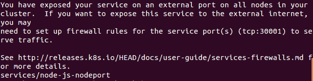

# 网络、负载平衡和入口控制器

在这一章节中，我们将要覆盖 Kubernetes 集群如何处理网络，以及它和其他方法的不同之处。我们将描述 Kubernetes 网络解决方案的三个要求，并探讨为什么这些对于操作的便捷性至关重要。另外，我们将深入介绍服务以及 Kubernetes 代理在每个节点上的工作方式。最后，我们将简要概述一些用于多租户的更高级别的隔离特性。

这个章节将会讨论以下内容：

+   Kubernetes 网络

+   高级服务概念

+   服务发现

+   DNS

+   命名空间限制和配额

# Kubernetes 网络

网络是生产级别运作的重要考虑因素。在服务层面上，我们需要一种可靠的方法来找到和与应用程序组件通信。引入容器和聚类使得事情更加复杂，因为现在我们必须考虑多个网络命名空间。通信和发现现在需要穿越容器 IP 空间、主机网络，甚至是多个数据中心的网络拓扑。

Kubernetes 受益于其祖先来自 Google 在过去十年使用的聚类工具。网络是 Google 超越竞争对手的领域之一，其拥有地球上最大的网络之一。早些时候，Google 构建了自己的硬件交换机和软件定义网络（SDN），以在日常网络操作中获得更多的控制、冗余和效率（您可以在本章节结尾的“参考”部分中的第 1 点中了解更多详细信息）。从每周运行和网络化的 20 亿个容器中汲取的许多经验教训已经提炼成了 Kubernetes，并指导了 K8s 网络的实现方式。

在 Kubernetes 中进行网络操作需要每个 Pod 有其自己的 IP 地址。基础设施提供商的实现细节可能会有所不同。但是，所有实现都必须遵守一些基本规则。首先和其次，Kubernetes 不允许在容器与容器或容器与节点（minion）之间使用网络地址转换（NAT）。此外，内部容器 IP 地址必须与用于与其通信的 IP 地址匹配。

这些规则可以保持我们的网络堆栈的大部分复杂性，并简化应用程序的设计。此外，它们消除了从现有基础设施中迁移的遗留应用程序中重新设计网络通信的需要。最后，在全新的应用程序中，它们允许更大规模地处理数百个甚至数千个服务和应用程序通信。

K8s 通过一个**占位符**来实现这种整个 pod 范围的 IP 魔法。记住，我们在第一章中看到的`pause`容器，在*介绍 Kubernetes*的*在主节点上运行的服务*部分，通常被称为**pod 基础设施容器**，它的重要工作是为稍后启动的应用容器保留网络资源。实质上，`pause`容器持有整个 pod 的网络命名空间和 IP 地址，并且可以被所有正在运行的容器使用。`pause`容器首先加入并持有命名空间，随后在 pod 中启动时，后续容器加入其中。

# 网络选项

Kubernetes 提供了各种网络选项。有些解决方案适用于 AWS 和 GCP 中的本机网络层。还有各种覆盖插件，其中一些将在下一节中讨论。最后，还支持**容器网络接口**（**CNI**）插件。CNI 旨在成为容器的通用插件架构。它目前得到了几个编排工具的支持，如 Kubernetes、Mesos 和 CloudFoundry。更多信息请访问：

[`github.com/containernetworking/cni`](https://github.com/containernetworking/cni).

请始终参考 Kubernetes 文档以获取最新和完整的支持网络选项列表。

# 网络比较

为了更好地理解容器中的网络，可以研究其他容器网络的方法。以下方法并非穷尽列表，但应该让你对可用选项有所了解。

# Docker

**Docker 引擎**默认创建三种类型的网络。这些是**桥接**、**主机**和**无**。

桥接网络是默认选择，除非另有说明。在此模式下，容器有自己的网络命名空间，然后通过虚拟接口桥接到主机（或在 K8s 情况下是节点）网络。在桥接网络中，两个容器可以使用相同的 IP 范围，因为它们是完全隔离的。因此，服务通信需要通过网络接口的主机侧进行一些额外的端口映射。

Docker 还支持主机网络，允许容器使用主机网络堆栈。性能得到了极大的改善，因为它消除了一个网络虚拟化的层级；然而，你失去了拥有独立网络命名空间的安全性。此外，必须更加谨慎地管理端口使用，因为所有容器共享一个 IP。

最后，Docker 支持一个 none 网络，它创建一个没有外部接口的容器。如果检查网络接口，只显示一个回环设备。

在所有这些场景中，我们仍然位于单个机器上，而且在主机模式之外，容器 IP 空间对于该机器外部是不可用的。连接跨越两台机器的容器然后需要进行 **NAT** 和 **端口映射** 以进行通信。

# Docker 用户定义的网络

为了解决跨机器通信问题并提供更大的灵活性，Docker 还通过网络插件支持用户定义的网络。这些网络独立于容器本身存在。通过这种方式，容器可以加入相同的现有 **网络**。通过新的插件架构，可以为不同的网络用例提供各种驱动程序。

这些中的第一个是 **bridge** 驱动程序，它允许创建与默认桥接网络类似的网络。

第二个是 **overlay** 驱动程序。为了跨多个主机进行协调，它们都必须就可用网络及其拓扑达成一致。覆盖驱动程序使用分布式键值存储来在多个主机之间同步网络创建。

Docker 还支持一个 **Macvlan** 驱动程序，该驱动程序使用主机上的接口和子接口。Macvlan 提供了更有效的网络虚拟化和隔离，因为它绕过了 Linux 桥接。

插件机制将允许 Docker 中的各种网络可能性。事实上，许多第三方选项，如 Weave，已经创建了自己的 Docker 网络插件。

# Weave

**Weave** 为 Docker 容器提供了覆盖网络。它可以作为新的 Docker 网络插件接口的插件使用，并且还与 Kubernetes 兼容通过 CNI 插件。像许多覆盖网络一样，许多人批评封装开销对性能的影响。请注意，他们最近添加了一个具有 **Virtual Extensible LAN** (**VXLAN**) 封装支持的预览版本，这极大地提高了性能。欲了解更多信息，请访问 [`blog.weave.works/2015/06/12/weave-fast-datapath/`](http://blog.weave.works/2015/06/12/weave-fast-datapath/)。

# Flannel

**Flannel** 来自 CoreOS，是一个由 etcd 支持的覆盖层。Flannel 为每个主机/节点提供了一个完整的子网，使得与 Kubernetes 实践中每个 pod 或一组容器的可路由 IP 类似的模式成为可能。Flannel 包括一个内核中的 VXLAN 封装模式，以提高性能，并且具有类似于覆盖层 Docker 插件的实验性多网络模式。欲了解更多信息，请访问 [`github.com/coreos/flannel`](https://github.com/coreos/flannel)。

# Project Calico

**Project Calico** 是一个基于层 3 的网络模型，它使用 Linux 内核的内置路由功能。路由通过 **边界网关协议** (**BGP**) 传播到每个主机上的虚拟路由器。Calico 可用于从小规模部署到大规模互联网安装的任何用途。因为它在网络堆栈的较低级别工作，所以不需要额外的 NAT、隧道或覆盖层。它可以直接与底层网络基础设施交互。此外，它支持网络级 ACL 以提供额外的隔离和安全性。欲了解更多信息，请访问以下网址：[`www.projectcalico.org/`](http://www.projectcalico.org/)。

# Canal

**Canal** 将 Calico 的网络策略和 Flannel 的覆盖层合并为一个解决方案。它支持 Calico 和 Flannel 类型的覆盖层，并使用 Calico 的策略执行逻辑。用户可以从这个设置中选择覆盖层和非覆盖层选项，因为它结合了前两个项目的功能。欲了解更多信息，请访问以下网址：

[`github.com/tigera/canal`](https://github.com/tigera/canal)

# 平衡设计

强调 Kubernetes 正在尝试通过将 IP 放置在 pod 级别来实现的平衡是很重要的。在主机级别使用唯一的 IP 地址存在问题，因为容器数量增加。必须使用端口来公开特定容器上的服务并允许外部通信。除此之外，运行可能知道或不知道彼此（及其自定义端口）的多个服务并管理端口空间的复杂性成为一个重大问题。

但是，为每个容器分配一个 IP 地址可能过度。在规模可观的情况下，需要使用覆盖网络和 NAT 来解决每个容器的问题。覆盖网络会增加延迟，并且 IP 地址也将被后端服务占用，因为它们需要与其前端对等体进行通信。

在这里，我们真正看到 Kubernetes 在应用程序和服务级别提供的抽象优势。如果我有一个 Web 服务器和一个数据库，我们可以将它们保留在同一个 pod 中并使用单个 IP 地址。Web 服务器和数据库可以使用本地接口和标准端口进行通信，而不需要自定义设置。此外，后端的服务不会被不必要地暴露给在集群中其他地方运行的其他应用程序堆栈（但可能在同一主机上）。由于 pod 看到的是应用程序在其中运行时所看到的相同 IP 地址，因此服务发现不需要任何额外的转换。

如果您需要覆盖网络的灵活性，仍然可以在 pod 级别使用覆盖层。Weave、Flannel 和 Project Calico 以及现在可用的大量其他插件和覆盖层都可以与 Kubernetes 一起使用。

这在调度工作负载的背景下也非常有帮助。对于调度器来说，拥有一个简单且标准的结构来匹配约束并了解集群网络上任何给定时间的空间是至关重要的。这是一个具有各种应用程序和任务的动态环境，因此在这里增加额外的复杂性会产生连锁效应。

还涉及服务发现的影响。上线的新服务必须确定并注册一个 IP 地址，其他服务或至少集群可以通过该 IP 地址访问它们。如果使用了 NAT，服务将需要另一个机制来学习其外部可访问的 IP。

# 高级服务

让我们探讨与服务和容器之间通信相关的 IP 策略。如果你还记得，在*服务*部分，第二章 *Pods, Services, Replication Controllers, and Labels*，你学到 Kubernetes 使用 kube-proxy 来确定为每个请求提供服务的正确 pod IP 地址和端口。在幕后，kube-proxy 实际上是使用虚拟 IP 和 iptables 来使所有这些魔法工作。

Kube-proxy 现在有两种模式——*用户空间*和*iptables*。截至目前，1.2 版本中 iptables 是默认模式。在两种模式下，kube-proxy 都在每个主机上运行。它的首要职责是监视来自 Kubernetes 主节点的 API。对服务的任何更新都将触发从 kube-proxy 到 iptables 的更新。例如，当创建新服务时，将选择一个虚拟 IP 地址并设置 iptables 中的规则，该规则将通过一个随机端口将其流量定向到 kube-proxy。因此，我们现在有一种方法来捕获此节点上面向服务的流量。由于 kube-proxy 在所有节点上运行，因此我们在整个集群范围内解析服务的 VIP（**虚拟 IP**）也是可能的。此外，DNS 记录也可以指向此 VIP。

在用户空间模式中，我们在 iptables 中创建了一个钩子，但流量的代理仍然由 kube-proxy 处理。此时 iptables 规则只是将流量发送到 kube-proxy 中的服务条目。一旦 kube-proxy 收到特定服务的流量，它必须将其转发到服务候选池中的一个 pod。它使用的是在服务创建过程中选择的随机端口进行此操作。请参考以下图表，了解流程概述：


Kube-proxy 通信

对于你的服务定义中使用`sessionAffinity`元素，始终将来自相同客户端 IP 的流量转发到相同的后端 pod/container 是可能的。

在 iptables 模式中，Pod 直接编码在 iptables 规则中。这消除了对 kube-proxy 实际代理流量的依赖。请求将直接发送到 iptables，然后转发到 Pod。这样做更快，也消除了一个可能的故障点。如我们在*健康检查*部分中讨论的那样，就像您的朋友一样，此模式还丢失了重试 Pod 的能力。

# 外部服务

在上一章中，我们看到了一些服务示例。出于测试和演示目的，我们希望所有服务都可以从外部访问。这是通过我们服务定义中的`type: LoadBalancer`元素进行配置的。`LoadBalancer`类型在云提供商上创建外部负载均衡器。我们应该注意，外部负载均衡器的支持因提供商而异，实现也有所不同。在我们的情况下，我们正在使用 GCE，因此集成非常顺利。唯一需要的额外设置是为外部服务端口打开防火墙规则。

让我们再深入一点，在第二章中的*标签更多内容*部分对其中一个服务进行`describe`命令：

```
$ kubectl describe service/node-js-labels

```

以下是上述命令的结果截图：


服务描述

在上述图中的输出中，您会注意到几个关键元素。我们的`Namespace:`设置为`default`，`Type:`为`LoadBalancer`，并且我们在`LoadBalancer Ingress:`下列出了外部 IP。此外，我们看到了`Endpoints:`，它显示了可用于响应服务请求的 Pod 的 IP。

# 内部服务

让我们深入了解我们可以部署的其他类型的服务。首先，默认情况下，服务只面向内部。您可以指定`clusterIP`类型来实现此目的，但是，如果未定义类型，则`clusterIP`是假定的类型。让我们看一个例子；请注意缺少`type`元素：

```
apiVersion: v1 
kind: Service 
metadata: 
  name: node-js-internal 
  labels: 
    name: node-js-internal 
spec: 
  ports: 
  - port: 80 
  selector: 
    name: node-js 

```

*清单 3-1*：`nodejs-service-internal.yaml`

使用此清单创建服务定义文件。您将需要一个健康的`node-js` RC 版本（*清单 2-7*：`nodejs-health-controller-2.yaml`）。正如您所见，选择器匹配我们在前一章中启动的名为`node-js`的 Pod。我们将创建服务，然后使用过滤器列出当前运行的服务：

```
$ kubectl create -f nodejs-service-internal.yaml
$ kubectl get services -l name=node-js-internal

```

以下是上述命令的结果截图：


内部服务列表

如您所见，我们有一个新的服务，但只有一个 IP。此外，IP 地址无法从外部访问。这次我们无法从 Web 浏览器测试服务。但是，我们可以使用便捷的`kubectl exec`命令，并尝试从其他一些 Pod 连接。您需要运行`node-js-pod`（*清单 2-1*：`nodejs-pod.yaml`）。然后，您可以执行以下命令：

```
$ kubectl exec node-js-pod -- curl <node-js-internal IP>

```

这使我们能够像在 `node-js-pod` 容器中有一个 shell 一样运行 `docker exec` 命令。然后它命中内部服务 URL，该 URL 转发到具有 `node-js` 标签的任何 pod。

如果一切正常，您应该会得到原始 HTML 输出。因此，您成功创建了一个仅内部可用的服务。这对于您希望向集群中运行的其他容器提供的后端服务可能会有用，但不对整个世界开放。

# 自定义负载均衡

K8s 允许的第三种服务类型是 `NodePort` 类型。这种类型允许我们通过特定端口在主机或节点（minion）上暴露服务。通过这种方式，我们可以使用任何节点（minion）的 IP 地址，并在分配的节点端口上访问我们的服务。Kubernetes 将默认在 `3000`-`32767` 范围内分配节点端口，但您也可以指定自己的自定义端口。在 *清单 3-2* 中的示例中，我们选择端口 `30001`，如下所示：

```
apiVersion: v1 
kind: Service 
metadata: 
  name: node-js-nodeport 
  labels: 
    name: node-js-nodeport 
spec: 
  ports: 
  - port: 80 
    nodePort: 30001 
  selector: 
    name: node-js 
  type: NodePort 

```

*清单 3-2*：`nodejs-service-nodeport.yaml`

再次，创建此 YAML 定义文件并创建您的服务，如下所示：

```
$ kubectl create -f nodejs-service-nodeport.yaml

```

输出应该有类似以下的消息：



新的 GCP 防火墙规则

您会注意到有关打开防火墙端口的消息。与外部负载均衡器类型类似，`NodePort` 使用节点上的端口将您的服务外部暴露出来。例如，如果您想在节点前面使用自己的负载均衡器，则这可能很有用。在测试新服务之前，让我们确保在 GCP 上打开这些端口。

从 GCE VM 实例控制台，点击任何节点（minion）的详细信息。然后点击网络，通常是默认的，除非在创建时另有规定。在防火墙规则中，我们可以通过单击添加防火墙规则来添加规则。

创建一个规则，如下图所示（`tcp:30001` 在 `0.0.0.0/0` IP 范围上）：


创建新的 GCP 防火墙规则

现在我们可以通过打开浏览器并使用集群中任何节点（minion）的 IP 地址来测试我们的新服务。测试新服务的格式如下：

`http://<Minoion IP 地址>:<NodePort>/`

最后，最新版本添加了 `ExternalName` 类型，它将 CNAME 映射到服务。

# 跨节点代理

记住，kube-proxy 在所有节点上运行，因此，即使 pod 在那里没有运行，流量也会被代理到适当的主机。参考*跨节点流量*图以了解流量如何流动。用户向外部 IP 或 URL 发出请求。此时请求由**节点**处理。然而，该 pod 恰好没有在此节点上运行。这并不是问题，因为 pod IP 地址是可路由的。因此，**Kube-proxy** 或 **iptables** 简单地将流量传递到此服务的 pod IP。然后网络路由完成在 **节点 2** 上，请求的应用程序驻留在那里：


跨节点流量

# 自定义端口

服务还允许你将流量映射到不同的端口；然后容器和 pod 将自己暴露出来。我们将创建一个服务，将流量暴露到 `90` 端口并转发到 pod 上的 `80` 端口。我们将称这个 pod 为 `node-js-90` 来反映自定义端口号。创建以下两个定义文件：

```
apiVersion: v1 
kind: ReplicationController 
metadata: 
  name: node-js-90 
  labels: 
    name: node-js-90 
spec: 
  replicas: 3 
  selector: 
    name: node-js-90 
  template: 
    metadata: 
      labels: 
        name: node-js-90 
    spec: 
      containers: 
      - name: node-js-90 
        image: jonbaier/node-express-info:latest 
        ports: 
        - containerPort: 80 

```

*清单 3-3*: `nodejs-customPort-controller.yaml`

```
apiVersion: v1 
kind: Service 
metadata: 
  name: node-js-90 
  labels: 
    name: node-js-90 
spec: 
  type: LoadBalancer 
  ports: 
  - port: 90 
    targetPort: 80 
  selector: 
    name: node-js-90 

```

*清单 3-4*: `nodejs-customPort-service.yaml`

你会注意到在服务定义中，我们有一个 `targetPort` 元素。这个元素告诉服务使用池中的 pod/容器的端口。就像我们在之前的例子中看到的，如果你不指定 `targetPort`，它会假定与服务相同的端口。这个端口仍然被用作服务端口，但是在这种情况下，我们将在 `90` 端口上暴露服务，而容器则在 `80` 端口上提供内容。

创建这个 RC 和服务并打开适当的防火墙规则，就像我们在上一个示例中所做的一样。外部负载均衡器 IP 可能需要一段时间才能传播到 `get service` 命令。一旦传播完成，你就应该能够以以下格式在浏览器中打开并查看我们熟悉的 web 应用程序：

`http://<external service IP>:90/`

# 多个端口

另一个自定义端口的用例是多个端口的情况。许多应用程序会暴露多个端口，比如 `80` 端口上的 HTTP 和 `8888` 端口上的 web 服务器。下面的示例展示了我们的应用同时在这两个端口上响应。再次强调，我们还需要为这个端口添加防火墙规则，就像我们之前为 *清单 3-2*: `nodejs-service-nodeport.yaml` 做的一样：

```
apiVersion: v1 
kind: ReplicationController 
metadata: 
  name: node-js-multi 
  labels: 
    name: node-js-multi 
spec: 
  replicas: 3 
  selector: 
    name: node-js-multi 
  template: 
    metadata: 
      labels: 
        name: node-js-multi 
    spec: 
      containers: 
      - name: node-js-multi 
        image: jonbaier/node-express-multi:latest 
        ports: 
        - containerPort: 80 
        - containerPort: 8888 

```

*清单 3-5*: `nodejs-multi-controller.yaml`

```
apiVersion: v1 
kind: Service 
metadata: 
  name: node-js-multi 
  labels: 
    name: node-js-multi 
spec: 
  type: LoadBalancer 
  ports: 
  - name: http 
    protocol: TCP 
    port: 80 
  - name: fake-admin-http 
    protocol: TCP 
    port: 8888 
  selector: 
    name: node-js-multi 

```

*清单 3-6*: `nodejs-multi-service.yaml`

应用程序和容器本身必须同时监听这两个端口才能工作。在这个例子中，端口 `8888` 被用来表示一个虚假的管理员界面。

例如，如果你想监听 `443` 端口，你需要在服务器上使用适当的 SSL 套接字进行监听。

# 内部访问

我们之前讨论过 Kubernetes 如何使用服务抽象来代理分布在集群中的后端 pod 的流量。虽然这在扩展和 pod 恢复方面都很有帮助，但是这种设计并没有解决更高级的路由场景。

为此，Kubernetes 添加了一个 Ingress 资源，允许对后端服务进行自定义代理和负载均衡。可以把它想象成在流量到达我们的服务之前的路由路径中的一个额外层或跳跃。就像一个应用程序有一个服务和支持的 pod 一样，Ingress 资源需要一个 Ingress 入口点和一个执行自定义逻辑的 Ingress 控制器。入口点定义了路由，控制器实际处理路由。在我们的示例中，我们将使用默认的 GCE 后端。

使用 Ingress API 时需要注意的一些限制可以在这里找到：

[`github.com/kubernetes/contrib/blob/master/ingress/controllers/gce/BETA_LIMITATIONS.md`](https://github.com/kubernetes/contrib/blob/master/ingress/controllers/gce/BETA_LIMITATIONS.md)

你可能还记得，在第一章，*Kubernetes 简介* 中，我们看到 GCE 集群附带了一个默认的后端，提供了第 7 层负载均衡能力。如果我们查看 `kube-system` 命名空间，我们可以看到这个控制器正在运行：

```
$ kubectl get rc --namespace=kube-system

```

我们应该看到一个 RC 列出了 `l7-default-backend-v1.0` 的名称，如下所示：


GCE Layer 7 Ingress 控制器

这提供了实际路由在我们 Ingress 入口点中定义的流量的 Ingress 控制器部分。让我们为 Ingress 创建一些资源。

首先，我们将使用我的 `httpwhalesay` 镜像创建几个新的复制控制器。这是原始的 whalesay 的一次混音，可以在浏览器中显示。以下清单显示了 YAML。请注意三个破折号，让我们将多个资源组合成一个 YAML 文件：

```
apiVersion: v1
kind: ReplicationController
metadata:
  name: whale-ingress-a
spec:
  replicas: 1
  template:
    metadata:
      labels:
        app: whale-ingress-a
    spec:
      containers:
      - name: sayhey
        image: jonbaier/httpwhalesay:0.1
        command: ["node", "index.js", "Whale Type A, Here."]
        ports:
        - containerPort: 80
---
apiVersion: v1
kind: ReplicationController
metadata:
  name: whale-ingress-b
spec:
  replicas: 1
  template:
    metadata:
      labels:
        app: whale-ingress-b
    spec:
      containers:
      - name: sayhey
        image: jonbaier/httpwhalesay:0.1
        command: ["node", "index.js", "Hey man, It's Whale B, Just
        Chillin'."]
        ports:
        - containerPort: 80

```

*清单 3-7.* `whale-rcs.yaml`

请注意，我们正在创建具有相同容器的 pod，但具有不同的启动参数。记下这些参数以备后用。我们还将为这些 RC 的每一个创建 `Service` 端点：

```
apiVersion: v1
kind: Service
metadata:
  name: whale-svc-a
  labels:
    app: whale-ingress-a
spec:
  type: NodePort
  ports:
  - port: 80
    nodePort: 30301
    protocol: TCP
    name: http
  selector:
    app: whale-ingress-a
---
apiVersion: v1
kind: Service
metadata:
  name: whale-svc-b
  labels:
    app: whale-ingress-b
spec:
  type: NodePort
  ports:
  - port: 80
    nodePort: 30284
    protocol: TCP
    name: http
  selector:
    app: whale-ingress-b
---
apiVersion: v1
kind: Service
metadata:
 name: whale-svc-default
 labels:
   app: whale-ingress-a
spec:
  type: NodePort
  ports:
  - port: 80
    nodePort: 30302
    protocol: TCP
    name: http
  selector:
    app: whale-ingress-a

```

*清单 3-8.* `whale-svcs.yaml`

再次使用 `kubectl create -f` 命令创建这些，如下所示：

```
$ kubectl create -f whale-rcs.yaml $ kubectl create -f whale-svcs.yaml

```

我们应该看到关于 RC 和 Service 成功创建的消息。接下来，我们需要定义 Ingress 入口点。我们将使用 `http://a.whale.hey` 和 `http://b.whale.hey` 作为我们的演示入口点：

```
apiVersion: extensions/v1beta1
kind: Ingress
metadata:
  name: whale-ingress
spec:
  rules:
  - host: a.whale.hey
    http:
      paths:
      - path: /
        backend:
          serviceName: whale-svc-a
          servicePort: 80
  - host: b.whale.hey
    http:
      paths:
      - path: /
        backend:
          serviceName: whale-svc-b
          servicePort: 80

```

*清单 3-9.* `whale-ingress.yaml`

再次使用 `kubectl create -f` 来创建此 Ingress。一旦成功创建，我们需要等待几分钟让 GCE 给 Ingress 一个静态 IP 地址。使用以下命令来观察 Ingress 资源：

```
$ kubectl get ingress

```

一旦 Ingress 有了 IP，我们应该在 `ADDRESS` 中看到一个条目，像这样：


Ingress 描述

由于这不是一个注册的域名，我们需要在 `curl` 命令中指定解析，就像这样：

```
$ curl --resolve a.whale.hey:80:130.211.24.177 http://a.whale.hey/

```

这应该显示如下内容：


Whalesay A

我们也可以尝试第二个 URL，并获得我们的第二个 RC：

```
$ curl --resolve b.whale.hey:80:130.211.24.177 http://b.whale.hey/

```


Whalesay B

我们注意到图像几乎相同，只是每个鲸的字样反映了我们先前启动的每个 RC 的启动参数。因此，我们的两个 Ingress 点将流量引导到不同的后端。

在这个例子中，我们使用了默认的 GCE 后端作为 Ingress 控制器。Kubernetes 允许我们自己构建，而 Nginx 实际上也有几个版本可用。

# 迁移、多集群等

正如你到目前为止所见，Kubernetes 提供了高度的灵活性和定制化，可以在集群中运行的容器周围创建服务抽象。但是，可能会有时候你想要指向集群外的某些东西。

这种情况的一个示例是与遗留系统或者甚至运行在另一个集群上的应用程序一起工作。就前者而言，在迁移到 Kubernetes 和容器的过程中，这是一个非常好的策略。我们可以开始在 Kubernetes 中管理服务端点，同时使用 K8s 编排概念来组装整个堆栈。此外，随着组织对应用程序进行了微服务和/或容器化的重构，我们甚至可以逐步地将堆栈的部分（如前端）带入。

为了允许访问非基于 Pod 的应用程序，服务构建允许您使用在集群外的端点。实际上，每次创建使用选择器的服务时，Kubernetes 都会创建一个端点资源。`endpoints` 对象跟踪负载平衡池中的 Pod IP。您可以通过运行 `get endpoints` 命令来查看，如下所示：

```
$ kubectl get endpoints

```

你应该会看到类似这样的内容：

```
NAME               ENDPOINTS
http-pd            10.244.2.29:80,10.244.2.30:80,10.244.3.16:80
kubernetes         10.240.0.2:443
node-js            10.244.0.12:80,10.244.2.24:80,10.244.3.13:80

```

你会注意到我们当前在集群上运行的所有服务都有一个条目。对于大多数服务，端点只是运行在 RC 中的每个 Pod 的 IP。正如我之前提到的，Kubernetes 根据选择器自动执行此操作。当我们在具有匹配标签的控制器中扩展副本时，Kubernetes 将自动更新端点。

如果我们想为不是 Pod 的东西创建一个服务，因此没有标签可供选择，我们可以很容易地通过服务和端点定义来实现，如下所示：

```
apiVersion: v1 
kind: Service 
metadata: 
  name: custom-service 
spec: 
  type: LoadBalancer 
  ports: 
  - name: http 
    protocol: TCP 
    port: 80 

```

*清单 3-10*：`nodejs-custom-service.yaml`

```
apiVersion: v1 
kind: Endpoints 
metadata: 
  name: custom-service 
subsets: 
- addresses: 
  - ip: <X.X.X.X> 
  ports: 
    - name: http 
      port: 80 
      protocol: TCP 

```

*清单 3-11*：`nodejs-custom-endpoint.yaml`

在上面的示例中，您需要用实际 IP 地址替换 `<X.X.X.X>`，新服务可以指向该地址。在我的案例中，我使用了我们之前在 *清单 3-6* 中创建的 `node-js-multi` 服务的公共负载均衡器 IP。现在就去创建这些资源吧。

如果我们现在运行一个 `get endpoints` 命令，我们将看到这个 IP 地址关联到 `custom-service` 端点的 `80` 端口。此外，如果我们查看服务详情，我们将在 `Endpoints` 部分中看到列出的 IP： 

```
$ kubectl describe service/custom-service

```

我们可以通过在浏览器中打开 `custom-service` 的外部 IP 来测试这项新服务。

# 自定义寻址

另一个自定义服务的选项是使用 `clusterIP` 元素。到目前为止，在我们的示例中，我们还没有指定 IP 地址，这意味着它会为我们选择服务的内部地址。然而，我们可以添加这个元素并提前选择 IP 地址，例如使用 `clusterip: 10.0.125.105`。

有时您可能不想负载平衡，而是更愿意为每个 Pod 使用带有 *A* 记录的 DNS。例如，需要将数据均匀复制到所有节点的软件可能依赖于 *A* 记录来分发数据。在这种情况下，我们可以使用以下示例，并将 `clusterip` 设置为 `None`。 Kubernetes 将不会分配 IP 地址，而是仅为每个 Pod 在 DNS 中分配 *A* 记录。如果您使用 DNS，则服务应该可以从集群内的 `node-js-none` 或 `node-js-none.default.cluster.local` 访问。我们有以下代码：

```
apiVersion: v1 
kind: Service 
metadata: 
  name: node-js-none 
  labels: 
    name: node-js-none 
spec: 
  clusterIP: None 
  ports: 
  - port: 80 
  selector: 
    name: node-js 

```

*清单 3-12*：`nodejs-headless-service.yaml`

创建此服务后，请使用可靠的 `exec` 命令进行测试：

```
$ kubectl exec node-js-pod -- curl node-js-none

```

# 服务发现

正如我们之前讨论的，Kubernetes 主节点会跟踪所有服务定义和更新。发现可以通过以下三种方式之一进行。前两种方法使用 Linux 环境变量。支持 Docker 链接样式的环境变量，但 Kubernetes 也有其自己的命名约定。这是使用 K8s 环境变量的示例，我们的 `node-js` 服务示例可能看起来像这样（注意 IP 可能会有所不同）：

```
NODE_JS_PORT_80_TCP=tcp://10.0.103.215:80
NODE_JS_PORT=tcp://10.0.103.215:80
NODE_JS_PORT_80_TCP_PROTO=tcp
NODE_JS_PORT_80_TCP_PORT=80
NODE_JS_SERVICE_HOST=10.0.103.215
NODE_JS_PORT_80_TCP_ADDR=10.0.103.215
NODE_JS_SERVICE_PORT=80

```

*清单 3-13*：*服务环境变量*

通过 DNS 进行发现的另一种选择。虽然环境变量在 DNS 不可用时可能很有用，但它也有缺点。系统仅在创建时创建变量，因此稍后启动的服务将无法发现，或者需要一些额外的工具来更新所有系统环境。

# DNS

DNS 通过允许我们通过名称引用服务来解决使用环境变量时出现的问题。随着服务重新启动、扩展或出现新的情况，DNS 条目将被更新，确保服务名称始终指向最新的基础架构。在大多数支持的提供商中，默认设置了 DNS。

如果您的提供商支持 DNS，但尚未设置，则在创建 Kubernetes 集群时，您可以在默认提供商配置中配置以下变量：

`ENABLE_CLUSTER_DNS="${KUBE_ENABLE_CLUSTER_DNS:-true}"` `DNS_SERVER_IP="10.0.0.10"`

`DNS_DOMAIN="cluster.local"`

`DNS_REPLICAS=1`

使用 DNS 时，服务可以以两种形式之一访问-要么是服务名称本身，`<service-name>`，要么是包含命名空间的完全限定名称，`<service-name>.<namespace-name>.cluster.local`。在我们的示例中，它看起来类似于 `node-js-90` 或 `node-js-90.default.cluster.local`。

# 多租户

Kubernetes 还具有在集群级别进行隔离的附加结构。在大多数情况下，您可以运行 Kubernetes 而不必担心命名空间；如果未指定，所有内容都将在默认命名空间中运行。但是，在运行多租户社区或希望对集群资源进行广泛分离和隔离的情况下，可以使用命名空间来实现此目的。

首先，Kubernetes 有两个命名空间——`default`和`kube-system`。`kube-system`命名空间用于所有在第一章中看到的系统级容器，在*运行在节点上的服务*节中。用户创建的所有其他内容都在默认命名空间中运行。但是，用户的资源定义文件可以选择指定自定义命名空间。为了进行实验，让我们看看如何构建一个新的命名空间。

首先，我们需要创建一个命名空间定义文件，就像这个清单中的一个：

```
apiVersion: v1 
kind: Namespace 
metadata: 
  name: test 

```

*清单 3-14*：`test-ns.yaml`

我们可以使用我们方便的`create`命令来创建这个文件：

```
$ kubectl create -f test-ns.yaml

```

现在我们可以创建使用`test`命名空间的资源。以下是一个使用这个新命名空间的 pod 的示例：

```
apiVersion: v1 
kind: Pod 
metadata: 
  name: utility 
  namespace: test 
spec: 
  containers: 
  - image: debian:latest 
    command: 
      - sleep 
      - "3600" 
    name: utility 

```

*清单 3-15*：`ns-pod.yaml`

虽然 pod 仍然可以访问其他命名空间中的服务，但它需要使用长 DNS 格式的`<service-name>.<namespace-name>.cluster.local`。例如，如果您要从*清单 3-15*：`ns-pod.yaml`内的容器中运行一个命令，您可以使用`node-js.default.cluster.local`访问第二章中的 Node.js 示例，*Pods, Services, Replication Controllers, and Labels*。

这里有一个关于资源利用的注记。在本书的某个时候，您可能会在集群上耗尽空间以创建新的 Kubernetes 资源。这个时机会根据集群的大小而变化，但请记住定期进行一些清理是很好的。使用以下命令删除旧的示例：

`**$ kubectl delete pod <pod name>** **$ kubectl delete svc <service name>** **$ kubectl delete rc <replication controller name>** ** $ kubectl delete rs <replicaset name>**`

# 限制

让我们更详细地检查一下我们的新命名空间。执行如下`describe`命令：

```
$ kubectl describe namespace/test

```

以下截图是上述命令的结果：


命名空间描述

Kubernetes 允许您限制单个 pod 或容器使用的资源以及整个命名空间使用的资源。请注意，`test`命名空间目前没有设置资源**限制**或**配额**。

假设我们想要限制这个新命名空间的占地面积；我们可以设置如下的配额：

```
apiVersion: v1 
kind: ResourceQuota 
metadata: 
  name: test-quotas 
  namespace: test 
spec: 
  hard:  
    pods: 3 
    services: 1 
    replicationcontrollers: 1 

```

*清单 3-16*：`quota.yaml`

实际上，命名空间将用于更大的应用程序社区，可能永远不会有这么低的配额。我之所以使用这个例子，是为了更轻松地说明示例中的功能。

在这里，我们将为测验命名空间创建一个`3`个 pod、`1`个 RC 和`1`个服务的配额。正如你可能猜到的那样，这又一次由我们值得信赖的`create`命令执行：

```
$ kubectl create -f quota.yaml

```

现在我们已经做好了，让我们对命名空间使用`describe`，如下所示：

```
$ kubectl describe namespace/test

```

以下截图是上述命令的结果：


在设置配额后的命名空间描述

您会注意到现在在配额部分列出了一些值，而限制部分仍然为空白。我们还有一个`Used`列，它让我们知道我们当前离限制有多近。让我们尝试使用以下定义来启动一些 pod：

```
apiVersion: v1 
kind: ReplicationController 
metadata: 
  name: busybox-ns 
  namespace: test 
  labels: 
    name: busybox-ns 
spec: 
  replicas: 4 
  selector: 
    name: busybox-ns 
  template: 
    metadata: 
      labels: 
        name: busybox-ns 
    spec: 
      containers: 
      - name: busybox-ns 
        image: busybox 
        command: 
          - sleep 
          - "3600" 

```

*列表 3-17*：`busybox-ns.yaml`

您会注意到我们正在创建此基本 pod 的四个副本。在使用`create`构建此 RC 后，再次在`test`命名空间上运行`describe`命令。您会注意到 pod 和 RC 的`Used`值已达到最大值。然而，我们要求四个副本，但只看到三个正在使用的 pod。

让我们看看我们的 RC 正在发生什么。您可以尝试使用此处的命令来执行此操作：

```
kubectl describe rc/busybox-ns

```

但是，如果你尝试，你会受挫于从服务器收到的`not found`消息。这是因为我们在一个新的命名空间创建了这个 RC，如果没有指定，`kubectl`会假定默认命名空间。这意味着我们在访问`test`命名空间中的资源时需要在每个命令中指定`--namepsace=test`。

我们还可以通过处理上下文设置来设置当前命名空间。首先，我们需要找到我们的当前上下文，这是通过以下命令找到的：

`**$ kubectl config view | grep current-context**`

接下来，我们可以获取该上下文并设置命名空间变量如下：

`**$ kubectl config set-context <当前上下文> --namespace=test**`

现在您可以运行`kubectl`命令而无需指定命名空间。只需记住在想要查看运行在默认命名空间中的资源时切换回来即可。

使用指定了命名空间的命令运行。如果您已按提示框中所示设置了当前命名空间，可以省略`--namespace`参数：

```
$ kubectl describe rc/busybox-ns --namespace=test

```

下面的截图是前述命令的结果：


命名空间配额

如您在前面的图像中所见，前三个 pod 已成功创建，但我们的最后一个失败了，出现了`Limited to 3 pods`错误。

这是一种在社区规模上设置资源限制的简单方法。值得注意的是，您还可以设置 CPU、内存、持久卷和密钥的配额。此外，限制的工作方式与配额类似，但它们为命名空间内的每个 pod 或容器设置了限制。

# 关于资源使用的说明

由于本书中的大多数示例都使用 GCP 或 AWS，保持所有内容运行可能成本很高。如果使用默认的集群大小，尤其是如果保留每个示例运行，则很容易耗尽资源。因此，您可能希望定期删除旧的 pod、复制控制器、副本集和服务。您还可以销毁集群，并使用第一章——*介绍 Kubernetes*作为降低云服务提供商账单的方法。

# 摘要

我们深入研究了 Kubernetes 中的网络和服务。现在你应该了解了 K8s 中网络通信的设计，并且能够在内部和外部轻松访问你的服务。我们看到了 kube-proxy 如何在本地和整个集群中平衡流量。此外，我们探讨了新的 Ingress 资源，使我们能够更精细地控制流入流量。我们还简要地了解了 Kubernetes 中如何实现 DNS 和服务发现。最后，我们简单地看了一下多租户环境下的命名空间和隔离。

# 参考资料

1.  [`www.wired.com/2015/06/google-reveals-secret-gear-connects-online-empire/`](http://www.wired.com/2015/06/google-reveals-secret-gear-connects-online-empire/)
