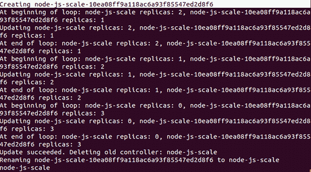
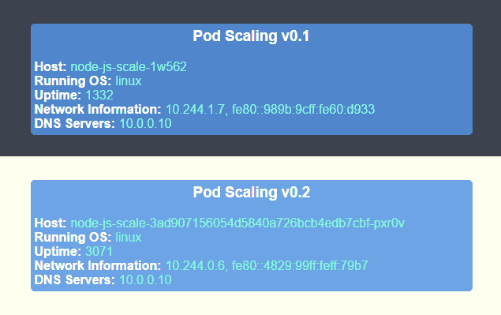
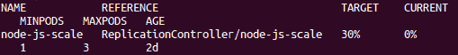
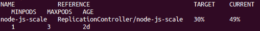
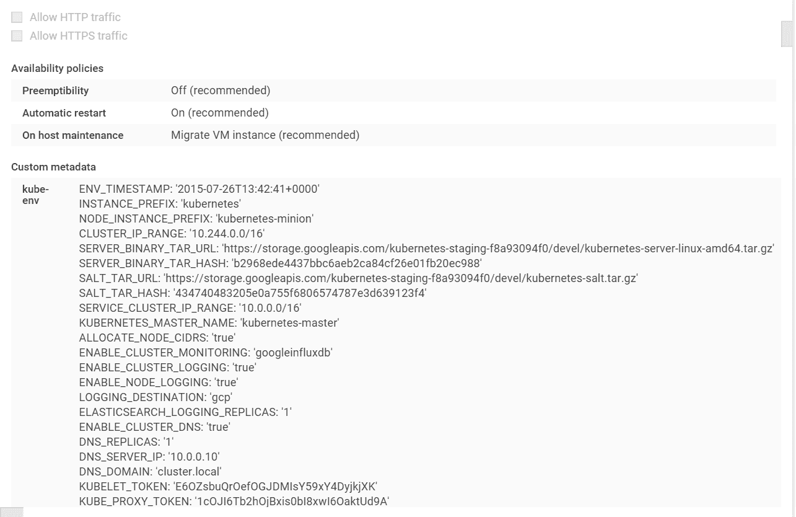
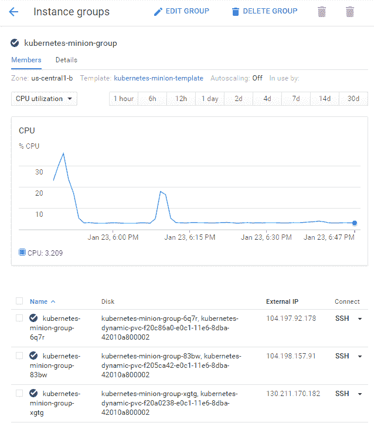
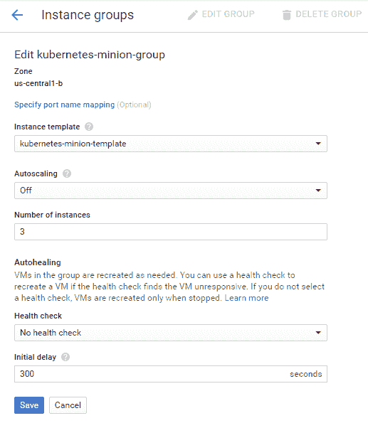
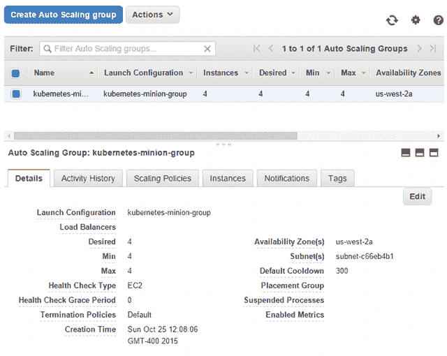

# 更新、渐进式发布和自动扩展

本章将扩展核心概念，向您展示如何在最小中断上线时间内推出更新并测试应用程序的新功能。它将介绍进行应用程序更新、渐进式发布和 A/B 测试的基础知识。此外，我们还将了解如何扩展 Kubernetes 集群本身。

本章将讨论以下主题：

+   应用程序扩展

+   滚动更新

+   A/B 测试

+   应用程序自动扩展

+   扩展您的集群

从版本 1.2 开始，Kubernetes 发布了一个部署 API。在处理扩展和应用程序更新方面，部署是推荐的方法。然而，在撰写本书时，它仍被视为测试版，而滚动更新已经稳定了几个版本。本章将探讨滚动更新作为引入扩展概念的一种方法，然后在下一章深入探讨使用部署的首选方法。

# 示例设置

在探索 Kubernetes 中用于扩展和更新的各种功能之前，我们将需要一个新的示例环境。我们将使用具有蓝色背景的先前容器映像的变体（请参考本章后面的*v0.1 和 v0.2（并排）*图像进行比较）。我们有以下代码：

```
apiVersion: v1 
kind: ReplicationController 
metadata: 
  name: node-js-scale 
  labels: 
    name: node-js-scale 
spec: 
  replicas: 1 
  selector: 
    name: node-js-scale 
  template: 
    metadata: 
      labels: 
        name: node-js-scale 
    spec: 
      containers: 
      - name: node-js-scale 
        image: jonbaier/pod-scaling:0.1 
        ports: 
        - containerPort: 80

```

*列表 4-1*：`pod-scaling-controller.yaml`

```
apiVersion: v1 
kind: Service 
metadata: 
  name: node-js-scale 
  labels: 
    name: node-js-scale 
spec: 
  type: LoadBalancer 
  sessionAffinity: ClientIP 
  ports: 
  - port: 80 
  selector: 
    name: node-js-scale

```

*列表 4-2*：`pod-scaling-service.yaml`

使用以下命令创建这些服务：

```
$ kubectl create -f pod-scaling-controller.yaml
$ kubectl create -f pod-scaling-service.yaml

```

服务的公共 IP 地址可能需要一段时间才能创建。

# 扩展

随着时间推移，在 Kubernetes 集群中运行应用程序时，您会发现一些应用程序需要更多资源，而其他应用程序可以使用更少的资源。我们希望有一种更无缝的方式来使我们的应用程序进行扩展。而不是删除整个 RC（及其关联的 pod）。

幸运的是，Kubernetes 包含一个`scale`命令，专门用于此目的。`scale`命令既适用于复制控制器，也适用于新的部署抽象。目前，我们将使用复制控制器探索其用法。在我们的新示例中，只有一个副本在运行。您可以使用`get pods`命令来检查：

```
$ kubectl get pods -l name=node-js-scale

```

让我们尝试使用以下命令将其扩展到三个：

```
$ kubectl scale --replicas=3 rc/node-js-scale

```

如果一切顺利，您将在终端窗口的输出中看到`scaled`一词。

可选地，您可以指定`--current-replicas`标志作为验证步骤。只有当前正在运行的副本数与此计数匹配时，才会进行扩展。

再次列出我们的 pods 后，现在应该看到三个名称类似`node-js-scale-**XXXXX**`的正在运行的 pods，其中`X`字符是一个随机字符串。

您也可以使用`scale`命令减少副本的数量。在任何情况下，`scale`命令都会添加或删除必要的 pod 副本，并且服务会自动更新和在新的或剩余的副本之间平衡。

# 平滑的更新

当我们的资源需求发生变化时，我们的应用程序进行上下缩放是许多生产场景中很有用的，但是对于简单的应用程序更新呢？任何生产系统都会有代码更新、补丁和功能添加。这些可能每月、每周甚至每天都在发生。确保我们有可靠的方法来推送这些变更而不会中断用户是一个首要考虑因素。

再次，我们受益于 Kubernetes 系统建立在多年经验基础上。1.0 版本内置了对滚动更新的支持。`rolling-update` 命令允许我们更新整个 RC 或仅更新每个副本使用的底层 Docker 镜像。我们还可以指定更新间隔，这将允许我们逐个更新一个 pod，并等待继续下一个。

让我们以我们的缩放示例为例，并对我们容器映像的 0.2 版本执行滚动更新。我们将使用 2 分钟的更新间隔，这样我们可以观察到进程如何进行：

```
$ kubectl rolling-update node-js-scale --image=jonbaier/pod-scaling:0.2 --update-period="2m"

```

您应该会看到一些关于创建名为 `node-js-scale-XXXXX` 的新 RC 的文本，其中 `X` 字符将是一串随机的数字和字母。此外，您将看到一个循环的开始，它开始一个新版本的副本，并从现有 RC 中删除一个。这个过程将继续，直到新的 RC 具有完整的副本计数运行。

如果我们想实时跟踪，可以打开另一个终端窗口，并使用 `get pods` 命令，再加上一个标签过滤器，来查看正在发生的情况：

```
$ kubectl get pods -l name=node-js-scale

```

此命令将筛选出名称中带有 `node-js-scale` 的 pod。如果在发出 `rolling-update` 命令后运行此命令，您应该会看到几个 pod 在运行，因为它逐个创建新版本并逐个删除旧版本。

前面 `rolling-update` 命令的完整输出应该看起来像下面的截图一样：



缩放输出

正如我们在这里所看到的，Kubernetes 首先创建了一个名为 `node-js-scale-10ea08ff9a118ac6a93f85547ed28f6` 的新 RC。然后，K8s 逐个循环，创建一个新的 pod 在新的控制器中，并从旧的控制器中删除一个。这个过程会持续到新的控制器达到完整的副本数量，而旧的控制器为零。之后，旧的控制器被删除，新的控制器被重命名为原始的控制器名称。

如果现在运行 `get pods` 命令，您会注意到所有的 pod 仍然有一个更长的名称。或者，我们可以在命令中指定一个新控制器的名称，Kubernetes 将使用该名称创建一个新的 RC 和 pod。再次，更新完成后，旧名称的控制器简单消失了。我建议您为更新后的控制器指定一个新名称，以避免以后在 pod 命名中造成混淆。使用此方法的相同 `update` 命令将如下所示：

```
$ kubectl rolling-update node-js-scale node-js-scale-v2.0 --image=jonbaier/pod-scaling:0.2 --update-period="2m"

```

利用我们在第一节创建的服务的静态外部 IP 地址，我们可以在浏览器中打开该服务。我们应该看到我们的标准容器信息页面。但是，你会注意到标题现在显示为 Pod 缩放 v0.2，背景为浅黄色：



v0.1 和 v0.2（并列）

值得注意的是，在整个更新过程中，我们只关注了 pod 和 RC。我们没有对我们的服务做任何操作，但服务仍然正常运行，并且现在指向我们的 pod 的新版本。这是因为我们的服务正在使用标签选择器进行成员身份验证。因为我们的旧副本和新副本都使用相同的标签，所以服务没有问题使用新副本来提供请求服务。更新是逐个 pod 进行的，所以对于服务的用户来说是无缝的。

# 测试、发布和切换

滚动更新功能可以很好地适用于简单的蓝绿部署场景。但是，在具有多个应用程序堆栈的实际蓝绿部署中，可能存在各种相互依赖关系，需要进行深入测试。`update-period` 命令允许我们添加一个 `timeout` 标志，其中可以进行一些测试，但这并不总是令人满意的测试目的。

类似地，您可能希望部分更改持续时间更长，一直到负载均衡器或服务级别。例如，您可能希望在一部分用户身上运行新用户界面功能的 A/B 测试。另一个例子是在新添加的集群节点等新基础设施上运行您应用程序的金丝雀发布（在这种情况下是副本）。

让我们看一个 A/B 测试的例子。对于此示例，我们需要创建一个新的服务，该服务使用 `sessionAffinity`。我们将亲和性设置为 `ClientIP`，这将允许我们将客户端转发到相同的后端 pod。这是关键的，如果我们希望我们的一部分用户看到一个版本，而其他用户看到另一个版本：

```
apiVersion: v1 
kind: Service 
metadata: 
  name: node-js-scale-ab 
  labels: 
    service: node-js-scale-ab 
spec: 
  type: LoadBalancer 
  ports: 
  - port: 80 
  sessionAffinity: ClientIP 
  selector: 
    service: node-js-scale-ab

```

*清单 4-3：*`pod-AB-service.yaml`

像往常一样使用 `create` 命令创建此服务，如下所示：

```
$ kubectl create -f pod-AB-service.yaml

```

这将创建一个指向我们运行应用程序版本 0.2 和 0.3 的 pod 的服务。接下来，我们将创建两个 RC，用于创建应用程序的两个副本。一个集合将具有应用程序版本 0.2，另一个将具有版本 0.3，如下所示：

```
apiVersion: v1 
kind: ReplicationController 
metadata: 
  name: node-js-scale-a 
  labels: 
    name: node-js-scale-a 
    version: "0.2" 
    service: node-js-scale-ab 
spec: 
  replicas: 2 
  selector: 
    name: node-js-scale-a 
    version: "0.2" 
    service: node-js-scale-ab 
  template: 
    metadata: 
      labels: 
        name: node-js-scale-a 
        version: "0.2" 
        service: node-js-scale-ab 
    spec: 
      containers: 
      - name: node-js-scale 
        image: jonbaier/pod-scaling:0.2 
        ports: 
        - containerPort: 80 
        livenessProbe: 
          # An HTTP health check 
          httpGet: 
            path: / 
            port: 80 
          initialDelaySeconds: 30 
          timeoutSeconds: 5 
        readinessProbe: 
          # An HTTP health check 
          httpGet: 
            path: / 
            port: 80 
          initialDelaySeconds: 30 
          timeoutSeconds: 1

```

*清单 4-4：*`pod-A-controller.yaml`

```
apiVersion: v1 
kind: ReplicationController 
metadata: 
  name: node-js-scale-b 
  labels: 
    name: node-js-scale-b 
    version: "0.3" 
    service: node-js-scale-ab 
spec: 
  replicas: 2 
  selector: 
    name: node-js-scale-b 
    version: "0.3" 
    service: node-js-scale-ab 
  template: 
    metadata: 
      labels: 
        name: node-js-scale-b 
        version: "0.3" 
        service: node-js-scale-ab 
    spec: 
      containers: 
      - name: node-js-scale 
        image: jonbaier/pod-scaling:0.3 
        ports: 
        - containerPort: 80 
        livenessProbe: 
          # An HTTP health check 
          httpGet: 
            path: / 
            port: 80 
          initialDelaySeconds: 30 
          timeoutSeconds: 5 
        readinessProbe: 
          # An HTTP health check 
          httpGet: 
            path: / 
            port: 80 
          initialDelaySeconds: 30 
          timeoutSeconds: 1

```

*清单 4-5：*`pod-B-controller.yaml`

请注意，我们有相同的服务标签，因此这些副本也将根据此选择器添加到服务池中。我们还定义了 `livenessProbe` 和 `readinessProbe` 来确保我们的新版本按预期工作。同样，使用 `create` 命令启动控制器：

```
$ kubectl create -f pod-A-controller.yaml
$ kubectl create -f pod-B-controller.yaml

```

现在我们的服务已平衡到应用程序的两个版本。在一个真正的 A/B 测试中，我们现在希望开始收集对每个版本的访问指标。同样，我们将`sessionAffinity`设置为`ClientIP`，所以所有请求都将发送到相同的 pod。一些用户将看到 v0.2，一些用户将看到 v0.3。

因为我们打开了`sessionAffinity`，所以您的测试可能每次都会显示相同的版本。这是正常现象，您需要尝试从多个 IP 地址连接以查看每个版本的用户体验。

由于每个版本都在自己的 pod 上，可以轻松地分离日志甚至在 pod 定义中添加一个日志容器以实现旁车日志模式。为简洁起见，在本书中我们不会介绍这种设置，但我们将在第八章中介绍一些日志工具，*监视和日志记录*。

我们可以看到这个过程将如何对金丝雀发布或手动蓝绿部署有所帮助。我们还可以看到启动新版本并逐渐过渡到新版本的过程是多么容易。

让我们快速看一下基本过渡。这实际上就是几个`scale`命令，如下所示：

```
$ kubectl scale --replicas=3 rc/node-js-scale-b
$ kubectl scale --replicas=1 rc/node-js-scale-a
$ kubectl scale --replicas=4 rc/node-js-scale-b
$ kubectl scale --replicas=0 rc/node-js-scale-a

```

使用`get pods`命令结合`-l`过滤器在`scale`命令之间观察转换过程。

现在，我们已完全过渡到版本 0.3（`node-js-scale-b`）。所有用户现在都将看到站点的版本 0.3。我们有版本 0.3 的四个副本，没有 0.2 的。如果运行`get rc`命令，您会注意到我们仍然有一个 0.2 的 RC（`node-js-scale-a`）。作为最后的清理，我们可以完全删除该控制器，如下所示：

```
$ kubectl delete rc/node-js-scale-a

```

# 应用自动扩展

Kubernetes 最近增加的一个功能是**水平 Pod 自动缩放器**。这种资源类型非常有用，因为它为我们提供了自动设置应用程序扩展阈值的方式。目前，该支持仅针对 CPU，但也有自定义应用程序指标的 alpha 支持。

让我们使用本章开头的`node-js-scale`复制控制器，并加上一个自动扩缩组件。在开始之前，让我们确保使用以下命令缩减到一个副本：

```
$ kubectl scale --replicas=1 rc/node-js-scale

```

现在我们可以创建一个水平 Pod 自动缩放器，其定义如下：

```
apiVersion: autoscaling/v1
kind: HorizontalPodAutoscaler
metadata:
  name: node-js-scale
spec:
  minReplicas: 1
  maxReplicas: 3
  scaleTargetRef:
    apiVersion: v1
    kind: ReplicationController
    name: node-js-scale
  targetCPUUtilizationPercentage: 20

```

*表 4-6.* `node-js-scale-hpa.yaml`

继续使用`kubectl create -f`命令创建这个。现在我们可以列出 hpas 并获得描述：

```
$ kubectl get hpa 

```

我们也可以使用`kubectl autoscale`命令在命令行中创建自动缩放。前面的 YAML 看起来像下面这样：

`$ kubectl autoscale rc/node-js-scale --min=1 --max=3 --cpu-percent=20`

这将显示一个具有目标 CPU 为 30%的`node-js-scale`复制控制器上的自动扩展器。此外，您将看到最小 pod 设置为 1，最大设置为 3：



没有负载的水平 Pod 自动缩放器

让我们还查询一下我们的 pod，看看现在有多少在运行：

```
$ kubectl get pods -l name=node-js-scale

```

由于我们的 HPA 显示 0% 利用率，因此我们只应该看到一个 `node-js-scale` pod，因此我们需要生成一些负载。我们将使用在许多容器演示中常见的流行应用程序 `boom`。以下清单将帮助我们创建连续的负载，直到我们可以达到自动缩放器的 CPU 阈值：

```
apiVersion: v1
kind: ReplicationController
metadata:
  name: boomload
spec:
  replicas: 1
  selector:
    app: loadgenerator
  template:
    metadata:
      labels:
        app: loadgenerator
    spec:
      containers:
      - image: williamyeh/boom
        name: boom
        command: ["/bin/sh","-c"]
        args: ["while true ; do boom http://node-js-scale/ -c 10 -n 100      
        ; sleep 1 ; done"]

```

*清单 4-7.* `boomload.yaml`

使用此清单的 `kubectl create -f` 命令，然后准备好开始监视我们之前使用的 `kubectl get hpa` 命令。

可能需要一些时间，但我们应该开始看到当前 CPU 利用率增加。一旦超过我们设置的 20% 阈值，自动缩放器就会启动：



负载开始后的水平 Pod 自动缩放

一旦我们看到这一点，我们可以再次运行 `kubectl get pod`，看到现在有几个 `node-js-scale` pod：

```
$ kubectl get pods -l name=node-js-scale

```

我们现在可以通过停止我们的负载生成 pod 来进行清理：

```
$ kubectl delete rc/boomload

```

现在如果我们观察 `hpa`，我们应该开始看到 CPU 使用率下降。可能需要几分钟，但最终，我们将会回到 0% 的 CPU 负载。

# 缩放集群

所有这些技术对于应用程序的扩展都非常棒，但是集群本身怎么样呢？在某些时候，您将会将节点填满，并且需要更多资源来为您的工作负载安排新的 pod。

# 自动缩放

当您创建集群时，您可以使用 `NUM_MINIONS` 环境变量自定义起始节点（minions）的数量。默认情况下，它设置为***4***。

此外，Kubernetes 团队已开始将自动缩放功能构建到集群本身中。目前，这是 GCE 和 GKE 上唯一支持的功能，但正在为其他提供者进行工作。此功能利用了 `KUBE_AUTOSCALER_MIN_NODES`、`KUBE_AUTOSCALER_MAX_NODES` 和 `KUBE_ENABLE_CLUSTER_AUTOSCALER` 环境变量。

以下示例显示了在运行 `kube-up.sh` 之前设置自动缩放环境变量的方法：

```
$ export NUM_MINIONS=5
$ export KUBE_AUTOSCALER_MIN_NODES=2
$ export KUBE_AUTOSCALER_MAX_NODES=5
$ export KUBE_ENABLE_CLUSTER_AUTOSCALER=true 

```

此外，请注意，在启动集群后更改这些内容将不会产生任何效果。您需要拆除集群并重新创建它。因此，本节将向您展示如何向现有集群添加节点而无需重新构建它。

一旦您以这些设置启动了集群，您的集群将根据集群中的计算资源使用情况自动按最小和最大限制进行缩放。

GKE 集群在启动时也支持自动缩放，当使用 alpha 特性时。前述示例将在命令行启动时使用诸如 `--enable-autoscaling --min-nodes=2 --max-nodes=5` 这样的标志。

# 在 GCE 上扩展集群规模

如果您希望扩展现有集群，我们可以通过几个步骤来实现。在 GCE 上手动扩展集群实际上非常简单。现有的管道使用了 GCE 中的托管实例组，这允许您通过实例模板轻松地向组中添加更多具有标准配置的机器。

你可以在 GCE 控制台中轻松看到这个模板。首先，打开控制台；默认情况下，这应该会打开你的默认项目控制台。如果你正在使用另一个项目来进行 Kubernetes 集群，请简单地从页面顶部的项目下拉菜单中选择它。

在侧边栏中，查看计算，然后是计算引擎，然后选择“实例模板”。你应该会看到一个名为 kubernetes-minion-template 的模板。请注意，如果你已经自定义了你的集群命名设置，名称可能会略有不同。点击该模板以查看详细信息。参考下面的截图：



用于从实例模板创建 GCE 实例组的模板

你会看到一些设置，但模板的核心部分在“自定义元数据”下。在这里，你将看到一些环境变量以及一个在创建新机器实例后运行的启动脚本。这些是允许我们创建新机器并自动将它们添加到可用集群节点的核心组件。

因为新机器的模板已经创建，所以在 GCE 中扩展我们的集群非常简单。一旦进入控制台的计算部分，只需在侧边栏的“实例模板”链接上方找到“实例组”即可。同样，你应该看到一个名为 kubernetes-minion-group 或类似的组。点击该组以查看详细信息，如下面的截图所示：



用于从实例模板创建 GCE 实例组的模板

你会看到一个 CPU 指标图和三个在此列出的实例。默认情况下，集群会创建三个节点。我们可以通过点击页面顶部的“编辑组”按钮来修改这个组：



GCE 实例组编辑页面

你应该看到我们刚才审查的实例模板中选择了 kubernetes-minion-template。你还会看到一个自动缩放设置，默认为关闭状态，以及一个实例计数为`3`。简单地将此数值增加到`4`，然后点击“保存”。你将被带回到组详细信息页面，会看到一个显示待定更改的弹出对话框。

你还会在“实例组”编辑页面上看到一些自动修复属性。这会重新创建失败的实例，并允许你设置健康检查以及在执行操作之前的初始延迟时间。

几分钟后，你将在详细信息页面上看到一个新的实例。我们可以使用命令行中的`get nodes`命令来测试是否准备就绪：

```
$ kubectl get nodes

```

关于自动缩放和一般缩减的一些警告首先，如果我们重复之前的过程并将倒计时减少到四，GCE 会移除一个节点。但是，并不一定是你刚刚添加的节点。好消息是，Pod 将在剩余的节点上重新调度。然而，它只能重新调度可用资源的地方。如果你接近满负荷并关闭一个节点，那么有很大的机会一些 Pod 将无法重新调度。此外，这不是一个实时迁移，因此任何应用程序状态在过渡中都将丢失。底线是，在缩小规模或实施自动缩放方案之前，你应该仔细考虑其影响。

关于在 GCE 中的一般自动扩展的更多信息，请参考[`cloud.google.com/compute/docs/autoscaler/?hl=en_US#scaling_based_on_cpu_utilization`](https://cloud.google.com/compute/docs/autoscaler/?hl=en_US#scaling_based_on_cpu_utilization)链接。

# 在 AWS 上扩展集群

AWS 提供商代码也使得扩展集群变得非常容易。与 GCE 类似，AWS 设置使用自动扩展组来创建默认的四个从节点。将来，自动扩展组有望被集成到 Kubernetes 集群自动扩展功能中。目前，我们将通过手动设置来完成。

这也可以很容易地通过 CLI 或 Web 控制台进行修改。在控制台中，从 EC2 页面，只需转到左侧菜单底部的 Auto Scaling Groups 部分。你应该会看到一个类似于 kubernetes-minion-group 的名称。选择此组，你将会看到如下屏幕截图所示的详细信息：



Kubernetes minion autoscaling details

我们可以通过点击**编辑**来轻松扩展这个组。然后，将所需、最小和最大值更改为`5`，然后点击保存。几分钟后，你将会有第五个节点可用。你可以再次使用`get nodes`命令来检查这一点。

缩小规模的过程相同，但请记住我们在前一节*在 GCE 上扩展集群*中讨论了相同的考虑因素。工作负载可能会被放弃，或者至少会意外重新启动。

# 手动扩展

对于其他提供商，创建新的从节点可能不是一个自动化的过程。根据你的提供商，你需要执行各种手动步骤。查看`cluster`目录中的特定于提供商的脚本可能会有所帮助。

# 总结

现在我们对 Kubernetes 中应用程序扩展的基础有了更多的了解。我们还研究了内置功能以便进行滚动更新以及一个用于测试和缓慢集成更新的手动流程。我们看了一下如何扩展底层集群的节点，并增加我们 Kubernetes 资源的总体容量。最后，我们探讨了一些新的自动扩展概念，包括集群和应用程序本身。

在下一章中，我们将探讨利用新的**deployments**资源类型来扩展和更新应用程序的最新技术，以及在 Kubernetes 上可以运行的其他工作负载类型。
