# 部署、作业和 DaemonSets

本章将介绍 Kubernetes 支持的各种工作负载类型。我们将介绍用于经常更新和长时间运行的应用程序的**部署**。我们还将重新审视使用部署进行应用程序更新和渐进式部署的主题。此外，我们还将查看用于短暂任务的**作业**。最后，我们将查看**DaemonSets**，它允许程序在 Kubernetes 集群中的每个节点上运行。

本章将讨论以下内容：

+   部署

+   使用部署进行应用程序扩展

+   使用部署进行应用程序更新

+   作业

+   DaemonSets

# 部署

在上一章中，我们探讨了使用旧的滚动更新方法进行应用程序更新的一些核心概念。从版本 1.2 开始，Kubernetes 添加了 Deployment 构造，它改进了滚动更新和 Replication Controllers 的基本机制。顾名思义，它使我们可以更精细地控制代码部署本身。部署允许我们暂停和恢复应用程序的部署。此外，它保留了过去部署的历史，并允许用户轻松回滚到以前的版本。

在接下来的*列表 5-1*中，我们可以看到该定义与 Replication Controller 非常相似。主要区别在于，现在我们可以对部署对象进行更改和更新，并让 Kubernetes 管理更新底层的 pod 和副本：

```
apiVersion: extensions/v1beta1
kind: Deployment
metadata:
  name: node-js-deploy
labels:
    name: node-js-deploy
spec:
    replicas: 1
   template:
     metadata:
       labels:
         name: node-js-deploy
     spec:
       containers:
       - name: node-js-deploy
         image: jonbaier/pod-scaling:0.1
         ports:
         - containerPort: 80

```

*列表 5-1*：`node-js-deploy.yaml`

我们可以运行熟悉的`create`命令，带上可选的`--record`标志，以便将部署的创建记录在发布历史中。否则，我们将只看到发布历史中的后续更改：

```
$ kubectl create -f node-js-deploy.yaml --record 

```

如果在您的集群上未启用此 beta 类型，您可能需要添加`--validate=false`。

我们应该会看到部署成功创建的消息。几分钟后，它将完成创建我们的 pod，我们可以用`get pods`命令自行检查。我们添加了`-l`标志，只看到与此部署相关的 pod：

```
$ kubectl get pods -l name=node-js-deploy

```

我们创建了一个服务，就像我们之前使用 Replication Controllers 那样。下面是我们刚刚创建的部署的`Service`定义。我们会注意到，它几乎与我们以前创建的服务完全相同：

```
apiVersion: v1
kind: Service
metadata:
  name: node-js-deploy
  labels:
    name: node-js-deploy
spec:
  type: LoadBalancer
  ports:
  - port: 80
  sessionAffinity: ClientIP
  selector:
    name: node-js-deploy

```

*列表 5-2.* `node-js-deploy-service.yaml`

使用 `kubectl` 创建此服务后，您将能够通过服务 IP 或者如果您在此命名空间的 pod 内部，则通过服务名称访问部署的 pod。

# 扩展

`scale` 命令的使用方式与我们的 Replication Controller 中的一样。要扩展，我们只需使用部署名称并指定新的副本数量，如下所示：

```
$ kubectl scale deployment node-js-deploy --replicas 3

```

如果一切顺利，我们将只会在终端窗口的输出中看到关于部署扩展的消息。我们可以再次使用先前的`get pods`命令来检查正在运行的 pod 数量。

# 更新和部署

部署允许以几种不同的方式进行更新。首先，有`kubectl set`命令，它允许我们在不手动重新部署的情况下更改部署配置。目前，它只允许更新镜像，但随着我们的应用程序或容器镜像的新版本被处理，我们将经常需要这样做。

让我们从前一节的部署中进行查看。我们现在应该有三个副本正在运行。通过运行带有我们部署筛选器的`get pods`命令来验证这一点：

```
$ kubectl get pods -l name=node-js-deploy

```

我们应该看到三个与以下屏幕截图中列出的类似的 pod：

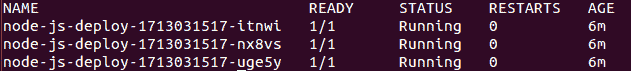

部署 Pod 列表

从我们的设置中选择一个 pod，将其替换到以下命令中的位置，其中写着`{POD_NAME_FROM_YOUR_LISTING}`，然后运行该命令：

```
$ kubectl describe pod/{POD_NAME_FROM_YOUR_LISTING} | grep Image:

```

我们应该看到一个如下图所示的输出，其中包含当前镜像版本`0.1`：

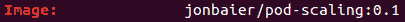

当前 Pod 图像

现在我们知道了我们当前的部署正在运行什么，让我们尝试更新到下一个版本。这可以通过使用`kubectl set`命令并指定新版本轻松实现，如下所示：

```
$ kubectl set image deployment/node-js-deploy node-js-deploy=jonbaier/pod-scaling:0.2

```

如果一切顺利，我们应该在屏幕上看到显示`deployment "node-js-deploy" image updated`的文本。

我们可以使用以下`rollout status`命令再次检查状态：

```
$ kubectl rollout status deployment/node-js-deploy

```

我们应该看到一些关于成功部署的文本。如果您看到任何关于等待部署完成的文本，您可能需要等待片刻，或者可以检查日志以查看问题。

完成后，再次运行`get pods`命令，就像之前一样。这次我们将看到新列出的 pods：

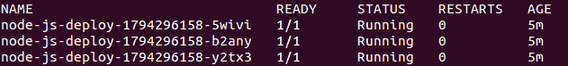

更新后的部署 Pod 列表

再次将您的一个 pod 名称插入我们之前运行的`describe`命令中。这次我们应该看到镜像已经更新为`0.2`。

在幕后发生的事情是 Kubernetes 为我们*部署*了一个新版本。它基本上创建了一个具有新版本的新副本集。一旦这个 pod 在线并且健康，它就会杀死一个旧版本。它继续这个行为，扩展新版本并缩减旧版本，直到只剩下新的 pods。

以下图示描述了您的工作流程供参考：

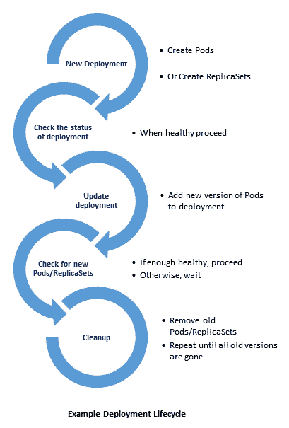

部署生命周期

值得注意的是，回滚定义允许我们在部署定义中控制 pod 替换方法。有一个`strategy.type`字段，默认为`RollingUpdate`和前面的行为。可选地，我们也可以指定`Recreate`作为替换策略，它将首先杀死所有旧的 pods，然后创建新版本。

# 历史和回滚

rollout api 的一个有用功能是跟踪部署历史。在检查历史之前，让我们再次更新一次。再次运行`kubectl set`命令，并指定版本`0.3`：

```
$ kubectl set image deployment/node-js-deploy node-js-deploy=jonbaier/pod-scaling:0.3

```

我们将再次看到屏幕上显示`deployment "node-js-deploy" image updated`的文本。现在再次运行`get pods`命令：

```
$ kubectl get pods -l name=node-js-deploy

```

让我们也查看一下我们的部署历史记录。运行`rollout history`命令：

```
$ kubectl rollout history deployment/node-js-deploy 

```

我们应该看到类似下面的输出：

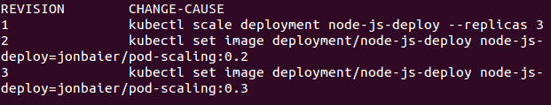

滚动历史

如我们所见，历史记录显示了初始部署创建、我们第一次更新到`0.2`，然后最终更新到`0.3`。除了状态和历史记录外，`rollout`命令还支持`pause`、`resume`和`undo`子命令。`rollout pause`命令允许我们在滚动仍在进行时暂停命令。这对故障排除很有用，也对金丝雀式启动很有帮助，我们希望在向整个用户群推出新版本之前对新版本进行最终测试。当我们准备继续滚动时，我们只需使用`rollout resume`命令。

但是如果出现问题怎么办？这就是`rollout undo`命令和滚动历史本身真正方便的地方。让我们模拟这种情况，尝试更新到尚未可用的版本的 pod。我们将图像设置为版本`42.0`，该版本不存在：

```
$ kubectl set image deployment/node-js-deploy node-js-deploy=jonbaier/pod-scaling:42.0

```

我们应该仍然看到屏幕上显示`deployment "node-js-deploy" image updated`的文本。但是如果我们检查状态，会发现它仍在等待：

```
$ kubectl rollout status deployment/node-js-deploy

```

我们可以按下*Ctrl* + *C*来终止`status`命令，然后再次运行`get pods`命令：

```
$ kubectl get pods -l name=node-js-deploy

```

我们现在应该看到一个`ErrImagePull`，如下面的截图：

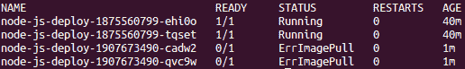

图像拉取错误

正如我们预期的那样，它不能拉取图像的 42.0 版本，因为该版本不存在。此外，如果我们在集群上资源不足或者达到了为我们命名空间设置的限制，我们可能还会在部署方面遇到问题。此外，部署可能因许多应用程序相关原因而失败，例如健康检查失败、权限问题和应用程序错误等。

每当发生无法滚动部署的失败时，我们可以通过使用`rollout undo`命令轻松回滚到先前的版本。此命令将把我们的部署退回到之前的版本：

```
$ kubectl rollout undo deployment/node-js-deploy

```

之后，我们可以再次运行`rollout status`命令，应该会看到一切都成功滚动了。再次运行`rollout history`命令，我们会看到我们尝试滚动到版本`42.0`，以及回滚到`0.3`的情况：

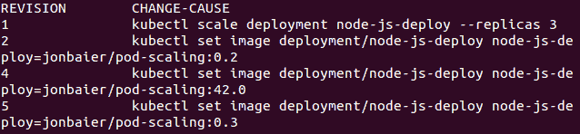

回滚后的滚动历史

在运行撤消时，我们还可以指定`--to-revision`标志以回滚到特定版本。在我们的滚动成功后，但我们后来发现有逻辑错误时，这可能很方便。

# 自动缩放

正如你所看到的，部署是对复制控制器的重大改进，使我们能够无缝更新我们的应用程序，同时与 Kubernetes 的其他资源以类似的方式集成。

在前一章中我们看到的另一个领域，也支持部署，就是**水平 Pod 自动缩放器**（**HPAs**）。正如你可能猜到的那样，这也与部署完美集成。我们将快速重制前一章的 HPAs，这次使用我们到目前为止创建的部署：

```
apiVersion: autoscaling/v1
kind: HorizontalPodAutoscaler
metadata:
  name: node-js-deploy
spec:
  minReplicas: 3
  maxReplicas: 6
  scaleTargetRef:
    apiVersion: v1
    kind: Deployment
    name: node-js-deploy
  targetCPUUtilizationPercentage: 10

```

*Listing 5-3.* `node-js-deploy-hpa.yaml`

我们已经将 CPU 阈值降低到 `10%` 并将我们的最小和最大 pod 更改为分别是 `3` 和 `6`。使用我们信赖的 `kubectl create -f` 命令创建前述 HPA。完成后，我们可以使用 `kubectl get hpa` 命令检查其是否可用：

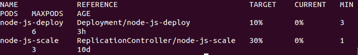

水平 Pod 自动缩放器

我们还可以通过 `kubectl get deploy` 命令检查我们只运行了 `3` 个 pod。现在让我们添加一些负载以触发自动扩展器：

```
apiVersion: extensions/v1beta1
kind: Deployment
metadata:
  name: boomload-deploy
spec:
  replicas: 1
  template:
    metadata:
      labels:
        app: loadgenerator-deploy
    spec:
      containers:
      - image: williamyeh/boom
        name: boom-deploy
        command: ["/bin/sh","-c"]
        args: ["while true ; do boom http://node-js-deploy/ -c 10 -n
        100 ; sleep 1 ;     
        done"]

```

*Listing 5-4.* `boomload-deploy.yaml`

像往常一样创建 *listing 5-4*。现在使用交替的 `kubectl get hpa` 和 `kubectl get deploy` 命令监视 HPA。几分钟后，我们应该看到负载跳到 `10%` 以上。再过一会儿，我们还应该看到 pod 数量增加到 `6` 个副本：

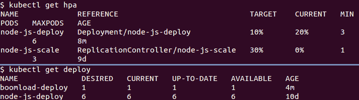

HPA 增加和 Pod 扩容

同样，我们可以通过删除我们的负载生成 pod 并等待片刻来清理这一点：

```
$ kubectl delete deploy boomload-deploy

```

同样，如果我们观察 HPA，我们将开始看到 CPU 使用率下降。几分钟后，我们的 CPU 负载将降至 `0%`，然后 Deployment 将缩减到 `3` 个副本。

# 工作

部署和复制控制器是确保长时间运行的应用程序始终处于运行状态并能够容忍各种基础设施故障的好方法。然而，有一些情况下这并不能解决 —— 特别是短期运行的、*仅运行一次*的任务以及定期计划的任务。在这两种情况下，我们需要任务运行直到完成，然后在下一个计划的时间间隔开始终止并重新启动。

为了解决这种类型的工作负载，Kubernetes 添加了一个 **批处理 API**，其中包括 **Job** 类型。此类型将创建 1 到 n 个 pod，并确保它们全部成功完成退出。根据 `restartPolicy`，我们可以允许 pod 简单地失败而不进行重试（`restartPolicy: Never`），或者在 pod 退出而没有成功完成时进行重试（`restartPolicy: OnFailure`）。在这个例子中，我们将使用后者的技术：

```
apiVersion: batch/v1
kind: Job
metadata:
  name: long-task
spec:
  template:
    metadata:
      name: long-task
    spec:
      containers:
      - name: long-task
        image: docker/whalesay
        command: ["cowsay", "Finishing that task in a jiffy"]
      restartPolicy: OnFailure

```

*Listing 5-5*: `longtask.yaml`

让我们用以下命令运行：

```
$ kubectl create -f longtask.yaml

```

如果一切顺利，您将在屏幕上看到打印出 `job "long-task" created`。

这告诉我们该任务已创建，但并不告诉我们是否成功完成了。要检查这一点，我们需要使用以下命令查询任务状态：

```
$ kubectl describe jobs/long-task

```

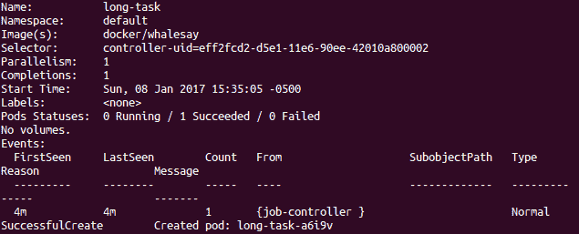

任务状态

您应该看到我们有`1`个成功完成的任务，在`Events`日志中，有一个 SuccessfulCreate 消息。如果我们使用`kubectl get pods`命令，我们将看不到我们的**long-task** pods 在列表中，但是如果列表底部指出有未显示的已完成作业，则可能会注意到该消息。我们需要再次使用`-a`或`--show-all`标志运行命令，以查看**long-task** pod 和已完成的作业状态。

让我们深入一点，以证明工作已成功完成。我们可以使用`logs`命令查看 pod 的日志。但是，我们也可以使用 UI 来完成这个任务。打开浏览器，转到以下 UI 网址：`https://**<your master ip>**/ui/`

点击*Jobs*，然后从列表中选择*long-task*，以便我们可以查看详细信息。然后，在 Pods 部分，单击那里列出的 pod。这将给我们提供 Pod 详细信息页面。在详细信息底部，单击*查看日志*，我们将看到日志输出：

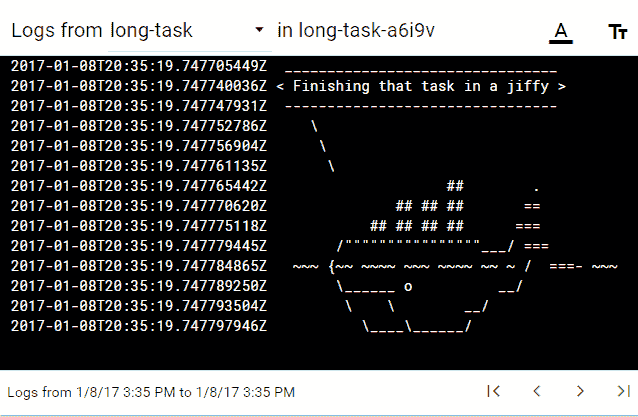

作业日志

如您在上图中所见，whalesay 容器已经完成了 ASCII 艺术，并且我们自定义的消息来自示例中的运行时参数。

# 其他类型的作业

虽然此示例提供了关于短期运行作业的基本介绍，但它仅涉及一次性任务的用例。实际上，批处理工作通常是**并行**进行的，或者作为定期发生的任务的一部分。

# 并行作业

使用**并行**作业，我们可能正在从正在进行的队列中获取任务，或者仅运行一组不相互依赖的任务。在从队列中获取作业的情况下，我们的应用程序必须了解依赖关系，并具有逻辑来决定如何处理任务以及下一步要处理的内容。Kubernetes 只是在调度这些作业。

您可以从 Kubernetes 文档和批处理 API 参考中了解有关并行作业的更多信息（您可以在本章末尾的*参考*部分中查看有关此的更多详细信息）。

# 计划任务

对于需要定期运行的任务，Kubernetes 还发布了 alpha 版的`CronJob`类型。正如我们所期望的，此类作业使用底层的 cron 格式来指定我们希望运行的任务的时间表。默认情况下，我们的集群不会启用 alpha 批处理功能，但是我们可以查看一个示例`CronJob`列表，以了解这些类型的工作负载将如何继续工作：

```
apiVersion: batch/v2alpha1
kind: CronJob
metadata:
  name: long-task-cron
spec:
  schedule: "15 10 * * 6"
  jobTemplate:
    spec:
      template:
        spec:
          containers:
          - name: long-task-cron
            image: docker/whalesay
            command: ["cowsay", "Developers! Developers! Developers!
          \n\n Saturday task    
            complete!"]
          restartPolicy: OnFailure

```

*清单 5-6.*`longtask-cron.yaml`

如您所见，计划部分反映了具有以下格式的 crontab：

**分钟 小时 月中日 月份 周中的日**

在本示例中，`15 10 * * 6`创建了一个任务，将在每个`星期六`的上午 10:15 运行。

# 守护进程集

虽然 Replication Controllers 和 Deployments 在确保特定数量的应用程序实例正在运行方面表现出色，但它们是在最佳适合的情况下进行的。这意味着调度器会寻找满足资源需求（可用 CPU、特定存储卷等）的节点，并尝试在节点和区域之间分配。

这对于创建高可用和容错应用程序非常有效，但是对于我们需要在集群的每个节点上运行代理的情况怎么办？虽然默认的分布确实尝试使用不同的节点，但它不保证每个节点都有副本，实际上只会填充与 RC 或 Deployment 规范中指定的数量相当的节点。

为了减轻这一负担，Kubernetes 引入了`DaemonSet`，它简单地定义了一个 pod 在集群的每个节点或定义的一部分节点上运行。这对于许多生产相关的活动非常有用，例如监控和日志代理、安全代理和文件系统守护程序。

实际上，Kubernetes 已经在一些核心系统组件中使用了这种能力。如果我们回顾一下第一章，*Kubernetes 简介*，我们会看到一个`node-problem-detector`在节点上运行。这个 pod 实际上是作为`DaemonSet`在集群的每个节点上运行的。我们可以通过在`kube-system`命名空间中查询 DaemonSets 来看到这一点：

```
$ kubectl get ds --namespace=kube-system

```

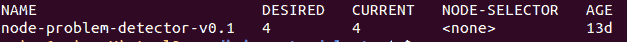

kube-system DaemonSets

你可以在以下清单中找到关于`node-problem-detector`以及`yaml`的更多信息：[`kubernetes.io/docs/admin/node-problem/#node-problem-detector`](http://kubernetes.io/docs/admin/node-problem/#node-problem-detector)：

```
apiVersion: extensions/v1beta1
kind: DaemonSet
metadata:
  name: node-problem-detector-v0.1
  namespace: kube-system
  labels:
    k8s-app: node-problem-detector
    version: v0.1
    kubernetes.io/cluster-service: "true"
spec:
  template:
    metadata:
      labels:
        k8s-app: node-problem-detector
        version: v0.1
        kubernetes.io/cluster-service: "true"
    spec:
      hostNetwork: true
      containers:
      - name: node-problem-detector
        image: gcr.io/google_containers/node-problem-detector:v0.1
        securityContext:
          privileged: true
        resources:
          limits:
            cpu: "200m"
            memory: "100Mi"
          requests:
            cpu: "20m"
            memory: "20Mi"
        volumeMounts:
        - name: log
          mountPath: /log
          readOnly: true
        volumes:
        - name: log
          hostPath:
            path: /var/log/

```

*清单 5-7\. node-problem-detector 定义*

# 节点选择

正如前面提到的，我们也可以将 DaemonSets 安排在节点的子集上运行。这可以通过称为**nodeSelectors**的东西来实现。它们允许我们通过查找特定的标签和元数据来限制 pod 运行的节点。它们只是在每个节点的标签上匹配键值对。我们可以添加自己的标签或使用默认分配的标签。

默认标签列在以下表中：

| **默认节点标签** | **描述** |
| --- | --- |
| `kubernetes.io/hostname` | 这显示了底层实例或机器的主机名 |
| `beta.kubernetes.io/os` | 这显示了通过 Go 语言报告的底层操作系统。 |
| `beta.kubernetes.io/arch` | 这显示了通过 Go 语言报告的底层处理器架构。 |
| `beta.kubernetes.io/instance-type` | (**仅限云**) 底层云提供商的实例类型 |
| `failure-domain.beta.kubernetes.io/region` | (**仅限云**) 底层云提供商的区域 |
| `failure-domain.beta.kubernetes.io/zone` | (**仅限云**) 底层云提供商的容错区域 |

*表 5.1 - Kubernetes 默认节点标签*

我们不仅限于 DaemonSets，因为 nodeSelectors 实际上也适用于 Pod 定义，并且不限于 DaemonSets。让我们仔细看看作业示例（对我们之前的长任务示例进行了轻微修改）。

首先，我们可以在节点上看到这些。让我们获取我们节点的名称：

```
$ kubectl get nodes

```

使用前一个命令的输出中的名称并将其插入到这个命令中：

```
$ kubectl describe node <node-name>

```

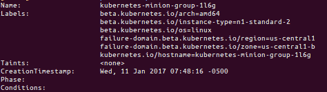

来自节点描述的摘录

现在让我们给这个节点添加一个昵称标签：

```
$ kubectl label nodes <node-name> nodenickname=trusty-steve

```

如果我们再次运行`kubectl describe node`命令，我们将看到此标签列在默认值旁边。现在我们可以调度工作负载并指定这个特定的节点。以下是我们早期的长时间运行任务的修改版本，添加了`nodeSelector`：

```
apiVersion: batch/v1
kind: Job
metadata:
  name: long-task-ns
spec:
  template:
    metadata:
      name: long-task-ns
    spec:
      containers:
      - name: long-task-ns
        image: docker/whalesay
        command: ["cowsay", "Finishing that task in a jiffy"]
      restartPolicy: OnFailure
      nodeSelector:
        nodenickname: trusty-steve

```

*图 5-8.* `longtask-nodeselector.yaml`

用 `kubectl create -f` 从此列表创建作业。

一旦成功，它将根据前述规范创建一个 pod。由于我们已经定义了`nodeSelector`，它将尝试在具有匹配标签的节点上运行 pod，并在找不到候选节点时失败。我们可以通过在查询中指定作业名称来找到该 pod，如下所示：

```
$ kubectl get pods -a -l job-name=long-task-ns

```

我们使用`-a`标志来显示所有 pod。作业的生命周期很短，一旦进入完成状态，它们就不会出现在基本的`kubectl get pods`查询中。我们还使用`-l`标志来指定具有`job-name=long-task-ns`标签的 pod。这将给我们提供 pod 名称，我们可以将其推入以下命令：

```
$ kubectl describe pod <Pod-Name-For-Job> | grep Node: 

```

结果应该显示此 pod 所在节点的名称。如果一切顺利，它应该与我们之前用`trusty-steve`标签标记的节点匹配。

# 概要

现在你应该对 Kubernetes 中的核心构造有一个良好的基础。我们探讨了新的 Deployment 抽象及其如何改进基本的 Replication Controller，从而实现了平滑的更新和与服务及自动缩放的坚实集成。我们还查看了作业和 DaemonSets 中的其他类型的工作负载。你学会了如何运行短期或批处理任务，以及如何在我们的集群中的每个节点上运行代理。最后，我们简要地看了一下节点选择以及如何用它来过滤集群中用于我们工作负载的节点。

我们将在本章学到的内容的基础上继续，然后在下一章中查看**有状态**应用程序，探索关键的应用程序组件和数据本身。

# 参考资料

1.  [`kubernetes.io/docs/user-guide/jobs/#parallel-jobs`](https://kubernetes.io/docs/user-guide/jobs/#parallel-jobs)
