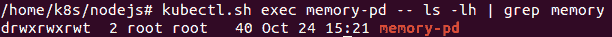
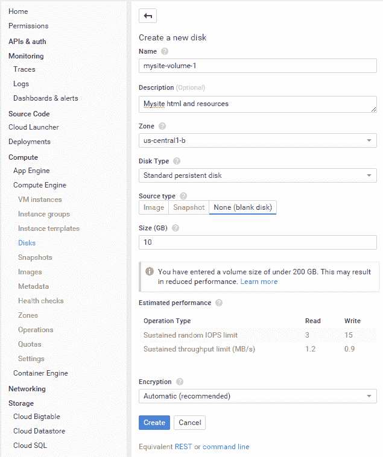
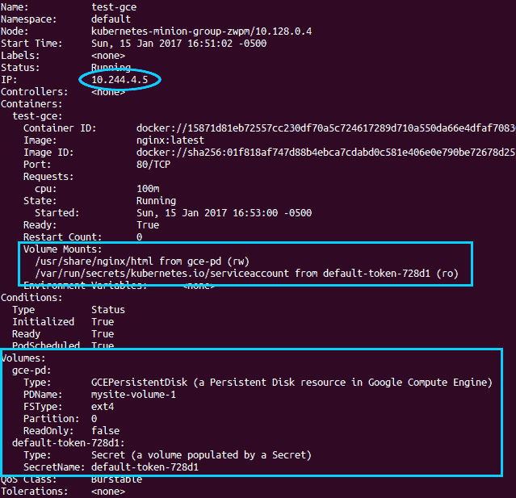
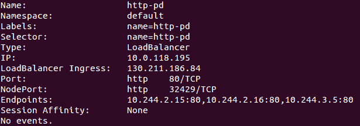
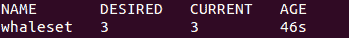
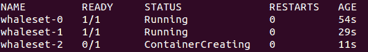
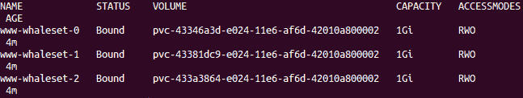
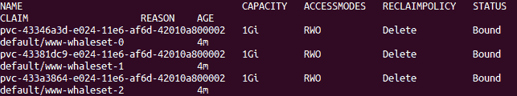
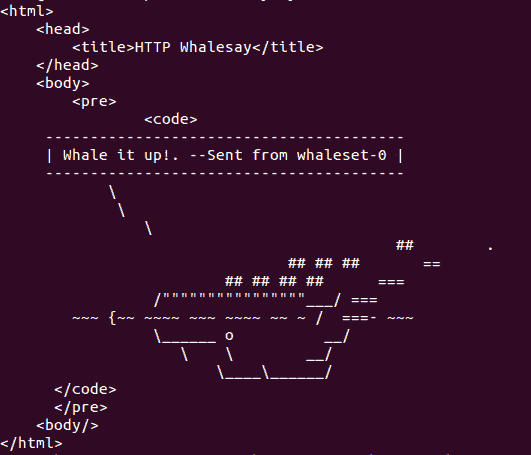
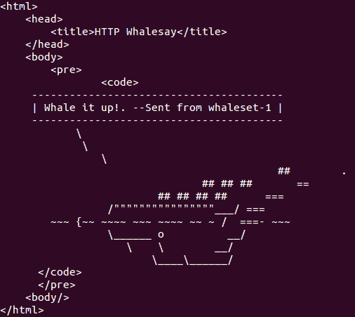

# 第六章：存储和运行有状态应用程序

在本章中，我们将讨论如何附加持久卷并为有状态应用程序和数据创建存储。我们将详细介绍存储方面的问题以及如何在容器的生命周期内跨 pod 持久化数据。我们将探索**PersistentVolumes**类型以及**PersistentVolumeClaim**。最后，我们将看一下版本 1.5 中新发布的**StatefulSets**。

本章将讨论以下主题：

+   持久存储

+   PersistentVolumes

+   PersistentVolumeClaims

+   StorageClasses

+   StatefulSets

# 持久存储

到目前为止，我们只处理了可以随意启动和停止的工作负载，没有任何问题。然而，现实世界的应用程序通常具有状态，并记录我们希望（甚至坚持）不要丢失的数据。容器本身的瞬时性质可能是一个很大的挑战。如果您还记得我们在第一章 *Kubernetes 简介*中对分层文件系统的讨论，顶层是可写的。（它也是糖霜，非常美味。）但是，当容器死亡时，数据也会随之而去。 Kubernetes 重新启动的已崩溃容器也是如此。

这就是**卷**或磁盘发挥作用的地方。一个存在于容器之外的卷使我们能够在容器中断期间保存重要数据。此外，如果我们在 pod 级别有一个卷，数据可以在同一应用程序堆栈中的多个容器之间以及同一 pod 内部共享。

Docker 本身对卷有一些支持，但 Kubernetes 为我们提供了持久存储，可以持续存在于单个容器的生命周期之外。这些卷与 pod 相关联，并与这些 pod 一起生存和死亡。此外，一个 pod 可以有多个来自各种来源的卷。让我们看一下其中一些来源。

# 临时磁盘

在容器崩溃和 pod 内数据共享之间实现改进的持久性的最简单方法之一是使用`emptydir`卷。此卷类型可与节点机器本身的存储卷或可选的 RAM 磁盘一起使用，以实现更高的性能。

再次改进我们的持久性超出一个单独的容器，但是当一个 pod 被移除时，数据将会丢失。机器重启也会清除 RAM 类型磁盘中的任何数据。有时我们只需要一些共享的临时空间或者有处理数据并在死亡之前将其传递给另一个容器的容器。无论情况如何，以下是使用这个临时磁盘和 RAM 支持选项的快速示例。

打开您喜欢的编辑器，并创建一个类似以下*Listing 6-1*的文件：

```
apiVersion: v1 
kind: Pod 
metadata: 
  name: memory-pd 
spec: 
  containers: 
  - image: nginx:latest 
    ports: 
    - containerPort: 80 
    name: memory-pd 
    volumeMounts: 
    - mountPath: /memory-pd 
      name: memory-volume 
  volumes: 
  - name: memory-volume 
    emptyDir: 
      medium: Memory 

```

*Listing 6-1*: `storage-memory.yaml`

前面的例子现在可能已经是家常便饭了，但我们将再次发出一个`create`命令，然后是一个`exec`命令，以查看容器中的文件夹：

```
$ kubectl create -f storage-memory.yaml
$ kubectl exec memory-pd -- ls -lh | grep memory-pd 

```

这将为我们在容器本身中提供一个 bash shell。`ls` 命令显示我们在顶级看到一个 `memory-pd` 文件夹。我们使用 `grep` 来过滤输出，但是你可以不用 `| grep memory-pd` 来运行命令以查看所有文件夹：



容器内的临时存储

再次说明，这个文件夹是非常临时的，因为所有内容都存储在节点（minion）的 RAM 中。当节点重新启动时，所有文件都将被删除。接下来我们将看一个更加永久的例子。

# 云存储卷

许多公司已经在公共云中运行了大量基础架构。幸运的是，Kubernetes 原生支持两个最受欢迎提供者提供的持久存储。

# GCE 持久磁盘

我们从 GCE 网站中获得了以下内容：

<q>Google Persistent Disk 是 Google 云平台的持久且高性能的块存储。持久磁盘提供 SSD 和 HDD 存储，可附加到运行在 Google Compute Engine 或 Google Container Engine 中的实例。存储卷可以透明地调整大小，快速备份，并具有支持同时读取的能力。</q>（你可以在本章末尾的*参考*部分中查看关于此的更多详细信息）

让我们创建一个新的 **GCE 持久磁盘**。

1.  从控制台中，在 Compute Engine 中，转到“磁盘”。在这个新屏幕上，点击“创建磁盘”按钮。我们将看到一个类似于下图的屏幕。

1.  为此卷选择一个名称并简要描述它。确保区域与集群中的节点相同。GCE PD 只能附加到相同区域中的机器上。

1.  在“名称”字段中输入 `mysite-volume-1`。选择与集群中至少一个节点匹配的区域。选择“无”（空白磁盘）作为“源类型”，并在“大小（GB）”中输入 `10`（10 GB）作为值。最后，点击“创建”：



GCE 新持久磁盘

在 GCE 上，持久磁盘的好处是它们允许挂载到多台机器（在我们的情况下是节点）。然而，当挂载到多台机器时，卷必须处于只读模式。因此，让我们首先将其挂载到单个 Pod 上，以便我们可以创建一些文件。使用 *列表 6-2*：`storage-gce.yaml` 如下创建一个将以读/写模式挂载磁盘的 Pod：

```
apiVersion: v1 
kind: Pod 
metadata: 
  name: test-gce 
spec: 
  containers: 
  - image: nginx:latest 
    ports: 
    - containerPort: 80 
    name: test-gce 
    volumeMounts: 
    - mountPath: /usr/share/nginx/html 
      name: gce-pd 
  volumes: 
  - name: gce-pd 
    gcePersistentDisk: 
      pdName: mysite-volume-1 
      fsType: ext4 

```

*列表 6-2*：`storage-gce.yaml`

首先，让我们发出一个 `create` 命令，然后是一个 `describe` 命令，以找出它正在哪个节点上运行：

```
$ kubectl create -f storage-gce.yaml 
$ kubectl describe pod/test-gce

```

注意节点并保存该 Pod 的 IP 地址以备后用。然后，打开一个 SSH 会话到该节点：



具有持久磁盘的 Pod 描述

输入以下命令：

```
$ gcloud compute --project "<Your project ID>" ssh --zone "<your gce zone>" "<Node running test-gce pod>" 

```

由于我们已经从正在运行的容器内部查看了卷，所以这次让我们直接从节点（minion）本身访问它。我们将运行一个 `df` 命令来查看它被挂载在哪里，但我们需要先切换到 root 用户：

```
$ sudo su -
$ df -h | grep mysite-volume-1 

```

正如你所见，GCE 卷直接挂载到节点本身。我们可以使用前面`df`命令的输出中列出的挂载路径。现在使用`cd`切换到该文件夹。然后，使用你喜欢的编辑器创建一个名为`index.html`的新文件：

```
$ cd /var/lib/kubelet/plugins/kubernetes.io/gce-pd/mounts/mysite-volume-1
$ vi index.html 

```

输入一条简短的消息，比如`Hello from my GCE PD!`。现在保存文件并退出编辑器。如果你还记得 *列表 6-2* 中提到的，PD 是直接挂载到 Nginx HTML 目录的。所以，让我们在节点上仍然保持 SSH 会话的情况下测试一下。对我们之前记下的 pod IP 执行一个简单的`curl`命令：

```
$ curl <Pod IP from Describe> 

```

你应该能看到来自我的 GCE PD 的消息，或者你在`index.html`文件中保存的任何消息。在真实的场景中，我们可以为整个网站或任何其他中央存储使用这个卷。让我们来看看运行一组负载均衡的 Web 服务器，它们都指向同一个卷。

首先，使用两个`exit`命令离开 SSH 会话。在继续之前，我们需要删除`test-gce` pod，这样卷就可以被挂载为只读在多个节点上：

```
$ kubectl delete pod/test-gce 

```

现在我们可以创建一个 RC，它将运行三个 Web 服务器，所有服务器都挂载相同的持久磁盘，如下所示：

```
apiVersion: v1 
kind: ReplicationController 
metadata: 
  name: http-pd 
  labels: 
    name: http-pd 
spec: 
  replicas: 3 
  selector: 
    name: http-pd 
  template: 
    metadata: 
      name: http-pd 
      labels:
        name: http-pd
    spec: 
      containers: 
      - image: nginx:latest 
        ports: 
        - containerPort: 80 
        name: http-pd 
        volumeMounts: 
        - mountPath: /usr/share/nginx/html 
          name: gce-pd 
      volumes: 
      - name: gce-pd 
        gcePersistentDisk: 
          pdName: mysite-volume-1 
          fsType: ext4 
          readOnly: true 

```

*列表 6-3*：`http-pd-controller.yaml`

我们还要创建一个外部服务，这样我们就可以从集群外部看到它：

```
apiVersion: v1 
kind: Service 
metadata: 
  name: http-pd 
  labels: 
    name: http-pd 
spec: 
  type: LoadBalancer 
  ports: 
  - name: http 
    protocol: TCP 
    port: 80 
  selector: 
    name: http-pd 

```

*列表 6-4*：`http-pd-service.yaml`

现在创建这两个资源。等待一段时间以分配外部 IP。之后，`describe`命令将给我们一个可以在浏览器中使用的 IP：

```
$ kubectl describe service/http-pd 

```

以下屏幕截图是上述命令的结果：



K8s 服务与 GCE PD 跨三个 pod 共享

如果你还没有看到`LoadBalancer Ingress`字段，那可能需要更多时间来分配。将`LoadBalancer Ingress`中的 IP 地址键入到浏览器中，你应该能看到我们之前输入的熟悉的`index.html`文件显示出来的文本！

# AWS 弹性块存储

K8s 还支持 AWS **弹性块存储**（**EBS**）卷。与 GCE PD 相同，EBS 卷需要附加到在相同可用性区域运行的实例上。进一步的限制是，EBS 只能一次挂载到单个实例上。

为了简洁起见，我们不会演示 AWS 示例，但包含了一个示例 YAML 文件以帮助你开始。同样，记得在 pod 之前创建 EBS 卷：

```
apiVersion: v1 
kind: Pod 
metadata: 
  name: test-aws 
spec: 
  containers: 
  - image: nginx:latest 
    ports: 
    - containerPort: 80 
    name: test-aws 
    volumeMounts: 
    - mountPath: /usr/share/nginx/html 
      name: aws-pd 
  volumes: 
  - name: aws-pd 
    awsElasticBlockStore: 
      volumeID: aws://<availability-zone>/<volume-id> 
      fsType: ext4 

```

*列表 6-5*：`storage-aws.yaml`

# 其他存储选项

Kubernetes 支持各种其他类型的存储卷。完整列表可以在这里找到：[`kubernetes.io/v1.0/docs/user-guide/volumes.html#types-of-volumes`](http://kubernetes.io/v1.0/docs/user-guide/volumes.html#types-of-volumes)。 [](http://kubernetes.io/v1.0/docs/user-guide/volumes.html#types-of-volumes)

这里有一些可能特别感兴趣的：

+   `nfs`：这种类型允许我们挂载**网络文件共享**（**NFS**），对于持久化数据并在基础设施中共享它非常有用

+   `gitrepo`：你可能已经猜到了，这个选项将一个 Git 仓库克隆到一个新的空文件夹中。

# 持久卷和存储类

到目前为止，我们已经看到了在我们的 Pod 定义中直接供应存储的例子。如果您完全控制您的集群和基础设施，这种方法运行得很好，但在更大规模上，应用程序所有者将希望使用单独管理的存储。通常，一个中央 IT 团队或云提供商本身将负责管理存储的细节，并让应用程序所有者担心他们的主要关注点，即应用程序本身。

为了适应这一点，我们需要一种方法，让应用程序指定和请求存储而不用担心如何提供存储。这就是`PersistentVolumes`和`PersistentVolumeClaims`发挥作用的地方。`PersistentVolumes`类似于我们之前创建的`volumes`，但是它们由集群管理员提供，并且不依赖于特定的 Pod。然后，Pod 可以使用`PersistentVolumeClaims`声明来声明此卷。

`PersistentVolumeClaims`允许我们指定所需存储的细节。我们可以定义存储量以及访问类型，如`ReadWriteOnce`（一个节点读写）、`ReadOnlyMany`（多个节点只读）和`ReadWriteMany`（多个节点读写）。当然，支持哪些模式取决于支持的后端存储提供者。例如，我们在 AWS EBS 示例中看到，挂载到多个节点不是一个选项。

此外，Kubernetes 提供了另外两种指定特定分组或存储卷类型的方法。第一种是使用选择器，就像我们之前为 Pod 选择所见的那样。在这里，标签可以应用于存储卷，然后声明可以引用这些标签以进一步过滤它们所提供的卷。其次，Kubernetes 具有 StorageClass 的概念，允许我们指定一个存储提供程序和用于其提供的卷类型的参数。

我们将在下一节深入研究 StorageClasses，但这里有一个`PersistentVolumeClaims`的快速示例，以便说明目的。您可以在注释中看到我们请求以`ReadWriteOnce`模式和`solidstate`存储类的`1Gi`存储，并带有`aws-storage`标签。

```
kind: PersistentVolumeClaim
apiVersion: v1
metadata:
  name: demo-claim
  annotations:
    volume.beta.kubernetes.io/storage-class: "solidstate"
spec:
  accessModes:
  - ReadWriteOnce
  resources:
    requests:
      storage: 1Gi
  selector:
    matchLabels:
      release: "aws-storage"

```

*清单 6-6：* `pvc-example.yaml`

# 有状态副本集

**StatefulSets**的目的是为具有状态数据的应用程序部署提供一些一致性和可预测性。到目前为止，我们已经将应用程序部署到集群中，定义了对所需资源（如计算和存储）的松散要求。集群已经在满足这些要求的任何节点上安排了我们的工作负载。虽然我们可以使用其中一些约束以更可预测的方式部署，但如果我们有一个构造来帮助我们提供这种一致性将会很有帮助。

当我们完成此书稿时，StatefulSets 已经设置为 GA 版本 1.6。它们之前是 beta 版本 1.5，之前称为 PetSets（1.3 和 1.4 中的 alpha 版本）。

这就是 StatefulSets 的用武之地。StatefulSets 首先为我们提供了有序和可靠的命名，用于网络访问和存储索赔。这些 pod 本身的命名采用以下约定，其中 `N` 从 0 到副本数：

```
"Name of Set"-N

```

这意味着名为 `db` 的 Statefulset 有 3 个副本将创建以下 pod：

```
db-0
db-1
db-2

```

这使得 Kubernetes 能够将网络名称和 `PersistentVolumes` 与特定的 pod 关联起来。此外，它还用于对 pod 的创建和终止进行排序。Pod 将从 `0` 开始启动，并从 `N` 开始终止。

# 一个有状态的示例

让我们看一个有状态应用程序的示例。首先，我们将想要创建和使用一个 `StorageClass`，正如我们之前讨论的一样。这将允许我们连接到 Google Cloud Persistent Disk provisioner。Kubernetes 社区正在为各种 `StorageClasses` 构建 provisioners，包括 GCP 和 AWS。每个 provisioner 都有一组可用的参数。GCP 和 AWS 提供商都可以让您选择磁盘类型（固态、标准等）以及故障域，这是需要与其附加的 pod 匹配的。AWS 还允许您指定加密参数以及针对 Provisioned IOPs 卷的 IOPs。还有一些其他 provisioner 正在进行中，包括 Azure 和各种非云选项：

```
kind: StorageClass
apiVersion: storage.k8s.io/v1beta1
metadata:
  name: solidstate
provisioner: kubernetes.io/gce-pd
parameters:
  type: pd-ssd
  zone: us-central1-b

```

*图示 6-7：* `solidstate-sc.yaml`

使用以下命令与前面的列表一起创建 `StorageClass` 类型的 SSD 驱动器在 `us-central1-b` 中：

```
$ kubectl create -f solidstate.yaml

```

接下来，我们将使用我们信任的 `httpwhalesay` 演示创建一个 `StatefulSet` 类型（您可以在本章末尾的 *参考资料* 中参考更多详细信息）。虽然该应用程序确实包含任何真实状态，但我们可以看到存储索赔并探索通信路径：

```
apiVersion: apps/v1beta1
kind: StatefulSet
metadata:
  name: whaleset
spec:
  serviceName: sayhey-svc
  replicas: 3
  template:
    metadata:
      labels:
        app: sayhey
    spec:
      terminationGracePeriodSeconds: 10
      containers:
      - name: sayhey
        image: jonbaier/httpwhalesay:0.2
        command: ["node", "index.js", "Whale it up!."]
        ports:
        - containerPort: 80
          name: web
        volumeMounts:
        - name: www
          mountPath: /usr/share/nginx/html
  volumeClaimTemplates:
  - metadata:
      name: www
      annotations:
        volume.beta.kubernetes.io/storage-class: solidstate
    spec:
      accessModes: [ "ReadWriteOnce" ]
      resources:
        requests:
          storage: 1Gi

```

*图示 6-8：* `sayhey-statefulset.yaml`

使用以下命令开始创建此 StatefulSet。如果您仔细观察 pod 的创建，您将看到它连续创建 whaleset-0、whaleset-1 和 whaleset-2：

```
$ kubectl create -f sayhey-statefulset.yaml

```

紧接着，我们可以使用熟悉的 `get` 子命令看到我们的 StatefulSet 和相应的 pod：

```
$ kubectl get statefulsets
$ kubectl get pods

```

这些 pod 应该会创建类似于以下图像的输出：



StatefulSet 列表

`get pods` 输出将显示以下内容：



由 StatefulSet 创建的 pod

根据您的时间安排，可能仍在创建 pod。如前面的图像所示，第三个容器仍在启动。

我们还可以看到集合为每个 pod 创建的卷和索赔。首先是 PersistentVolumes 本身：

```
$ kubectl get pv 

```

上述命令应显示三个名为`www-whaleset-N`的 PersistentVolumes。我们注意到大小为`1Gi`，访问模式设置为**ReadWriteOnce**（`RWO`），就像我们在 StorageClass 中定义的一样：



持久卷清单

接下来，我们可以查看为每个 pod 保留卷的 PersistentVolumeClaims：

```
$ kubectl get pvc

```

以下是前述命令的输出：



持久卷索赔清单

在这里，您会注意到与 PV 自身相同的设置很多。您可能还会注意到声明名称的结尾（或上一个列表中的 PV 名称）看起来像`www-whaleset-N`。`www`是我们在之前的 YAML 定义中指定的挂载名称。然后将其附加到 pod 名称以创建实际的 PV 和 PVC 名称。我们还可以确保与之关联的适当磁盘与匹配的 pod 相关联。

另一个这种对齐很重要的领域是网络通信。StatefulSets 在这里也提供一致的命名。在我们这样做之前，让我们创建一个服务端点，这样我们就有了一个常见的入口点用于传入的请求：

```
apiVersion: v1
kind: Service
metadata:
  name: sayhey-svc
  labels:
    app: sayhey
spec:
  ports:
  - port: 80
    name: web
  clusterIP: None
  selector:
    app: sayhey

```

*清单 6-9：*`sayhey-svc.yaml`

```
$ kubectl create -f sayhey-svc.yaml

```

现在让我们在其中一个 pod 中打开一个 shell，并查看是否可以与集合中的另一个 pod 通信：

```
$ kubectl exec whaleset-0 -i -t bash

```

执行上述命令会在第一个鲸鱼集群（whaleset）的 pod 中给我们提供一个 bash shell。现在我们可以使用`Service`名称来发出一个简单的 HTTP 请求。我们可以同时使用简称`sayhey-svc`和完全限定名称`sayhey-svc.default.svc.cluster.local`：

```
$ curl sayhey-svc
$ curl sayhey-svc.default.svc.cluster.local

```

您将看到与以下图像类似的输出。服务端点充当所有三个 pod 的共同通信点：



HTTP Whalesay curl 输出（whalesay-0 Pod）

现在让我们看看是否可以与 StatefulSet 中的特定 pod 进行通信。正如我们之前注意到的，StatefulSet 以有序的方式命名 pod。它还以类似的方式为它们提供主机名，以便为集合中的每个 pod 创建一个特定的 DNS 条目。同样，我们将看到`"集合名称"-N`的约定，然后添加完全限定的服务 URL。下面的示例展示了这一点，对于我们集合中的第二个 pod`whaleset-1`：

```
$ curl whaleset-1.sayhey-svc.default.svc.cluster.local

```

在鲸鱼集群（whaleset）的 Bash shell 中运行此命令将显示来自`whaleset-1`的输出：



HTTP Whalesay curl 输出（whalesay-1 Pod）

您现在可以使用`exit`退出此 shell。

出于学习目的，更详细地描述此部分的某些项目也很有益。例如，`kubectl describe svc sayhey-svc`将显示服务端点中的所有三个 pod IP 地址。

# 概要

在本章中，我们探讨了各种持久存储选项以及如何在我们的 pod 中实现它们。我们查看了 PersistentVolumes 以及允许我们将存储分配和应用程序存储请求分开的 PersistentVolumeClaims。此外，我们还查看了 StorageClasses，以根据规范为存储组提供存储。

我们还探讨了新的 StatefulSets 抽象，并学习了如何以一致和有序的方式部署有状态的应用程序。在下一章中，我们将看看如何将 Kubernetes 与持续集成和交付流水线集成起来。

# 参考资料

1.  [`cloud.google.com/persistent-disk/`](https://cloud.google.com/persistent-disk/)

1.  HTTP Whalesay 是 Docker whalesaym 的一种适应，而 Docker whalesaym 又是 Linux cowsay（大约在 1999 年，Tony Monroe）的一种适应 - [`hub.docker.com/r/docker/whalesay/`](https://hub.docker.com/r/docker/whalesay/)
