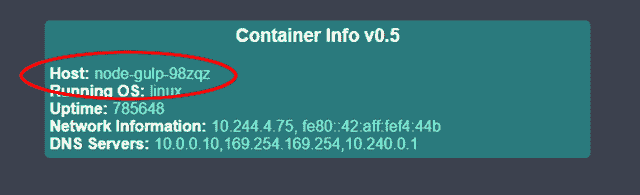
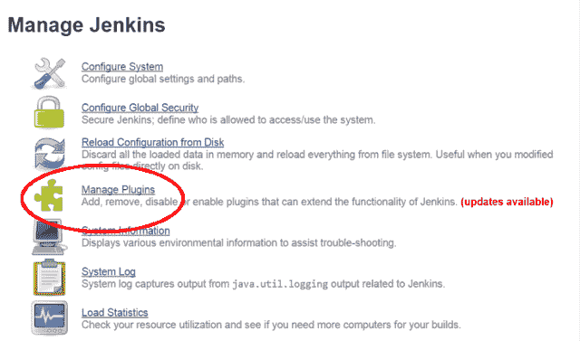
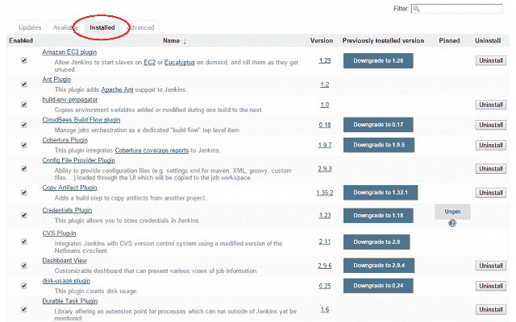
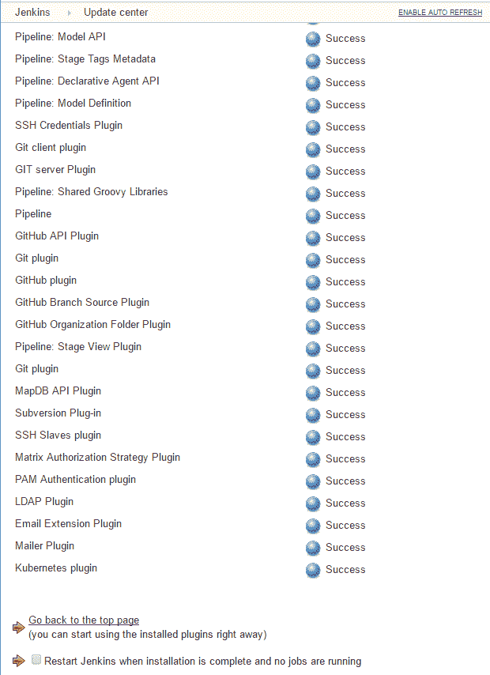
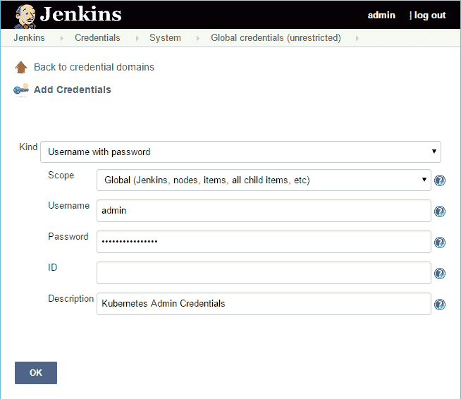
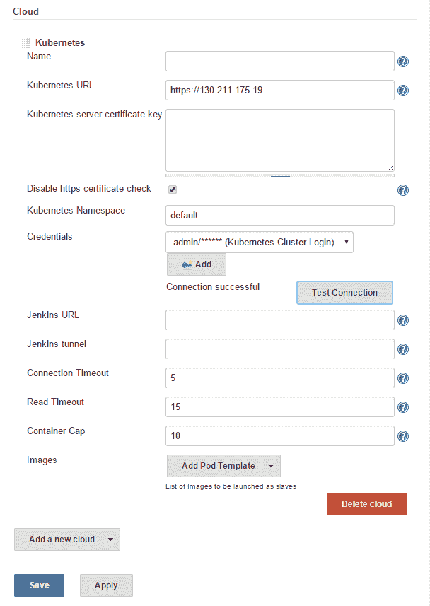
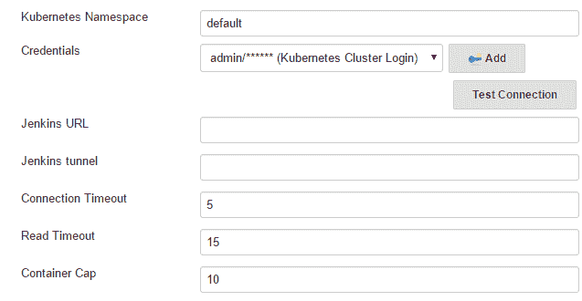
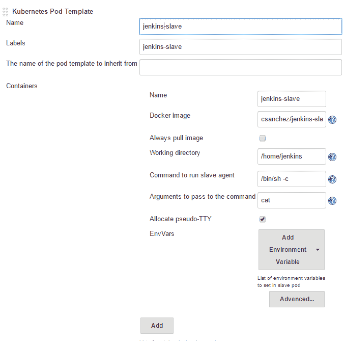

# 第七章：持续交付

本章将向读者展示如何将他们的构建流程和部署与 Kubernetes 集群集成。它将涵盖如何使用 Gulp.js 和 Jenkins 与您的 Kubernetes 集群配合使用的概念。

本章将讨论以下主题：

+   与持续部署流水线集成

+   使用 Gulp.js 与 Kubernetes

+   将 Jenkins 与 Kubernetes 集成

# 与持续交付流水线集成

持续集成和交付是现代开发工作室的关键组成部分。对于任何正在开发自己软件的公司来说，*上线速度*或*收益的平均时间*至关重要。我们将看看 Kubernetes 如何帮助您。

**CI/CD**（持续集成/持续交付的缩写）通常需要在代码库推送更改时提供临时构建和测试服务器。Docker 和 Kubernetes 非常适合这项任务，因为可以轻松在几秒钟内创建容器，并在运行构建后同样轻松地将其删除。此外，如果您的集群上已经有大量基础设施可用，那么利用空闲容量进行构建和测试是有意义的。

在本文中，我们将探讨用于构建和部署软件的两种流行工具：

+   **Gulp.js**：这是一个简单的任务执行器，用于使用**JavaScript**和**Node.js**自动化构建过程。

+   **Jenkins**：这是一个完整的持续集成服务器

# Gulp.js

Gulp.js 为我们提供了*Build as code*的框架。类似于*基础设施即代码*，这使我们能够以程序方式定义我们的构建过程。我们将通过一个简短的示例演示如何从 Docker 镜像构建到最终 Kubernetes 服务创建一个完整的工作流程。

# 先决条件

对于本文的这一部分，您需要已安装并准备好一个**NodeJS**环境，包括**node 包管理器**（**npm**）。如果您尚未安装这些软件包，可以在[`docs.npmjs.com/getting-started/installing-node`](https://docs.npmjs.com/getting-started/installing-node)找到安装说明。

您可以通过执行`node -v`命令检查 NodeJS 是否已正确安装。

您还需要**Docker CE**和一个**DockerHub**帐户来推送一个新的镜像。您可以在[`docs.docker.com/installation/`](https://docs.docker.com/installation/)找到安装 Docker CE 的说明。

您可以在[`hub.docker.com/`](https://hub.docker.com/)轻松创建一个 DockerHub 帐户。

在您拥有凭证后，您可以使用`$ docker login`命令通过 CLI 登录。

# Gulp 构建示例

让我们从创建一个名为`node-gulp`的项目目录开始：

```
$ mkdir node-gulp
$ cd node-gulp

```

接下来，我们将安装`gulp`包，并通过运行带有版本标志的`npm`命令来检查它是否准备好，如下所示：

```
$ npm install -g gulp

```

您可能需要打开一个新的终端窗口，确保`gulp`在您的路径上。同时，确保返回到您的`node-gulp`目录：

```
 $ gulp -v

```

接下来，我们将在项目文件夹中本地安装`gulp`以及`gulp-git`和`gulp-shell`插件，如下所示：

```
$ npm install --save-dev gulp
$ npm install gulp-git -save
$ npm install --save-dev gulp-shell

```

最后，我们需要创建一个 Kubernetes 控制器和服务定义文件，以及一个`gulpfile.js`文件，来运行我们的所有任务。同样，如果你希望复制它们，这些文件也可以在书籍文件包中找到。参考以下代码：

```
apiVersion: v1 
kind: ReplicationController 
metadata: 
  name: node-gulp 
  labels: 
    name: node-gulp 
spec: 
  replicas: 1 
  selector: 
    name: node-gulp 
  template: 
    metadata: 
      labels: 
        name: node-gulp 
    spec: 
      containers: 
      - name: node-gulp 
        image: <your username>/node-gulp:latest 
        imagePullPolicy: Always 
        ports: 
        - containerPort: 80 

```

*清单 7-1*：`node-gulp-controller.yaml`

正如你所见，我们有一个基本的控制器。你需要用你的 Docker Hub 用户名替换`**<your username>**/node-gulp:latest`：

```
apiVersion: v1 
kind: Service 
metadata: 
  name: node-gulp 
  labels: 
    name: node-gulp 
spec: 
  type: LoadBalancer 
  ports: 
  - name: http 
    protocol: TCP 
    port: 80 
  selector: 
    name: node-gulp 

```

*清单 7-2*：`node-gulp-service.yaml`

接下来，我们有一个简单的服务，它选择我们控制器中的 pods，并创建一个外部负载平衡器以便访问，就像以前一样：

```
var gulp = require('gulp'); 
var git = require('gulp-git'); 
var shell = require('gulp-shell'); 

// Clone a remote repo 
gulp.task('clone', function(){ 
  return git.clone('https://github.com/jonbaierCTP/getting-started-with-kubernetes-se.git', function (err) { 
    if (err) throw err; 
  }); 

}); 

// Update codebase 
gulp.task('pull', function(){ 
  return git.pull('origin', 'master', {cwd: './getting-started-with-kubernetes-se'}, function (err) { 
    if (err) throw err; 
  }); 
}); 

//Build Docker Image 
gulp.task('docker-build', shell.task([ 
  'docker build -t <your username>/node-gulp ./getting-started-with-kubernetes-se/docker-image-source/container-info/', 
  'docker push <your username>/node-gulp' 
])); 

//Run New Pod 
gulp.task('create-kube-pod', shell.task([ 
  'kubectl create -f node-gulp-controller.yaml', 
  'kubectl create -f node-gulp-service.yaml' 
])); 

//Update Pod 
gulp.task('update-kube-pod', shell.task([ 
  'kubectl delete -f node-gulp-controller.yaml', 
  'kubectl create -f node-gulp-controller.yaml' 
])); 

```

*清单 7-3*：`gulpfile.js`

最后，我们有`gulpfile.js`文件。这是我们定义所有构建任务的地方。同样，在`**<your username>**/node-gulp`部分填入你的 Docker Hub 用户名。

浏览文件，首先，克隆任务从 GitHub 下载我们的镜像源代码。拉取任务在克隆的存储库上执行`git pull`。接下来，`docker-build`命令从`container-info`子文件夹构建镜像并将其推送到 DockerHub。最后，我们有`create-kube-pod`和`update-kube-pod`命令。你可以猜到，`create-kube-pod`命令首次创建我们的控制器和服务，而`update-kube-pod`命令只是替换控制器。

让我们继续运行这些命令，看看我们的端到端工作流程：

```
$ gulp clone
$ gulp docker-build

```

第一次运行时，你可以执行以下`create-kube-pod`命令：

```
$ gulp create-kube-pod

```

就是这样。如果我们对`node-gulp`服务运行快速的`kubectl describe`命令，我们可以获取到新服务的外部 IP。浏览该 IP，你会看到熟悉的`container-info`应用程序正在运行。请注意，主机以`node-gulp`开头，就像我们在前面提到的 pod 定义中命名的一样：



由 Gulp 构建启动的服务

在后续更新中，像这样运行`pull`和`update-kube-pod`命令：

```
$ gulp pull
$ gulp docker-build
$ gulp update-kube-pod

```

这只是一个非常简单的示例，但你可以开始看到如何通过几行简单的代码协调你的构建和部署端到端是多么容易。接下来，我们将看看如何使用 Kubernetes 来实际运行 Jenkins 构建。

# 用于 Jenkins 的 Kubernetes 插件

我们可以使用 Kubernetes 运行我们的 CI/CD 流水线的一种方式是在容器化环境中运行我们的 Jenkins 构建节点。幸运的是，已经有一个插件，由 Carlos Sanchez 编写，允许你在 Kubernetes 的 pods 中运行 Jenkins 构建节点。

# 先决条件

你将需要一个 Jenkins 服务器来执行下一个示例。如果你没有可用的，你可以使用 Docker Hub 上提供的一个 Docker 镜像 [`hub.docker.com/_/jenkins/`](https://hub.docker.com/_/jenkins/)。

通过 Docker CLI 运行它就是这么简单的：

```
docker run --name myjenkins -p 8080:8080 -v /var/jenkins_home jenkins 

```

# 安装插件

登录到您的 Jenkins 服务器，从主页仪表板中，点击“管理 Jenkins”。然后，从列表中选择“管理插件”。

对于安装新的 Jenkins 服务器的注意事项：当您首次登录到 Jenkins 服务器时，它会要求您安装插件。选择默认插件或不安装插件将不会安装任何插件：



Jenkins 主面板

凭证插件是必需的，但应默认安装。如果有疑问，可以在“已安装”选项卡中查看，如下所示的截图：



Jenkins 已安装的插件

接下来，我们可以点击“可用”选项卡。Kubernetes 插件应该位于“集群管理和分布式构建”或“Misc (cloud)”下。有许多插件，因此您也可以在页面上搜索 Kubernetes。勾选 Kubernetes 插件的框，并点击“安装而不重启”。

这将安装 Kubernetes 插件和 Durable Task 插件：



插件安装

如果您希望安装非标准版本或只是喜欢调整，您可以选择下载插件。最新的 **Kubernetes** 和 **Durable Task** 插件可以在这里找到：

Kubernetes 插件: [`wiki.jenkins-ci.org/display/JENKINS/Kubernetes+Plugin`](https://wiki.jenkins-ci.org/display/JENKINS/Kubernetes+Plugin)         Durable Task 插件: [`wiki.jenkins-ci.org/display/JENKINS/Durable+Task+Plugin`](https://wiki.jenkins-ci.org/display/JENKINS/Durable+Task+Plugin) 接下来，我们可以点击“高级”选项卡，然后滚动到“上传插件”。导航到`durable-task.hpi`文件，然后点击“上传”。您应该会看到一个显示安装进度条的屏幕。一两分钟后，它将更新为“成功”。

最后，安装主要的 Kubernetes 插件。在左侧，点击“管理插件”，然后再次点击“高级”选项卡。这次，上传`kubernetes.hpi`文件，然后点击“上传”。几分钟后，安装应该完成。

# 配置 Kubernetes 插件

点击“返回仪表板”或左上角的 Jenkins 链接。从主仪表板页面，点击“凭据”链接。从列表中选择一个域；在我的情况下，我只是使用了默认的全局凭据域。点击“添加凭据”：



添加凭据屏幕

将“类型”留为空，将“范围”设置为全局。添加您的 Kubernetes 管理员凭据。请记住，您可以通过运行`config`命令找到这些凭据：

```
$ kubectl config view

```

您可以将 ID 留空，给它一个明智的描述，然后点击“确定”按钮。

现在我们已经保存了凭证，我们可以添加我们的 Kubernetes 服务器。点击左上角的 Jenkins 链接，然后选择“管理 Jenkins”。从那里，选择“配置系统”，然后滚动到最底部的“云”部分。从“添加新云”下拉菜单中选择 Kubernetes，将出现一个 Kubernetes 部分，如下所示：



新 Kubernetes 云设置

您需要以 `https://<Master IP>/` 的形式指定主节点的 URL。

接下来，从下拉列表中选择我们添加的凭据。由于 Kubernetes 默认使用自签名证书，您还需要检查“禁用 HTTPS 证书检查”复选框。

点击“测试连接”，如果一切顺利，您应该看到“连接成功”按钮旁边出现。

如果您使用的是插件的旧版本，可能看不到“禁用 HTTPS 证书检查”复选框。如果是这种情况，您需要直接在 **Jenkins 主节点** 上安装自签名证书。

最后，通过在图像旁边的“添加 Pod 模板”下拉菜单中选择 Kubernetes Pod 模板，我们将添加一个 Pod 模板。

这将创建另一个新的部分。在名称和标签部分使用 `jenkins-slave`。点击“容器”旁边的“添加”，再次使用 `jenkins-slave` 作为名称。使用 `csanchez/jenkins-slave` 作为 Docker 镜像，工作目录保留为 `/home/jenkins`。

标签可在构建设置中稍后使用，强制构建使用 Kubernetes 集群：



Kubernetes 集群添加

这是扩展到集群添加下面的 Pod 模板：



Kubernetes Pod 模板

点击保存，设置完成。现在，Jenkins 中创建的新构建可以使用我们刚刚创建的 Kubernetes Pod 中的从节点。

这里有关防火墙的另一个注意事项。Jenkins 主节点需要能够被 Kubernetes 集群中的所有机器访问，因为 Pod 可能会部署到任何地方。您可以在 Jenkins 的“管理 Jenkins”和“配置全局安全性”下找到端口设置。

# 额外的乐趣

**Fabric8** 自称为一个集成平台。它包括各种日志记录、监视和持续交付工具。它还有一个漂亮的控制台、一个 API 注册表，以及一个 3D 游戏，让您可以射击您的 Pod。这是一个非常酷的项目，实际上是在 Kubernetes 上运行的。请参考 [`fabric8.io/`](http://fabric8.io/)。

在您的 Kubernetes 集群上设置起来非常简单，所以请参考 [`fabric8.io/guide/getStarted/gke.html`](http://fabric8.io/guide/getStarted/gke.html)。

# 总结

我们看了两个可与 Kubernetes 一起使用的持续集成工具。我们简要介绍了如何在我们的集群上部署 Gulp.js 任务。我们还看了一个新插件，用于将 Jenkins 构建从节点集成到您的 Kubernetes 集群中。现在，您应该更好地了解 Kubernetes 如何与您自己的 CI/CD 管道集成。
