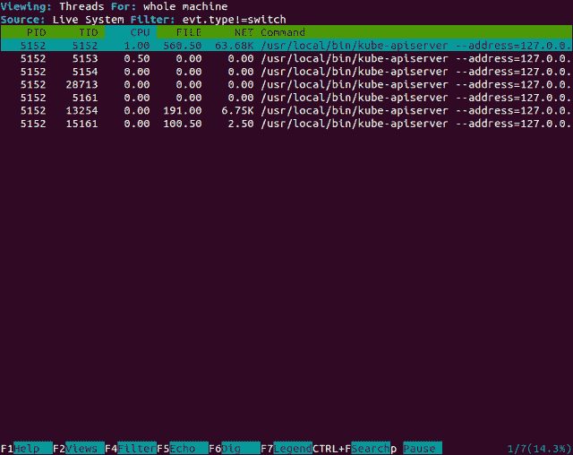

# 监控和日志记录

本章将涵盖对我们的 Kubernetes 集群中内置和第三方监控工具的使用和自定义。我们将介绍如何使用这些工具来监视我们集群的健康和性能。此外，我们还将研究内置日志记录、**Google Cloud Logging** 服务和 **Sysdig**。

本章将讨论以下主题：

+   Kubernetes 如何使用 cAdvisor、Heapster、InfluxDB 和 Grafana

+   自定义默认 Grafana 仪表盘

+   使用 FluentD 和 Grafana

+   安装和使用日志记录工具

+   使用流行的第三方工具，如 StackDriver 和 Sysdig，来扩展我们的监控能力

# 监控操作

实际监控远不止检查系统是否正常运行。尽管像你在第二章中学到的那样，*Pods、Services、Replication Controllers 和 Labels* 中的 *健康检查* 部分所学的可以帮助我们隔离问题应用程序。但是，只有在系统下线之前能够预见问题并加以缓解时，运营团队才能最好地为业务服务。

监控的最佳实践是测量核心资源的性能和使用情况，并观察是否存在偏离正常基线的趋势。容器在这方面也不例外，管理我们的 Kubernetes 集群的一个关键组件是清晰地了解所有节点上的操作系统、网络、系统（CPU 和内存）和存储资源的性能和可用性。

在本章中，我们将研究几种选项，以监控和测量所有集群资源的性能和可用性。此外，当出现异常趋势时，我们还将查看一些警报和通知选项。

# 内置监控

如果你回忆一下第一章中关于 Kubernetes 的介绍，我们注意到我们的节点已经运行了许多监控服务。我们可以通过以下方式再次运行 `get pods` 命令，并指定 `kube-system` 命名空间来查看这些服务：

```
$ kubectl get pods --namespace=kube-system

```

以下截图是上述命令的结果：


系统 Pod 列表

再次看到了各种各样的服务，但这一切又是如何结合在一起的呢？如果你回忆一下第二章中关于 *节点（原名为 minions）* 部分，每个节点都在运行一个 kublet。Kublet 是节点与 API 服务器交互和更新的主要接口。其中一个更新是节点资源的 **度量值**。实际上，资源使用情况的报告由一个名为 **cAdvisor** 的程序执行。

cAdvisor 是 Google 的另一个开源项目，提供了有关容器资源使用情况的各种指标。指标包括 CPU、内存和网络统计信息。不需要告诉 cAdvisor 关于单个容器的信息；它会收集节点上所有容器的指标，并将其报告给 kublet，然后再报告给 Heapster。

**Google 的开源项目** Google 有许多与 Kubernetes 相关的开源项目。查看它们，使用它们，甚至贡献您自己的代码！

cAdvisor 和 Heapster 在下一节中提到：

+   **cAdvisor**: [`github.com/google/cadvisor`](https://github.com/google/cadvisor)

+   **Heapster**: [`github.com/kubernetes/heapster`](https://github.com/kubernetes/heapster)

**Contrib** 是各种不属于核心 Kubernetes 的组件的集合。其位置在：

[`github.com/kubernetes/contrib`](https://github.com/kubernetes/contrib).

**LevelDB** 是 InfluxDB 创建时使用的键存储库。其位置在：

[`github.com/google/leveldb`](https://github.com/google/leveldb).

**Heapster** 是 Google 的又一个开源项目；你可能开始看到这里出现了一个主题（参见前面的信息框）。Heapster 在一个 minion 节点上的容器中运行，并从 kublet 聚合数据。提供了一个简单的 REST 接口来查询数据。

使用 GCE 设置时，为我们设置了一些额外的包，这为我们节省了时间，并提供了一个完整的包来监视我们的容器工作负载。从前面的 *系统 pod 列表* 截图中可以看到，还有另一个带有 `influx-grafana` 的 pod。

**InfluxDB** 在其官方网站上描述如下（您可以在本章末尾的 *参考* 部分的第 1 点中找到更多详细信息）：

一个没有外部依赖的开源分布式时间序列数据库。

InfluxDB 基于一个键存储包（参考前面的 *Google 的开源项目* 信息框）构建，并且非常适合存储和查询事件或者时间统计信息，例如由 Heapster 提供的那些。

最后，我们有 **Grafana**，它为存储在 InfluxDB 中的数据提供了仪表板和图形界面。使用 Grafana，用户可以创建自定义监控仪表板，并立即查看其 Kubernetes 集群的健康状况，因此也可以查看其整个容器基础架构的健康状况。

# 探索 Heapster

让我们通过 SSH 快速查看 Heapster pod 所在节点的 REST 接口。首先，我们可以列出 pod 来找到运行 Heapster 的 pod，如下所示：

```
$ kubectl get pods --namespace=kube-system

```

pod 的名称应以 `monitoring-heapster` 开头。运行 `describe` 命令查看它运行在哪个节点上，如下所示：

```
$ kubectl describe pods/<Heapster monitoring Pod> --namespace=kube-system

```

从下面的截图输出中，我们可以看到该 pod 正在 `kubernetes-minion-merd` 上运行。另外，请注意下方几行中的 pod IP，因为我们稍后会用到它：


Heapster Pod 详细信息

接下来，我们可以使用熟悉的 `gcloud ssh` 命令 SSH 到这台机器，如下所示：

```
$ gcloud compute --project "<Your project ID>" ssh --zone "<your gce zone>" "<kubernetes minion from describe>"

```

从这里，我们可以直接使用 pod 的 IP 地址访问 Heapster REST API。请记住，Pod IP 不仅在容器中路由，而且还在节点本身上路由。`Heapster` API 在端口 `8082` 上监听，并且我们可以在 `/api/v1/metric-export-schema/` 获取完整的指标列表。

现在让我们通过向我们从 `describe` 命令保存的 Pod IP 地址发出 `curl` 命令来查看列表，如下所示：

```
$ curl -G <Heapster IP from describe>:8082/api/v1/metric-export-schema/

```

我们将看到一个相当长的列表。第一部分显示所有可用的指标。最后两部分列出了我们可以按其过滤和分组的字段。为了您的方便，我添加了以下略微易读一些的表格：

| **指标** | **描述** | **单位** | **类型** |
| --- | --- | --- | --- |
| 正常运行时间 | 容器启动以来的毫秒数 | 毫秒 | 累计 |
| cpu/使用率 | 所有核心上的累计 CPU 使用率 | 纳秒 | 累计 |
| cpu/限制 | 毫核 CPU 限制 | - | 测量值 |
| 内存/使用量 | 总内存使用量 | 字节 | 测量值 |
| 内存/工作集 | 总工作集使用量；工作集是内核正在使用且不容易丢弃的内存 | 字节 | 测量值 |
| 内存/限制 | 内存限制 | 字节 | 测量值 |
| 内存/页面错误 | 页面错误数 | - | 累计 |
| 内存/主要页面错误 | 主要页面错误数 | - | 累计 |
| 网络/接收 | 累计接收到网络的字节数 | 字节 | 累计 |
| 网络/接收错误 | 接收到网络时的累计错误数 | - | 累计 |
| 网络/发送 | 累计发送到网络的字节数 | 字节 | 累计 |
| 网络/发送错误 | 发送到网络时的累计错误数 | - | 累计 |
| 文件系统/使用量 | 文件系统上消耗的总字节数 | 字节 | 测量值 |
| 文件系统/限制 | 文件系统总大小（以字节为单位） | 字节 | 测量值 |
| 文件系统/可用 | 文件系统中剩余的可用字节数 | 字节 | 测量值 |

表 6.1。可用的 Heapster 指标

| **字段** | **描述** | **标签类型** |
| --- | --- | --- |
| `nodename` | 容器运行的节点名称 | 通用 |
| `hostname` | 容器运行的主机名 | 通用 |
| `host_id` | 特定于主机的标识符，由云提供商或用户设置 | 通用 |
| `container_base_image` | 在容器内运行的用户定义的镜像名称 | 通用 |
| `container_name` | 容器的用户提供的名称或系统容器的完整容器名称 | 通用 |
| `pod_name` | Pod 的名称 | Pod |
| `pod_id` | Pod 的唯一 ID | Pod |
| `pod_namespace` | Pod 的命名空间 | Pod |
| `namespace_id` | Pod 命名空间的唯一 ID | Pod |
| `labels` | 用户提供的标签的逗号分隔列表 | Pod |

表 6.2。可用的 Heapster 字段

# 自定义我们的仪表板

现在我们有了字段，我们可以玩得开心了。回想一下我们在第一章中看到的 Grafana 页面，*Kubernetes 入门*。让我们再次打开它，方法是转到我们集群的监控 URL。请注意，您可能需要使用您的集群凭据登录。请参考您需要使用的链接的以下格式：

`https://**<your master IP>**/api/v1/proxy/namespaces/kube-system/services/monitoring-grafana`

我们将看到默认的主页仪表板。点击主页旁边的向下箭头，选择集群。这将显示 Kubernetes 集群仪表板，现在我们可以向面板添加我们自己的统计数据。滚动到底部，点击添加一行。这应该会创建一个新行的空间，并在屏幕左侧显示一个绿色标签。

让我们首先为每个节点（minion）添加一个文件系统使用情况的视图。点击*绿色*标签以展开，然后选择 添加面板，然后选择图表。屏幕上应该会出现一个空图表以及我们自定义图表的查询面板。

此面板中的第一个字段应显示以“SELECT mean("value") FROM ...”开头的查询。点击该字段旁边的 A 字符以展开它。将下一个字段留在 FROM 旁边默认设置，并点击下一个字段以选择测量值。下拉菜单中将显示我们在前面表格中看到的 Heapster 指标。选择 `filesystem/usage_bytes_gauge`。现在，在 SELECT 行中，点击 mean()，然后点击 x 符号将其删除。接下来，点击该行末尾的+ 符号并添加选择器 -> max。然后，您会看到一个 GROUP BY 行，其中包含 time($interval)和 fill(none)。小心地点击 fill 而不是 (none) 部分，然后再次点击 x 符号将其删除。然后，点击该行末尾的+ 符号并选择标签（hostname）。

最后，在屏幕底部，我们应该看到一个按时间间隔分组。在那里输入`5s`，你应该会看到类似以下截图的东西：


Heapster pod 详细信息

接下来，让我们点击轴标签，以便设置单位和图例。在左 Y 轴下，点击单位旁边的字段，将其设置为 data -> bytes，标签设置为磁盘空间已用。在右 Y 轴下，将单位设置为 none -> none。接下来，在 图例 标签下，确保选中在选项中显示和在值中最大化。

现在，让我们快速转到通用标签并选择一个标题。在我的情况下，我将其命名为`节点的文件系统磁盘使用情况（最大值）`。

我们不想丢失我们创建的这张漂亮的新图表，所以让我们点击右上角的保存图标。它看起来像一个*软盘*（如果你不知道这是什么，你可以进行谷歌图片搜索）。

在我们点击保存图标后，我们会看到一个绿色的对话框，确认仪表板已保存。现在我们可以点击位于图表详细信息面板上方和图表本身下方的 x 符号。

这将带我们返回仪表板页面。如果我们一直往下滚动，我们会看到我们的新图形。让我们在这一行再添加另一个面板。再次使用*绿色*标签，然后选择 Add Panel -> singlestat。又一次，一个空面板将出现，下面是一个设置表单。

假设我们想要监视特定节点并监视网络使用情况。我们可以首先转到 Metrics 选项卡来轻松完成这项任务。然后展开查询字段，并将 FROM 字段中的第二个值设置为 network/rx。现在，我们可以通过点击行末尾的+符号并从下拉菜单中选择主机名，在 WHERE 子句中指定条件。在 hostname = 后点击 select tag value，并从列表中选择一个 minion 节点。

最后，将**mean()**留给第二个 SELECT 字段：


Singlestat 选项

在 Options 选项卡中，确保 Unit format 设置为 data -> bytes，然后在 Spark lines 旁的 Show 框中打勾。**sparkline**可以让我们快速查看价值的最近变化历史。我们可以使用 Background mode 来占据整个背景；默认情况下，它使用值下面的区域。

在 Coloring 中，我们可以选择 Value 或 Background 框并选择 Thresholds and Colors。这将使我们能够根据我们指定的阈值层选择不同颜色的值。请注意，阈值数必须使用未格式化版本。

现在，让我们返回到 General 选项卡，并将标题设置为`Network bytes received (Node35ao)`。使用您的 minion 节点的标识符。再次保存我们的工作并返回仪表板。我们现在应该有一个类似以下截图的行：


自定义仪表板面板

Grafana 还有其他许多不同类型的面板供您尝试，例如仪表板列表、插件列表、表格和文本。

正如我们所看到的，构建自定义仪表板并一目了然地监视我们集群的健康状况非常容易。

# FluentD 和 Google Cloud Logging

回顾一下本章一开始的*System pod listing*截图，你可能会注意到一些以`fluentd-cloud-logging-kubernetes...`开头的 pod。在使用 GCE 供应商为您的 K8s 集群提供服务时，这些 pod 会出现。我们集群中的每个节点都有一个这样的 pod，其唯一目的是处理 Kubernetes 日志的处理。

如果我们登录到我们的 Google Cloud Platform 帐户，就可以看到一些在那里处理的日志。只需在左侧，在 Stackdriver 下选择 Logging。这将带我们到一个带有顶部多个下拉菜单的日志列表页面。如果这是您第一次访问该页面，第一个下拉菜单可能会被设定为 Cloud HTTP Load Balancer。

在此下拉菜单中，我们将看到许多 GCE 类型的条目。选择 GCE VM 实例，然后选择 Kubernetes 主节点或其中一个节点。在第二个下拉菜单中，我们可以选择各种日志组，包括 kublet。我们还可以按事件日志级别和日期进行过滤。此外，我们可以使用*播放*按钮实时观看事件流：


Google Cloud Logging 过滤器

# FluentD

现在我们知道 `fluentd-cloud-logging-kubernetes` pods 正在将数据发送到 Google Cloud，但是我们为什么需要 FluentD？简而言之，**FluentD** 是一个收集器。它可以配置为具有多个来源来收集和标记日志，然后将其发送到各种输出点进行分析、报警或存档。我们甚至可以在将数据传递给目的地之前使用插件转换数据。

并非所有的提供商设置都默认安装了 FluentD，但这是一种推荐的方法，可以为我们未来的监控运营提供更大的灵活性。AWS Kubernetes 设置也使用 FluentD，但是将事件转发到**Elasticsearch**。

**探索 FluentD** 如果你对 FluentD 设置的内部工作原理感到好奇，或者只是想自定义日志收集，我们可以很容易地使用 `kubectl exec` 命令和本章前面运行的一个 pod 名称进行探索。

首先，让我们看看是否可以找到 FluentD 的 `config` 文件：

`**$ kubectl exec fluentd-cloud-logging-kubernetes-minion-group-r4qt --namespace=kube-system -- ls /etc/td-agent**`

我们将在 `etc` 文件夹中查找，然后在 `td-agent` 文件夹中查找，这是 `fluent` 子文件夹。在这个目录中搜索时，我们应该看到一个 `td-agent.conf` 文件。我们可以使用简单的 `cat` 命令查看该文件，如下所示：

`**$ kubectl exec fluentd-cloud-logging-kubernetes-minion-group-r4qt --namespace=kube-system -- cat /etc/td-agent/td-agent.conf**`

我们应该看到许多来源，包括各种 Kubernetes 组件、Docker 和一些 GCP 元素。

虽然我们可以在这里进行更改，但请记住这是一个正在运行的容器，如果 pod 死亡或重新启动，我们的更改将不会被保存。如果我们真的想自定义，最好使用这个容器作为基础构建一个新的容器，将其推送到存储库以供以后使用。

# 完善我们的监控运营

虽然 Grafana 为我们提供了一个监控容器运营的良好起点，但它仍然是一个正在进行中的工作。在运营的真实世界中，一旦我们知道有问题，拥有完整的仪表板视图就很棒。然而，在日常场景中，我们更愿意采取积极主动的方式，实际上在问题出现时收到通知。这种报警能力对于让运营团队保持领先并避免*被动模式*至关重要。

在这个空间中有许多可用的解决方案，我们将特别关注两个——GCE 监控（StackDriver）和 Sysdig。

# GCE（StackDriver）

**StackDriver** 是公共云基础设施的绝佳起点。实际上，它由 Google 拥有，因此作为 Google 云平台监控服务进行集成。在您的锁定警报开始响起之前，StackDriver 还具有与 AWS 的良好集成。此外，StackDriver 还具有警报功能，支持向各种平台发送通知，并支持用于其他内容的 Webhook。

# 注册 GCE 监控

在 GCE 控制台中，在**Stackdriver**部分点击**监控**。这将打开一个新窗口，我们可以在其中注册 Stackdriver 的免费试用。然后，我们可以添加我们的 GCP 项目，以及可选的 AWS 帐户。这需要一些额外的步骤，但页面上包含了说明。最后，我们将收到有关如何在我们的集群节点上安装代理的说明。我们现在可以跳过这一步，但一会儿会回来。

点击**继续**，设置您的每日警报，然后再次点击**继续**。

点击**启动监控**继续。我们将被带到主仪表板页面，在那里我们将看到集群中节点的一些基本统计信息。如果我们从侧边栏中选择**资源**，然后选择**实例**，我们将被带到列出所有节点的页面。通过点击单个节点，即使没有安装代理，我们也可以再次看到一些基本信息。

Stackdriver 还提供可安装在节点上的监控和日志代理。但是，它当前不支持 GCE `kube-up` 脚本中默认使用的容器 OS。您仍然可以查看 GCE 或 AWS 中任何节点的基本指标，但如果您想要详细的代理安装，则需要使用另一个操作

# 警报

接下来，我们可以查看作为监控服务一部分提供的警报策略。从实例详细信息页面，点击页面顶部的**创建警报策略**按钮。

我们会点击**添加条件**，并选择一个指标阈值。在**目标**部分，将**资源类型**设置为实例（GCE）。然后，将**适用于**设置为组和 kubernetes。将**条件触发如果**设置为任何成员违反。

在**配置**部分，将**如果指标**保持为 CPU 使用率（GCE 监控），将**条件**保持为上述。现在将**阈值**设置为`80`，并将时间设置为 5 分钟。

点击保存条件：


Google Cloud 监控警报策略

接下来，我们将添加一个通知。在**通知**部分，将**方法**保持为电子邮件，并输入您的电子邮件地址。

我们可以跳过**文档**部分，但这是我们可以添加文本和格式到警报消息的地方。

最后，将策略命名为`过高的 CPU 负载`，然后点击**保存策略**。

现在，每当我们的实例之一的 CPU 使用率超过 80％，我们将收到电子邮件通知。如果我们需要审查我们的策略，我们可以在**警报**下拉菜单中找到它们，然后在屏幕左侧的菜单中找到**策略概览**。

# 超越系统监控与 Sysdig

监控我们的云系统是一个很好的开始，但是对于容器本身的可见性呢？虽然有各种各样的云监控和可见性工具，但 Sysdig 以其不仅可以深入了解系统操作而且特别是容器而脱颖而出。

Sysdig 是开源的，并被称为*具有对容器的本地支持的通用系统可见性工具*（您可以在本章末尾的*参考资料*部分的第 2 点中了解更多详情）。它是一个命令行工具，可以提供我们之前看过的领域的见解，例如存储、网络和系统进程。它的独特之处在于提供了这些进程和系统活动的详细信息和可见性水平。此外，它对容器有本地支持，这为我们提供了我们容器操作的全貌。这是您容器操作工具库中强烈推荐的工具。Sysdig 的主要网站是 [`www.sysdig.org/`](http://www.sysdig.org/)。

# Sysdig Cloud

我们将马上看一下 Sysdig 工具和一些有用的基于命令行的用户界面。然而，Sysdig 团队还开发了一款商业产品，名为**Sysdig Cloud**，提供了我们在本章前面讨论过的高级仪表板、警报和通知服务。此外，这里的区别在于对容器的高可见性，包括我们应用程序拓扑的一些漂亮的可视化效果。

如果您宁愿跳过*Sysdig Cloud*部分，只想尝试命令行工具，请直接跳到本章后面的*Sysdig 命令行*部分。

如果您还没有注册，请在 [`www.sysdigcloud.com`](http://www.sysdigcloud.com) 上注册 Sysdig Cloud。

第一次激活并登录后，我们将被带到一个欢迎页面。点击“下一步”，我们将看到一个页面，其中有各种选项可以安装`sysdig`代理。对于我们的示例环境，我们将使用 Kubernetes 设置。选择 Kubernetes 将为您提供一个带有 API 密钥和指令链接的页面。该指令将指导您如何在集群上创建 Sysdig 代理 DaemonSet。不要忘记在安装页面上添加 API 密钥。

在代理连接之前，我们将无法继续安装页面。创建 DaemonSet 并等待片刻后，页面应继续到 AWS 集成页面。如果您愿意，您可以填写此表单，但是对于本次演练，我们将点击“跳过”。然后，点击“让我们开始吧”。

就目前而言，Sysdig 和 Sysdig Cloud 与 GCE `kube-up` 脚本默认部署的最新容器操作系统不完全兼容，该操作系统是谷歌的 Container-Optimized OS：[`cloud.google.com/container-optimized-os/docs`](https://cloud.google.com/container-optimized-os/docs)。

我们将被带到主 Sysdig Cloud 仪表板屏幕。在 Explore 选项卡下，我们应该看到至少两个 minion 节点。我们应该看到类似以下带有我们的 minion 节点的截图：


Sysdig Cloud 探索页面

此页面显示了一个表格视图，左侧的链接让我们探索一些关键的 CPU、内存、网络等指标。虽然这是一个很好的开始，但详细视图将让我们更深入地了解每个节点。

# 详细视图

让我们来看看这些视图。选择其中一个 minion 节点，然后滚动到下方出现的详细部分。默认情况下，我们应该看到 System: Overview by Process 视图（如果未选中，请从左侧的列表中单击它）。如果图表难以阅读，只需点击每个图表左上角的最大化图标即可获得更大的视图。

有各种有趣的视图可供探索。仅列出其中一些，Services | HTTP Overview 和 Hosts & Containers | Overview by Container 为我们提供了一些很棒的图表供检查。在后一视图中，我们可以看到容器的 CPU、内存、网络和文件使用情况统计。

# 拓扑视图

此外，底部还有三个拓扑视图。这些视图非常适合帮助我们了解我们的应用程序如何通信。点击 Topology | Network Traffic，等待几秒钟让视图完全填充。它应该看起来类似以下截图：


Sysdig Cloud 网络拓扑视图

我们注意到视图将集群中的 minion 节点与主节点之间的通信流量进行了映射。您还可以在节点方框的右上角看到一个 + 符号。点击其中一个 minion 节点，然后使用视图区域顶部的缩放工具放大到细节，如下面的截图所示：


Sysdig Cloud 网络拓扑详细视图

请注意，现在我们可以看到运行在主节点内的 Kubernetes 的所有组件。我们可以看到各种组件是如何协同工作的。我们将看到 `kube-proxy` 和 `kublet` 进程正在运行，以及一些带有 Docker 鲸鱼标志的方框，这表示它们是容器。如果我们放大并使用加号图标，我们将看到这些是我们的 Pod 和核心 Kubernetes 进程的容器，就像我们在第一章 Chapter 1，*Introduction to* *Kubernetes* 中运行在主节点上的服务部分中所见到的一样。

此外，如果您的监控节点中包括了主节点，我们可以观察 `kublet` 从 minion 发起通信，并一直跟踪到主节点中的 `kube-apiserver` 容器。

我们甚至有时可以看到实例与 GCE 基础架构进行通信以更新元数据。此视图非常适合形成我们的基础架构和底层容器之间如何通信的心理图像。

# 指标

接下来，让我们切换到左侧菜单旁边的 Metrics 标签。在这里，还有各种有用的视图。

让我们来看看 System 中的 `capacity.estimated.request.total.count`。这个视图向我们展示了一个节点在完全加载时可以处理多少请求的估计值。这对基础设施规划非常有用：


Sysdig Cloud 容量估算视图

# 警报

现在我们有了所有这些很棒的信息，让我们创建一些通知。滚动到页面顶部，找到一个 minion 条目旁边的铃铛图标。这将打开一个创建警报的对话框。在这里，我们可以设置类似于本章前面所做的手动警报。但是，还有使用 **BASELINE** 和 **HOST COMPARISON** 的选项。

使用 **BASELINE** 选项非常有帮助，因为 Sysdig 将监视节点的历史模式，并在任何一个指标偏离预期指标阈值时向我们发出警报。不需要手动设置，因此这可以真正节省通知设置的时间，并帮助我们的运维团队在问题出现之前采取主动措施。请参考以下图片：


Sysdig Cloud 新警报

**HOST COMPARISON** 选项也是一个很好的帮助，因为它允许我们将指标与其他主机进行比较，并在一个主机具有与组不同的指标时发出警报。一个很好的用例是监视 minion 节点之间的资源使用情况，以确保我们的调度约束没有在集群的某个地方创建瓶颈。

您可以选择任何您喜欢的选项并给它一个名称和警告级别。启用通知方法。Sysdig 支持电子邮件，**SNS**（简称**简单通知服务**）和 **PagerDuty** 作为通知方法。您还可以选择启用 **Sysdig Capture** 以更深入地了解问题。一切都设置好后，只需点击创建，您就会开始收到问题警报。

# sysdig 命令行

无论您只使用开源工具还是尝试完整的 Sysdig Cloud 套装，命令行实用程序都是跟踪问题或更深入了解系统的绝佳伴侣。

在核心工具中，有一个主要的 `sysdig` 实用程序，还有一个名为 `csysdig` 的命令行样式的用户界面。让我们看看一些有用的命令。

在这里找到您操作系统的相关安装说明：

[`www.sysdig.org/install/`](http://www.sysdig.org/install/)

安装完成后，让我们首先查看网络活动最多的进程，发出以下命令：

```
$ sudo sysdig -pc -c topprocs_net

```

以下截图是前面命令的结果：


按网络活动排名的 Sysdig 高级进程

这是一个交互式视图，将向我们显示网络活动最多的顶级进程。此外，还有大量可与 `sysdig` 一起使用的命令。尝试一下其他几个有用的命令，包括以下内容：

```
$ sudo sysdig -pc -c topprocs_cpu
$ sudo sysdig -pc -c topprocs_file
$ sudo sysdig -pc -c topprocs_cpu container.name=<Container Name NOT ID>

```

更多示例可以在[`www.sysdig.org/wiki/sysdig-examples/`](http://www.sysdig.org/wiki/sysdig-examples/)找到。

# csysdig 命令行 UI

因为我们在一个节点的 shell 上并不意味着我们不能拥有一个 UI。Csysdig 是一个可定制的 UI，用于探索 Sysdig 提供的所有指标和洞察力。只需在提示符下键入`csysdig`：

```
$ csysdig

```

进入 csysdig 后，我们看到机器上所有进程的实时列表。在屏幕底部，您会注意到一个带有各种选项的菜单。点击 Views 或按下*F2*（如果您喜欢使用键盘）。在左侧菜单中，有各种选项，但我们将查看线程。双击以选择线程。

在某些操作系统和某些 SSH 客户端上，您可能会遇到功能键的问题。检查终端的设置，并确保功能键使用 VT100+序列。

我们可以看到当前系统上所有正在运行的线程以及一些关于资源使用情况的信息。默认情况下，我们看到的是一个经常更新的大列表。如果我们点击过滤器，*F4*用于鼠标受挑战者，我们可以简化列表。

在过滤框中键入`kube-apiserver`（如果您在主节点上）或`kube-proxy`（如果您在节点（minion）上），然后按*Enter*。视图现在仅过滤该命令中的线程：



Csysdig 线程

如果我们想进一步检查，我们可以简单地选择列表中的一个线程，然后点击 Dig 或按下*F6*。现在我们可以实时查看来自命令的系统调用的详细列表。这可以是一个非常有用的工具，可以深入了解我们集群上正在运行的容器和处理。

点击“返回”或按下*Backspace*键返回上一个屏幕。然后，再次转到“Views”。这次，我们将查看容器视图。再次，我们可以过滤并且还可以使用 Dig 视图来更深入地查看发生在系统调用级别的情况。

在这里你可能注意到的另一个菜单项是 Actions，在最新版本中可用。这些功能使我们能够从进程监视转到操作和响应。它使我们能够从 csysdig 的各种进程视图中执行各种操作。例如，容器视图具有进入 bash shell、杀死容器、检查日志等操作。值得了解各种操作和快捷键，甚至添加您自己的常见操作的自定义快捷键。

# Prometheus

监控领域的一个新手是一个名为**Prometheus**的开源工具。Prometheus 是一个由 SoundCloud 团队构建的开源监控工具。您可以从[`prometheus.io`](https://prometheus.io)了解更多关于该项目的信息。

他们的网站提供以下功能（您可以在本章末尾的*参考资料*中查看更多关于此的详细信息）：

+   一个多维度的[数据模型](https://prometheus.io/docs/concepts/data_model/)（由度量名称和键/值对标识的时间序列）

+   一个[灵活的查询语言](https://prometheus.io/docs/querying/basics/)来利用这种多维性

+   不依赖于分布式存储；单服务器节点是自主的

+   时间序列收集通过 HTTP 的拉模型实现

+   通过一个中间网关支持[推送时间序列](https://prometheus.io/docs/instrumenting/pushing/)

+   目标通过服务发现或静态配置发现

+   多种图形和仪表板支持模式

CoreOS 在这里有一篇关于如何在 Kubernetes 中设置 Prometheus 的好博文：

[`coreos.com/blog/monitoring-kubernetes-with-prometheus.html`](https://coreos.com/blog/monitoring-kubernetes-with-prometheus.html)

# 总结

我们简要了解了如何使用 Kubernetes 监控和记录。现在您应该对 Kubernetes 如何使用 cAdvisor 和 Heapster 收集给定集群中所有资源的指标有所了解。此外，我们还看到 Kubernetes 通过提供 InfluxDB 和 Grafana 设置和配置可以为我们节省时间。仪表板可以根据我们的日常运营需求进行轻松定制。

此外，我们还查看了使用 FluentD 和 Google 云日志服务的内置日志功能。此外，Kubernetes 通过为我们设置基础提供了极大的节约时间。

最后，您了解了监控我们的容器和集群的各种第三方选项。使用这些工具将使我们能够更深入地了解我们应用程序的健康和状态。所有这些工具结合在一起，为我们提供了一个扎实的工具集来管理我们的日常运营。

在下一章中，我们将探讨新的集群联邦功能。尽管仍然主要处于测试阶段，但这个功能将允许我们在不同数据中心甚至云中运行多个集群，但通过单一控制平面管理和分发应用程序。

# 参考文献

1.  [`stackdriver.com/`](http://stackdriver.com/)

1.  [`www.sysdig.org/wiki/`](http://www.sysdig.org/wiki/)

1.  [`prometheus.io/docs/introduction/overview/`](https://prometheus.io/docs/introduction/overview/)
